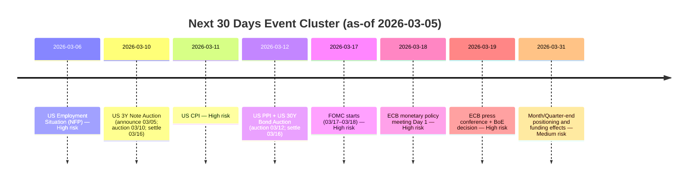

# Corporate & Investment Banking Weekly CRO Risk Intelligence Brief

**As-of timestamp (all market data): 11:23 AM ET, 2026-03-05** (unless explicitly flagged as *stale/close-only* or *delayed*).
**Reporting period (assumed): 2026-02-27 to 2026-03-05 (prior 7 days ending today).**
**Forward outlook:** primary **1–4 weeks**, secondary **1–3 months**.
**Scope note:** Firm-specific exposures, VaR/ES, limits, counterparty concentrations, and operational incidents are **[internal]** and are not invented; this brief provides **market-anchored proxies** and **normalized sensitivity translation tables** so desks can substitute internal numbers.

## Executive risk summary and CRO dashboard

### Executive summary
Risk conditions tightened over the reporting period as geopolitics (Middle East conflict dynamics) drove an **energy-led inflation risk shock**, pushing **oil higher** while **equity volatility rose** and **rates sold off** (higher yields).
At the same time, **systemic credit stress indicators remain contained**: **IG and HY option-adjusted spreads** are **tight to moderate** and net tightened over the past week (per ICE BofA OAS), suggesting that the selloff is not (yet) a classic credit-led risk-off.
The near-term risk balance is skewed to **tail events** (oil supply disruption, policy reaction function pivot, EM FX stress), implying **higher marginal value of hedges** and **tighter risk governance** into the next macro and central-bank event cluster (jobs, inflation prints, FOMC/ECB/BoE).

### CRO dashboard

#### Overall risk posture recommendation
**☑ CAUTIOUS (maintain core exposures; selective hedging; tighten intraday risk governance).**
**Rationale (≤3 sentences):** Volatility is rising (VIX up double-digits on the day and above ~23), oil is sharply higher, and rates are repricing higher in a manner consistent with inflation-risk rather than growth-risk.  Credit stress remains broadly contained (IG/HY OAS levels and weekly changes) but is vulnerable to second-round effects if energy-driven inflation forces a hawkish policy pivot or if risk aversion hits funding/EM channels.

#### Firm-wide risk heat map
| Risk Category | Current Level | Trend | 1-Week Direction | Primary Driver |
|---|---:|---:|---:|---|
| Market Risk | 🔴 | ↑ | Worsening | Energy shock + vol repricing + rates selloff  |
| Credit Risk | 🟡 | →/↑ | Mixed | Spreads contained but tail-sensitive to macro/geopolitics  |
| Liquidity Risk | 🟡 | → | Stable | Front-end rates stable; watch quarter-end balance sheet effects  |
| Operational Risk | 🟡 | → | [internal] | Elevated change/event load; monitor settlement/margin workflows |
| Counterparty Risk | 🟡 | ↑ | [internal] | Directional stress could hit HF/commodities margins first |
| Concentration Risk | 🟡 | → | [internal] | Concentrations require internal mapping to shock scenarios |
| Regulatory Risk | 🟡 | → | Stable | Heightened focus on market shocks, stress test governance  |
| Geopolitical Risk | 🔴 | ↑ | Worsening | Middle East escalation + shipping/energy supply uncertainty  |
| Model Risk | 🟡 | ↑ | Worsening | Regime shift risk: volatility + correlation breakdown vs calibration |
| Reputational/ESG Risk | 🟡 | ↑ | Worsening | Sanctions/defense/energy exposure scrutiny; conduct risk |

#### Top priority risks (ranked by Probability × Impact × Velocity)
*Impact is shown as a **normalized translation**: substitute desk DV01/CS01/Vega/Delta for dollar estimates.*

| Rank | Risk | Probability | Normalized Impact | Velocity | Affected Desks | Recommended action |
|---:|---|---:|---|---:|---|---|
| 1 | Energy supply shock / escalation drives oil + inflation repricing | Medium-High | **Oil +$10/bbl** ⇒ Commod P&L = (*ΔOil*)×(*$ exposure per $1*) | High | Commodities, Macro rates, FX, Equity vol | Add convex hedges (energy calls; inflation breakeven hedges); tighten stop-loss discipline  |
| 2 | Rates term premium spike into auctions + policy uncertainty | Medium | **+50bp bear steepener** ⇒ Rates P&L ≈ −DV01×50 | High | Rates, MBS, Levered RV | Reduce unhedged duration; pre-position auction hedges; monitor repo/GC  |
| 3 | Equity volatility re-acceleration / systematic deleveraging | Medium | **VIX +10 vol** ⇒ Equity vega P&L ≈ +Vega×10 (if long) | High | Equity delta/vol, multi-asset | Maintain tail hedges; reduce short-gamma where liquidity thin  |
| 4 | USD strength + EM FX stress (oil-importer EM) | Medium | **DXY +2%** ⇒ FX P&L ≈ Net USD exposure ×2% | Medium-High | FX (G10/EM), EM credit | Reduce crowded carry; add EM downside hedges; review sovereign/FX-linked CCP calls  |
| 5 | CRE repricing / securitized spread widening (tail) | Low-Medium | **CMBS/CRE +200bp** ⇒ CS01×200 (structured) | Medium | Securitized, credit, bank HY | Run Fed 2026 stress mapping; reduce weakest-vintage exposure, tighten marks governance  |

#### Top opportunities / dislocations
| Opportunity | Rationale | Risk–Reward | Desk/Strategy | Action |
|---|---|---|---|---|
| Volatility risk premium capture with defined-risk structures | Vol elevated; monetize via spreads (avoid naked short gamma)  | Attractive if risk-defined | Equity vol | Use put spreads / calendars; size to margin stress |
| Credit carry remains supported (so far) | IG/HY OAS levels moderate and tightened over week  | Moderate | Credit | Add carry in higher-quality, liquid tranches with tight stop-outs |
| Rates curve RV around auctions | Auction calendar dense; supply events create dislocations  | Tactical | Rates | Auction concession trades with tight DV01 limits |

#### Critical watchlist items
1. **Energy shock propagation:** monitor oil + refined products + shipping disruption indicators; trigger for immediate hedge scale-up.
2. **Event cluster risk:** payrolls (near-term), CPI/PPI, then FOMC/ECB/BoE week; raise intraday monitoring.
3. **Treasury supply + funding:** coupon auctions and bills; monitor repo/GC and auction tails.

#### Key dates next 14 days
| Date | Event | Risk Level | Affected assets | Preparation required |
|---|---|---:|---|---|
| 2026-03-06 | US Employment Situation (NFP) | 🔴 | Rates, equities, USD, vol | Pre-approve intraday limits; tighten stop-loss and hedge triggers  |
| 2026-03-10 | U.S. 3Y note auction (per tentative schedule) | 🟡 | Front-end/curve | Auction hedges; monitor concession/tail risks  |
| 2026-03-11 | U.S. CPI | 🔴 | Rates, breakevens, equities | Inflate-hedge readiness; monitor cross-asset correlation shifts  |
| 2026-03-12 | U.S. PPI + 30Y bond auction | 🟡🔴 | Rates, duration supply | Reduce long-end convexity risk before auction  |
| 2026-03-17–18 | FOMC meeting (SEP meeting with projections) | 🔴 | Rates, USD, risk assets | Scenario-based hedging, cut/hike probability monitoring  |
| 2026-03-18–19 | ECB monetary policy meeting | 🟡 | EUR rates/FX, EU risk | Watch oil-driven inflation impulse and guidance  |
| 2026-03-19 | BoE rate decision (next due) | 🟡 | GBP rates/FX | Review UK rate-cut expectations sensitivity  |

## Macro regime and cross-asset intelligence

### Global macro regime assessment
**Assumption:** Regime labels reflect a *risk-manager’s composite* of growth nowcasts, inflation nowcasts, policy stance, and market-implied volatility; not a model output.

| Region | Regime | Confidence | Transition risk | Leading indicators |
|---|---|---:|---:|---|
| United States | Late-cycle expansion with inflation-shock risk | Medium | Medium-High | GDPNow Q1 2026 ~3.0% (SAAR); NY Fed staff nowcast Q1 ~2.4%; Cleveland Fed inflation nowcast shows core PCE ~2.87% YoY for Mar (nowcast)  |
| Eurozone | Slowdown/fragile expansion; energy-price pass-through risk | Medium | Medium | ECB policy rates at 2.00% deposit since Jun 2025; market concern about inflation risk resurgence from energy shock  |
| China | Stabilization but confidence-sensitive | Low-Medium | Medium | Yuan dynamics (onshore vs offshore); EM sentiment impacted by oil and USD strength  |
| Japan | Recovery with tightening bias | Medium | Medium | BoJ policy rate raised/around 0.75% (Dec 2025); communications suggest potential for further hikes  |
| EM aggregate | Risk-sensitive expansion | Low-Medium | High | EM FX vulnerability rises with oil and USD strength; hedge fund positioning sensitivity noted in reporting  |

### Regime transition probability matrix (next 3 months)
**Method (governance):** subjective CRO risk committee probabilities anchored to (i) nowcasts (growth/inflation), (ii) event calendar density, (iii) volatility regime.

| From → To | Expansion | Slowdown | Contraction | Recovery |
|---|---:|---:|---:|---:|
| Current US | 45% | 35% | 15% | 5% |
| Current EU | 25% | 45% | 20% | 10% |
| Current China | 30% | 35% | 15% | 20% |

### Central bank policy monitor
**Policy rates are from official sources; market pricing uses CME/FedWatch references where available and is flagged as market-derived.**

| Central bank | Current policy rate | Next meeting | Policy stance | Risk to consensus |
|---|---:|---|---|---|
| Federal Reserve | Target range **3.50%–3.75%** (lower/upper)  | **Mar 17–18, 2026**  | Hold bias; inflation vigilance | Energy-driven inflation shock could delay cuts; market expects hold with high probability (market-derived)  |
| European Central Bank | Deposit **2.00%**, MRO **2.15%**, MLF **2.40%** (effective Jun 2025)  | **Mar 18–19, 2026**  | Pause/duality (inflation vs growth) | Oil shock increases upside inflation risks; banks revising cut expectations  |
| Bank of Japan | Policy rate around **0.75%** (post-Dec 2025)  | Scheduled per BoJ calendar  | Tightening bias | Yen weakness/inflation may force earlier hike path  |
| Bank of England | Bank Rate **3.75%**  | Next due **Mar 19, 2026**  | Cautious easing bias (conditional) | Energy shock can reprice UK inflation and mortgage/swap markets  |
| People's Bank of China | [See note] | [calendar not sourced here] | Managed easing/stability | USD/oil shock can force currency-defense operations (monitor CNH)  |
| SNB, RBA | [not sourced in this brief] | [see official calendars] | [varies] | Global policy divergence risk remains |

**Policy divergence implications (cross-asset):** Rate differentials and risk-off flows support USD resilience (DXY ~99.3) while high oil prices raise EM risk premia, especially for oil importers.

### Growth and inflation nowcasts (US-focused)
| Indicator | Current / nowcast | Update cadence | Interpretation for markets |
|---|---:|---|---|
| Atlanta Fed GDPNow (Q1 2026 SAAR) | **~3.0%** (updated Mar 02)  | event-driven | Supports “growth not collapsing” base case |
| NY Fed Staff Nowcast (Q1 2026) | **~2.4%** with probability bands  | weekly | Reinforces positive-growth baseline |
| Cleveland Fed inflation nowcast (Mar, YoY) | CPI **2.61**, Core CPI **2.60**, PCE **2.81**, Core PCE **2.87** (updated 03/05)  | daily | Core disinflation is present, but oil shock risks re-accelerating headline |
| Cleveland Fed inflation nowcast (Q1 2026 SAAR) | Core PCE **3.25** (nowcast)  | daily | “Sticky core” risk remains above 2% targets |

### Cross-asset performance snapshot
**Notes on data quality:** Real-time/historical quotes from Investing are **indicative** and may not be exchange-provided (source disclaimer).  FRED credit/funding series are generally **T-1** and are flagged.

| Asset | Level | As-of | 1W change (Feb 27 → Mar 05/closest) | Signal |
|---|---:|---|---:|---|
| S&P 500 (derived) | **6,819.44**  | 11:32 ET (indicative) | **−1.04%** (6,878.88 → 6,807.20)  | Mild risk-off |
| VIX | **23.34**  | 11:28 ET | Up sharply today | Vol regime elevated |
| 10Y UST yield | **4.148%**  | 11:23 ET | +~18 bp vs Feb 27 close proxy (DGS10 3.97)  | Inflation/term premium risk |
| 2Y UST yield | **3.576%**  | 10:56 ET (stale) | +~20 bp vs Feb 27 (3.38)  | Front-end repricing |
| IG OAS (ICE BofA) | **0.82%** (close)  | T-1 | **−3 bp** (0.85 → 0.82)  | Credit resilient |
| HY OAS (ICE BofA) | **2.97%** (close)  | T-1 | **−13 bp** (3.10 → 2.97)  | Risk appetite not collapsed |
| DXY | **99.31**  | 11:07 ET | [needs calc] | USD bid in risk-off |
| USD/JPY | **157.59**  | 11:02 ET | [needs calc] | Yen weakness + intervention watch |
| USD/CNH | **6.914**  | 11:18 ET | [needs calc] | China FX pressure channel |
| WTI (futures) | **79.52**  | ~11:28 ET | FRED spot stale; futures reflect shock  | Energy shock driving risk |
| Brent (futures) | **84.73**  | ~11:28 ET | FRED spot stale; futures reflect shock  | Inflation impulse |
| Gold (futures) | **5,090.89**  | 11:13 ET (stale) | [needs calc] | Mixed haven bid |
| MOVE (rates vol) | **70.03** (close Mar 04)  | close-only | From Feb 27 (73.38) to Mar 04 (70.03): **−4.6%**  | Rates vol elevated but off peak |

**Cross-asset correlation regime (assessment):** diversification benefits are **degraded** under an “inflation-supply shock” profile: oil and yields up while equities/credit are vulnerable to repricing. This is an inference from the observed joint moves (not a computed correlation).

## Trading desk risk intelligence by asset class

### Rates complex
**Market state:** UST yields are higher on the week (using close proxies) and intraday levels show continued upward pressure; curve is modestly **positively sloped** (2Y < 10Y), indicating recession-signal inversion is not currently dominant.
**Auction and supply focus:** Treasury auction schedule shows upcoming 3Y/10Y/30Y supply (settling Mar 16) and ongoing bill supply; auction outcomes remain a key catalyst for term premia.

**Key levels (indicative):**
| Instrument | Current | As-of | Key risk note |
|---|---:|---|---|
| UST 2Y | 3.576%  | 10:56 ET | Stale print; validate with desk feeds |
| UST 10Y | 4.148%  | 11:23 ET | Break above 4.10 intensifies convexity hedging risk |
| UST 30Y | 4.762%  | 11:09 ET | Long-end supply sensitivity into auctions |
| Bund 10Y | 2.8517%  | 11:24 ET | EU inflation shock pass-through risk |
| JGB 10Y | 2.153%  | 08:40 ET (stale) | Japan market timing; confirm latest close |

**Rates desk scenarios (normalized P&L):**
| Scenario | Trigger | 10Y move | Curve move | Normalized P&L impact | Probability (1–4w) |
|---|---|---:|---:|---|---:|
| Term premium spike | Weak auctions / supply fear | +40 to +70 bp | Bear steepener | P&L ≈ −DV01_total×(40–70) | Medium |
| Hawkish inflation surprise | CPI/PCE upside | +25 to +60 bp | Bear flattener | −DV01_total×(25–60) + vol losses if short gamma | Medium |
| Flight to quality | Risk-off escalation | −30 to −70 bp | Bull flattener | +DV01_total×(30–70) | Low-Med |
| Liquidity shock | Repo stress / margin | +20 to +50 bp | Dislocated | Nonlinear; depends on financing | Low |

### Credit complex
**Systemic signal:** ICE BofA OAS indicates **contained** investment grade and high yield spreads, with both tightening over the week.  This argues for a **macro/geopolitical volatility shock** rather than a wholesale credit repricing.

**Core metrics (close-only, T-1):**
| Metric | Current | 1W change | Signal |
|---|---:|---:|---|
| IG OAS (ICE BofA) | 0.82%  | −3 bp  | Stable |
| HY OAS (ICE BofA) | 2.97%  | −13 bp  | Stable-to-better |

**Credit risk scenarios (normalized):**
| Scenario | Trigger | IG spread move | HY spread move | Normalized impact | Probability |
|---|---|---:|---:|---|---:|
| Geopolitical risk-off | War escalation | +10–25 bp | +50–150 bp | −CS01_IG×Δ + −CS01_HY×Δ | Medium |
| Recession repricing | Growth roll-over | +30–60 bp | +200–400 bp | −CS01×Δ | Low-Med |
| Idiosyncratic blowups | Single-name defaults | sector-specific | sector-specific | Jump-to-default exposure driven | Medium |

### Equities complex
**Market state:** S&P 500 down about **1%** from Feb 27 to Mar 5 (per historical table) while implied vol is elevated.
**Vol watch:** VIX at ~23 with large day move suggests heightened demand for protection; avoid concentrated short-gamma exposures around event cluster.

**Key levels (indicative):**
| Index | Level | As-of | Risk note |
|---|---:|---|---|
| S&P 500 | 6,819.44  | 11:32 ET | Event cluster near-term |
| Nasdaq (composite close) | 22,807.48  | close Mar 04 | Tech beta risk; use internal NDX exposure |
| VIX | 23.34  | 11:28 ET | Gamma effects and hedge unwind risk |

### FX complex
**USD and safe-haven channel:** DXY ~99.3; USD/JPY ~157.6; CNH around 6.914 and requires intervention watch.
**Operational note:** EM FX and commodities can generate **rapid margin calls** (higher intraday volatility), and FX liquidity can degrade in geopolitical headlines.

**Intervention watch (risk management):**
| Currency | Trigger level (monitor) | Current | Notes |
|---|---|---:|---|
| JPY | Rapid weakening / disorderly move | 157.59  | High political sensitivity; ensure option hedges are sized |
| CNH | Breakout > upper band of recent range | 6.914  | Offshore channel is key for stress transmission |

### Commodities complex
**Energy shock:** WTI ~79.5, Brent ~84.7 intraday; this is the dominant cross-asset driver.
**Inflation linkage:** Higher oil prices feed inflation expectations and central bank reaction function risk (policy “higher for longer”).

### Structured products and securitized
**Regulatory stress alignment is critical:** The Fed 2026 severely adverse scenario includes large declines in **commercial real estate** and **house prices**, highlighting the need to re-test CMBS/CRE exposures under updated supervisory assumptions.
Internal MBS OAS, CPR speeds, and bank demand are **[internal]** and should be mapped to the Fed scenario shock paths.

### Emerging markets
**Transmission channel:** EM risk is pressured by higher oil (for importers) and USD risk-off episodes; reporting indicates EM assets sold off following Iran-related events.
**Desk action:** prioritize liquidity in EM positions; avoid concentrated carry in high-beta currencies into event cluster.

## Enterprise risk metrics and controls

### Firm-wide market risk proxies (external)
**VaR / ES are [internal].** This brief provides proxy indicators that should correlate with rising VaR/ES utilization:

| Proxy | Current | Data quality | Why it matters |
|---|---:|---|---|
| VIX | 23.34  | real-time derived | Equity vol regime; tail risk pricing |
| MOVE | 70.03 (close)  | close-only | Rates vol; impacts convexity, MBS, swaption books |
| IG OAS | 0.82% (close)  | T-1 close | Credit beta; widening tends to raise risk limits utilization |
| HY OAS | 2.97% (close)  | T-1 close | Tail credit stress proxy |

### Liquidity risk monitor (public indicators)
| Metric | Latest | As-of | Stress signal |
|---|---:|---|---|
| SOFR | 3.67%  | 2026-03-04 | Stable; watch quarter-end |
| EFFR | 3.64%  | 2026-03-04 | Anchors policy transmission |
| TGCR | 3.65%  | 2026-03-04 | Repo conditions stable |
| TGCR volume | 1,318 (USD bn)  | 2026-03-04 | Liquidity depth proxy |
| 30-day AA nonfinancial CP (table extract) | 3.68% (as of 03/03)  | close | Funding conditions stable |

**Auction/funding governance:** Treasury bill and coupon calendars must be integrated into liquidity planning; bid-to-cover and acceptances are available through TreasuryDirect releases.

### Counterparty credit risk (CCR) and concentration
All CCR exposures are **[internal]**. The risk governance requirement is to map at least the following stress “multipliers” to top counterparties:

| Stress type | Multiplier to apply to current exposure | Trigger |
|---|---:|---|
| Vol spike | IM add-ons +30% to +80% | VIX > 25; MOVE > 85 (thresholds are firm-defined)  |
| Rates shock | PFE increases proportional to DV01 and convexity | 10Y ±50 bp scenario bundles  |
| Commodity shock | Margin & gap risk nonlinear | Oil +$15–$25 (tail)  |
| FX shock | Wrong-way risk vs sovereign/commodity | USD/JPY stress; CNH stress  |

## Stress testing and scenario analysis

### Regulatory alignment (Fed 2026 stress framework)
The Fed’s 2026 stress test scenario narrative features a sharp rise in unemployment to **10%**, severe market volatility, widening corporate spreads, and large declines in **house prices (~30%)** and **commercial real estate prices (~39%)**.
The proposed scenario documentation indicates equity prices fall about **54%** from the Q4 2025 level to a trough (proposed; final values and paths are in the Fed scenario files).
The Fed also publishes supervisory stress test methodology documentation for 2026, which should anchor internal governance for stress P&L reporting.

**Regulatory mapping guidance (do not invent internal capital):**
For each trading desk, compute **Fed-Scenario P&L** as:

- Rates: **P&L ≈ −DV01×Δy − Convexity×(Δy²)** (if modeled; otherwise DV01 only)
- Credit: **P&L ≈ −CS01×Δspread + JTD losses** (for jump-to-default)
- Equities: **P&L ≈ BetaAdjExposure×Δindex + Vega×Δvol + Gamma terms**
- FX: **P&L ≈ NetNotional×ΔFX**
- Commodities: **P&L ≈ NetNotional×Δprice + optionality**

### Historical stress replay (template for internal portfolio)
| Crisis | Market reference moves | How to translate to the trading book |
|---|---|---|
| 2008–09 GFC | Equities −57%, HY +1600 bp (reference) | Apply −(Equity beta) and +CS01×spread; assume liquidity haircut (internal) |
| 2020 COVID | Equities −34%, HY +600 bp (reference) | Stress funding + margin add-ons; include nonlinear vol |
| 2022 Rate shock | Equities −25%, 10Y +235 bp (reference) | DV01 and convexity dominate; MBS extension risk |

**Note:** Use internal historical libraries and risk factor mappings; external numbers are context-only.

### Hypothetical scenarios (1–3 months) with probabilities and normalized impact
| Scenario | Trigger | Key moves (illustrative) | Probability | Normalized P&L translation |
|---|---|---|---:|---|
| Hawkish Fed shock | Inflation upside + geopolitical inflation | 2Y +50 bp, 10Y +40 bp, USD +2% | 20% | Rates: −DV01×bp; FX: Net×2% |
| Hard landing | Growth breaks; labor market deterioration | S&P −12%, 10Y −60 bp, HY +250 bp | 15% | Equity: beta×−12%; Credit: −CS01×250 |
| Geopolitical escalation | Supply disruption expands | Oil +$20, VIX +12, S&P −10% | 25% | Commod: exposure×$20; Vega×12; beta×−10% |
| Credit contagion | Large default / funding stress | IG +40 bp, HY +300 bp, bank CDS wider | 10% | −CS01×Δ; CCR add-ons |
| Tech bubble unwind | Mega-cap de-rating | Nasdaq −15%, vol +10 | 10% | Equity delta + vega |
| Inflation re-acceleration | Energy pass-through | 10Y +50 bp, breakevens +25 bp | 20% | Rates DV01; inflation CS01 & breakeven exposures |
| US fiscal shock | Auction disruption / political | 10Y +75 bp, USD mixed, vol +8 | 8% | DV01; funding haircuts |
| CRE contagion | Refinancing wall + price drop | CMBS +200 bp, bank equity −15% | 8% | Structured CS01×200; equity beta |
| EM crisis | USD + oil + capital flight | EMBI +350 bp, EM FX −10% | 12% | EM CS01×350; FX net×−10% |
| Positive de-escalation | Ceasefire / oil normalization | Oil −$10, VIX −6, S&P +6% | 12% | Reverse impacts; reduce hedges gradually |

### Reverse stress tests (normalized)
**10% of capital loss (do not compute without internal capital):** Identify the minimal set of shocks that would produce portfolio loss = **0.10×Tier1Capital** using internal risk factor mapping. Trigger candidates likely include: oil +$25 with simultaneous equity −12% and 10Y +60 bp (inflation shock), plus a vol spike.
**25% of capital loss:** Add credit spread shock (HY +400 bp) and liquidity haircut assumptions consistent with the Fed severely adverse narrative.

## Recommendations, action items, and appendices

### Immediate actions
| Priority | Action | Rationale | Owner | Deadline | Risk if not completed |
|---:|---|---|---|---|---|
| 1 | Raise event-week monitoring cadence (daily cross-asset risk call) | Dense event calendar + elevated vol | CRO Office | 2026-03-06 | Missed intraday escalation |
| 2 | Implement energy shock hedge package (defined risk) | Oil is primary propagator into inflation + risk | Commodities Risk + Macro Risk | 2026-03-06 | Unhedged tail losses |
| 3 | Auction-week DV01 guardrails + repo watch | Coupon auctions + funding dynamics | Rates Risk + Treasury | 2026-03-09 | Disorderly rates/financing P&L |
| 4 | CCR margin call dry-run for top 20 counterparties | vol/commodities shocks amplify margin | CCR Head | 2026-03-07 | Operational margin misses |
| 5 | Map trading book to Fed 2026 scenario paths (high-level) | Regulatory alignment and governance | Stress Testing + Market Risk | 2026-03-15 | Gaps in stress reporting under scrutiny  |

### Mermaid chart: timeline of key events (next 30 days)


### Mermaid chart: escalation and decision flow
```mermaid
flowchart TD
    A[Desk-level risk triggers\n(limit utilization, P&L drawdown, margin spikes)] --> B[Market Risk Coverage\nvalidate drivers & cross-asset propagation]
    B --> C{Severity assessment}
    C -->|Amber| D[Desk action plan\nhedges/position trim\nowner + deadline]
    C -->|Red| E[CRO escalation\nsame-day decision window]
    E --> F{Decision}
    F -->|Increase hedges / cut risk| G[Execute hedges + limit actions\nTreasury / Execution desk]
    F -->|Maintain but monitor| H[Enhanced monitoring\nintraday checkpoints]
    F -->|Capital/liquidity concern| I[Enterprise escalation\nCRO + Treasurer + CFO]
    I --> J[Contingency playbook\nfunding actions, CCP liquidity,\nclient communication]
```

### Appendix: auction calendar highlights (official)
Treasury tentative schedule shows upcoming bills and coupon auctions, including 3Y/10Y/30Y (announce Mar 05, auction Mar 10–12, settle Mar 16).
Most recent auction results (example: 42-day bill) include bid-to-cover calculation and accepted/tendered amounts, supporting auction-demand monitoring.

### Appendix: data sources and methodology
**Primary/official sources used:**
- **Treasury auction calendars/results:** U.S. Department of the Treasury via TreasuryDirect PDFs and schedule.
- **Policy rates / calendars:** Fed FOMC calendar ; ECB key rates and calendar ; BoE Bank Rate page ; BoJ schedule documents .
- **Funding reference rates (SOFR/EFFR/TGCR/OBFR):** Federal Reserve Bank of New York via FRED-backed series.
- **Credit spreads (OAS):** ICE BofA series via FRED.
- **Nowcasts:** Federal Reserve Bank of Atlanta GDPNow ; Federal Reserve Bank of Cleveland inflation nowcasting ; NY Fed staff nowcast .
- **Regulatory stress:** Fed 2026 stress test scenarios and press releases/methodology.

**Market-price (non-primary) sources used and flagged as indicative:**
- **Investing.com** for real-time derived market levels (S&P 500, VIX, USD/JPY, etc.).  The site’s own disclaimer states prices may be indicative/not necessarily real-time.
- **Reuters** for narrative drivers and market context (geopolitics, rate expectations).

**Normalized loss estimation methodology (placeholders):**
- **Rates:** P&L = −DV01×Δbp (linear); add convexity where available.
- **Credit:** P&L = −CS01×Δbp plus JTD.
- **Equities:** P&L = BetaAdjExposure×Δ% + Vega×Δvol.
- **FX:** P&L = NetNotional×Δ%.
- **Commodities:** P&L = NetNotional×Δprice; option convexity explicit if present.

### Appendix: data points not verified from primary sources (fallbacks)
- **Intraday equity index levels and some cross-asset quotes** are from Investing.com (indicative, may be derived).
- **Certain global rates (e.g., intraday JGB yields) showed stale timestamps** due to market hours/quote latency; these require internal market data validation.
- **BGCR** value could not be extracted from static HTML (NY Fed page appears to load data dynamically); TGCR and SOFR-based proxies are used instead.
