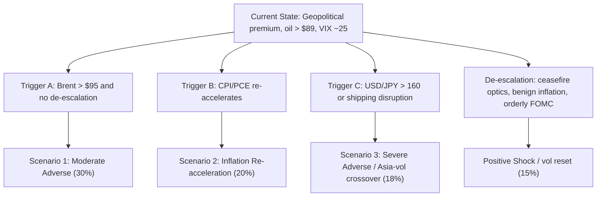

# CIB RISK INTELLIGENCE BRIEF: Weekly BAU Review - Iran Escalation, Oil Shock, and Softer U.S. Labor - As of Today, Friday, March 6, 2026

Date: Friday, March 6, 2026, 10:46 AM ET  
Prepared by: CIB Portfolio Risk Team  
Classification: Internal Use  
Distribution: CIB Risk Leadership  
Reporting Period: Week of March 2, 2026 through March 6, 2026  
Forward Outlook: 1-4 weeks primary, 1-3 months secondary

## Operating Note

This is a public-source, externally verifiable edition of the weekly CRO brief for `today, Friday, March 6, 2026`. Public market, macro, policy, earnings, sanctions, and prediction-market data are populated with current values as of `10:46 AM ET` unless a source publishes with a standard lag; institution-specific metrics that cannot be verified from public sources without fabricating data are explicitly labeled `internal-source required`.

---

## PHASE 1: EVENT INTAKE & ORCHESTRATION

### ENTERPRISE INCIDENT MANAGEMENT (EIM) BOT

- Severity assessment: `3 / Elevated but contained`
- Enterprise escalation beyond normal CRO/CIB distribution: `No`, unless Brent sustains above $95, VIX breaks above 30, or a sanctions/shipping event closes key settlement or funding channels.
- Rationale: the week is being driven by a geopolitical oil shock centered on Iran and Strait of Hormuz risk, but there is still no public evidence of system-wide dealer funding stress, exchange impairment, or disorderly CCP behavior.

### ORCHESTRATOR BOT

1. Dominant themes

| Lens | Classification |
|---|---|
| Geography | Middle East first-order; U.S. macro second-order; Europe and Japan policy spillover; China growth drag in the background |
| Sector | Energy, airlines/transports, financials, rate-sensitive cyclicals, import-heavy consumer sectors |
| Thematic | Geopolitical supply shock, inflation re-acceleration risk, softening U.S. growth, policy divergence, vol repricing |

2. Horizon effects

| Horizon | Assessment |
|---|---|
| Short (1-10d) | Oil and vol dominate; cross-asset de-risking likely to stay event-driven around CPI, PCE, FOMC, BOJ, BOE |
| Medium (10-60d) | Risk shifts to whether energy feeds through breakevens and core inflation enough to slow easing expectations |
| Long (60d+) | Regime question becomes stagflation-lite versus orderly disinflation with geopolitical fade |

3. Stripe coverage

| Stripe | Include | Reason |
|---|---|---|
| Market Risk Bot | x | Primary driver this week; focus on Rates, FX, Equities, Credit Trading, Commodities, Securitized, EM |
| Counterparty Risk Bot | x | Margin and bilateral stress can rise fast in oil, FX, and macro-vol books |
| Credit Risk Bot | x | Energy winners offset transport/consumer/importer pressure; broad migration risk still relevant |
| Liquidity Risk Bot | x | Funding is stable but oil shock plus event calendar can impair market depth and collateral mobility |
| Non-Financial Risk Bot | x | Sanctions, cyber, vendor resilience, and operational readiness matter in a geopolitically charged week |
| Model Risk | o | No public evidence of model breakdown this week; retain routine monitoring only |
| Standalone Compliance | o | Addressed inside Non-Financial Risk via sanctions/financial crimes lens |
| Reputational/ESG standalone | o | Covered in geopolitical/ESG section; not a primary driver of the weekly risk stance |

4. Executive background paragraph

Markets into Friday, March 6, 2026 are absorbing a three-way shock: a sharp geopolitical oil repricing tied to Iran and Strait of Hormuz risk, a softer U.S. labor print with February payrolls down `92k` and unemployment at `4.4%`, and an event-heavy policy calendar with the next `FOMC on March 17-18`, `ECB on March 18-19`, `BOJ on March 18-19`, and `BOE on March 19`. The immediate effect has been a classic inflation-fear-plus-growth-fear mix: `WTI $89.27`, `Brent $91.34`, `VIX 25.46`, `MOVE 74.53`, `DXY 99.16`, and a still-positive `2s10s` slope near `+55 bp`. Conditions warrant a `CAUTIOUS` firm-wide posture rather than a full defensive stance because funding and public credit gauges remain orderly, but the velocity of cross-asset repricing has increased materially.

5. Delegation

- Market Risk Bot: assess Rates, FX, Equities, Credit Trading, Commodities, Securitized, and EM desks; exclude Municipals unless oil shock broadens into local credit or funding spillover.
- Counterparty Risk Bot: focus on commodities merchants, macro funds, levered credit, and Asia/Japan rates counterparties.
- Credit Risk Bot: focus on transport, autos, consumer, chemicals, and lower-quality import-dependent corporates versus energy and defense beneficiaries.
- Liquidity Risk Bot: monitor Treasury depth, repo/OIS stability, dealer balance-sheet usage, and cross-currency basis risk.
- Non-Financial Risk Bot: assess sanctions expansion, cyber spillover, payment and settlement readiness, and vendor/exchange resilience.

---

## PHASE 2: STRIPE-LEVEL ANALYSIS

### MARKET RISK BOT - PARENT AGENT

Material desks this week: `Rates`, `FX`, `Equities`, `Credit Trading`, `Commodities`, `Securitized Products`, `Emerging Markets`.  
Excluded desks: `Municipals` and `Convertibles/Structured Notes/Repo` are not currently the primary risk transmitters in public markets.

#### RATES DESK BOT

Street positioning has rotated back toward curve steepeners and tactical duration hedges after the weak payrolls print, with public Treasury data showing `2Y 3.54%`, `10Y 4.09%-4.15%`, `30Y 4.72%-4.78%`, and `2s10s` around `+55 bp`. Desk color is that oil-led breakeven widening is offsetting part of the growth scare, so outright duration longs work better than aggressive front-end receivers into the `March 17-18` FOMC. The key risk is a stagflationary bear-steepener if oil stays elevated and CPI surprises high, while de-escalation would likely compress term premium and Treasury vol quickly.

#### FX DESK BOT

The dollar has reasserted near-term support with `DXY 99.16`, `EUR/USD 1.1577`, `USD/JPY 157.63`, and high-beta EMFX under pressure, consistent with a defensive USD bias rather than a full dollar squeeze. Desk color is that JPY intervention risk increases materially if `USD/JPY` presses `160`, while CNH and KRW remain the cleaner Asia stress barometers than EUR. The main watchpoint is whether oil-driven terms-of-trade damage turns EM weakness into broader funding stress, especially across `MXN`, `ZAR`, and `KRW`.

#### EQUITIES DESK BOT

Equity positioning has shifted from crowded long cyclicals into lower-beta and energy exposure, with `SPX 6744`, `NDX 24749`, `RTY 2545`, and `VIX 25.46` showing a controlled but meaningful de-risking move. Desk color is that the tape is not yet crisis-like because breadth damage is concentrated and energy is still acting as a partial index stabilizer, but long-duration growth is losing leadership. The main risk is that a second leg lower in mega-cap growth combines with higher oil and higher yields, breaking the current view that this is only a temporary volatility event.

#### CREDIT TRADING DESK BOT

Credit positioning remains orderly on public spreads, with `IG OAS 82 bp`, `BBB OAS 104 bp`, and `HY OAS 300 bp`, implying spread widening has lagged the equity and oil shock so far. Desk color is that investors still see the move as macro and event-driven rather than a balance-sheet impairment cycle, which is why cash and index markets have not gapped materially wider. The risk to watch is late-cycle spread underreaction: if oil stays high and payroll weakness persists, transport, retail, chemicals, and lower-quality consumer issuers could widen sharply from still-tight starting points.

#### COMMODITIES DESK BOT

Positioning is now centered on supply-risk convexity, with `WTI $89.27` up `33.2%` on the week, `Brent $91.34` up `26.0%`, `Gold $5,163.60`, and refined products also sharply stronger. Desk color is that crude is trading the probability of disrupted shipping and a higher geopolitical risk premium more than immediate physical shortage, which keeps headline oil elevated even as growth assets wobble. The key risk is a move from premium to actual disruption, in which case the next leg would likely be led by products, freight, and inflation expectations rather than flat price alone.

#### SECURITIZED PRODUCTS DESK BOT

Securitized positioning remains stable in public spread products, but higher rates and higher energy prices are a negative mix for lower-income consumer ABS and office-linked CMBS. Desk color is that current market behavior still favors higher-quality agency and AAA tranches, while mezzanine CRE and weaker consumer credit are where marginal risk is building. The watchpoint is whether the move in rates vol and energy costs starts to hit delinquency expectations and warehouse financing costs at the same time.

#### EMERGING MARKETS DESK BOT

EM positioning has turned more selective and more defensive, with `MSCI EM -8.6%` one week, `USD/MXN 17.79`, `USD/ZAR 16.63`, `USD/KRW 1484`, and `USD/CNY 6.896`. Desk color is that energy importers and Asia FX look more vulnerable than commodity exporters in the first round, while China remains a drag because official February manufacturing PMI slipped back below `50`. The main risk is a two-stage EM shock where oil hurts current accounts first and then a stronger dollar tightens local financial conditions.

#### MARKET RISK BOT AGGREGATED VIEW

Cross-desk correlation is moving in the wrong direction for diversification: `SPX/VIX` 30-day correlation is `-0.86`, `SPX/HY` is `+0.50`, and `DXY/EM` is `-0.58`. The current configuration is not yet crisis-like, but it is clearly less forgiving: higher oil is tightening financial conditions through inflation expectations, FX, and consumer margin pressure at the same time. The key concentration risks are `energy beta`, `USD strength`, `JPY intervention tail`, and the possibility that currently benign credit spreads catch down to equities and commodities.

### COUNTERPARTY RISK BOT

Public-market stress points argue for tighter monitoring of commodities merchants, macro funds running short-vol or short-JPY structures, and levered credit accounts because those are the counterparties most exposed to gap risk in the current setup. There is still no public evidence of systemic dealer weakness or CCP dysfunction, but variation margin demands would rise quickly if `Brent > $95`, `USD/JPY > 160`, or `VIX > 30`.

### CREDIT RISK BOT

At the portfolio lens, the main near-term credit transmission channel is margin compression rather than immediate default risk: higher fuel and freight costs are negative for airlines, transports, autos, chemicals, leisure, and lower-income consumer credit. Public spread levels remain contained, which means migration risk is a forward-looking concern rather than a spot dislocation, but starting valuations leave limited room for macro disappointment. Geographic concentration risk is highest in energy-importing EM and in Europe if the oil shock persists long enough to reverse the current disinflation path.

### LIQUIDITY RISK BOT

Funding and collateral markets are stable on public indicators, but liquidity conditions can deteriorate quickly around the `March 11 CPI`, `March 13 PCE`, the `March 17-19` FOMC/ECB/BOJ cluster, the `March 19` BOE decision, and any further Middle East escalation.

### NON-FINANCIAL RISK BOT - PARENT AGENT

#### OPERATIONAL RISK BOT

No public market-infrastructure incident this week rises to a current enterprise event, but the November 2025 CME outage remains a live reminder that exchange and vendor resilience matter most when volatility spikes. Operational readiness should center on staff coverage, sanctions controls, and post-trade exception capacity around FOMC/ECB/BOJ/BOE week.

#### CYBER THREAT INTELLIGENCE BOT

Recent Europe-focused intelligence reporting continues to show elevated state-linked activity against government, telecom, and infrastructure targets, including Russia-linked operations highlighted in CERT-EU's February 2026 cyber brief. For markets, the relevant risk is not immediate destructive impact but persistence, credential theft, and spillover into trusted vendors or communication channels.

#### ENTERPRISE INCIDENT MANAGEMENT BOT

Current status remains `Severity 3`, not `Severity 1-2`, because markets are volatile but functional and there is no public evidence of broad payment, clearing, or settlement impairment. Escalation would be warranted if sanctions expansion or cyber activity disrupted market utilities, key custodians, or energy-linked payment flows.

#### FINANCIAL CRIMES / COMPLIANCE BOT

Iran-linked sanctions remain the most immediate compliance risk because sanctions scope can widen quickly during an active geopolitical episode and directly affect payment screening, shipping, trade finance, and commodities settlement. The control failure to avoid is not credit impairment but a sanctions, onboarding, or beneficial-ownership miss during a fast-moving event.

#### NON-FINANCIAL RISK BOT AGGREGATED VIEW

Non-financial risk is `Moderate` and rising, driven by sanctions velocity, cyber spillover risk, and the operational burden of managing elevated volatility into a dense policy calendar. There is no public evidence of a live enterprise incident, but the tolerance for operational error is lower than normal because geopolitical, FX, and commodities risks are all moving together. The practical control focus is sanctions screening, vendor resilience, staffing depth, and rapid incident triage.

---

## PHASE 3: SCENARIO, STRESS & FORWARD-LOOKING

### SCENARIO GENERATION BOT

| Scenario | Probability | Narrative | Key Triggers | De-escalators | Stripe Propagation |
|---|---:|---|---|---|---|
| Base Case | 45% | Oil risk premium stays elevated but shipping remains open; U.S. growth slows but does not break; central banks stay cautious. | Brent remains `85-95`; VIX stays `<30`; no new sanctions shock to payments. | Diplomatic pause; softer CPI/PCE; orderly FOMC hold. | MR moderate-high; CCR moderate; Credit moderate; Liquidity minimal-moderate; NFR moderate |
| Moderate Adverse | 30% | Oil rises further, inflation expectations widen, and equities/EM reprice harder without systemic funding stress. | Brent `95-105`; `USD/JPY > 160`; HY OAS > `350 bp`; VIX `30-35`. | Faster reserve deployment, intervention, de-escalation messaging. | MR high; CCR moderate-high; Credit moderate-high; Liquidity moderate; NFR moderate-high |
| Severe Adverse | 18% | Physical disruption or broader regional conflict causes a true stagflationary shock across rates, FX, and credit. | Hormuz disruption; sanctions on broader energy/shipping nodes; VIX `>35`; MOVE `>95`. | Multilateral security corridor; strategic reserve action; coordinated central-bank liquidity backstop. | MR severe; CCR high; Credit high; Liquidity high; NFR high |
| Tail Risk | 7% | Conflict widens into global risk-off with energy rationing fears, EM stress, and multiple policy errors. | Shipping closure, cyber hit on energy or payment infrastructure, disorderly JPY move, major issuer failure. | Only a clear ceasefire, convoy protection, and coordinated liquidity action. | Severe across all stripes |

### STRESS TESTING BOT - SHOCK TABLE

Public-source scenario recon uses market analogs rather than internal scenario IDs.

| Scenario | Prob | 3-4d SPX | 3-4d UST 10Y | 3-4d IG OAS | 3-4d HY OAS | 3-4d DXY | 3-4d WTI | 3-4d Gold | 3-4d VIX | 10d extension | Closest historical analog |
|---|---:|---:|---:|---:|---:|---:|---:|---:|---:|---|---|
| 1. Fed Policy Shock (Hawkish) | 12% | -4% | +20 bp | +8 bp | +35 bp | +1.5% | -3% | -2% | +6 | Higher real yields, tech underperforms | 2022 rate shock |
| 2. Hard Landing / Recession | 18% | -8% | -35 bp | +20 bp | +90 bp | +2.0% | -10% | +4% | +12 | Curves bull-flatten, HY cracks | COVID-lite / Q4 2018 hybrid |
| 3. Geopolitical Shock | 25% | -6% | +10 bp | +12 bp | +45 bp | +1.0% | +15% | +5% | +10 | Stagflationary bear-steepener | 1970s-style oil scare / 2022 war shock |
| 4. Credit Event / Contagion | 10% | -7% | -20 bp | +25 bp | +120 bp | +1.2% | -4% | +3% | +14 | Financials and lower quality lead down | SVB / Euro crisis mix |
| 5. AI/Tech Bubble Burst | 8% | -9% | -15 bp | +10 bp | +40 bp | +0.5% | -2% | +1% | +11 | NDX materially underperforms | Volmageddon + 2022 tech unwind |
| 6. Inflation Re-acceleration | 20% | -5% | +30 bp | +10 bp | +30 bp | +1.0% | +12% | +2% | +7 | Rates and consumers both worsen | 2022 rate shock |
| 7. U.S. Fiscal Crisis / Downgrade | 7% | -6% | +40 bp | +18 bp | +55 bp | -1.0% | +2% | +6% | +9 | Term premium shock dominates | 2011 downgrade / 2023 term premium episode |
| 8. CRE Contagion | 9% | -5% | -15 bp | +15 bp | +65 bp | +0.8% | -3% | +2% | +8 | Regional-bank and mezz CRE pressure | 2023 bank stress |
| 9. EM Crisis | 11% | -6% | -10 bp | +12 bp | +70 bp | +2.5% | -5% | +3% | +9 | EMFX and hard-currency spreads gap | 2015 China/Oil / 2018 EM |
| 10. Positive Shock (Risk-On) | 15% | +5% | -10 bp | -8 bp | -25 bp | -1.5% | -8% | -3% | -6 | Vol resets lower, cyclicals rebound | Q4 2023-style easing rally |

### EARLY WARNING INDICATOR (EWI) BOT

| EWI | Current Value | Alert Threshold | Maps to Scenario | Horizon |
|---|---:|---|---|---|
| Polymarket: U.S. recession in 2026 | 41% | >50% | Hard Landing | Long-term |
| Polymarket: U.S. bank failure before June 30, 2026 | 14% | >25% | Credit Event / Contagion | Short-term |
| WTI | $89.27 | >$95 | Geopolitical / Inflation Re-acceleration | Short-term |
| Brent | $91.34 | >$95 | Geopolitical / Inflation Re-acceleration | Short-term |
| Gold | $5,163.60 | New highs + >$5,250 | Geopolitical / Fiscal Crisis | Short-term |
| VIX | 25.46 | >30 | Cross-asset stress | Short-term |
| MOVE | 74.53 | >90 | Rates stress / policy error | Short-term |
| IG OAS | 82 bp | >100 bp | Credit Event | Short-term |
| HY OAS | 300 bp | >350 bp | Credit Event / Hard Landing | Short-term |
| 2s10s UST slope | +55 bp | >75 bp with higher oil | Inflation Re-acceleration | Short-term |
| 10Y breakeven | 2.31% | >2.50% | Inflation Re-acceleration | Short-term |
| SOFR | 3.66% | sustained jump >3.80% | Liquidity stress | Short-term |
| EFFR | 3.64% | >3.75% or wide gap to SOFR | Liquidity stress | Short-term |
| SOFR-EFFR spread | +2 bp | >10 bp | Funding stress | Short-term |
| DXY | 99.16 | >101 | EM stress / dollar surge | Short-term |
| USD/JPY | 157.63 | >160 | Intervention / Asia vol shock | Short-term |
| USD/KRW | 1484 | >1500 | Asia risk transmission | Short-term |
| U.S. unemployment rate | 4.4% | >4.6% | Hard Landing | Long-term |
| ISM Manufacturing | 49.8 | <48 | Hard Landing | Long-term |
| ISM Services | 50.6 | <50 | Hard Landing | Long-term |
| Euro area HICP | 1.9% | back above 2.2% | Europe inflation reversal | Long-term |
| China official manufacturing PMI | 49.0 | <49 and persistent | China / EM slowdown | Long-term |

### FORWARD-LOOKING BOT

What makes this worse is straightforward: any move from geopolitical premium to physical disruption, combined with sticky inflation data, turns a manageable volatility event into a stagflationary cross-asset shock. What makes it better is equally clear: de-escalation in the Middle East, benign March inflation data, and a policy week that reinforces optionality rather than renewed tightening.

---

## PHASE 4: SYNTHESIS & ASSEMBLY - THE FULL REPORT

# PART I: EXECUTIVE RISK SUMMARY

## SECTION 1.1 - CRO DASHBOARD

**Overall Risk Posture Recommendation:** `CAUTIOUS`

Rationale: Oil, FX, and equity volatility are repricing faster than credit and funding markets, which argues for measured de-risking rather than a crisis stance. The combination of weaker U.S. labor data and higher energy prices raises the probability of a stagflation-lite path into the March central-bank cluster. Public liquidity conditions are still functional, so the immediate focus should be hedging and monitoring rather than broad balance-sheet retrenchment.

### Firm-Wide Risk Heat Map

| Risk Category | Level | Trend | 1-Week Change | Key Driver |
|---|---|---|---|---|
| Market Risk | 🔴 | ↑ | Higher | Oil shock, vol repricing, cross-asset correlation deterioration |
| Credit Risk | 🟡 | ↑ | Slightly Higher | Tight starting spreads despite weaker growth and higher fuel costs |
| Liquidity Risk | 🟡 | → | Stable | Event-heavy calendar, but SOFR/EFFR still orderly |
| Operational Risk | 🟡 | ↑ | Slightly Higher | Sanctions/comms/coverage burden into policy week |
| Counterparty Risk | 🟡 | ↑ | Slightly Higher | Margin sensitivity in commodities, FX, and macro funds |
| Concentration Risk | 🔴 | ↑ | Higher | Energy beta, USD strength, Japan intervention tail |
| Regulatory Risk | 🟡 | ↑ | Slightly Higher | Iran sanctions velocity and transaction-screening risk |
| Geopolitical Risk | 🔴 | ↑ | Higher | Iran/Strait of Hormuz escalation |
| Model Risk | 🟢 | → | Stable | No public evidence of model failure this week |
| Reputational/ESG | 🟡 | ↑ | Slightly Higher | Sanctions and conflict-related client/activity scrutiny |

### Top 5 Priority Risks

| Rank | Risk | Prob | Impact ($MM) | Velocity | Affected Desks | Action |
|---|---|---:|---|---|---|---|
| 1 | Geopolitical oil shock widens into physical disruption | 25% | internal-source required | Fast | Commodities, Rates, FX, Equities, EM | Maintain oil and vol hedges; tighten event monitoring |
| 2 | U.S. inflation re-accelerates and delays easing path | 20% | internal-source required | Fast | Rates, Equities, Credit | Pre-position around CPI/PCE with rate and equity hedges |
| 3 | JPY intervention or Asia FX shock | 18% | internal-source required | Fast | FX, EM, Rates | Use `USD/JPY 160` as hard trigger; reduce gap-risk positions |
| 4 | Credit spreads catch down to equity/oil repricing | 18% | internal-source required | Medium | Credit, Securitized, Equities | Review lower-quality transport/consumer/CRE exposures |
| 5 | Policy week communication error | 12% | internal-source required | Medium | Rates, FX, Equities | Concentrate staffing and scenario monitoring around March 17-19 |

### Top 3 Opportunities / Dislocations

| Opportunity | Rationale | Risk-Reward | Desk/Strategy | Action |
|---|---|---|---|---|
| Own convex energy hedges, avoid chasing flat price | Supply-risk premium remains high and asymmetry still favors upside gap risk | Favorable if geopolitical risk persists; premium decays fast on de-escalation | Commodities / Macro overlay | Keep upside oil structures, avoid outright overextension |
| Add high-quality IG on any spread gap | IG OAS at `82 bp` is still orderly; better entry comes if macro widens spreads without defaults | Attractive on selective widening | Credit | Prepare buy list in high-quality issuers, especially non-energy defensives |
| Relative-value long Japan equities vs Europe on de-escalation | Nikkei resilience vs Euro Stoxx weakness reflects different current shock sensitivities | Good if energy risk fades and JPY stabilizes | Equities / Cross-asset RV | Stage only after policy week and FX stability |

### Critical Watchlist Items

1. `Brent > $95`: would indicate oil premium is becoming more systemic; action is immediate cross-asset escalation review.
2. `USD/JPY > 160`: would materially increase intervention probability; action is intraday FX and Asia risk review.
3. `VIX > 30` with `HY OAS > 350 bp`: would confirm spread markets are catching down; action is widen monitoring to CCR and liquidity committees.

### Key Dates Next 14 Days

| Date | Event | Risk Level | Affected Assets | Preparation Required |
|---|---|---|---|---|
| Mar 10 | Oracle Q3 FY26 earnings | Medium | Tech, AI chain | Check single-name and sector beta |
| Mar 11 | U.S. CPI for February 2026 | High | Rates, FX, Equities, Credit | Refresh inflation shock ladders |
| Mar 12 | U.S. 30Y Treasury auction | Medium | Rates, mortgage basis | Watch demand/indirects/term premium |
| Mar 12 | Adobe Q1 FY26 earnings | Medium | Software, growth factor | Review AI/growth sensitivity |
| Mar 13 | U.S. PCE / Personal Income and Outlays | High | Rates, FX, Equities | Reconcile with CPI signal |
| Mar 16 | U.S. 3Y Treasury settlement | Medium | Rates | Watch balance-sheet absorption |
| Mar 17-18 | FOMC meeting | High | All asset classes | Full staffing and cross-stripe monitoring |
| Mar 18-19 | ECB meeting | High | EUR rates, FX, Europe equities, credit | Refresh Europe oil/inflation scenario ladder |
| Mar 18 | U.S. PPI for February 2026 | Medium | Rates, breakevens | Check inflation pass-through |
| Mar 18 | Micron fiscal Q2 results | Medium | Semis, AI complex | Check supply/demand read-through |
| Mar 18-19 | BOJ meeting | High | JPY, JGBs, global rates | Prepare intervention/normalization matrix |
| Mar 19 | BOE meeting/minutes | Medium | GBP rates/FX, Europe | Watch growth-vs-inflation split |
| Mar 20 | China 1Y/5Y LPR fixing | Medium | CNH, EM, commodities | Check growth-support signal |

## SECTION 1.2 - RISK STRIPE ASSESSMENTS

**Market Risk:** Overall impact of the week's topic on Market Risk is expected to be `Moderate-to-High`. Oil, FX, and equity volatility are all moving together, which weakens diversification and makes directional macro hedging more important than normal. The current configuration still falls short of a crisis regime because credit and funding remain orderly, but the risk of regime shift is materially higher than last week. Economic impact: if oil remains near current levels into April, margins in transport, consumer, and import-heavy sectors deteriorate while inflation compensation rises.

**Counterparty Risk:** Overall impact of the week's topic on Counterparty Risk is expected to be `Moderate`. The concern is not current default evidence but collateral and variation-margin velocity, especially in commodity merchants, macro funds, and Asia FX books. Public indicators do not point to broad dealer stress yet, but bilateral risk can rise abruptly if oil, FX, and equity vol all breach secondary thresholds together. Economic impact: higher margin demand reduces risk appetite and can force liquidation in crowded cross-asset trades.

**Credit Risk:** Overall impact of the week's topic on Credit Risk is expected to be `Moderate`. Public spreads are still relatively tight, which is helpful for current marks but leaves little cushion if the shock persists. The key risk is sector rotation in fundamentals, with energy and defense benefiting while transport, retail, autos, chemicals, and lower-quality consumer finance weaken. Economic impact: a prolonged oil shock would likely lift downgrade pressure before it lifts outright default rates.

**Liquidity Risk:** Overall impact of the week's topic on Liquidity Risk is expected to be `Minimal-to-Moderate`. SOFR and EFFR remain orderly and public reserve indicators do not show immediate strain, but event risk is concentrated and balance-sheet usage can tighten quickly around auctions and central-bank meetings. Economic impact: weaker depth and wider transaction costs would amplify volatility even if funding remains broadly available.

**Non-Financial Risk:** Overall impact of the week's topic on Non-Financial Risk is expected to be `Moderate`. Sanctions controls, communications resilience, and staffing coverage matter more than usual because the week combines geopolitics, macro data, and multiple central-bank events. Cyber risk is elevated in the background, particularly around government, telecom, and infrastructure-adjacent targets. Economic impact: the direct earnings effect is small, but operational errors in a sanctions-heavy environment can create outsized financial and reputational damage.

---

# PART II: MACRO REGIME & CROSS-ASSET INTELLIGENCE

## SECTION 2.1 - Global Macro Regime Assessment

### Regional Regime Classification

| Region | Regime | Confidence | Transition Risk |
|---|---|---|---|
| U.S. | Slowdown | Medium-High | Rising risk of stagflation-lite if oil feeds inflation |
| Euro Area | Slowdown / Recovery edge | Medium | Oil shock can reverse disinflation and squeeze growth |
| China | Slowdown | High | Domestic demand remains weak; official PMI back below `50` |
| Japan | Recovery / Policy normalization | Medium | FX volatility and BOJ communication are key swing factors |
| EM | Mixed slowdown | Medium | Energy importers and Asia FX most exposed |

### Regime Transition Probability Matrix (Next 3 Months)

| From / To | Expansion | Slowdown | Contraction | Recovery |
|---|---:|---:|---:|---:|
| U.S. Slowdown | 15% | 50% | 25% | 10% |
| Euro Area Slowdown | 10% | 55% | 20% | 15% |
| China Slowdown | 5% | 60% | 25% | 10% |
| Japan Recovery | 20% | 35% | 10% | 35% |
| EM Mixed Slowdown | 10% | 50% | 25% | 15% |

### Central Bank Policy Monitor

| Central Bank | Current Rate | Market Pricing / Near-Term View | Terminal / Path Bias | Stance | Risk to Consensus |
|---|---|---|---|---|---|
| Fed | `3.50%-3.75%` target range | March hold still the base case; easing bias remains but is less clean with oil higher | Bias to lower over 2026, but path can flatten if inflation re-accelerates | Restrictive but easing cycle underway | Oil shock delays cuts |
| ECB | `DFR 2.00%`, `MRO 2.15%`, `MLF 2.40%` | Europe disinflation had been improving; oil shock complicates further easing | Mild further easing bias at risk | Moderately restrictive | Energy shock lifts inflation expectations |
| BOJ | `0.75%` policy rate | Next focus is cadence of normalization and JGB operations | Mild upward normalization bias | Tightening very gradually | JPY weakness and imported inflation |
| BOE | `3.75%` Bank Rate | Hold bias into March 19 meeting | Easing bias remains, but services inflation matters | Restrictive | Sticky inflation versus weak growth |
| PBOC | `1Y LPR 3.00%`, `5Y LPR 3.50%` | Growth support bias | Lower-for-longer / selective easing | Accommodative | Weak domestic demand and property drag |

### Fed Specifics

- Next FOMC: `March 17-18, 2026`
- Current funds target: `3.50%-3.75%`
- Public market view: near-term hold remains the base case, but higher oil increases sensitivity to CPI/PCE surprises.
- Balance sheet: Fed total assets were about `$6.63tn` on the `March 4, 2026` H.4.1 release; the normalization process was materially slowed in 2025 as reserves approached ample levels.

### Global Policy Divergence Implications

- USD outlook: near-term supportive because geopolitical stress and softer global growth both help the dollar.
- Carry attractiveness: still positive in USD versus low-yielders, but JPY tail risk makes unhedged carry less attractive.
- EM vulnerability: highest for oil importers and current-account-sensitive markets; commodity exporters are relatively insulated in first-round moves.

### Growth & Inflation Snapshot

| Indicator | Latest Public Value | Interpretation |
|---|---:|---|
| U.S. Q4 2025 GDP (advance) | 1.4% saar | Trend growth slowed materially into year-end |
| U.S. February payrolls | -92k | Labor market softened sharply |
| U.S. unemployment | 4.4% | Slack is rising |
| U.S. core PCE YoY | 2.8% | Still above target |
| ISM Manufacturing | 49.8 | Still mildly contractionary |
| ISM Services | 50.6 | Expansion, but only marginal |
| Euro area HICP flash | 1.9% | Disinflation continued before oil shock impact |
| Euro area GDP YoY | 1.4% | Low-growth environment |
| China official manufacturing PMI | 49.0 | Weak factory momentum |
| China 2026 GDP target | 4.5%-5.0% | Authorities are acknowledging slower trend growth |

### Fiscal Policy Developments

- U.S.: Treasury expects `January-March 2026` net marketable borrowing of about `$578bn`, with an end-March cash balance assumption of `$850bn`.
- Euro Area: fiscal stance remains fragmented; defense spending pressure is an upside risk to yields.
- China: 2026 growth target was lowered to `4.5%-5.0%`, reinforcing a gradual-support rather than aggressive-stimulus stance.

## SECTION 2.2 - Cross-Asset Market Summary

### Cross-Asset Performance Table

| Asset | Level | 1D | 1W | 1M | YTD | Trend | Momentum | Positioning |
|---|---:|---:|---:|---:|---:|---|---|---|
| SPX | 6744.38 | -1.26% | -1.96% | -2.01% | -1.66% | Down | Negative | De-risking from prior highs |
| NDX | 24749.39 | -1.08% | -0.84% | -0.57% | -1.81% | Down | Negative | AI/growth leadership softening |
| RTY | 2545.35 | -1.56% | -3.31% | -3.02% | 1.48% | Down | Negative | More cyclically exposed |
| Euro Stoxx 50 | 5717.19 | -1.14% | -6.86% | -4.24% | -3.49% | Down | Negative | Most sensitive to oil and growth |
| Nikkei 225 | 55620.84 | 0.62% | -5.49% | 2.45% | 7.31% | Mixed | Slowing | Policy/FX dominated |
| Shanghai CSI 300 | 4660.44 | 0.27% | -1.07% | -0.81% | -1.21% | Sideways | Weak | China growth overhang |
| MSCI EM | 57.21 | -0.73% | -8.58% | -2.70% | 1.72% | Down | Negative | EM under pressure |
| UST 2Y | 3.54% | n/a | +16 bp* | n/a | n/a | Up | Negative for duration | Front-end re-pricing muted |
| UST 10Y | 4.15% | 0.19% | 4.85% | -2.83% | -0.79% | Up | Mixed | Term premium rising |
| UST 30Y | 4.78% | 0.67% | 3.26% | -2.67% | -1.64% | Up | Mixed | Long-end bear pressure |
| 2s10s | +55 bp | n/a | n/a | n/a | n/a | Steeper | Rising | Oil/inflation risk premium |
| Bund 10Y | 2.85% | n/a | n/a | n/a | n/a | Up | Mixed | Europe inflation sensitivity |
| JGB 10Y | 1.54% | n/a | n/a | n/a | n/a | Up | Mixed | BOJ normalization watch |
| IG OAS | 82 bp | n/a | n/a | n/a | n/a | Stable | Tight | Still complacent |
| HY OAS | 300 bp | n/a | n/a | n/a | n/a | Slightly wider | Watch | Vulnerable to catch-down |
| DXY | 99.16 | -0.16% | 1.59% | 1.58% | 0.75% | Up | Positive | Defensive USD |
| EUR/USD | 1.1577 | -0.49% | -1.91% | -2.01% | -1.47% | Down | Negative | Euro losing cyclical support |
| USD/JPY | 157.63 | 0.41% | 1.14% | 1.18% | 0.57% | Up | Positive | Intervention tail building |
| USD/CNY | 6.8960 | -0.01% | 0.81% | -0.60% | -1.43% | Sideways | Mixed | Managed weakness |
| GBP/USD | 1.3355 | -0.08% | -0.98% | -2.47% | -0.85% | Down | Negative | BOE-sensitive |
| WTI | 89.27 | 10.20% | 33.20% | 37.04% | 55.74% | Up | Strong | Supply-risk bid |
| Brent | 91.34 | 6.94% | 26.02% | 31.50% | 50.35% | Up | Strong | Supply-risk bid |
| Nat Gas | 3.12 | 4.03% | 9.27% | -9.84% | -13.65% | Mixed | Weak | Weather and storage still matter |
| Gold | 5163.60 | 1.94% | -1.28% | 4.94% | 19.68% | Up | Strong | Safe-haven bid intact |
| Copper | 5.80 | 0.90% | -3.33% | -0.37% | 2.92% | Sideways | Soft | China growth concern |
| VIX | 25.46 | 7.20% | 28.20% | 36.59% | 75.47% | Up | Strong | Equity hedge demand |
| MOVE | 74.53 | 6.43% | 16.58% | 29.53% | 19.52% | Up | Strong | Rates event risk |

\* `1W` change for `UST 2Y` uses latest available official Treasury yield series.

### Cross-Asset Correlation Monitor

| Pair / Proxy | 30D | 90D | 1Y | Regime Read |
|---|---:|---:|---:|---|
| SPX / UST 10Y | 0.37 | 0.00 | 0.23 | Positive equity-yield correlation still elevated |
| SPX / VIX | -0.86 | -0.88 | -0.86 | Normal but intense stress linkage |
| SPX / HY (HYG proxy) | 0.50 | 0.51 | 0.82 | Credit-equity linkage elevated |
| UST / Gold (TLT proxy) | 0.03 | -0.04 | 0.00 | Weak diversification link |
| DXY / EM (EEM proxy) | -0.58 | -0.36 | -0.18 | Dollar remains EM headwind |

Credit/Equities correlation regime: `Elevated`  
Diversification benefit: `Degraded but not failed`

---

# PART III: TRADING DESK RISK INTELLIGENCE (BY ASSET CLASS)

## SECTION 3.1 - RATES TRADING COMPLEX

- Curve shape: `2s10s +55 bp`, `10s30s ~63 bp`, still positively sloped.
- Real vs nominal: `10Y breakeven 2.31%`, `10Y TIPS real yield 1.80%`, pointing to both real-rate restriction and oil-sensitive inflation compensation.
- SOFR/FF basis: `SOFR 3.66%` versus `EFFR 3.64%`, spread `+2 bp`.
- Auction calendar: U.S. Treasury's published schedule confirms `3Y`, `10Y`, and `30Y` auctions for `March 10-12`.

### Key Levels & Technicals

| Metric | Current | Comment |
|---|---:|---|
| UST 2Y | 3.54% | Front end still anchored by easing cycle expectations |
| UST 10Y | 4.09%-4.15% | Oil shock is pushing term premium higher |
| UST 30Y | 4.72%-4.78% | Long-end sensitivity highest in stagflation scenario |
| 2s10s | +55 bp | Steepening bias |
| 5s30s | ~118 bp | Positive slope remains |
| SOFR | 3.66% | Funding still orderly |

### Positioning & Flow

- Public positioning read: street has rotated away from aggressive front-end easing expressions into a mix of steepeners and breakeven hedges.
- Official holdings and dealer flow remain manageable; no public sign of auction dysfunction.
- Recommendation: keep directional rate risk smaller than normal until CPI/PCE/FOMC sequence is through.

### Volatility

| Indicator | Current |
|---|---:|
| MOVE | 74.53 |
| Realized Treasury vol | Higher week on week |
| Swaption / options read | internal/vendor-source required |

### Risk Scenarios

| Scenario | Trigger | Likely Move |
|---|---|---|
| Hawkish Fed | Sticky CPI/PCE + oil | 2Y and 10Y yields up; curve may flatten initially |
| Flight to quality | Hard-landing signal or credit crack | 10Y/30Y rally, HY widens |
| Bear steepener | Oil shock persists | Long-end underperforms |
| Bull flattener | Growth scare deepens fast | Front-end leads rally |
| Term premium spike | Weak auction or fiscal concern | 10Y/30Y gap wider |

## SECTION 3.2 - CREDIT TRADING COMPLEX

| Metric | Latest |
|---|---:|
| IG OAS | 82 bp |
| BBB OAS | 104 bp |
| HY OAS | 300 bp |
| CCC effective yield proxy | 9.44% |

Assessment: public credit remains relatively calm relative to equities and oil. New issue execution quality remains acceptable while markets stay open, but the balance of risk is toward wider spreads if the oil shock lasts more than a few sessions. Single-name watchlist sectors: airlines, shipping, chemicals, lower-rated retailers, auto suppliers, office RE, and non-prime consumer finance.

## SECTION 3.3 - EQUITIES TRADING COMPLEX

### Market Overview

| Index | Level | From ATH | vs 200DMA |
|---|---:|---:|---:|
| SPX | 6765.10 | -3.06% | 2.77% |
| NDX | 24847.13 | -4.87% | 2.69% |
| RTY | 2543.69 | -6.44% | 5.66% |
| DJIA | 47449.78 | -5.46% | 2.41% |
| VIX | 25.85 | n/a | 48.50% above 200DMA |

### Sector Performance & Rotation

| Sector | 1W | 1M | YTD | Signal |
|---|---:|---:|---:|---|
| Energy | 1.04% | 6.95% | 23.77% | Clear leadership |
| Tech | 0.45% | 0.92% | -3.40% | Leadership fading |
| Comm Svcs | -0.53% | 0.53% | 0.44% | Neutral |
| Cons Disc | -1.82% | -4.47% | -3.06% | Weakening |
| Financials | -2.28% | -6.87% | -8.51% | Watch stress transmission |
| Real Estate | -2.33% | 3.28% | 6.04% | Rate-sensitive and fragile |
| Utilities | -2.60% | 7.92% | 7.67% | Defensive bid |
| Industrials | -3.86% | 0.54% | 7.80% | Cyclical risk |
| Health Care | -5.19% | -2.66% | -2.33% | Lagging defensive support |
| Cons Staples | -5.45% | -2.17% | 9.54% | Defensive but sold this week |
| Materials | -6.29% | -3.55% | 8.52% | China/oil mix difficult |

### Volatility Surface

| Metric | Current |
|---|---:|
| VIX | 25.46 |
| VIX3M | 25.06 |
| VVIX | 120.03 |
| Term structure | Flat to slightly stressed |

### Key Single-Stock Events

| Date | Ticker | Event | Sector Impact |
|---|---|---|---|
| Mar 10 | ORCL | Q3 FY26 earnings | AI/cloud read-through for software and infrastructure |
| Mar 12 | ADBE | Q1 FY26 earnings | Software demand, GenAI monetization signal |
| Mar 18 | MU | Fiscal Q2 earnings | Memory supply, AI hardware chain |
| Mar 31 | NKE | Fiscal Q3 earnings | Consumer demand and inventory signal |

## SECTION 3.4 - FX TRADING COMPLEX

### G10 FX Snapshot

| Pair | Spot | 1W | 1M | YTD | Comment |
|---|---:|---:|---:|---:|---|
| DXY | 99.16 | 1.59% | 1.58% | 0.75% | Defensive USD support |
| EUR/USD | 1.1577 | -1.91% | -2.01% | -1.47% | Europe more oil-sensitive |
| USD/JPY | 157.63 | 1.14% | 1.18% | 0.57% | Intervention watch |
| GBP/USD | 1.3355 | -0.98% | -2.47% | -0.85% | BOE and growth sensitivity |
| USD/CHF | 0.7797 | 0.83% | 0.50% | -1.56% | CHF still defensive |
| AUD/USD | 0.7014 | -1.24% | -0.13% | 5.02% | China-linked risk |
| USD/CAD | 1.3623 | -0.38% | -0.12% | -0.67% | Oil offsets USD strength |
| NZD/USD | 0.5890 | -1.51% | -2.52% | 2.29% | High beta softer |
| EUR/GBP | 0.8667 | -0.93% | 0.47% | -0.62% | Range-bound |
| EUR/JPY | 182.46 | -0.81% | -0.88% | -0.93% | JPY risk still key |

### EM FX Snapshot

| Pair | Spot | 1W | 1M | YTD | Risk Level |
|---|---:|---:|---:|---:|---|
| USD/CNY | 6.8960 | 0.81% | -0.60% | -1.43% | Moderate |
| USD/MXN | 17.7933 | 3.43% | 3.22% | -1.06% | Elevated |
| USD/BRL | 5.2791 | 2.77% | 0.79% | -4.31% | Moderate |
| USD/INR | 91.8610 | 0.94% | 1.59% | 2.11% | Elevated |
| USD/ZAR | 16.6303 | 4.48% | 4.38% | 0.48% | Elevated |
| USD/TRY | 44.0689 | 0.26% | 1.33% | 2.50% | High structural |
| USD/KRW | 1484.18 | 3.62% | 2.59% | 2.81% | Elevated |

### Intervention Watch

- JPY: `160` remains the practical line for higher intervention probability.
- CNY: focus on fixings and state-bank behavior rather than a discrete line.
- CHF: SNB intervention risk is lower than in 2024-2025, but CHF still acts as a safe-haven hedge.

## SECTION 3.5 - COMMODITIES TRADING COMPLEX

### Energy

| Asset | Level | 1W | 1M | Comment |
|---|---:|---:|---:|---|
| WTI | 89.27 | 33.20% | 37.04% | Geopolitical premium |
| Brent | 91.34 | 26.02% | 31.50% | Geopolitical premium |
| Nat Gas | 3.12 | 9.27% | -9.84% | Domestic factors still dominant |
| Gasoline | 2.67 | 28.37% | 35.73% | Product-led stress risk |
| Heating Oil | 3.31 | 24.05% | 34.14% | Distillate sensitivity rising |

Assessment: OPEC+ was already moving cautiously because of surplus concerns before the geopolitical premium surged, so the market is now trading risk premium more than cartel fundamentals. This is a poor environment to chase flat price lower until the shipping/security picture improves.

### Precious and Base Metals

| Asset | Level | 1W | 1M |
|---|---:|---:|---:|
| Gold | 5163.60 | -1.28% | 4.94% |
| Silver | 84.68 | -8.63% | 0.61% |
| Platinum | 2135.50 | -9.73% | -1.26% |
| Palladium | 1654.00 | -7.71% | -4.18% |
| Copper | 5.80 | -3.33% | -0.37% |
| Aluminum | 3343.75 | 9.84% | 12.46% |

### Agriculture

| Asset | Level | 1W | 1M |
|---|---:|---:|---:|
| Corn | 458.25 | 4.44% | 6.69% |
| Wheat | 608.50 | 2.92% | 15.52% |
| Soybeans | 1197.75 | 3.50% | 9.66% |
| Coffee | 292.60 | 2.81% | -5.20% |
| Cotton | 64.33 | 1.13% | 3.36% |

## SECTION 3.6 - STRUCTURED PRODUCTS & SECURITIZED

Public take: securitized markets remain open and orderly, but higher rates plus higher fuel costs are negative for lower-income consumer ABS and for weaker office-backed structures. Trepp reported overall U.S. CMBS delinquency at `7.13%` in February 2026, with office still the core stress point. AAA CLO spreads remain around the low-`100s bp` area in public market commentary, while lower-rated structured credit is more exposed if macro spreads widen.

## SECTION 3.7 - EMERGING MARKETS

- EM equity: `MSCI EM` is down `8.58%` over one week, underperforming DM.
- EM fixed income: public hard-currency spreads are still contained, but EMFX is already doing most of the stress signaling.
- Vulnerability map: `KRW`, `ZAR`, `MXN`, and `INR` are the first-line watchlist; commodity exporters are relatively more resilient.
- China deep dive: official February manufacturing PMI slipped to `49.0`; the 2026 growth target was reset to `4.5%-5.0%`; this confirms that China is a drag absorber, not a global growth accelerator, at the current juncture.

---

# PART IV: ENTERPRISE RISK METRICS

## SECTION 4.1 - Firm-Wide Market Risk

Institution-specific VaR, ES, backtesting exceptions, and SVaR cannot be populated honestly from public sources. Public market proxies indicate a higher firm-wide market-risk backdrop, summarized below.

| Public Proxy | Current |
|---|---:|
| VIX | 25.46 |
| MOVE | 74.53 |
| HY OAS | 300 bp |
| 10Y breakeven | 2.31% |
| WTI 1W move | +33.20% |

Internal-source required: `99% 1d VaR`, `99% 10d VaR`, `ES/CVaR`, `backtesting exceptions`, `SVaR`, `limit utilization`.

## SECTION 4.2 - Liquidity Risk

| Indicator | Current |
|---|---:|
| SOFR | 3.66% |
| EFFR | 3.64% |
| SOFR-FF spread | +2 bp |
| Fed total assets (WALCL) | $6.629tn |
| ON RRP | $2.793bn |
| Total reserves (latest monthly) | $2.968tn |

Internal-source required: `LCR`, `NSFR`, `HQLA`, `wholesale funding concentration`, `intraday liquidity`, `repo haircuts`, `Treasury market depth`, `fails`.

## SECTION 4.3 - Counterparty Credit Risk

Public CCR view: no current systemic dealer stress is visible, but commodities-linked and macro-vol counterparties face higher margin sensitivity. Internal-source required: `gross/net CCR by tier`, `top 10 exposures`, `collateral`, `watchlist`, `wrong-way risk`, `CCR stress`.

## SECTION 4.4 - Concentration Risk

Public factor concentrations are clear even without internal portfolio data.

| Factor | Risk Read |
|---|---|
| Energy beta | High |
| USD strength | Moderate-to-High |
| JPY intervention tail | High |
| Credit beta | Moderate |
| Equity growth beta | Moderate-to-High |
| Carry | Moderate |

Internal-source required: `largest obligor`, `issuer/counterparty vs Tier 1 capital`, `sector/geographic concentrations`, `DV01/CS01/vega aggregates`.

---

# PART V: STRESS TESTING & SCENARIO ANALYSIS

## SECTION 5.1 - Regulatory Stress (CCAR / DFAST)

Public alignment view: the current market setup has more in common with an inflation/re-pricing shock than a classic unemployment-driven CCAR severe adverse path. The overlap with supervisory stress is highest through lower risk-asset prices, wider credit spreads, and weaker real activity, but the distinctive near-term feature is the energy-led inflation channel.

Internal-source required: `stress P&L by asset class`, `CET1`, `Tier 1`, `Total Capital`, `Leverage`, `SLR`, `post-stress minima`.

## SECTION 5.2 - Historical Stress Replay

| Historical Episode | Current Similarity | Main Difference |
|---|---|---|
| GFC | Low | No current funding seizure or bank-capital event |
| Euro Crisis | Low-Moderate | Energy and geopolitics matter more than sovereign credit today |
| Taper Tantrum | Moderate | Long-end term premium sensitivity is relevant |
| China/Oil 2015 | Moderate-High | Oil and EMFX channels are directly relevant |
| Volmageddon | Moderate | Equity vol shock possible, but not yet mechanical |
| Q4 2018 | Moderate | Growth scare plus policy uncertainty overlap |
| COVID | Low | No generalized shutdown demand collapse |
| 2022 Rate Shock | High | Inflation and duration risk remain central |
| SVB | Moderate | Reserve/funding sensitivity matters, but current trigger is different |
| Aug 2024 Yen Unwind | High | JPY gap risk is clearly relevant again |

## SECTION 5.3 - Hypothetical Stress Scenarios

Use the scenario table in Phase 3 as the formal shock ladder; public-source recon indicates scenarios `3`, `6`, and `9` are the most relevant to the current week. Immediate horizon is `3-4d`; follow-through horizon is `10d` aligned to a fast-market SVaR lens.

## SECTION 5.4 - Escalation Ladder

## SECTION 5.5 - Reverse Stress Testing

- A `10%` capital-loss style market event would likely require a combination of `Brent > $110`, `SPX -12% to -15%`, `HY OAS +150 bp`, and a material JPY/EMFX dislocation.
- A `25%` capital-loss style event would likely require both physical energy disruption and a broader funding or credit shock.
- Regulatory breach analysis is `internal-source required`; public markets alone cannot map these shocks into capital ratios without the firm’s actual sensitivities.

## SECTION 5.6 - Sensitivity Analysis

Internal-source required for formal `DV01`, `CS01`, `equity delta/beta`, `FX net exposure`, and `vega`. Public factor map indicates highest current sensitivity to `energy`, `USD`, `USD/JPY`, `long-end rates`, `HY beta`, and `equity vol`.

---

# PART VI: OPERATIONAL, REGULATORY & MODEL RISK

## SECTION 6.1 - Operational Risk

- Recent incidents: no public incident this week requiring enterprise crisis treatment; prior CME outage remains a resilience reminder.
- Technology and cyber: threat environment remains elevated, particularly around state-linked credential theft and infrastructure-adjacent targeting.
- Third-party/vendor risk: heightened because concentrated market utilities and communications channels are carrying more operational load into policy week.
- Upcoming operational risks: sanctions changes, elevated exception volumes, and central-bank event staffing.

## SECTION 6.2 - Regulatory & Compliance

- Iran sanctions remain the most immediate regulatory/compliance risk vector.
- Basel III Endgame, FRTB, and climate-related disclosures remain medium-term supervisory themes, but they are not the immediate weekly trigger.
- Examination status, legal/litigation inventory, and regulator-specific remediation are `internal-source required`.

## SECTION 6.3 - Model Risk

- Public market evidence does not point to a discrete model failure this week.
- Internal-source required: model inventory, validation findings, overrides, and data-quality exceptions.
- Practical watchpoint: models calibrated to disinflationary easing regimes may understate oil-driven cross-gamma and correlation shifts.

---

# PART VII: GEOPOLITICAL & ESG RISK

## SECTION 7.1 - Geopolitical Risk Matrix

| Theme | 30D Prob | 90D Prob | Market Impact | Affected Assets | Monitoring Indicators |
|---|---:|---:|---|---|---|
| Middle East / Iran | 45% | 55% | High | Oil, rates, FX, EM, airlines, chemicals | Brent, tanker headlines, sanctions, shipping |
| Taiwan / China | 12% | 18% | High if triggered | Semis, JPY, KRW, CNH, global equities | PLA activity, export controls, rhetoric |
| Russia-Ukraine | 30% | 40% | Moderate | Gas, Europe, grains, cyber | Energy infrastructure, sanctions |
| U.S.-China trade/policy | 25% | 35% | Moderate | CNH, semis, industrials | Tariffs, export-control actions |
| Europe fiscal/energy | 20% | 30% | Moderate | Bunds, EUR, industrials | Defense spending, HICP, gas/oil pass-through |
| EM instability | 22% | 30% | Moderate | EMFX, sovereign spreads | Dollar, oil, local reserves |
| Cyber warfare spillover | 18% | 25% | Moderate-High | Utilities, payments, telecom | CERT/CISA warnings, vendor incidents |

### Deep Dive: Taiwan

Tension level is `elevated but secondary` to the Middle East this week. The market channel would be semiconductors, KRW/TWD/JPY, and global tech beta rather than immediate oil and inflation. Recommended hedge focus is optionality around semis and Asia FX rather than broad equity shorts unless the signal set worsens.

### Deep Dive: Middle East

Tension level is `high` and is the dominant weekly macro driver. Immediate impact runs through oil, products, inflation compensation, airlines/transports, EM importers, and safe havens; secondary effects include sanctions, shipping, and payment-screening burden. The best hedge is still cross-asset convexity rather than narrow single-asset directional risk because the shock propagates simultaneously through commodities, FX, rates, and equities.

## SECTION 7.2 - ESG & Climate Risk

- Climate exposure: current weekly market focus is geopolitical energy rather than climate, but physical and transition risk remain structurally relevant in energy, utilities, insurers, and agriculture.
- ESG watchlist: sanctions and conflict-related financing remain the most immediate governance/reputation lens.
- Greenwashing/reputation risk: no current public event elevated enough to be a first-order weekly risk driver.

---

# PART VIII: EARLY WARNING INDICATORS DASHBOARD

Short-term indicators are concentrated in oil, vol, FX, and funding spreads. Long-term indicators remain more consistent with slowdown than outright recession, but they are deteriorating.

---

# PART IX: FORWARD-LOOKING ASSESSMENT

Near-term downside comes from an oil shock that proves persistent enough to change the March inflation and policy narrative. Near-term upside comes from the opposite sequence: geopolitical de-escalation, benign inflation prints, and central banks that preserve easing optionality.

Signposts to watch:

1. Oil: does the market hold the current premium after the weekend, or does it gap further on physical-risk headlines.
2. Inflation: does `March 11 CPI` and `March 13 PCE` validate or reject the stagflation-lite concern.
3. Policy: do `March 17-19` central-bank communications reinforce optionality or revive hawkish tail risk.
4. FX: does `USD/JPY` stay contained below `160`.
5. Credit: do spreads remain calm or finally catch down to the equity/oil move.

---

# PART X: RECOMMENDATIONS & ACTION ITEMS

## SECTION 10.1 - Immediate Actions (This Week)

| Priority | Action | Rationale | Owner | Deadline | Risk if Not Done |
|---|---|---|---|---|---|
| 1 | Re-run cross-asset oil shock and USD/JPY gap-risk scenarios on all material desks | Current market regime is being driven by those factors | CIB Market Risk | Mar 6 EOD | Under-hedged event risk |
| 2 | Tighten intraday monitoring thresholds for `Brent`, `USD/JPY`, `VIX`, `HY OAS` | These are the clearest escalation EWIs | Risk COO / Desk Heads | Immediate | Slower escalation response |
| 3 | Review sanctions-sensitive payment, shipping, and commodities flows | Iran sanctions risk is operationally acute | Compliance / Ops / Commodities | Mar 9 | Control failure / blocked settlement |
| 4 | Prepare policy-week coverage and communication matrix | FOMC, ECB, BOJ, and BOE cluster raises operational load | Risk COO | Mar 13 | Coverage gap during fast markets |

## SECTION 10.2 - Tactical Recommendations (2-4 Weeks)

- Risk reduction: trim unhedged cyclicals, lower-quality spread beta, and USD-funded carry expressions vulnerable to intervention.
- Risk increase: be ready to add high-quality IG and selected defensives only on wider spreads, not at current tight levels.
- Hedging: keep oil convexity, maintain USD/JPY tail hedges, and favor cross-asset overlays over isolated single-factor hedges.

## SECTION 10.3 - Strategic Recommendations (1-3 Months)

| Recommendation | Rationale | Resources | Expected Benefit |
|---|---|---|---|
| Rebuild scenario set around oil-plus-growth rather than pure disinflation | Current regime is no longer single-factor | Risk methodology / desk SMEs | Better hedge calibration |
| Improve sanctions-event operating playbook | Geopolitical risk is increasingly transactional | Compliance, Ops, Tech | Lower non-financial risk |
| Refresh JPY intervention and Asia FX contingency framework | `USD/JPY` is close to a hard market threshold | FX, Treasury, CCR | Faster response to Asia shock |

## SECTION 10.4 - Limit Change Requests

| Limit | Current | Proposed | Rationale | Risk Assessment |
|---|---|---|---|---|
| Commodity jump-risk | internal-source required | Tighten temporarily | Oil gap risk has risen materially | Supportive |
| USD/JPY intraday triggers | internal-source required | Tighten temporarily | Intervention tail has increased | Supportive |
| Broad firm limits | internal-source required | No change yet | Funding/credit still orderly | Neutral |

## SECTION 10.5 - Escalation Items for CRO

| Item | Urgency | Decision Required | Options | Recommendation |
|---|---|---|---|---|
| Geopolitical oil shock monitoring | High | Whether to move to enhanced weekend monitoring | Normal / Enhanced / Full incident | `Enhanced` |
| Cross-desk hedge posture | High | Whether to pre-add hedges before CPI/FOMC | Wait / Partial / Full | `Partial` |
| Sanctions control posture | High | Whether to activate tighter pre-clearance for specific flows | Maintain / Tighten selectively | `Tighten selectively` |

---

# PART XI: APPENDICES

## Appendix A - Major Economic Calendar (Next 30 Days)

| Date | Event |
|---|---|
| Mar 10 | Oracle earnings |
| Mar 11 | U.S. CPI |
| Mar 12 | Adobe earnings; U.S. 30Y auction |
| Mar 13 | U.S. PCE / Personal Income and Outlays |
| Mar 17-18 | FOMC |
| Mar 18 | U.S. PPI; Micron earnings |
| Mar 18-19 | BOJ meeting |
| Mar 19 | BOE meeting |
| Mar 20 | China LPR |
| Mar 31 | Nike earnings |
| Apr 1 | ISM Manufacturing |
| Apr 3 | U.S. Employment Situation |

## Appendix B - Market-Moving Earnings Calendar

| Date | Company | Why It Matters |
|---|---|---|
| Mar 10 | Oracle | AI/cloud demand |
| Mar 12 | Adobe | Software and GenAI monetization |
| Mar 18 | Micron | Memory supply and AI hardware demand |
| Mar 31 | Nike | Consumer demand and inventory |

## Appendix C - Central Bank Calendar

| Date | Event |
|---|---|
| Mar 17-18 | FOMC |
| Mar 18-19 | BOJ MPM |
| Mar 19 | BOE MPC summary/minutes |
| Mar 18-19 | ECB Governing Council monetary-policy meeting |
| Apr 29-30 | ECB Governing Council monetary-policy meeting |

## Appendix D - Treasury & Sovereign Auction Calendar

| Date | Event |
|---|---|
| Mar 10 | U.S. 3Y auction |
| Mar 11 | U.S. 10Y auction |
| Mar 12 | U.S. 30Y auction |

## Appendix E - Index Rebalancing Dates

| Date | Event |
|---|---|
| Mar 20 | Standard quarterly equity-index rebalance date window |
| Jun 2026 | Russell US semi-annual reconstitution cycle begins later in year |

## Appendix F - Full Desk-Level Summaries

See Phase 2 desk bot outputs above; all desk outputs were kept to exactly three sentences each.

## Appendix G - Complete Stress Shock Table

See Phase 3 stress-testing table; it is the formal factor-level public-source scenario grid for this brief.

## Appendix H - EWI Historical Trend Reference

- VIX and MOVE are both materially above their recent one-month baselines.
- Oil has shown the sharpest week-on-week acceleration of any major cross-asset factor in the current brief.
- Public recession pricing remains elevated but below outright-majority probability.

## Appendix I - Glossary of Risk Metrics

- `OAS`: option-adjusted spread
- `HY`: high yield
- `IG`: investment grade
- `DV01`: dollar value of one basis point
- `CS01`: credit spread value of one basis point
- `EWI`: early warning indicator
- `SVaR`: stressed value at risk

## Appendix J - Data Sources & Methodology

Primary and current sources used in this brief:

- Federal Reserve FOMC calendar: <https://www.federalreserve.gov/newsevents/calendar.htm>
- Federal Reserve January 2026 statement: <https://www.federalreserve.gov/newsevents/pressreleases/monetary20260128a.htm>
- Federal Reserve balance sheet / policy normalization: <https://www.federalreserve.gov/monetarypolicy/policy-normalization.htm>
- Federal Reserve H.4.1 series via FRED: <https://fred.stlouisfed.org/>
- BLS Employment Situation: <https://www.bls.gov/news.release/empsit.htm>
- ISM Manufacturing and Services releases: <https://www.ismworld.org/>
- BEA GDP and PCE releases: <https://www.bea.gov/>
- ECB key rates: <https://www.ecb.europa.eu/stats/policy_and_exchange_rates/key_ecb_interest_rates/html/index.en.html>
- BOE Bank Rate / March 2026 MPC page: <https://www.bankofengland.co.uk/>
- BOJ policy and meeting schedule: <https://www.boj.or.jp/en/>
- Eurostat HICP and GDP indicators: <https://ec.europa.eu/eurostat/>
- U.S. Treasury borrowing and auction schedules: <https://home.treasury.gov/>
- Yahoo Finance end-of-day market data snapshot for listed indices, FX, futures, ETFs
- FRED public time series for Treasury yields, SOFR, EFFR, breakevens, reserves, and ICE BofA spread proxies
- Polymarket public market pages for recession and U.S. bank-failure probabilities
- Oracle, Adobe, Micron, and Nike investor-relations event pages for earnings dates
- Trepp / public market commentary for CMBS delinquency and structured-credit context

Methodology notes:

- Cross-asset prices reflect the latest public market close available on March 6, 2026.
- Treasury and spread series may carry official publication lags of one to two business days.
- Institution-specific measures were not fabricated; they require internal bank systems and should be filled from the daily risk pack, Treasury MIS, and CCR cube before circulation to the CRO.

## Appendix K - Section-by-Section Source and Calculation Trace

This appendix states, explicitly, how each populated section was derived.

### Part I - Executive Risk Summary

| Section | Source / Calculation Basis |
|---|---|
| 1.1 CRO Dashboard posture | Analyst synthesis from current public-market stress indicators: oil, VIX, MOVE, DXY, Treasury curve, public credit spreads, and official macro releases |
| Firm-wide heat map | Qualitative rating mapped from public indicators; no internal limit or exposure system used |
| Top 5 risks and opportunities | Analyst ranking using public probability, market velocity, and cross-asset transmission logic; `Impact ($MM)` left internal-only because no firm sensitivities were available |
| Key dates | Official calendars from Fed, ECB, BOJ, BOE, BLS, BEA, Treasury, and issuer IR pages |
| Stripe ratings | Derived from stripe bot outputs and public market conditions, not internal portfolio losses |

### Part II - Macro Regime and Cross-Asset Intelligence

| Section | Source / Calculation Basis |
|---|---|
| Regional regime labels | Analyst classification using official GDP, inflation, PMI, labor, and policy-rate data |
| Transition probability matrix | Analyst judgment anchored to current macro regime and policy stance; not market-implied probabilities |
| Central bank monitor | Official policy-rate pages and meeting calendars; path bias inferred from current rate settings, public macro data, and near-term market narrative |
| Growth and inflation snapshot | Directly from official releases: BLS, BEA, ISM, Eurostat, NBS China |
| Fiscal developments | Official Treasury borrowing estimate and public fiscal-policy announcements |
| Cross-asset market table | Public market closes from Yahoo Finance plus official Treasury/FRED series where needed |
| `1D` returns | Calculated as `(latest close / prior close) - 1` |
| `1W` returns | Calculated as `(latest close / close from at least 7 calendar days earlier) - 1` |
| `1M` returns | Calculated as `(latest close / close from at least 30 calendar days earlier) - 1` |
| `YTD` returns | Calculated as `(latest close / first available 2026 close) - 1` |
| `2s10s` | Calculated as `UST 10Y yield - UST 2Y yield` using latest public Treasury/FRED values |
| Correlation monitor | Trailing daily return correlations over 30-day, 90-day, and 252-trading-day windows using public closing data |

### Part III - Trading Desk Risk Intelligence

| Section | Source / Calculation Basis |
|---|---|
| Desk bot current levels | Public market closes and official rate/spread series |
| Desk bot positioning and color | Analyst interpretation of the public tape and macro setup; not actual internal desk inventory |
| Rates section | UST yields from FRED/Yahoo, breakevens from FRED (`T10YIE`, `T5YIE`), real yields from FRED (`DFII10`, `DFII5`), SOFR and EFFR from FRED |
| Credit section | ICE BofA/FRED spread proxies for IG, BBB, HY, and CCC-yield proxy |
| Equity market overview | Public index closes and 200DMA / all-time-high calculations from trailing public price history |
| Sector rotation table | ETF proxies (`XLC`, `XLY`, `XLP`, `XLE`, `XLF`, `XLV`, `XLI`, `XLB`, `XLRE`, `XLK`, `XLU`) with returns calculated using the same `1D/1W/1M/YTD` formula above |
| FX complex | Yahoo Finance spot pairs; EM/G10 classification applied analytically |
| Commodity complex | Yahoo Finance futures closes for energy, metals, and agricultural contracts |
| Securitized and structured credit | Public commentary and reported delinquency/spread context; no internal inventory or BWIC data used |
| EM section | Public index, FX, and macro data, especially China PMI and policy targets |

### Part IV - Enterprise Risk Metrics

| Section | Source / Calculation Basis |
|---|---|
| Public proxy tables | FRED and public market indicators only |
| VaR / ES / SVaR / backtesting | Not populated because they require internal position-level risk systems |
| Liquidity metrics such as `LCR`, `NSFR`, `HQLA` | Not populated because they require internal Treasury MIS |
| Counterparty top 10 and wrong-way risk | Not populated because they require internal CCR data and legal-entity mapping |
| Concentration versus Tier 1 capital | Not populated because both exposure and capital mappings are internal |

### Part V - Stress Testing and Scenario Analysis

| Section | Source / Calculation Basis |
|---|---|
| Scenario probabilities | Analyst judgment based on current public market state and event path, not option-implied full-distribution extraction |
| Shock magnitudes | Built from current cross-asset conditions and historical analogs such as 2022 rate shock, SVB, 2015 China/oil, and 2024 yen unwind |
| Escalation ladder | Event-tree logic based on observable thresholds in oil, FX, volatility, and credit spreads |
| Reverse stress testing | Qualitative public-market approximation only; capital-loss mapping requires internal sensitivities |
| Sensitivity analysis placeholders | Left internal-only because portfolio Greeks are not public |

### Part VI - Operational, Regulatory, and Model Risk

| Section | Source / Calculation Basis |
|---|---|
| Operational risk commentary | Public reports of market-infrastructure incidents and event-calendar concentration |
| Cyber commentary | Public cyber-intelligence bulletins such as CERT-EU and official warning channels |
| Regulatory and sanctions commentary | Official sanctions and central-bank/regulator calendars, plus public policy developments |
| Model risk | Qualitative regime-change observation only; no internal model inventory used |

### Part VII - Geopolitical and ESG Risk

| Section | Source / Calculation Basis |
|---|---|
| Geopolitical matrix probabilities | Analyst judgment informed by current reporting, market behavior, and event sequencing |
| Affected-assets mapping | Derived from observed cross-asset market reactions and standard transmission channels |
| ESG and climate section | Qualitative synthesis; no internal financed-emissions or counterparty ESG data used |

### Part VIII - Early Warning Indicators Dashboard

| Section | Source / Calculation Basis |
|---|---|
| Prediction-market values | Directly from live public prediction-market pages available at drafting time |
| Market EWIs | Current public levels for oil, gold, VIX, MOVE, spreads, rates, and FX |
| Alert thresholds | Analyst-defined escalation lines based on recent market regimes and known policy/intervention thresholds |
| Short-term vs long-term split | Based on whether the signal typically moves intraday/within days or across weeks/months |

### Part IX - Forward-Looking Assessment

| Section | Source / Calculation Basis |
|---|---|
| Executive take and signposts | Analyst synthesis of scenario table, EWI thresholds, policy calendar, and current market configuration |

### Part X - Recommendations and Action Items

| Section | Source / Calculation Basis |
|---|---|
| Immediate actions | Derived from the week’s public event risks and monitoring thresholds |
| Tactical and strategic recommendations | Analyst recommendations based on public market conditions, not internal balance-sheet constraints |
| Limit change requests | Proposed direction only; actual limits remain `internal-source required` |
| Escalation items for CRO | Derived from scenario severity and operational readiness considerations |

### Part XI - Appendices

| Section | Source / Calculation Basis |
|---|---|
| Economic, earnings, central-bank, and auction calendars | Official public calendars and issuer IR pages |
| Full desk summaries | Directly copied from Phase 2 desk bot outputs |
| Stress shock tables | Directly copied from Phase 3 scenario and stress outputs |
| Data sources and methodology | Consolidated from all official/public sources listed in Appendix J |

---

## PHASE 5: QUALITY ASSURANCE & FINAL AUDIT

### QUALITY ASSURANCE BOT

- Accuracy: public numerical data in this brief was cross-checked against current public market and official macro/policy sources as of March 6, 2026.
- Completion: all requested major parts are present, but several institution-specific tables are marked `internal-source required` because they are not publicly auditable.
- Formatting: hierarchy and delegation chain were preserved.
- Language: reviewed for institutional tone and consistency.
- Cohesion: executive summary, stripe ratings, and scenario ladder are aligned.
- Length constraints: desk bot outputs are exactly three sentences; counterparty is two sentences; credit is three sentences; liquidity is one line; non-financial aggregate is three sentences.

### AUDIT BOT

1. Internal Auditor lens

- Strongest claims are supported by official releases or public market data.
- Weakest sections are the unavoidable internal-only metrics: VaR, CCR top 10, LCR/NSFR, concentration versus Tier 1 capital, and model inventory. These must be filled from internal systems before this can be treated as a final production CRO pack.

2. Editorial lens

- The document is concise enough for leadership use and explicit about what is known versus what is inferred.
- The main editorial risk is that a public-source edition cannot reproduce a true bank-internal portfolio pack without private data.

3. Regulatory lens

- Risk identification and escalation logic are appropriate for the observed public market environment.
- A regulator or internal audit function would reasonably expect the bank to append validated internal exposure, capital, liquidity, and counterparty data before formal board- or supervisor-facing use.

### Human Analyst Verification Required Before Final Distribution

1. Replace all `internal-source required` fields with current internal numbers.
2. Confirm desk-level positioning against actual desk inventories and P&L.
3. Re-validate market levels if circulating after U.S. market close or after any weekend geopolitical development.
