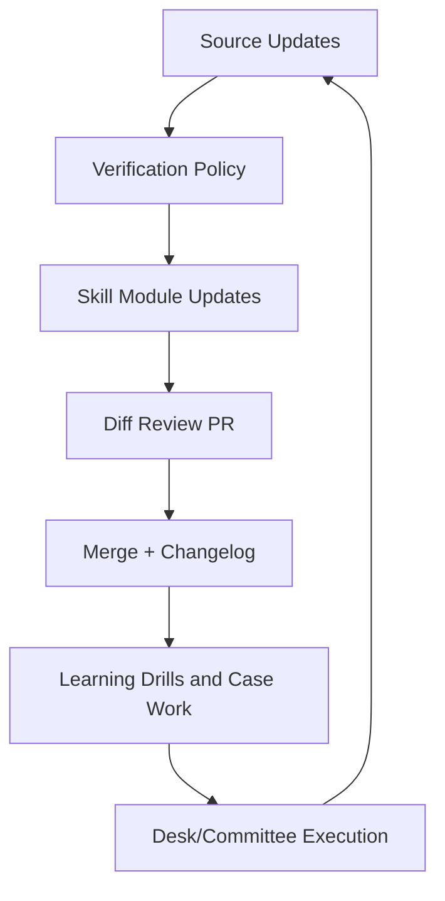
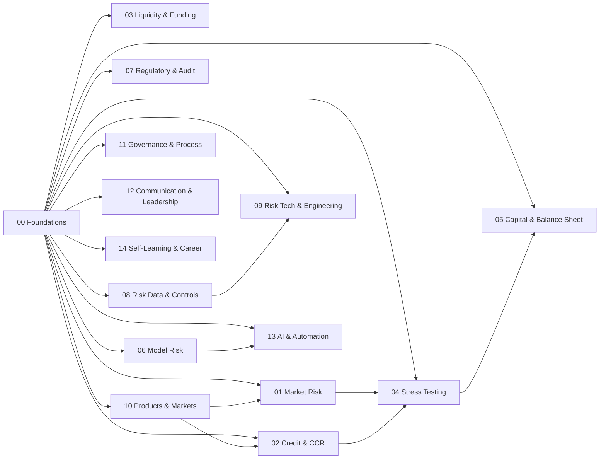

=== path: /README.md ===
# CIB Risk Skills OS
**AS-OF:** 2026-03-05 11:49:38 EST

Institutional-grade, tool-ready, audit-defensible skills library for Corporate & Investment Banking (CIB) Risk across market, credit/CCR, liquidity, stress, capital, model risk, data, technology, governance, AI, and career execution.

## Repository layout
- [Skills Index](SKILLS_INDEX.md)
- [Dependency Graph](DEPENDENCY_GRAPH.md)
- [Learning System](LEARNING_SYSTEM.md)
- [Update Playbook](UPDATE_PLAYBOOK.md)
- [Verification Policy](VERIFICATION_POLICY.md)
- [Changelog](CHANGELOG.md)
- [Authoritative Sources](sources/authoritative_sources.md)
- [RSS and Watchlist](sources/rss_and_watchlist.md)

## Operating model (visual)


## Category coverage
| Category Code | Category | Skill Modules | Overview |
|---|---|---:|---|
| `00_foundations` | Foundations | 8 | [Open](skills/00_foundations/_category_overview.md) |
| `01_market_risk` | Market Risk | 8 | [Open](skills/01_market_risk/_category_overview.md) |
| `02_credit_and_ccr` | Credit and Counterparty Risk (CCR) | 8 | [Open](skills/02_credit_and_ccr/_category_overview.md) |
| `03_liquidity_and_funding` | Liquidity and Funding Risk | 8 | [Open](skills/03_liquidity_and_funding/_category_overview.md) |
| `04_stress_testing_and_scenarios` | Stress Testing and Scenarios | 8 | [Open](skills/04_stress_testing_and_scenarios/_category_overview.md) |
| `05_capital_and_balance_sheet` | Capital and Balance Sheet | 8 | [Open](skills/05_capital_and_balance_sheet/_category_overview.md) |
| `06_model_risk_and_validation` | Model Risk and Validation | 8 | [Open](skills/06_model_risk_and_validation/_category_overview.md) |
| `07_regulatory_and_audit` | Regulatory and Audit | 8 | [Open](skills/07_regulatory_and_audit/_category_overview.md) |
| `08_risk_data_and_controls` | Risk Data and Controls | 8 | [Open](skills/08_risk_data_and_controls/_category_overview.md) |
| `09_risk_technology_and_engineering` | Risk Technology and Engineering | 8 | [Open](skills/09_risk_technology_and_engineering/_category_overview.md) |
| `10_products_and_markets` | Products and Markets | 8 | [Open](skills/10_products_and_markets/_category_overview.md) |
| `11_governance_and_process` | Governance and Process | 8 | [Open](skills/11_governance_and_process/_category_overview.md) |
| `12_communication_and_leadership` | Communication and Leadership | 8 | [Open](skills/12_communication_and_leadership/_category_overview.md) |
| `13_ai_and_automation` | AI and Automation | 8 | [Open](skills/13_ai_and_automation/_category_overview.md) |
| `14_self_learning_and_career` | Self-Learning and Career | 8 | [Open](skills/14_self_learning_and_career/_category_overview.md) |

## Quality controls
- Every skill module follows the mandatory template with playbook, pitfalls, exercises, quality bar, and citations.
- Regulatory/policy definitions must be cited to authoritative references or marked **Unconfirmed** per [Verification Policy](VERIFICATION_POLICY.md).
- Updates run on weekly and monthly cadences via [Update Playbook](UPDATE_PLAYBOOK.md).

## Citation baseline
Core source hierarchy is maintained in [sources/authoritative_sources.md](sources/authoritative_sources.md), prioritizing BIS/BCBS, Federal Reserve/OCC/SEC/CFTC, ESMA/EBA, IOSCO, ISDA, IMF, and major exchange rulebooks.

=== path: /SKILLS_INDEX.md ===
# Skills Index
**AS-OF:** 2026-03-05 11:49:38 EST

## Navigation
- [Dependency Graph](DEPENDENCY_GRAPH.md)
- [Learning System](LEARNING_SYSTEM.md)
- [Update Playbook](UPDATE_PLAYBOOK.md)


## Foundations (`00_foundations`)

| Skill | Level | Prereqs |
|---|---|---|
| [Risk Organization Map](skills/00_foundations/01_risk_organization_map.md) | L1 | None |
| [Core Financial Math for Risk](skills/00_foundations/02_core_financial_math_for_risk.md) | L2 | [01 Risk Organization Map](skills/00_foundations/01_risk_organization_map.md) |
| [Portfolio Aggregation and Concentration](skills/00_foundations/03_portfolio_aggregation_and_concentration.md) | L2 | [02 Core Financial Math For Risk](skills/00_foundations/02_core_financial_math_for_risk.md) |
| [Risk Measurement vs Management](skills/00_foundations/04_risk_measurement_vs_management.md) | L2 | [03 Portfolio Aggregation And Concentration](skills/00_foundations/03_portfolio_aggregation_and_concentration.md) |
| [Controls, Issues, and Audit Trail Mindset](skills/00_foundations/05_controls_issues_and_audit_trail_mindset.md) | L3 | [04 Risk Measurement Vs Management](skills/00_foundations/04_risk_measurement_vs_management.md) |
| [Risk Limits Taxonomy](skills/00_foundations/06_risk_limits_taxonomy.md) | L3 | [05 Controls Issues And Audit Trail Mindset](skills/00_foundations/05_controls_issues_and_audit_trail_mindset.md) |
| [Risk Data Flow and Book of Record](skills/00_foundations/07_risk_data_flow_and_book_of_record.md) | L3 | [06 Risk Limits Taxonomy](skills/00_foundations/06_risk_limits_taxonomy.md) |
| [Risk Operating Rhythm and Reporting Calendar](skills/00_foundations/08_risk_operating_rhythm_and_reporting_calendar.md) | L4 | [07 Risk Data Flow And Book Of Record](skills/00_foundations/07_risk_data_flow_and_book_of_record.md) |

## Market Risk (`01_market_risk`)

| Skill | Level | Prereqs |
|---|---|---|
| [VaR Frameworks Parametric Historical Monte Carlo](skills/01_market_risk/01_var_frameworks_parametric_historical_monte_carlo.md) | L1 | [01 Risk Organization Map](skills/00_foundations/01_risk_organization_map.md)<br>[02 Core Financial Math For Risk](skills/00_foundations/02_core_financial_math_for_risk.md) |
| [Expected Shortfall Framework and Reporting](skills/01_market_risk/02_expected_shortfall_framework_and_reporting.md) | L2 | [01 Risk Organization Map](skills/00_foundations/01_risk_organization_map.md)<br>[02 Core Financial Math For Risk](skills/00_foundations/02_core_financial_math_for_risk.md)<br>[01 Var Frameworks Parametric Historical Monte Carlo](skills/01_market_risk/01_var_frameworks_parametric_historical_monte_carlo.md) |
| [Market Risk Sensitivities and Bucketed Risk](skills/01_market_risk/03_market_risk_sensitivities_and_bucketed_risk.md) | L2 | [01 Risk Organization Map](skills/00_foundations/01_risk_organization_map.md)<br>[02 Core Financial Math For Risk](skills/00_foundations/02_core_financial_math_for_risk.md)<br>[02 Expected Shortfall Framework And Reporting](skills/01_market_risk/02_expected_shortfall_framework_and_reporting.md) |
| [Backtesting and Exception Governance](skills/01_market_risk/04_backtesting_and_exception_governance.md) | L2 | [01 Risk Organization Map](skills/00_foundations/01_risk_organization_map.md)<br>[02 Core Financial Math For Risk](skills/00_foundations/02_core_financial_math_for_risk.md)<br>[03 Market Risk Sensitivities And Bucketed Risk](skills/01_market_risk/03_market_risk_sensitivities_and_bucketed_risk.md) |
| [Desk Stress Testing Design](skills/01_market_risk/05_desk_stress_testing_design.md) | L3 | [01 Risk Organization Map](skills/00_foundations/01_risk_organization_map.md)<br>[02 Core Financial Math For Risk](skills/00_foundations/02_core_financial_math_for_risk.md)<br>[04 Backtesting And Exception Governance](skills/01_market_risk/04_backtesting_and_exception_governance.md) |
| [Concentration Risk Monitoring and Actioning](skills/01_market_risk/06_concentration_risk_monitoring_and_actioning.md) | L3 | [01 Risk Organization Map](skills/00_foundations/01_risk_organization_map.md)<br>[02 Core Financial Math For Risk](skills/00_foundations/02_core_financial_math_for_risk.md)<br>[05 Desk Stress Testing Design](skills/01_market_risk/05_desk_stress_testing_design.md) |
| [PnL Explain Clean PnL and Attribution](skills/01_market_risk/07_pnl_explain_clean_pnl_and_attribution.md) | L3 | [01 Risk Organization Map](skills/00_foundations/01_risk_organization_map.md)<br>[02 Core Financial Math For Risk](skills/00_foundations/02_core_financial_math_for_risk.md)<br>[06 Concentration Risk Monitoring And Actioning](skills/01_market_risk/06_concentration_risk_monitoring_and_actioning.md) |
| [XVA Overview for Market Risk Interfaces](skills/01_market_risk/08_xva_overview_for_market_risk_interfaces.md) | L4 | [01 Risk Organization Map](skills/00_foundations/01_risk_organization_map.md)<br>[02 Core Financial Math For Risk](skills/00_foundations/02_core_financial_math_for_risk.md)<br>[07 Pnl Explain Clean Pnl And Attribution](skills/01_market_risk/07_pnl_explain_clean_pnl_and_attribution.md) |

## Credit and Counterparty Risk (CCR) (`02_credit_and_ccr`)

| Skill | Level | Prereqs |
|---|---|---|
| [Exposure Metrics EPE ENE and PFE](skills/02_credit_and_ccr/01_exposure_metrics_epe_ene_and_pfe.md) | L1 | [01 Risk Organization Map](skills/00_foundations/01_risk_organization_map.md)<br>[02 Core Financial Math For Risk](skills/00_foundations/02_core_financial_math_for_risk.md) |
| [Netting and CSA Fundamentals](skills/02_credit_and_ccr/02_netting_and_csa_fundamentals.md) | L2 | [01 Risk Organization Map](skills/00_foundations/01_risk_organization_map.md)<br>[02 Core Financial Math For Risk](skills/00_foundations/02_core_financial_math_for_risk.md)<br>[01 Exposure Metrics Epe Ene And Pfe](skills/02_credit_and_ccr/01_exposure_metrics_epe_ene_and_pfe.md) |
| [Margining and Collateral Management](skills/02_credit_and_ccr/03_margining_and_collateral_management.md) | L2 | [01 Risk Organization Map](skills/00_foundations/01_risk_organization_map.md)<br>[02 Core Financial Math For Risk](skills/00_foundations/02_core_financial_math_for_risk.md)<br>[02 Netting And Csa Fundamentals](skills/02_credit_and_ccr/02_netting_and_csa_fundamentals.md) |
| [Wrong Way Risk Detection and Escalation](skills/02_credit_and_ccr/04_wrong_way_risk_detection_and_escalation.md) | L2 | [01 Risk Organization Map](skills/00_foundations/01_risk_organization_map.md)<br>[02 Core Financial Math For Risk](skills/00_foundations/02_core_financial_math_for_risk.md)<br>[03 Margining And Collateral Management](skills/02_credit_and_ccr/03_margining_and_collateral_management.md) |
| [CVA Basics and Hedging Intuition](skills/02_credit_and_ccr/05_cva_basics_and_hedging_intuition.md) | L3 | [01 Risk Organization Map](skills/00_foundations/01_risk_organization_map.md)<br>[02 Core Financial Math For Risk](skills/00_foundations/02_core_financial_math_for_risk.md)<br>[04 Wrong Way Risk Detection And Escalation](skills/02_credit_and_ccr/04_wrong_way_risk_detection_and_escalation.md) |
| [FVA Overview and Funding Interactions](skills/02_credit_and_ccr/06_fva_overview_and_funding_interactions.md) | L3 | [01 Risk Organization Map](skills/00_foundations/01_risk_organization_map.md)<br>[02 Core Financial Math For Risk](skills/00_foundations/02_core_financial_math_for_risk.md)<br>[05 Cva Basics And Hedging Intuition](skills/02_credit_and_ccr/05_cva_basics_and_hedging_intuition.md) |
| [CCR Limits Framework](skills/02_credit_and_ccr/07_ccr_limits_framework.md) | L3 | [01 Risk Organization Map](skills/00_foundations/01_risk_organization_map.md)<br>[02 Core Financial Math For Risk](skills/00_foundations/02_core_financial_math_for_risk.md)<br>[06 Fva Overview And Funding Interactions](skills/02_credit_and_ccr/06_fva_overview_and_funding_interactions.md) |
| [Credit Products Risk Basics CDS Indices Tranches](skills/02_credit_and_ccr/08_credit_products_risk_basics_cds_indices_tranches.md) | L4 | [01 Risk Organization Map](skills/00_foundations/01_risk_organization_map.md)<br>[02 Core Financial Math For Risk](skills/00_foundations/02_core_financial_math_for_risk.md)<br>[07 Ccr Limits Framework](skills/02_credit_and_ccr/07_ccr_limits_framework.md) |

## Liquidity and Funding Risk (`03_liquidity_and_funding`)

| Skill | Level | Prereqs |
|---|---|---|
| [Funding Curve Construction Basics](skills/03_liquidity_and_funding/01_funding_curve_construction_basics.md) | L1 | [01 Risk Organization Map](skills/00_foundations/01_risk_organization_map.md)<br>[02 Core Financial Math For Risk](skills/00_foundations/02_core_financial_math_for_risk.md) |
| [Liquidity Horizons and Holding Period Assumptions](skills/03_liquidity_and_funding/02_liquidity_horizons_and_holding_period_assumptions.md) | L2 | [01 Risk Organization Map](skills/00_foundations/01_risk_organization_map.md)<br>[02 Core Financial Math For Risk](skills/00_foundations/02_core_financial_math_for_risk.md)<br>[01 Funding Curve Construction Basics](skills/03_liquidity_and_funding/01_funding_curve_construction_basics.md) |
| [Margin Liquidity Risk Mechanics](skills/03_liquidity_and_funding/03_margin_liquidity_risk_mechanics.md) | L2 | [01 Risk Organization Map](skills/00_foundations/01_risk_organization_map.md)<br>[02 Core Financial Math For Risk](skills/00_foundations/02_core_financial_math_for_risk.md)<br>[02 Liquidity Horizons And Holding Period Assumptions](skills/03_liquidity_and_funding/02_liquidity_horizons_and_holding_period_assumptions.md) |
| [Contingent Liquidity Planning](skills/03_liquidity_and_funding/04_contingent_liquidity_planning.md) | L2 | [01 Risk Organization Map](skills/00_foundations/01_risk_organization_map.md)<br>[02 Core Financial Math For Risk](skills/00_foundations/02_core_financial_math_for_risk.md)<br>[03 Margin Liquidity Risk Mechanics](skills/03_liquidity_and_funding/03_margin_liquidity_risk_mechanics.md) |
| [LCR Basics and Monitoring](skills/03_liquidity_and_funding/05_lcr_basics_and_monitoring.md) | L3 | [01 Risk Organization Map](skills/00_foundations/01_risk_organization_map.md)<br>[02 Core Financial Math For Risk](skills/00_foundations/02_core_financial_math_for_risk.md)<br>[04 Contingent Liquidity Planning](skills/03_liquidity_and_funding/04_contingent_liquidity_planning.md) |
| [NSFR Basics and Monitoring](skills/03_liquidity_and_funding/06_nsfr_basics_and_monitoring.md) | L3 | [01 Risk Organization Map](skills/00_foundations/01_risk_organization_map.md)<br>[02 Core Financial Math For Risk](skills/00_foundations/02_core_financial_math_for_risk.md)<br>[05 Lcr Basics And Monitoring](skills/03_liquidity_and_funding/05_lcr_basics_and_monitoring.md) |
| [Market Liquidity Risk Measurement](skills/03_liquidity_and_funding/07_market_liquidity_risk_measurement.md) | L3 | [01 Risk Organization Map](skills/00_foundations/01_risk_organization_map.md)<br>[02 Core Financial Math For Risk](skills/00_foundations/02_core_financial_math_for_risk.md)<br>[06 Nsfr Basics And Monitoring](skills/03_liquidity_and_funding/06_nsfr_basics_and_monitoring.md) |
| [Intraday Liquidity and Collateral Mobility](skills/03_liquidity_and_funding/08_intraday_liquidity_and_collateral_mobility.md) | L4 | [01 Risk Organization Map](skills/00_foundations/01_risk_organization_map.md)<br>[02 Core Financial Math For Risk](skills/00_foundations/02_core_financial_math_for_risk.md)<br>[07 Market Liquidity Risk Measurement](skills/03_liquidity_and_funding/07_market_liquidity_risk_measurement.md) |

## Stress Testing and Scenarios (`04_stress_testing_and_scenarios`)

| Skill | Level | Prereqs |
|---|---|---|
| [Scenario Design Framework Macro to Market](skills/04_stress_testing_and_scenarios/01_scenario_design_framework_macro_to_market.md) | L1 | [01 Risk Organization Map](skills/00_foundations/01_risk_organization_map.md)<br>[02 Core Financial Math For Risk](skills/00_foundations/02_core_financial_math_for_risk.md) |
| [Shock Calibration Methods and Governance](skills/04_stress_testing_and_scenarios/02_shock_calibration_methods_and_governance.md) | L2 | [01 Risk Organization Map](skills/00_foundations/01_risk_organization_map.md)<br>[02 Core Financial Math For Risk](skills/00_foundations/02_core_financial_math_for_risk.md)<br>[01 Scenario Design Framework Macro To Market](skills/04_stress_testing_and_scenarios/01_scenario_design_framework_macro_to_market.md) |
| [Reverse Stress Testing Playbook](skills/04_stress_testing_and_scenarios/03_reverse_stress_testing_playbook.md) | L2 | [01 Risk Organization Map](skills/00_foundations/01_risk_organization_map.md)<br>[02 Core Financial Math For Risk](skills/00_foundations/02_core_financial_math_for_risk.md)<br>[02 Shock Calibration Methods And Governance](skills/04_stress_testing_and_scenarios/02_shock_calibration_methods_and_governance.md) |
| [Scenario PnL Explain and Remediation](skills/04_stress_testing_and_scenarios/04_scenario_pnl_explain_and_remediation.md) | L2 | [01 Risk Organization Map](skills/00_foundations/01_risk_organization_map.md)<br>[02 Core Financial Math For Risk](skills/00_foundations/02_core_financial_math_for_risk.md)<br>[03 Reverse Stress Testing Playbook](skills/04_stress_testing_and_scenarios/03_reverse_stress_testing_playbook.md) |
| [Multi Factor Scenario Generation](skills/04_stress_testing_and_scenarios/05_multi_factor_scenario_generation.md) | L3 | [01 Risk Organization Map](skills/00_foundations/01_risk_organization_map.md)<br>[02 Core Financial Math For Risk](skills/00_foundations/02_core_financial_math_for_risk.md)<br>[04 Scenario Pnl Explain And Remediation](skills/04_stress_testing_and_scenarios/04_scenario_pnl_explain_and_remediation.md) |
| [Stress Data Lineage and Controls](skills/04_stress_testing_and_scenarios/06_stress_data_lineage_and_controls.md) | L3 | [01 Risk Organization Map](skills/00_foundations/01_risk_organization_map.md)<br>[02 Core Financial Math For Risk](skills/00_foundations/02_core_financial_math_for_risk.md)<br>[05 Multi Factor Scenario Generation](skills/04_stress_testing_and_scenarios/05_multi_factor_scenario_generation.md) |
| [Stress Governance and Effective Challenge](skills/04_stress_testing_and_scenarios/07_stress_governance_and_effective_challenge.md) | L3 | [01 Risk Organization Map](skills/00_foundations/01_risk_organization_map.md)<br>[02 Core Financial Math For Risk](skills/00_foundations/02_core_financial_math_for_risk.md)<br>[06 Stress Data Lineage And Controls](skills/04_stress_testing_and_scenarios/06_stress_data_lineage_and_controls.md) |
| [Scenario Communication for Committees](skills/04_stress_testing_and_scenarios/08_scenario_communication_for_committees.md) | L4 | [01 Risk Organization Map](skills/00_foundations/01_risk_organization_map.md)<br>[02 Core Financial Math For Risk](skills/00_foundations/02_core_financial_math_for_risk.md)<br>[07 Stress Governance And Effective Challenge](skills/04_stress_testing_and_scenarios/07_stress_governance_and_effective_challenge.md) |

## Capital and Balance Sheet (`05_capital_and_balance_sheet`)

| Skill | Level | Prereqs |
|---|---|---|
| [RWA Drivers for CIB Portfolios](skills/05_capital_and_balance_sheet/01_rwa_drivers_for_cib_portfolios.md) | L1 | [01 Risk Organization Map](skills/00_foundations/01_risk_organization_map.md)<br>[02 Core Financial Math For Risk](skills/00_foundations/02_core_financial_math_for_risk.md) |
| [Capital Ratio Bridge Analysis](skills/05_capital_and_balance_sheet/02_capital_ratio_bridge_analysis.md) | L2 | [01 Risk Organization Map](skills/00_foundations/01_risk_organization_map.md)<br>[02 Core Financial Math For Risk](skills/00_foundations/02_core_financial_math_for_risk.md)<br>[01 Rwa Drivers For Cib Portfolios](skills/05_capital_and_balance_sheet/01_rwa_drivers_for_cib_portfolios.md) |
| [Economic vs Regulatory Capital Distinctions](skills/05_capital_and_balance_sheet/03_economic_vs_regulatory_capital_distinctions.md) | L2 | [01 Risk Organization Map](skills/00_foundations/01_risk_organization_map.md)<br>[02 Core Financial Math For Risk](skills/00_foundations/02_core_financial_math_for_risk.md)<br>[02 Capital Ratio Bridge Analysis](skills/05_capital_and_balance_sheet/02_capital_ratio_bridge_analysis.md) |
| [Capital Allocation and Risk Adjusted Pricing](skills/05_capital_and_balance_sheet/04_capital_allocation_and_risk_adjusted_pricing.md) | L2 | [01 Risk Organization Map](skills/00_foundations/01_risk_organization_map.md)<br>[02 Core Financial Math For Risk](skills/00_foundations/02_core_financial_math_for_risk.md)<br>[03 Economic Vs Regulatory Capital Distinctions](skills/05_capital_and_balance_sheet/03_economic_vs_regulatory_capital_distinctions.md) |
| [Balance Sheet Scarcity and Constraints](skills/05_capital_and_balance_sheet/05_balance_sheet_scarcity_and_constraints.md) | L3 | [01 Risk Organization Map](skills/00_foundations/01_risk_organization_map.md)<br>[02 Core Financial Math For Risk](skills/00_foundations/02_core_financial_math_for_risk.md)<br>[04 Capital Allocation And Risk Adjusted Pricing](skills/05_capital_and_balance_sheet/04_capital_allocation_and_risk_adjusted_pricing.md) |
| [Leverage Ratio Impacts](skills/05_capital_and_balance_sheet/06_leverage_ratio_impacts.md) | L3 | [01 Risk Organization Map](skills/00_foundations/01_risk_organization_map.md)<br>[02 Core Financial Math For Risk](skills/00_foundations/02_core_financial_math_for_risk.md)<br>[05 Balance Sheet Scarcity And Constraints](skills/05_capital_and_balance_sheet/05_balance_sheet_scarcity_and_constraints.md) |
| [RWA Optimization with Control Discipline](skills/05_capital_and_balance_sheet/07_rwa_optimization_with_control_discipline.md) | L3 | [01 Risk Organization Map](skills/00_foundations/01_risk_organization_map.md)<br>[02 Core Financial Math For Risk](skills/00_foundations/02_core_financial_math_for_risk.md)<br>[06 Leverage Ratio Impacts](skills/05_capital_and_balance_sheet/06_leverage_ratio_impacts.md) |
| [Stress Capital Linkage](skills/05_capital_and_balance_sheet/08_stress_capital_linkage.md) | L4 | [01 Risk Organization Map](skills/00_foundations/01_risk_organization_map.md)<br>[02 Core Financial Math For Risk](skills/00_foundations/02_core_financial_math_for_risk.md)<br>[07 Rwa Optimization With Control Discipline](skills/05_capital_and_balance_sheet/07_rwa_optimization_with_control_discipline.md) |

## Model Risk and Validation (`06_model_risk_and_validation`)

| Skill | Level | Prereqs |
|---|---|---|
| [SR 11 7 Model Lifecycle](skills/06_model_risk_and_validation/01_sr_11_7_model_lifecycle.md) | L1 | [01 Risk Organization Map](skills/00_foundations/01_risk_organization_map.md)<br>[02 Core Financial Math For Risk](skills/00_foundations/02_core_financial_math_for_risk.md) |
| [Model Inventory and Tiering](skills/06_model_risk_and_validation/02_model_inventory_and_tiering.md) | L2 | [01 Risk Organization Map](skills/00_foundations/01_risk_organization_map.md)<br>[02 Core Financial Math For Risk](skills/00_foundations/02_core_financial_math_for_risk.md)<br>[01 Sr 11 7 Model Lifecycle](skills/06_model_risk_and_validation/01_sr_11_7_model_lifecycle.md) |
| [Model Development Documentation MDD](skills/06_model_risk_and_validation/03_model_development_documentation_mdd.md) | L2 | [01 Risk Organization Map](skills/00_foundations/01_risk_organization_map.md)<br>[02 Core Financial Math For Risk](skills/00_foundations/02_core_financial_math_for_risk.md)<br>[02 Model Inventory And Tiering](skills/06_model_risk_and_validation/02_model_inventory_and_tiering.md) |
| [Independent Validation Documentation VDD](skills/06_model_risk_and_validation/04_independent_validation_documentation_vdd.md) | L2 | [01 Risk Organization Map](skills/00_foundations/01_risk_organization_map.md)<br>[02 Core Financial Math For Risk](skills/00_foundations/02_core_financial_math_for_risk.md)<br>[03 Model Development Documentation Mdd](skills/06_model_risk_and_validation/03_model_development_documentation_mdd.md) |
| [Ongoing Monitoring and Threshold Design](skills/06_model_risk_and_validation/05_ongoing_monitoring_and_threshold_design.md) | L3 | [01 Risk Organization Map](skills/00_foundations/01_risk_organization_map.md)<br>[02 Core Financial Math For Risk](skills/00_foundations/02_core_financial_math_for_risk.md)<br>[04 Independent Validation Documentation Vdd](skills/06_model_risk_and_validation/04_independent_validation_documentation_vdd.md) |
| [Sensitivity and Benchmark Testing](skills/06_model_risk_and_validation/06_sensitivity_and_benchmark_testing.md) | L3 | [01 Risk Organization Map](skills/00_foundations/01_risk_organization_map.md)<br>[02 Core Financial Math For Risk](skills/00_foundations/02_core_financial_math_for_risk.md)<br>[05 Ongoing Monitoring And Threshold Design](skills/06_model_risk_and_validation/05_ongoing_monitoring_and_threshold_design.md) |
| [Outcomes Analysis and Backtesting](skills/06_model_risk_and_validation/07_outcomes_analysis_and_backtesting.md) | L3 | [01 Risk Organization Map](skills/00_foundations/01_risk_organization_map.md)<br>[02 Core Financial Math For Risk](skills/00_foundations/02_core_financial_math_for_risk.md)<br>[06 Sensitivity And Benchmark Testing](skills/06_model_risk_and_validation/06_sensitivity_and_benchmark_testing.md) |
| [Model Change Management and Controls](skills/06_model_risk_and_validation/08_model_change_management_and_controls.md) | L4 | [01 Risk Organization Map](skills/00_foundations/01_risk_organization_map.md)<br>[02 Core Financial Math For Risk](skills/00_foundations/02_core_financial_math_for_risk.md)<br>[07 Outcomes Analysis And Backtesting](skills/06_model_risk_and_validation/07_outcomes_analysis_and_backtesting.md) |

## Regulatory and Audit (`07_regulatory_and_audit`)

| Skill | Level | Prereqs |
|---|---|---|
| [Audit Ready Documentation](skills/07_regulatory_and_audit/01_audit_ready_documentation.md) | L1 | [01 Risk Organization Map](skills/00_foundations/01_risk_organization_map.md)<br>[02 Core Financial Math For Risk](skills/00_foundations/02_core_financial_math_for_risk.md) |
| [Issue Management Root Cause and CAPA](skills/07_regulatory_and_audit/02_issue_management_root_cause_and_capa.md) | L2 | [01 Risk Organization Map](skills/00_foundations/01_risk_organization_map.md)<br>[02 Core Financial Math For Risk](skills/00_foundations/02_core_financial_math_for_risk.md)<br>[01 Audit Ready Documentation](skills/07_regulatory_and_audit/01_audit_ready_documentation.md) |
| [Exam Readiness Control Room](skills/07_regulatory_and_audit/03_exam_readiness_control_room.md) | L2 | [01 Risk Organization Map](skills/00_foundations/01_risk_organization_map.md)<br>[02 Core Financial Math For Risk](skills/00_foundations/02_core_financial_math_for_risk.md)<br>[02 Issue Management Root Cause And Capa](skills/07_regulatory_and_audit/02_issue_management_root_cause_and_capa.md) |
| [Evidence Management and Traceability](skills/07_regulatory_and_audit/04_evidence_management_and_traceability.md) | L2 | [01 Risk Organization Map](skills/00_foundations/01_risk_organization_map.md)<br>[02 Core Financial Math For Risk](skills/00_foundations/02_core_financial_math_for_risk.md)<br>[03 Exam Readiness Control Room](skills/07_regulatory_and_audit/03_exam_readiness_control_room.md) |
| [Policy Standard and Procedure Alignment](skills/07_regulatory_and_audit/05_policy_standard_and_procedure_alignment.md) | L3 | [01 Risk Organization Map](skills/00_foundations/01_risk_organization_map.md)<br>[02 Core Financial Math For Risk](skills/00_foundations/02_core_financial_math_for_risk.md)<br>[04 Evidence Management And Traceability](skills/07_regulatory_and_audit/04_evidence_management_and_traceability.md) |
| [Regulatory Change Impact Assessment](skills/07_regulatory_and_audit/06_regulatory_change_impact_assessment.md) | L3 | [01 Risk Organization Map](skills/00_foundations/01_risk_organization_map.md)<br>[02 Core Financial Math For Risk](skills/00_foundations/02_core_financial_math_for_risk.md)<br>[05 Policy Standard And Procedure Alignment](skills/07_regulatory_and_audit/05_policy_standard_and_procedure_alignment.md) |
| [First Second and Third Line Coordination](skills/07_regulatory_and_audit/07_first_second_and_third_line_coordination.md) | L3 | [01 Risk Organization Map](skills/00_foundations/01_risk_organization_map.md)<br>[02 Core Financial Math For Risk](skills/00_foundations/02_core_financial_math_for_risk.md)<br>[06 Regulatory Change Impact Assessment](skills/07_regulatory_and_audit/06_regulatory_change_impact_assessment.md) |
| [MRIA MRA and Commitment Tracking](skills/07_regulatory_and_audit/08_mria_mra_and_commitment_tracking.md) | L4 | [01 Risk Organization Map](skills/00_foundations/01_risk_organization_map.md)<br>[02 Core Financial Math For Risk](skills/00_foundations/02_core_financial_math_for_risk.md)<br>[07 First Second And Third Line Coordination](skills/07_regulatory_and_audit/07_first_second_and_third_line_coordination.md) |

## Risk Data and Controls (`08_risk_data_and_controls`)

| Skill | Level | Prereqs |
|---|---|---|
| [Data Quality Dimensions Framework](skills/08_risk_data_and_controls/01_data_quality_dimensions_framework.md) | L1 | [01 Risk Organization Map](skills/00_foundations/01_risk_organization_map.md)<br>[02 Core Financial Math For Risk](skills/00_foundations/02_core_financial_math_for_risk.md) |
| [Reconciliation Design and Break Management](skills/08_risk_data_and_controls/02_reconciliation_design_and_break_management.md) | L2 | [01 Risk Organization Map](skills/00_foundations/01_risk_organization_map.md)<br>[02 Core Financial Math For Risk](skills/00_foundations/02_core_financial_math_for_risk.md)<br>[01 Data Quality Dimensions Framework](skills/08_risk_data_and_controls/01_data_quality_dimensions_framework.md) |
| [Golden Source and Data Contracts](skills/08_risk_data_and_controls/03_golden_source_and_data_contracts.md) | L2 | [01 Risk Organization Map](skills/00_foundations/01_risk_organization_map.md)<br>[02 Core Financial Math For Risk](skills/00_foundations/02_core_financial_math_for_risk.md)<br>[02 Reconciliation Design And Break Management](skills/08_risk_data_and_controls/02_reconciliation_design_and_break_management.md) |
| [Lineage Mapping for Risk Metrics](skills/08_risk_data_and_controls/04_lineage_mapping_for_risk_metrics.md) | L2 | [01 Risk Organization Map](skills/00_foundations/01_risk_organization_map.md)<br>[02 Core Financial Math For Risk](skills/00_foundations/02_core_financial_math_for_risk.md)<br>[03 Golden Source And Data Contracts](skills/08_risk_data_and_controls/03_golden_source_and_data_contracts.md) |
| [KPI KRI Design for Risk Processes](skills/08_risk_data_and_controls/05_kpi_kri_design_for_risk_processes.md) | L3 | [01 Risk Organization Map](skills/00_foundations/01_risk_organization_map.md)<br>[02 Core Financial Math For Risk](skills/00_foundations/02_core_financial_math_for_risk.md)<br>[04 Lineage Mapping For Risk Metrics](skills/08_risk_data_and_controls/04_lineage_mapping_for_risk_metrics.md) |
| [Access Controls and Segregation of Duties](skills/08_risk_data_and_controls/06_access_controls_and_segregation_of_duties.md) | L3 | [01 Risk Organization Map](skills/00_foundations/01_risk_organization_map.md)<br>[02 Core Financial Math For Risk](skills/00_foundations/02_core_financial_math_for_risk.md)<br>[05 Kpi Kri Design For Risk Processes](skills/08_risk_data_and_controls/05_kpi_kri_design_for_risk_processes.md) |
| [Control Testing and Attestation](skills/08_risk_data_and_controls/07_control_testing_and_attestation.md) | L3 | [01 Risk Organization Map](skills/00_foundations/01_risk_organization_map.md)<br>[02 Core Financial Math For Risk](skills/00_foundations/02_core_financial_math_for_risk.md)<br>[06 Access Controls And Segregation Of Duties](skills/08_risk_data_and_controls/06_access_controls_and_segregation_of_duties.md) |
| [Metadata Management and Glossary Governance](skills/08_risk_data_and_controls/08_metadata_management_and_glossary_governance.md) | L4 | [01 Risk Organization Map](skills/00_foundations/01_risk_organization_map.md)<br>[02 Core Financial Math For Risk](skills/00_foundations/02_core_financial_math_for_risk.md)<br>[07 Control Testing And Attestation](skills/08_risk_data_and_controls/07_control_testing_and_attestation.md) |

## Risk Technology and Engineering (`09_risk_technology_and_engineering`)

| Skill | Level | Prereqs |
|---|---|---|
| [SQL for Risk Analytics](skills/09_risk_technology_and_engineering/01_sql_for_risk_analytics.md) | L1 | [01 Risk Organization Map](skills/00_foundations/01_risk_organization_map.md)<br>[02 Core Financial Math For Risk](skills/00_foundations/02_core_financial_math_for_risk.md) |
| [Python for Risk Analytics](skills/09_risk_technology_and_engineering/02_python_for_risk_analytics.md) | L2 | [01 Risk Organization Map](skills/00_foundations/01_risk_organization_map.md)<br>[02 Core Financial Math For Risk](skills/00_foundations/02_core_financial_math_for_risk.md)<br>[01 Sql For Risk Analytics](skills/09_risk_technology_and_engineering/01_sql_for_risk_analytics.md) |
| [Reproducible Notebooks and Research](skills/09_risk_technology_and_engineering/03_reproducible_notebooks_and_research.md) | L2 | [01 Risk Organization Map](skills/00_foundations/01_risk_organization_map.md)<br>[02 Core Financial Math For Risk](skills/00_foundations/02_core_financial_math_for_risk.md)<br>[02 Python For Risk Analytics](skills/09_risk_technology_and_engineering/02_python_for_risk_analytics.md) |
| [PowerBI for Risk Reporting](skills/09_risk_technology_and_engineering/04_powerbi_for_risk_reporting.md) | L2 | [01 Risk Organization Map](skills/00_foundations/01_risk_organization_map.md)<br>[02 Core Financial Math For Risk](skills/00_foundations/02_core_financial_math_for_risk.md)<br>[03 Reproducible Notebooks And Research](skills/09_risk_technology_and_engineering/03_reproducible_notebooks_and_research.md) |
| [Git Workflows for Risk Teams](skills/09_risk_technology_and_engineering/05_git_workflows_for_risk_teams.md) | L3 | [01 Risk Organization Map](skills/00_foundations/01_risk_organization_map.md)<br>[02 Core Financial Math For Risk](skills/00_foundations/02_core_financial_math_for_risk.md)<br>[04 Powerbi For Risk Reporting](skills/09_risk_technology_and_engineering/04_powerbi_for_risk_reporting.md) |
| [Testing and CI for Risk Code](skills/09_risk_technology_and_engineering/06_testing_and_ci_for_risk_code.md) | L3 | [01 Risk Organization Map](skills/00_foundations/01_risk_organization_map.md)<br>[02 Core Financial Math For Risk](skills/00_foundations/02_core_financial_math_for_risk.md)<br>[05 Git Workflows For Risk Teams](skills/09_risk_technology_and_engineering/05_git_workflows_for_risk_teams.md) |
| [Data Pipeline Orchestration and Monitoring](skills/09_risk_technology_and_engineering/07_data_pipeline_orchestration_and_monitoring.md) | L3 | [01 Risk Organization Map](skills/00_foundations/01_risk_organization_map.md)<br>[02 Core Financial Math For Risk](skills/00_foundations/02_core_financial_math_for_risk.md)<br>[06 Testing And Ci For Risk Code](skills/09_risk_technology_and_engineering/06_testing_and_ci_for_risk_code.md) |
| [Observability and Incident Response for Risk Systems](skills/09_risk_technology_and_engineering/08_observability_and_incident_response_for_risk_systems.md) | L4 | [01 Risk Organization Map](skills/00_foundations/01_risk_organization_map.md)<br>[02 Core Financial Math For Risk](skills/00_foundations/02_core_financial_math_for_risk.md)<br>[07 Data Pipeline Orchestration And Monitoring](skills/09_risk_technology_and_engineering/07_data_pipeline_orchestration_and_monitoring.md) |

## Products and Markets (`10_products_and_markets`)

| Skill | Level | Prereqs |
|---|---|---|
| [Rates Products Risk Drivers](skills/10_products_and_markets/01_rates_products_risk_drivers.md) | L1 | [01 Risk Organization Map](skills/00_foundations/01_risk_organization_map.md)<br>[02 Core Financial Math For Risk](skills/00_foundations/02_core_financial_math_for_risk.md) |
| [FX Products Risk Drivers](skills/10_products_and_markets/02_fx_products_risk_drivers.md) | L2 | [01 Risk Organization Map](skills/00_foundations/01_risk_organization_map.md)<br>[02 Core Financial Math For Risk](skills/00_foundations/02_core_financial_math_for_risk.md)<br>[01 Rates Products Risk Drivers](skills/10_products_and_markets/01_rates_products_risk_drivers.md) |
| [Credit Products Risk Drivers](skills/10_products_and_markets/03_credit_products_risk_drivers.md) | L2 | [01 Risk Organization Map](skills/00_foundations/01_risk_organization_map.md)<br>[02 Core Financial Math For Risk](skills/00_foundations/02_core_financial_math_for_risk.md)<br>[02 Fx Products Risk Drivers](skills/10_products_and_markets/02_fx_products_risk_drivers.md) |
| [Equity Derivatives Risk Drivers](skills/10_products_and_markets/04_equity_derivatives_risk_drivers.md) | L2 | [01 Risk Organization Map](skills/00_foundations/01_risk_organization_map.md)<br>[02 Core Financial Math For Risk](skills/00_foundations/02_core_financial_math_for_risk.md)<br>[03 Credit Products Risk Drivers](skills/10_products_and_markets/03_credit_products_risk_drivers.md) |
| [Commodity Products Risk Drivers](skills/10_products_and_markets/05_commodity_products_risk_drivers.md) | L3 | [01 Risk Organization Map](skills/00_foundations/01_risk_organization_map.md)<br>[02 Core Financial Math For Risk](skills/00_foundations/02_core_financial_math_for_risk.md)<br>[04 Equity Derivatives Risk Drivers](skills/10_products_and_markets/04_equity_derivatives_risk_drivers.md) |
| [Structured Products Key Risks](skills/10_products_and_markets/06_structured_products_key_risks.md) | L3 | [01 Risk Organization Map](skills/00_foundations/01_risk_organization_map.md)<br>[02 Core Financial Math For Risk](skills/00_foundations/02_core_financial_math_for_risk.md)<br>[05 Commodity Products Risk Drivers](skills/10_products_and_markets/05_commodity_products_risk_drivers.md) |
| [Securitized Products and Tranches](skills/10_products_and_markets/07_securitized_products_and_tranches.md) | L3 | [01 Risk Organization Map](skills/00_foundations/01_risk_organization_map.md)<br>[02 Core Financial Math For Risk](skills/00_foundations/02_core_financial_math_for_risk.md)<br>[06 Structured Products Key Risks](skills/10_products_and_markets/06_structured_products_key_risks.md) |
| [Cross Asset Basis and Correlation Risk](skills/10_products_and_markets/08_cross_asset_basis_and_correlation_risk.md) | L4 | [01 Risk Organization Map](skills/00_foundations/01_risk_organization_map.md)<br>[02 Core Financial Math For Risk](skills/00_foundations/02_core_financial_math_for_risk.md)<br>[07 Securitized Products And Tranches](skills/10_products_and_markets/07_securitized_products_and_tranches.md) |

## Governance and Process (`11_governance_and_process`)

| Skill | Level | Prereqs |
|---|---|---|
| [Limit Framework Design and Governance](skills/11_governance_and_process/01_limit_framework_design_and_governance.md) | L1 | [01 Risk Organization Map](skills/00_foundations/01_risk_organization_map.md)<br>[02 Core Financial Math For Risk](skills/00_foundations/02_core_financial_math_for_risk.md) |
| [Limit Breach Escalation Playbook](skills/11_governance_and_process/02_limit_breach_escalation_playbook.md) | L2 | [01 Risk Organization Map](skills/00_foundations/01_risk_organization_map.md)<br>[02 Core Financial Math For Risk](skills/00_foundations/02_core_financial_math_for_risk.md)<br>[01 Limit Framework Design And Governance](skills/11_governance_and_process/01_limit_framework_design_and_governance.md) |
| [Committee Pack Authoring for CRO MRC](skills/11_governance_and_process/03_committee_pack_authoring_for_cro_mrc.md) | L2 | [01 Risk Organization Map](skills/00_foundations/01_risk_organization_map.md)<br>[02 Core Financial Math For Risk](skills/00_foundations/02_core_financial_math_for_risk.md)<br>[02 Limit Breach Escalation Playbook](skills/11_governance_and_process/02_limit_breach_escalation_playbook.md) |
| [Change Management and Control Impact Assessment](skills/11_governance_and_process/04_change_management_and_control_impact_assessment.md) | L2 | [01 Risk Organization Map](skills/00_foundations/01_risk_organization_map.md)<br>[02 Core Financial Math For Risk](skills/00_foundations/02_core_financial_math_for_risk.md)<br>[03 Committee Pack Authoring For Cro Mrc](skills/11_governance_and_process/03_committee_pack_authoring_for_cro_mrc.md) |
| [BAU vs Project Execution Model](skills/11_governance_and_process/05_bau_vs_project_execution_model.md) | L3 | [01 Risk Organization Map](skills/00_foundations/01_risk_organization_map.md)<br>[02 Core Financial Math For Risk](skills/00_foundations/02_core_financial_math_for_risk.md)<br>[04 Change Management And Control Impact Assessment](skills/11_governance_and_process/04_change_management_and_control_impact_assessment.md) |
| [Risk Appetite Translation to Limits](skills/11_governance_and_process/06_risk_appetite_translation_to_limits.md) | L3 | [01 Risk Organization Map](skills/00_foundations/01_risk_organization_map.md)<br>[02 Core Financial Math For Risk](skills/00_foundations/02_core_financial_math_for_risk.md)<br>[05 Bau Vs Project Execution Model](skills/11_governance_and_process/05_bau_vs_project_execution_model.md) |
| [Decision Log and RAID Management](skills/11_governance_and_process/07_decision_log_and_raid_management.md) | L3 | [01 Risk Organization Map](skills/00_foundations/01_risk_organization_map.md)<br>[02 Core Financial Math For Risk](skills/00_foundations/02_core_financial_math_for_risk.md)<br>[06 Risk Appetite Translation To Limits](skills/11_governance_and_process/06_risk_appetite_translation_to_limits.md) |
| [Control Self Assessment Process](skills/11_governance_and_process/08_control_self_assessment_process.md) | L4 | [01 Risk Organization Map](skills/00_foundations/01_risk_organization_map.md)<br>[02 Core Financial Math For Risk](skills/00_foundations/02_core_financial_math_for_risk.md)<br>[07 Decision Log And Raid Management](skills/11_governance_and_process/07_decision_log_and_raid_management.md) |

## Communication and Leadership (`12_communication_and_leadership`)

| Skill | Level | Prereqs |
|---|---|---|
| [Executive Summary Writing for Risk](skills/12_communication_and_leadership/01_executive_summary_writing_for_risk.md) | L1 | [01 Risk Organization Map](skills/00_foundations/01_risk_organization_map.md)<br>[02 Core Financial Math For Risk](skills/00_foundations/02_core_financial_math_for_risk.md) |
| [Storytelling with Risk Data](skills/12_communication_and_leadership/02_storytelling_with_risk_data.md) | L2 | [01 Risk Organization Map](skills/00_foundations/01_risk_organization_map.md)<br>[02 Core Financial Math For Risk](skills/00_foundations/02_core_financial_math_for_risk.md)<br>[01 Executive Summary Writing For Risk](skills/12_communication_and_leadership/01_executive_summary_writing_for_risk.md) |
| [Stakeholder Mapping and Influence Strategy](skills/12_communication_and_leadership/03_stakeholder_mapping_and_influence_strategy.md) | L2 | [01 Risk Organization Map](skills/00_foundations/01_risk_organization_map.md)<br>[02 Core Financial Math For Risk](skills/00_foundations/02_core_financial_math_for_risk.md)<br>[02 Storytelling With Risk Data](skills/12_communication_and_leadership/02_storytelling_with_risk_data.md) |
| [Challenge Meeting Facilitation](skills/12_communication_and_leadership/04_challenge_meeting_facilitation.md) | L2 | [01 Risk Organization Map](skills/00_foundations/01_risk_organization_map.md)<br>[02 Core Financial Math For Risk](skills/00_foundations/02_core_financial_math_for_risk.md)<br>[03 Stakeholder Mapping And Influence Strategy](skills/12_communication_and_leadership/03_stakeholder_mapping_and_influence_strategy.md) |
| [Conflict Management in Risk Decisions](skills/12_communication_and_leadership/05_conflict_management_in_risk_decisions.md) | L3 | [01 Risk Organization Map](skills/00_foundations/01_risk_organization_map.md)<br>[02 Core Financial Math For Risk](skills/00_foundations/02_core_financial_math_for_risk.md)<br>[04 Challenge Meeting Facilitation](skills/12_communication_and_leadership/04_challenge_meeting_facilitation.md) |
| [Upward Management and Expectation Setting](skills/12_communication_and_leadership/06_upward_management_and_expectation_setting.md) | L3 | [01 Risk Organization Map](skills/00_foundations/01_risk_organization_map.md)<br>[02 Core Financial Math For Risk](skills/00_foundations/02_core_financial_math_for_risk.md)<br>[05 Conflict Management In Risk Decisions](skills/12_communication_and_leadership/05_conflict_management_in_risk_decisions.md) |
| [Coaching and Feedback for Analysts](skills/12_communication_and_leadership/07_coaching_and_feedback_for_analysts.md) | L3 | [01 Risk Organization Map](skills/00_foundations/01_risk_organization_map.md)<br>[02 Core Financial Math For Risk](skills/00_foundations/02_core_financial_math_for_risk.md)<br>[06 Upward Management And Expectation Setting](skills/12_communication_and_leadership/06_upward_management_and_expectation_setting.md) |
| [Crisis Communication for Market Events](skills/12_communication_and_leadership/08_crisis_communication_for_market_events.md) | L4 | [01 Risk Organization Map](skills/00_foundations/01_risk_organization_map.md)<br>[02 Core Financial Math For Risk](skills/00_foundations/02_core_financial_math_for_risk.md)<br>[07 Coaching And Feedback For Analysts](skills/12_communication_and_leadership/07_coaching_and_feedback_for_analysts.md) |

## AI and Automation (`13_ai_and_automation`)

| Skill | Level | Prereqs |
|---|---|---|
| [Agentic AI Use Cases in Risk](skills/13_ai_and_automation/01_agentic_ai_use_cases_in_risk.md) | L1 | [01 Risk Organization Map](skills/00_foundations/01_risk_organization_map.md)<br>[02 Core Financial Math For Risk](skills/00_foundations/02_core_financial_math_for_risk.md) |
| [Prompting Standards for Risk Tasks](skills/13_ai_and_automation/02_prompting_standards_for_risk_tasks.md) | L2 | [01 Risk Organization Map](skills/00_foundations/01_risk_organization_map.md)<br>[02 Core Financial Math For Risk](skills/00_foundations/02_core_financial_math_for_risk.md)<br>[01 Agentic Ai Use Cases In Risk](skills/13_ai_and_automation/01_agentic_ai_use_cases_in_risk.md) |
| [Evaluation Harness for LLM Outputs](skills/13_ai_and_automation/03_evaluation_harness_for_llm_outputs.md) | L2 | [01 Risk Organization Map](skills/00_foundations/01_risk_organization_map.md)<br>[02 Core Financial Math For Risk](skills/00_foundations/02_core_financial_math_for_risk.md)<br>[02 Prompting Standards For Risk Tasks](skills/13_ai_and_automation/02_prompting_standards_for_risk_tasks.md) |
| [RAG for Risk Knowledge Bases](skills/13_ai_and_automation/04_rag_for_risk_knowledge_bases.md) | L2 | [01 Risk Organization Map](skills/00_foundations/01_risk_organization_map.md)<br>[02 Core Financial Math For Risk](skills/00_foundations/02_core_financial_math_for_risk.md)<br>[03 Evaluation Harness For Llm Outputs](skills/13_ai_and_automation/03_evaluation_harness_for_llm_outputs.md) |
| [Automation Safety and Approval Gates](skills/13_ai_and_automation/05_automation_safety_and_approval_gates.md) | L3 | [01 Risk Organization Map](skills/00_foundations/01_risk_organization_map.md)<br>[02 Core Financial Math For Risk](skills/00_foundations/02_core_financial_math_for_risk.md)<br>[04 Rag For Risk Knowledge Bases](skills/13_ai_and_automation/04_rag_for_risk_knowledge_bases.md) |
| [AI Logging Replay and Auditability](skills/13_ai_and_automation/06_ai_logging_replay_and_auditability.md) | L3 | [01 Risk Organization Map](skills/00_foundations/01_risk_organization_map.md)<br>[02 Core Financial Math For Risk](skills/00_foundations/02_core_financial_math_for_risk.md)<br>[05 Automation Safety And Approval Gates](skills/13_ai_and_automation/05_automation_safety_and_approval_gates.md) |
| [Privacy Security and Compliance for AI](skills/13_ai_and_automation/07_privacy_security_and_compliance_for_ai.md) | L3 | [01 Risk Organization Map](skills/00_foundations/01_risk_organization_map.md)<br>[02 Core Financial Math For Risk](skills/00_foundations/02_core_financial_math_for_risk.md)<br>[06 Ai Logging Replay And Auditability](skills/13_ai_and_automation/06_ai_logging_replay_and_auditability.md) |
| [Human in the Loop Operating Model](skills/13_ai_and_automation/08_human_in_the_loop_operating_model.md) | L4 | [01 Risk Organization Map](skills/00_foundations/01_risk_organization_map.md)<br>[02 Core Financial Math For Risk](skills/00_foundations/02_core_financial_math_for_risk.md)<br>[07 Privacy Security And Compliance For Ai](skills/13_ai_and_automation/07_privacy_security_and_compliance_for_ai.md) |

## Self-Learning and Career (`14_self_learning_and_career`)

| Skill | Level | Prereqs |
|---|---|---|
| [Personal Risk Second Brain](skills/14_self_learning_and_career/01_personal_risk_second_brain.md) | L1 | [01 Risk Organization Map](skills/00_foundations/01_risk_organization_map.md)<br>[02 Core Financial Math For Risk](skills/00_foundations/02_core_financial_math_for_risk.md) |
| [Spaced Repetition System for Risk Concepts](skills/14_self_learning_and_career/02_spaced_repetition_system_for_risk_concepts.md) | L2 | [01 Risk Organization Map](skills/00_foundations/01_risk_organization_map.md)<br>[02 Core Financial Math For Risk](skills/00_foundations/02_core_financial_math_for_risk.md)<br>[01 Personal Risk Second Brain](skills/14_self_learning_and_career/01_personal_risk_second_brain.md) |
| [Weekly Deliberate Practice Loop](skills/14_self_learning_and_career/03_weekly_deliberate_practice_loop.md) | L2 | [01 Risk Organization Map](skills/00_foundations/01_risk_organization_map.md)<br>[02 Core Financial Math For Risk](skills/00_foundations/02_core_financial_math_for_risk.md)<br>[02 Spaced Repetition System For Risk Concepts](skills/14_self_learning_and_career/02_spaced_repetition_system_for_risk_concepts.md) |
| [Portfolio of Evidence Building](skills/14_self_learning_and_career/04_portfolio_of_evidence_building.md) | L2 | [01 Risk Organization Map](skills/00_foundations/01_risk_organization_map.md)<br>[02 Core Financial Math For Risk](skills/00_foundations/02_core_financial_math_for_risk.md)<br>[03 Weekly Deliberate Practice Loop](skills/14_self_learning_and_career/03_weekly_deliberate_practice_loop.md) |
| [Interview and Case Prep Framework](skills/14_self_learning_and_career/05_interview_and_case_prep_framework.md) | L3 | [01 Risk Organization Map](skills/00_foundations/01_risk_organization_map.md)<br>[02 Core Financial Math For Risk](skills/00_foundations/02_core_financial_math_for_risk.md)<br>[04 Portfolio Of Evidence Building](skills/14_self_learning_and_career/04_portfolio_of_evidence_building.md) |
| [Mentor Network and Sponsorship Map](skills/14_self_learning_and_career/06_mentor_network_and_sponsorship_map.md) | L3 | [01 Risk Organization Map](skills/00_foundations/01_risk_organization_map.md)<br>[02 Core Financial Math For Risk](skills/00_foundations/02_core_financial_math_for_risk.md)<br>[05 Interview And Case Prep Framework](skills/14_self_learning_and_career/05_interview_and_case_prep_framework.md) |
| [Career Ladder and Skill Gap Analysis](skills/14_self_learning_and_career/07_career_ladder_and_skill_gap_analysis.md) | L3 | [01 Risk Organization Map](skills/00_foundations/01_risk_organization_map.md)<br>[02 Core Financial Math For Risk](skills/00_foundations/02_core_financial_math_for_risk.md)<br>[06 Mentor Network And Sponsorship Map](skills/14_self_learning_and_career/06_mentor_network_and_sponsorship_map.md) |
| [Learning from Incidents and Postmortems](skills/14_self_learning_and_career/08_learning_from_incidents_and_postmortems.md) | L4 | [01 Risk Organization Map](skills/00_foundations/01_risk_organization_map.md)<br>[02 Core Financial Math For Risk](skills/00_foundations/02_core_financial_math_for_risk.md)<br>[07 Career Ladder And Skill Gap Analysis](skills/14_self_learning_and_career/07_career_ladder_and_skill_gap_analysis.md) |

=== path: /DEPENDENCY_GRAPH.md ===
# Dependency Graph
**AS-OF:** 2026-03-05 11:49:38 EST

## Category-level flow


## Skill prerequisite map
| Skill | Depends On |
|---|---|
| [Risk Organization Map](skills/00_foundations/01_risk_organization_map.md) | None |
| [Core Financial Math for Risk](skills/00_foundations/02_core_financial_math_for_risk.md) | [01 Risk Organization Map](skills/00_foundations/01_risk_organization_map.md) |
| [Portfolio Aggregation and Concentration](skills/00_foundations/03_portfolio_aggregation_and_concentration.md) | [02 Core Financial Math For Risk](skills/00_foundations/02_core_financial_math_for_risk.md) |
| [Risk Measurement vs Management](skills/00_foundations/04_risk_measurement_vs_management.md) | [03 Portfolio Aggregation And Concentration](skills/00_foundations/03_portfolio_aggregation_and_concentration.md) |
| [Controls, Issues, and Audit Trail Mindset](skills/00_foundations/05_controls_issues_and_audit_trail_mindset.md) | [04 Risk Measurement Vs Management](skills/00_foundations/04_risk_measurement_vs_management.md) |
| [Risk Limits Taxonomy](skills/00_foundations/06_risk_limits_taxonomy.md) | [05 Controls Issues And Audit Trail Mindset](skills/00_foundations/05_controls_issues_and_audit_trail_mindset.md) |
| [Risk Data Flow and Book of Record](skills/00_foundations/07_risk_data_flow_and_book_of_record.md) | [06 Risk Limits Taxonomy](skills/00_foundations/06_risk_limits_taxonomy.md) |
| [Risk Operating Rhythm and Reporting Calendar](skills/00_foundations/08_risk_operating_rhythm_and_reporting_calendar.md) | [07 Risk Data Flow And Book Of Record](skills/00_foundations/07_risk_data_flow_and_book_of_record.md) |
| [VaR Frameworks Parametric Historical Monte Carlo](skills/01_market_risk/01_var_frameworks_parametric_historical_monte_carlo.md) | [01 Risk Organization Map](skills/00_foundations/01_risk_organization_map.md)<br>[02 Core Financial Math For Risk](skills/00_foundations/02_core_financial_math_for_risk.md) |
| [Expected Shortfall Framework and Reporting](skills/01_market_risk/02_expected_shortfall_framework_and_reporting.md) | [01 Risk Organization Map](skills/00_foundations/01_risk_organization_map.md)<br>[02 Core Financial Math For Risk](skills/00_foundations/02_core_financial_math_for_risk.md)<br>[01 Var Frameworks Parametric Historical Monte Carlo](skills/01_market_risk/01_var_frameworks_parametric_historical_monte_carlo.md) |
| [Market Risk Sensitivities and Bucketed Risk](skills/01_market_risk/03_market_risk_sensitivities_and_bucketed_risk.md) | [01 Risk Organization Map](skills/00_foundations/01_risk_organization_map.md)<br>[02 Core Financial Math For Risk](skills/00_foundations/02_core_financial_math_for_risk.md)<br>[02 Expected Shortfall Framework And Reporting](skills/01_market_risk/02_expected_shortfall_framework_and_reporting.md) |
| [Backtesting and Exception Governance](skills/01_market_risk/04_backtesting_and_exception_governance.md) | [01 Risk Organization Map](skills/00_foundations/01_risk_organization_map.md)<br>[02 Core Financial Math For Risk](skills/00_foundations/02_core_financial_math_for_risk.md)<br>[03 Market Risk Sensitivities And Bucketed Risk](skills/01_market_risk/03_market_risk_sensitivities_and_bucketed_risk.md) |
| [Desk Stress Testing Design](skills/01_market_risk/05_desk_stress_testing_design.md) | [01 Risk Organization Map](skills/00_foundations/01_risk_organization_map.md)<br>[02 Core Financial Math For Risk](skills/00_foundations/02_core_financial_math_for_risk.md)<br>[04 Backtesting And Exception Governance](skills/01_market_risk/04_backtesting_and_exception_governance.md) |
| [Concentration Risk Monitoring and Actioning](skills/01_market_risk/06_concentration_risk_monitoring_and_actioning.md) | [01 Risk Organization Map](skills/00_foundations/01_risk_organization_map.md)<br>[02 Core Financial Math For Risk](skills/00_foundations/02_core_financial_math_for_risk.md)<br>[05 Desk Stress Testing Design](skills/01_market_risk/05_desk_stress_testing_design.md) |
| [PnL Explain Clean PnL and Attribution](skills/01_market_risk/07_pnl_explain_clean_pnl_and_attribution.md) | [01 Risk Organization Map](skills/00_foundations/01_risk_organization_map.md)<br>[02 Core Financial Math For Risk](skills/00_foundations/02_core_financial_math_for_risk.md)<br>[06 Concentration Risk Monitoring And Actioning](skills/01_market_risk/06_concentration_risk_monitoring_and_actioning.md) |
| [XVA Overview for Market Risk Interfaces](skills/01_market_risk/08_xva_overview_for_market_risk_interfaces.md) | [01 Risk Organization Map](skills/00_foundations/01_risk_organization_map.md)<br>[02 Core Financial Math For Risk](skills/00_foundations/02_core_financial_math_for_risk.md)<br>[07 Pnl Explain Clean Pnl And Attribution](skills/01_market_risk/07_pnl_explain_clean_pnl_and_attribution.md) |
| [Exposure Metrics EPE ENE and PFE](skills/02_credit_and_ccr/01_exposure_metrics_epe_ene_and_pfe.md) | [01 Risk Organization Map](skills/00_foundations/01_risk_organization_map.md)<br>[02 Core Financial Math For Risk](skills/00_foundations/02_core_financial_math_for_risk.md) |
| [Netting and CSA Fundamentals](skills/02_credit_and_ccr/02_netting_and_csa_fundamentals.md) | [01 Risk Organization Map](skills/00_foundations/01_risk_organization_map.md)<br>[02 Core Financial Math For Risk](skills/00_foundations/02_core_financial_math_for_risk.md)<br>[01 Exposure Metrics Epe Ene And Pfe](skills/02_credit_and_ccr/01_exposure_metrics_epe_ene_and_pfe.md) |
| [Margining and Collateral Management](skills/02_credit_and_ccr/03_margining_and_collateral_management.md) | [01 Risk Organization Map](skills/00_foundations/01_risk_organization_map.md)<br>[02 Core Financial Math For Risk](skills/00_foundations/02_core_financial_math_for_risk.md)<br>[02 Netting And Csa Fundamentals](skills/02_credit_and_ccr/02_netting_and_csa_fundamentals.md) |
| [Wrong Way Risk Detection and Escalation](skills/02_credit_and_ccr/04_wrong_way_risk_detection_and_escalation.md) | [01 Risk Organization Map](skills/00_foundations/01_risk_organization_map.md)<br>[02 Core Financial Math For Risk](skills/00_foundations/02_core_financial_math_for_risk.md)<br>[03 Margining And Collateral Management](skills/02_credit_and_ccr/03_margining_and_collateral_management.md) |
| [CVA Basics and Hedging Intuition](skills/02_credit_and_ccr/05_cva_basics_and_hedging_intuition.md) | [01 Risk Organization Map](skills/00_foundations/01_risk_organization_map.md)<br>[02 Core Financial Math For Risk](skills/00_foundations/02_core_financial_math_for_risk.md)<br>[04 Wrong Way Risk Detection And Escalation](skills/02_credit_and_ccr/04_wrong_way_risk_detection_and_escalation.md) |
| [FVA Overview and Funding Interactions](skills/02_credit_and_ccr/06_fva_overview_and_funding_interactions.md) | [01 Risk Organization Map](skills/00_foundations/01_risk_organization_map.md)<br>[02 Core Financial Math For Risk](skills/00_foundations/02_core_financial_math_for_risk.md)<br>[05 Cva Basics And Hedging Intuition](skills/02_credit_and_ccr/05_cva_basics_and_hedging_intuition.md) |
| [CCR Limits Framework](skills/02_credit_and_ccr/07_ccr_limits_framework.md) | [01 Risk Organization Map](skills/00_foundations/01_risk_organization_map.md)<br>[02 Core Financial Math For Risk](skills/00_foundations/02_core_financial_math_for_risk.md)<br>[06 Fva Overview And Funding Interactions](skills/02_credit_and_ccr/06_fva_overview_and_funding_interactions.md) |
| [Credit Products Risk Basics CDS Indices Tranches](skills/02_credit_and_ccr/08_credit_products_risk_basics_cds_indices_tranches.md) | [01 Risk Organization Map](skills/00_foundations/01_risk_organization_map.md)<br>[02 Core Financial Math For Risk](skills/00_foundations/02_core_financial_math_for_risk.md)<br>[07 Ccr Limits Framework](skills/02_credit_and_ccr/07_ccr_limits_framework.md) |
| [Funding Curve Construction Basics](skills/03_liquidity_and_funding/01_funding_curve_construction_basics.md) | [01 Risk Organization Map](skills/00_foundations/01_risk_organization_map.md)<br>[02 Core Financial Math For Risk](skills/00_foundations/02_core_financial_math_for_risk.md) |
| [Liquidity Horizons and Holding Period Assumptions](skills/03_liquidity_and_funding/02_liquidity_horizons_and_holding_period_assumptions.md) | [01 Risk Organization Map](skills/00_foundations/01_risk_organization_map.md)<br>[02 Core Financial Math For Risk](skills/00_foundations/02_core_financial_math_for_risk.md)<br>[01 Funding Curve Construction Basics](skills/03_liquidity_and_funding/01_funding_curve_construction_basics.md) |
| [Margin Liquidity Risk Mechanics](skills/03_liquidity_and_funding/03_margin_liquidity_risk_mechanics.md) | [01 Risk Organization Map](skills/00_foundations/01_risk_organization_map.md)<br>[02 Core Financial Math For Risk](skills/00_foundations/02_core_financial_math_for_risk.md)<br>[02 Liquidity Horizons And Holding Period Assumptions](skills/03_liquidity_and_funding/02_liquidity_horizons_and_holding_period_assumptions.md) |
| [Contingent Liquidity Planning](skills/03_liquidity_and_funding/04_contingent_liquidity_planning.md) | [01 Risk Organization Map](skills/00_foundations/01_risk_organization_map.md)<br>[02 Core Financial Math For Risk](skills/00_foundations/02_core_financial_math_for_risk.md)<br>[03 Margin Liquidity Risk Mechanics](skills/03_liquidity_and_funding/03_margin_liquidity_risk_mechanics.md) |
| [LCR Basics and Monitoring](skills/03_liquidity_and_funding/05_lcr_basics_and_monitoring.md) | [01 Risk Organization Map](skills/00_foundations/01_risk_organization_map.md)<br>[02 Core Financial Math For Risk](skills/00_foundations/02_core_financial_math_for_risk.md)<br>[04 Contingent Liquidity Planning](skills/03_liquidity_and_funding/04_contingent_liquidity_planning.md) |
| [NSFR Basics and Monitoring](skills/03_liquidity_and_funding/06_nsfr_basics_and_monitoring.md) | [01 Risk Organization Map](skills/00_foundations/01_risk_organization_map.md)<br>[02 Core Financial Math For Risk](skills/00_foundations/02_core_financial_math_for_risk.md)<br>[05 Lcr Basics And Monitoring](skills/03_liquidity_and_funding/05_lcr_basics_and_monitoring.md) |
| [Market Liquidity Risk Measurement](skills/03_liquidity_and_funding/07_market_liquidity_risk_measurement.md) | [01 Risk Organization Map](skills/00_foundations/01_risk_organization_map.md)<br>[02 Core Financial Math For Risk](skills/00_foundations/02_core_financial_math_for_risk.md)<br>[06 Nsfr Basics And Monitoring](skills/03_liquidity_and_funding/06_nsfr_basics_and_monitoring.md) |
| [Intraday Liquidity and Collateral Mobility](skills/03_liquidity_and_funding/08_intraday_liquidity_and_collateral_mobility.md) | [01 Risk Organization Map](skills/00_foundations/01_risk_organization_map.md)<br>[02 Core Financial Math For Risk](skills/00_foundations/02_core_financial_math_for_risk.md)<br>[07 Market Liquidity Risk Measurement](skills/03_liquidity_and_funding/07_market_liquidity_risk_measurement.md) |
| [Scenario Design Framework Macro to Market](skills/04_stress_testing_and_scenarios/01_scenario_design_framework_macro_to_market.md) | [01 Risk Organization Map](skills/00_foundations/01_risk_organization_map.md)<br>[02 Core Financial Math For Risk](skills/00_foundations/02_core_financial_math_for_risk.md) |
| [Shock Calibration Methods and Governance](skills/04_stress_testing_and_scenarios/02_shock_calibration_methods_and_governance.md) | [01 Risk Organization Map](skills/00_foundations/01_risk_organization_map.md)<br>[02 Core Financial Math For Risk](skills/00_foundations/02_core_financial_math_for_risk.md)<br>[01 Scenario Design Framework Macro To Market](skills/04_stress_testing_and_scenarios/01_scenario_design_framework_macro_to_market.md) |
| [Reverse Stress Testing Playbook](skills/04_stress_testing_and_scenarios/03_reverse_stress_testing_playbook.md) | [01 Risk Organization Map](skills/00_foundations/01_risk_organization_map.md)<br>[02 Core Financial Math For Risk](skills/00_foundations/02_core_financial_math_for_risk.md)<br>[02 Shock Calibration Methods And Governance](skills/04_stress_testing_and_scenarios/02_shock_calibration_methods_and_governance.md) |
| [Scenario PnL Explain and Remediation](skills/04_stress_testing_and_scenarios/04_scenario_pnl_explain_and_remediation.md) | [01 Risk Organization Map](skills/00_foundations/01_risk_organization_map.md)<br>[02 Core Financial Math For Risk](skills/00_foundations/02_core_financial_math_for_risk.md)<br>[03 Reverse Stress Testing Playbook](skills/04_stress_testing_and_scenarios/03_reverse_stress_testing_playbook.md) |
| [Multi Factor Scenario Generation](skills/04_stress_testing_and_scenarios/05_multi_factor_scenario_generation.md) | [01 Risk Organization Map](skills/00_foundations/01_risk_organization_map.md)<br>[02 Core Financial Math For Risk](skills/00_foundations/02_core_financial_math_for_risk.md)<br>[04 Scenario Pnl Explain And Remediation](skills/04_stress_testing_and_scenarios/04_scenario_pnl_explain_and_remediation.md) |
| [Stress Data Lineage and Controls](skills/04_stress_testing_and_scenarios/06_stress_data_lineage_and_controls.md) | [01 Risk Organization Map](skills/00_foundations/01_risk_organization_map.md)<br>[02 Core Financial Math For Risk](skills/00_foundations/02_core_financial_math_for_risk.md)<br>[05 Multi Factor Scenario Generation](skills/04_stress_testing_and_scenarios/05_multi_factor_scenario_generation.md) |
| [Stress Governance and Effective Challenge](skills/04_stress_testing_and_scenarios/07_stress_governance_and_effective_challenge.md) | [01 Risk Organization Map](skills/00_foundations/01_risk_organization_map.md)<br>[02 Core Financial Math For Risk](skills/00_foundations/02_core_financial_math_for_risk.md)<br>[06 Stress Data Lineage And Controls](skills/04_stress_testing_and_scenarios/06_stress_data_lineage_and_controls.md) |
| [Scenario Communication for Committees](skills/04_stress_testing_and_scenarios/08_scenario_communication_for_committees.md) | [01 Risk Organization Map](skills/00_foundations/01_risk_organization_map.md)<br>[02 Core Financial Math For Risk](skills/00_foundations/02_core_financial_math_for_risk.md)<br>[07 Stress Governance And Effective Challenge](skills/04_stress_testing_and_scenarios/07_stress_governance_and_effective_challenge.md) |
| [RWA Drivers for CIB Portfolios](skills/05_capital_and_balance_sheet/01_rwa_drivers_for_cib_portfolios.md) | [01 Risk Organization Map](skills/00_foundations/01_risk_organization_map.md)<br>[02 Core Financial Math For Risk](skills/00_foundations/02_core_financial_math_for_risk.md) |
| [Capital Ratio Bridge Analysis](skills/05_capital_and_balance_sheet/02_capital_ratio_bridge_analysis.md) | [01 Risk Organization Map](skills/00_foundations/01_risk_organization_map.md)<br>[02 Core Financial Math For Risk](skills/00_foundations/02_core_financial_math_for_risk.md)<br>[01 Rwa Drivers For Cib Portfolios](skills/05_capital_and_balance_sheet/01_rwa_drivers_for_cib_portfolios.md) |
| [Economic vs Regulatory Capital Distinctions](skills/05_capital_and_balance_sheet/03_economic_vs_regulatory_capital_distinctions.md) | [01 Risk Organization Map](skills/00_foundations/01_risk_organization_map.md)<br>[02 Core Financial Math For Risk](skills/00_foundations/02_core_financial_math_for_risk.md)<br>[02 Capital Ratio Bridge Analysis](skills/05_capital_and_balance_sheet/02_capital_ratio_bridge_analysis.md) |
| [Capital Allocation and Risk Adjusted Pricing](skills/05_capital_and_balance_sheet/04_capital_allocation_and_risk_adjusted_pricing.md) | [01 Risk Organization Map](skills/00_foundations/01_risk_organization_map.md)<br>[02 Core Financial Math For Risk](skills/00_foundations/02_core_financial_math_for_risk.md)<br>[03 Economic Vs Regulatory Capital Distinctions](skills/05_capital_and_balance_sheet/03_economic_vs_regulatory_capital_distinctions.md) |
| [Balance Sheet Scarcity and Constraints](skills/05_capital_and_balance_sheet/05_balance_sheet_scarcity_and_constraints.md) | [01 Risk Organization Map](skills/00_foundations/01_risk_organization_map.md)<br>[02 Core Financial Math For Risk](skills/00_foundations/02_core_financial_math_for_risk.md)<br>[04 Capital Allocation And Risk Adjusted Pricing](skills/05_capital_and_balance_sheet/04_capital_allocation_and_risk_adjusted_pricing.md) |
| [Leverage Ratio Impacts](skills/05_capital_and_balance_sheet/06_leverage_ratio_impacts.md) | [01 Risk Organization Map](skills/00_foundations/01_risk_organization_map.md)<br>[02 Core Financial Math For Risk](skills/00_foundations/02_core_financial_math_for_risk.md)<br>[05 Balance Sheet Scarcity And Constraints](skills/05_capital_and_balance_sheet/05_balance_sheet_scarcity_and_constraints.md) |
| [RWA Optimization with Control Discipline](skills/05_capital_and_balance_sheet/07_rwa_optimization_with_control_discipline.md) | [01 Risk Organization Map](skills/00_foundations/01_risk_organization_map.md)<br>[02 Core Financial Math For Risk](skills/00_foundations/02_core_financial_math_for_risk.md)<br>[06 Leverage Ratio Impacts](skills/05_capital_and_balance_sheet/06_leverage_ratio_impacts.md) |
| [Stress Capital Linkage](skills/05_capital_and_balance_sheet/08_stress_capital_linkage.md) | [01 Risk Organization Map](skills/00_foundations/01_risk_organization_map.md)<br>[02 Core Financial Math For Risk](skills/00_foundations/02_core_financial_math_for_risk.md)<br>[07 Rwa Optimization With Control Discipline](skills/05_capital_and_balance_sheet/07_rwa_optimization_with_control_discipline.md) |
| [SR 11 7 Model Lifecycle](skills/06_model_risk_and_validation/01_sr_11_7_model_lifecycle.md) | [01 Risk Organization Map](skills/00_foundations/01_risk_organization_map.md)<br>[02 Core Financial Math For Risk](skills/00_foundations/02_core_financial_math_for_risk.md) |
| [Model Inventory and Tiering](skills/06_model_risk_and_validation/02_model_inventory_and_tiering.md) | [01 Risk Organization Map](skills/00_foundations/01_risk_organization_map.md)<br>[02 Core Financial Math For Risk](skills/00_foundations/02_core_financial_math_for_risk.md)<br>[01 Sr 11 7 Model Lifecycle](skills/06_model_risk_and_validation/01_sr_11_7_model_lifecycle.md) |
| [Model Development Documentation MDD](skills/06_model_risk_and_validation/03_model_development_documentation_mdd.md) | [01 Risk Organization Map](skills/00_foundations/01_risk_organization_map.md)<br>[02 Core Financial Math For Risk](skills/00_foundations/02_core_financial_math_for_risk.md)<br>[02 Model Inventory And Tiering](skills/06_model_risk_and_validation/02_model_inventory_and_tiering.md) |
| [Independent Validation Documentation VDD](skills/06_model_risk_and_validation/04_independent_validation_documentation_vdd.md) | [01 Risk Organization Map](skills/00_foundations/01_risk_organization_map.md)<br>[02 Core Financial Math For Risk](skills/00_foundations/02_core_financial_math_for_risk.md)<br>[03 Model Development Documentation Mdd](skills/06_model_risk_and_validation/03_model_development_documentation_mdd.md) |
| [Ongoing Monitoring and Threshold Design](skills/06_model_risk_and_validation/05_ongoing_monitoring_and_threshold_design.md) | [01 Risk Organization Map](skills/00_foundations/01_risk_organization_map.md)<br>[02 Core Financial Math For Risk](skills/00_foundations/02_core_financial_math_for_risk.md)<br>[04 Independent Validation Documentation Vdd](skills/06_model_risk_and_validation/04_independent_validation_documentation_vdd.md) |
| [Sensitivity and Benchmark Testing](skills/06_model_risk_and_validation/06_sensitivity_and_benchmark_testing.md) | [01 Risk Organization Map](skills/00_foundations/01_risk_organization_map.md)<br>[02 Core Financial Math For Risk](skills/00_foundations/02_core_financial_math_for_risk.md)<br>[05 Ongoing Monitoring And Threshold Design](skills/06_model_risk_and_validation/05_ongoing_monitoring_and_threshold_design.md) |
| [Outcomes Analysis and Backtesting](skills/06_model_risk_and_validation/07_outcomes_analysis_and_backtesting.md) | [01 Risk Organization Map](skills/00_foundations/01_risk_organization_map.md)<br>[02 Core Financial Math For Risk](skills/00_foundations/02_core_financial_math_for_risk.md)<br>[06 Sensitivity And Benchmark Testing](skills/06_model_risk_and_validation/06_sensitivity_and_benchmark_testing.md) |
| [Model Change Management and Controls](skills/06_model_risk_and_validation/08_model_change_management_and_controls.md) | [01 Risk Organization Map](skills/00_foundations/01_risk_organization_map.md)<br>[02 Core Financial Math For Risk](skills/00_foundations/02_core_financial_math_for_risk.md)<br>[07 Outcomes Analysis And Backtesting](skills/06_model_risk_and_validation/07_outcomes_analysis_and_backtesting.md) |
| [Audit Ready Documentation](skills/07_regulatory_and_audit/01_audit_ready_documentation.md) | [01 Risk Organization Map](skills/00_foundations/01_risk_organization_map.md)<br>[02 Core Financial Math For Risk](skills/00_foundations/02_core_financial_math_for_risk.md) |
| [Issue Management Root Cause and CAPA](skills/07_regulatory_and_audit/02_issue_management_root_cause_and_capa.md) | [01 Risk Organization Map](skills/00_foundations/01_risk_organization_map.md)<br>[02 Core Financial Math For Risk](skills/00_foundations/02_core_financial_math_for_risk.md)<br>[01 Audit Ready Documentation](skills/07_regulatory_and_audit/01_audit_ready_documentation.md) |
| [Exam Readiness Control Room](skills/07_regulatory_and_audit/03_exam_readiness_control_room.md) | [01 Risk Organization Map](skills/00_foundations/01_risk_organization_map.md)<br>[02 Core Financial Math For Risk](skills/00_foundations/02_core_financial_math_for_risk.md)<br>[02 Issue Management Root Cause And Capa](skills/07_regulatory_and_audit/02_issue_management_root_cause_and_capa.md) |
| [Evidence Management and Traceability](skills/07_regulatory_and_audit/04_evidence_management_and_traceability.md) | [01 Risk Organization Map](skills/00_foundations/01_risk_organization_map.md)<br>[02 Core Financial Math For Risk](skills/00_foundations/02_core_financial_math_for_risk.md)<br>[03 Exam Readiness Control Room](skills/07_regulatory_and_audit/03_exam_readiness_control_room.md) |
| [Policy Standard and Procedure Alignment](skills/07_regulatory_and_audit/05_policy_standard_and_procedure_alignment.md) | [01 Risk Organization Map](skills/00_foundations/01_risk_organization_map.md)<br>[02 Core Financial Math For Risk](skills/00_foundations/02_core_financial_math_for_risk.md)<br>[04 Evidence Management And Traceability](skills/07_regulatory_and_audit/04_evidence_management_and_traceability.md) |
| [Regulatory Change Impact Assessment](skills/07_regulatory_and_audit/06_regulatory_change_impact_assessment.md) | [01 Risk Organization Map](skills/00_foundations/01_risk_organization_map.md)<br>[02 Core Financial Math For Risk](skills/00_foundations/02_core_financial_math_for_risk.md)<br>[05 Policy Standard And Procedure Alignment](skills/07_regulatory_and_audit/05_policy_standard_and_procedure_alignment.md) |
| [First Second and Third Line Coordination](skills/07_regulatory_and_audit/07_first_second_and_third_line_coordination.md) | [01 Risk Organization Map](skills/00_foundations/01_risk_organization_map.md)<br>[02 Core Financial Math For Risk](skills/00_foundations/02_core_financial_math_for_risk.md)<br>[06 Regulatory Change Impact Assessment](skills/07_regulatory_and_audit/06_regulatory_change_impact_assessment.md) |
| [MRIA MRA and Commitment Tracking](skills/07_regulatory_and_audit/08_mria_mra_and_commitment_tracking.md) | [01 Risk Organization Map](skills/00_foundations/01_risk_organization_map.md)<br>[02 Core Financial Math For Risk](skills/00_foundations/02_core_financial_math_for_risk.md)<br>[07 First Second And Third Line Coordination](skills/07_regulatory_and_audit/07_first_second_and_third_line_coordination.md) |
| [Data Quality Dimensions Framework](skills/08_risk_data_and_controls/01_data_quality_dimensions_framework.md) | [01 Risk Organization Map](skills/00_foundations/01_risk_organization_map.md)<br>[02 Core Financial Math For Risk](skills/00_foundations/02_core_financial_math_for_risk.md) |
| [Reconciliation Design and Break Management](skills/08_risk_data_and_controls/02_reconciliation_design_and_break_management.md) | [01 Risk Organization Map](skills/00_foundations/01_risk_organization_map.md)<br>[02 Core Financial Math For Risk](skills/00_foundations/02_core_financial_math_for_risk.md)<br>[01 Data Quality Dimensions Framework](skills/08_risk_data_and_controls/01_data_quality_dimensions_framework.md) |
| [Golden Source and Data Contracts](skills/08_risk_data_and_controls/03_golden_source_and_data_contracts.md) | [01 Risk Organization Map](skills/00_foundations/01_risk_organization_map.md)<br>[02 Core Financial Math For Risk](skills/00_foundations/02_core_financial_math_for_risk.md)<br>[02 Reconciliation Design And Break Management](skills/08_risk_data_and_controls/02_reconciliation_design_and_break_management.md) |
| [Lineage Mapping for Risk Metrics](skills/08_risk_data_and_controls/04_lineage_mapping_for_risk_metrics.md) | [01 Risk Organization Map](skills/00_foundations/01_risk_organization_map.md)<br>[02 Core Financial Math For Risk](skills/00_foundations/02_core_financial_math_for_risk.md)<br>[03 Golden Source And Data Contracts](skills/08_risk_data_and_controls/03_golden_source_and_data_contracts.md) |
| [KPI KRI Design for Risk Processes](skills/08_risk_data_and_controls/05_kpi_kri_design_for_risk_processes.md) | [01 Risk Organization Map](skills/00_foundations/01_risk_organization_map.md)<br>[02 Core Financial Math For Risk](skills/00_foundations/02_core_financial_math_for_risk.md)<br>[04 Lineage Mapping For Risk Metrics](skills/08_risk_data_and_controls/04_lineage_mapping_for_risk_metrics.md) |
| [Access Controls and Segregation of Duties](skills/08_risk_data_and_controls/06_access_controls_and_segregation_of_duties.md) | [01 Risk Organization Map](skills/00_foundations/01_risk_organization_map.md)<br>[02 Core Financial Math For Risk](skills/00_foundations/02_core_financial_math_for_risk.md)<br>[05 Kpi Kri Design For Risk Processes](skills/08_risk_data_and_controls/05_kpi_kri_design_for_risk_processes.md) |
| [Control Testing and Attestation](skills/08_risk_data_and_controls/07_control_testing_and_attestation.md) | [01 Risk Organization Map](skills/00_foundations/01_risk_organization_map.md)<br>[02 Core Financial Math For Risk](skills/00_foundations/02_core_financial_math_for_risk.md)<br>[06 Access Controls And Segregation Of Duties](skills/08_risk_data_and_controls/06_access_controls_and_segregation_of_duties.md) |
| [Metadata Management and Glossary Governance](skills/08_risk_data_and_controls/08_metadata_management_and_glossary_governance.md) | [01 Risk Organization Map](skills/00_foundations/01_risk_organization_map.md)<br>[02 Core Financial Math For Risk](skills/00_foundations/02_core_financial_math_for_risk.md)<br>[07 Control Testing And Attestation](skills/08_risk_data_and_controls/07_control_testing_and_attestation.md) |
| [SQL for Risk Analytics](skills/09_risk_technology_and_engineering/01_sql_for_risk_analytics.md) | [01 Risk Organization Map](skills/00_foundations/01_risk_organization_map.md)<br>[02 Core Financial Math For Risk](skills/00_foundations/02_core_financial_math_for_risk.md) |
| [Python for Risk Analytics](skills/09_risk_technology_and_engineering/02_python_for_risk_analytics.md) | [01 Risk Organization Map](skills/00_foundations/01_risk_organization_map.md)<br>[02 Core Financial Math For Risk](skills/00_foundations/02_core_financial_math_for_risk.md)<br>[01 Sql For Risk Analytics](skills/09_risk_technology_and_engineering/01_sql_for_risk_analytics.md) |
| [Reproducible Notebooks and Research](skills/09_risk_technology_and_engineering/03_reproducible_notebooks_and_research.md) | [01 Risk Organization Map](skills/00_foundations/01_risk_organization_map.md)<br>[02 Core Financial Math For Risk](skills/00_foundations/02_core_financial_math_for_risk.md)<br>[02 Python For Risk Analytics](skills/09_risk_technology_and_engineering/02_python_for_risk_analytics.md) |
| [PowerBI for Risk Reporting](skills/09_risk_technology_and_engineering/04_powerbi_for_risk_reporting.md) | [01 Risk Organization Map](skills/00_foundations/01_risk_organization_map.md)<br>[02 Core Financial Math For Risk](skills/00_foundations/02_core_financial_math_for_risk.md)<br>[03 Reproducible Notebooks And Research](skills/09_risk_technology_and_engineering/03_reproducible_notebooks_and_research.md) |
| [Git Workflows for Risk Teams](skills/09_risk_technology_and_engineering/05_git_workflows_for_risk_teams.md) | [01 Risk Organization Map](skills/00_foundations/01_risk_organization_map.md)<br>[02 Core Financial Math For Risk](skills/00_foundations/02_core_financial_math_for_risk.md)<br>[04 Powerbi For Risk Reporting](skills/09_risk_technology_and_engineering/04_powerbi_for_risk_reporting.md) |
| [Testing and CI for Risk Code](skills/09_risk_technology_and_engineering/06_testing_and_ci_for_risk_code.md) | [01 Risk Organization Map](skills/00_foundations/01_risk_organization_map.md)<br>[02 Core Financial Math For Risk](skills/00_foundations/02_core_financial_math_for_risk.md)<br>[05 Git Workflows For Risk Teams](skills/09_risk_technology_and_engineering/05_git_workflows_for_risk_teams.md) |
| [Data Pipeline Orchestration and Monitoring](skills/09_risk_technology_and_engineering/07_data_pipeline_orchestration_and_monitoring.md) | [01 Risk Organization Map](skills/00_foundations/01_risk_organization_map.md)<br>[02 Core Financial Math For Risk](skills/00_foundations/02_core_financial_math_for_risk.md)<br>[06 Testing And Ci For Risk Code](skills/09_risk_technology_and_engineering/06_testing_and_ci_for_risk_code.md) |
| [Observability and Incident Response for Risk Systems](skills/09_risk_technology_and_engineering/08_observability_and_incident_response_for_risk_systems.md) | [01 Risk Organization Map](skills/00_foundations/01_risk_organization_map.md)<br>[02 Core Financial Math For Risk](skills/00_foundations/02_core_financial_math_for_risk.md)<br>[07 Data Pipeline Orchestration And Monitoring](skills/09_risk_technology_and_engineering/07_data_pipeline_orchestration_and_monitoring.md) |
| [Rates Products Risk Drivers](skills/10_products_and_markets/01_rates_products_risk_drivers.md) | [01 Risk Organization Map](skills/00_foundations/01_risk_organization_map.md)<br>[02 Core Financial Math For Risk](skills/00_foundations/02_core_financial_math_for_risk.md) |
| [FX Products Risk Drivers](skills/10_products_and_markets/02_fx_products_risk_drivers.md) | [01 Risk Organization Map](skills/00_foundations/01_risk_organization_map.md)<br>[02 Core Financial Math For Risk](skills/00_foundations/02_core_financial_math_for_risk.md)<br>[01 Rates Products Risk Drivers](skills/10_products_and_markets/01_rates_products_risk_drivers.md) |
| [Credit Products Risk Drivers](skills/10_products_and_markets/03_credit_products_risk_drivers.md) | [01 Risk Organization Map](skills/00_foundations/01_risk_organization_map.md)<br>[02 Core Financial Math For Risk](skills/00_foundations/02_core_financial_math_for_risk.md)<br>[02 Fx Products Risk Drivers](skills/10_products_and_markets/02_fx_products_risk_drivers.md) |
| [Equity Derivatives Risk Drivers](skills/10_products_and_markets/04_equity_derivatives_risk_drivers.md) | [01 Risk Organization Map](skills/00_foundations/01_risk_organization_map.md)<br>[02 Core Financial Math For Risk](skills/00_foundations/02_core_financial_math_for_risk.md)<br>[03 Credit Products Risk Drivers](skills/10_products_and_markets/03_credit_products_risk_drivers.md) |
| [Commodity Products Risk Drivers](skills/10_products_and_markets/05_commodity_products_risk_drivers.md) | [01 Risk Organization Map](skills/00_foundations/01_risk_organization_map.md)<br>[02 Core Financial Math For Risk](skills/00_foundations/02_core_financial_math_for_risk.md)<br>[04 Equity Derivatives Risk Drivers](skills/10_products_and_markets/04_equity_derivatives_risk_drivers.md) |
| [Structured Products Key Risks](skills/10_products_and_markets/06_structured_products_key_risks.md) | [01 Risk Organization Map](skills/00_foundations/01_risk_organization_map.md)<br>[02 Core Financial Math For Risk](skills/00_foundations/02_core_financial_math_for_risk.md)<br>[05 Commodity Products Risk Drivers](skills/10_products_and_markets/05_commodity_products_risk_drivers.md) |
| [Securitized Products and Tranches](skills/10_products_and_markets/07_securitized_products_and_tranches.md) | [01 Risk Organization Map](skills/00_foundations/01_risk_organization_map.md)<br>[02 Core Financial Math For Risk](skills/00_foundations/02_core_financial_math_for_risk.md)<br>[06 Structured Products Key Risks](skills/10_products_and_markets/06_structured_products_key_risks.md) |
| [Cross Asset Basis and Correlation Risk](skills/10_products_and_markets/08_cross_asset_basis_and_correlation_risk.md) | [01 Risk Organization Map](skills/00_foundations/01_risk_organization_map.md)<br>[02 Core Financial Math For Risk](skills/00_foundations/02_core_financial_math_for_risk.md)<br>[07 Securitized Products And Tranches](skills/10_products_and_markets/07_securitized_products_and_tranches.md) |
| [Limit Framework Design and Governance](skills/11_governance_and_process/01_limit_framework_design_and_governance.md) | [01 Risk Organization Map](skills/00_foundations/01_risk_organization_map.md)<br>[02 Core Financial Math For Risk](skills/00_foundations/02_core_financial_math_for_risk.md) |
| [Limit Breach Escalation Playbook](skills/11_governance_and_process/02_limit_breach_escalation_playbook.md) | [01 Risk Organization Map](skills/00_foundations/01_risk_organization_map.md)<br>[02 Core Financial Math For Risk](skills/00_foundations/02_core_financial_math_for_risk.md)<br>[01 Limit Framework Design And Governance](skills/11_governance_and_process/01_limit_framework_design_and_governance.md) |
| [Committee Pack Authoring for CRO MRC](skills/11_governance_and_process/03_committee_pack_authoring_for_cro_mrc.md) | [01 Risk Organization Map](skills/00_foundations/01_risk_organization_map.md)<br>[02 Core Financial Math For Risk](skills/00_foundations/02_core_financial_math_for_risk.md)<br>[02 Limit Breach Escalation Playbook](skills/11_governance_and_process/02_limit_breach_escalation_playbook.md) |
| [Change Management and Control Impact Assessment](skills/11_governance_and_process/04_change_management_and_control_impact_assessment.md) | [01 Risk Organization Map](skills/00_foundations/01_risk_organization_map.md)<br>[02 Core Financial Math For Risk](skills/00_foundations/02_core_financial_math_for_risk.md)<br>[03 Committee Pack Authoring For Cro Mrc](skills/11_governance_and_process/03_committee_pack_authoring_for_cro_mrc.md) |
| [BAU vs Project Execution Model](skills/11_governance_and_process/05_bau_vs_project_execution_model.md) | [01 Risk Organization Map](skills/00_foundations/01_risk_organization_map.md)<br>[02 Core Financial Math For Risk](skills/00_foundations/02_core_financial_math_for_risk.md)<br>[04 Change Management And Control Impact Assessment](skills/11_governance_and_process/04_change_management_and_control_impact_assessment.md) |
| [Risk Appetite Translation to Limits](skills/11_governance_and_process/06_risk_appetite_translation_to_limits.md) | [01 Risk Organization Map](skills/00_foundations/01_risk_organization_map.md)<br>[02 Core Financial Math For Risk](skills/00_foundations/02_core_financial_math_for_risk.md)<br>[05 Bau Vs Project Execution Model](skills/11_governance_and_process/05_bau_vs_project_execution_model.md) |
| [Decision Log and RAID Management](skills/11_governance_and_process/07_decision_log_and_raid_management.md) | [01 Risk Organization Map](skills/00_foundations/01_risk_organization_map.md)<br>[02 Core Financial Math For Risk](skills/00_foundations/02_core_financial_math_for_risk.md)<br>[06 Risk Appetite Translation To Limits](skills/11_governance_and_process/06_risk_appetite_translation_to_limits.md) |
| [Control Self Assessment Process](skills/11_governance_and_process/08_control_self_assessment_process.md) | [01 Risk Organization Map](skills/00_foundations/01_risk_organization_map.md)<br>[02 Core Financial Math For Risk](skills/00_foundations/02_core_financial_math_for_risk.md)<br>[07 Decision Log And Raid Management](skills/11_governance_and_process/07_decision_log_and_raid_management.md) |
| [Executive Summary Writing for Risk](skills/12_communication_and_leadership/01_executive_summary_writing_for_risk.md) | [01 Risk Organization Map](skills/00_foundations/01_risk_organization_map.md)<br>[02 Core Financial Math For Risk](skills/00_foundations/02_core_financial_math_for_risk.md) |
| [Storytelling with Risk Data](skills/12_communication_and_leadership/02_storytelling_with_risk_data.md) | [01 Risk Organization Map](skills/00_foundations/01_risk_organization_map.md)<br>[02 Core Financial Math For Risk](skills/00_foundations/02_core_financial_math_for_risk.md)<br>[01 Executive Summary Writing For Risk](skills/12_communication_and_leadership/01_executive_summary_writing_for_risk.md) |
| [Stakeholder Mapping and Influence Strategy](skills/12_communication_and_leadership/03_stakeholder_mapping_and_influence_strategy.md) | [01 Risk Organization Map](skills/00_foundations/01_risk_organization_map.md)<br>[02 Core Financial Math For Risk](skills/00_foundations/02_core_financial_math_for_risk.md)<br>[02 Storytelling With Risk Data](skills/12_communication_and_leadership/02_storytelling_with_risk_data.md) |
| [Challenge Meeting Facilitation](skills/12_communication_and_leadership/04_challenge_meeting_facilitation.md) | [01 Risk Organization Map](skills/00_foundations/01_risk_organization_map.md)<br>[02 Core Financial Math For Risk](skills/00_foundations/02_core_financial_math_for_risk.md)<br>[03 Stakeholder Mapping And Influence Strategy](skills/12_communication_and_leadership/03_stakeholder_mapping_and_influence_strategy.md) |
| [Conflict Management in Risk Decisions](skills/12_communication_and_leadership/05_conflict_management_in_risk_decisions.md) | [01 Risk Organization Map](skills/00_foundations/01_risk_organization_map.md)<br>[02 Core Financial Math For Risk](skills/00_foundations/02_core_financial_math_for_risk.md)<br>[04 Challenge Meeting Facilitation](skills/12_communication_and_leadership/04_challenge_meeting_facilitation.md) |
| [Upward Management and Expectation Setting](skills/12_communication_and_leadership/06_upward_management_and_expectation_setting.md) | [01 Risk Organization Map](skills/00_foundations/01_risk_organization_map.md)<br>[02 Core Financial Math For Risk](skills/00_foundations/02_core_financial_math_for_risk.md)<br>[05 Conflict Management In Risk Decisions](skills/12_communication_and_leadership/05_conflict_management_in_risk_decisions.md) |
| [Coaching and Feedback for Analysts](skills/12_communication_and_leadership/07_coaching_and_feedback_for_analysts.md) | [01 Risk Organization Map](skills/00_foundations/01_risk_organization_map.md)<br>[02 Core Financial Math For Risk](skills/00_foundations/02_core_financial_math_for_risk.md)<br>[06 Upward Management And Expectation Setting](skills/12_communication_and_leadership/06_upward_management_and_expectation_setting.md) |
| [Crisis Communication for Market Events](skills/12_communication_and_leadership/08_crisis_communication_for_market_events.md) | [01 Risk Organization Map](skills/00_foundations/01_risk_organization_map.md)<br>[02 Core Financial Math For Risk](skills/00_foundations/02_core_financial_math_for_risk.md)<br>[07 Coaching And Feedback For Analysts](skills/12_communication_and_leadership/07_coaching_and_feedback_for_analysts.md) |
| [Agentic AI Use Cases in Risk](skills/13_ai_and_automation/01_agentic_ai_use_cases_in_risk.md) | [01 Risk Organization Map](skills/00_foundations/01_risk_organization_map.md)<br>[02 Core Financial Math For Risk](skills/00_foundations/02_core_financial_math_for_risk.md) |
| [Prompting Standards for Risk Tasks](skills/13_ai_and_automation/02_prompting_standards_for_risk_tasks.md) | [01 Risk Organization Map](skills/00_foundations/01_risk_organization_map.md)<br>[02 Core Financial Math For Risk](skills/00_foundations/02_core_financial_math_for_risk.md)<br>[01 Agentic Ai Use Cases In Risk](skills/13_ai_and_automation/01_agentic_ai_use_cases_in_risk.md) |
| [Evaluation Harness for LLM Outputs](skills/13_ai_and_automation/03_evaluation_harness_for_llm_outputs.md) | [01 Risk Organization Map](skills/00_foundations/01_risk_organization_map.md)<br>[02 Core Financial Math For Risk](skills/00_foundations/02_core_financial_math_for_risk.md)<br>[02 Prompting Standards For Risk Tasks](skills/13_ai_and_automation/02_prompting_standards_for_risk_tasks.md) |
| [RAG for Risk Knowledge Bases](skills/13_ai_and_automation/04_rag_for_risk_knowledge_bases.md) | [01 Risk Organization Map](skills/00_foundations/01_risk_organization_map.md)<br>[02 Core Financial Math For Risk](skills/00_foundations/02_core_financial_math_for_risk.md)<br>[03 Evaluation Harness For Llm Outputs](skills/13_ai_and_automation/03_evaluation_harness_for_llm_outputs.md) |
| [Automation Safety and Approval Gates](skills/13_ai_and_automation/05_automation_safety_and_approval_gates.md) | [01 Risk Organization Map](skills/00_foundations/01_risk_organization_map.md)<br>[02 Core Financial Math For Risk](skills/00_foundations/02_core_financial_math_for_risk.md)<br>[04 Rag For Risk Knowledge Bases](skills/13_ai_and_automation/04_rag_for_risk_knowledge_bases.md) |
| [AI Logging Replay and Auditability](skills/13_ai_and_automation/06_ai_logging_replay_and_auditability.md) | [01 Risk Organization Map](skills/00_foundations/01_risk_organization_map.md)<br>[02 Core Financial Math For Risk](skills/00_foundations/02_core_financial_math_for_risk.md)<br>[05 Automation Safety And Approval Gates](skills/13_ai_and_automation/05_automation_safety_and_approval_gates.md) |
| [Privacy Security and Compliance for AI](skills/13_ai_and_automation/07_privacy_security_and_compliance_for_ai.md) | [01 Risk Organization Map](skills/00_foundations/01_risk_organization_map.md)<br>[02 Core Financial Math For Risk](skills/00_foundations/02_core_financial_math_for_risk.md)<br>[06 Ai Logging Replay And Auditability](skills/13_ai_and_automation/06_ai_logging_replay_and_auditability.md) |
| [Human in the Loop Operating Model](skills/13_ai_and_automation/08_human_in_the_loop_operating_model.md) | [01 Risk Organization Map](skills/00_foundations/01_risk_organization_map.md)<br>[02 Core Financial Math For Risk](skills/00_foundations/02_core_financial_math_for_risk.md)<br>[07 Privacy Security And Compliance For Ai](skills/13_ai_and_automation/07_privacy_security_and_compliance_for_ai.md) |
| [Personal Risk Second Brain](skills/14_self_learning_and_career/01_personal_risk_second_brain.md) | [01 Risk Organization Map](skills/00_foundations/01_risk_organization_map.md)<br>[02 Core Financial Math For Risk](skills/00_foundations/02_core_financial_math_for_risk.md) |
| [Spaced Repetition System for Risk Concepts](skills/14_self_learning_and_career/02_spaced_repetition_system_for_risk_concepts.md) | [01 Risk Organization Map](skills/00_foundations/01_risk_organization_map.md)<br>[02 Core Financial Math For Risk](skills/00_foundations/02_core_financial_math_for_risk.md)<br>[01 Personal Risk Second Brain](skills/14_self_learning_and_career/01_personal_risk_second_brain.md) |
| [Weekly Deliberate Practice Loop](skills/14_self_learning_and_career/03_weekly_deliberate_practice_loop.md) | [01 Risk Organization Map](skills/00_foundations/01_risk_organization_map.md)<br>[02 Core Financial Math For Risk](skills/00_foundations/02_core_financial_math_for_risk.md)<br>[02 Spaced Repetition System For Risk Concepts](skills/14_self_learning_and_career/02_spaced_repetition_system_for_risk_concepts.md) |
| [Portfolio of Evidence Building](skills/14_self_learning_and_career/04_portfolio_of_evidence_building.md) | [01 Risk Organization Map](skills/00_foundations/01_risk_organization_map.md)<br>[02 Core Financial Math For Risk](skills/00_foundations/02_core_financial_math_for_risk.md)<br>[03 Weekly Deliberate Practice Loop](skills/14_self_learning_and_career/03_weekly_deliberate_practice_loop.md) |
| [Interview and Case Prep Framework](skills/14_self_learning_and_career/05_interview_and_case_prep_framework.md) | [01 Risk Organization Map](skills/00_foundations/01_risk_organization_map.md)<br>[02 Core Financial Math For Risk](skills/00_foundations/02_core_financial_math_for_risk.md)<br>[04 Portfolio Of Evidence Building](skills/14_self_learning_and_career/04_portfolio_of_evidence_building.md) |
| [Mentor Network and Sponsorship Map](skills/14_self_learning_and_career/06_mentor_network_and_sponsorship_map.md) | [01 Risk Organization Map](skills/00_foundations/01_risk_organization_map.md)<br>[02 Core Financial Math For Risk](skills/00_foundations/02_core_financial_math_for_risk.md)<br>[05 Interview And Case Prep Framework](skills/14_self_learning_and_career/05_interview_and_case_prep_framework.md) |
| [Career Ladder and Skill Gap Analysis](skills/14_self_learning_and_career/07_career_ladder_and_skill_gap_analysis.md) | [01 Risk Organization Map](skills/00_foundations/01_risk_organization_map.md)<br>[02 Core Financial Math For Risk](skills/00_foundations/02_core_financial_math_for_risk.md)<br>[06 Mentor Network And Sponsorship Map](skills/14_self_learning_and_career/06_mentor_network_and_sponsorship_map.md) |
| [Learning from Incidents and Postmortems](skills/14_self_learning_and_career/08_learning_from_incidents_and_postmortems.md) | [01 Risk Organization Map](skills/00_foundations/01_risk_organization_map.md)<br>[02 Core Financial Math For Risk](skills/00_foundations/02_core_financial_math_for_risk.md)<br>[07 Career Ladder And Skill Gap Analysis](skills/14_self_learning_and_career/07_career_ladder_and_skill_gap_analysis.md) |

## Consistency rule
All prerequisite links in this file are generated from the same metadata used in each skill file and in [SKILLS_INDEX.md](SKILLS_INDEX.md).

=== path: /LEARNING_SYSTEM.md ===
# Learning System
**AS-OF:** 2026-03-05 11:49:38 EST

This system converts the skill library into measurable capability growth (analyst to VP/ED) through cadence, repetition, simulation, and evidence-based assessment.

## 6-week curriculum (beginner -> strong analyst)
| Week | Theme | Required output |
|---|---|---|
| Week 1 | Foundations + Products baseline | Complete 00 modules 1-8 and 10 modules 1-4. |
| Week 2 | Core market + credit/CCR measurement | Complete 01 modules 1-8 and 02 modules 1-4. |
| Week 3 | Liquidity + stress design | Complete 03 modules 1-8 and 04 modules 1-4. |
| Week 4 | Capital + model risk | Complete 05 modules 1-8 and 06 modules 1-4. |
| Week 5 | Regulatory/data/tech execution | Complete 07 modules 1-8, 08 modules 1-8, and 09 modules 1-4. |
| Week 6 | Governance, AI, communication, career | Complete 11-14 categories and deliver final capstone pack. |

## Daily drills (30-60 min) + weekly capstones
1. 10 min retrieval: flashcards from current category and one prior category.
2. 20 min rebuild: reproduce one metric/chart from raw data or prior artifact.
3. 20 min challenge: write one risk decision memo with recommendation and caveats.
4. Weekly capstone: one 2-page pack + 5-minute verbal defense with scoring rubric.

## Flashcard bank (Q/A by category)

### Foundations
- Q: Difference between risk measurement and risk management?  
  A: Measurement quantifies exposure; management adds governance, limits, and action decisions.
- Q: Why keep an audit trail?  
  A: To reproduce numbers, defend decisions, and satisfy supervisory testing.

### Market Risk
- Q: Why complement VaR with ES?  
  A: ES captures average tail loss beyond quantile, improving tail sensitivity.
- Q: What is a clean PnL?  
  A: PnL stripped of fees/new trades/reserves per policy for backtesting comparability.

### Credit/CCR
- Q: EPE vs PFE?  
  A: EPE is expected exposure average; PFE is high-quantile potential exposure.
- Q: Wrong-way risk trigger?  
  A: Exposure increases as counterparty credit quality deteriorates.

### Liquidity
- Q: LCR intent?  
  A: Hold enough HQLA to survive 30-day stressed outflows per Basel rules.
- Q: NSFR intent?  
  A: Promote stable funding profile over one-year horizon.

### Stress
- Q: Reverse stress testing goal?  
  A: Identify scenarios that break risk appetite/capital/liquidity thresholds.
- Q: Macro-to-market mapping?  
  A: Translate macro narrative to tradable factor shocks and portfolio impacts.

### Capital
- Q: Regulatory vs economic capital?  
  A: Regulatory follows rules; economic capital reflects internal loss distribution/risk appetite.
- Q: Why capital bridge?  
  A: Explains period-over-period ratio changes by drivers.

### Model Risk
- Q: Core SR 11-7 principle?  
  A: Models require governance across development, validation, and use monitoring.
- Q: Validation independence?  
  A: Independent challenge reduces confirmation bias and control failure risk.

### Regulatory/Audit
- Q: CAPA quality marker?  
  A: Root-cause-based corrective action with tested effectiveness evidence.
- Q: Exam room mistake?  
  A: Producing conflicting evidence versions without source-of-truth references.

### Data/Controls
- Q: Data quality dimensions?  
  A: Accuracy, completeness, timeliness, consistency, validity, uniqueness.
- Q: Golden source?  
  A: Authoritative dataset approved for a defined metric/use case.

### Tech/Engineering
- Q: Why CI for risk code?  
  A: Prevent regression in calculations and control checks before deployment.
- Q: Reproducible notebook means?  
  A: Deterministic run with pinned dependencies, data version, and logged outputs.

### Products/Markets
- Q: Rates swap primary sensitivities?  
  A: DV01/curve key rates and convexity/vol for optionality.
- Q: FX option key greeks?  
  A: Delta, vega, gamma plus smile/term structure exposures.

### Governance/Process
- Q: Effective breach escalation?  
  A: Predefined thresholds, owners, time-bound decisions, and evidence.
- Q: RAID log purpose?  
  A: Track risks, assumptions, issues, dependencies with ownership.

### Communication/Leadership
- Q: Executive summary structure?  
  A: Decision, risk signal, evidence, options, recommendation, owner/date.
- Q: Challenge meeting success?  
  A: Decisions captured with dissent, rationale, and follow-up actions.

### AI/Automation
- Q: LLM control minimum?  
  A: Grounded sources, evaluation tests, human approval gate, full logging.
- Q: RAG failure mode?  
  A: Retrieving stale/low-authority docs without confidence checks.

### Self-Learning/Career
- Q: Deliberate practice loop?  
  A: Plan, attempt, feedback, correction, re-test weekly.
- Q: Portfolio of evidence?  
  A: Curated artifacts proving analytical, control, and communication impact.

## Case-study bank (10 cases) with scoring rubric
| Case | Prompt | Scoring rubric (0-5 each) |
|---|---|---|
| Rates shock + basis widening | Desk has sudden DV01 and basis concentration; design limit actions and hedge proposals. | Problem framing; Quant rigor; Control evidence; Decision quality; Communication clarity |
| Counterparty downgrade week | Large bilateral exposures and collateral disputes emerge after ratings actions. | Problem framing; Quant rigor; Control evidence; Decision quality; Communication clarity |
| Liquidity squeeze | Margin calls spike while funding spread widens and HQLA eligibility tightens. | Problem framing; Quant rigor; Control evidence; Decision quality; Communication clarity |
| Backtesting exceptions cluster | Three-day exception streak raises model and governance questions. | Problem framing; Quant rigor; Control evidence; Decision quality; Communication clarity |
| Structured note warehousing risk | Pipeline inventory sensitivity profile diverges from approved risk appetite. | Problem framing; Quant rigor; Control evidence; Decision quality; Communication clarity |
| Data lineage break in VaR feed | Upstream mapping change causes unexplained exposure jump. | Problem framing; Quant rigor; Control evidence; Decision quality; Communication clarity |
| Audit finding on evidence quality | Validation evidence lacks reproducibility and reviewer sign-off. | Problem framing; Quant rigor; Control evidence; Decision quality; Communication clarity |
| AI copiloting pilot in risk reporting | Need approval gates and hallucination controls before production use. | Problem framing; Quant rigor; Control evidence; Decision quality; Communication clarity |
| Capital ratio compression under stress | Stress scenario breaches management buffer; propose mitigants. | Problem framing; Quant rigor; Control evidence; Decision quality; Communication clarity |
| Committee communication failure | Important downside risk buried in appendix; redesign pack and narration. | Problem framing; Quant rigor; Control evidence; Decision quality; Communication clarity |

## Skills assessment checklist with levels
| Level | Capability signal | Evidence required |
|---|---|---|
| L1 | Understands definitions and process flow | Flashcards >=80% and one clean walkthrough |
| L2 | Executes analysis with guidance | Reproducible notebook/query + review comments addressed |
| L3 | Owns end-to-end deliverable | Committee-ready memo + control evidence pack |
| L4 | Leads and improves system | Drives change, mentors others, and closes control gaps |

## Spaced repetition cadence
- Day 1: learn and test immediately.
- Day 3: first review with mixed-category retrieval.
- Day 7: second review with applied mini-case.
- Day 14: third review with peer challenge.
- Day 30: consolidation review and rubric scoring.

=== path: /UPDATE_PLAYBOOK.md ===
# Update Playbook
**AS-OF:** 2026-03-05 11:49:38 EST

## Objective
Keep this library current, source-grounded, and audit-defensible as regulations, markets, products, and tooling evolve.

## Weekly update routine
1. Pull watchlist updates from [sources/rss_and_watchlist.md](sources/rss_and_watchlist.md).
2. Capture deltas in a triage table: source, claim, impacted skills, confidence score.
3. Open a branch and update affected modules with citations.
4. Run diff review checklist (below) and open a PR.
5. Require reviewer sign-off from domain owner + control owner.
6. Merge and append dated entry to [CHANGELOG.md](CHANGELOG.md).

## Monthly deep refresh
1. Re-evaluate authoritative source ranking in [sources/authoritative_sources.md](sources/authoritative_sources.md).
2. Review new regulations, consultation papers, enforcement actions, and market incidents.
3. Refresh skill gaps: add/retire modules, update dependencies, revise drills and cases.
4. Rebuild optional RAG index and rerun citation/link checks.

## Diff-based review policy
- Every changed factual claim must include at least one authoritative citation.
- Regulatory/policy claims require primary source citation (rule text/guidance).
- If evidence conflicts, mark claim **Unconfirmed** and list competing sources.
- PR must include rationale: why changed, risk impact, and expected user behavior change.

## Confidence scoring rule
- `High (0.85-1.00)`: primary regulator/standard-setter source, explicit text match.
- `Medium (0.60-0.84)`: strong secondary summary corroborated by at least one primary source.
- `Low (0.40-0.59)`: early signal or incomplete text; keep as **Unconfirmed**.
- `<0.40`: do not merge into core skill guidance.

## Suggested tooling
- RSS/Atom reader for recurring sources.
- GitHub PR workflow with CODEOWNERS reviews.
- Automated link checker (weekly) and markdown linting.
- Optional: RAG index rebuild for local search assistant after merge.

## Update artifacts
- `delta_log.md` (working file during updates)
- PR template with source links and confidence fields
- Evidence bundle: screenshots/PDF snapshots of key source passages where needed

=== path: /VERIFICATION_POLICY.md ===
# Verification Policy
**AS-OF:** 2026-03-05 11:49:38 EST

## Scope
Applies to all factual, regulatory, policy, and definition claims in this library.

## Core rules
1. Prefer primary sources: BIS/BCBS, Fed/OCC/SEC/CFTC, ESMA/EBA, IOSCO, ISDA, IMF, exchanges.
2. Every regulatory or official-definition claim must cite source URL inline or in module references.
3. If uncertain or conflicting, label the statement **Unconfirmed** and include competing claims with citations.
4. Separate facts from interpretations; mark inferences explicitly as interpretation.
5. Preserve an audit trail: source date, retrieval date, editor, and confidence score.

## Citation format
- In-text: `... per BCBS FRTB [citation]`.
- References section: bullet list with source title + URL.
- Avoid citation to non-authoritative blogs for normative claims.

## Confidence model
| Score band | Label | Merge rule |
|---|---|---|
| 0.85-1.00 | High | Merge allowed |
| 0.60-0.84 | Medium | Merge with reviewer challenge note |
| 0.40-0.59 | Low | Keep as **Unconfirmed** |
| <0.40 | Reject | Do not include |

## Unconfirmed handling template
```text
Unconfirmed:
- Claim A (source 1)
- Competing claim B (source 2)
Resolution plan: identify primary rule text or supervisory clarification.
```

## Quality gates before merge
- Citation completeness check
- Link validity check
- Dependency/index consistency check
- Changelog entry added with timestamp (America/New_York)

=== path: /CHANGELOG.md ===
# Changelog
**AS-OF:** 2026-03-05 11:49:38 EST

## 2026-03-05  (America/New_York)
- Initial publication of CIB Risk Skills OS.
- Added 15 category overviews and 120 skill modules (8 per category).
- Added navigation and dependency artifacts: `SKILLS_INDEX.md`, `DEPENDENCY_GRAPH.md`.
- Added learning execution framework in `LEARNING_SYSTEM.md`.
- Added update and verification controls in `UPDATE_PLAYBOOK.md` and `VERIFICATION_POLICY.md`.
- Added source governance files under `sources/`.

=== path: /sources/authoritative_sources.md ===
# Authoritative Sources Registry
**AS-OF:** 2026-03-05 11:49:38 EST

## Source hierarchy (ranked)
1. Primary regulatory/standard-setting text (highest authority)
   - BIS/BCBS: [Basel Framework](https://www.bis.org/basel_framework/)
   - Federal Reserve: [Supervision & Regulation Letters](https://www.federalreserve.gov/supervisionreg/srletters/srletters.htm)
   - OCC: [Bulletins](https://www.occ.treas.gov/news-issuances/bulletins/index-bulletins.html)
   - SEC: [Rules and Regulations](https://www.sec.gov/rules-regulations)
   - CFTC: [Law and Regulation](https://www.cftc.gov/LawRegulation/index.htm)
   - ESMA: [Homepage and publications](https://www.esma.europa.eu)
   - EBA: [Single Rulebook activities](https://www.eba.europa.eu/activities/single-rulebook)
2. Global principles and market standards
   - IOSCO: [Publications](https://www.iosco.org/publications/)
   - ISDA: [Documentation and legal resources](https://www.isda.org/category/documentation/)
   - CPMI-IOSCO: [PFMI](https://www.bis.org/cpmi/publ/d101a.pdf)
3. Macro-financial references and supervisory context
   - IMF: [Global Financial Stability Report](https://www.imf.org/en/Publications/GFSR)
   - FSB: [Policy Publications](https://www.fsb.org/publications/)
4. Exchange and clearinghouse rulebooks
   - Cboe: [US Options regulation](https://www.cboe.com/us/options/regulation/)
   - ICE: [Clear Credit regulation resources](https://www.ice.com/clear-credit/regulation)
5. Secondary sources (use with caution, require primary corroboration)
   - Major accounting firms and industry summaries
   - Vendor whitepapers

## Mandatory usage rules
- Regulatory/policy claims must anchor to rank 1 or 2 sources.
- Secondary sources cannot be sole support for normative claims.
- Conflicts across jurisdictions must be explicitly scoped by region and entity type.

=== path: /sources/rss_and_watchlist.md ===
# RSS and Watchlist
**AS-OF:** 2026-03-05 11:49:38 EST

## Weekly RSS/Atom feeds and source pages
- BIS press and notices: [BIS Press](https://www.bis.org/press/index.htm)
- BCBS publications: [BCBS Publications](https://www.bis.org/bcbs/publications.htm)
- Federal Reserve press releases: [Fed News](https://www.federalreserve.gov/newsevents/pressreleases.htm)
- SEC press releases: [SEC News](https://www.sec.gov/news/pressreleases)
- CFTC newsroom: [CFTC Releases](https://www.cftc.gov/PressRoom/index.htm)
- ESMA news: [ESMA News](https://www.esma.europa.eu/press-news/esma-news)
- EBA press releases: [EBA Press Releases](https://www.eba.europa.eu/publications-and-media/press-releases)
- IOSCO publications: [IOSCO Publications](https://www.iosco.org/publications/)

## Pages to monitor
- Basel Framework updates: [Basel Framework](https://www.bis.org/basel_framework/)
- OCC bulletins: [OCC Bulletins](https://www.occ.treas.gov/news-issuances/bulletins/index-bulletins.html)
- ISDA documentation updates: [ISDA Documentation](https://www.isda.org/category/documentation/)
- Cboe regulation updates: [Cboe Regulation](https://www.cboe.com/us/options/regulation/)
- ICE regulation updates: [ICE Regulation](https://www.ice.com/clear-credit/regulation)

## Monthly deep-dive watchlist
- Major enforcement actions from Fed/OCC/SEC/CFTC/ESMA/EBA.
- Stress test and capital planning methodology updates.
- New product microstructure changes (exchange rulebooks, margin changes).
- AI governance standards updates (NIST AI RMF, ISO AI risk, jurisdictional AI law updates).

## Intake template
```text
Source:
Date published:
What changed:
Potential impacted skills:
Confidence (0-1):
Action: Update / Monitor / Ignore
```

=== path: /skills/00_foundations/01_risk_organization_map.md ===
# Risk Organization Map
**Category:** Foundations
**Level:** L1
**Prereqs:** None
**AS-OF:** 2026-03-05 11:49:38 EST

## What it is
A production-ready workflow for this capability, designed for daily CIB risk operation with clear ownership, evidence, and decision outputs.

## Why it matters in CIB risk
This skill improves speed-to-decision while preserving control quality, helping teams manage PnL/exposure volatility, governance obligations, and supervisory expectations.

## When to use it (signals + triggers)
- Metric volatility increases or unexplained PnL/exposure moves appear.
- Limit utilization exceeds early-warning thresholds (for example 80/90/100%).
- New product, booking model, or data feed introduces measurement uncertainty.
- Regulatory/audit review requests traceable evidence and method rationale.

## Step-by-step playbook
1. Define scope: portfolio, metric, horizon, and decision owner.
2. Collect data from approved golden sources and validate quality checks.
3. Run analysis using controlled code/query artifacts and preserve run metadata.
4. Challenge outputs with sensitivity checks, peer review, and benchmark comparison.
5. Translate findings into actions: limit proposals, hedges, controls, or escalation.
6. Package evidence in an audit-ready note with assumptions, caveats, and approvals.

## Outputs / artifacts produced (examples)
- One-page decision memo with key metrics, trend view, and recommended action.
- Reproducible analytics artifact (SQL/Python notebook or dashboard snapshot).
- Control evidence pack: lineage, reconciliation, reviewer sign-off, and ticket links.

## Common pitfalls & failure modes
- Relying on a single metric without triangulating by scenario, sensitivity, and concentration.
- Ignoring stale market data, broken joins, or booking population drift.
- Escalating too late because thresholds were not pre-agreed and monitored daily.
- Documenting outputs without assumptions, model limits, or ownership clarity.

## Quality bar (what “good” looks like)
- Accuracy: results reconcile to source systems and prior reports within tolerance.
- Timeliness: analysis delivered inside agreed cycle time for risk decisions.
- Explainability: stakeholders can trace each number to source, method, and owner.
- Actionability: output ends with clear decision options, trade-offs, and owners.

## Exercises (drills + case prompts)
- Drill: reproduce last week's metric from raw data and explain any variance >5%.
- Case prompt: simulate a 2-sigma market move and propose risk actions in 30 minutes.
- Peer challenge: swap analyses with a colleague and identify one hidden assumption.

## Interview / stakeholder questions (if relevant)
- What decision changes if this metric moves by +/-10%?
- Which assumptions are most fragile, and how are they monitored?
- What is the escalation trigger and who signs off?

## Tools & templates (SQL/Python/PowerBI/Jira/Confluence style)
```sql
-- Daily limit utilization and breaches by desk
SELECT as_of_date,
       desk,
       SUM(risk_metric) AS metric,
       SUM(limit_value) AS limit_value,
       SUM(risk_metric)/NULLIF(SUM(limit_value),0) AS utilization
FROM risk_limit_snapshot
GROUP BY 1,2;
```

```python
import pandas as pd

df = pd.read_csv('risk_snapshot.csv')
df['utilization'] = df['risk_metric'] / df['limit_value']
alert = df[df['utilization'] > 0.9]
print(alert[['desk', 'metric_name', 'utilization']])
```

```text
PowerBI pattern:
- Star schema: fact_risk_exposure + dim_desk + dim_counterparty + dim_date
- DAX measure: Utilization = DIVIDE(SUM(fact_risk_exposure[value]), SUM(fact_risk_exposure[limit]))
- Publish: certified dataset with row-level security by desk
```

```text
Jira workflow:
Issue Type: Risk-Control-Enhancement
Fields: control_owner, severity, due_date, evidence_link
States: Open -> In Progress -> Validation -> Closed
```

```text
Confluence template sections:
1) Context
2) Method
3) Results
4) Decisions
5) Actions + owners + dates
6) Evidence links
```

## References (with citations)
- [BCBS Principles for Effective Risk Data Aggregation and Risk Reporting (BCBS 239)](https://www.bis.org/publ/bcbs239.htm)
- [Federal Reserve SR 11-7: Guidance on Model Risk Management](https://www.federalreserve.gov/supervisionreg/srletters/sr1107.htm)
- [COSO Internal Control - Integrated Framework (Executive Summary)](https://www.coso.org/guidance-on-ic)
- [Verification Policy](../../VERIFICATION_POLICY.md)
- [Authoritative Sources Registry](../../sources/authoritative_sources.md)

=== path: /skills/00_foundations/02_core_financial_math_for_risk.md ===
# Core Financial Math for Risk
**Category:** Foundations
**Level:** L2
**Prereqs:** [01 Risk Organization Map](01_risk_organization_map.md)
**AS-OF:** 2026-03-05 11:49:38 EST

## What it is
A production-ready workflow for this capability, designed for daily CIB risk operation with clear ownership, evidence, and decision outputs.

## Why it matters in CIB risk
This skill improves speed-to-decision while preserving control quality, helping teams manage PnL/exposure volatility, governance obligations, and supervisory expectations.

## When to use it (signals + triggers)
- Metric volatility increases or unexplained PnL/exposure moves appear.
- Limit utilization exceeds early-warning thresholds (for example 80/90/100%).
- New product, booking model, or data feed introduces measurement uncertainty.
- Regulatory/audit review requests traceable evidence and method rationale.

## Step-by-step playbook
1. Define scope: portfolio, metric, horizon, and decision owner.
2. Collect data from approved golden sources and validate quality checks.
3. Run analysis using controlled code/query artifacts and preserve run metadata.
4. Challenge outputs with sensitivity checks, peer review, and benchmark comparison.
5. Translate findings into actions: limit proposals, hedges, controls, or escalation.
6. Package evidence in an audit-ready note with assumptions, caveats, and approvals.

## Outputs / artifacts produced (examples)
- One-page decision memo with key metrics, trend view, and recommended action.
- Reproducible analytics artifact (SQL/Python notebook or dashboard snapshot).
- Control evidence pack: lineage, reconciliation, reviewer sign-off, and ticket links.

## Common pitfalls & failure modes
- Relying on a single metric without triangulating by scenario, sensitivity, and concentration.
- Ignoring stale market data, broken joins, or booking population drift.
- Escalating too late because thresholds were not pre-agreed and monitored daily.
- Documenting outputs without assumptions, model limits, or ownership clarity.

## Quality bar (what “good” looks like)
- Accuracy: results reconcile to source systems and prior reports within tolerance.
- Timeliness: analysis delivered inside agreed cycle time for risk decisions.
- Explainability: stakeholders can trace each number to source, method, and owner.
- Actionability: output ends with clear decision options, trade-offs, and owners.

## Exercises (drills + case prompts)
- Drill: reproduce last week's metric from raw data and explain any variance >5%.
- Case prompt: simulate a 2-sigma market move and propose risk actions in 30 minutes.
- Peer challenge: swap analyses with a colleague and identify one hidden assumption.

## Interview / stakeholder questions (if relevant)
- What decision changes if this metric moves by +/-10%?
- Which assumptions are most fragile, and how are they monitored?
- What is the escalation trigger and who signs off?

## Tools & templates (SQL/Python/PowerBI/Jira/Confluence style)
```sql
-- Daily limit utilization and breaches by desk
SELECT as_of_date,
       desk,
       SUM(risk_metric) AS metric,
       SUM(limit_value) AS limit_value,
       SUM(risk_metric)/NULLIF(SUM(limit_value),0) AS utilization
FROM risk_limit_snapshot
GROUP BY 1,2;
```

```python
import pandas as pd

df = pd.read_csv('risk_snapshot.csv')
df['utilization'] = df['risk_metric'] / df['limit_value']
alert = df[df['utilization'] > 0.9]
print(alert[['desk', 'metric_name', 'utilization']])
```

```text
PowerBI pattern:
- Star schema: fact_risk_exposure + dim_desk + dim_counterparty + dim_date
- DAX measure: Utilization = DIVIDE(SUM(fact_risk_exposure[value]), SUM(fact_risk_exposure[limit]))
- Publish: certified dataset with row-level security by desk
```

```text
Jira workflow:
Issue Type: Risk-Control-Enhancement
Fields: control_owner, severity, due_date, evidence_link
States: Open -> In Progress -> Validation -> Closed
```

```text
Confluence template sections:
1) Context
2) Method
3) Results
4) Decisions
5) Actions + owners + dates
6) Evidence links
```

## References (with citations)
- [BCBS Principles for Effective Risk Data Aggregation and Risk Reporting (BCBS 239)](https://www.bis.org/publ/bcbs239.htm)
- [Federal Reserve SR 11-7: Guidance on Model Risk Management](https://www.federalreserve.gov/supervisionreg/srletters/sr1107.htm)
- [COSO Internal Control - Integrated Framework (Executive Summary)](https://www.coso.org/guidance-on-ic)
- [Verification Policy](../../VERIFICATION_POLICY.md)
- [Authoritative Sources Registry](../../sources/authoritative_sources.md)

=== path: /skills/00_foundations/03_portfolio_aggregation_and_concentration.md ===
# Portfolio Aggregation and Concentration
**Category:** Foundations
**Level:** L2
**Prereqs:** [02 Core Financial Math For Risk](02_core_financial_math_for_risk.md)
**AS-OF:** 2026-03-05 11:49:38 EST

## What it is
A production-ready workflow for this capability, designed for daily CIB risk operation with clear ownership, evidence, and decision outputs.

## Why it matters in CIB risk
This skill improves speed-to-decision while preserving control quality, helping teams manage PnL/exposure volatility, governance obligations, and supervisory expectations.

## When to use it (signals + triggers)
- Metric volatility increases or unexplained PnL/exposure moves appear.
- Limit utilization exceeds early-warning thresholds (for example 80/90/100%).
- New product, booking model, or data feed introduces measurement uncertainty.
- Regulatory/audit review requests traceable evidence and method rationale.

## Step-by-step playbook
1. Define scope: portfolio, metric, horizon, and decision owner.
2. Collect data from approved golden sources and validate quality checks.
3. Run analysis using controlled code/query artifacts and preserve run metadata.
4. Challenge outputs with sensitivity checks, peer review, and benchmark comparison.
5. Translate findings into actions: limit proposals, hedges, controls, or escalation.
6. Package evidence in an audit-ready note with assumptions, caveats, and approvals.

## Outputs / artifacts produced (examples)
- One-page decision memo with key metrics, trend view, and recommended action.
- Reproducible analytics artifact (SQL/Python notebook or dashboard snapshot).
- Control evidence pack: lineage, reconciliation, reviewer sign-off, and ticket links.

## Common pitfalls & failure modes
- Relying on a single metric without triangulating by scenario, sensitivity, and concentration.
- Ignoring stale market data, broken joins, or booking population drift.
- Escalating too late because thresholds were not pre-agreed and monitored daily.
- Documenting outputs without assumptions, model limits, or ownership clarity.

## Quality bar (what “good” looks like)
- Accuracy: results reconcile to source systems and prior reports within tolerance.
- Timeliness: analysis delivered inside agreed cycle time for risk decisions.
- Explainability: stakeholders can trace each number to source, method, and owner.
- Actionability: output ends with clear decision options, trade-offs, and owners.

## Exercises (drills + case prompts)
- Drill: reproduce last week's metric from raw data and explain any variance >5%.
- Case prompt: simulate a 2-sigma market move and propose risk actions in 30 minutes.
- Peer challenge: swap analyses with a colleague and identify one hidden assumption.

## Interview / stakeholder questions (if relevant)
- What decision changes if this metric moves by +/-10%?
- Which assumptions are most fragile, and how are they monitored?
- What is the escalation trigger and who signs off?

## Tools & templates (SQL/Python/PowerBI/Jira/Confluence style)
```sql
-- Daily limit utilization and breaches by desk
SELECT as_of_date,
       desk,
       SUM(risk_metric) AS metric,
       SUM(limit_value) AS limit_value,
       SUM(risk_metric)/NULLIF(SUM(limit_value),0) AS utilization
FROM risk_limit_snapshot
GROUP BY 1,2;
```

```python
import pandas as pd

df = pd.read_csv('risk_snapshot.csv')
df['utilization'] = df['risk_metric'] / df['limit_value']
alert = df[df['utilization'] > 0.9]
print(alert[['desk', 'metric_name', 'utilization']])
```

```text
PowerBI pattern:
- Star schema: fact_risk_exposure + dim_desk + dim_counterparty + dim_date
- DAX measure: Utilization = DIVIDE(SUM(fact_risk_exposure[value]), SUM(fact_risk_exposure[limit]))
- Publish: certified dataset with row-level security by desk
```

```text
Jira workflow:
Issue Type: Risk-Control-Enhancement
Fields: control_owner, severity, due_date, evidence_link
States: Open -> In Progress -> Validation -> Closed
```

```text
Confluence template sections:
1) Context
2) Method
3) Results
4) Decisions
5) Actions + owners + dates
6) Evidence links
```

## References (with citations)
- [BCBS Principles for Effective Risk Data Aggregation and Risk Reporting (BCBS 239)](https://www.bis.org/publ/bcbs239.htm)
- [Federal Reserve SR 11-7: Guidance on Model Risk Management](https://www.federalreserve.gov/supervisionreg/srletters/sr1107.htm)
- [COSO Internal Control - Integrated Framework (Executive Summary)](https://www.coso.org/guidance-on-ic)
- [Verification Policy](../../VERIFICATION_POLICY.md)
- [Authoritative Sources Registry](../../sources/authoritative_sources.md)

=== path: /skills/00_foundations/04_risk_measurement_vs_management.md ===
# Risk Measurement vs Management
**Category:** Foundations
**Level:** L2
**Prereqs:** [03 Portfolio Aggregation And Concentration](03_portfolio_aggregation_and_concentration.md)
**AS-OF:** 2026-03-05 11:49:38 EST

## What it is
A production-ready workflow for this capability, designed for daily CIB risk operation with clear ownership, evidence, and decision outputs.

## Why it matters in CIB risk
This skill improves speed-to-decision while preserving control quality, helping teams manage PnL/exposure volatility, governance obligations, and supervisory expectations.

## When to use it (signals + triggers)
- Metric volatility increases or unexplained PnL/exposure moves appear.
- Limit utilization exceeds early-warning thresholds (for example 80/90/100%).
- New product, booking model, or data feed introduces measurement uncertainty.
- Regulatory/audit review requests traceable evidence and method rationale.

## Step-by-step playbook
1. Define scope: portfolio, metric, horizon, and decision owner.
2. Collect data from approved golden sources and validate quality checks.
3. Run analysis using controlled code/query artifacts and preserve run metadata.
4. Challenge outputs with sensitivity checks, peer review, and benchmark comparison.
5. Translate findings into actions: limit proposals, hedges, controls, or escalation.
6. Package evidence in an audit-ready note with assumptions, caveats, and approvals.

## Outputs / artifacts produced (examples)
- One-page decision memo with key metrics, trend view, and recommended action.
- Reproducible analytics artifact (SQL/Python notebook or dashboard snapshot).
- Control evidence pack: lineage, reconciliation, reviewer sign-off, and ticket links.

## Common pitfalls & failure modes
- Relying on a single metric without triangulating by scenario, sensitivity, and concentration.
- Ignoring stale market data, broken joins, or booking population drift.
- Escalating too late because thresholds were not pre-agreed and monitored daily.
- Documenting outputs without assumptions, model limits, or ownership clarity.

## Quality bar (what “good” looks like)
- Accuracy: results reconcile to source systems and prior reports within tolerance.
- Timeliness: analysis delivered inside agreed cycle time for risk decisions.
- Explainability: stakeholders can trace each number to source, method, and owner.
- Actionability: output ends with clear decision options, trade-offs, and owners.

## Exercises (drills + case prompts)
- Drill: reproduce last week's metric from raw data and explain any variance >5%.
- Case prompt: simulate a 2-sigma market move and propose risk actions in 30 minutes.
- Peer challenge: swap analyses with a colleague and identify one hidden assumption.

## Interview / stakeholder questions (if relevant)
- What decision changes if this metric moves by +/-10%?
- Which assumptions are most fragile, and how are they monitored?
- What is the escalation trigger and who signs off?

## Tools & templates (SQL/Python/PowerBI/Jira/Confluence style)
```sql
-- Daily limit utilization and breaches by desk
SELECT as_of_date,
       desk,
       SUM(risk_metric) AS metric,
       SUM(limit_value) AS limit_value,
       SUM(risk_metric)/NULLIF(SUM(limit_value),0) AS utilization
FROM risk_limit_snapshot
GROUP BY 1,2;
```

```python
import pandas as pd

df = pd.read_csv('risk_snapshot.csv')
df['utilization'] = df['risk_metric'] / df['limit_value']
alert = df[df['utilization'] > 0.9]
print(alert[['desk', 'metric_name', 'utilization']])
```

```text
PowerBI pattern:
- Star schema: fact_risk_exposure + dim_desk + dim_counterparty + dim_date
- DAX measure: Utilization = DIVIDE(SUM(fact_risk_exposure[value]), SUM(fact_risk_exposure[limit]))
- Publish: certified dataset with row-level security by desk
```

```text
Jira workflow:
Issue Type: Risk-Control-Enhancement
Fields: control_owner, severity, due_date, evidence_link
States: Open -> In Progress -> Validation -> Closed
```

```text
Confluence template sections:
1) Context
2) Method
3) Results
4) Decisions
5) Actions + owners + dates
6) Evidence links
```

## References (with citations)
- [BCBS Principles for Effective Risk Data Aggregation and Risk Reporting (BCBS 239)](https://www.bis.org/publ/bcbs239.htm)
- [Federal Reserve SR 11-7: Guidance on Model Risk Management](https://www.federalreserve.gov/supervisionreg/srletters/sr1107.htm)
- [COSO Internal Control - Integrated Framework (Executive Summary)](https://www.coso.org/guidance-on-ic)
- [Verification Policy](../../VERIFICATION_POLICY.md)
- [Authoritative Sources Registry](../../sources/authoritative_sources.md)

=== path: /skills/00_foundations/05_controls_issues_and_audit_trail_mindset.md ===
# Controls, Issues, and Audit Trail Mindset
**Category:** Foundations
**Level:** L3
**Prereqs:** [04 Risk Measurement Vs Management](04_risk_measurement_vs_management.md)
**AS-OF:** 2026-03-05 11:49:38 EST

## What it is
A production-ready workflow for this capability, designed for daily CIB risk operation with clear ownership, evidence, and decision outputs.

## Why it matters in CIB risk
This skill improves speed-to-decision while preserving control quality, helping teams manage PnL/exposure volatility, governance obligations, and supervisory expectations.

## When to use it (signals + triggers)
- Metric volatility increases or unexplained PnL/exposure moves appear.
- Limit utilization exceeds early-warning thresholds (for example 80/90/100%).
- New product, booking model, or data feed introduces measurement uncertainty.
- Regulatory/audit review requests traceable evidence and method rationale.

## Step-by-step playbook
1. Define scope: portfolio, metric, horizon, and decision owner.
2. Collect data from approved golden sources and validate quality checks.
3. Run analysis using controlled code/query artifacts and preserve run metadata.
4. Challenge outputs with sensitivity checks, peer review, and benchmark comparison.
5. Translate findings into actions: limit proposals, hedges, controls, or escalation.
6. Package evidence in an audit-ready note with assumptions, caveats, and approvals.

## Outputs / artifacts produced (examples)
- One-page decision memo with key metrics, trend view, and recommended action.
- Reproducible analytics artifact (SQL/Python notebook or dashboard snapshot).
- Control evidence pack: lineage, reconciliation, reviewer sign-off, and ticket links.

## Common pitfalls & failure modes
- Relying on a single metric without triangulating by scenario, sensitivity, and concentration.
- Ignoring stale market data, broken joins, or booking population drift.
- Escalating too late because thresholds were not pre-agreed and monitored daily.
- Documenting outputs without assumptions, model limits, or ownership clarity.

## Quality bar (what “good” looks like)
- Accuracy: results reconcile to source systems and prior reports within tolerance.
- Timeliness: analysis delivered inside agreed cycle time for risk decisions.
- Explainability: stakeholders can trace each number to source, method, and owner.
- Actionability: output ends with clear decision options, trade-offs, and owners.

## Exercises (drills + case prompts)
- Drill: reproduce last week's metric from raw data and explain any variance >5%.
- Case prompt: simulate a 2-sigma market move and propose risk actions in 30 minutes.
- Peer challenge: swap analyses with a colleague and identify one hidden assumption.

## Interview / stakeholder questions (if relevant)
- What decision changes if this metric moves by +/-10%?
- Which assumptions are most fragile, and how are they monitored?
- What is the escalation trigger and who signs off?

## Tools & templates (SQL/Python/PowerBI/Jira/Confluence style)
```sql
-- Daily limit utilization and breaches by desk
SELECT as_of_date,
       desk,
       SUM(risk_metric) AS metric,
       SUM(limit_value) AS limit_value,
       SUM(risk_metric)/NULLIF(SUM(limit_value),0) AS utilization
FROM risk_limit_snapshot
GROUP BY 1,2;
```

```python
import pandas as pd

df = pd.read_csv('risk_snapshot.csv')
df['utilization'] = df['risk_metric'] / df['limit_value']
alert = df[df['utilization'] > 0.9]
print(alert[['desk', 'metric_name', 'utilization']])
```

```text
PowerBI pattern:
- Star schema: fact_risk_exposure + dim_desk + dim_counterparty + dim_date
- DAX measure: Utilization = DIVIDE(SUM(fact_risk_exposure[value]), SUM(fact_risk_exposure[limit]))
- Publish: certified dataset with row-level security by desk
```

```text
Jira workflow:
Issue Type: Risk-Control-Enhancement
Fields: control_owner, severity, due_date, evidence_link
States: Open -> In Progress -> Validation -> Closed
```

```text
Confluence template sections:
1) Context
2) Method
3) Results
4) Decisions
5) Actions + owners + dates
6) Evidence links
```

## References (with citations)
- [BCBS Principles for Effective Risk Data Aggregation and Risk Reporting (BCBS 239)](https://www.bis.org/publ/bcbs239.htm)
- [Federal Reserve SR 11-7: Guidance on Model Risk Management](https://www.federalreserve.gov/supervisionreg/srletters/sr1107.htm)
- [COSO Internal Control - Integrated Framework (Executive Summary)](https://www.coso.org/guidance-on-ic)
- [Verification Policy](../../VERIFICATION_POLICY.md)
- [Authoritative Sources Registry](../../sources/authoritative_sources.md)

=== path: /skills/00_foundations/06_risk_limits_taxonomy.md ===
# Risk Limits Taxonomy
**Category:** Foundations
**Level:** L3
**Prereqs:** [05 Controls Issues And Audit Trail Mindset](05_controls_issues_and_audit_trail_mindset.md)
**AS-OF:** 2026-03-05 11:49:38 EST

## What it is
A production-ready workflow for this capability, designed for daily CIB risk operation with clear ownership, evidence, and decision outputs.

## Why it matters in CIB risk
This skill improves speed-to-decision while preserving control quality, helping teams manage PnL/exposure volatility, governance obligations, and supervisory expectations.

## When to use it (signals + triggers)
- Metric volatility increases or unexplained PnL/exposure moves appear.
- Limit utilization exceeds early-warning thresholds (for example 80/90/100%).
- New product, booking model, or data feed introduces measurement uncertainty.
- Regulatory/audit review requests traceable evidence and method rationale.

## Step-by-step playbook
1. Define scope: portfolio, metric, horizon, and decision owner.
2. Collect data from approved golden sources and validate quality checks.
3. Run analysis using controlled code/query artifacts and preserve run metadata.
4. Challenge outputs with sensitivity checks, peer review, and benchmark comparison.
5. Translate findings into actions: limit proposals, hedges, controls, or escalation.
6. Package evidence in an audit-ready note with assumptions, caveats, and approvals.

## Outputs / artifacts produced (examples)
- One-page decision memo with key metrics, trend view, and recommended action.
- Reproducible analytics artifact (SQL/Python notebook or dashboard snapshot).
- Control evidence pack: lineage, reconciliation, reviewer sign-off, and ticket links.

## Common pitfalls & failure modes
- Relying on a single metric without triangulating by scenario, sensitivity, and concentration.
- Ignoring stale market data, broken joins, or booking population drift.
- Escalating too late because thresholds were not pre-agreed and monitored daily.
- Documenting outputs without assumptions, model limits, or ownership clarity.

## Quality bar (what “good” looks like)
- Accuracy: results reconcile to source systems and prior reports within tolerance.
- Timeliness: analysis delivered inside agreed cycle time for risk decisions.
- Explainability: stakeholders can trace each number to source, method, and owner.
- Actionability: output ends with clear decision options, trade-offs, and owners.

## Exercises (drills + case prompts)
- Drill: reproduce last week's metric from raw data and explain any variance >5%.
- Case prompt: simulate a 2-sigma market move and propose risk actions in 30 minutes.
- Peer challenge: swap analyses with a colleague and identify one hidden assumption.

## Interview / stakeholder questions (if relevant)
- What decision changes if this metric moves by +/-10%?
- Which assumptions are most fragile, and how are they monitored?
- What is the escalation trigger and who signs off?

## Tools & templates (SQL/Python/PowerBI/Jira/Confluence style)
```sql
-- Daily limit utilization and breaches by desk
SELECT as_of_date,
       desk,
       SUM(risk_metric) AS metric,
       SUM(limit_value) AS limit_value,
       SUM(risk_metric)/NULLIF(SUM(limit_value),0) AS utilization
FROM risk_limit_snapshot
GROUP BY 1,2;
```

```python
import pandas as pd

df = pd.read_csv('risk_snapshot.csv')
df['utilization'] = df['risk_metric'] / df['limit_value']
alert = df[df['utilization'] > 0.9]
print(alert[['desk', 'metric_name', 'utilization']])
```

```text
PowerBI pattern:
- Star schema: fact_risk_exposure + dim_desk + dim_counterparty + dim_date
- DAX measure: Utilization = DIVIDE(SUM(fact_risk_exposure[value]), SUM(fact_risk_exposure[limit]))
- Publish: certified dataset with row-level security by desk
```

```text
Jira workflow:
Issue Type: Risk-Control-Enhancement
Fields: control_owner, severity, due_date, evidence_link
States: Open -> In Progress -> Validation -> Closed
```

```text
Confluence template sections:
1) Context
2) Method
3) Results
4) Decisions
5) Actions + owners + dates
6) Evidence links
```

## References (with citations)
- [BCBS Principles for Effective Risk Data Aggregation and Risk Reporting (BCBS 239)](https://www.bis.org/publ/bcbs239.htm)
- [Federal Reserve SR 11-7: Guidance on Model Risk Management](https://www.federalreserve.gov/supervisionreg/srletters/sr1107.htm)
- [COSO Internal Control - Integrated Framework (Executive Summary)](https://www.coso.org/guidance-on-ic)
- [Verification Policy](../../VERIFICATION_POLICY.md)
- [Authoritative Sources Registry](../../sources/authoritative_sources.md)

=== path: /skills/00_foundations/07_risk_data_flow_and_book_of_record.md ===
# Risk Data Flow and Book of Record
**Category:** Foundations
**Level:** L3
**Prereqs:** [06 Risk Limits Taxonomy](06_risk_limits_taxonomy.md)
**AS-OF:** 2026-03-05 11:49:38 EST

## What it is
A production-ready workflow for this capability, designed for daily CIB risk operation with clear ownership, evidence, and decision outputs.

## Why it matters in CIB risk
This skill improves speed-to-decision while preserving control quality, helping teams manage PnL/exposure volatility, governance obligations, and supervisory expectations.

## When to use it (signals + triggers)
- Metric volatility increases or unexplained PnL/exposure moves appear.
- Limit utilization exceeds early-warning thresholds (for example 80/90/100%).
- New product, booking model, or data feed introduces measurement uncertainty.
- Regulatory/audit review requests traceable evidence and method rationale.

## Step-by-step playbook
1. Define scope: portfolio, metric, horizon, and decision owner.
2. Collect data from approved golden sources and validate quality checks.
3. Run analysis using controlled code/query artifacts and preserve run metadata.
4. Challenge outputs with sensitivity checks, peer review, and benchmark comparison.
5. Translate findings into actions: limit proposals, hedges, controls, or escalation.
6. Package evidence in an audit-ready note with assumptions, caveats, and approvals.

## Outputs / artifacts produced (examples)
- One-page decision memo with key metrics, trend view, and recommended action.
- Reproducible analytics artifact (SQL/Python notebook or dashboard snapshot).
- Control evidence pack: lineage, reconciliation, reviewer sign-off, and ticket links.

## Common pitfalls & failure modes
- Relying on a single metric without triangulating by scenario, sensitivity, and concentration.
- Ignoring stale market data, broken joins, or booking population drift.
- Escalating too late because thresholds were not pre-agreed and monitored daily.
- Documenting outputs without assumptions, model limits, or ownership clarity.

## Quality bar (what “good” looks like)
- Accuracy: results reconcile to source systems and prior reports within tolerance.
- Timeliness: analysis delivered inside agreed cycle time for risk decisions.
- Explainability: stakeholders can trace each number to source, method, and owner.
- Actionability: output ends with clear decision options, trade-offs, and owners.

## Exercises (drills + case prompts)
- Drill: reproduce last week's metric from raw data and explain any variance >5%.
- Case prompt: simulate a 2-sigma market move and propose risk actions in 30 minutes.
- Peer challenge: swap analyses with a colleague and identify one hidden assumption.

## Interview / stakeholder questions (if relevant)
- What decision changes if this metric moves by +/-10%?
- Which assumptions are most fragile, and how are they monitored?
- What is the escalation trigger and who signs off?

## Tools & templates (SQL/Python/PowerBI/Jira/Confluence style)
```sql
-- Daily limit utilization and breaches by desk
SELECT as_of_date,
       desk,
       SUM(risk_metric) AS metric,
       SUM(limit_value) AS limit_value,
       SUM(risk_metric)/NULLIF(SUM(limit_value),0) AS utilization
FROM risk_limit_snapshot
GROUP BY 1,2;
```

```python
import pandas as pd

df = pd.read_csv('risk_snapshot.csv')
df['utilization'] = df['risk_metric'] / df['limit_value']
alert = df[df['utilization'] > 0.9]
print(alert[['desk', 'metric_name', 'utilization']])
```

```text
PowerBI pattern:
- Star schema: fact_risk_exposure + dim_desk + dim_counterparty + dim_date
- DAX measure: Utilization = DIVIDE(SUM(fact_risk_exposure[value]), SUM(fact_risk_exposure[limit]))
- Publish: certified dataset with row-level security by desk
```

```text
Jira workflow:
Issue Type: Risk-Control-Enhancement
Fields: control_owner, severity, due_date, evidence_link
States: Open -> In Progress -> Validation -> Closed
```

```text
Confluence template sections:
1) Context
2) Method
3) Results
4) Decisions
5) Actions + owners + dates
6) Evidence links
```

## References (with citations)
- [BCBS Principles for Effective Risk Data Aggregation and Risk Reporting (BCBS 239)](https://www.bis.org/publ/bcbs239.htm)
- [Federal Reserve SR 11-7: Guidance on Model Risk Management](https://www.federalreserve.gov/supervisionreg/srletters/sr1107.htm)
- [COSO Internal Control - Integrated Framework (Executive Summary)](https://www.coso.org/guidance-on-ic)
- [Verification Policy](../../VERIFICATION_POLICY.md)
- [Authoritative Sources Registry](../../sources/authoritative_sources.md)

=== path: /skills/00_foundations/08_risk_operating_rhythm_and_reporting_calendar.md ===
# Risk Operating Rhythm and Reporting Calendar
**Category:** Foundations
**Level:** L4
**Prereqs:** [07 Risk Data Flow And Book Of Record](07_risk_data_flow_and_book_of_record.md)
**AS-OF:** 2026-03-05 11:49:38 EST

## What it is
A production-ready workflow for this capability, designed for daily CIB risk operation with clear ownership, evidence, and decision outputs.

## Why it matters in CIB risk
This skill improves speed-to-decision while preserving control quality, helping teams manage PnL/exposure volatility, governance obligations, and supervisory expectations.

## When to use it (signals + triggers)
- Metric volatility increases or unexplained PnL/exposure moves appear.
- Limit utilization exceeds early-warning thresholds (for example 80/90/100%).
- New product, booking model, or data feed introduces measurement uncertainty.
- Regulatory/audit review requests traceable evidence and method rationale.

## Step-by-step playbook
1. Define scope: portfolio, metric, horizon, and decision owner.
2. Collect data from approved golden sources and validate quality checks.
3. Run analysis using controlled code/query artifacts and preserve run metadata.
4. Challenge outputs with sensitivity checks, peer review, and benchmark comparison.
5. Translate findings into actions: limit proposals, hedges, controls, or escalation.
6. Package evidence in an audit-ready note with assumptions, caveats, and approvals.

## Outputs / artifacts produced (examples)
- One-page decision memo with key metrics, trend view, and recommended action.
- Reproducible analytics artifact (SQL/Python notebook or dashboard snapshot).
- Control evidence pack: lineage, reconciliation, reviewer sign-off, and ticket links.

## Common pitfalls & failure modes
- Relying on a single metric without triangulating by scenario, sensitivity, and concentration.
- Ignoring stale market data, broken joins, or booking population drift.
- Escalating too late because thresholds were not pre-agreed and monitored daily.
- Documenting outputs without assumptions, model limits, or ownership clarity.

## Quality bar (what “good” looks like)
- Accuracy: results reconcile to source systems and prior reports within tolerance.
- Timeliness: analysis delivered inside agreed cycle time for risk decisions.
- Explainability: stakeholders can trace each number to source, method, and owner.
- Actionability: output ends with clear decision options, trade-offs, and owners.

## Exercises (drills + case prompts)
- Drill: reproduce last week's metric from raw data and explain any variance >5%.
- Case prompt: simulate a 2-sigma market move and propose risk actions in 30 minutes.
- Peer challenge: swap analyses with a colleague and identify one hidden assumption.

## Interview / stakeholder questions (if relevant)
- What decision changes if this metric moves by +/-10%?
- Which assumptions are most fragile, and how are they monitored?
- What is the escalation trigger and who signs off?

## Tools & templates (SQL/Python/PowerBI/Jira/Confluence style)
```sql
-- Daily limit utilization and breaches by desk
SELECT as_of_date,
       desk,
       SUM(risk_metric) AS metric,
       SUM(limit_value) AS limit_value,
       SUM(risk_metric)/NULLIF(SUM(limit_value),0) AS utilization
FROM risk_limit_snapshot
GROUP BY 1,2;
```

```python
import pandas as pd

df = pd.read_csv('risk_snapshot.csv')
df['utilization'] = df['risk_metric'] / df['limit_value']
alert = df[df['utilization'] > 0.9]
print(alert[['desk', 'metric_name', 'utilization']])
```

```text
PowerBI pattern:
- Star schema: fact_risk_exposure + dim_desk + dim_counterparty + dim_date
- DAX measure: Utilization = DIVIDE(SUM(fact_risk_exposure[value]), SUM(fact_risk_exposure[limit]))
- Publish: certified dataset with row-level security by desk
```

```text
Jira workflow:
Issue Type: Risk-Control-Enhancement
Fields: control_owner, severity, due_date, evidence_link
States: Open -> In Progress -> Validation -> Closed
```

```text
Confluence template sections:
1) Context
2) Method
3) Results
4) Decisions
5) Actions + owners + dates
6) Evidence links
```

## References (with citations)
- [BCBS Principles for Effective Risk Data Aggregation and Risk Reporting (BCBS 239)](https://www.bis.org/publ/bcbs239.htm)
- [Federal Reserve SR 11-7: Guidance on Model Risk Management](https://www.federalreserve.gov/supervisionreg/srletters/sr1107.htm)
- [COSO Internal Control - Integrated Framework (Executive Summary)](https://www.coso.org/guidance-on-ic)
- [Verification Policy](../../VERIFICATION_POLICY.md)
- [Authoritative Sources Registry](../../sources/authoritative_sources.md)

=== path: /skills/00_foundations/_category_overview.md ===
# Foundations Category Overview
**Category:** Foundations
**AS-OF:** 2026-03-05 11:49:38 EST

## Purpose
Build common language, quantitative intuition, and control mindset across CIB risk disciplines.

## Who uses it
New analysts, rotations, model validators, and incoming risk managers.

## Skill map
- [Risk Organization Map](01_risk_organization_map.md) (L1)
- [Core Financial Math for Risk](02_core_financial_math_for_risk.md) (L2)
- [Portfolio Aggregation and Concentration](03_portfolio_aggregation_and_concentration.md) (L2)
- [Risk Measurement vs Management](04_risk_measurement_vs_management.md) (L2)
- [Controls, Issues, and Audit Trail Mindset](05_controls_issues_and_audit_trail_mindset.md) (L3)
- [Risk Limits Taxonomy](06_risk_limits_taxonomy.md) (L3)
- [Risk Data Flow and Book of Record](07_risk_data_flow_and_book_of_record.md) (L3)
- [Risk Operating Rhythm and Reporting Calendar](08_risk_operating_rhythm_and_reporting_calendar.md) (L4)

## Prerequisites
No prerequisites; this category is the base layer for all others.

## Recommended learning path
1. Week 1: Complete modules 1-2 in `00_foundations`.
2. Week 2: Complete modules 3-5 in `00_foundations` with one real-data mini case.
3. Week 3: Complete modules 6-8 and deliver a short committee-ready summary.

## Category references
- [BCBS Principles for Effective Risk Data Aggregation and Risk Reporting (BCBS 239)](https://www.bis.org/publ/bcbs239.htm)
- [Federal Reserve SR 11-7: Guidance on Model Risk Management](https://www.federalreserve.gov/supervisionreg/srletters/sr1107.htm)
- [COSO Internal Control - Integrated Framework (Executive Summary)](https://www.coso.org/guidance-on-ic)

=== path: /skills/01_market_risk/01_var_frameworks_parametric_historical_monte_carlo.md ===
# VaR Frameworks Parametric Historical Monte Carlo
**Category:** Market Risk
**Level:** L1
**Prereqs:** [01 Risk Organization Map](../00_foundations/01_risk_organization_map.md), [02 Core Financial Math For Risk](../00_foundations/02_core_financial_math_for_risk.md)
**AS-OF:** 2026-03-05 11:49:38 EST

## What it is
A production-ready workflow for this capability, designed for daily CIB risk operation with clear ownership, evidence, and decision outputs.

## Why it matters in CIB risk
This skill improves speed-to-decision while preserving control quality, helping teams manage PnL/exposure volatility, governance obligations, and supervisory expectations.

## When to use it (signals + triggers)
- Metric volatility increases or unexplained PnL/exposure moves appear.
- Limit utilization exceeds early-warning thresholds (for example 80/90/100%).
- New product, booking model, or data feed introduces measurement uncertainty.
- Regulatory/audit review requests traceable evidence and method rationale.

## Step-by-step playbook
1. Define scope: portfolio, metric, horizon, and decision owner.
2. Collect data from approved golden sources and validate quality checks.
3. Run analysis using controlled code/query artifacts and preserve run metadata.
4. Challenge outputs with sensitivity checks, peer review, and benchmark comparison.
5. Translate findings into actions: limit proposals, hedges, controls, or escalation.
6. Package evidence in an audit-ready note with assumptions, caveats, and approvals.

## Outputs / artifacts produced (examples)
- One-page decision memo with key metrics, trend view, and recommended action.
- Reproducible analytics artifact (SQL/Python notebook or dashboard snapshot).
- Control evidence pack: lineage, reconciliation, reviewer sign-off, and ticket links.

## Common pitfalls & failure modes
- Relying on a single metric without triangulating by scenario, sensitivity, and concentration.
- Ignoring stale market data, broken joins, or booking population drift.
- Escalating too late because thresholds were not pre-agreed and monitored daily.
- Documenting outputs without assumptions, model limits, or ownership clarity.

## Quality bar (what “good” looks like)
- Accuracy: results reconcile to source systems and prior reports within tolerance.
- Timeliness: analysis delivered inside agreed cycle time for risk decisions.
- Explainability: stakeholders can trace each number to source, method, and owner.
- Actionability: output ends with clear decision options, trade-offs, and owners.

## Exercises (drills + case prompts)
- Drill: reproduce last week's metric from raw data and explain any variance >5%.
- Case prompt: simulate a 2-sigma market move and propose risk actions in 30 minutes.
- Peer challenge: swap analyses with a colleague and identify one hidden assumption.

## Interview / stakeholder questions (if relevant)
- What decision changes if this metric moves by +/-10%?
- Which assumptions are most fragile, and how are they monitored?
- What is the escalation trigger and who signs off?

## Tools & templates (SQL/Python/PowerBI/Jira/Confluence style)
```sql
-- Daily limit utilization and breaches by desk
SELECT as_of_date,
       desk,
       SUM(risk_metric) AS metric,
       SUM(limit_value) AS limit_value,
       SUM(risk_metric)/NULLIF(SUM(limit_value),0) AS utilization
FROM risk_limit_snapshot
GROUP BY 1,2;
```

```python
import pandas as pd

df = pd.read_csv('risk_snapshot.csv')
df['utilization'] = df['risk_metric'] / df['limit_value']
alert = df[df['utilization'] > 0.9]
print(alert[['desk', 'metric_name', 'utilization']])
```

```text
PowerBI pattern:
- Star schema: fact_risk_exposure + dim_desk + dim_counterparty + dim_date
- DAX measure: Utilization = DIVIDE(SUM(fact_risk_exposure[value]), SUM(fact_risk_exposure[limit]))
- Publish: certified dataset with row-level security by desk
```

```text
Jira workflow:
Issue Type: Risk-Control-Enhancement
Fields: control_owner, severity, due_date, evidence_link
States: Open -> In Progress -> Validation -> Closed
```

```text
Confluence template sections:
1) Context
2) Method
3) Results
4) Decisions
5) Actions + owners + dates
6) Evidence links
```

## References (with citations)
- [BCBS Minimum Capital Requirements for Market Risk (FRTB)](https://www.bis.org/bcbs/publ/d457.htm)
- [BCBS Revisions to the Minimum Capital Requirements for Market Risk](https://www.bis.org/bcbs/publ/d352.htm)
- [IOSCO Objectives and Principles of Securities Regulation](https://www.iosco.org/publications/?subsection=public_reports)
- [Verification Policy](../../VERIFICATION_POLICY.md)
- [Authoritative Sources Registry](../../sources/authoritative_sources.md)

=== path: /skills/01_market_risk/02_expected_shortfall_framework_and_reporting.md ===
# Expected Shortfall Framework and Reporting
**Category:** Market Risk
**Level:** L2
**Prereqs:** [01 Risk Organization Map](../00_foundations/01_risk_organization_map.md), [02 Core Financial Math For Risk](../00_foundations/02_core_financial_math_for_risk.md), [01 Var Frameworks Parametric Historical Monte Carlo](01_var_frameworks_parametric_historical_monte_carlo.md)
**AS-OF:** 2026-03-05 11:49:38 EST

## What it is
A production-ready workflow for this capability, designed for daily CIB risk operation with clear ownership, evidence, and decision outputs.

## Why it matters in CIB risk
This skill improves speed-to-decision while preserving control quality, helping teams manage PnL/exposure volatility, governance obligations, and supervisory expectations.

## When to use it (signals + triggers)
- Metric volatility increases or unexplained PnL/exposure moves appear.
- Limit utilization exceeds early-warning thresholds (for example 80/90/100%).
- New product, booking model, or data feed introduces measurement uncertainty.
- Regulatory/audit review requests traceable evidence and method rationale.

## Step-by-step playbook
1. Define scope: portfolio, metric, horizon, and decision owner.
2. Collect data from approved golden sources and validate quality checks.
3. Run analysis using controlled code/query artifacts and preserve run metadata.
4. Challenge outputs with sensitivity checks, peer review, and benchmark comparison.
5. Translate findings into actions: limit proposals, hedges, controls, or escalation.
6. Package evidence in an audit-ready note with assumptions, caveats, and approvals.

## Outputs / artifacts produced (examples)
- One-page decision memo with key metrics, trend view, and recommended action.
- Reproducible analytics artifact (SQL/Python notebook or dashboard snapshot).
- Control evidence pack: lineage, reconciliation, reviewer sign-off, and ticket links.

## Common pitfalls & failure modes
- Relying on a single metric without triangulating by scenario, sensitivity, and concentration.
- Ignoring stale market data, broken joins, or booking population drift.
- Escalating too late because thresholds were not pre-agreed and monitored daily.
- Documenting outputs without assumptions, model limits, or ownership clarity.

## Quality bar (what “good” looks like)
- Accuracy: results reconcile to source systems and prior reports within tolerance.
- Timeliness: analysis delivered inside agreed cycle time for risk decisions.
- Explainability: stakeholders can trace each number to source, method, and owner.
- Actionability: output ends with clear decision options, trade-offs, and owners.

## Exercises (drills + case prompts)
- Drill: reproduce last week's metric from raw data and explain any variance >5%.
- Case prompt: simulate a 2-sigma market move and propose risk actions in 30 minutes.
- Peer challenge: swap analyses with a colleague and identify one hidden assumption.

## Interview / stakeholder questions (if relevant)
- What decision changes if this metric moves by +/-10%?
- Which assumptions are most fragile, and how are they monitored?
- What is the escalation trigger and who signs off?

## Tools & templates (SQL/Python/PowerBI/Jira/Confluence style)
```sql
-- Daily limit utilization and breaches by desk
SELECT as_of_date,
       desk,
       SUM(risk_metric) AS metric,
       SUM(limit_value) AS limit_value,
       SUM(risk_metric)/NULLIF(SUM(limit_value),0) AS utilization
FROM risk_limit_snapshot
GROUP BY 1,2;
```

```python
import pandas as pd

df = pd.read_csv('risk_snapshot.csv')
df['utilization'] = df['risk_metric'] / df['limit_value']
alert = df[df['utilization'] > 0.9]
print(alert[['desk', 'metric_name', 'utilization']])
```

```text
PowerBI pattern:
- Star schema: fact_risk_exposure + dim_desk + dim_counterparty + dim_date
- DAX measure: Utilization = DIVIDE(SUM(fact_risk_exposure[value]), SUM(fact_risk_exposure[limit]))
- Publish: certified dataset with row-level security by desk
```

```text
Jira workflow:
Issue Type: Risk-Control-Enhancement
Fields: control_owner, severity, due_date, evidence_link
States: Open -> In Progress -> Validation -> Closed
```

```text
Confluence template sections:
1) Context
2) Method
3) Results
4) Decisions
5) Actions + owners + dates
6) Evidence links
```

## References (with citations)
- [BCBS Minimum Capital Requirements for Market Risk (FRTB)](https://www.bis.org/bcbs/publ/d457.htm)
- [BCBS Revisions to the Minimum Capital Requirements for Market Risk](https://www.bis.org/bcbs/publ/d352.htm)
- [IOSCO Objectives and Principles of Securities Regulation](https://www.iosco.org/publications/?subsection=public_reports)
- [Verification Policy](../../VERIFICATION_POLICY.md)
- [Authoritative Sources Registry](../../sources/authoritative_sources.md)

=== path: /skills/01_market_risk/03_market_risk_sensitivities_and_bucketed_risk.md ===
# Market Risk Sensitivities and Bucketed Risk
**Category:** Market Risk
**Level:** L2
**Prereqs:** [01 Risk Organization Map](../00_foundations/01_risk_organization_map.md), [02 Core Financial Math For Risk](../00_foundations/02_core_financial_math_for_risk.md), [02 Expected Shortfall Framework And Reporting](02_expected_shortfall_framework_and_reporting.md)
**AS-OF:** 2026-03-05 11:49:38 EST

## What it is
A production-ready workflow for this capability, designed for daily CIB risk operation with clear ownership, evidence, and decision outputs.

## Why it matters in CIB risk
This skill improves speed-to-decision while preserving control quality, helping teams manage PnL/exposure volatility, governance obligations, and supervisory expectations.

## When to use it (signals + triggers)
- Metric volatility increases or unexplained PnL/exposure moves appear.
- Limit utilization exceeds early-warning thresholds (for example 80/90/100%).
- New product, booking model, or data feed introduces measurement uncertainty.
- Regulatory/audit review requests traceable evidence and method rationale.

## Step-by-step playbook
1. Define scope: portfolio, metric, horizon, and decision owner.
2. Collect data from approved golden sources and validate quality checks.
3. Run analysis using controlled code/query artifacts and preserve run metadata.
4. Challenge outputs with sensitivity checks, peer review, and benchmark comparison.
5. Translate findings into actions: limit proposals, hedges, controls, or escalation.
6. Package evidence in an audit-ready note with assumptions, caveats, and approvals.

## Outputs / artifacts produced (examples)
- One-page decision memo with key metrics, trend view, and recommended action.
- Reproducible analytics artifact (SQL/Python notebook or dashboard snapshot).
- Control evidence pack: lineage, reconciliation, reviewer sign-off, and ticket links.

## Common pitfalls & failure modes
- Relying on a single metric without triangulating by scenario, sensitivity, and concentration.
- Ignoring stale market data, broken joins, or booking population drift.
- Escalating too late because thresholds were not pre-agreed and monitored daily.
- Documenting outputs without assumptions, model limits, or ownership clarity.

## Quality bar (what “good” looks like)
- Accuracy: results reconcile to source systems and prior reports within tolerance.
- Timeliness: analysis delivered inside agreed cycle time for risk decisions.
- Explainability: stakeholders can trace each number to source, method, and owner.
- Actionability: output ends with clear decision options, trade-offs, and owners.

## Exercises (drills + case prompts)
- Drill: reproduce last week's metric from raw data and explain any variance >5%.
- Case prompt: simulate a 2-sigma market move and propose risk actions in 30 minutes.
- Peer challenge: swap analyses with a colleague and identify one hidden assumption.

## Interview / stakeholder questions (if relevant)
- What decision changes if this metric moves by +/-10%?
- Which assumptions are most fragile, and how are they monitored?
- What is the escalation trigger and who signs off?

## Tools & templates (SQL/Python/PowerBI/Jira/Confluence style)
```sql
-- Daily limit utilization and breaches by desk
SELECT as_of_date,
       desk,
       SUM(risk_metric) AS metric,
       SUM(limit_value) AS limit_value,
       SUM(risk_metric)/NULLIF(SUM(limit_value),0) AS utilization
FROM risk_limit_snapshot
GROUP BY 1,2;
```

```python
import pandas as pd

df = pd.read_csv('risk_snapshot.csv')
df['utilization'] = df['risk_metric'] / df['limit_value']
alert = df[df['utilization'] > 0.9]
print(alert[['desk', 'metric_name', 'utilization']])
```

```text
PowerBI pattern:
- Star schema: fact_risk_exposure + dim_desk + dim_counterparty + dim_date
- DAX measure: Utilization = DIVIDE(SUM(fact_risk_exposure[value]), SUM(fact_risk_exposure[limit]))
- Publish: certified dataset with row-level security by desk
```

```text
Jira workflow:
Issue Type: Risk-Control-Enhancement
Fields: control_owner, severity, due_date, evidence_link
States: Open -> In Progress -> Validation -> Closed
```

```text
Confluence template sections:
1) Context
2) Method
3) Results
4) Decisions
5) Actions + owners + dates
6) Evidence links
```

## References (with citations)
- [BCBS Minimum Capital Requirements for Market Risk (FRTB)](https://www.bis.org/bcbs/publ/d457.htm)
- [BCBS Revisions to the Minimum Capital Requirements for Market Risk](https://www.bis.org/bcbs/publ/d352.htm)
- [IOSCO Objectives and Principles of Securities Regulation](https://www.iosco.org/publications/?subsection=public_reports)
- [Verification Policy](../../VERIFICATION_POLICY.md)
- [Authoritative Sources Registry](../../sources/authoritative_sources.md)

=== path: /skills/01_market_risk/04_backtesting_and_exception_governance.md ===
# Backtesting and Exception Governance
**Category:** Market Risk
**Level:** L2
**Prereqs:** [01 Risk Organization Map](../00_foundations/01_risk_organization_map.md), [02 Core Financial Math For Risk](../00_foundations/02_core_financial_math_for_risk.md), [03 Market Risk Sensitivities And Bucketed Risk](03_market_risk_sensitivities_and_bucketed_risk.md)
**AS-OF:** 2026-03-05 11:49:38 EST

## What it is
A production-ready workflow for this capability, designed for daily CIB risk operation with clear ownership, evidence, and decision outputs.

## Why it matters in CIB risk
This skill improves speed-to-decision while preserving control quality, helping teams manage PnL/exposure volatility, governance obligations, and supervisory expectations.

## When to use it (signals + triggers)
- Metric volatility increases or unexplained PnL/exposure moves appear.
- Limit utilization exceeds early-warning thresholds (for example 80/90/100%).
- New product, booking model, or data feed introduces measurement uncertainty.
- Regulatory/audit review requests traceable evidence and method rationale.

## Step-by-step playbook
1. Define scope: portfolio, metric, horizon, and decision owner.
2. Collect data from approved golden sources and validate quality checks.
3. Run analysis using controlled code/query artifacts and preserve run metadata.
4. Challenge outputs with sensitivity checks, peer review, and benchmark comparison.
5. Translate findings into actions: limit proposals, hedges, controls, or escalation.
6. Package evidence in an audit-ready note with assumptions, caveats, and approvals.

## Outputs / artifacts produced (examples)
- One-page decision memo with key metrics, trend view, and recommended action.
- Reproducible analytics artifact (SQL/Python notebook or dashboard snapshot).
- Control evidence pack: lineage, reconciliation, reviewer sign-off, and ticket links.

## Common pitfalls & failure modes
- Relying on a single metric without triangulating by scenario, sensitivity, and concentration.
- Ignoring stale market data, broken joins, or booking population drift.
- Escalating too late because thresholds were not pre-agreed and monitored daily.
- Documenting outputs without assumptions, model limits, or ownership clarity.

## Quality bar (what “good” looks like)
- Accuracy: results reconcile to source systems and prior reports within tolerance.
- Timeliness: analysis delivered inside agreed cycle time for risk decisions.
- Explainability: stakeholders can trace each number to source, method, and owner.
- Actionability: output ends with clear decision options, trade-offs, and owners.

## Exercises (drills + case prompts)
- Drill: reproduce last week's metric from raw data and explain any variance >5%.
- Case prompt: simulate a 2-sigma market move and propose risk actions in 30 minutes.
- Peer challenge: swap analyses with a colleague and identify one hidden assumption.

## Interview / stakeholder questions (if relevant)
- What decision changes if this metric moves by +/-10%?
- Which assumptions are most fragile, and how are they monitored?
- What is the escalation trigger and who signs off?

## Tools & templates (SQL/Python/PowerBI/Jira/Confluence style)
```sql
-- Daily limit utilization and breaches by desk
SELECT as_of_date,
       desk,
       SUM(risk_metric) AS metric,
       SUM(limit_value) AS limit_value,
       SUM(risk_metric)/NULLIF(SUM(limit_value),0) AS utilization
FROM risk_limit_snapshot
GROUP BY 1,2;
```

```python
import pandas as pd

df = pd.read_csv('risk_snapshot.csv')
df['utilization'] = df['risk_metric'] / df['limit_value']
alert = df[df['utilization'] > 0.9]
print(alert[['desk', 'metric_name', 'utilization']])
```

```text
PowerBI pattern:
- Star schema: fact_risk_exposure + dim_desk + dim_counterparty + dim_date
- DAX measure: Utilization = DIVIDE(SUM(fact_risk_exposure[value]), SUM(fact_risk_exposure[limit]))
- Publish: certified dataset with row-level security by desk
```

```text
Jira workflow:
Issue Type: Risk-Control-Enhancement
Fields: control_owner, severity, due_date, evidence_link
States: Open -> In Progress -> Validation -> Closed
```

```text
Confluence template sections:
1) Context
2) Method
3) Results
4) Decisions
5) Actions + owners + dates
6) Evidence links
```

## References (with citations)
- [BCBS Minimum Capital Requirements for Market Risk (FRTB)](https://www.bis.org/bcbs/publ/d457.htm)
- [BCBS Revisions to the Minimum Capital Requirements for Market Risk](https://www.bis.org/bcbs/publ/d352.htm)
- [IOSCO Objectives and Principles of Securities Regulation](https://www.iosco.org/publications/?subsection=public_reports)
- [Verification Policy](../../VERIFICATION_POLICY.md)
- [Authoritative Sources Registry](../../sources/authoritative_sources.md)

=== path: /skills/01_market_risk/05_desk_stress_testing_design.md ===
# Desk Stress Testing Design
**Category:** Market Risk
**Level:** L3
**Prereqs:** [01 Risk Organization Map](../00_foundations/01_risk_organization_map.md), [02 Core Financial Math For Risk](../00_foundations/02_core_financial_math_for_risk.md), [04 Backtesting And Exception Governance](04_backtesting_and_exception_governance.md)
**AS-OF:** 2026-03-05 11:49:38 EST

## What it is
A production-ready workflow for this capability, designed for daily CIB risk operation with clear ownership, evidence, and decision outputs.

## Why it matters in CIB risk
This skill improves speed-to-decision while preserving control quality, helping teams manage PnL/exposure volatility, governance obligations, and supervisory expectations.

## When to use it (signals + triggers)
- Metric volatility increases or unexplained PnL/exposure moves appear.
- Limit utilization exceeds early-warning thresholds (for example 80/90/100%).
- New product, booking model, or data feed introduces measurement uncertainty.
- Regulatory/audit review requests traceable evidence and method rationale.

## Step-by-step playbook
1. Define scope: portfolio, metric, horizon, and decision owner.
2. Collect data from approved golden sources and validate quality checks.
3. Run analysis using controlled code/query artifacts and preserve run metadata.
4. Challenge outputs with sensitivity checks, peer review, and benchmark comparison.
5. Translate findings into actions: limit proposals, hedges, controls, or escalation.
6. Package evidence in an audit-ready note with assumptions, caveats, and approvals.

## Outputs / artifacts produced (examples)
- One-page decision memo with key metrics, trend view, and recommended action.
- Reproducible analytics artifact (SQL/Python notebook or dashboard snapshot).
- Control evidence pack: lineage, reconciliation, reviewer sign-off, and ticket links.

## Common pitfalls & failure modes
- Relying on a single metric without triangulating by scenario, sensitivity, and concentration.
- Ignoring stale market data, broken joins, or booking population drift.
- Escalating too late because thresholds were not pre-agreed and monitored daily.
- Documenting outputs without assumptions, model limits, or ownership clarity.

## Quality bar (what “good” looks like)
- Accuracy: results reconcile to source systems and prior reports within tolerance.
- Timeliness: analysis delivered inside agreed cycle time for risk decisions.
- Explainability: stakeholders can trace each number to source, method, and owner.
- Actionability: output ends with clear decision options, trade-offs, and owners.

## Exercises (drills + case prompts)
- Drill: reproduce last week's metric from raw data and explain any variance >5%.
- Case prompt: simulate a 2-sigma market move and propose risk actions in 30 minutes.
- Peer challenge: swap analyses with a colleague and identify one hidden assumption.

## Interview / stakeholder questions (if relevant)
- What decision changes if this metric moves by +/-10%?
- Which assumptions are most fragile, and how are they monitored?
- What is the escalation trigger and who signs off?

## Tools & templates (SQL/Python/PowerBI/Jira/Confluence style)
```sql
-- Daily limit utilization and breaches by desk
SELECT as_of_date,
       desk,
       SUM(risk_metric) AS metric,
       SUM(limit_value) AS limit_value,
       SUM(risk_metric)/NULLIF(SUM(limit_value),0) AS utilization
FROM risk_limit_snapshot
GROUP BY 1,2;
```

```python
import pandas as pd

df = pd.read_csv('risk_snapshot.csv')
df['utilization'] = df['risk_metric'] / df['limit_value']
alert = df[df['utilization'] > 0.9]
print(alert[['desk', 'metric_name', 'utilization']])
```

```text
PowerBI pattern:
- Star schema: fact_risk_exposure + dim_desk + dim_counterparty + dim_date
- DAX measure: Utilization = DIVIDE(SUM(fact_risk_exposure[value]), SUM(fact_risk_exposure[limit]))
- Publish: certified dataset with row-level security by desk
```

```text
Jira workflow:
Issue Type: Risk-Control-Enhancement
Fields: control_owner, severity, due_date, evidence_link
States: Open -> In Progress -> Validation -> Closed
```

```text
Confluence template sections:
1) Context
2) Method
3) Results
4) Decisions
5) Actions + owners + dates
6) Evidence links
```

## References (with citations)
- [BCBS Minimum Capital Requirements for Market Risk (FRTB)](https://www.bis.org/bcbs/publ/d457.htm)
- [BCBS Revisions to the Minimum Capital Requirements for Market Risk](https://www.bis.org/bcbs/publ/d352.htm)
- [IOSCO Objectives and Principles of Securities Regulation](https://www.iosco.org/publications/?subsection=public_reports)
- [Verification Policy](../../VERIFICATION_POLICY.md)
- [Authoritative Sources Registry](../../sources/authoritative_sources.md)

=== path: /skills/01_market_risk/06_concentration_risk_monitoring_and_actioning.md ===
# Concentration Risk Monitoring and Actioning
**Category:** Market Risk
**Level:** L3
**Prereqs:** [01 Risk Organization Map](../00_foundations/01_risk_organization_map.md), [02 Core Financial Math For Risk](../00_foundations/02_core_financial_math_for_risk.md), [05 Desk Stress Testing Design](05_desk_stress_testing_design.md)
**AS-OF:** 2026-03-05 11:49:38 EST

## What it is
A production-ready workflow for this capability, designed for daily CIB risk operation with clear ownership, evidence, and decision outputs.

## Why it matters in CIB risk
This skill improves speed-to-decision while preserving control quality, helping teams manage PnL/exposure volatility, governance obligations, and supervisory expectations.

## When to use it (signals + triggers)
- Metric volatility increases or unexplained PnL/exposure moves appear.
- Limit utilization exceeds early-warning thresholds (for example 80/90/100%).
- New product, booking model, or data feed introduces measurement uncertainty.
- Regulatory/audit review requests traceable evidence and method rationale.

## Step-by-step playbook
1. Define scope: portfolio, metric, horizon, and decision owner.
2. Collect data from approved golden sources and validate quality checks.
3. Run analysis using controlled code/query artifacts and preserve run metadata.
4. Challenge outputs with sensitivity checks, peer review, and benchmark comparison.
5. Translate findings into actions: limit proposals, hedges, controls, or escalation.
6. Package evidence in an audit-ready note with assumptions, caveats, and approvals.

## Outputs / artifacts produced (examples)
- One-page decision memo with key metrics, trend view, and recommended action.
- Reproducible analytics artifact (SQL/Python notebook or dashboard snapshot).
- Control evidence pack: lineage, reconciliation, reviewer sign-off, and ticket links.

## Common pitfalls & failure modes
- Relying on a single metric without triangulating by scenario, sensitivity, and concentration.
- Ignoring stale market data, broken joins, or booking population drift.
- Escalating too late because thresholds were not pre-agreed and monitored daily.
- Documenting outputs without assumptions, model limits, or ownership clarity.

## Quality bar (what “good” looks like)
- Accuracy: results reconcile to source systems and prior reports within tolerance.
- Timeliness: analysis delivered inside agreed cycle time for risk decisions.
- Explainability: stakeholders can trace each number to source, method, and owner.
- Actionability: output ends with clear decision options, trade-offs, and owners.

## Exercises (drills + case prompts)
- Drill: reproduce last week's metric from raw data and explain any variance >5%.
- Case prompt: simulate a 2-sigma market move and propose risk actions in 30 minutes.
- Peer challenge: swap analyses with a colleague and identify one hidden assumption.

## Interview / stakeholder questions (if relevant)
- What decision changes if this metric moves by +/-10%?
- Which assumptions are most fragile, and how are they monitored?
- What is the escalation trigger and who signs off?

## Tools & templates (SQL/Python/PowerBI/Jira/Confluence style)
```sql
-- Daily limit utilization and breaches by desk
SELECT as_of_date,
       desk,
       SUM(risk_metric) AS metric,
       SUM(limit_value) AS limit_value,
       SUM(risk_metric)/NULLIF(SUM(limit_value),0) AS utilization
FROM risk_limit_snapshot
GROUP BY 1,2;
```

```python
import pandas as pd

df = pd.read_csv('risk_snapshot.csv')
df['utilization'] = df['risk_metric'] / df['limit_value']
alert = df[df['utilization'] > 0.9]
print(alert[['desk', 'metric_name', 'utilization']])
```

```text
PowerBI pattern:
- Star schema: fact_risk_exposure + dim_desk + dim_counterparty + dim_date
- DAX measure: Utilization = DIVIDE(SUM(fact_risk_exposure[value]), SUM(fact_risk_exposure[limit]))
- Publish: certified dataset with row-level security by desk
```

```text
Jira workflow:
Issue Type: Risk-Control-Enhancement
Fields: control_owner, severity, due_date, evidence_link
States: Open -> In Progress -> Validation -> Closed
```

```text
Confluence template sections:
1) Context
2) Method
3) Results
4) Decisions
5) Actions + owners + dates
6) Evidence links
```

## References (with citations)
- [BCBS Minimum Capital Requirements for Market Risk (FRTB)](https://www.bis.org/bcbs/publ/d457.htm)
- [BCBS Revisions to the Minimum Capital Requirements for Market Risk](https://www.bis.org/bcbs/publ/d352.htm)
- [IOSCO Objectives and Principles of Securities Regulation](https://www.iosco.org/publications/?subsection=public_reports)
- [Verification Policy](../../VERIFICATION_POLICY.md)
- [Authoritative Sources Registry](../../sources/authoritative_sources.md)

=== path: /skills/01_market_risk/07_pnl_explain_clean_pnl_and_attribution.md ===
# PnL Explain Clean PnL and Attribution
**Category:** Market Risk
**Level:** L3
**Prereqs:** [01 Risk Organization Map](../00_foundations/01_risk_organization_map.md), [02 Core Financial Math For Risk](../00_foundations/02_core_financial_math_for_risk.md), [06 Concentration Risk Monitoring And Actioning](06_concentration_risk_monitoring_and_actioning.md)
**AS-OF:** 2026-03-05 11:49:38 EST

## What it is
A production-ready workflow for this capability, designed for daily CIB risk operation with clear ownership, evidence, and decision outputs.

## Why it matters in CIB risk
This skill improves speed-to-decision while preserving control quality, helping teams manage PnL/exposure volatility, governance obligations, and supervisory expectations.

## When to use it (signals + triggers)
- Metric volatility increases or unexplained PnL/exposure moves appear.
- Limit utilization exceeds early-warning thresholds (for example 80/90/100%).
- New product, booking model, or data feed introduces measurement uncertainty.
- Regulatory/audit review requests traceable evidence and method rationale.

## Step-by-step playbook
1. Define scope: portfolio, metric, horizon, and decision owner.
2. Collect data from approved golden sources and validate quality checks.
3. Run analysis using controlled code/query artifacts and preserve run metadata.
4. Challenge outputs with sensitivity checks, peer review, and benchmark comparison.
5. Translate findings into actions: limit proposals, hedges, controls, or escalation.
6. Package evidence in an audit-ready note with assumptions, caveats, and approvals.

## Outputs / artifacts produced (examples)
- One-page decision memo with key metrics, trend view, and recommended action.
- Reproducible analytics artifact (SQL/Python notebook or dashboard snapshot).
- Control evidence pack: lineage, reconciliation, reviewer sign-off, and ticket links.

## Common pitfalls & failure modes
- Relying on a single metric without triangulating by scenario, sensitivity, and concentration.
- Ignoring stale market data, broken joins, or booking population drift.
- Escalating too late because thresholds were not pre-agreed and monitored daily.
- Documenting outputs without assumptions, model limits, or ownership clarity.

## Quality bar (what “good” looks like)
- Accuracy: results reconcile to source systems and prior reports within tolerance.
- Timeliness: analysis delivered inside agreed cycle time for risk decisions.
- Explainability: stakeholders can trace each number to source, method, and owner.
- Actionability: output ends with clear decision options, trade-offs, and owners.

## Exercises (drills + case prompts)
- Drill: reproduce last week's metric from raw data and explain any variance >5%.
- Case prompt: simulate a 2-sigma market move and propose risk actions in 30 minutes.
- Peer challenge: swap analyses with a colleague and identify one hidden assumption.

## Interview / stakeholder questions (if relevant)
- What decision changes if this metric moves by +/-10%?
- Which assumptions are most fragile, and how are they monitored?
- What is the escalation trigger and who signs off?

## Tools & templates (SQL/Python/PowerBI/Jira/Confluence style)
```sql
-- Daily limit utilization and breaches by desk
SELECT as_of_date,
       desk,
       SUM(risk_metric) AS metric,
       SUM(limit_value) AS limit_value,
       SUM(risk_metric)/NULLIF(SUM(limit_value),0) AS utilization
FROM risk_limit_snapshot
GROUP BY 1,2;
```

```python
import pandas as pd

df = pd.read_csv('risk_snapshot.csv')
df['utilization'] = df['risk_metric'] / df['limit_value']
alert = df[df['utilization'] > 0.9]
print(alert[['desk', 'metric_name', 'utilization']])
```

```text
PowerBI pattern:
- Star schema: fact_risk_exposure + dim_desk + dim_counterparty + dim_date
- DAX measure: Utilization = DIVIDE(SUM(fact_risk_exposure[value]), SUM(fact_risk_exposure[limit]))
- Publish: certified dataset with row-level security by desk
```

```text
Jira workflow:
Issue Type: Risk-Control-Enhancement
Fields: control_owner, severity, due_date, evidence_link
States: Open -> In Progress -> Validation -> Closed
```

```text
Confluence template sections:
1) Context
2) Method
3) Results
4) Decisions
5) Actions + owners + dates
6) Evidence links
```

## References (with citations)
- [BCBS Minimum Capital Requirements for Market Risk (FRTB)](https://www.bis.org/bcbs/publ/d457.htm)
- [BCBS Revisions to the Minimum Capital Requirements for Market Risk](https://www.bis.org/bcbs/publ/d352.htm)
- [IOSCO Objectives and Principles of Securities Regulation](https://www.iosco.org/publications/?subsection=public_reports)
- [Verification Policy](../../VERIFICATION_POLICY.md)
- [Authoritative Sources Registry](../../sources/authoritative_sources.md)

=== path: /skills/01_market_risk/08_xva_overview_for_market_risk_interfaces.md ===
# XVA Overview for Market Risk Interfaces
**Category:** Market Risk
**Level:** L4
**Prereqs:** [01 Risk Organization Map](../00_foundations/01_risk_organization_map.md), [02 Core Financial Math For Risk](../00_foundations/02_core_financial_math_for_risk.md), [07 Pnl Explain Clean Pnl And Attribution](07_pnl_explain_clean_pnl_and_attribution.md)
**AS-OF:** 2026-03-05 11:49:38 EST

## What it is
A production-ready workflow for this capability, designed for daily CIB risk operation with clear ownership, evidence, and decision outputs.

## Why it matters in CIB risk
This skill improves speed-to-decision while preserving control quality, helping teams manage PnL/exposure volatility, governance obligations, and supervisory expectations.

## When to use it (signals + triggers)
- Metric volatility increases or unexplained PnL/exposure moves appear.
- Limit utilization exceeds early-warning thresholds (for example 80/90/100%).
- New product, booking model, or data feed introduces measurement uncertainty.
- Regulatory/audit review requests traceable evidence and method rationale.

## Step-by-step playbook
1. Define scope: portfolio, metric, horizon, and decision owner.
2. Collect data from approved golden sources and validate quality checks.
3. Run analysis using controlled code/query artifacts and preserve run metadata.
4. Challenge outputs with sensitivity checks, peer review, and benchmark comparison.
5. Translate findings into actions: limit proposals, hedges, controls, or escalation.
6. Package evidence in an audit-ready note with assumptions, caveats, and approvals.

## Outputs / artifacts produced (examples)
- One-page decision memo with key metrics, trend view, and recommended action.
- Reproducible analytics artifact (SQL/Python notebook or dashboard snapshot).
- Control evidence pack: lineage, reconciliation, reviewer sign-off, and ticket links.

## Common pitfalls & failure modes
- Relying on a single metric without triangulating by scenario, sensitivity, and concentration.
- Ignoring stale market data, broken joins, or booking population drift.
- Escalating too late because thresholds were not pre-agreed and monitored daily.
- Documenting outputs without assumptions, model limits, or ownership clarity.

## Quality bar (what “good” looks like)
- Accuracy: results reconcile to source systems and prior reports within tolerance.
- Timeliness: analysis delivered inside agreed cycle time for risk decisions.
- Explainability: stakeholders can trace each number to source, method, and owner.
- Actionability: output ends with clear decision options, trade-offs, and owners.

## Exercises (drills + case prompts)
- Drill: reproduce last week's metric from raw data and explain any variance >5%.
- Case prompt: simulate a 2-sigma market move and propose risk actions in 30 minutes.
- Peer challenge: swap analyses with a colleague and identify one hidden assumption.

## Interview / stakeholder questions (if relevant)
- What decision changes if this metric moves by +/-10%?
- Which assumptions are most fragile, and how are they monitored?
- What is the escalation trigger and who signs off?

## Tools & templates (SQL/Python/PowerBI/Jira/Confluence style)
```sql
-- Daily limit utilization and breaches by desk
SELECT as_of_date,
       desk,
       SUM(risk_metric) AS metric,
       SUM(limit_value) AS limit_value,
       SUM(risk_metric)/NULLIF(SUM(limit_value),0) AS utilization
FROM risk_limit_snapshot
GROUP BY 1,2;
```

```python
import pandas as pd

df = pd.read_csv('risk_snapshot.csv')
df['utilization'] = df['risk_metric'] / df['limit_value']
alert = df[df['utilization'] > 0.9]
print(alert[['desk', 'metric_name', 'utilization']])
```

```text
PowerBI pattern:
- Star schema: fact_risk_exposure + dim_desk + dim_counterparty + dim_date
- DAX measure: Utilization = DIVIDE(SUM(fact_risk_exposure[value]), SUM(fact_risk_exposure[limit]))
- Publish: certified dataset with row-level security by desk
```

```text
Jira workflow:
Issue Type: Risk-Control-Enhancement
Fields: control_owner, severity, due_date, evidence_link
States: Open -> In Progress -> Validation -> Closed
```

```text
Confluence template sections:
1) Context
2) Method
3) Results
4) Decisions
5) Actions + owners + dates
6) Evidence links
```

## References (with citations)
- [BCBS Minimum Capital Requirements for Market Risk (FRTB)](https://www.bis.org/bcbs/publ/d457.htm)
- [BCBS Revisions to the Minimum Capital Requirements for Market Risk](https://www.bis.org/bcbs/publ/d352.htm)
- [IOSCO Objectives and Principles of Securities Regulation](https://www.iosco.org/publications/?subsection=public_reports)
- [Verification Policy](../../VERIFICATION_POLICY.md)
- [Authoritative Sources Registry](../../sources/authoritative_sources.md)

=== path: /skills/01_market_risk/_category_overview.md ===
# Market Risk Category Overview
**Category:** Market Risk
**AS-OF:** 2026-03-05 11:49:38 EST

## Purpose
Design, monitor, and challenge market risk measurement, limits, and escalation for trading portfolios.

## Who uses it
Market risk managers, desk analysts, capital and stress teams.

## Skill map
- [VaR Frameworks Parametric Historical Monte Carlo](01_var_frameworks_parametric_historical_monte_carlo.md) (L1)
- [Expected Shortfall Framework and Reporting](02_expected_shortfall_framework_and_reporting.md) (L2)
- [Market Risk Sensitivities and Bucketed Risk](03_market_risk_sensitivities_and_bucketed_risk.md) (L2)
- [Backtesting and Exception Governance](04_backtesting_and_exception_governance.md) (L2)
- [Desk Stress Testing Design](05_desk_stress_testing_design.md) (L3)
- [Concentration Risk Monitoring and Actioning](06_concentration_risk_monitoring_and_actioning.md) (L3)
- [PnL Explain Clean PnL and Attribution](07_pnl_explain_clean_pnl_and_attribution.md) (L3)
- [XVA Overview for Market Risk Interfaces](08_xva_overview_for_market_risk_interfaces.md) (L4)

## Prerequisites
Start with [Risk Organization Map](../00_foundations/01_risk_organization_map.md) and [Core Financial Math for Risk](../00_foundations/02_core_financial_math_for_risk.md).

## Recommended learning path
1. Week 1: Complete modules 1-2 in `01_market_risk`.
2. Week 2: Complete modules 3-5 in `01_market_risk` with one real-data mini case.
3. Week 3: Complete modules 6-8 and deliver a short committee-ready summary.

## Category references
- [BCBS Minimum Capital Requirements for Market Risk (FRTB)](https://www.bis.org/bcbs/publ/d457.htm)
- [BCBS Revisions to the Minimum Capital Requirements for Market Risk](https://www.bis.org/bcbs/publ/d352.htm)
- [IOSCO Objectives and Principles of Securities Regulation](https://www.iosco.org/publications/?subsection=public_reports)

=== path: /skills/02_credit_and_ccr/01_exposure_metrics_epe_ene_and_pfe.md ===
# Exposure Metrics EPE ENE and PFE
**Category:** Credit and Counterparty Risk (CCR)
**Level:** L1
**Prereqs:** [01 Risk Organization Map](../00_foundations/01_risk_organization_map.md), [02 Core Financial Math For Risk](../00_foundations/02_core_financial_math_for_risk.md)
**AS-OF:** 2026-03-05 11:49:38 EST

## What it is
A production-ready workflow for this capability, designed for daily CIB risk operation with clear ownership, evidence, and decision outputs.

## Why it matters in CIB risk
This skill improves speed-to-decision while preserving control quality, helping teams manage PnL/exposure volatility, governance obligations, and supervisory expectations.

## When to use it (signals + triggers)
- Metric volatility increases or unexplained PnL/exposure moves appear.
- Limit utilization exceeds early-warning thresholds (for example 80/90/100%).
- New product, booking model, or data feed introduces measurement uncertainty.
- Regulatory/audit review requests traceable evidence and method rationale.

## Step-by-step playbook
1. Define scope: portfolio, metric, horizon, and decision owner.
2. Collect data from approved golden sources and validate quality checks.
3. Run analysis using controlled code/query artifacts and preserve run metadata.
4. Challenge outputs with sensitivity checks, peer review, and benchmark comparison.
5. Translate findings into actions: limit proposals, hedges, controls, or escalation.
6. Package evidence in an audit-ready note with assumptions, caveats, and approvals.

## Outputs / artifacts produced (examples)
- One-page decision memo with key metrics, trend view, and recommended action.
- Reproducible analytics artifact (SQL/Python notebook or dashboard snapshot).
- Control evidence pack: lineage, reconciliation, reviewer sign-off, and ticket links.

## Common pitfalls & failure modes
- Relying on a single metric without triangulating by scenario, sensitivity, and concentration.
- Ignoring stale market data, broken joins, or booking population drift.
- Escalating too late because thresholds were not pre-agreed and monitored daily.
- Documenting outputs without assumptions, model limits, or ownership clarity.

## Quality bar (what “good” looks like)
- Accuracy: results reconcile to source systems and prior reports within tolerance.
- Timeliness: analysis delivered inside agreed cycle time for risk decisions.
- Explainability: stakeholders can trace each number to source, method, and owner.
- Actionability: output ends with clear decision options, trade-offs, and owners.

## Exercises (drills + case prompts)
- Drill: reproduce last week's metric from raw data and explain any variance >5%.
- Case prompt: simulate a 2-sigma market move and propose risk actions in 30 minutes.
- Peer challenge: swap analyses with a colleague and identify one hidden assumption.

## Interview / stakeholder questions (if relevant)
- What decision changes if this metric moves by +/-10%?
- Which assumptions are most fragile, and how are they monitored?
- What is the escalation trigger and who signs off?

## Tools & templates (SQL/Python/PowerBI/Jira/Confluence style)
```sql
-- Daily limit utilization and breaches by desk
SELECT as_of_date,
       desk,
       SUM(risk_metric) AS metric,
       SUM(limit_value) AS limit_value,
       SUM(risk_metric)/NULLIF(SUM(limit_value),0) AS utilization
FROM risk_limit_snapshot
GROUP BY 1,2;
```

```python
import pandas as pd

df = pd.read_csv('risk_snapshot.csv')
df['utilization'] = df['risk_metric'] / df['limit_value']
alert = df[df['utilization'] > 0.9]
print(alert[['desk', 'metric_name', 'utilization']])
```

```text
PowerBI pattern:
- Star schema: fact_risk_exposure + dim_desk + dim_counterparty + dim_date
- DAX measure: Utilization = DIVIDE(SUM(fact_risk_exposure[value]), SUM(fact_risk_exposure[limit]))
- Publish: certified dataset with row-level security by desk
```

```text
Jira workflow:
Issue Type: Risk-Control-Enhancement
Fields: control_owner, severity, due_date, evidence_link
States: Open -> In Progress -> Validation -> Closed
```

```text
Confluence template sections:
1) Context
2) Method
3) Results
4) Decisions
5) Actions + owners + dates
6) Evidence links
```

## References (with citations)
- [BCBS Capital Requirements for Bank Exposures to Central Counterparties](https://www.bis.org/publ/bcbs282.htm)
- [BCBS-IOSCO Margin Requirements for Non-Centrally Cleared Derivatives](https://www.bis.org/bcbs/publ/d317.htm)
- [ISDA Documentation and Legal Resources](https://www.isda.org/category/documentation/)
- [Verification Policy](../../VERIFICATION_POLICY.md)
- [Authoritative Sources Registry](../../sources/authoritative_sources.md)

=== path: /skills/02_credit_and_ccr/02_netting_and_csa_fundamentals.md ===
# Netting and CSA Fundamentals
**Category:** Credit and Counterparty Risk (CCR)
**Level:** L2
**Prereqs:** [01 Risk Organization Map](../00_foundations/01_risk_organization_map.md), [02 Core Financial Math For Risk](../00_foundations/02_core_financial_math_for_risk.md), [01 Exposure Metrics Epe Ene And Pfe](01_exposure_metrics_epe_ene_and_pfe.md)
**AS-OF:** 2026-03-05 11:49:38 EST

## What it is
A production-ready workflow for this capability, designed for daily CIB risk operation with clear ownership, evidence, and decision outputs.

## Why it matters in CIB risk
This skill improves speed-to-decision while preserving control quality, helping teams manage PnL/exposure volatility, governance obligations, and supervisory expectations.

## When to use it (signals + triggers)
- Metric volatility increases or unexplained PnL/exposure moves appear.
- Limit utilization exceeds early-warning thresholds (for example 80/90/100%).
- New product, booking model, or data feed introduces measurement uncertainty.
- Regulatory/audit review requests traceable evidence and method rationale.

## Step-by-step playbook
1. Define scope: portfolio, metric, horizon, and decision owner.
2. Collect data from approved golden sources and validate quality checks.
3. Run analysis using controlled code/query artifacts and preserve run metadata.
4. Challenge outputs with sensitivity checks, peer review, and benchmark comparison.
5. Translate findings into actions: limit proposals, hedges, controls, or escalation.
6. Package evidence in an audit-ready note with assumptions, caveats, and approvals.

## Outputs / artifacts produced (examples)
- One-page decision memo with key metrics, trend view, and recommended action.
- Reproducible analytics artifact (SQL/Python notebook or dashboard snapshot).
- Control evidence pack: lineage, reconciliation, reviewer sign-off, and ticket links.

## Common pitfalls & failure modes
- Relying on a single metric without triangulating by scenario, sensitivity, and concentration.
- Ignoring stale market data, broken joins, or booking population drift.
- Escalating too late because thresholds were not pre-agreed and monitored daily.
- Documenting outputs without assumptions, model limits, or ownership clarity.

## Quality bar (what “good” looks like)
- Accuracy: results reconcile to source systems and prior reports within tolerance.
- Timeliness: analysis delivered inside agreed cycle time for risk decisions.
- Explainability: stakeholders can trace each number to source, method, and owner.
- Actionability: output ends with clear decision options, trade-offs, and owners.

## Exercises (drills + case prompts)
- Drill: reproduce last week's metric from raw data and explain any variance >5%.
- Case prompt: simulate a 2-sigma market move and propose risk actions in 30 minutes.
- Peer challenge: swap analyses with a colleague and identify one hidden assumption.

## Interview / stakeholder questions (if relevant)
- What decision changes if this metric moves by +/-10%?
- Which assumptions are most fragile, and how are they monitored?
- What is the escalation trigger and who signs off?

## Tools & templates (SQL/Python/PowerBI/Jira/Confluence style)
```sql
-- Daily limit utilization and breaches by desk
SELECT as_of_date,
       desk,
       SUM(risk_metric) AS metric,
       SUM(limit_value) AS limit_value,
       SUM(risk_metric)/NULLIF(SUM(limit_value),0) AS utilization
FROM risk_limit_snapshot
GROUP BY 1,2;
```

```python
import pandas as pd

df = pd.read_csv('risk_snapshot.csv')
df['utilization'] = df['risk_metric'] / df['limit_value']
alert = df[df['utilization'] > 0.9]
print(alert[['desk', 'metric_name', 'utilization']])
```

```text
PowerBI pattern:
- Star schema: fact_risk_exposure + dim_desk + dim_counterparty + dim_date
- DAX measure: Utilization = DIVIDE(SUM(fact_risk_exposure[value]), SUM(fact_risk_exposure[limit]))
- Publish: certified dataset with row-level security by desk
```

```text
Jira workflow:
Issue Type: Risk-Control-Enhancement
Fields: control_owner, severity, due_date, evidence_link
States: Open -> In Progress -> Validation -> Closed
```

```text
Confluence template sections:
1) Context
2) Method
3) Results
4) Decisions
5) Actions + owners + dates
6) Evidence links
```

## References (with citations)
- [BCBS Capital Requirements for Bank Exposures to Central Counterparties](https://www.bis.org/publ/bcbs282.htm)
- [BCBS-IOSCO Margin Requirements for Non-Centrally Cleared Derivatives](https://www.bis.org/bcbs/publ/d317.htm)
- [ISDA Documentation and Legal Resources](https://www.isda.org/category/documentation/)
- [Verification Policy](../../VERIFICATION_POLICY.md)
- [Authoritative Sources Registry](../../sources/authoritative_sources.md)

=== path: /skills/02_credit_and_ccr/03_margining_and_collateral_management.md ===
# Margining and Collateral Management
**Category:** Credit and Counterparty Risk (CCR)
**Level:** L2
**Prereqs:** [01 Risk Organization Map](../00_foundations/01_risk_organization_map.md), [02 Core Financial Math For Risk](../00_foundations/02_core_financial_math_for_risk.md), [02 Netting And Csa Fundamentals](02_netting_and_csa_fundamentals.md)
**AS-OF:** 2026-03-05 11:49:38 EST

## What it is
A production-ready workflow for this capability, designed for daily CIB risk operation with clear ownership, evidence, and decision outputs.

## Why it matters in CIB risk
This skill improves speed-to-decision while preserving control quality, helping teams manage PnL/exposure volatility, governance obligations, and supervisory expectations.

## When to use it (signals + triggers)
- Metric volatility increases or unexplained PnL/exposure moves appear.
- Limit utilization exceeds early-warning thresholds (for example 80/90/100%).
- New product, booking model, or data feed introduces measurement uncertainty.
- Regulatory/audit review requests traceable evidence and method rationale.

## Step-by-step playbook
1. Define scope: portfolio, metric, horizon, and decision owner.
2. Collect data from approved golden sources and validate quality checks.
3. Run analysis using controlled code/query artifacts and preserve run metadata.
4. Challenge outputs with sensitivity checks, peer review, and benchmark comparison.
5. Translate findings into actions: limit proposals, hedges, controls, or escalation.
6. Package evidence in an audit-ready note with assumptions, caveats, and approvals.

## Outputs / artifacts produced (examples)
- One-page decision memo with key metrics, trend view, and recommended action.
- Reproducible analytics artifact (SQL/Python notebook or dashboard snapshot).
- Control evidence pack: lineage, reconciliation, reviewer sign-off, and ticket links.

## Common pitfalls & failure modes
- Relying on a single metric without triangulating by scenario, sensitivity, and concentration.
- Ignoring stale market data, broken joins, or booking population drift.
- Escalating too late because thresholds were not pre-agreed and monitored daily.
- Documenting outputs without assumptions, model limits, or ownership clarity.

## Quality bar (what “good” looks like)
- Accuracy: results reconcile to source systems and prior reports within tolerance.
- Timeliness: analysis delivered inside agreed cycle time for risk decisions.
- Explainability: stakeholders can trace each number to source, method, and owner.
- Actionability: output ends with clear decision options, trade-offs, and owners.

## Exercises (drills + case prompts)
- Drill: reproduce last week's metric from raw data and explain any variance >5%.
- Case prompt: simulate a 2-sigma market move and propose risk actions in 30 minutes.
- Peer challenge: swap analyses with a colleague and identify one hidden assumption.

## Interview / stakeholder questions (if relevant)
- What decision changes if this metric moves by +/-10%?
- Which assumptions are most fragile, and how are they monitored?
- What is the escalation trigger and who signs off?

## Tools & templates (SQL/Python/PowerBI/Jira/Confluence style)
```sql
-- Daily limit utilization and breaches by desk
SELECT as_of_date,
       desk,
       SUM(risk_metric) AS metric,
       SUM(limit_value) AS limit_value,
       SUM(risk_metric)/NULLIF(SUM(limit_value),0) AS utilization
FROM risk_limit_snapshot
GROUP BY 1,2;
```

```python
import pandas as pd

df = pd.read_csv('risk_snapshot.csv')
df['utilization'] = df['risk_metric'] / df['limit_value']
alert = df[df['utilization'] > 0.9]
print(alert[['desk', 'metric_name', 'utilization']])
```

```text
PowerBI pattern:
- Star schema: fact_risk_exposure + dim_desk + dim_counterparty + dim_date
- DAX measure: Utilization = DIVIDE(SUM(fact_risk_exposure[value]), SUM(fact_risk_exposure[limit]))
- Publish: certified dataset with row-level security by desk
```

```text
Jira workflow:
Issue Type: Risk-Control-Enhancement
Fields: control_owner, severity, due_date, evidence_link
States: Open -> In Progress -> Validation -> Closed
```

```text
Confluence template sections:
1) Context
2) Method
3) Results
4) Decisions
5) Actions + owners + dates
6) Evidence links
```

## References (with citations)
- [BCBS Capital Requirements for Bank Exposures to Central Counterparties](https://www.bis.org/publ/bcbs282.htm)
- [BCBS-IOSCO Margin Requirements for Non-Centrally Cleared Derivatives](https://www.bis.org/bcbs/publ/d317.htm)
- [ISDA Documentation and Legal Resources](https://www.isda.org/category/documentation/)
- [Verification Policy](../../VERIFICATION_POLICY.md)
- [Authoritative Sources Registry](../../sources/authoritative_sources.md)

=== path: /skills/02_credit_and_ccr/04_wrong_way_risk_detection_and_escalation.md ===
# Wrong Way Risk Detection and Escalation
**Category:** Credit and Counterparty Risk (CCR)
**Level:** L2
**Prereqs:** [01 Risk Organization Map](../00_foundations/01_risk_organization_map.md), [02 Core Financial Math For Risk](../00_foundations/02_core_financial_math_for_risk.md), [03 Margining And Collateral Management](03_margining_and_collateral_management.md)
**AS-OF:** 2026-03-05 11:49:38 EST

## What it is
A production-ready workflow for this capability, designed for daily CIB risk operation with clear ownership, evidence, and decision outputs.

## Why it matters in CIB risk
This skill improves speed-to-decision while preserving control quality, helping teams manage PnL/exposure volatility, governance obligations, and supervisory expectations.

## When to use it (signals + triggers)
- Metric volatility increases or unexplained PnL/exposure moves appear.
- Limit utilization exceeds early-warning thresholds (for example 80/90/100%).
- New product, booking model, or data feed introduces measurement uncertainty.
- Regulatory/audit review requests traceable evidence and method rationale.

## Step-by-step playbook
1. Define scope: portfolio, metric, horizon, and decision owner.
2. Collect data from approved golden sources and validate quality checks.
3. Run analysis using controlled code/query artifacts and preserve run metadata.
4. Challenge outputs with sensitivity checks, peer review, and benchmark comparison.
5. Translate findings into actions: limit proposals, hedges, controls, or escalation.
6. Package evidence in an audit-ready note with assumptions, caveats, and approvals.

## Outputs / artifacts produced (examples)
- One-page decision memo with key metrics, trend view, and recommended action.
- Reproducible analytics artifact (SQL/Python notebook or dashboard snapshot).
- Control evidence pack: lineage, reconciliation, reviewer sign-off, and ticket links.

## Common pitfalls & failure modes
- Relying on a single metric without triangulating by scenario, sensitivity, and concentration.
- Ignoring stale market data, broken joins, or booking population drift.
- Escalating too late because thresholds were not pre-agreed and monitored daily.
- Documenting outputs without assumptions, model limits, or ownership clarity.

## Quality bar (what “good” looks like)
- Accuracy: results reconcile to source systems and prior reports within tolerance.
- Timeliness: analysis delivered inside agreed cycle time for risk decisions.
- Explainability: stakeholders can trace each number to source, method, and owner.
- Actionability: output ends with clear decision options, trade-offs, and owners.

## Exercises (drills + case prompts)
- Drill: reproduce last week's metric from raw data and explain any variance >5%.
- Case prompt: simulate a 2-sigma market move and propose risk actions in 30 minutes.
- Peer challenge: swap analyses with a colleague and identify one hidden assumption.

## Interview / stakeholder questions (if relevant)
- What decision changes if this metric moves by +/-10%?
- Which assumptions are most fragile, and how are they monitored?
- What is the escalation trigger and who signs off?

## Tools & templates (SQL/Python/PowerBI/Jira/Confluence style)
```sql
-- Daily limit utilization and breaches by desk
SELECT as_of_date,
       desk,
       SUM(risk_metric) AS metric,
       SUM(limit_value) AS limit_value,
       SUM(risk_metric)/NULLIF(SUM(limit_value),0) AS utilization
FROM risk_limit_snapshot
GROUP BY 1,2;
```

```python
import pandas as pd

df = pd.read_csv('risk_snapshot.csv')
df['utilization'] = df['risk_metric'] / df['limit_value']
alert = df[df['utilization'] > 0.9]
print(alert[['desk', 'metric_name', 'utilization']])
```

```text
PowerBI pattern:
- Star schema: fact_risk_exposure + dim_desk + dim_counterparty + dim_date
- DAX measure: Utilization = DIVIDE(SUM(fact_risk_exposure[value]), SUM(fact_risk_exposure[limit]))
- Publish: certified dataset with row-level security by desk
```

```text
Jira workflow:
Issue Type: Risk-Control-Enhancement
Fields: control_owner, severity, due_date, evidence_link
States: Open -> In Progress -> Validation -> Closed
```

```text
Confluence template sections:
1) Context
2) Method
3) Results
4) Decisions
5) Actions + owners + dates
6) Evidence links
```

## References (with citations)
- [BCBS Capital Requirements for Bank Exposures to Central Counterparties](https://www.bis.org/publ/bcbs282.htm)
- [BCBS-IOSCO Margin Requirements for Non-Centrally Cleared Derivatives](https://www.bis.org/bcbs/publ/d317.htm)
- [ISDA Documentation and Legal Resources](https://www.isda.org/category/documentation/)
- [Verification Policy](../../VERIFICATION_POLICY.md)
- [Authoritative Sources Registry](../../sources/authoritative_sources.md)

=== path: /skills/02_credit_and_ccr/05_cva_basics_and_hedging_intuition.md ===
# CVA Basics and Hedging Intuition
**Category:** Credit and Counterparty Risk (CCR)
**Level:** L3
**Prereqs:** [01 Risk Organization Map](../00_foundations/01_risk_organization_map.md), [02 Core Financial Math For Risk](../00_foundations/02_core_financial_math_for_risk.md), [04 Wrong Way Risk Detection And Escalation](04_wrong_way_risk_detection_and_escalation.md)
**AS-OF:** 2026-03-05 11:49:38 EST

## What it is
A production-ready workflow for this capability, designed for daily CIB risk operation with clear ownership, evidence, and decision outputs.

## Why it matters in CIB risk
This skill improves speed-to-decision while preserving control quality, helping teams manage PnL/exposure volatility, governance obligations, and supervisory expectations.

## When to use it (signals + triggers)
- Metric volatility increases or unexplained PnL/exposure moves appear.
- Limit utilization exceeds early-warning thresholds (for example 80/90/100%).
- New product, booking model, or data feed introduces measurement uncertainty.
- Regulatory/audit review requests traceable evidence and method rationale.

## Step-by-step playbook
1. Define scope: portfolio, metric, horizon, and decision owner.
2. Collect data from approved golden sources and validate quality checks.
3. Run analysis using controlled code/query artifacts and preserve run metadata.
4. Challenge outputs with sensitivity checks, peer review, and benchmark comparison.
5. Translate findings into actions: limit proposals, hedges, controls, or escalation.
6. Package evidence in an audit-ready note with assumptions, caveats, and approvals.

## Outputs / artifacts produced (examples)
- One-page decision memo with key metrics, trend view, and recommended action.
- Reproducible analytics artifact (SQL/Python notebook or dashboard snapshot).
- Control evidence pack: lineage, reconciliation, reviewer sign-off, and ticket links.

## Common pitfalls & failure modes
- Relying on a single metric without triangulating by scenario, sensitivity, and concentration.
- Ignoring stale market data, broken joins, or booking population drift.
- Escalating too late because thresholds were not pre-agreed and monitored daily.
- Documenting outputs without assumptions, model limits, or ownership clarity.

## Quality bar (what “good” looks like)
- Accuracy: results reconcile to source systems and prior reports within tolerance.
- Timeliness: analysis delivered inside agreed cycle time for risk decisions.
- Explainability: stakeholders can trace each number to source, method, and owner.
- Actionability: output ends with clear decision options, trade-offs, and owners.

## Exercises (drills + case prompts)
- Drill: reproduce last week's metric from raw data and explain any variance >5%.
- Case prompt: simulate a 2-sigma market move and propose risk actions in 30 minutes.
- Peer challenge: swap analyses with a colleague and identify one hidden assumption.

## Interview / stakeholder questions (if relevant)
- What decision changes if this metric moves by +/-10%?
- Which assumptions are most fragile, and how are they monitored?
- What is the escalation trigger and who signs off?

## Tools & templates (SQL/Python/PowerBI/Jira/Confluence style)
```sql
-- Daily limit utilization and breaches by desk
SELECT as_of_date,
       desk,
       SUM(risk_metric) AS metric,
       SUM(limit_value) AS limit_value,
       SUM(risk_metric)/NULLIF(SUM(limit_value),0) AS utilization
FROM risk_limit_snapshot
GROUP BY 1,2;
```

```python
import pandas as pd

df = pd.read_csv('risk_snapshot.csv')
df['utilization'] = df['risk_metric'] / df['limit_value']
alert = df[df['utilization'] > 0.9]
print(alert[['desk', 'metric_name', 'utilization']])
```

```text
PowerBI pattern:
- Star schema: fact_risk_exposure + dim_desk + dim_counterparty + dim_date
- DAX measure: Utilization = DIVIDE(SUM(fact_risk_exposure[value]), SUM(fact_risk_exposure[limit]))
- Publish: certified dataset with row-level security by desk
```

```text
Jira workflow:
Issue Type: Risk-Control-Enhancement
Fields: control_owner, severity, due_date, evidence_link
States: Open -> In Progress -> Validation -> Closed
```

```text
Confluence template sections:
1) Context
2) Method
3) Results
4) Decisions
5) Actions + owners + dates
6) Evidence links
```

## References (with citations)
- [BCBS Capital Requirements for Bank Exposures to Central Counterparties](https://www.bis.org/publ/bcbs282.htm)
- [BCBS-IOSCO Margin Requirements for Non-Centrally Cleared Derivatives](https://www.bis.org/bcbs/publ/d317.htm)
- [ISDA Documentation and Legal Resources](https://www.isda.org/category/documentation/)
- [Verification Policy](../../VERIFICATION_POLICY.md)
- [Authoritative Sources Registry](../../sources/authoritative_sources.md)

=== path: /skills/02_credit_and_ccr/06_fva_overview_and_funding_interactions.md ===
# FVA Overview and Funding Interactions
**Category:** Credit and Counterparty Risk (CCR)
**Level:** L3
**Prereqs:** [01 Risk Organization Map](../00_foundations/01_risk_organization_map.md), [02 Core Financial Math For Risk](../00_foundations/02_core_financial_math_for_risk.md), [05 Cva Basics And Hedging Intuition](05_cva_basics_and_hedging_intuition.md)
**AS-OF:** 2026-03-05 11:49:38 EST

## What it is
A production-ready workflow for this capability, designed for daily CIB risk operation with clear ownership, evidence, and decision outputs.

## Why it matters in CIB risk
This skill improves speed-to-decision while preserving control quality, helping teams manage PnL/exposure volatility, governance obligations, and supervisory expectations.

## When to use it (signals + triggers)
- Metric volatility increases or unexplained PnL/exposure moves appear.
- Limit utilization exceeds early-warning thresholds (for example 80/90/100%).
- New product, booking model, or data feed introduces measurement uncertainty.
- Regulatory/audit review requests traceable evidence and method rationale.

## Step-by-step playbook
1. Define scope: portfolio, metric, horizon, and decision owner.
2. Collect data from approved golden sources and validate quality checks.
3. Run analysis using controlled code/query artifacts and preserve run metadata.
4. Challenge outputs with sensitivity checks, peer review, and benchmark comparison.
5. Translate findings into actions: limit proposals, hedges, controls, or escalation.
6. Package evidence in an audit-ready note with assumptions, caveats, and approvals.

## Outputs / artifacts produced (examples)
- One-page decision memo with key metrics, trend view, and recommended action.
- Reproducible analytics artifact (SQL/Python notebook or dashboard snapshot).
- Control evidence pack: lineage, reconciliation, reviewer sign-off, and ticket links.

## Common pitfalls & failure modes
- Relying on a single metric without triangulating by scenario, sensitivity, and concentration.
- Ignoring stale market data, broken joins, or booking population drift.
- Escalating too late because thresholds were not pre-agreed and monitored daily.
- Documenting outputs without assumptions, model limits, or ownership clarity.

## Quality bar (what “good” looks like)
- Accuracy: results reconcile to source systems and prior reports within tolerance.
- Timeliness: analysis delivered inside agreed cycle time for risk decisions.
- Explainability: stakeholders can trace each number to source, method, and owner.
- Actionability: output ends with clear decision options, trade-offs, and owners.

## Exercises (drills + case prompts)
- Drill: reproduce last week's metric from raw data and explain any variance >5%.
- Case prompt: simulate a 2-sigma market move and propose risk actions in 30 minutes.
- Peer challenge: swap analyses with a colleague and identify one hidden assumption.

## Interview / stakeholder questions (if relevant)
- What decision changes if this metric moves by +/-10%?
- Which assumptions are most fragile, and how are they monitored?
- What is the escalation trigger and who signs off?

## Tools & templates (SQL/Python/PowerBI/Jira/Confluence style)
```sql
-- Daily limit utilization and breaches by desk
SELECT as_of_date,
       desk,
       SUM(risk_metric) AS metric,
       SUM(limit_value) AS limit_value,
       SUM(risk_metric)/NULLIF(SUM(limit_value),0) AS utilization
FROM risk_limit_snapshot
GROUP BY 1,2;
```

```python
import pandas as pd

df = pd.read_csv('risk_snapshot.csv')
df['utilization'] = df['risk_metric'] / df['limit_value']
alert = df[df['utilization'] > 0.9]
print(alert[['desk', 'metric_name', 'utilization']])
```

```text
PowerBI pattern:
- Star schema: fact_risk_exposure + dim_desk + dim_counterparty + dim_date
- DAX measure: Utilization = DIVIDE(SUM(fact_risk_exposure[value]), SUM(fact_risk_exposure[limit]))
- Publish: certified dataset with row-level security by desk
```

```text
Jira workflow:
Issue Type: Risk-Control-Enhancement
Fields: control_owner, severity, due_date, evidence_link
States: Open -> In Progress -> Validation -> Closed
```

```text
Confluence template sections:
1) Context
2) Method
3) Results
4) Decisions
5) Actions + owners + dates
6) Evidence links
```

## References (with citations)
- [BCBS Capital Requirements for Bank Exposures to Central Counterparties](https://www.bis.org/publ/bcbs282.htm)
- [BCBS-IOSCO Margin Requirements for Non-Centrally Cleared Derivatives](https://www.bis.org/bcbs/publ/d317.htm)
- [ISDA Documentation and Legal Resources](https://www.isda.org/category/documentation/)
- [Verification Policy](../../VERIFICATION_POLICY.md)
- [Authoritative Sources Registry](../../sources/authoritative_sources.md)

=== path: /skills/02_credit_and_ccr/07_ccr_limits_framework.md ===
# CCR Limits Framework
**Category:** Credit and Counterparty Risk (CCR)
**Level:** L3
**Prereqs:** [01 Risk Organization Map](../00_foundations/01_risk_organization_map.md), [02 Core Financial Math For Risk](../00_foundations/02_core_financial_math_for_risk.md), [06 Fva Overview And Funding Interactions](06_fva_overview_and_funding_interactions.md)
**AS-OF:** 2026-03-05 11:49:38 EST

## What it is
A production-ready workflow for this capability, designed for daily CIB risk operation with clear ownership, evidence, and decision outputs.

## Why it matters in CIB risk
This skill improves speed-to-decision while preserving control quality, helping teams manage PnL/exposure volatility, governance obligations, and supervisory expectations.

## When to use it (signals + triggers)
- Metric volatility increases or unexplained PnL/exposure moves appear.
- Limit utilization exceeds early-warning thresholds (for example 80/90/100%).
- New product, booking model, or data feed introduces measurement uncertainty.
- Regulatory/audit review requests traceable evidence and method rationale.

## Step-by-step playbook
1. Define scope: portfolio, metric, horizon, and decision owner.
2. Collect data from approved golden sources and validate quality checks.
3. Run analysis using controlled code/query artifacts and preserve run metadata.
4. Challenge outputs with sensitivity checks, peer review, and benchmark comparison.
5. Translate findings into actions: limit proposals, hedges, controls, or escalation.
6. Package evidence in an audit-ready note with assumptions, caveats, and approvals.

## Outputs / artifacts produced (examples)
- One-page decision memo with key metrics, trend view, and recommended action.
- Reproducible analytics artifact (SQL/Python notebook or dashboard snapshot).
- Control evidence pack: lineage, reconciliation, reviewer sign-off, and ticket links.

## Common pitfalls & failure modes
- Relying on a single metric without triangulating by scenario, sensitivity, and concentration.
- Ignoring stale market data, broken joins, or booking population drift.
- Escalating too late because thresholds were not pre-agreed and monitored daily.
- Documenting outputs without assumptions, model limits, or ownership clarity.

## Quality bar (what “good” looks like)
- Accuracy: results reconcile to source systems and prior reports within tolerance.
- Timeliness: analysis delivered inside agreed cycle time for risk decisions.
- Explainability: stakeholders can trace each number to source, method, and owner.
- Actionability: output ends with clear decision options, trade-offs, and owners.

## Exercises (drills + case prompts)
- Drill: reproduce last week's metric from raw data and explain any variance >5%.
- Case prompt: simulate a 2-sigma market move and propose risk actions in 30 minutes.
- Peer challenge: swap analyses with a colleague and identify one hidden assumption.

## Interview / stakeholder questions (if relevant)
- What decision changes if this metric moves by +/-10%?
- Which assumptions are most fragile, and how are they monitored?
- What is the escalation trigger and who signs off?

## Tools & templates (SQL/Python/PowerBI/Jira/Confluence style)
```sql
-- Daily limit utilization and breaches by desk
SELECT as_of_date,
       desk,
       SUM(risk_metric) AS metric,
       SUM(limit_value) AS limit_value,
       SUM(risk_metric)/NULLIF(SUM(limit_value),0) AS utilization
FROM risk_limit_snapshot
GROUP BY 1,2;
```

```python
import pandas as pd

df = pd.read_csv('risk_snapshot.csv')
df['utilization'] = df['risk_metric'] / df['limit_value']
alert = df[df['utilization'] > 0.9]
print(alert[['desk', 'metric_name', 'utilization']])
```

```text
PowerBI pattern:
- Star schema: fact_risk_exposure + dim_desk + dim_counterparty + dim_date
- DAX measure: Utilization = DIVIDE(SUM(fact_risk_exposure[value]), SUM(fact_risk_exposure[limit]))
- Publish: certified dataset with row-level security by desk
```

```text
Jira workflow:
Issue Type: Risk-Control-Enhancement
Fields: control_owner, severity, due_date, evidence_link
States: Open -> In Progress -> Validation -> Closed
```

```text
Confluence template sections:
1) Context
2) Method
3) Results
4) Decisions
5) Actions + owners + dates
6) Evidence links
```

## References (with citations)
- [BCBS Capital Requirements for Bank Exposures to Central Counterparties](https://www.bis.org/publ/bcbs282.htm)
- [BCBS-IOSCO Margin Requirements for Non-Centrally Cleared Derivatives](https://www.bis.org/bcbs/publ/d317.htm)
- [ISDA Documentation and Legal Resources](https://www.isda.org/category/documentation/)
- [Verification Policy](../../VERIFICATION_POLICY.md)
- [Authoritative Sources Registry](../../sources/authoritative_sources.md)

=== path: /skills/02_credit_and_ccr/08_credit_products_risk_basics_cds_indices_tranches.md ===
# Credit Products Risk Basics CDS Indices Tranches
**Category:** Credit and Counterparty Risk (CCR)
**Level:** L4
**Prereqs:** [01 Risk Organization Map](../00_foundations/01_risk_organization_map.md), [02 Core Financial Math For Risk](../00_foundations/02_core_financial_math_for_risk.md), [07 Ccr Limits Framework](07_ccr_limits_framework.md)
**AS-OF:** 2026-03-05 11:49:38 EST

## What it is
A production-ready workflow for this capability, designed for daily CIB risk operation with clear ownership, evidence, and decision outputs.

## Why it matters in CIB risk
This skill improves speed-to-decision while preserving control quality, helping teams manage PnL/exposure volatility, governance obligations, and supervisory expectations.

## When to use it (signals + triggers)
- Metric volatility increases or unexplained PnL/exposure moves appear.
- Limit utilization exceeds early-warning thresholds (for example 80/90/100%).
- New product, booking model, or data feed introduces measurement uncertainty.
- Regulatory/audit review requests traceable evidence and method rationale.

## Step-by-step playbook
1. Define scope: portfolio, metric, horizon, and decision owner.
2. Collect data from approved golden sources and validate quality checks.
3. Run analysis using controlled code/query artifacts and preserve run metadata.
4. Challenge outputs with sensitivity checks, peer review, and benchmark comparison.
5. Translate findings into actions: limit proposals, hedges, controls, or escalation.
6. Package evidence in an audit-ready note with assumptions, caveats, and approvals.

## Outputs / artifacts produced (examples)
- One-page decision memo with key metrics, trend view, and recommended action.
- Reproducible analytics artifact (SQL/Python notebook or dashboard snapshot).
- Control evidence pack: lineage, reconciliation, reviewer sign-off, and ticket links.

## Common pitfalls & failure modes
- Relying on a single metric without triangulating by scenario, sensitivity, and concentration.
- Ignoring stale market data, broken joins, or booking population drift.
- Escalating too late because thresholds were not pre-agreed and monitored daily.
- Documenting outputs without assumptions, model limits, or ownership clarity.

## Quality bar (what “good” looks like)
- Accuracy: results reconcile to source systems and prior reports within tolerance.
- Timeliness: analysis delivered inside agreed cycle time for risk decisions.
- Explainability: stakeholders can trace each number to source, method, and owner.
- Actionability: output ends with clear decision options, trade-offs, and owners.

## Exercises (drills + case prompts)
- Drill: reproduce last week's metric from raw data and explain any variance >5%.
- Case prompt: simulate a 2-sigma market move and propose risk actions in 30 minutes.
- Peer challenge: swap analyses with a colleague and identify one hidden assumption.

## Interview / stakeholder questions (if relevant)
- What decision changes if this metric moves by +/-10%?
- Which assumptions are most fragile, and how are they monitored?
- What is the escalation trigger and who signs off?

## Tools & templates (SQL/Python/PowerBI/Jira/Confluence style)
```sql
-- Daily limit utilization and breaches by desk
SELECT as_of_date,
       desk,
       SUM(risk_metric) AS metric,
       SUM(limit_value) AS limit_value,
       SUM(risk_metric)/NULLIF(SUM(limit_value),0) AS utilization
FROM risk_limit_snapshot
GROUP BY 1,2;
```

```python
import pandas as pd

df = pd.read_csv('risk_snapshot.csv')
df['utilization'] = df['risk_metric'] / df['limit_value']
alert = df[df['utilization'] > 0.9]
print(alert[['desk', 'metric_name', 'utilization']])
```

```text
PowerBI pattern:
- Star schema: fact_risk_exposure + dim_desk + dim_counterparty + dim_date
- DAX measure: Utilization = DIVIDE(SUM(fact_risk_exposure[value]), SUM(fact_risk_exposure[limit]))
- Publish: certified dataset with row-level security by desk
```

```text
Jira workflow:
Issue Type: Risk-Control-Enhancement
Fields: control_owner, severity, due_date, evidence_link
States: Open -> In Progress -> Validation -> Closed
```

```text
Confluence template sections:
1) Context
2) Method
3) Results
4) Decisions
5) Actions + owners + dates
6) Evidence links
```

## References (with citations)
- [BCBS Capital Requirements for Bank Exposures to Central Counterparties](https://www.bis.org/publ/bcbs282.htm)
- [BCBS-IOSCO Margin Requirements for Non-Centrally Cleared Derivatives](https://www.bis.org/bcbs/publ/d317.htm)
- [ISDA Documentation and Legal Resources](https://www.isda.org/category/documentation/)
- [Verification Policy](../../VERIFICATION_POLICY.md)
- [Authoritative Sources Registry](../../sources/authoritative_sources.md)

=== path: /skills/02_credit_and_ccr/_category_overview.md ===
# Credit and Counterparty Risk (CCR) Category Overview
**Category:** Credit and Counterparty Risk (CCR)
**AS-OF:** 2026-03-05 11:49:38 EST

## Purpose
Measure and control bilateral credit exposures, collateralization effects, and wrong-way risk.

## Who uses it
Credit risk officers, CCR teams, XVA desks, collateral operations.

## Skill map
- [Exposure Metrics EPE ENE and PFE](01_exposure_metrics_epe_ene_and_pfe.md) (L1)
- [Netting and CSA Fundamentals](02_netting_and_csa_fundamentals.md) (L2)
- [Margining and Collateral Management](03_margining_and_collateral_management.md) (L2)
- [Wrong Way Risk Detection and Escalation](04_wrong_way_risk_detection_and_escalation.md) (L2)
- [CVA Basics and Hedging Intuition](05_cva_basics_and_hedging_intuition.md) (L3)
- [FVA Overview and Funding Interactions](06_fva_overview_and_funding_interactions.md) (L3)
- [CCR Limits Framework](07_ccr_limits_framework.md) (L3)
- [Credit Products Risk Basics CDS Indices Tranches](08_credit_products_risk_basics_cds_indices_tranches.md) (L4)

## Prerequisites
Start with [Risk Organization Map](../00_foundations/01_risk_organization_map.md) and [Core Financial Math for Risk](../00_foundations/02_core_financial_math_for_risk.md).

## Recommended learning path
1. Week 1: Complete modules 1-2 in `02_credit_and_ccr`.
2. Week 2: Complete modules 3-5 in `02_credit_and_ccr` with one real-data mini case.
3. Week 3: Complete modules 6-8 and deliver a short committee-ready summary.

## Category references
- [BCBS Capital Requirements for Bank Exposures to Central Counterparties](https://www.bis.org/publ/bcbs282.htm)
- [BCBS-IOSCO Margin Requirements for Non-Centrally Cleared Derivatives](https://www.bis.org/bcbs/publ/d317.htm)
- [ISDA Documentation and Legal Resources](https://www.isda.org/category/documentation/)

=== path: /skills/03_liquidity_and_funding/01_funding_curve_construction_basics.md ===
# Funding Curve Construction Basics
**Category:** Liquidity and Funding Risk
**Level:** L1
**Prereqs:** [01 Risk Organization Map](../00_foundations/01_risk_organization_map.md), [02 Core Financial Math For Risk](../00_foundations/02_core_financial_math_for_risk.md)
**AS-OF:** 2026-03-05 11:49:38 EST

## What it is
A production-ready workflow for this capability, designed for daily CIB risk operation with clear ownership, evidence, and decision outputs.

## Why it matters in CIB risk
This skill improves speed-to-decision while preserving control quality, helping teams manage PnL/exposure volatility, governance obligations, and supervisory expectations.

## When to use it (signals + triggers)
- Metric volatility increases or unexplained PnL/exposure moves appear.
- Limit utilization exceeds early-warning thresholds (for example 80/90/100%).
- New product, booking model, or data feed introduces measurement uncertainty.
- Regulatory/audit review requests traceable evidence and method rationale.

## Step-by-step playbook
1. Define scope: portfolio, metric, horizon, and decision owner.
2. Collect data from approved golden sources and validate quality checks.
3. Run analysis using controlled code/query artifacts and preserve run metadata.
4. Challenge outputs with sensitivity checks, peer review, and benchmark comparison.
5. Translate findings into actions: limit proposals, hedges, controls, or escalation.
6. Package evidence in an audit-ready note with assumptions, caveats, and approvals.

## Outputs / artifacts produced (examples)
- One-page decision memo with key metrics, trend view, and recommended action.
- Reproducible analytics artifact (SQL/Python notebook or dashboard snapshot).
- Control evidence pack: lineage, reconciliation, reviewer sign-off, and ticket links.

## Common pitfalls & failure modes
- Relying on a single metric without triangulating by scenario, sensitivity, and concentration.
- Ignoring stale market data, broken joins, or booking population drift.
- Escalating too late because thresholds were not pre-agreed and monitored daily.
- Documenting outputs without assumptions, model limits, or ownership clarity.

## Quality bar (what “good” looks like)
- Accuracy: results reconcile to source systems and prior reports within tolerance.
- Timeliness: analysis delivered inside agreed cycle time for risk decisions.
- Explainability: stakeholders can trace each number to source, method, and owner.
- Actionability: output ends with clear decision options, trade-offs, and owners.

## Exercises (drills + case prompts)
- Drill: reproduce last week's metric from raw data and explain any variance >5%.
- Case prompt: simulate a 2-sigma market move and propose risk actions in 30 minutes.
- Peer challenge: swap analyses with a colleague and identify one hidden assumption.

## Interview / stakeholder questions (if relevant)
- What decision changes if this metric moves by +/-10%?
- Which assumptions are most fragile, and how are they monitored?
- What is the escalation trigger and who signs off?

## Tools & templates (SQL/Python/PowerBI/Jira/Confluence style)
```sql
-- Daily limit utilization and breaches by desk
SELECT as_of_date,
       desk,
       SUM(risk_metric) AS metric,
       SUM(limit_value) AS limit_value,
       SUM(risk_metric)/NULLIF(SUM(limit_value),0) AS utilization
FROM risk_limit_snapshot
GROUP BY 1,2;
```

```python
import pandas as pd

df = pd.read_csv('risk_snapshot.csv')
df['utilization'] = df['risk_metric'] / df['limit_value']
alert = df[df['utilization'] > 0.9]
print(alert[['desk', 'metric_name', 'utilization']])
```

```text
PowerBI pattern:
- Star schema: fact_risk_exposure + dim_desk + dim_counterparty + dim_date
- DAX measure: Utilization = DIVIDE(SUM(fact_risk_exposure[value]), SUM(fact_risk_exposure[limit]))
- Publish: certified dataset with row-level security by desk
```

```text
Jira workflow:
Issue Type: Risk-Control-Enhancement
Fields: control_owner, severity, due_date, evidence_link
States: Open -> In Progress -> Validation -> Closed
```

```text
Confluence template sections:
1) Context
2) Method
3) Results
4) Decisions
5) Actions + owners + dates
6) Evidence links
```

## References (with citations)
- [BCBS Basel III The Liquidity Coverage Ratio and Liquidity Risk Monitoring Tools](https://www.bis.org/publ/bcbs238.htm)
- [BCBS Basel III The Net Stable Funding Ratio](https://www.bis.org/bcbs/publ/d295.htm)
- [BCBS Principles for Sound Liquidity Risk Management and Supervision](https://www.bis.org/publ/bcbs144.htm)
- [Verification Policy](../../VERIFICATION_POLICY.md)
- [Authoritative Sources Registry](../../sources/authoritative_sources.md)

=== path: /skills/03_liquidity_and_funding/02_liquidity_horizons_and_holding_period_assumptions.md ===
# Liquidity Horizons and Holding Period Assumptions
**Category:** Liquidity and Funding Risk
**Level:** L2
**Prereqs:** [01 Risk Organization Map](../00_foundations/01_risk_organization_map.md), [02 Core Financial Math For Risk](../00_foundations/02_core_financial_math_for_risk.md), [01 Funding Curve Construction Basics](01_funding_curve_construction_basics.md)
**AS-OF:** 2026-03-05 11:49:38 EST

## What it is
A production-ready workflow for this capability, designed for daily CIB risk operation with clear ownership, evidence, and decision outputs.

## Why it matters in CIB risk
This skill improves speed-to-decision while preserving control quality, helping teams manage PnL/exposure volatility, governance obligations, and supervisory expectations.

## When to use it (signals + triggers)
- Metric volatility increases or unexplained PnL/exposure moves appear.
- Limit utilization exceeds early-warning thresholds (for example 80/90/100%).
- New product, booking model, or data feed introduces measurement uncertainty.
- Regulatory/audit review requests traceable evidence and method rationale.

## Step-by-step playbook
1. Define scope: portfolio, metric, horizon, and decision owner.
2. Collect data from approved golden sources and validate quality checks.
3. Run analysis using controlled code/query artifacts and preserve run metadata.
4. Challenge outputs with sensitivity checks, peer review, and benchmark comparison.
5. Translate findings into actions: limit proposals, hedges, controls, or escalation.
6. Package evidence in an audit-ready note with assumptions, caveats, and approvals.

## Outputs / artifacts produced (examples)
- One-page decision memo with key metrics, trend view, and recommended action.
- Reproducible analytics artifact (SQL/Python notebook or dashboard snapshot).
- Control evidence pack: lineage, reconciliation, reviewer sign-off, and ticket links.

## Common pitfalls & failure modes
- Relying on a single metric without triangulating by scenario, sensitivity, and concentration.
- Ignoring stale market data, broken joins, or booking population drift.
- Escalating too late because thresholds were not pre-agreed and monitored daily.
- Documenting outputs without assumptions, model limits, or ownership clarity.

## Quality bar (what “good” looks like)
- Accuracy: results reconcile to source systems and prior reports within tolerance.
- Timeliness: analysis delivered inside agreed cycle time for risk decisions.
- Explainability: stakeholders can trace each number to source, method, and owner.
- Actionability: output ends with clear decision options, trade-offs, and owners.

## Exercises (drills + case prompts)
- Drill: reproduce last week's metric from raw data and explain any variance >5%.
- Case prompt: simulate a 2-sigma market move and propose risk actions in 30 minutes.
- Peer challenge: swap analyses with a colleague and identify one hidden assumption.

## Interview / stakeholder questions (if relevant)
- What decision changes if this metric moves by +/-10%?
- Which assumptions are most fragile, and how are they monitored?
- What is the escalation trigger and who signs off?

## Tools & templates (SQL/Python/PowerBI/Jira/Confluence style)
```sql
-- Daily limit utilization and breaches by desk
SELECT as_of_date,
       desk,
       SUM(risk_metric) AS metric,
       SUM(limit_value) AS limit_value,
       SUM(risk_metric)/NULLIF(SUM(limit_value),0) AS utilization
FROM risk_limit_snapshot
GROUP BY 1,2;
```

```python
import pandas as pd

df = pd.read_csv('risk_snapshot.csv')
df['utilization'] = df['risk_metric'] / df['limit_value']
alert = df[df['utilization'] > 0.9]
print(alert[['desk', 'metric_name', 'utilization']])
```

```text
PowerBI pattern:
- Star schema: fact_risk_exposure + dim_desk + dim_counterparty + dim_date
- DAX measure: Utilization = DIVIDE(SUM(fact_risk_exposure[value]), SUM(fact_risk_exposure[limit]))
- Publish: certified dataset with row-level security by desk
```

```text
Jira workflow:
Issue Type: Risk-Control-Enhancement
Fields: control_owner, severity, due_date, evidence_link
States: Open -> In Progress -> Validation -> Closed
```

```text
Confluence template sections:
1) Context
2) Method
3) Results
4) Decisions
5) Actions + owners + dates
6) Evidence links
```

## References (with citations)
- [BCBS Basel III The Liquidity Coverage Ratio and Liquidity Risk Monitoring Tools](https://www.bis.org/publ/bcbs238.htm)
- [BCBS Basel III The Net Stable Funding Ratio](https://www.bis.org/bcbs/publ/d295.htm)
- [BCBS Principles for Sound Liquidity Risk Management and Supervision](https://www.bis.org/publ/bcbs144.htm)
- [Verification Policy](../../VERIFICATION_POLICY.md)
- [Authoritative Sources Registry](../../sources/authoritative_sources.md)

=== path: /skills/03_liquidity_and_funding/03_margin_liquidity_risk_mechanics.md ===
# Margin Liquidity Risk Mechanics
**Category:** Liquidity and Funding Risk
**Level:** L2
**Prereqs:** [01 Risk Organization Map](../00_foundations/01_risk_organization_map.md), [02 Core Financial Math For Risk](../00_foundations/02_core_financial_math_for_risk.md), [02 Liquidity Horizons And Holding Period Assumptions](02_liquidity_horizons_and_holding_period_assumptions.md)
**AS-OF:** 2026-03-05 11:49:38 EST

## What it is
A production-ready workflow for this capability, designed for daily CIB risk operation with clear ownership, evidence, and decision outputs.

## Why it matters in CIB risk
This skill improves speed-to-decision while preserving control quality, helping teams manage PnL/exposure volatility, governance obligations, and supervisory expectations.

## When to use it (signals + triggers)
- Metric volatility increases or unexplained PnL/exposure moves appear.
- Limit utilization exceeds early-warning thresholds (for example 80/90/100%).
- New product, booking model, or data feed introduces measurement uncertainty.
- Regulatory/audit review requests traceable evidence and method rationale.

## Step-by-step playbook
1. Define scope: portfolio, metric, horizon, and decision owner.
2. Collect data from approved golden sources and validate quality checks.
3. Run analysis using controlled code/query artifacts and preserve run metadata.
4. Challenge outputs with sensitivity checks, peer review, and benchmark comparison.
5. Translate findings into actions: limit proposals, hedges, controls, or escalation.
6. Package evidence in an audit-ready note with assumptions, caveats, and approvals.

## Outputs / artifacts produced (examples)
- One-page decision memo with key metrics, trend view, and recommended action.
- Reproducible analytics artifact (SQL/Python notebook or dashboard snapshot).
- Control evidence pack: lineage, reconciliation, reviewer sign-off, and ticket links.

## Common pitfalls & failure modes
- Relying on a single metric without triangulating by scenario, sensitivity, and concentration.
- Ignoring stale market data, broken joins, or booking population drift.
- Escalating too late because thresholds were not pre-agreed and monitored daily.
- Documenting outputs without assumptions, model limits, or ownership clarity.

## Quality bar (what “good” looks like)
- Accuracy: results reconcile to source systems and prior reports within tolerance.
- Timeliness: analysis delivered inside agreed cycle time for risk decisions.
- Explainability: stakeholders can trace each number to source, method, and owner.
- Actionability: output ends with clear decision options, trade-offs, and owners.

## Exercises (drills + case prompts)
- Drill: reproduce last week's metric from raw data and explain any variance >5%.
- Case prompt: simulate a 2-sigma market move and propose risk actions in 30 minutes.
- Peer challenge: swap analyses with a colleague and identify one hidden assumption.

## Interview / stakeholder questions (if relevant)
- What decision changes if this metric moves by +/-10%?
- Which assumptions are most fragile, and how are they monitored?
- What is the escalation trigger and who signs off?

## Tools & templates (SQL/Python/PowerBI/Jira/Confluence style)
```sql
-- Daily limit utilization and breaches by desk
SELECT as_of_date,
       desk,
       SUM(risk_metric) AS metric,
       SUM(limit_value) AS limit_value,
       SUM(risk_metric)/NULLIF(SUM(limit_value),0) AS utilization
FROM risk_limit_snapshot
GROUP BY 1,2;
```

```python
import pandas as pd

df = pd.read_csv('risk_snapshot.csv')
df['utilization'] = df['risk_metric'] / df['limit_value']
alert = df[df['utilization'] > 0.9]
print(alert[['desk', 'metric_name', 'utilization']])
```

```text
PowerBI pattern:
- Star schema: fact_risk_exposure + dim_desk + dim_counterparty + dim_date
- DAX measure: Utilization = DIVIDE(SUM(fact_risk_exposure[value]), SUM(fact_risk_exposure[limit]))
- Publish: certified dataset with row-level security by desk
```

```text
Jira workflow:
Issue Type: Risk-Control-Enhancement
Fields: control_owner, severity, due_date, evidence_link
States: Open -> In Progress -> Validation -> Closed
```

```text
Confluence template sections:
1) Context
2) Method
3) Results
4) Decisions
5) Actions + owners + dates
6) Evidence links
```

## References (with citations)
- [BCBS Basel III The Liquidity Coverage Ratio and Liquidity Risk Monitoring Tools](https://www.bis.org/publ/bcbs238.htm)
- [BCBS Basel III The Net Stable Funding Ratio](https://www.bis.org/bcbs/publ/d295.htm)
- [BCBS Principles for Sound Liquidity Risk Management and Supervision](https://www.bis.org/publ/bcbs144.htm)
- [Verification Policy](../../VERIFICATION_POLICY.md)
- [Authoritative Sources Registry](../../sources/authoritative_sources.md)

=== path: /skills/03_liquidity_and_funding/04_contingent_liquidity_planning.md ===
# Contingent Liquidity Planning
**Category:** Liquidity and Funding Risk
**Level:** L2
**Prereqs:** [01 Risk Organization Map](../00_foundations/01_risk_organization_map.md), [02 Core Financial Math For Risk](../00_foundations/02_core_financial_math_for_risk.md), [03 Margin Liquidity Risk Mechanics](03_margin_liquidity_risk_mechanics.md)
**AS-OF:** 2026-03-05 11:49:38 EST

## What it is
A production-ready workflow for this capability, designed for daily CIB risk operation with clear ownership, evidence, and decision outputs.

## Why it matters in CIB risk
This skill improves speed-to-decision while preserving control quality, helping teams manage PnL/exposure volatility, governance obligations, and supervisory expectations.

## When to use it (signals + triggers)
- Metric volatility increases or unexplained PnL/exposure moves appear.
- Limit utilization exceeds early-warning thresholds (for example 80/90/100%).
- New product, booking model, or data feed introduces measurement uncertainty.
- Regulatory/audit review requests traceable evidence and method rationale.

## Step-by-step playbook
1. Define scope: portfolio, metric, horizon, and decision owner.
2. Collect data from approved golden sources and validate quality checks.
3. Run analysis using controlled code/query artifacts and preserve run metadata.
4. Challenge outputs with sensitivity checks, peer review, and benchmark comparison.
5. Translate findings into actions: limit proposals, hedges, controls, or escalation.
6. Package evidence in an audit-ready note with assumptions, caveats, and approvals.

## Outputs / artifacts produced (examples)
- One-page decision memo with key metrics, trend view, and recommended action.
- Reproducible analytics artifact (SQL/Python notebook or dashboard snapshot).
- Control evidence pack: lineage, reconciliation, reviewer sign-off, and ticket links.

## Common pitfalls & failure modes
- Relying on a single metric without triangulating by scenario, sensitivity, and concentration.
- Ignoring stale market data, broken joins, or booking population drift.
- Escalating too late because thresholds were not pre-agreed and monitored daily.
- Documenting outputs without assumptions, model limits, or ownership clarity.

## Quality bar (what “good” looks like)
- Accuracy: results reconcile to source systems and prior reports within tolerance.
- Timeliness: analysis delivered inside agreed cycle time for risk decisions.
- Explainability: stakeholders can trace each number to source, method, and owner.
- Actionability: output ends with clear decision options, trade-offs, and owners.

## Exercises (drills + case prompts)
- Drill: reproduce last week's metric from raw data and explain any variance >5%.
- Case prompt: simulate a 2-sigma market move and propose risk actions in 30 minutes.
- Peer challenge: swap analyses with a colleague and identify one hidden assumption.

## Interview / stakeholder questions (if relevant)
- What decision changes if this metric moves by +/-10%?
- Which assumptions are most fragile, and how are they monitored?
- What is the escalation trigger and who signs off?

## Tools & templates (SQL/Python/PowerBI/Jira/Confluence style)
```sql
-- Daily limit utilization and breaches by desk
SELECT as_of_date,
       desk,
       SUM(risk_metric) AS metric,
       SUM(limit_value) AS limit_value,
       SUM(risk_metric)/NULLIF(SUM(limit_value),0) AS utilization
FROM risk_limit_snapshot
GROUP BY 1,2;
```

```python
import pandas as pd

df = pd.read_csv('risk_snapshot.csv')
df['utilization'] = df['risk_metric'] / df['limit_value']
alert = df[df['utilization'] > 0.9]
print(alert[['desk', 'metric_name', 'utilization']])
```

```text
PowerBI pattern:
- Star schema: fact_risk_exposure + dim_desk + dim_counterparty + dim_date
- DAX measure: Utilization = DIVIDE(SUM(fact_risk_exposure[value]), SUM(fact_risk_exposure[limit]))
- Publish: certified dataset with row-level security by desk
```

```text
Jira workflow:
Issue Type: Risk-Control-Enhancement
Fields: control_owner, severity, due_date, evidence_link
States: Open -> In Progress -> Validation -> Closed
```

```text
Confluence template sections:
1) Context
2) Method
3) Results
4) Decisions
5) Actions + owners + dates
6) Evidence links
```

## References (with citations)
- [BCBS Basel III The Liquidity Coverage Ratio and Liquidity Risk Monitoring Tools](https://www.bis.org/publ/bcbs238.htm)
- [BCBS Basel III The Net Stable Funding Ratio](https://www.bis.org/bcbs/publ/d295.htm)
- [BCBS Principles for Sound Liquidity Risk Management and Supervision](https://www.bis.org/publ/bcbs144.htm)
- [Verification Policy](../../VERIFICATION_POLICY.md)
- [Authoritative Sources Registry](../../sources/authoritative_sources.md)

=== path: /skills/03_liquidity_and_funding/05_lcr_basics_and_monitoring.md ===
# LCR Basics and Monitoring
**Category:** Liquidity and Funding Risk
**Level:** L3
**Prereqs:** [01 Risk Organization Map](../00_foundations/01_risk_organization_map.md), [02 Core Financial Math For Risk](../00_foundations/02_core_financial_math_for_risk.md), [04 Contingent Liquidity Planning](04_contingent_liquidity_planning.md)
**AS-OF:** 2026-03-05 11:49:38 EST

## What it is
A production-ready workflow for this capability, designed for daily CIB risk operation with clear ownership, evidence, and decision outputs.

## Why it matters in CIB risk
This skill improves speed-to-decision while preserving control quality, helping teams manage PnL/exposure volatility, governance obligations, and supervisory expectations.

## When to use it (signals + triggers)
- Metric volatility increases or unexplained PnL/exposure moves appear.
- Limit utilization exceeds early-warning thresholds (for example 80/90/100%).
- New product, booking model, or data feed introduces measurement uncertainty.
- Regulatory/audit review requests traceable evidence and method rationale.

## Step-by-step playbook
1. Define scope: portfolio, metric, horizon, and decision owner.
2. Collect data from approved golden sources and validate quality checks.
3. Run analysis using controlled code/query artifacts and preserve run metadata.
4. Challenge outputs with sensitivity checks, peer review, and benchmark comparison.
5. Translate findings into actions: limit proposals, hedges, controls, or escalation.
6. Package evidence in an audit-ready note with assumptions, caveats, and approvals.

## Outputs / artifacts produced (examples)
- One-page decision memo with key metrics, trend view, and recommended action.
- Reproducible analytics artifact (SQL/Python notebook or dashboard snapshot).
- Control evidence pack: lineage, reconciliation, reviewer sign-off, and ticket links.

## Common pitfalls & failure modes
- Relying on a single metric without triangulating by scenario, sensitivity, and concentration.
- Ignoring stale market data, broken joins, or booking population drift.
- Escalating too late because thresholds were not pre-agreed and monitored daily.
- Documenting outputs without assumptions, model limits, or ownership clarity.

## Quality bar (what “good” looks like)
- Accuracy: results reconcile to source systems and prior reports within tolerance.
- Timeliness: analysis delivered inside agreed cycle time for risk decisions.
- Explainability: stakeholders can trace each number to source, method, and owner.
- Actionability: output ends with clear decision options, trade-offs, and owners.

## Exercises (drills + case prompts)
- Drill: reproduce last week's metric from raw data and explain any variance >5%.
- Case prompt: simulate a 2-sigma market move and propose risk actions in 30 minutes.
- Peer challenge: swap analyses with a colleague and identify one hidden assumption.

## Interview / stakeholder questions (if relevant)
- What decision changes if this metric moves by +/-10%?
- Which assumptions are most fragile, and how are they monitored?
- What is the escalation trigger and who signs off?

## Tools & templates (SQL/Python/PowerBI/Jira/Confluence style)
```sql
-- Daily limit utilization and breaches by desk
SELECT as_of_date,
       desk,
       SUM(risk_metric) AS metric,
       SUM(limit_value) AS limit_value,
       SUM(risk_metric)/NULLIF(SUM(limit_value),0) AS utilization
FROM risk_limit_snapshot
GROUP BY 1,2;
```

```python
import pandas as pd

df = pd.read_csv('risk_snapshot.csv')
df['utilization'] = df['risk_metric'] / df['limit_value']
alert = df[df['utilization'] > 0.9]
print(alert[['desk', 'metric_name', 'utilization']])
```

```text
PowerBI pattern:
- Star schema: fact_risk_exposure + dim_desk + dim_counterparty + dim_date
- DAX measure: Utilization = DIVIDE(SUM(fact_risk_exposure[value]), SUM(fact_risk_exposure[limit]))
- Publish: certified dataset with row-level security by desk
```

```text
Jira workflow:
Issue Type: Risk-Control-Enhancement
Fields: control_owner, severity, due_date, evidence_link
States: Open -> In Progress -> Validation -> Closed
```

```text
Confluence template sections:
1) Context
2) Method
3) Results
4) Decisions
5) Actions + owners + dates
6) Evidence links
```

## References (with citations)
- [BCBS Basel III The Liquidity Coverage Ratio and Liquidity Risk Monitoring Tools](https://www.bis.org/publ/bcbs238.htm)
- [BCBS Basel III The Net Stable Funding Ratio](https://www.bis.org/bcbs/publ/d295.htm)
- [BCBS Principles for Sound Liquidity Risk Management and Supervision](https://www.bis.org/publ/bcbs144.htm)
- [Verification Policy](../../VERIFICATION_POLICY.md)
- [Authoritative Sources Registry](../../sources/authoritative_sources.md)

=== path: /skills/03_liquidity_and_funding/06_nsfr_basics_and_monitoring.md ===
# NSFR Basics and Monitoring
**Category:** Liquidity and Funding Risk
**Level:** L3
**Prereqs:** [01 Risk Organization Map](../00_foundations/01_risk_organization_map.md), [02 Core Financial Math For Risk](../00_foundations/02_core_financial_math_for_risk.md), [05 Lcr Basics And Monitoring](05_lcr_basics_and_monitoring.md)
**AS-OF:** 2026-03-05 11:49:38 EST

## What it is
A production-ready workflow for this capability, designed for daily CIB risk operation with clear ownership, evidence, and decision outputs.

## Why it matters in CIB risk
This skill improves speed-to-decision while preserving control quality, helping teams manage PnL/exposure volatility, governance obligations, and supervisory expectations.

## When to use it (signals + triggers)
- Metric volatility increases or unexplained PnL/exposure moves appear.
- Limit utilization exceeds early-warning thresholds (for example 80/90/100%).
- New product, booking model, or data feed introduces measurement uncertainty.
- Regulatory/audit review requests traceable evidence and method rationale.

## Step-by-step playbook
1. Define scope: portfolio, metric, horizon, and decision owner.
2. Collect data from approved golden sources and validate quality checks.
3. Run analysis using controlled code/query artifacts and preserve run metadata.
4. Challenge outputs with sensitivity checks, peer review, and benchmark comparison.
5. Translate findings into actions: limit proposals, hedges, controls, or escalation.
6. Package evidence in an audit-ready note with assumptions, caveats, and approvals.

## Outputs / artifacts produced (examples)
- One-page decision memo with key metrics, trend view, and recommended action.
- Reproducible analytics artifact (SQL/Python notebook or dashboard snapshot).
- Control evidence pack: lineage, reconciliation, reviewer sign-off, and ticket links.

## Common pitfalls & failure modes
- Relying on a single metric without triangulating by scenario, sensitivity, and concentration.
- Ignoring stale market data, broken joins, or booking population drift.
- Escalating too late because thresholds were not pre-agreed and monitored daily.
- Documenting outputs without assumptions, model limits, or ownership clarity.

## Quality bar (what “good” looks like)
- Accuracy: results reconcile to source systems and prior reports within tolerance.
- Timeliness: analysis delivered inside agreed cycle time for risk decisions.
- Explainability: stakeholders can trace each number to source, method, and owner.
- Actionability: output ends with clear decision options, trade-offs, and owners.

## Exercises (drills + case prompts)
- Drill: reproduce last week's metric from raw data and explain any variance >5%.
- Case prompt: simulate a 2-sigma market move and propose risk actions in 30 minutes.
- Peer challenge: swap analyses with a colleague and identify one hidden assumption.

## Interview / stakeholder questions (if relevant)
- What decision changes if this metric moves by +/-10%?
- Which assumptions are most fragile, and how are they monitored?
- What is the escalation trigger and who signs off?

## Tools & templates (SQL/Python/PowerBI/Jira/Confluence style)
```sql
-- Daily limit utilization and breaches by desk
SELECT as_of_date,
       desk,
       SUM(risk_metric) AS metric,
       SUM(limit_value) AS limit_value,
       SUM(risk_metric)/NULLIF(SUM(limit_value),0) AS utilization
FROM risk_limit_snapshot
GROUP BY 1,2;
```

```python
import pandas as pd

df = pd.read_csv('risk_snapshot.csv')
df['utilization'] = df['risk_metric'] / df['limit_value']
alert = df[df['utilization'] > 0.9]
print(alert[['desk', 'metric_name', 'utilization']])
```

```text
PowerBI pattern:
- Star schema: fact_risk_exposure + dim_desk + dim_counterparty + dim_date
- DAX measure: Utilization = DIVIDE(SUM(fact_risk_exposure[value]), SUM(fact_risk_exposure[limit]))
- Publish: certified dataset with row-level security by desk
```

```text
Jira workflow:
Issue Type: Risk-Control-Enhancement
Fields: control_owner, severity, due_date, evidence_link
States: Open -> In Progress -> Validation -> Closed
```

```text
Confluence template sections:
1) Context
2) Method
3) Results
4) Decisions
5) Actions + owners + dates
6) Evidence links
```

## References (with citations)
- [BCBS Basel III The Liquidity Coverage Ratio and Liquidity Risk Monitoring Tools](https://www.bis.org/publ/bcbs238.htm)
- [BCBS Basel III The Net Stable Funding Ratio](https://www.bis.org/bcbs/publ/d295.htm)
- [BCBS Principles for Sound Liquidity Risk Management and Supervision](https://www.bis.org/publ/bcbs144.htm)
- [Verification Policy](../../VERIFICATION_POLICY.md)
- [Authoritative Sources Registry](../../sources/authoritative_sources.md)

=== path: /skills/03_liquidity_and_funding/07_market_liquidity_risk_measurement.md ===
# Market Liquidity Risk Measurement
**Category:** Liquidity and Funding Risk
**Level:** L3
**Prereqs:** [01 Risk Organization Map](../00_foundations/01_risk_organization_map.md), [02 Core Financial Math For Risk](../00_foundations/02_core_financial_math_for_risk.md), [06 Nsfr Basics And Monitoring](06_nsfr_basics_and_monitoring.md)
**AS-OF:** 2026-03-05 11:49:38 EST

## What it is
A production-ready workflow for this capability, designed for daily CIB risk operation with clear ownership, evidence, and decision outputs.

## Why it matters in CIB risk
This skill improves speed-to-decision while preserving control quality, helping teams manage PnL/exposure volatility, governance obligations, and supervisory expectations.

## When to use it (signals + triggers)
- Metric volatility increases or unexplained PnL/exposure moves appear.
- Limit utilization exceeds early-warning thresholds (for example 80/90/100%).
- New product, booking model, or data feed introduces measurement uncertainty.
- Regulatory/audit review requests traceable evidence and method rationale.

## Step-by-step playbook
1. Define scope: portfolio, metric, horizon, and decision owner.
2. Collect data from approved golden sources and validate quality checks.
3. Run analysis using controlled code/query artifacts and preserve run metadata.
4. Challenge outputs with sensitivity checks, peer review, and benchmark comparison.
5. Translate findings into actions: limit proposals, hedges, controls, or escalation.
6. Package evidence in an audit-ready note with assumptions, caveats, and approvals.

## Outputs / artifacts produced (examples)
- One-page decision memo with key metrics, trend view, and recommended action.
- Reproducible analytics artifact (SQL/Python notebook or dashboard snapshot).
- Control evidence pack: lineage, reconciliation, reviewer sign-off, and ticket links.

## Common pitfalls & failure modes
- Relying on a single metric without triangulating by scenario, sensitivity, and concentration.
- Ignoring stale market data, broken joins, or booking population drift.
- Escalating too late because thresholds were not pre-agreed and monitored daily.
- Documenting outputs without assumptions, model limits, or ownership clarity.

## Quality bar (what “good” looks like)
- Accuracy: results reconcile to source systems and prior reports within tolerance.
- Timeliness: analysis delivered inside agreed cycle time for risk decisions.
- Explainability: stakeholders can trace each number to source, method, and owner.
- Actionability: output ends with clear decision options, trade-offs, and owners.

## Exercises (drills + case prompts)
- Drill: reproduce last week's metric from raw data and explain any variance >5%.
- Case prompt: simulate a 2-sigma market move and propose risk actions in 30 minutes.
- Peer challenge: swap analyses with a colleague and identify one hidden assumption.

## Interview / stakeholder questions (if relevant)
- What decision changes if this metric moves by +/-10%?
- Which assumptions are most fragile, and how are they monitored?
- What is the escalation trigger and who signs off?

## Tools & templates (SQL/Python/PowerBI/Jira/Confluence style)
```sql
-- Daily limit utilization and breaches by desk
SELECT as_of_date,
       desk,
       SUM(risk_metric) AS metric,
       SUM(limit_value) AS limit_value,
       SUM(risk_metric)/NULLIF(SUM(limit_value),0) AS utilization
FROM risk_limit_snapshot
GROUP BY 1,2;
```

```python
import pandas as pd

df = pd.read_csv('risk_snapshot.csv')
df['utilization'] = df['risk_metric'] / df['limit_value']
alert = df[df['utilization'] > 0.9]
print(alert[['desk', 'metric_name', 'utilization']])
```

```text
PowerBI pattern:
- Star schema: fact_risk_exposure + dim_desk + dim_counterparty + dim_date
- DAX measure: Utilization = DIVIDE(SUM(fact_risk_exposure[value]), SUM(fact_risk_exposure[limit]))
- Publish: certified dataset with row-level security by desk
```

```text
Jira workflow:
Issue Type: Risk-Control-Enhancement
Fields: control_owner, severity, due_date, evidence_link
States: Open -> In Progress -> Validation -> Closed
```

```text
Confluence template sections:
1) Context
2) Method
3) Results
4) Decisions
5) Actions + owners + dates
6) Evidence links
```

## References (with citations)
- [BCBS Basel III The Liquidity Coverage Ratio and Liquidity Risk Monitoring Tools](https://www.bis.org/publ/bcbs238.htm)
- [BCBS Basel III The Net Stable Funding Ratio](https://www.bis.org/bcbs/publ/d295.htm)
- [BCBS Principles for Sound Liquidity Risk Management and Supervision](https://www.bis.org/publ/bcbs144.htm)
- [Verification Policy](../../VERIFICATION_POLICY.md)
- [Authoritative Sources Registry](../../sources/authoritative_sources.md)

=== path: /skills/03_liquidity_and_funding/08_intraday_liquidity_and_collateral_mobility.md ===
# Intraday Liquidity and Collateral Mobility
**Category:** Liquidity and Funding Risk
**Level:** L4
**Prereqs:** [01 Risk Organization Map](../00_foundations/01_risk_organization_map.md), [02 Core Financial Math For Risk](../00_foundations/02_core_financial_math_for_risk.md), [07 Market Liquidity Risk Measurement](07_market_liquidity_risk_measurement.md)
**AS-OF:** 2026-03-05 11:49:38 EST

## What it is
A production-ready workflow for this capability, designed for daily CIB risk operation with clear ownership, evidence, and decision outputs.

## Why it matters in CIB risk
This skill improves speed-to-decision while preserving control quality, helping teams manage PnL/exposure volatility, governance obligations, and supervisory expectations.

## When to use it (signals + triggers)
- Metric volatility increases or unexplained PnL/exposure moves appear.
- Limit utilization exceeds early-warning thresholds (for example 80/90/100%).
- New product, booking model, or data feed introduces measurement uncertainty.
- Regulatory/audit review requests traceable evidence and method rationale.

## Step-by-step playbook
1. Define scope: portfolio, metric, horizon, and decision owner.
2. Collect data from approved golden sources and validate quality checks.
3. Run analysis using controlled code/query artifacts and preserve run metadata.
4. Challenge outputs with sensitivity checks, peer review, and benchmark comparison.
5. Translate findings into actions: limit proposals, hedges, controls, or escalation.
6. Package evidence in an audit-ready note with assumptions, caveats, and approvals.

## Outputs / artifacts produced (examples)
- One-page decision memo with key metrics, trend view, and recommended action.
- Reproducible analytics artifact (SQL/Python notebook or dashboard snapshot).
- Control evidence pack: lineage, reconciliation, reviewer sign-off, and ticket links.

## Common pitfalls & failure modes
- Relying on a single metric without triangulating by scenario, sensitivity, and concentration.
- Ignoring stale market data, broken joins, or booking population drift.
- Escalating too late because thresholds were not pre-agreed and monitored daily.
- Documenting outputs without assumptions, model limits, or ownership clarity.

## Quality bar (what “good” looks like)
- Accuracy: results reconcile to source systems and prior reports within tolerance.
- Timeliness: analysis delivered inside agreed cycle time for risk decisions.
- Explainability: stakeholders can trace each number to source, method, and owner.
- Actionability: output ends with clear decision options, trade-offs, and owners.

## Exercises (drills + case prompts)
- Drill: reproduce last week's metric from raw data and explain any variance >5%.
- Case prompt: simulate a 2-sigma market move and propose risk actions in 30 minutes.
- Peer challenge: swap analyses with a colleague and identify one hidden assumption.

## Interview / stakeholder questions (if relevant)
- What decision changes if this metric moves by +/-10%?
- Which assumptions are most fragile, and how are they monitored?
- What is the escalation trigger and who signs off?

## Tools & templates (SQL/Python/PowerBI/Jira/Confluence style)
```sql
-- Daily limit utilization and breaches by desk
SELECT as_of_date,
       desk,
       SUM(risk_metric) AS metric,
       SUM(limit_value) AS limit_value,
       SUM(risk_metric)/NULLIF(SUM(limit_value),0) AS utilization
FROM risk_limit_snapshot
GROUP BY 1,2;
```

```python
import pandas as pd

df = pd.read_csv('risk_snapshot.csv')
df['utilization'] = df['risk_metric'] / df['limit_value']
alert = df[df['utilization'] > 0.9]
print(alert[['desk', 'metric_name', 'utilization']])
```

```text
PowerBI pattern:
- Star schema: fact_risk_exposure + dim_desk + dim_counterparty + dim_date
- DAX measure: Utilization = DIVIDE(SUM(fact_risk_exposure[value]), SUM(fact_risk_exposure[limit]))
- Publish: certified dataset with row-level security by desk
```

```text
Jira workflow:
Issue Type: Risk-Control-Enhancement
Fields: control_owner, severity, due_date, evidence_link
States: Open -> In Progress -> Validation -> Closed
```

```text
Confluence template sections:
1) Context
2) Method
3) Results
4) Decisions
5) Actions + owners + dates
6) Evidence links
```

## References (with citations)
- [BCBS Basel III The Liquidity Coverage Ratio and Liquidity Risk Monitoring Tools](https://www.bis.org/publ/bcbs238.htm)
- [BCBS Basel III The Net Stable Funding Ratio](https://www.bis.org/bcbs/publ/d295.htm)
- [BCBS Principles for Sound Liquidity Risk Management and Supervision](https://www.bis.org/publ/bcbs144.htm)
- [Verification Policy](../../VERIFICATION_POLICY.md)
- [Authoritative Sources Registry](../../sources/authoritative_sources.md)

=== path: /skills/03_liquidity_and_funding/_category_overview.md ===
# Liquidity and Funding Risk Category Overview
**Category:** Liquidity and Funding Risk
**AS-OF:** 2026-03-05 11:49:38 EST

## Purpose
Assess funding resilience under BAU and stress while quantifying market and collateral liquidity needs.

## Who uses it
Treasury risk, liquidity risk, collateral management, market risk stress teams.

## Skill map
- [Funding Curve Construction Basics](01_funding_curve_construction_basics.md) (L1)
- [Liquidity Horizons and Holding Period Assumptions](02_liquidity_horizons_and_holding_period_assumptions.md) (L2)
- [Margin Liquidity Risk Mechanics](03_margin_liquidity_risk_mechanics.md) (L2)
- [Contingent Liquidity Planning](04_contingent_liquidity_planning.md) (L2)
- [LCR Basics and Monitoring](05_lcr_basics_and_monitoring.md) (L3)
- [NSFR Basics and Monitoring](06_nsfr_basics_and_monitoring.md) (L3)
- [Market Liquidity Risk Measurement](07_market_liquidity_risk_measurement.md) (L3)
- [Intraday Liquidity and Collateral Mobility](08_intraday_liquidity_and_collateral_mobility.md) (L4)

## Prerequisites
Start with [Risk Organization Map](../00_foundations/01_risk_organization_map.md) and [Core Financial Math for Risk](../00_foundations/02_core_financial_math_for_risk.md).

## Recommended learning path
1. Week 1: Complete modules 1-2 in `03_liquidity_and_funding`.
2. Week 2: Complete modules 3-5 in `03_liquidity_and_funding` with one real-data mini case.
3. Week 3: Complete modules 6-8 and deliver a short committee-ready summary.

## Category references
- [BCBS Basel III The Liquidity Coverage Ratio and Liquidity Risk Monitoring Tools](https://www.bis.org/publ/bcbs238.htm)
- [BCBS Basel III The Net Stable Funding Ratio](https://www.bis.org/bcbs/publ/d295.htm)
- [BCBS Principles for Sound Liquidity Risk Management and Supervision](https://www.bis.org/publ/bcbs144.htm)

=== path: /skills/04_stress_testing_and_scenarios/01_scenario_design_framework_macro_to_market.md ===
# Scenario Design Framework Macro to Market
**Category:** Stress Testing and Scenarios
**Level:** L1
**Prereqs:** [01 Risk Organization Map](../00_foundations/01_risk_organization_map.md), [02 Core Financial Math For Risk](../00_foundations/02_core_financial_math_for_risk.md)
**AS-OF:** 2026-03-05 11:49:38 EST

## What it is
A production-ready workflow for this capability, designed for daily CIB risk operation with clear ownership, evidence, and decision outputs.

## Why it matters in CIB risk
This skill improves speed-to-decision while preserving control quality, helping teams manage PnL/exposure volatility, governance obligations, and supervisory expectations.

## When to use it (signals + triggers)
- Metric volatility increases or unexplained PnL/exposure moves appear.
- Limit utilization exceeds early-warning thresholds (for example 80/90/100%).
- New product, booking model, or data feed introduces measurement uncertainty.
- Regulatory/audit review requests traceable evidence and method rationale.

## Step-by-step playbook
1. Define scope: portfolio, metric, horizon, and decision owner.
2. Collect data from approved golden sources and validate quality checks.
3. Run analysis using controlled code/query artifacts and preserve run metadata.
4. Challenge outputs with sensitivity checks, peer review, and benchmark comparison.
5. Translate findings into actions: limit proposals, hedges, controls, or escalation.
6. Package evidence in an audit-ready note with assumptions, caveats, and approvals.

## Outputs / artifacts produced (examples)
- One-page decision memo with key metrics, trend view, and recommended action.
- Reproducible analytics artifact (SQL/Python notebook or dashboard snapshot).
- Control evidence pack: lineage, reconciliation, reviewer sign-off, and ticket links.

## Common pitfalls & failure modes
- Relying on a single metric without triangulating by scenario, sensitivity, and concentration.
- Ignoring stale market data, broken joins, or booking population drift.
- Escalating too late because thresholds were not pre-agreed and monitored daily.
- Documenting outputs without assumptions, model limits, or ownership clarity.

## Quality bar (what “good” looks like)
- Accuracy: results reconcile to source systems and prior reports within tolerance.
- Timeliness: analysis delivered inside agreed cycle time for risk decisions.
- Explainability: stakeholders can trace each number to source, method, and owner.
- Actionability: output ends with clear decision options, trade-offs, and owners.

## Exercises (drills + case prompts)
- Drill: reproduce last week's metric from raw data and explain any variance >5%.
- Case prompt: simulate a 2-sigma market move and propose risk actions in 30 minutes.
- Peer challenge: swap analyses with a colleague and identify one hidden assumption.

## Interview / stakeholder questions (if relevant)
- What decision changes if this metric moves by +/-10%?
- Which assumptions are most fragile, and how are they monitored?
- What is the escalation trigger and who signs off?

## Tools & templates (SQL/Python/PowerBI/Jira/Confluence style)
```sql
-- Daily limit utilization and breaches by desk
SELECT as_of_date,
       desk,
       SUM(risk_metric) AS metric,
       SUM(limit_value) AS limit_value,
       SUM(risk_metric)/NULLIF(SUM(limit_value),0) AS utilization
FROM risk_limit_snapshot
GROUP BY 1,2;
```

```python
import pandas as pd

df = pd.read_csv('risk_snapshot.csv')
df['utilization'] = df['risk_metric'] / df['limit_value']
alert = df[df['utilization'] > 0.9]
print(alert[['desk', 'metric_name', 'utilization']])
```

```text
PowerBI pattern:
- Star schema: fact_risk_exposure + dim_desk + dim_counterparty + dim_date
- DAX measure: Utilization = DIVIDE(SUM(fact_risk_exposure[value]), SUM(fact_risk_exposure[limit]))
- Publish: certified dataset with row-level security by desk
```

```text
Jira workflow:
Issue Type: Risk-Control-Enhancement
Fields: control_owner, severity, due_date, evidence_link
States: Open -> In Progress -> Validation -> Closed
```

```text
Confluence template sections:
1) Context
2) Method
3) Results
4) Decisions
5) Actions + owners + dates
6) Evidence links
```

## References (with citations)
- [BCBS Principles for Stress Testing](https://www.bis.org/publ/bcbs155.htm)
- [Federal Reserve Supervisory Stress Test and Capital Planning Resources](https://www.federalreserve.gov/supervisionreg/stress-tests-capital-planning.htm)
- [EBA Risk and Data Analysis (stress coverage)](https://www.eba.europa.eu/risk-and-data-analysis)
- [Verification Policy](../../VERIFICATION_POLICY.md)
- [Authoritative Sources Registry](../../sources/authoritative_sources.md)

=== path: /skills/04_stress_testing_and_scenarios/02_shock_calibration_methods_and_governance.md ===
# Shock Calibration Methods and Governance
**Category:** Stress Testing and Scenarios
**Level:** L2
**Prereqs:** [01 Risk Organization Map](../00_foundations/01_risk_organization_map.md), [02 Core Financial Math For Risk](../00_foundations/02_core_financial_math_for_risk.md), [01 Scenario Design Framework Macro To Market](01_scenario_design_framework_macro_to_market.md)
**AS-OF:** 2026-03-05 11:49:38 EST

## What it is
A production-ready workflow for this capability, designed for daily CIB risk operation with clear ownership, evidence, and decision outputs.

## Why it matters in CIB risk
This skill improves speed-to-decision while preserving control quality, helping teams manage PnL/exposure volatility, governance obligations, and supervisory expectations.

## When to use it (signals + triggers)
- Metric volatility increases or unexplained PnL/exposure moves appear.
- Limit utilization exceeds early-warning thresholds (for example 80/90/100%).
- New product, booking model, or data feed introduces measurement uncertainty.
- Regulatory/audit review requests traceable evidence and method rationale.

## Step-by-step playbook
1. Define scope: portfolio, metric, horizon, and decision owner.
2. Collect data from approved golden sources and validate quality checks.
3. Run analysis using controlled code/query artifacts and preserve run metadata.
4. Challenge outputs with sensitivity checks, peer review, and benchmark comparison.
5. Translate findings into actions: limit proposals, hedges, controls, or escalation.
6. Package evidence in an audit-ready note with assumptions, caveats, and approvals.

## Outputs / artifacts produced (examples)
- One-page decision memo with key metrics, trend view, and recommended action.
- Reproducible analytics artifact (SQL/Python notebook or dashboard snapshot).
- Control evidence pack: lineage, reconciliation, reviewer sign-off, and ticket links.

## Common pitfalls & failure modes
- Relying on a single metric without triangulating by scenario, sensitivity, and concentration.
- Ignoring stale market data, broken joins, or booking population drift.
- Escalating too late because thresholds were not pre-agreed and monitored daily.
- Documenting outputs without assumptions, model limits, or ownership clarity.

## Quality bar (what “good” looks like)
- Accuracy: results reconcile to source systems and prior reports within tolerance.
- Timeliness: analysis delivered inside agreed cycle time for risk decisions.
- Explainability: stakeholders can trace each number to source, method, and owner.
- Actionability: output ends with clear decision options, trade-offs, and owners.

## Exercises (drills + case prompts)
- Drill: reproduce last week's metric from raw data and explain any variance >5%.
- Case prompt: simulate a 2-sigma market move and propose risk actions in 30 minutes.
- Peer challenge: swap analyses with a colleague and identify one hidden assumption.

## Interview / stakeholder questions (if relevant)
- What decision changes if this metric moves by +/-10%?
- Which assumptions are most fragile, and how are they monitored?
- What is the escalation trigger and who signs off?

## Tools & templates (SQL/Python/PowerBI/Jira/Confluence style)
```sql
-- Daily limit utilization and breaches by desk
SELECT as_of_date,
       desk,
       SUM(risk_metric) AS metric,
       SUM(limit_value) AS limit_value,
       SUM(risk_metric)/NULLIF(SUM(limit_value),0) AS utilization
FROM risk_limit_snapshot
GROUP BY 1,2;
```

```python
import pandas as pd

df = pd.read_csv('risk_snapshot.csv')
df['utilization'] = df['risk_metric'] / df['limit_value']
alert = df[df['utilization'] > 0.9]
print(alert[['desk', 'metric_name', 'utilization']])
```

```text
PowerBI pattern:
- Star schema: fact_risk_exposure + dim_desk + dim_counterparty + dim_date
- DAX measure: Utilization = DIVIDE(SUM(fact_risk_exposure[value]), SUM(fact_risk_exposure[limit]))
- Publish: certified dataset with row-level security by desk
```

```text
Jira workflow:
Issue Type: Risk-Control-Enhancement
Fields: control_owner, severity, due_date, evidence_link
States: Open -> In Progress -> Validation -> Closed
```

```text
Confluence template sections:
1) Context
2) Method
3) Results
4) Decisions
5) Actions + owners + dates
6) Evidence links
```

## References (with citations)
- [BCBS Principles for Stress Testing](https://www.bis.org/publ/bcbs155.htm)
- [Federal Reserve Supervisory Stress Test and Capital Planning Resources](https://www.federalreserve.gov/supervisionreg/stress-tests-capital-planning.htm)
- [EBA Risk and Data Analysis (stress coverage)](https://www.eba.europa.eu/risk-and-data-analysis)
- [Verification Policy](../../VERIFICATION_POLICY.md)
- [Authoritative Sources Registry](../../sources/authoritative_sources.md)

=== path: /skills/04_stress_testing_and_scenarios/03_reverse_stress_testing_playbook.md ===
# Reverse Stress Testing Playbook
**Category:** Stress Testing and Scenarios
**Level:** L2
**Prereqs:** [01 Risk Organization Map](../00_foundations/01_risk_organization_map.md), [02 Core Financial Math For Risk](../00_foundations/02_core_financial_math_for_risk.md), [02 Shock Calibration Methods And Governance](02_shock_calibration_methods_and_governance.md)
**AS-OF:** 2026-03-05 11:49:38 EST

## What it is
A production-ready workflow for this capability, designed for daily CIB risk operation with clear ownership, evidence, and decision outputs.

## Why it matters in CIB risk
This skill improves speed-to-decision while preserving control quality, helping teams manage PnL/exposure volatility, governance obligations, and supervisory expectations.

## When to use it (signals + triggers)
- Metric volatility increases or unexplained PnL/exposure moves appear.
- Limit utilization exceeds early-warning thresholds (for example 80/90/100%).
- New product, booking model, or data feed introduces measurement uncertainty.
- Regulatory/audit review requests traceable evidence and method rationale.

## Step-by-step playbook
1. Define scope: portfolio, metric, horizon, and decision owner.
2. Collect data from approved golden sources and validate quality checks.
3. Run analysis using controlled code/query artifacts and preserve run metadata.
4. Challenge outputs with sensitivity checks, peer review, and benchmark comparison.
5. Translate findings into actions: limit proposals, hedges, controls, or escalation.
6. Package evidence in an audit-ready note with assumptions, caveats, and approvals.

## Outputs / artifacts produced (examples)
- One-page decision memo with key metrics, trend view, and recommended action.
- Reproducible analytics artifact (SQL/Python notebook or dashboard snapshot).
- Control evidence pack: lineage, reconciliation, reviewer sign-off, and ticket links.

## Common pitfalls & failure modes
- Relying on a single metric without triangulating by scenario, sensitivity, and concentration.
- Ignoring stale market data, broken joins, or booking population drift.
- Escalating too late because thresholds were not pre-agreed and monitored daily.
- Documenting outputs without assumptions, model limits, or ownership clarity.

## Quality bar (what “good” looks like)
- Accuracy: results reconcile to source systems and prior reports within tolerance.
- Timeliness: analysis delivered inside agreed cycle time for risk decisions.
- Explainability: stakeholders can trace each number to source, method, and owner.
- Actionability: output ends with clear decision options, trade-offs, and owners.

## Exercises (drills + case prompts)
- Drill: reproduce last week's metric from raw data and explain any variance >5%.
- Case prompt: simulate a 2-sigma market move and propose risk actions in 30 minutes.
- Peer challenge: swap analyses with a colleague and identify one hidden assumption.

## Interview / stakeholder questions (if relevant)
- What decision changes if this metric moves by +/-10%?
- Which assumptions are most fragile, and how are they monitored?
- What is the escalation trigger and who signs off?

## Tools & templates (SQL/Python/PowerBI/Jira/Confluence style)
```sql
-- Daily limit utilization and breaches by desk
SELECT as_of_date,
       desk,
       SUM(risk_metric) AS metric,
       SUM(limit_value) AS limit_value,
       SUM(risk_metric)/NULLIF(SUM(limit_value),0) AS utilization
FROM risk_limit_snapshot
GROUP BY 1,2;
```

```python
import pandas as pd

df = pd.read_csv('risk_snapshot.csv')
df['utilization'] = df['risk_metric'] / df['limit_value']
alert = df[df['utilization'] > 0.9]
print(alert[['desk', 'metric_name', 'utilization']])
```

```text
PowerBI pattern:
- Star schema: fact_risk_exposure + dim_desk + dim_counterparty + dim_date
- DAX measure: Utilization = DIVIDE(SUM(fact_risk_exposure[value]), SUM(fact_risk_exposure[limit]))
- Publish: certified dataset with row-level security by desk
```

```text
Jira workflow:
Issue Type: Risk-Control-Enhancement
Fields: control_owner, severity, due_date, evidence_link
States: Open -> In Progress -> Validation -> Closed
```

```text
Confluence template sections:
1) Context
2) Method
3) Results
4) Decisions
5) Actions + owners + dates
6) Evidence links
```

## References (with citations)
- [BCBS Principles for Stress Testing](https://www.bis.org/publ/bcbs155.htm)
- [Federal Reserve Supervisory Stress Test and Capital Planning Resources](https://www.federalreserve.gov/supervisionreg/stress-tests-capital-planning.htm)
- [EBA Risk and Data Analysis (stress coverage)](https://www.eba.europa.eu/risk-and-data-analysis)
- [Verification Policy](../../VERIFICATION_POLICY.md)
- [Authoritative Sources Registry](../../sources/authoritative_sources.md)

=== path: /skills/04_stress_testing_and_scenarios/04_scenario_pnl_explain_and_remediation.md ===
# Scenario PnL Explain and Remediation
**Category:** Stress Testing and Scenarios
**Level:** L2
**Prereqs:** [01 Risk Organization Map](../00_foundations/01_risk_organization_map.md), [02 Core Financial Math For Risk](../00_foundations/02_core_financial_math_for_risk.md), [03 Reverse Stress Testing Playbook](03_reverse_stress_testing_playbook.md)
**AS-OF:** 2026-03-05 11:49:38 EST

## What it is
A production-ready workflow for this capability, designed for daily CIB risk operation with clear ownership, evidence, and decision outputs.

## Why it matters in CIB risk
This skill improves speed-to-decision while preserving control quality, helping teams manage PnL/exposure volatility, governance obligations, and supervisory expectations.

## When to use it (signals + triggers)
- Metric volatility increases or unexplained PnL/exposure moves appear.
- Limit utilization exceeds early-warning thresholds (for example 80/90/100%).
- New product, booking model, or data feed introduces measurement uncertainty.
- Regulatory/audit review requests traceable evidence and method rationale.

## Step-by-step playbook
1. Define scope: portfolio, metric, horizon, and decision owner.
2. Collect data from approved golden sources and validate quality checks.
3. Run analysis using controlled code/query artifacts and preserve run metadata.
4. Challenge outputs with sensitivity checks, peer review, and benchmark comparison.
5. Translate findings into actions: limit proposals, hedges, controls, or escalation.
6. Package evidence in an audit-ready note with assumptions, caveats, and approvals.

## Outputs / artifacts produced (examples)
- One-page decision memo with key metrics, trend view, and recommended action.
- Reproducible analytics artifact (SQL/Python notebook or dashboard snapshot).
- Control evidence pack: lineage, reconciliation, reviewer sign-off, and ticket links.

## Common pitfalls & failure modes
- Relying on a single metric without triangulating by scenario, sensitivity, and concentration.
- Ignoring stale market data, broken joins, or booking population drift.
- Escalating too late because thresholds were not pre-agreed and monitored daily.
- Documenting outputs without assumptions, model limits, or ownership clarity.

## Quality bar (what “good” looks like)
- Accuracy: results reconcile to source systems and prior reports within tolerance.
- Timeliness: analysis delivered inside agreed cycle time for risk decisions.
- Explainability: stakeholders can trace each number to source, method, and owner.
- Actionability: output ends with clear decision options, trade-offs, and owners.

## Exercises (drills + case prompts)
- Drill: reproduce last week's metric from raw data and explain any variance >5%.
- Case prompt: simulate a 2-sigma market move and propose risk actions in 30 minutes.
- Peer challenge: swap analyses with a colleague and identify one hidden assumption.

## Interview / stakeholder questions (if relevant)
- What decision changes if this metric moves by +/-10%?
- Which assumptions are most fragile, and how are they monitored?
- What is the escalation trigger and who signs off?

## Tools & templates (SQL/Python/PowerBI/Jira/Confluence style)
```sql
-- Daily limit utilization and breaches by desk
SELECT as_of_date,
       desk,
       SUM(risk_metric) AS metric,
       SUM(limit_value) AS limit_value,
       SUM(risk_metric)/NULLIF(SUM(limit_value),0) AS utilization
FROM risk_limit_snapshot
GROUP BY 1,2;
```

```python
import pandas as pd

df = pd.read_csv('risk_snapshot.csv')
df['utilization'] = df['risk_metric'] / df['limit_value']
alert = df[df['utilization'] > 0.9]
print(alert[['desk', 'metric_name', 'utilization']])
```

```text
PowerBI pattern:
- Star schema: fact_risk_exposure + dim_desk + dim_counterparty + dim_date
- DAX measure: Utilization = DIVIDE(SUM(fact_risk_exposure[value]), SUM(fact_risk_exposure[limit]))
- Publish: certified dataset with row-level security by desk
```

```text
Jira workflow:
Issue Type: Risk-Control-Enhancement
Fields: control_owner, severity, due_date, evidence_link
States: Open -> In Progress -> Validation -> Closed
```

```text
Confluence template sections:
1) Context
2) Method
3) Results
4) Decisions
5) Actions + owners + dates
6) Evidence links
```

## References (with citations)
- [BCBS Principles for Stress Testing](https://www.bis.org/publ/bcbs155.htm)
- [Federal Reserve Supervisory Stress Test and Capital Planning Resources](https://www.federalreserve.gov/supervisionreg/stress-tests-capital-planning.htm)
- [EBA Risk and Data Analysis (stress coverage)](https://www.eba.europa.eu/risk-and-data-analysis)
- [Verification Policy](../../VERIFICATION_POLICY.md)
- [Authoritative Sources Registry](../../sources/authoritative_sources.md)

=== path: /skills/04_stress_testing_and_scenarios/05_multi_factor_scenario_generation.md ===
# Multi Factor Scenario Generation
**Category:** Stress Testing and Scenarios
**Level:** L3
**Prereqs:** [01 Risk Organization Map](../00_foundations/01_risk_organization_map.md), [02 Core Financial Math For Risk](../00_foundations/02_core_financial_math_for_risk.md), [04 Scenario Pnl Explain And Remediation](04_scenario_pnl_explain_and_remediation.md)
**AS-OF:** 2026-03-05 11:49:38 EST

## What it is
A production-ready workflow for this capability, designed for daily CIB risk operation with clear ownership, evidence, and decision outputs.

## Why it matters in CIB risk
This skill improves speed-to-decision while preserving control quality, helping teams manage PnL/exposure volatility, governance obligations, and supervisory expectations.

## When to use it (signals + triggers)
- Metric volatility increases or unexplained PnL/exposure moves appear.
- Limit utilization exceeds early-warning thresholds (for example 80/90/100%).
- New product, booking model, or data feed introduces measurement uncertainty.
- Regulatory/audit review requests traceable evidence and method rationale.

## Step-by-step playbook
1. Define scope: portfolio, metric, horizon, and decision owner.
2. Collect data from approved golden sources and validate quality checks.
3. Run analysis using controlled code/query artifacts and preserve run metadata.
4. Challenge outputs with sensitivity checks, peer review, and benchmark comparison.
5. Translate findings into actions: limit proposals, hedges, controls, or escalation.
6. Package evidence in an audit-ready note with assumptions, caveats, and approvals.

## Outputs / artifacts produced (examples)
- One-page decision memo with key metrics, trend view, and recommended action.
- Reproducible analytics artifact (SQL/Python notebook or dashboard snapshot).
- Control evidence pack: lineage, reconciliation, reviewer sign-off, and ticket links.

## Common pitfalls & failure modes
- Relying on a single metric without triangulating by scenario, sensitivity, and concentration.
- Ignoring stale market data, broken joins, or booking population drift.
- Escalating too late because thresholds were not pre-agreed and monitored daily.
- Documenting outputs without assumptions, model limits, or ownership clarity.

## Quality bar (what “good” looks like)
- Accuracy: results reconcile to source systems and prior reports within tolerance.
- Timeliness: analysis delivered inside agreed cycle time for risk decisions.
- Explainability: stakeholders can trace each number to source, method, and owner.
- Actionability: output ends with clear decision options, trade-offs, and owners.

## Exercises (drills + case prompts)
- Drill: reproduce last week's metric from raw data and explain any variance >5%.
- Case prompt: simulate a 2-sigma market move and propose risk actions in 30 minutes.
- Peer challenge: swap analyses with a colleague and identify one hidden assumption.

## Interview / stakeholder questions (if relevant)
- What decision changes if this metric moves by +/-10%?
- Which assumptions are most fragile, and how are they monitored?
- What is the escalation trigger and who signs off?

## Tools & templates (SQL/Python/PowerBI/Jira/Confluence style)
```sql
-- Daily limit utilization and breaches by desk
SELECT as_of_date,
       desk,
       SUM(risk_metric) AS metric,
       SUM(limit_value) AS limit_value,
       SUM(risk_metric)/NULLIF(SUM(limit_value),0) AS utilization
FROM risk_limit_snapshot
GROUP BY 1,2;
```

```python
import pandas as pd

df = pd.read_csv('risk_snapshot.csv')
df['utilization'] = df['risk_metric'] / df['limit_value']
alert = df[df['utilization'] > 0.9]
print(alert[['desk', 'metric_name', 'utilization']])
```

```text
PowerBI pattern:
- Star schema: fact_risk_exposure + dim_desk + dim_counterparty + dim_date
- DAX measure: Utilization = DIVIDE(SUM(fact_risk_exposure[value]), SUM(fact_risk_exposure[limit]))
- Publish: certified dataset with row-level security by desk
```

```text
Jira workflow:
Issue Type: Risk-Control-Enhancement
Fields: control_owner, severity, due_date, evidence_link
States: Open -> In Progress -> Validation -> Closed
```

```text
Confluence template sections:
1) Context
2) Method
3) Results
4) Decisions
5) Actions + owners + dates
6) Evidence links
```

## References (with citations)
- [BCBS Principles for Stress Testing](https://www.bis.org/publ/bcbs155.htm)
- [Federal Reserve Supervisory Stress Test and Capital Planning Resources](https://www.federalreserve.gov/supervisionreg/stress-tests-capital-planning.htm)
- [EBA Risk and Data Analysis (stress coverage)](https://www.eba.europa.eu/risk-and-data-analysis)
- [Verification Policy](../../VERIFICATION_POLICY.md)
- [Authoritative Sources Registry](../../sources/authoritative_sources.md)

=== path: /skills/04_stress_testing_and_scenarios/06_stress_data_lineage_and_controls.md ===
# Stress Data Lineage and Controls
**Category:** Stress Testing and Scenarios
**Level:** L3
**Prereqs:** [01 Risk Organization Map](../00_foundations/01_risk_organization_map.md), [02 Core Financial Math For Risk](../00_foundations/02_core_financial_math_for_risk.md), [05 Multi Factor Scenario Generation](05_multi_factor_scenario_generation.md)
**AS-OF:** 2026-03-05 11:49:38 EST

## What it is
A production-ready workflow for this capability, designed for daily CIB risk operation with clear ownership, evidence, and decision outputs.

## Why it matters in CIB risk
This skill improves speed-to-decision while preserving control quality, helping teams manage PnL/exposure volatility, governance obligations, and supervisory expectations.

## When to use it (signals + triggers)
- Metric volatility increases or unexplained PnL/exposure moves appear.
- Limit utilization exceeds early-warning thresholds (for example 80/90/100%).
- New product, booking model, or data feed introduces measurement uncertainty.
- Regulatory/audit review requests traceable evidence and method rationale.

## Step-by-step playbook
1. Define scope: portfolio, metric, horizon, and decision owner.
2. Collect data from approved golden sources and validate quality checks.
3. Run analysis using controlled code/query artifacts and preserve run metadata.
4. Challenge outputs with sensitivity checks, peer review, and benchmark comparison.
5. Translate findings into actions: limit proposals, hedges, controls, or escalation.
6. Package evidence in an audit-ready note with assumptions, caveats, and approvals.

## Outputs / artifacts produced (examples)
- One-page decision memo with key metrics, trend view, and recommended action.
- Reproducible analytics artifact (SQL/Python notebook or dashboard snapshot).
- Control evidence pack: lineage, reconciliation, reviewer sign-off, and ticket links.

## Common pitfalls & failure modes
- Relying on a single metric without triangulating by scenario, sensitivity, and concentration.
- Ignoring stale market data, broken joins, or booking population drift.
- Escalating too late because thresholds were not pre-agreed and monitored daily.
- Documenting outputs without assumptions, model limits, or ownership clarity.

## Quality bar (what “good” looks like)
- Accuracy: results reconcile to source systems and prior reports within tolerance.
- Timeliness: analysis delivered inside agreed cycle time for risk decisions.
- Explainability: stakeholders can trace each number to source, method, and owner.
- Actionability: output ends with clear decision options, trade-offs, and owners.

## Exercises (drills + case prompts)
- Drill: reproduce last week's metric from raw data and explain any variance >5%.
- Case prompt: simulate a 2-sigma market move and propose risk actions in 30 minutes.
- Peer challenge: swap analyses with a colleague and identify one hidden assumption.

## Interview / stakeholder questions (if relevant)
- What decision changes if this metric moves by +/-10%?
- Which assumptions are most fragile, and how are they monitored?
- What is the escalation trigger and who signs off?

## Tools & templates (SQL/Python/PowerBI/Jira/Confluence style)
```sql
-- Daily limit utilization and breaches by desk
SELECT as_of_date,
       desk,
       SUM(risk_metric) AS metric,
       SUM(limit_value) AS limit_value,
       SUM(risk_metric)/NULLIF(SUM(limit_value),0) AS utilization
FROM risk_limit_snapshot
GROUP BY 1,2;
```

```python
import pandas as pd

df = pd.read_csv('risk_snapshot.csv')
df['utilization'] = df['risk_metric'] / df['limit_value']
alert = df[df['utilization'] > 0.9]
print(alert[['desk', 'metric_name', 'utilization']])
```

```text
PowerBI pattern:
- Star schema: fact_risk_exposure + dim_desk + dim_counterparty + dim_date
- DAX measure: Utilization = DIVIDE(SUM(fact_risk_exposure[value]), SUM(fact_risk_exposure[limit]))
- Publish: certified dataset with row-level security by desk
```

```text
Jira workflow:
Issue Type: Risk-Control-Enhancement
Fields: control_owner, severity, due_date, evidence_link
States: Open -> In Progress -> Validation -> Closed
```

```text
Confluence template sections:
1) Context
2) Method
3) Results
4) Decisions
5) Actions + owners + dates
6) Evidence links
```

## References (with citations)
- [BCBS Principles for Stress Testing](https://www.bis.org/publ/bcbs155.htm)
- [Federal Reserve Supervisory Stress Test and Capital Planning Resources](https://www.federalreserve.gov/supervisionreg/stress-tests-capital-planning.htm)
- [EBA Risk and Data Analysis (stress coverage)](https://www.eba.europa.eu/risk-and-data-analysis)
- [Verification Policy](../../VERIFICATION_POLICY.md)
- [Authoritative Sources Registry](../../sources/authoritative_sources.md)

=== path: /skills/04_stress_testing_and_scenarios/07_stress_governance_and_effective_challenge.md ===
# Stress Governance and Effective Challenge
**Category:** Stress Testing and Scenarios
**Level:** L3
**Prereqs:** [01 Risk Organization Map](../00_foundations/01_risk_organization_map.md), [02 Core Financial Math For Risk](../00_foundations/02_core_financial_math_for_risk.md), [06 Stress Data Lineage And Controls](06_stress_data_lineage_and_controls.md)
**AS-OF:** 2026-03-05 11:49:38 EST

## What it is
A production-ready workflow for this capability, designed for daily CIB risk operation with clear ownership, evidence, and decision outputs.

## Why it matters in CIB risk
This skill improves speed-to-decision while preserving control quality, helping teams manage PnL/exposure volatility, governance obligations, and supervisory expectations.

## When to use it (signals + triggers)
- Metric volatility increases or unexplained PnL/exposure moves appear.
- Limit utilization exceeds early-warning thresholds (for example 80/90/100%).
- New product, booking model, or data feed introduces measurement uncertainty.
- Regulatory/audit review requests traceable evidence and method rationale.

## Step-by-step playbook
1. Define scope: portfolio, metric, horizon, and decision owner.
2. Collect data from approved golden sources and validate quality checks.
3. Run analysis using controlled code/query artifacts and preserve run metadata.
4. Challenge outputs with sensitivity checks, peer review, and benchmark comparison.
5. Translate findings into actions: limit proposals, hedges, controls, or escalation.
6. Package evidence in an audit-ready note with assumptions, caveats, and approvals.

## Outputs / artifacts produced (examples)
- One-page decision memo with key metrics, trend view, and recommended action.
- Reproducible analytics artifact (SQL/Python notebook or dashboard snapshot).
- Control evidence pack: lineage, reconciliation, reviewer sign-off, and ticket links.

## Common pitfalls & failure modes
- Relying on a single metric without triangulating by scenario, sensitivity, and concentration.
- Ignoring stale market data, broken joins, or booking population drift.
- Escalating too late because thresholds were not pre-agreed and monitored daily.
- Documenting outputs without assumptions, model limits, or ownership clarity.

## Quality bar (what “good” looks like)
- Accuracy: results reconcile to source systems and prior reports within tolerance.
- Timeliness: analysis delivered inside agreed cycle time for risk decisions.
- Explainability: stakeholders can trace each number to source, method, and owner.
- Actionability: output ends with clear decision options, trade-offs, and owners.

## Exercises (drills + case prompts)
- Drill: reproduce last week's metric from raw data and explain any variance >5%.
- Case prompt: simulate a 2-sigma market move and propose risk actions in 30 minutes.
- Peer challenge: swap analyses with a colleague and identify one hidden assumption.

## Interview / stakeholder questions (if relevant)
- What decision changes if this metric moves by +/-10%?
- Which assumptions are most fragile, and how are they monitored?
- What is the escalation trigger and who signs off?

## Tools & templates (SQL/Python/PowerBI/Jira/Confluence style)
```sql
-- Daily limit utilization and breaches by desk
SELECT as_of_date,
       desk,
       SUM(risk_metric) AS metric,
       SUM(limit_value) AS limit_value,
       SUM(risk_metric)/NULLIF(SUM(limit_value),0) AS utilization
FROM risk_limit_snapshot
GROUP BY 1,2;
```

```python
import pandas as pd

df = pd.read_csv('risk_snapshot.csv')
df['utilization'] = df['risk_metric'] / df['limit_value']
alert = df[df['utilization'] > 0.9]
print(alert[['desk', 'metric_name', 'utilization']])
```

```text
PowerBI pattern:
- Star schema: fact_risk_exposure + dim_desk + dim_counterparty + dim_date
- DAX measure: Utilization = DIVIDE(SUM(fact_risk_exposure[value]), SUM(fact_risk_exposure[limit]))
- Publish: certified dataset with row-level security by desk
```

```text
Jira workflow:
Issue Type: Risk-Control-Enhancement
Fields: control_owner, severity, due_date, evidence_link
States: Open -> In Progress -> Validation -> Closed
```

```text
Confluence template sections:
1) Context
2) Method
3) Results
4) Decisions
5) Actions + owners + dates
6) Evidence links
```

## References (with citations)
- [BCBS Principles for Stress Testing](https://www.bis.org/publ/bcbs155.htm)
- [Federal Reserve Supervisory Stress Test and Capital Planning Resources](https://www.federalreserve.gov/supervisionreg/stress-tests-capital-planning.htm)
- [EBA Risk and Data Analysis (stress coverage)](https://www.eba.europa.eu/risk-and-data-analysis)
- [Verification Policy](../../VERIFICATION_POLICY.md)
- [Authoritative Sources Registry](../../sources/authoritative_sources.md)

=== path: /skills/04_stress_testing_and_scenarios/08_scenario_communication_for_committees.md ===
# Scenario Communication for Committees
**Category:** Stress Testing and Scenarios
**Level:** L4
**Prereqs:** [01 Risk Organization Map](../00_foundations/01_risk_organization_map.md), [02 Core Financial Math For Risk](../00_foundations/02_core_financial_math_for_risk.md), [07 Stress Governance And Effective Challenge](07_stress_governance_and_effective_challenge.md)
**AS-OF:** 2026-03-05 11:49:38 EST

## What it is
A production-ready workflow for this capability, designed for daily CIB risk operation with clear ownership, evidence, and decision outputs.

## Why it matters in CIB risk
This skill improves speed-to-decision while preserving control quality, helping teams manage PnL/exposure volatility, governance obligations, and supervisory expectations.

## When to use it (signals + triggers)
- Metric volatility increases or unexplained PnL/exposure moves appear.
- Limit utilization exceeds early-warning thresholds (for example 80/90/100%).
- New product, booking model, or data feed introduces measurement uncertainty.
- Regulatory/audit review requests traceable evidence and method rationale.

## Step-by-step playbook
1. Define scope: portfolio, metric, horizon, and decision owner.
2. Collect data from approved golden sources and validate quality checks.
3. Run analysis using controlled code/query artifacts and preserve run metadata.
4. Challenge outputs with sensitivity checks, peer review, and benchmark comparison.
5. Translate findings into actions: limit proposals, hedges, controls, or escalation.
6. Package evidence in an audit-ready note with assumptions, caveats, and approvals.

## Outputs / artifacts produced (examples)
- One-page decision memo with key metrics, trend view, and recommended action.
- Reproducible analytics artifact (SQL/Python notebook or dashboard snapshot).
- Control evidence pack: lineage, reconciliation, reviewer sign-off, and ticket links.

## Common pitfalls & failure modes
- Relying on a single metric without triangulating by scenario, sensitivity, and concentration.
- Ignoring stale market data, broken joins, or booking population drift.
- Escalating too late because thresholds were not pre-agreed and monitored daily.
- Documenting outputs without assumptions, model limits, or ownership clarity.

## Quality bar (what “good” looks like)
- Accuracy: results reconcile to source systems and prior reports within tolerance.
- Timeliness: analysis delivered inside agreed cycle time for risk decisions.
- Explainability: stakeholders can trace each number to source, method, and owner.
- Actionability: output ends with clear decision options, trade-offs, and owners.

## Exercises (drills + case prompts)
- Drill: reproduce last week's metric from raw data and explain any variance >5%.
- Case prompt: simulate a 2-sigma market move and propose risk actions in 30 minutes.
- Peer challenge: swap analyses with a colleague and identify one hidden assumption.

## Interview / stakeholder questions (if relevant)
- What decision changes if this metric moves by +/-10%?
- Which assumptions are most fragile, and how are they monitored?
- What is the escalation trigger and who signs off?

## Tools & templates (SQL/Python/PowerBI/Jira/Confluence style)
```sql
-- Daily limit utilization and breaches by desk
SELECT as_of_date,
       desk,
       SUM(risk_metric) AS metric,
       SUM(limit_value) AS limit_value,
       SUM(risk_metric)/NULLIF(SUM(limit_value),0) AS utilization
FROM risk_limit_snapshot
GROUP BY 1,2;
```

```python
import pandas as pd

df = pd.read_csv('risk_snapshot.csv')
df['utilization'] = df['risk_metric'] / df['limit_value']
alert = df[df['utilization'] > 0.9]
print(alert[['desk', 'metric_name', 'utilization']])
```

```text
PowerBI pattern:
- Star schema: fact_risk_exposure + dim_desk + dim_counterparty + dim_date
- DAX measure: Utilization = DIVIDE(SUM(fact_risk_exposure[value]), SUM(fact_risk_exposure[limit]))
- Publish: certified dataset with row-level security by desk
```

```text
Jira workflow:
Issue Type: Risk-Control-Enhancement
Fields: control_owner, severity, due_date, evidence_link
States: Open -> In Progress -> Validation -> Closed
```

```text
Confluence template sections:
1) Context
2) Method
3) Results
4) Decisions
5) Actions + owners + dates
6) Evidence links
```

## References (with citations)
- [BCBS Principles for Stress Testing](https://www.bis.org/publ/bcbs155.htm)
- [Federal Reserve Supervisory Stress Test and Capital Planning Resources](https://www.federalreserve.gov/supervisionreg/stress-tests-capital-planning.htm)
- [EBA Risk and Data Analysis (stress coverage)](https://www.eba.europa.eu/risk-and-data-analysis)
- [Verification Policy](../../VERIFICATION_POLICY.md)
- [Authoritative Sources Registry](../../sources/authoritative_sources.md)

=== path: /skills/04_stress_testing_and_scenarios/_category_overview.md ===
# Stress Testing and Scenarios Category Overview
**Category:** Stress Testing and Scenarios
**AS-OF:** 2026-03-05 11:49:38 EST

## Purpose
Translate macro and idiosyncratic narratives into auditable portfolio shocks, outcomes, and actions.

## Who uses it
Enterprise stress teams, market/credit risk, capital planning, desk risk managers.

## Skill map
- [Scenario Design Framework Macro to Market](01_scenario_design_framework_macro_to_market.md) (L1)
- [Shock Calibration Methods and Governance](02_shock_calibration_methods_and_governance.md) (L2)
- [Reverse Stress Testing Playbook](03_reverse_stress_testing_playbook.md) (L2)
- [Scenario PnL Explain and Remediation](04_scenario_pnl_explain_and_remediation.md) (L2)
- [Multi Factor Scenario Generation](05_multi_factor_scenario_generation.md) (L3)
- [Stress Data Lineage and Controls](06_stress_data_lineage_and_controls.md) (L3)
- [Stress Governance and Effective Challenge](07_stress_governance_and_effective_challenge.md) (L3)
- [Scenario Communication for Committees](08_scenario_communication_for_committees.md) (L4)

## Prerequisites
Start with [Risk Organization Map](../00_foundations/01_risk_organization_map.md) and [Core Financial Math for Risk](../00_foundations/02_core_financial_math_for_risk.md).

## Recommended learning path
1. Week 1: Complete modules 1-2 in `04_stress_testing_and_scenarios`.
2. Week 2: Complete modules 3-5 in `04_stress_testing_and_scenarios` with one real-data mini case.
3. Week 3: Complete modules 6-8 and deliver a short committee-ready summary.

## Category references
- [BCBS Principles for Stress Testing](https://www.bis.org/publ/bcbs155.htm)
- [Federal Reserve Supervisory Stress Test and Capital Planning Resources](https://www.federalreserve.gov/supervisionreg/stress-tests-capital-planning.htm)
- [EBA Risk and Data Analysis (stress coverage)](https://www.eba.europa.eu/risk-and-data-analysis)

=== path: /skills/05_capital_and_balance_sheet/01_rwa_drivers_for_cib_portfolios.md ===
# RWA Drivers for CIB Portfolios
**Category:** Capital and Balance Sheet
**Level:** L1
**Prereqs:** [01 Risk Organization Map](../00_foundations/01_risk_organization_map.md), [02 Core Financial Math For Risk](../00_foundations/02_core_financial_math_for_risk.md)
**AS-OF:** 2026-03-05 11:49:38 EST

## What it is
A production-ready workflow for this capability, designed for daily CIB risk operation with clear ownership, evidence, and decision outputs.

## Why it matters in CIB risk
This skill improves speed-to-decision while preserving control quality, helping teams manage PnL/exposure volatility, governance obligations, and supervisory expectations.

## When to use it (signals + triggers)
- Metric volatility increases or unexplained PnL/exposure moves appear.
- Limit utilization exceeds early-warning thresholds (for example 80/90/100%).
- New product, booking model, or data feed introduces measurement uncertainty.
- Regulatory/audit review requests traceable evidence and method rationale.

## Step-by-step playbook
1. Define scope: portfolio, metric, horizon, and decision owner.
2. Collect data from approved golden sources and validate quality checks.
3. Run analysis using controlled code/query artifacts and preserve run metadata.
4. Challenge outputs with sensitivity checks, peer review, and benchmark comparison.
5. Translate findings into actions: limit proposals, hedges, controls, or escalation.
6. Package evidence in an audit-ready note with assumptions, caveats, and approvals.

## Outputs / artifacts produced (examples)
- One-page decision memo with key metrics, trend view, and recommended action.
- Reproducible analytics artifact (SQL/Python notebook or dashboard snapshot).
- Control evidence pack: lineage, reconciliation, reviewer sign-off, and ticket links.

## Common pitfalls & failure modes
- Relying on a single metric without triangulating by scenario, sensitivity, and concentration.
- Ignoring stale market data, broken joins, or booking population drift.
- Escalating too late because thresholds were not pre-agreed and monitored daily.
- Documenting outputs without assumptions, model limits, or ownership clarity.

## Quality bar (what “good” looks like)
- Accuracy: results reconcile to source systems and prior reports within tolerance.
- Timeliness: analysis delivered inside agreed cycle time for risk decisions.
- Explainability: stakeholders can trace each number to source, method, and owner.
- Actionability: output ends with clear decision options, trade-offs, and owners.

## Exercises (drills + case prompts)
- Drill: reproduce last week's metric from raw data and explain any variance >5%.
- Case prompt: simulate a 2-sigma market move and propose risk actions in 30 minutes.
- Peer challenge: swap analyses with a colleague and identify one hidden assumption.

## Interview / stakeholder questions (if relevant)
- What decision changes if this metric moves by +/-10%?
- Which assumptions are most fragile, and how are they monitored?
- What is the escalation trigger and who signs off?

## Tools & templates (SQL/Python/PowerBI/Jira/Confluence style)
```sql
-- Daily limit utilization and breaches by desk
SELECT as_of_date,
       desk,
       SUM(risk_metric) AS metric,
       SUM(limit_value) AS limit_value,
       SUM(risk_metric)/NULLIF(SUM(limit_value),0) AS utilization
FROM risk_limit_snapshot
GROUP BY 1,2;
```

```python
import pandas as pd

df = pd.read_csv('risk_snapshot.csv')
df['utilization'] = df['risk_metric'] / df['limit_value']
alert = df[df['utilization'] > 0.9]
print(alert[['desk', 'metric_name', 'utilization']])
```

```text
PowerBI pattern:
- Star schema: fact_risk_exposure + dim_desk + dim_counterparty + dim_date
- DAX measure: Utilization = DIVIDE(SUM(fact_risk_exposure[value]), SUM(fact_risk_exposure[limit]))
- Publish: certified dataset with row-level security by desk
```

```text
Jira workflow:
Issue Type: Risk-Control-Enhancement
Fields: control_owner, severity, due_date, evidence_link
States: Open -> In Progress -> Validation -> Closed
```

```text
Confluence template sections:
1) Context
2) Method
3) Results
4) Decisions
5) Actions + owners + dates
6) Evidence links
```

## References (with citations)
- [Basel Framework Calculation of RWA for Credit Risk (CRE)](https://www.bis.org/basel_framework/standard/CRE.htm)
- [Basel Framework Market Risk (MAR)](https://www.bis.org/basel_framework/standard/MAR.htm)
- [BCBS Basel III Leverage Ratio Framework and Disclosure Requirements](https://www.bis.org/bcbs/publ/d365.htm)
- [Verification Policy](../../VERIFICATION_POLICY.md)
- [Authoritative Sources Registry](../../sources/authoritative_sources.md)

=== path: /skills/05_capital_and_balance_sheet/02_capital_ratio_bridge_analysis.md ===
# Capital Ratio Bridge Analysis
**Category:** Capital and Balance Sheet
**Level:** L2
**Prereqs:** [01 Risk Organization Map](../00_foundations/01_risk_organization_map.md), [02 Core Financial Math For Risk](../00_foundations/02_core_financial_math_for_risk.md), [01 Rwa Drivers For Cib Portfolios](01_rwa_drivers_for_cib_portfolios.md)
**AS-OF:** 2026-03-05 11:49:38 EST

## What it is
A production-ready workflow for this capability, designed for daily CIB risk operation with clear ownership, evidence, and decision outputs.

## Why it matters in CIB risk
This skill improves speed-to-decision while preserving control quality, helping teams manage PnL/exposure volatility, governance obligations, and supervisory expectations.

## When to use it (signals + triggers)
- Metric volatility increases or unexplained PnL/exposure moves appear.
- Limit utilization exceeds early-warning thresholds (for example 80/90/100%).
- New product, booking model, or data feed introduces measurement uncertainty.
- Regulatory/audit review requests traceable evidence and method rationale.

## Step-by-step playbook
1. Define scope: portfolio, metric, horizon, and decision owner.
2. Collect data from approved golden sources and validate quality checks.
3. Run analysis using controlled code/query artifacts and preserve run metadata.
4. Challenge outputs with sensitivity checks, peer review, and benchmark comparison.
5. Translate findings into actions: limit proposals, hedges, controls, or escalation.
6. Package evidence in an audit-ready note with assumptions, caveats, and approvals.

## Outputs / artifacts produced (examples)
- One-page decision memo with key metrics, trend view, and recommended action.
- Reproducible analytics artifact (SQL/Python notebook or dashboard snapshot).
- Control evidence pack: lineage, reconciliation, reviewer sign-off, and ticket links.

## Common pitfalls & failure modes
- Relying on a single metric without triangulating by scenario, sensitivity, and concentration.
- Ignoring stale market data, broken joins, or booking population drift.
- Escalating too late because thresholds were not pre-agreed and monitored daily.
- Documenting outputs without assumptions, model limits, or ownership clarity.

## Quality bar (what “good” looks like)
- Accuracy: results reconcile to source systems and prior reports within tolerance.
- Timeliness: analysis delivered inside agreed cycle time for risk decisions.
- Explainability: stakeholders can trace each number to source, method, and owner.
- Actionability: output ends with clear decision options, trade-offs, and owners.

## Exercises (drills + case prompts)
- Drill: reproduce last week's metric from raw data and explain any variance >5%.
- Case prompt: simulate a 2-sigma market move and propose risk actions in 30 minutes.
- Peer challenge: swap analyses with a colleague and identify one hidden assumption.

## Interview / stakeholder questions (if relevant)
- What decision changes if this metric moves by +/-10%?
- Which assumptions are most fragile, and how are they monitored?
- What is the escalation trigger and who signs off?

## Tools & templates (SQL/Python/PowerBI/Jira/Confluence style)
```sql
-- Daily limit utilization and breaches by desk
SELECT as_of_date,
       desk,
       SUM(risk_metric) AS metric,
       SUM(limit_value) AS limit_value,
       SUM(risk_metric)/NULLIF(SUM(limit_value),0) AS utilization
FROM risk_limit_snapshot
GROUP BY 1,2;
```

```python
import pandas as pd

df = pd.read_csv('risk_snapshot.csv')
df['utilization'] = df['risk_metric'] / df['limit_value']
alert = df[df['utilization'] > 0.9]
print(alert[['desk', 'metric_name', 'utilization']])
```

```text
PowerBI pattern:
- Star schema: fact_risk_exposure + dim_desk + dim_counterparty + dim_date
- DAX measure: Utilization = DIVIDE(SUM(fact_risk_exposure[value]), SUM(fact_risk_exposure[limit]))
- Publish: certified dataset with row-level security by desk
```

```text
Jira workflow:
Issue Type: Risk-Control-Enhancement
Fields: control_owner, severity, due_date, evidence_link
States: Open -> In Progress -> Validation -> Closed
```

```text
Confluence template sections:
1) Context
2) Method
3) Results
4) Decisions
5) Actions + owners + dates
6) Evidence links
```

## References (with citations)
- [Basel Framework Calculation of RWA for Credit Risk (CRE)](https://www.bis.org/basel_framework/standard/CRE.htm)
- [Basel Framework Market Risk (MAR)](https://www.bis.org/basel_framework/standard/MAR.htm)
- [BCBS Basel III Leverage Ratio Framework and Disclosure Requirements](https://www.bis.org/bcbs/publ/d365.htm)
- [Verification Policy](../../VERIFICATION_POLICY.md)
- [Authoritative Sources Registry](../../sources/authoritative_sources.md)

=== path: /skills/05_capital_and_balance_sheet/03_economic_vs_regulatory_capital_distinctions.md ===
# Economic vs Regulatory Capital Distinctions
**Category:** Capital and Balance Sheet
**Level:** L2
**Prereqs:** [01 Risk Organization Map](../00_foundations/01_risk_organization_map.md), [02 Core Financial Math For Risk](../00_foundations/02_core_financial_math_for_risk.md), [02 Capital Ratio Bridge Analysis](02_capital_ratio_bridge_analysis.md)
**AS-OF:** 2026-03-05 11:49:38 EST

## What it is
A production-ready workflow for this capability, designed for daily CIB risk operation with clear ownership, evidence, and decision outputs.

## Why it matters in CIB risk
This skill improves speed-to-decision while preserving control quality, helping teams manage PnL/exposure volatility, governance obligations, and supervisory expectations.

## When to use it (signals + triggers)
- Metric volatility increases or unexplained PnL/exposure moves appear.
- Limit utilization exceeds early-warning thresholds (for example 80/90/100%).
- New product, booking model, or data feed introduces measurement uncertainty.
- Regulatory/audit review requests traceable evidence and method rationale.

## Step-by-step playbook
1. Define scope: portfolio, metric, horizon, and decision owner.
2. Collect data from approved golden sources and validate quality checks.
3. Run analysis using controlled code/query artifacts and preserve run metadata.
4. Challenge outputs with sensitivity checks, peer review, and benchmark comparison.
5. Translate findings into actions: limit proposals, hedges, controls, or escalation.
6. Package evidence in an audit-ready note with assumptions, caveats, and approvals.

## Outputs / artifacts produced (examples)
- One-page decision memo with key metrics, trend view, and recommended action.
- Reproducible analytics artifact (SQL/Python notebook or dashboard snapshot).
- Control evidence pack: lineage, reconciliation, reviewer sign-off, and ticket links.

## Common pitfalls & failure modes
- Relying on a single metric without triangulating by scenario, sensitivity, and concentration.
- Ignoring stale market data, broken joins, or booking population drift.
- Escalating too late because thresholds were not pre-agreed and monitored daily.
- Documenting outputs without assumptions, model limits, or ownership clarity.

## Quality bar (what “good” looks like)
- Accuracy: results reconcile to source systems and prior reports within tolerance.
- Timeliness: analysis delivered inside agreed cycle time for risk decisions.
- Explainability: stakeholders can trace each number to source, method, and owner.
- Actionability: output ends with clear decision options, trade-offs, and owners.

## Exercises (drills + case prompts)
- Drill: reproduce last week's metric from raw data and explain any variance >5%.
- Case prompt: simulate a 2-sigma market move and propose risk actions in 30 minutes.
- Peer challenge: swap analyses with a colleague and identify one hidden assumption.

## Interview / stakeholder questions (if relevant)
- What decision changes if this metric moves by +/-10%?
- Which assumptions are most fragile, and how are they monitored?
- What is the escalation trigger and who signs off?

## Tools & templates (SQL/Python/PowerBI/Jira/Confluence style)
```sql
-- Daily limit utilization and breaches by desk
SELECT as_of_date,
       desk,
       SUM(risk_metric) AS metric,
       SUM(limit_value) AS limit_value,
       SUM(risk_metric)/NULLIF(SUM(limit_value),0) AS utilization
FROM risk_limit_snapshot
GROUP BY 1,2;
```

```python
import pandas as pd

df = pd.read_csv('risk_snapshot.csv')
df['utilization'] = df['risk_metric'] / df['limit_value']
alert = df[df['utilization'] > 0.9]
print(alert[['desk', 'metric_name', 'utilization']])
```

```text
PowerBI pattern:
- Star schema: fact_risk_exposure + dim_desk + dim_counterparty + dim_date
- DAX measure: Utilization = DIVIDE(SUM(fact_risk_exposure[value]), SUM(fact_risk_exposure[limit]))
- Publish: certified dataset with row-level security by desk
```

```text
Jira workflow:
Issue Type: Risk-Control-Enhancement
Fields: control_owner, severity, due_date, evidence_link
States: Open -> In Progress -> Validation -> Closed
```

```text
Confluence template sections:
1) Context
2) Method
3) Results
4) Decisions
5) Actions + owners + dates
6) Evidence links
```

## References (with citations)
- [Basel Framework Calculation of RWA for Credit Risk (CRE)](https://www.bis.org/basel_framework/standard/CRE.htm)
- [Basel Framework Market Risk (MAR)](https://www.bis.org/basel_framework/standard/MAR.htm)
- [BCBS Basel III Leverage Ratio Framework and Disclosure Requirements](https://www.bis.org/bcbs/publ/d365.htm)
- [Verification Policy](../../VERIFICATION_POLICY.md)
- [Authoritative Sources Registry](../../sources/authoritative_sources.md)

=== path: /skills/05_capital_and_balance_sheet/04_capital_allocation_and_risk_adjusted_pricing.md ===
# Capital Allocation and Risk Adjusted Pricing
**Category:** Capital and Balance Sheet
**Level:** L2
**Prereqs:** [01 Risk Organization Map](../00_foundations/01_risk_organization_map.md), [02 Core Financial Math For Risk](../00_foundations/02_core_financial_math_for_risk.md), [03 Economic Vs Regulatory Capital Distinctions](03_economic_vs_regulatory_capital_distinctions.md)
**AS-OF:** 2026-03-05 11:49:38 EST

## What it is
A production-ready workflow for this capability, designed for daily CIB risk operation with clear ownership, evidence, and decision outputs.

## Why it matters in CIB risk
This skill improves speed-to-decision while preserving control quality, helping teams manage PnL/exposure volatility, governance obligations, and supervisory expectations.

## When to use it (signals + triggers)
- Metric volatility increases or unexplained PnL/exposure moves appear.
- Limit utilization exceeds early-warning thresholds (for example 80/90/100%).
- New product, booking model, or data feed introduces measurement uncertainty.
- Regulatory/audit review requests traceable evidence and method rationale.

## Step-by-step playbook
1. Define scope: portfolio, metric, horizon, and decision owner.
2. Collect data from approved golden sources and validate quality checks.
3. Run analysis using controlled code/query artifacts and preserve run metadata.
4. Challenge outputs with sensitivity checks, peer review, and benchmark comparison.
5. Translate findings into actions: limit proposals, hedges, controls, or escalation.
6. Package evidence in an audit-ready note with assumptions, caveats, and approvals.

## Outputs / artifacts produced (examples)
- One-page decision memo with key metrics, trend view, and recommended action.
- Reproducible analytics artifact (SQL/Python notebook or dashboard snapshot).
- Control evidence pack: lineage, reconciliation, reviewer sign-off, and ticket links.

## Common pitfalls & failure modes
- Relying on a single metric without triangulating by scenario, sensitivity, and concentration.
- Ignoring stale market data, broken joins, or booking population drift.
- Escalating too late because thresholds were not pre-agreed and monitored daily.
- Documenting outputs without assumptions, model limits, or ownership clarity.

## Quality bar (what “good” looks like)
- Accuracy: results reconcile to source systems and prior reports within tolerance.
- Timeliness: analysis delivered inside agreed cycle time for risk decisions.
- Explainability: stakeholders can trace each number to source, method, and owner.
- Actionability: output ends with clear decision options, trade-offs, and owners.

## Exercises (drills + case prompts)
- Drill: reproduce last week's metric from raw data and explain any variance >5%.
- Case prompt: simulate a 2-sigma market move and propose risk actions in 30 minutes.
- Peer challenge: swap analyses with a colleague and identify one hidden assumption.

## Interview / stakeholder questions (if relevant)
- What decision changes if this metric moves by +/-10%?
- Which assumptions are most fragile, and how are they monitored?
- What is the escalation trigger and who signs off?

## Tools & templates (SQL/Python/PowerBI/Jira/Confluence style)
```sql
-- Daily limit utilization and breaches by desk
SELECT as_of_date,
       desk,
       SUM(risk_metric) AS metric,
       SUM(limit_value) AS limit_value,
       SUM(risk_metric)/NULLIF(SUM(limit_value),0) AS utilization
FROM risk_limit_snapshot
GROUP BY 1,2;
```

```python
import pandas as pd

df = pd.read_csv('risk_snapshot.csv')
df['utilization'] = df['risk_metric'] / df['limit_value']
alert = df[df['utilization'] > 0.9]
print(alert[['desk', 'metric_name', 'utilization']])
```

```text
PowerBI pattern:
- Star schema: fact_risk_exposure + dim_desk + dim_counterparty + dim_date
- DAX measure: Utilization = DIVIDE(SUM(fact_risk_exposure[value]), SUM(fact_risk_exposure[limit]))
- Publish: certified dataset with row-level security by desk
```

```text
Jira workflow:
Issue Type: Risk-Control-Enhancement
Fields: control_owner, severity, due_date, evidence_link
States: Open -> In Progress -> Validation -> Closed
```

```text
Confluence template sections:
1) Context
2) Method
3) Results
4) Decisions
5) Actions + owners + dates
6) Evidence links
```

## References (with citations)
- [Basel Framework Calculation of RWA for Credit Risk (CRE)](https://www.bis.org/basel_framework/standard/CRE.htm)
- [Basel Framework Market Risk (MAR)](https://www.bis.org/basel_framework/standard/MAR.htm)
- [BCBS Basel III Leverage Ratio Framework and Disclosure Requirements](https://www.bis.org/bcbs/publ/d365.htm)
- [Verification Policy](../../VERIFICATION_POLICY.md)
- [Authoritative Sources Registry](../../sources/authoritative_sources.md)

=== path: /skills/05_capital_and_balance_sheet/05_balance_sheet_scarcity_and_constraints.md ===
# Balance Sheet Scarcity and Constraints
**Category:** Capital and Balance Sheet
**Level:** L3
**Prereqs:** [01 Risk Organization Map](../00_foundations/01_risk_organization_map.md), [02 Core Financial Math For Risk](../00_foundations/02_core_financial_math_for_risk.md), [04 Capital Allocation And Risk Adjusted Pricing](04_capital_allocation_and_risk_adjusted_pricing.md)
**AS-OF:** 2026-03-05 11:49:38 EST

## What it is
A production-ready workflow for this capability, designed for daily CIB risk operation with clear ownership, evidence, and decision outputs.

## Why it matters in CIB risk
This skill improves speed-to-decision while preserving control quality, helping teams manage PnL/exposure volatility, governance obligations, and supervisory expectations.

## When to use it (signals + triggers)
- Metric volatility increases or unexplained PnL/exposure moves appear.
- Limit utilization exceeds early-warning thresholds (for example 80/90/100%).
- New product, booking model, or data feed introduces measurement uncertainty.
- Regulatory/audit review requests traceable evidence and method rationale.

## Step-by-step playbook
1. Define scope: portfolio, metric, horizon, and decision owner.
2. Collect data from approved golden sources and validate quality checks.
3. Run analysis using controlled code/query artifacts and preserve run metadata.
4. Challenge outputs with sensitivity checks, peer review, and benchmark comparison.
5. Translate findings into actions: limit proposals, hedges, controls, or escalation.
6. Package evidence in an audit-ready note with assumptions, caveats, and approvals.

## Outputs / artifacts produced (examples)
- One-page decision memo with key metrics, trend view, and recommended action.
- Reproducible analytics artifact (SQL/Python notebook or dashboard snapshot).
- Control evidence pack: lineage, reconciliation, reviewer sign-off, and ticket links.

## Common pitfalls & failure modes
- Relying on a single metric without triangulating by scenario, sensitivity, and concentration.
- Ignoring stale market data, broken joins, or booking population drift.
- Escalating too late because thresholds were not pre-agreed and monitored daily.
- Documenting outputs without assumptions, model limits, or ownership clarity.

## Quality bar (what “good” looks like)
- Accuracy: results reconcile to source systems and prior reports within tolerance.
- Timeliness: analysis delivered inside agreed cycle time for risk decisions.
- Explainability: stakeholders can trace each number to source, method, and owner.
- Actionability: output ends with clear decision options, trade-offs, and owners.

## Exercises (drills + case prompts)
- Drill: reproduce last week's metric from raw data and explain any variance >5%.
- Case prompt: simulate a 2-sigma market move and propose risk actions in 30 minutes.
- Peer challenge: swap analyses with a colleague and identify one hidden assumption.

## Interview / stakeholder questions (if relevant)
- What decision changes if this metric moves by +/-10%?
- Which assumptions are most fragile, and how are they monitored?
- What is the escalation trigger and who signs off?

## Tools & templates (SQL/Python/PowerBI/Jira/Confluence style)
```sql
-- Daily limit utilization and breaches by desk
SELECT as_of_date,
       desk,
       SUM(risk_metric) AS metric,
       SUM(limit_value) AS limit_value,
       SUM(risk_metric)/NULLIF(SUM(limit_value),0) AS utilization
FROM risk_limit_snapshot
GROUP BY 1,2;
```

```python
import pandas as pd

df = pd.read_csv('risk_snapshot.csv')
df['utilization'] = df['risk_metric'] / df['limit_value']
alert = df[df['utilization'] > 0.9]
print(alert[['desk', 'metric_name', 'utilization']])
```

```text
PowerBI pattern:
- Star schema: fact_risk_exposure + dim_desk + dim_counterparty + dim_date
- DAX measure: Utilization = DIVIDE(SUM(fact_risk_exposure[value]), SUM(fact_risk_exposure[limit]))
- Publish: certified dataset with row-level security by desk
```

```text
Jira workflow:
Issue Type: Risk-Control-Enhancement
Fields: control_owner, severity, due_date, evidence_link
States: Open -> In Progress -> Validation -> Closed
```

```text
Confluence template sections:
1) Context
2) Method
3) Results
4) Decisions
5) Actions + owners + dates
6) Evidence links
```

## References (with citations)
- [Basel Framework Calculation of RWA for Credit Risk (CRE)](https://www.bis.org/basel_framework/standard/CRE.htm)
- [Basel Framework Market Risk (MAR)](https://www.bis.org/basel_framework/standard/MAR.htm)
- [BCBS Basel III Leverage Ratio Framework and Disclosure Requirements](https://www.bis.org/bcbs/publ/d365.htm)
- [Verification Policy](../../VERIFICATION_POLICY.md)
- [Authoritative Sources Registry](../../sources/authoritative_sources.md)

=== path: /skills/05_capital_and_balance_sheet/06_leverage_ratio_impacts.md ===
# Leverage Ratio Impacts
**Category:** Capital and Balance Sheet
**Level:** L3
**Prereqs:** [01 Risk Organization Map](../00_foundations/01_risk_organization_map.md), [02 Core Financial Math For Risk](../00_foundations/02_core_financial_math_for_risk.md), [05 Balance Sheet Scarcity And Constraints](05_balance_sheet_scarcity_and_constraints.md)
**AS-OF:** 2026-03-05 11:49:38 EST

## What it is
A production-ready workflow for this capability, designed for daily CIB risk operation with clear ownership, evidence, and decision outputs.

## Why it matters in CIB risk
This skill improves speed-to-decision while preserving control quality, helping teams manage PnL/exposure volatility, governance obligations, and supervisory expectations.

## When to use it (signals + triggers)
- Metric volatility increases or unexplained PnL/exposure moves appear.
- Limit utilization exceeds early-warning thresholds (for example 80/90/100%).
- New product, booking model, or data feed introduces measurement uncertainty.
- Regulatory/audit review requests traceable evidence and method rationale.

## Step-by-step playbook
1. Define scope: portfolio, metric, horizon, and decision owner.
2. Collect data from approved golden sources and validate quality checks.
3. Run analysis using controlled code/query artifacts and preserve run metadata.
4. Challenge outputs with sensitivity checks, peer review, and benchmark comparison.
5. Translate findings into actions: limit proposals, hedges, controls, or escalation.
6. Package evidence in an audit-ready note with assumptions, caveats, and approvals.

## Outputs / artifacts produced (examples)
- One-page decision memo with key metrics, trend view, and recommended action.
- Reproducible analytics artifact (SQL/Python notebook or dashboard snapshot).
- Control evidence pack: lineage, reconciliation, reviewer sign-off, and ticket links.

## Common pitfalls & failure modes
- Relying on a single metric without triangulating by scenario, sensitivity, and concentration.
- Ignoring stale market data, broken joins, or booking population drift.
- Escalating too late because thresholds were not pre-agreed and monitored daily.
- Documenting outputs without assumptions, model limits, or ownership clarity.

## Quality bar (what “good” looks like)
- Accuracy: results reconcile to source systems and prior reports within tolerance.
- Timeliness: analysis delivered inside agreed cycle time for risk decisions.
- Explainability: stakeholders can trace each number to source, method, and owner.
- Actionability: output ends with clear decision options, trade-offs, and owners.

## Exercises (drills + case prompts)
- Drill: reproduce last week's metric from raw data and explain any variance >5%.
- Case prompt: simulate a 2-sigma market move and propose risk actions in 30 minutes.
- Peer challenge: swap analyses with a colleague and identify one hidden assumption.

## Interview / stakeholder questions (if relevant)
- What decision changes if this metric moves by +/-10%?
- Which assumptions are most fragile, and how are they monitored?
- What is the escalation trigger and who signs off?

## Tools & templates (SQL/Python/PowerBI/Jira/Confluence style)
```sql
-- Daily limit utilization and breaches by desk
SELECT as_of_date,
       desk,
       SUM(risk_metric) AS metric,
       SUM(limit_value) AS limit_value,
       SUM(risk_metric)/NULLIF(SUM(limit_value),0) AS utilization
FROM risk_limit_snapshot
GROUP BY 1,2;
```

```python
import pandas as pd

df = pd.read_csv('risk_snapshot.csv')
df['utilization'] = df['risk_metric'] / df['limit_value']
alert = df[df['utilization'] > 0.9]
print(alert[['desk', 'metric_name', 'utilization']])
```

```text
PowerBI pattern:
- Star schema: fact_risk_exposure + dim_desk + dim_counterparty + dim_date
- DAX measure: Utilization = DIVIDE(SUM(fact_risk_exposure[value]), SUM(fact_risk_exposure[limit]))
- Publish: certified dataset with row-level security by desk
```

```text
Jira workflow:
Issue Type: Risk-Control-Enhancement
Fields: control_owner, severity, due_date, evidence_link
States: Open -> In Progress -> Validation -> Closed
```

```text
Confluence template sections:
1) Context
2) Method
3) Results
4) Decisions
5) Actions + owners + dates
6) Evidence links
```

## References (with citations)
- [Basel Framework Calculation of RWA for Credit Risk (CRE)](https://www.bis.org/basel_framework/standard/CRE.htm)
- [Basel Framework Market Risk (MAR)](https://www.bis.org/basel_framework/standard/MAR.htm)
- [BCBS Basel III Leverage Ratio Framework and Disclosure Requirements](https://www.bis.org/bcbs/publ/d365.htm)
- [Verification Policy](../../VERIFICATION_POLICY.md)
- [Authoritative Sources Registry](../../sources/authoritative_sources.md)

=== path: /skills/05_capital_and_balance_sheet/07_rwa_optimization_with_control_discipline.md ===
# RWA Optimization with Control Discipline
**Category:** Capital and Balance Sheet
**Level:** L3
**Prereqs:** [01 Risk Organization Map](../00_foundations/01_risk_organization_map.md), [02 Core Financial Math For Risk](../00_foundations/02_core_financial_math_for_risk.md), [06 Leverage Ratio Impacts](06_leverage_ratio_impacts.md)
**AS-OF:** 2026-03-05 11:49:38 EST

## What it is
A production-ready workflow for this capability, designed for daily CIB risk operation with clear ownership, evidence, and decision outputs.

## Why it matters in CIB risk
This skill improves speed-to-decision while preserving control quality, helping teams manage PnL/exposure volatility, governance obligations, and supervisory expectations.

## When to use it (signals + triggers)
- Metric volatility increases or unexplained PnL/exposure moves appear.
- Limit utilization exceeds early-warning thresholds (for example 80/90/100%).
- New product, booking model, or data feed introduces measurement uncertainty.
- Regulatory/audit review requests traceable evidence and method rationale.

## Step-by-step playbook
1. Define scope: portfolio, metric, horizon, and decision owner.
2. Collect data from approved golden sources and validate quality checks.
3. Run analysis using controlled code/query artifacts and preserve run metadata.
4. Challenge outputs with sensitivity checks, peer review, and benchmark comparison.
5. Translate findings into actions: limit proposals, hedges, controls, or escalation.
6. Package evidence in an audit-ready note with assumptions, caveats, and approvals.

## Outputs / artifacts produced (examples)
- One-page decision memo with key metrics, trend view, and recommended action.
- Reproducible analytics artifact (SQL/Python notebook or dashboard snapshot).
- Control evidence pack: lineage, reconciliation, reviewer sign-off, and ticket links.

## Common pitfalls & failure modes
- Relying on a single metric without triangulating by scenario, sensitivity, and concentration.
- Ignoring stale market data, broken joins, or booking population drift.
- Escalating too late because thresholds were not pre-agreed and monitored daily.
- Documenting outputs without assumptions, model limits, or ownership clarity.

## Quality bar (what “good” looks like)
- Accuracy: results reconcile to source systems and prior reports within tolerance.
- Timeliness: analysis delivered inside agreed cycle time for risk decisions.
- Explainability: stakeholders can trace each number to source, method, and owner.
- Actionability: output ends with clear decision options, trade-offs, and owners.

## Exercises (drills + case prompts)
- Drill: reproduce last week's metric from raw data and explain any variance >5%.
- Case prompt: simulate a 2-sigma market move and propose risk actions in 30 minutes.
- Peer challenge: swap analyses with a colleague and identify one hidden assumption.

## Interview / stakeholder questions (if relevant)
- What decision changes if this metric moves by +/-10%?
- Which assumptions are most fragile, and how are they monitored?
- What is the escalation trigger and who signs off?

## Tools & templates (SQL/Python/PowerBI/Jira/Confluence style)
```sql
-- Daily limit utilization and breaches by desk
SELECT as_of_date,
       desk,
       SUM(risk_metric) AS metric,
       SUM(limit_value) AS limit_value,
       SUM(risk_metric)/NULLIF(SUM(limit_value),0) AS utilization
FROM risk_limit_snapshot
GROUP BY 1,2;
```

```python
import pandas as pd

df = pd.read_csv('risk_snapshot.csv')
df['utilization'] = df['risk_metric'] / df['limit_value']
alert = df[df['utilization'] > 0.9]
print(alert[['desk', 'metric_name', 'utilization']])
```

```text
PowerBI pattern:
- Star schema: fact_risk_exposure + dim_desk + dim_counterparty + dim_date
- DAX measure: Utilization = DIVIDE(SUM(fact_risk_exposure[value]), SUM(fact_risk_exposure[limit]))
- Publish: certified dataset with row-level security by desk
```

```text
Jira workflow:
Issue Type: Risk-Control-Enhancement
Fields: control_owner, severity, due_date, evidence_link
States: Open -> In Progress -> Validation -> Closed
```

```text
Confluence template sections:
1) Context
2) Method
3) Results
4) Decisions
5) Actions + owners + dates
6) Evidence links
```

## References (with citations)
- [Basel Framework Calculation of RWA for Credit Risk (CRE)](https://www.bis.org/basel_framework/standard/CRE.htm)
- [Basel Framework Market Risk (MAR)](https://www.bis.org/basel_framework/standard/MAR.htm)
- [BCBS Basel III Leverage Ratio Framework and Disclosure Requirements](https://www.bis.org/bcbs/publ/d365.htm)
- [Verification Policy](../../VERIFICATION_POLICY.md)
- [Authoritative Sources Registry](../../sources/authoritative_sources.md)

=== path: /skills/05_capital_and_balance_sheet/08_stress_capital_linkage.md ===
# Stress Capital Linkage
**Category:** Capital and Balance Sheet
**Level:** L4
**Prereqs:** [01 Risk Organization Map](../00_foundations/01_risk_organization_map.md), [02 Core Financial Math For Risk](../00_foundations/02_core_financial_math_for_risk.md), [07 Rwa Optimization With Control Discipline](07_rwa_optimization_with_control_discipline.md)
**AS-OF:** 2026-03-05 11:49:38 EST

## What it is
A production-ready workflow for this capability, designed for daily CIB risk operation with clear ownership, evidence, and decision outputs.

## Why it matters in CIB risk
This skill improves speed-to-decision while preserving control quality, helping teams manage PnL/exposure volatility, governance obligations, and supervisory expectations.

## When to use it (signals + triggers)
- Metric volatility increases or unexplained PnL/exposure moves appear.
- Limit utilization exceeds early-warning thresholds (for example 80/90/100%).
- New product, booking model, or data feed introduces measurement uncertainty.
- Regulatory/audit review requests traceable evidence and method rationale.

## Step-by-step playbook
1. Define scope: portfolio, metric, horizon, and decision owner.
2. Collect data from approved golden sources and validate quality checks.
3. Run analysis using controlled code/query artifacts and preserve run metadata.
4. Challenge outputs with sensitivity checks, peer review, and benchmark comparison.
5. Translate findings into actions: limit proposals, hedges, controls, or escalation.
6. Package evidence in an audit-ready note with assumptions, caveats, and approvals.

## Outputs / artifacts produced (examples)
- One-page decision memo with key metrics, trend view, and recommended action.
- Reproducible analytics artifact (SQL/Python notebook or dashboard snapshot).
- Control evidence pack: lineage, reconciliation, reviewer sign-off, and ticket links.

## Common pitfalls & failure modes
- Relying on a single metric without triangulating by scenario, sensitivity, and concentration.
- Ignoring stale market data, broken joins, or booking population drift.
- Escalating too late because thresholds were not pre-agreed and monitored daily.
- Documenting outputs without assumptions, model limits, or ownership clarity.

## Quality bar (what “good” looks like)
- Accuracy: results reconcile to source systems and prior reports within tolerance.
- Timeliness: analysis delivered inside agreed cycle time for risk decisions.
- Explainability: stakeholders can trace each number to source, method, and owner.
- Actionability: output ends with clear decision options, trade-offs, and owners.

## Exercises (drills + case prompts)
- Drill: reproduce last week's metric from raw data and explain any variance >5%.
- Case prompt: simulate a 2-sigma market move and propose risk actions in 30 minutes.
- Peer challenge: swap analyses with a colleague and identify one hidden assumption.

## Interview / stakeholder questions (if relevant)
- What decision changes if this metric moves by +/-10%?
- Which assumptions are most fragile, and how are they monitored?
- What is the escalation trigger and who signs off?

## Tools & templates (SQL/Python/PowerBI/Jira/Confluence style)
```sql
-- Daily limit utilization and breaches by desk
SELECT as_of_date,
       desk,
       SUM(risk_metric) AS metric,
       SUM(limit_value) AS limit_value,
       SUM(risk_metric)/NULLIF(SUM(limit_value),0) AS utilization
FROM risk_limit_snapshot
GROUP BY 1,2;
```

```python
import pandas as pd

df = pd.read_csv('risk_snapshot.csv')
df['utilization'] = df['risk_metric'] / df['limit_value']
alert = df[df['utilization'] > 0.9]
print(alert[['desk', 'metric_name', 'utilization']])
```

```text
PowerBI pattern:
- Star schema: fact_risk_exposure + dim_desk + dim_counterparty + dim_date
- DAX measure: Utilization = DIVIDE(SUM(fact_risk_exposure[value]), SUM(fact_risk_exposure[limit]))
- Publish: certified dataset with row-level security by desk
```

```text
Jira workflow:
Issue Type: Risk-Control-Enhancement
Fields: control_owner, severity, due_date, evidence_link
States: Open -> In Progress -> Validation -> Closed
```

```text
Confluence template sections:
1) Context
2) Method
3) Results
4) Decisions
5) Actions + owners + dates
6) Evidence links
```

## References (with citations)
- [Basel Framework Calculation of RWA for Credit Risk (CRE)](https://www.bis.org/basel_framework/standard/CRE.htm)
- [Basel Framework Market Risk (MAR)](https://www.bis.org/basel_framework/standard/MAR.htm)
- [BCBS Basel III Leverage Ratio Framework and Disclosure Requirements](https://www.bis.org/bcbs/publ/d365.htm)
- [Verification Policy](../../VERIFICATION_POLICY.md)
- [Authoritative Sources Registry](../../sources/authoritative_sources.md)

=== path: /skills/05_capital_and_balance_sheet/_category_overview.md ===
# Capital and Balance Sheet Category Overview
**Category:** Capital and Balance Sheet
**AS-OF:** 2026-03-05 11:49:38 EST

## Purpose
Connect risk profiles to capital consumption, balance sheet constraints, and portfolio steering decisions.

## Who uses it
Capital management, finance, treasury, market/credit risk management.

## Skill map
- [RWA Drivers for CIB Portfolios](01_rwa_drivers_for_cib_portfolios.md) (L1)
- [Capital Ratio Bridge Analysis](02_capital_ratio_bridge_analysis.md) (L2)
- [Economic vs Regulatory Capital Distinctions](03_economic_vs_regulatory_capital_distinctions.md) (L2)
- [Capital Allocation and Risk Adjusted Pricing](04_capital_allocation_and_risk_adjusted_pricing.md) (L2)
- [Balance Sheet Scarcity and Constraints](05_balance_sheet_scarcity_and_constraints.md) (L3)
- [Leverage Ratio Impacts](06_leverage_ratio_impacts.md) (L3)
- [RWA Optimization with Control Discipline](07_rwa_optimization_with_control_discipline.md) (L3)
- [Stress Capital Linkage](08_stress_capital_linkage.md) (L4)

## Prerequisites
Start with [Risk Organization Map](../00_foundations/01_risk_organization_map.md) and [Core Financial Math for Risk](../00_foundations/02_core_financial_math_for_risk.md).

## Recommended learning path
1. Week 1: Complete modules 1-2 in `05_capital_and_balance_sheet`.
2. Week 2: Complete modules 3-5 in `05_capital_and_balance_sheet` with one real-data mini case.
3. Week 3: Complete modules 6-8 and deliver a short committee-ready summary.

## Category references
- [Basel Framework Calculation of RWA for Credit Risk (CRE)](https://www.bis.org/basel_framework/standard/CRE.htm)
- [Basel Framework Market Risk (MAR)](https://www.bis.org/basel_framework/standard/MAR.htm)
- [BCBS Basel III Leverage Ratio Framework and Disclosure Requirements](https://www.bis.org/bcbs/publ/d365.htm)

=== path: /skills/06_model_risk_and_validation/01_sr_11_7_model_lifecycle.md ===
# SR 11 7 Model Lifecycle
**Category:** Model Risk and Validation
**Level:** L1
**Prereqs:** [01 Risk Organization Map](../00_foundations/01_risk_organization_map.md), [02 Core Financial Math For Risk](../00_foundations/02_core_financial_math_for_risk.md)
**AS-OF:** 2026-03-05 11:49:38 EST

## What it is
A production-ready workflow for this capability, designed for daily CIB risk operation with clear ownership, evidence, and decision outputs.

## Why it matters in CIB risk
This skill improves speed-to-decision while preserving control quality, helping teams manage PnL/exposure volatility, governance obligations, and supervisory expectations.

## When to use it (signals + triggers)
- Metric volatility increases or unexplained PnL/exposure moves appear.
- Limit utilization exceeds early-warning thresholds (for example 80/90/100%).
- New product, booking model, or data feed introduces measurement uncertainty.
- Regulatory/audit review requests traceable evidence and method rationale.

## Step-by-step playbook
1. Define scope: portfolio, metric, horizon, and decision owner.
2. Collect data from approved golden sources and validate quality checks.
3. Run analysis using controlled code/query artifacts and preserve run metadata.
4. Challenge outputs with sensitivity checks, peer review, and benchmark comparison.
5. Translate findings into actions: limit proposals, hedges, controls, or escalation.
6. Package evidence in an audit-ready note with assumptions, caveats, and approvals.

## Outputs / artifacts produced (examples)
- One-page decision memo with key metrics, trend view, and recommended action.
- Reproducible analytics artifact (SQL/Python notebook or dashboard snapshot).
- Control evidence pack: lineage, reconciliation, reviewer sign-off, and ticket links.

## Common pitfalls & failure modes
- Relying on a single metric without triangulating by scenario, sensitivity, and concentration.
- Ignoring stale market data, broken joins, or booking population drift.
- Escalating too late because thresholds were not pre-agreed and monitored daily.
- Documenting outputs without assumptions, model limits, or ownership clarity.

## Quality bar (what “good” looks like)
- Accuracy: results reconcile to source systems and prior reports within tolerance.
- Timeliness: analysis delivered inside agreed cycle time for risk decisions.
- Explainability: stakeholders can trace each number to source, method, and owner.
- Actionability: output ends with clear decision options, trade-offs, and owners.

## Exercises (drills + case prompts)
- Drill: reproduce last week's metric from raw data and explain any variance >5%.
- Case prompt: simulate a 2-sigma market move and propose risk actions in 30 minutes.
- Peer challenge: swap analyses with a colleague and identify one hidden assumption.

## Interview / stakeholder questions (if relevant)
- What decision changes if this metric moves by +/-10%?
- Which assumptions are most fragile, and how are they monitored?
- What is the escalation trigger and who signs off?

## Tools & templates (SQL/Python/PowerBI/Jira/Confluence style)
```sql
-- Daily limit utilization and breaches by desk
SELECT as_of_date,
       desk,
       SUM(risk_metric) AS metric,
       SUM(limit_value) AS limit_value,
       SUM(risk_metric)/NULLIF(SUM(limit_value),0) AS utilization
FROM risk_limit_snapshot
GROUP BY 1,2;
```

```python
import pandas as pd

df = pd.read_csv('risk_snapshot.csv')
df['utilization'] = df['risk_metric'] / df['limit_value']
alert = df[df['utilization'] > 0.9]
print(alert[['desk', 'metric_name', 'utilization']])
```

```text
PowerBI pattern:
- Star schema: fact_risk_exposure + dim_desk + dim_counterparty + dim_date
- DAX measure: Utilization = DIVIDE(SUM(fact_risk_exposure[value]), SUM(fact_risk_exposure[limit]))
- Publish: certified dataset with row-level security by desk
```

```text
Jira workflow:
Issue Type: Risk-Control-Enhancement
Fields: control_owner, severity, due_date, evidence_link
States: Open -> In Progress -> Validation -> Closed
```

```text
Confluence template sections:
1) Context
2) Method
3) Results
4) Decisions
5) Actions + owners + dates
6) Evidence links
```

## References (with citations)
- [Federal Reserve SR 11-7 Guidance on Model Risk Management](https://www.federalreserve.gov/supervisionreg/srletters/sr1107.htm)
- [OCC 2011-12 Supervisory Guidance on Model Risk Management](https://www.occ.treas.gov/news-issuances/bulletins/2011/bulletin-2011-12.html)
- [ECB Banking Supervision official portal](https://www.bankingsupervision.europa.eu)
- [Verification Policy](../../VERIFICATION_POLICY.md)
- [Authoritative Sources Registry](../../sources/authoritative_sources.md)

=== path: /skills/06_model_risk_and_validation/02_model_inventory_and_tiering.md ===
# Model Inventory and Tiering
**Category:** Model Risk and Validation
**Level:** L2
**Prereqs:** [01 Risk Organization Map](../00_foundations/01_risk_organization_map.md), [02 Core Financial Math For Risk](../00_foundations/02_core_financial_math_for_risk.md), [01 Sr 11 7 Model Lifecycle](01_sr_11_7_model_lifecycle.md)
**AS-OF:** 2026-03-05 11:49:38 EST

## What it is
A production-ready workflow for this capability, designed for daily CIB risk operation with clear ownership, evidence, and decision outputs.

## Why it matters in CIB risk
This skill improves speed-to-decision while preserving control quality, helping teams manage PnL/exposure volatility, governance obligations, and supervisory expectations.

## When to use it (signals + triggers)
- Metric volatility increases or unexplained PnL/exposure moves appear.
- Limit utilization exceeds early-warning thresholds (for example 80/90/100%).
- New product, booking model, or data feed introduces measurement uncertainty.
- Regulatory/audit review requests traceable evidence and method rationale.

## Step-by-step playbook
1. Define scope: portfolio, metric, horizon, and decision owner.
2. Collect data from approved golden sources and validate quality checks.
3. Run analysis using controlled code/query artifacts and preserve run metadata.
4. Challenge outputs with sensitivity checks, peer review, and benchmark comparison.
5. Translate findings into actions: limit proposals, hedges, controls, or escalation.
6. Package evidence in an audit-ready note with assumptions, caveats, and approvals.

## Outputs / artifacts produced (examples)
- One-page decision memo with key metrics, trend view, and recommended action.
- Reproducible analytics artifact (SQL/Python notebook or dashboard snapshot).
- Control evidence pack: lineage, reconciliation, reviewer sign-off, and ticket links.

## Common pitfalls & failure modes
- Relying on a single metric without triangulating by scenario, sensitivity, and concentration.
- Ignoring stale market data, broken joins, or booking population drift.
- Escalating too late because thresholds were not pre-agreed and monitored daily.
- Documenting outputs without assumptions, model limits, or ownership clarity.

## Quality bar (what “good” looks like)
- Accuracy: results reconcile to source systems and prior reports within tolerance.
- Timeliness: analysis delivered inside agreed cycle time for risk decisions.
- Explainability: stakeholders can trace each number to source, method, and owner.
- Actionability: output ends with clear decision options, trade-offs, and owners.

## Exercises (drills + case prompts)
- Drill: reproduce last week's metric from raw data and explain any variance >5%.
- Case prompt: simulate a 2-sigma market move and propose risk actions in 30 minutes.
- Peer challenge: swap analyses with a colleague and identify one hidden assumption.

## Interview / stakeholder questions (if relevant)
- What decision changes if this metric moves by +/-10%?
- Which assumptions are most fragile, and how are they monitored?
- What is the escalation trigger and who signs off?

## Tools & templates (SQL/Python/PowerBI/Jira/Confluence style)
```sql
-- Daily limit utilization and breaches by desk
SELECT as_of_date,
       desk,
       SUM(risk_metric) AS metric,
       SUM(limit_value) AS limit_value,
       SUM(risk_metric)/NULLIF(SUM(limit_value),0) AS utilization
FROM risk_limit_snapshot
GROUP BY 1,2;
```

```python
import pandas as pd

df = pd.read_csv('risk_snapshot.csv')
df['utilization'] = df['risk_metric'] / df['limit_value']
alert = df[df['utilization'] > 0.9]
print(alert[['desk', 'metric_name', 'utilization']])
```

```text
PowerBI pattern:
- Star schema: fact_risk_exposure + dim_desk + dim_counterparty + dim_date
- DAX measure: Utilization = DIVIDE(SUM(fact_risk_exposure[value]), SUM(fact_risk_exposure[limit]))
- Publish: certified dataset with row-level security by desk
```

```text
Jira workflow:
Issue Type: Risk-Control-Enhancement
Fields: control_owner, severity, due_date, evidence_link
States: Open -> In Progress -> Validation -> Closed
```

```text
Confluence template sections:
1) Context
2) Method
3) Results
4) Decisions
5) Actions + owners + dates
6) Evidence links
```

## References (with citations)
- [Federal Reserve SR 11-7 Guidance on Model Risk Management](https://www.federalreserve.gov/supervisionreg/srletters/sr1107.htm)
- [OCC 2011-12 Supervisory Guidance on Model Risk Management](https://www.occ.treas.gov/news-issuances/bulletins/2011/bulletin-2011-12.html)
- [ECB Banking Supervision official portal](https://www.bankingsupervision.europa.eu)
- [Verification Policy](../../VERIFICATION_POLICY.md)
- [Authoritative Sources Registry](../../sources/authoritative_sources.md)

=== path: /skills/06_model_risk_and_validation/03_model_development_documentation_mdd.md ===
# Model Development Documentation MDD
**Category:** Model Risk and Validation
**Level:** L2
**Prereqs:** [01 Risk Organization Map](../00_foundations/01_risk_organization_map.md), [02 Core Financial Math For Risk](../00_foundations/02_core_financial_math_for_risk.md), [02 Model Inventory And Tiering](02_model_inventory_and_tiering.md)
**AS-OF:** 2026-03-05 11:49:38 EST

## What it is
A production-ready workflow for this capability, designed for daily CIB risk operation with clear ownership, evidence, and decision outputs.

## Why it matters in CIB risk
This skill improves speed-to-decision while preserving control quality, helping teams manage PnL/exposure volatility, governance obligations, and supervisory expectations.

## When to use it (signals + triggers)
- Metric volatility increases or unexplained PnL/exposure moves appear.
- Limit utilization exceeds early-warning thresholds (for example 80/90/100%).
- New product, booking model, or data feed introduces measurement uncertainty.
- Regulatory/audit review requests traceable evidence and method rationale.

## Step-by-step playbook
1. Define scope: portfolio, metric, horizon, and decision owner.
2. Collect data from approved golden sources and validate quality checks.
3. Run analysis using controlled code/query artifacts and preserve run metadata.
4. Challenge outputs with sensitivity checks, peer review, and benchmark comparison.
5. Translate findings into actions: limit proposals, hedges, controls, or escalation.
6. Package evidence in an audit-ready note with assumptions, caveats, and approvals.

## Outputs / artifacts produced (examples)
- One-page decision memo with key metrics, trend view, and recommended action.
- Reproducible analytics artifact (SQL/Python notebook or dashboard snapshot).
- Control evidence pack: lineage, reconciliation, reviewer sign-off, and ticket links.

## Common pitfalls & failure modes
- Relying on a single metric without triangulating by scenario, sensitivity, and concentration.
- Ignoring stale market data, broken joins, or booking population drift.
- Escalating too late because thresholds were not pre-agreed and monitored daily.
- Documenting outputs without assumptions, model limits, or ownership clarity.

## Quality bar (what “good” looks like)
- Accuracy: results reconcile to source systems and prior reports within tolerance.
- Timeliness: analysis delivered inside agreed cycle time for risk decisions.
- Explainability: stakeholders can trace each number to source, method, and owner.
- Actionability: output ends with clear decision options, trade-offs, and owners.

## Exercises (drills + case prompts)
- Drill: reproduce last week's metric from raw data and explain any variance >5%.
- Case prompt: simulate a 2-sigma market move and propose risk actions in 30 minutes.
- Peer challenge: swap analyses with a colleague and identify one hidden assumption.

## Interview / stakeholder questions (if relevant)
- What decision changes if this metric moves by +/-10%?
- Which assumptions are most fragile, and how are they monitored?
- What is the escalation trigger and who signs off?

## Tools & templates (SQL/Python/PowerBI/Jira/Confluence style)
```sql
-- Daily limit utilization and breaches by desk
SELECT as_of_date,
       desk,
       SUM(risk_metric) AS metric,
       SUM(limit_value) AS limit_value,
       SUM(risk_metric)/NULLIF(SUM(limit_value),0) AS utilization
FROM risk_limit_snapshot
GROUP BY 1,2;
```

```python
import pandas as pd

df = pd.read_csv('risk_snapshot.csv')
df['utilization'] = df['risk_metric'] / df['limit_value']
alert = df[df['utilization'] > 0.9]
print(alert[['desk', 'metric_name', 'utilization']])
```

```text
PowerBI pattern:
- Star schema: fact_risk_exposure + dim_desk + dim_counterparty + dim_date
- DAX measure: Utilization = DIVIDE(SUM(fact_risk_exposure[value]), SUM(fact_risk_exposure[limit]))
- Publish: certified dataset with row-level security by desk
```

```text
Jira workflow:
Issue Type: Risk-Control-Enhancement
Fields: control_owner, severity, due_date, evidence_link
States: Open -> In Progress -> Validation -> Closed
```

```text
Confluence template sections:
1) Context
2) Method
3) Results
4) Decisions
5) Actions + owners + dates
6) Evidence links
```

## References (with citations)
- [Federal Reserve SR 11-7 Guidance on Model Risk Management](https://www.federalreserve.gov/supervisionreg/srletters/sr1107.htm)
- [OCC 2011-12 Supervisory Guidance on Model Risk Management](https://www.occ.treas.gov/news-issuances/bulletins/2011/bulletin-2011-12.html)
- [ECB Banking Supervision official portal](https://www.bankingsupervision.europa.eu)
- [Verification Policy](../../VERIFICATION_POLICY.md)
- [Authoritative Sources Registry](../../sources/authoritative_sources.md)

=== path: /skills/06_model_risk_and_validation/04_independent_validation_documentation_vdd.md ===
# Independent Validation Documentation VDD
**Category:** Model Risk and Validation
**Level:** L2
**Prereqs:** [01 Risk Organization Map](../00_foundations/01_risk_organization_map.md), [02 Core Financial Math For Risk](../00_foundations/02_core_financial_math_for_risk.md), [03 Model Development Documentation Mdd](03_model_development_documentation_mdd.md)
**AS-OF:** 2026-03-05 11:49:38 EST

## What it is
A production-ready workflow for this capability, designed for daily CIB risk operation with clear ownership, evidence, and decision outputs.

## Why it matters in CIB risk
This skill improves speed-to-decision while preserving control quality, helping teams manage PnL/exposure volatility, governance obligations, and supervisory expectations.

## When to use it (signals + triggers)
- Metric volatility increases or unexplained PnL/exposure moves appear.
- Limit utilization exceeds early-warning thresholds (for example 80/90/100%).
- New product, booking model, or data feed introduces measurement uncertainty.
- Regulatory/audit review requests traceable evidence and method rationale.

## Step-by-step playbook
1. Define scope: portfolio, metric, horizon, and decision owner.
2. Collect data from approved golden sources and validate quality checks.
3. Run analysis using controlled code/query artifacts and preserve run metadata.
4. Challenge outputs with sensitivity checks, peer review, and benchmark comparison.
5. Translate findings into actions: limit proposals, hedges, controls, or escalation.
6. Package evidence in an audit-ready note with assumptions, caveats, and approvals.

## Outputs / artifacts produced (examples)
- One-page decision memo with key metrics, trend view, and recommended action.
- Reproducible analytics artifact (SQL/Python notebook or dashboard snapshot).
- Control evidence pack: lineage, reconciliation, reviewer sign-off, and ticket links.

## Common pitfalls & failure modes
- Relying on a single metric without triangulating by scenario, sensitivity, and concentration.
- Ignoring stale market data, broken joins, or booking population drift.
- Escalating too late because thresholds were not pre-agreed and monitored daily.
- Documenting outputs without assumptions, model limits, or ownership clarity.

## Quality bar (what “good” looks like)
- Accuracy: results reconcile to source systems and prior reports within tolerance.
- Timeliness: analysis delivered inside agreed cycle time for risk decisions.
- Explainability: stakeholders can trace each number to source, method, and owner.
- Actionability: output ends with clear decision options, trade-offs, and owners.

## Exercises (drills + case prompts)
- Drill: reproduce last week's metric from raw data and explain any variance >5%.
- Case prompt: simulate a 2-sigma market move and propose risk actions in 30 minutes.
- Peer challenge: swap analyses with a colleague and identify one hidden assumption.

## Interview / stakeholder questions (if relevant)
- What decision changes if this metric moves by +/-10%?
- Which assumptions are most fragile, and how are they monitored?
- What is the escalation trigger and who signs off?

## Tools & templates (SQL/Python/PowerBI/Jira/Confluence style)
```sql
-- Daily limit utilization and breaches by desk
SELECT as_of_date,
       desk,
       SUM(risk_metric) AS metric,
       SUM(limit_value) AS limit_value,
       SUM(risk_metric)/NULLIF(SUM(limit_value),0) AS utilization
FROM risk_limit_snapshot
GROUP BY 1,2;
```

```python
import pandas as pd

df = pd.read_csv('risk_snapshot.csv')
df['utilization'] = df['risk_metric'] / df['limit_value']
alert = df[df['utilization'] > 0.9]
print(alert[['desk', 'metric_name', 'utilization']])
```

```text
PowerBI pattern:
- Star schema: fact_risk_exposure + dim_desk + dim_counterparty + dim_date
- DAX measure: Utilization = DIVIDE(SUM(fact_risk_exposure[value]), SUM(fact_risk_exposure[limit]))
- Publish: certified dataset with row-level security by desk
```

```text
Jira workflow:
Issue Type: Risk-Control-Enhancement
Fields: control_owner, severity, due_date, evidence_link
States: Open -> In Progress -> Validation -> Closed
```

```text
Confluence template sections:
1) Context
2) Method
3) Results
4) Decisions
5) Actions + owners + dates
6) Evidence links
```

## References (with citations)
- [Federal Reserve SR 11-7 Guidance on Model Risk Management](https://www.federalreserve.gov/supervisionreg/srletters/sr1107.htm)
- [OCC 2011-12 Supervisory Guidance on Model Risk Management](https://www.occ.treas.gov/news-issuances/bulletins/2011/bulletin-2011-12.html)
- [ECB Banking Supervision official portal](https://www.bankingsupervision.europa.eu)
- [Verification Policy](../../VERIFICATION_POLICY.md)
- [Authoritative Sources Registry](../../sources/authoritative_sources.md)

=== path: /skills/06_model_risk_and_validation/05_ongoing_monitoring_and_threshold_design.md ===
# Ongoing Monitoring and Threshold Design
**Category:** Model Risk and Validation
**Level:** L3
**Prereqs:** [01 Risk Organization Map](../00_foundations/01_risk_organization_map.md), [02 Core Financial Math For Risk](../00_foundations/02_core_financial_math_for_risk.md), [04 Independent Validation Documentation Vdd](04_independent_validation_documentation_vdd.md)
**AS-OF:** 2026-03-05 11:49:38 EST

## What it is
A production-ready workflow for this capability, designed for daily CIB risk operation with clear ownership, evidence, and decision outputs.

## Why it matters in CIB risk
This skill improves speed-to-decision while preserving control quality, helping teams manage PnL/exposure volatility, governance obligations, and supervisory expectations.

## When to use it (signals + triggers)
- Metric volatility increases or unexplained PnL/exposure moves appear.
- Limit utilization exceeds early-warning thresholds (for example 80/90/100%).
- New product, booking model, or data feed introduces measurement uncertainty.
- Regulatory/audit review requests traceable evidence and method rationale.

## Step-by-step playbook
1. Define scope: portfolio, metric, horizon, and decision owner.
2. Collect data from approved golden sources and validate quality checks.
3. Run analysis using controlled code/query artifacts and preserve run metadata.
4. Challenge outputs with sensitivity checks, peer review, and benchmark comparison.
5. Translate findings into actions: limit proposals, hedges, controls, or escalation.
6. Package evidence in an audit-ready note with assumptions, caveats, and approvals.

## Outputs / artifacts produced (examples)
- One-page decision memo with key metrics, trend view, and recommended action.
- Reproducible analytics artifact (SQL/Python notebook or dashboard snapshot).
- Control evidence pack: lineage, reconciliation, reviewer sign-off, and ticket links.

## Common pitfalls & failure modes
- Relying on a single metric without triangulating by scenario, sensitivity, and concentration.
- Ignoring stale market data, broken joins, or booking population drift.
- Escalating too late because thresholds were not pre-agreed and monitored daily.
- Documenting outputs without assumptions, model limits, or ownership clarity.

## Quality bar (what “good” looks like)
- Accuracy: results reconcile to source systems and prior reports within tolerance.
- Timeliness: analysis delivered inside agreed cycle time for risk decisions.
- Explainability: stakeholders can trace each number to source, method, and owner.
- Actionability: output ends with clear decision options, trade-offs, and owners.

## Exercises (drills + case prompts)
- Drill: reproduce last week's metric from raw data and explain any variance >5%.
- Case prompt: simulate a 2-sigma market move and propose risk actions in 30 minutes.
- Peer challenge: swap analyses with a colleague and identify one hidden assumption.

## Interview / stakeholder questions (if relevant)
- What decision changes if this metric moves by +/-10%?
- Which assumptions are most fragile, and how are they monitored?
- What is the escalation trigger and who signs off?

## Tools & templates (SQL/Python/PowerBI/Jira/Confluence style)
```sql
-- Daily limit utilization and breaches by desk
SELECT as_of_date,
       desk,
       SUM(risk_metric) AS metric,
       SUM(limit_value) AS limit_value,
       SUM(risk_metric)/NULLIF(SUM(limit_value),0) AS utilization
FROM risk_limit_snapshot
GROUP BY 1,2;
```

```python
import pandas as pd

df = pd.read_csv('risk_snapshot.csv')
df['utilization'] = df['risk_metric'] / df['limit_value']
alert = df[df['utilization'] > 0.9]
print(alert[['desk', 'metric_name', 'utilization']])
```

```text
PowerBI pattern:
- Star schema: fact_risk_exposure + dim_desk + dim_counterparty + dim_date
- DAX measure: Utilization = DIVIDE(SUM(fact_risk_exposure[value]), SUM(fact_risk_exposure[limit]))
- Publish: certified dataset with row-level security by desk
```

```text
Jira workflow:
Issue Type: Risk-Control-Enhancement
Fields: control_owner, severity, due_date, evidence_link
States: Open -> In Progress -> Validation -> Closed
```

```text
Confluence template sections:
1) Context
2) Method
3) Results
4) Decisions
5) Actions + owners + dates
6) Evidence links
```

## References (with citations)
- [Federal Reserve SR 11-7 Guidance on Model Risk Management](https://www.federalreserve.gov/supervisionreg/srletters/sr1107.htm)
- [OCC 2011-12 Supervisory Guidance on Model Risk Management](https://www.occ.treas.gov/news-issuances/bulletins/2011/bulletin-2011-12.html)
- [ECB Banking Supervision official portal](https://www.bankingsupervision.europa.eu)
- [Verification Policy](../../VERIFICATION_POLICY.md)
- [Authoritative Sources Registry](../../sources/authoritative_sources.md)

=== path: /skills/06_model_risk_and_validation/06_sensitivity_and_benchmark_testing.md ===
# Sensitivity and Benchmark Testing
**Category:** Model Risk and Validation
**Level:** L3
**Prereqs:** [01 Risk Organization Map](../00_foundations/01_risk_organization_map.md), [02 Core Financial Math For Risk](../00_foundations/02_core_financial_math_for_risk.md), [05 Ongoing Monitoring And Threshold Design](05_ongoing_monitoring_and_threshold_design.md)
**AS-OF:** 2026-03-05 11:49:38 EST

## What it is
A production-ready workflow for this capability, designed for daily CIB risk operation with clear ownership, evidence, and decision outputs.

## Why it matters in CIB risk
This skill improves speed-to-decision while preserving control quality, helping teams manage PnL/exposure volatility, governance obligations, and supervisory expectations.

## When to use it (signals + triggers)
- Metric volatility increases or unexplained PnL/exposure moves appear.
- Limit utilization exceeds early-warning thresholds (for example 80/90/100%).
- New product, booking model, or data feed introduces measurement uncertainty.
- Regulatory/audit review requests traceable evidence and method rationale.

## Step-by-step playbook
1. Define scope: portfolio, metric, horizon, and decision owner.
2. Collect data from approved golden sources and validate quality checks.
3. Run analysis using controlled code/query artifacts and preserve run metadata.
4. Challenge outputs with sensitivity checks, peer review, and benchmark comparison.
5. Translate findings into actions: limit proposals, hedges, controls, or escalation.
6. Package evidence in an audit-ready note with assumptions, caveats, and approvals.

## Outputs / artifacts produced (examples)
- One-page decision memo with key metrics, trend view, and recommended action.
- Reproducible analytics artifact (SQL/Python notebook or dashboard snapshot).
- Control evidence pack: lineage, reconciliation, reviewer sign-off, and ticket links.

## Common pitfalls & failure modes
- Relying on a single metric without triangulating by scenario, sensitivity, and concentration.
- Ignoring stale market data, broken joins, or booking population drift.
- Escalating too late because thresholds were not pre-agreed and monitored daily.
- Documenting outputs without assumptions, model limits, or ownership clarity.

## Quality bar (what “good” looks like)
- Accuracy: results reconcile to source systems and prior reports within tolerance.
- Timeliness: analysis delivered inside agreed cycle time for risk decisions.
- Explainability: stakeholders can trace each number to source, method, and owner.
- Actionability: output ends with clear decision options, trade-offs, and owners.

## Exercises (drills + case prompts)
- Drill: reproduce last week's metric from raw data and explain any variance >5%.
- Case prompt: simulate a 2-sigma market move and propose risk actions in 30 minutes.
- Peer challenge: swap analyses with a colleague and identify one hidden assumption.

## Interview / stakeholder questions (if relevant)
- What decision changes if this metric moves by +/-10%?
- Which assumptions are most fragile, and how are they monitored?
- What is the escalation trigger and who signs off?

## Tools & templates (SQL/Python/PowerBI/Jira/Confluence style)
```sql
-- Daily limit utilization and breaches by desk
SELECT as_of_date,
       desk,
       SUM(risk_metric) AS metric,
       SUM(limit_value) AS limit_value,
       SUM(risk_metric)/NULLIF(SUM(limit_value),0) AS utilization
FROM risk_limit_snapshot
GROUP BY 1,2;
```

```python
import pandas as pd

df = pd.read_csv('risk_snapshot.csv')
df['utilization'] = df['risk_metric'] / df['limit_value']
alert = df[df['utilization'] > 0.9]
print(alert[['desk', 'metric_name', 'utilization']])
```

```text
PowerBI pattern:
- Star schema: fact_risk_exposure + dim_desk + dim_counterparty + dim_date
- DAX measure: Utilization = DIVIDE(SUM(fact_risk_exposure[value]), SUM(fact_risk_exposure[limit]))
- Publish: certified dataset with row-level security by desk
```

```text
Jira workflow:
Issue Type: Risk-Control-Enhancement
Fields: control_owner, severity, due_date, evidence_link
States: Open -> In Progress -> Validation -> Closed
```

```text
Confluence template sections:
1) Context
2) Method
3) Results
4) Decisions
5) Actions + owners + dates
6) Evidence links
```

## References (with citations)
- [Federal Reserve SR 11-7 Guidance on Model Risk Management](https://www.federalreserve.gov/supervisionreg/srletters/sr1107.htm)
- [OCC 2011-12 Supervisory Guidance on Model Risk Management](https://www.occ.treas.gov/news-issuances/bulletins/2011/bulletin-2011-12.html)
- [ECB Banking Supervision official portal](https://www.bankingsupervision.europa.eu)
- [Verification Policy](../../VERIFICATION_POLICY.md)
- [Authoritative Sources Registry](../../sources/authoritative_sources.md)

=== path: /skills/06_model_risk_and_validation/07_outcomes_analysis_and_backtesting.md ===
# Outcomes Analysis and Backtesting
**Category:** Model Risk and Validation
**Level:** L3
**Prereqs:** [01 Risk Organization Map](../00_foundations/01_risk_organization_map.md), [02 Core Financial Math For Risk](../00_foundations/02_core_financial_math_for_risk.md), [06 Sensitivity And Benchmark Testing](06_sensitivity_and_benchmark_testing.md)
**AS-OF:** 2026-03-05 11:49:38 EST

## What it is
A production-ready workflow for this capability, designed for daily CIB risk operation with clear ownership, evidence, and decision outputs.

## Why it matters in CIB risk
This skill improves speed-to-decision while preserving control quality, helping teams manage PnL/exposure volatility, governance obligations, and supervisory expectations.

## When to use it (signals + triggers)
- Metric volatility increases or unexplained PnL/exposure moves appear.
- Limit utilization exceeds early-warning thresholds (for example 80/90/100%).
- New product, booking model, or data feed introduces measurement uncertainty.
- Regulatory/audit review requests traceable evidence and method rationale.

## Step-by-step playbook
1. Define scope: portfolio, metric, horizon, and decision owner.
2. Collect data from approved golden sources and validate quality checks.
3. Run analysis using controlled code/query artifacts and preserve run metadata.
4. Challenge outputs with sensitivity checks, peer review, and benchmark comparison.
5. Translate findings into actions: limit proposals, hedges, controls, or escalation.
6. Package evidence in an audit-ready note with assumptions, caveats, and approvals.

## Outputs / artifacts produced (examples)
- One-page decision memo with key metrics, trend view, and recommended action.
- Reproducible analytics artifact (SQL/Python notebook or dashboard snapshot).
- Control evidence pack: lineage, reconciliation, reviewer sign-off, and ticket links.

## Common pitfalls & failure modes
- Relying on a single metric without triangulating by scenario, sensitivity, and concentration.
- Ignoring stale market data, broken joins, or booking population drift.
- Escalating too late because thresholds were not pre-agreed and monitored daily.
- Documenting outputs without assumptions, model limits, or ownership clarity.

## Quality bar (what “good” looks like)
- Accuracy: results reconcile to source systems and prior reports within tolerance.
- Timeliness: analysis delivered inside agreed cycle time for risk decisions.
- Explainability: stakeholders can trace each number to source, method, and owner.
- Actionability: output ends with clear decision options, trade-offs, and owners.

## Exercises (drills + case prompts)
- Drill: reproduce last week's metric from raw data and explain any variance >5%.
- Case prompt: simulate a 2-sigma market move and propose risk actions in 30 minutes.
- Peer challenge: swap analyses with a colleague and identify one hidden assumption.

## Interview / stakeholder questions (if relevant)
- What decision changes if this metric moves by +/-10%?
- Which assumptions are most fragile, and how are they monitored?
- What is the escalation trigger and who signs off?

## Tools & templates (SQL/Python/PowerBI/Jira/Confluence style)
```sql
-- Daily limit utilization and breaches by desk
SELECT as_of_date,
       desk,
       SUM(risk_metric) AS metric,
       SUM(limit_value) AS limit_value,
       SUM(risk_metric)/NULLIF(SUM(limit_value),0) AS utilization
FROM risk_limit_snapshot
GROUP BY 1,2;
```

```python
import pandas as pd

df = pd.read_csv('risk_snapshot.csv')
df['utilization'] = df['risk_metric'] / df['limit_value']
alert = df[df['utilization'] > 0.9]
print(alert[['desk', 'metric_name', 'utilization']])
```

```text
PowerBI pattern:
- Star schema: fact_risk_exposure + dim_desk + dim_counterparty + dim_date
- DAX measure: Utilization = DIVIDE(SUM(fact_risk_exposure[value]), SUM(fact_risk_exposure[limit]))
- Publish: certified dataset with row-level security by desk
```

```text
Jira workflow:
Issue Type: Risk-Control-Enhancement
Fields: control_owner, severity, due_date, evidence_link
States: Open -> In Progress -> Validation -> Closed
```

```text
Confluence template sections:
1) Context
2) Method
3) Results
4) Decisions
5) Actions + owners + dates
6) Evidence links
```

## References (with citations)
- [Federal Reserve SR 11-7 Guidance on Model Risk Management](https://www.federalreserve.gov/supervisionreg/srletters/sr1107.htm)
- [OCC 2011-12 Supervisory Guidance on Model Risk Management](https://www.occ.treas.gov/news-issuances/bulletins/2011/bulletin-2011-12.html)
- [ECB Banking Supervision official portal](https://www.bankingsupervision.europa.eu)
- [Verification Policy](../../VERIFICATION_POLICY.md)
- [Authoritative Sources Registry](../../sources/authoritative_sources.md)

=== path: /skills/06_model_risk_and_validation/08_model_change_management_and_controls.md ===
# Model Change Management and Controls
**Category:** Model Risk and Validation
**Level:** L4
**Prereqs:** [01 Risk Organization Map](../00_foundations/01_risk_organization_map.md), [02 Core Financial Math For Risk](../00_foundations/02_core_financial_math_for_risk.md), [07 Outcomes Analysis And Backtesting](07_outcomes_analysis_and_backtesting.md)
**AS-OF:** 2026-03-05 11:49:38 EST

## What it is
A production-ready workflow for this capability, designed for daily CIB risk operation with clear ownership, evidence, and decision outputs.

## Why it matters in CIB risk
This skill improves speed-to-decision while preserving control quality, helping teams manage PnL/exposure volatility, governance obligations, and supervisory expectations.

## When to use it (signals + triggers)
- Metric volatility increases or unexplained PnL/exposure moves appear.
- Limit utilization exceeds early-warning thresholds (for example 80/90/100%).
- New product, booking model, or data feed introduces measurement uncertainty.
- Regulatory/audit review requests traceable evidence and method rationale.

## Step-by-step playbook
1. Define scope: portfolio, metric, horizon, and decision owner.
2. Collect data from approved golden sources and validate quality checks.
3. Run analysis using controlled code/query artifacts and preserve run metadata.
4. Challenge outputs with sensitivity checks, peer review, and benchmark comparison.
5. Translate findings into actions: limit proposals, hedges, controls, or escalation.
6. Package evidence in an audit-ready note with assumptions, caveats, and approvals.

## Outputs / artifacts produced (examples)
- One-page decision memo with key metrics, trend view, and recommended action.
- Reproducible analytics artifact (SQL/Python notebook or dashboard snapshot).
- Control evidence pack: lineage, reconciliation, reviewer sign-off, and ticket links.

## Common pitfalls & failure modes
- Relying on a single metric without triangulating by scenario, sensitivity, and concentration.
- Ignoring stale market data, broken joins, or booking population drift.
- Escalating too late because thresholds were not pre-agreed and monitored daily.
- Documenting outputs without assumptions, model limits, or ownership clarity.

## Quality bar (what “good” looks like)
- Accuracy: results reconcile to source systems and prior reports within tolerance.
- Timeliness: analysis delivered inside agreed cycle time for risk decisions.
- Explainability: stakeholders can trace each number to source, method, and owner.
- Actionability: output ends with clear decision options, trade-offs, and owners.

## Exercises (drills + case prompts)
- Drill: reproduce last week's metric from raw data and explain any variance >5%.
- Case prompt: simulate a 2-sigma market move and propose risk actions in 30 minutes.
- Peer challenge: swap analyses with a colleague and identify one hidden assumption.

## Interview / stakeholder questions (if relevant)
- What decision changes if this metric moves by +/-10%?
- Which assumptions are most fragile, and how are they monitored?
- What is the escalation trigger and who signs off?

## Tools & templates (SQL/Python/PowerBI/Jira/Confluence style)
```sql
-- Daily limit utilization and breaches by desk
SELECT as_of_date,
       desk,
       SUM(risk_metric) AS metric,
       SUM(limit_value) AS limit_value,
       SUM(risk_metric)/NULLIF(SUM(limit_value),0) AS utilization
FROM risk_limit_snapshot
GROUP BY 1,2;
```

```python
import pandas as pd

df = pd.read_csv('risk_snapshot.csv')
df['utilization'] = df['risk_metric'] / df['limit_value']
alert = df[df['utilization'] > 0.9]
print(alert[['desk', 'metric_name', 'utilization']])
```

```text
PowerBI pattern:
- Star schema: fact_risk_exposure + dim_desk + dim_counterparty + dim_date
- DAX measure: Utilization = DIVIDE(SUM(fact_risk_exposure[value]), SUM(fact_risk_exposure[limit]))
- Publish: certified dataset with row-level security by desk
```

```text
Jira workflow:
Issue Type: Risk-Control-Enhancement
Fields: control_owner, severity, due_date, evidence_link
States: Open -> In Progress -> Validation -> Closed
```

```text
Confluence template sections:
1) Context
2) Method
3) Results
4) Decisions
5) Actions + owners + dates
6) Evidence links
```

## References (with citations)
- [Federal Reserve SR 11-7 Guidance on Model Risk Management](https://www.federalreserve.gov/supervisionreg/srletters/sr1107.htm)
- [OCC 2011-12 Supervisory Guidance on Model Risk Management](https://www.occ.treas.gov/news-issuances/bulletins/2011/bulletin-2011-12.html)
- [ECB Banking Supervision official portal](https://www.bankingsupervision.europa.eu)
- [Verification Policy](../../VERIFICATION_POLICY.md)
- [Authoritative Sources Registry](../../sources/authoritative_sources.md)

=== path: /skills/06_model_risk_and_validation/_category_overview.md ===
# Model Risk and Validation Category Overview
**Category:** Model Risk and Validation
**AS-OF:** 2026-03-05 11:49:38 EST

## Purpose
Operate a defensible model lifecycle from development to validation, monitoring, and controlled change.

## Who uses it
Model developers, independent validators, model risk governance, internal audit.

## Skill map
- [SR 11 7 Model Lifecycle](01_sr_11_7_model_lifecycle.md) (L1)
- [Model Inventory and Tiering](02_model_inventory_and_tiering.md) (L2)
- [Model Development Documentation MDD](03_model_development_documentation_mdd.md) (L2)
- [Independent Validation Documentation VDD](04_independent_validation_documentation_vdd.md) (L2)
- [Ongoing Monitoring and Threshold Design](05_ongoing_monitoring_and_threshold_design.md) (L3)
- [Sensitivity and Benchmark Testing](06_sensitivity_and_benchmark_testing.md) (L3)
- [Outcomes Analysis and Backtesting](07_outcomes_analysis_and_backtesting.md) (L3)
- [Model Change Management and Controls](08_model_change_management_and_controls.md) (L4)

## Prerequisites
Start with [Risk Organization Map](../00_foundations/01_risk_organization_map.md) and [Core Financial Math for Risk](../00_foundations/02_core_financial_math_for_risk.md).

## Recommended learning path
1. Week 1: Complete modules 1-2 in `06_model_risk_and_validation`.
2. Week 2: Complete modules 3-5 in `06_model_risk_and_validation` with one real-data mini case.
3. Week 3: Complete modules 6-8 and deliver a short committee-ready summary.

## Category references
- [Federal Reserve SR 11-7 Guidance on Model Risk Management](https://www.federalreserve.gov/supervisionreg/srletters/sr1107.htm)
- [OCC 2011-12 Supervisory Guidance on Model Risk Management](https://www.occ.treas.gov/news-issuances/bulletins/2011/bulletin-2011-12.html)
- [ECB Banking Supervision official portal](https://www.bankingsupervision.europa.eu)

=== path: /skills/07_regulatory_and_audit/01_audit_ready_documentation.md ===
# Audit Ready Documentation
**Category:** Regulatory and Audit
**Level:** L1
**Prereqs:** [01 Risk Organization Map](../00_foundations/01_risk_organization_map.md), [02 Core Financial Math For Risk](../00_foundations/02_core_financial_math_for_risk.md)
**AS-OF:** 2026-03-05 11:49:38 EST

## What it is
A production-ready workflow for this capability, designed for daily CIB risk operation with clear ownership, evidence, and decision outputs.

## Why it matters in CIB risk
This skill improves speed-to-decision while preserving control quality, helping teams manage PnL/exposure volatility, governance obligations, and supervisory expectations.

## When to use it (signals + triggers)
- Metric volatility increases or unexplained PnL/exposure moves appear.
- Limit utilization exceeds early-warning thresholds (for example 80/90/100%).
- New product, booking model, or data feed introduces measurement uncertainty.
- Regulatory/audit review requests traceable evidence and method rationale.

## Step-by-step playbook
1. Define scope: portfolio, metric, horizon, and decision owner.
2. Collect data from approved golden sources and validate quality checks.
3. Run analysis using controlled code/query artifacts and preserve run metadata.
4. Challenge outputs with sensitivity checks, peer review, and benchmark comparison.
5. Translate findings into actions: limit proposals, hedges, controls, or escalation.
6. Package evidence in an audit-ready note with assumptions, caveats, and approvals.

## Outputs / artifacts produced (examples)
- One-page decision memo with key metrics, trend view, and recommended action.
- Reproducible analytics artifact (SQL/Python notebook or dashboard snapshot).
- Control evidence pack: lineage, reconciliation, reviewer sign-off, and ticket links.

## Common pitfalls & failure modes
- Relying on a single metric without triangulating by scenario, sensitivity, and concentration.
- Ignoring stale market data, broken joins, or booking population drift.
- Escalating too late because thresholds were not pre-agreed and monitored daily.
- Documenting outputs without assumptions, model limits, or ownership clarity.

## Quality bar (what “good” looks like)
- Accuracy: results reconcile to source systems and prior reports within tolerance.
- Timeliness: analysis delivered inside agreed cycle time for risk decisions.
- Explainability: stakeholders can trace each number to source, method, and owner.
- Actionability: output ends with clear decision options, trade-offs, and owners.

## Exercises (drills + case prompts)
- Drill: reproduce last week's metric from raw data and explain any variance >5%.
- Case prompt: simulate a 2-sigma market move and propose risk actions in 30 minutes.
- Peer challenge: swap analyses with a colleague and identify one hidden assumption.

## Interview / stakeholder questions (if relevant)
- What decision changes if this metric moves by +/-10%?
- Which assumptions are most fragile, and how are they monitored?
- What is the escalation trigger and who signs off?

## Tools & templates (SQL/Python/PowerBI/Jira/Confluence style)
```sql
-- Daily limit utilization and breaches by desk
SELECT as_of_date,
       desk,
       SUM(risk_metric) AS metric,
       SUM(limit_value) AS limit_value,
       SUM(risk_metric)/NULLIF(SUM(limit_value),0) AS utilization
FROM risk_limit_snapshot
GROUP BY 1,2;
```

```python
import pandas as pd

df = pd.read_csv('risk_snapshot.csv')
df['utilization'] = df['risk_metric'] / df['limit_value']
alert = df[df['utilization'] > 0.9]
print(alert[['desk', 'metric_name', 'utilization']])
```

```text
PowerBI pattern:
- Star schema: fact_risk_exposure + dim_desk + dim_counterparty + dim_date
- DAX measure: Utilization = DIVIDE(SUM(fact_risk_exposure[value]), SUM(fact_risk_exposure[limit]))
- Publish: certified dataset with row-level security by desk
```

```text
Jira workflow:
Issue Type: Risk-Control-Enhancement
Fields: control_owner, severity, due_date, evidence_link
States: Open -> In Progress -> Validation -> Closed
```

```text
Confluence template sections:
1) Context
2) Method
3) Results
4) Decisions
5) Actions + owners + dates
6) Evidence links
```

## References (with citations)
- [Institute of Internal Auditors International Professional Practices Framework](https://www.theiia.org/en/standards/)
- [Federal Reserve Supervision and Regulation Letters](https://www.federalreserve.gov/supervisionreg/srletters/srletters.htm)
- [OCC Bulletins and Issuances](https://www.occ.treas.gov/news-issuances/bulletins/index-bulletins.html)
- [Verification Policy](../../VERIFICATION_POLICY.md)
- [Authoritative Sources Registry](../../sources/authoritative_sources.md)

=== path: /skills/07_regulatory_and_audit/02_issue_management_root_cause_and_capa.md ===
# Issue Management Root Cause and CAPA
**Category:** Regulatory and Audit
**Level:** L2
**Prereqs:** [01 Risk Organization Map](../00_foundations/01_risk_organization_map.md), [02 Core Financial Math For Risk](../00_foundations/02_core_financial_math_for_risk.md), [01 Audit Ready Documentation](01_audit_ready_documentation.md)
**AS-OF:** 2026-03-05 11:49:38 EST

## What it is
A production-ready workflow for this capability, designed for daily CIB risk operation with clear ownership, evidence, and decision outputs.

## Why it matters in CIB risk
This skill improves speed-to-decision while preserving control quality, helping teams manage PnL/exposure volatility, governance obligations, and supervisory expectations.

## When to use it (signals + triggers)
- Metric volatility increases or unexplained PnL/exposure moves appear.
- Limit utilization exceeds early-warning thresholds (for example 80/90/100%).
- New product, booking model, or data feed introduces measurement uncertainty.
- Regulatory/audit review requests traceable evidence and method rationale.

## Step-by-step playbook
1. Define scope: portfolio, metric, horizon, and decision owner.
2. Collect data from approved golden sources and validate quality checks.
3. Run analysis using controlled code/query artifacts and preserve run metadata.
4. Challenge outputs with sensitivity checks, peer review, and benchmark comparison.
5. Translate findings into actions: limit proposals, hedges, controls, or escalation.
6. Package evidence in an audit-ready note with assumptions, caveats, and approvals.

## Outputs / artifacts produced (examples)
- One-page decision memo with key metrics, trend view, and recommended action.
- Reproducible analytics artifact (SQL/Python notebook or dashboard snapshot).
- Control evidence pack: lineage, reconciliation, reviewer sign-off, and ticket links.

## Common pitfalls & failure modes
- Relying on a single metric without triangulating by scenario, sensitivity, and concentration.
- Ignoring stale market data, broken joins, or booking population drift.
- Escalating too late because thresholds were not pre-agreed and monitored daily.
- Documenting outputs without assumptions, model limits, or ownership clarity.

## Quality bar (what “good” looks like)
- Accuracy: results reconcile to source systems and prior reports within tolerance.
- Timeliness: analysis delivered inside agreed cycle time for risk decisions.
- Explainability: stakeholders can trace each number to source, method, and owner.
- Actionability: output ends with clear decision options, trade-offs, and owners.

## Exercises (drills + case prompts)
- Drill: reproduce last week's metric from raw data and explain any variance >5%.
- Case prompt: simulate a 2-sigma market move and propose risk actions in 30 minutes.
- Peer challenge: swap analyses with a colleague and identify one hidden assumption.

## Interview / stakeholder questions (if relevant)
- What decision changes if this metric moves by +/-10%?
- Which assumptions are most fragile, and how are they monitored?
- What is the escalation trigger and who signs off?

## Tools & templates (SQL/Python/PowerBI/Jira/Confluence style)
```sql
-- Daily limit utilization and breaches by desk
SELECT as_of_date,
       desk,
       SUM(risk_metric) AS metric,
       SUM(limit_value) AS limit_value,
       SUM(risk_metric)/NULLIF(SUM(limit_value),0) AS utilization
FROM risk_limit_snapshot
GROUP BY 1,2;
```

```python
import pandas as pd

df = pd.read_csv('risk_snapshot.csv')
df['utilization'] = df['risk_metric'] / df['limit_value']
alert = df[df['utilization'] > 0.9]
print(alert[['desk', 'metric_name', 'utilization']])
```

```text
PowerBI pattern:
- Star schema: fact_risk_exposure + dim_desk + dim_counterparty + dim_date
- DAX measure: Utilization = DIVIDE(SUM(fact_risk_exposure[value]), SUM(fact_risk_exposure[limit]))
- Publish: certified dataset with row-level security by desk
```

```text
Jira workflow:
Issue Type: Risk-Control-Enhancement
Fields: control_owner, severity, due_date, evidence_link
States: Open -> In Progress -> Validation -> Closed
```

```text
Confluence template sections:
1) Context
2) Method
3) Results
4) Decisions
5) Actions + owners + dates
6) Evidence links
```

## References (with citations)
- [Institute of Internal Auditors International Professional Practices Framework](https://www.theiia.org/en/standards/)
- [Federal Reserve Supervision and Regulation Letters](https://www.federalreserve.gov/supervisionreg/srletters/srletters.htm)
- [OCC Bulletins and Issuances](https://www.occ.treas.gov/news-issuances/bulletins/index-bulletins.html)
- [Verification Policy](../../VERIFICATION_POLICY.md)
- [Authoritative Sources Registry](../../sources/authoritative_sources.md)

=== path: /skills/07_regulatory_and_audit/03_exam_readiness_control_room.md ===
# Exam Readiness Control Room
**Category:** Regulatory and Audit
**Level:** L2
**Prereqs:** [01 Risk Organization Map](../00_foundations/01_risk_organization_map.md), [02 Core Financial Math For Risk](../00_foundations/02_core_financial_math_for_risk.md), [02 Issue Management Root Cause And Capa](02_issue_management_root_cause_and_capa.md)
**AS-OF:** 2026-03-05 11:49:38 EST

## What it is
A production-ready workflow for this capability, designed for daily CIB risk operation with clear ownership, evidence, and decision outputs.

## Why it matters in CIB risk
This skill improves speed-to-decision while preserving control quality, helping teams manage PnL/exposure volatility, governance obligations, and supervisory expectations.

## When to use it (signals + triggers)
- Metric volatility increases or unexplained PnL/exposure moves appear.
- Limit utilization exceeds early-warning thresholds (for example 80/90/100%).
- New product, booking model, or data feed introduces measurement uncertainty.
- Regulatory/audit review requests traceable evidence and method rationale.

## Step-by-step playbook
1. Define scope: portfolio, metric, horizon, and decision owner.
2. Collect data from approved golden sources and validate quality checks.
3. Run analysis using controlled code/query artifacts and preserve run metadata.
4. Challenge outputs with sensitivity checks, peer review, and benchmark comparison.
5. Translate findings into actions: limit proposals, hedges, controls, or escalation.
6. Package evidence in an audit-ready note with assumptions, caveats, and approvals.

## Outputs / artifacts produced (examples)
- One-page decision memo with key metrics, trend view, and recommended action.
- Reproducible analytics artifact (SQL/Python notebook or dashboard snapshot).
- Control evidence pack: lineage, reconciliation, reviewer sign-off, and ticket links.

## Common pitfalls & failure modes
- Relying on a single metric without triangulating by scenario, sensitivity, and concentration.
- Ignoring stale market data, broken joins, or booking population drift.
- Escalating too late because thresholds were not pre-agreed and monitored daily.
- Documenting outputs without assumptions, model limits, or ownership clarity.

## Quality bar (what “good” looks like)
- Accuracy: results reconcile to source systems and prior reports within tolerance.
- Timeliness: analysis delivered inside agreed cycle time for risk decisions.
- Explainability: stakeholders can trace each number to source, method, and owner.
- Actionability: output ends with clear decision options, trade-offs, and owners.

## Exercises (drills + case prompts)
- Drill: reproduce last week's metric from raw data and explain any variance >5%.
- Case prompt: simulate a 2-sigma market move and propose risk actions in 30 minutes.
- Peer challenge: swap analyses with a colleague and identify one hidden assumption.

## Interview / stakeholder questions (if relevant)
- What decision changes if this metric moves by +/-10%?
- Which assumptions are most fragile, and how are they monitored?
- What is the escalation trigger and who signs off?

## Tools & templates (SQL/Python/PowerBI/Jira/Confluence style)
```sql
-- Daily limit utilization and breaches by desk
SELECT as_of_date,
       desk,
       SUM(risk_metric) AS metric,
       SUM(limit_value) AS limit_value,
       SUM(risk_metric)/NULLIF(SUM(limit_value),0) AS utilization
FROM risk_limit_snapshot
GROUP BY 1,2;
```

```python
import pandas as pd

df = pd.read_csv('risk_snapshot.csv')
df['utilization'] = df['risk_metric'] / df['limit_value']
alert = df[df['utilization'] > 0.9]
print(alert[['desk', 'metric_name', 'utilization']])
```

```text
PowerBI pattern:
- Star schema: fact_risk_exposure + dim_desk + dim_counterparty + dim_date
- DAX measure: Utilization = DIVIDE(SUM(fact_risk_exposure[value]), SUM(fact_risk_exposure[limit]))
- Publish: certified dataset with row-level security by desk
```

```text
Jira workflow:
Issue Type: Risk-Control-Enhancement
Fields: control_owner, severity, due_date, evidence_link
States: Open -> In Progress -> Validation -> Closed
```

```text
Confluence template sections:
1) Context
2) Method
3) Results
4) Decisions
5) Actions + owners + dates
6) Evidence links
```

## References (with citations)
- [Institute of Internal Auditors International Professional Practices Framework](https://www.theiia.org/en/standards/)
- [Federal Reserve Supervision and Regulation Letters](https://www.federalreserve.gov/supervisionreg/srletters/srletters.htm)
- [OCC Bulletins and Issuances](https://www.occ.treas.gov/news-issuances/bulletins/index-bulletins.html)
- [Verification Policy](../../VERIFICATION_POLICY.md)
- [Authoritative Sources Registry](../../sources/authoritative_sources.md)

=== path: /skills/07_regulatory_and_audit/04_evidence_management_and_traceability.md ===
# Evidence Management and Traceability
**Category:** Regulatory and Audit
**Level:** L2
**Prereqs:** [01 Risk Organization Map](../00_foundations/01_risk_organization_map.md), [02 Core Financial Math For Risk](../00_foundations/02_core_financial_math_for_risk.md), [03 Exam Readiness Control Room](03_exam_readiness_control_room.md)
**AS-OF:** 2026-03-05 11:49:38 EST

## What it is
A production-ready workflow for this capability, designed for daily CIB risk operation with clear ownership, evidence, and decision outputs.

## Why it matters in CIB risk
This skill improves speed-to-decision while preserving control quality, helping teams manage PnL/exposure volatility, governance obligations, and supervisory expectations.

## When to use it (signals + triggers)
- Metric volatility increases or unexplained PnL/exposure moves appear.
- Limit utilization exceeds early-warning thresholds (for example 80/90/100%).
- New product, booking model, or data feed introduces measurement uncertainty.
- Regulatory/audit review requests traceable evidence and method rationale.

## Step-by-step playbook
1. Define scope: portfolio, metric, horizon, and decision owner.
2. Collect data from approved golden sources and validate quality checks.
3. Run analysis using controlled code/query artifacts and preserve run metadata.
4. Challenge outputs with sensitivity checks, peer review, and benchmark comparison.
5. Translate findings into actions: limit proposals, hedges, controls, or escalation.
6. Package evidence in an audit-ready note with assumptions, caveats, and approvals.

## Outputs / artifacts produced (examples)
- One-page decision memo with key metrics, trend view, and recommended action.
- Reproducible analytics artifact (SQL/Python notebook or dashboard snapshot).
- Control evidence pack: lineage, reconciliation, reviewer sign-off, and ticket links.

## Common pitfalls & failure modes
- Relying on a single metric without triangulating by scenario, sensitivity, and concentration.
- Ignoring stale market data, broken joins, or booking population drift.
- Escalating too late because thresholds were not pre-agreed and monitored daily.
- Documenting outputs without assumptions, model limits, or ownership clarity.

## Quality bar (what “good” looks like)
- Accuracy: results reconcile to source systems and prior reports within tolerance.
- Timeliness: analysis delivered inside agreed cycle time for risk decisions.
- Explainability: stakeholders can trace each number to source, method, and owner.
- Actionability: output ends with clear decision options, trade-offs, and owners.

## Exercises (drills + case prompts)
- Drill: reproduce last week's metric from raw data and explain any variance >5%.
- Case prompt: simulate a 2-sigma market move and propose risk actions in 30 minutes.
- Peer challenge: swap analyses with a colleague and identify one hidden assumption.

## Interview / stakeholder questions (if relevant)
- What decision changes if this metric moves by +/-10%?
- Which assumptions are most fragile, and how are they monitored?
- What is the escalation trigger and who signs off?

## Tools & templates (SQL/Python/PowerBI/Jira/Confluence style)
```sql
-- Daily limit utilization and breaches by desk
SELECT as_of_date,
       desk,
       SUM(risk_metric) AS metric,
       SUM(limit_value) AS limit_value,
       SUM(risk_metric)/NULLIF(SUM(limit_value),0) AS utilization
FROM risk_limit_snapshot
GROUP BY 1,2;
```

```python
import pandas as pd

df = pd.read_csv('risk_snapshot.csv')
df['utilization'] = df['risk_metric'] / df['limit_value']
alert = df[df['utilization'] > 0.9]
print(alert[['desk', 'metric_name', 'utilization']])
```

```text
PowerBI pattern:
- Star schema: fact_risk_exposure + dim_desk + dim_counterparty + dim_date
- DAX measure: Utilization = DIVIDE(SUM(fact_risk_exposure[value]), SUM(fact_risk_exposure[limit]))
- Publish: certified dataset with row-level security by desk
```

```text
Jira workflow:
Issue Type: Risk-Control-Enhancement
Fields: control_owner, severity, due_date, evidence_link
States: Open -> In Progress -> Validation -> Closed
```

```text
Confluence template sections:
1) Context
2) Method
3) Results
4) Decisions
5) Actions + owners + dates
6) Evidence links
```

## References (with citations)
- [Institute of Internal Auditors International Professional Practices Framework](https://www.theiia.org/en/standards/)
- [Federal Reserve Supervision and Regulation Letters](https://www.federalreserve.gov/supervisionreg/srletters/srletters.htm)
- [OCC Bulletins and Issuances](https://www.occ.treas.gov/news-issuances/bulletins/index-bulletins.html)
- [Verification Policy](../../VERIFICATION_POLICY.md)
- [Authoritative Sources Registry](../../sources/authoritative_sources.md)

=== path: /skills/07_regulatory_and_audit/05_policy_standard_and_procedure_alignment.md ===
# Policy Standard and Procedure Alignment
**Category:** Regulatory and Audit
**Level:** L3
**Prereqs:** [01 Risk Organization Map](../00_foundations/01_risk_organization_map.md), [02 Core Financial Math For Risk](../00_foundations/02_core_financial_math_for_risk.md), [04 Evidence Management And Traceability](04_evidence_management_and_traceability.md)
**AS-OF:** 2026-03-05 11:49:38 EST

## What it is
A production-ready workflow for this capability, designed for daily CIB risk operation with clear ownership, evidence, and decision outputs.

## Why it matters in CIB risk
This skill improves speed-to-decision while preserving control quality, helping teams manage PnL/exposure volatility, governance obligations, and supervisory expectations.

## When to use it (signals + triggers)
- Metric volatility increases or unexplained PnL/exposure moves appear.
- Limit utilization exceeds early-warning thresholds (for example 80/90/100%).
- New product, booking model, or data feed introduces measurement uncertainty.
- Regulatory/audit review requests traceable evidence and method rationale.

## Step-by-step playbook
1. Define scope: portfolio, metric, horizon, and decision owner.
2. Collect data from approved golden sources and validate quality checks.
3. Run analysis using controlled code/query artifacts and preserve run metadata.
4. Challenge outputs with sensitivity checks, peer review, and benchmark comparison.
5. Translate findings into actions: limit proposals, hedges, controls, or escalation.
6. Package evidence in an audit-ready note with assumptions, caveats, and approvals.

## Outputs / artifacts produced (examples)
- One-page decision memo with key metrics, trend view, and recommended action.
- Reproducible analytics artifact (SQL/Python notebook or dashboard snapshot).
- Control evidence pack: lineage, reconciliation, reviewer sign-off, and ticket links.

## Common pitfalls & failure modes
- Relying on a single metric without triangulating by scenario, sensitivity, and concentration.
- Ignoring stale market data, broken joins, or booking population drift.
- Escalating too late because thresholds were not pre-agreed and monitored daily.
- Documenting outputs without assumptions, model limits, or ownership clarity.

## Quality bar (what “good” looks like)
- Accuracy: results reconcile to source systems and prior reports within tolerance.
- Timeliness: analysis delivered inside agreed cycle time for risk decisions.
- Explainability: stakeholders can trace each number to source, method, and owner.
- Actionability: output ends with clear decision options, trade-offs, and owners.

## Exercises (drills + case prompts)
- Drill: reproduce last week's metric from raw data and explain any variance >5%.
- Case prompt: simulate a 2-sigma market move and propose risk actions in 30 minutes.
- Peer challenge: swap analyses with a colleague and identify one hidden assumption.

## Interview / stakeholder questions (if relevant)
- What decision changes if this metric moves by +/-10%?
- Which assumptions are most fragile, and how are they monitored?
- What is the escalation trigger and who signs off?

## Tools & templates (SQL/Python/PowerBI/Jira/Confluence style)
```sql
-- Daily limit utilization and breaches by desk
SELECT as_of_date,
       desk,
       SUM(risk_metric) AS metric,
       SUM(limit_value) AS limit_value,
       SUM(risk_metric)/NULLIF(SUM(limit_value),0) AS utilization
FROM risk_limit_snapshot
GROUP BY 1,2;
```

```python
import pandas as pd

df = pd.read_csv('risk_snapshot.csv')
df['utilization'] = df['risk_metric'] / df['limit_value']
alert = df[df['utilization'] > 0.9]
print(alert[['desk', 'metric_name', 'utilization']])
```

```text
PowerBI pattern:
- Star schema: fact_risk_exposure + dim_desk + dim_counterparty + dim_date
- DAX measure: Utilization = DIVIDE(SUM(fact_risk_exposure[value]), SUM(fact_risk_exposure[limit]))
- Publish: certified dataset with row-level security by desk
```

```text
Jira workflow:
Issue Type: Risk-Control-Enhancement
Fields: control_owner, severity, due_date, evidence_link
States: Open -> In Progress -> Validation -> Closed
```

```text
Confluence template sections:
1) Context
2) Method
3) Results
4) Decisions
5) Actions + owners + dates
6) Evidence links
```

## References (with citations)
- [Institute of Internal Auditors International Professional Practices Framework](https://www.theiia.org/en/standards/)
- [Federal Reserve Supervision and Regulation Letters](https://www.federalreserve.gov/supervisionreg/srletters/srletters.htm)
- [OCC Bulletins and Issuances](https://www.occ.treas.gov/news-issuances/bulletins/index-bulletins.html)
- [Verification Policy](../../VERIFICATION_POLICY.md)
- [Authoritative Sources Registry](../../sources/authoritative_sources.md)

=== path: /skills/07_regulatory_and_audit/06_regulatory_change_impact_assessment.md ===
# Regulatory Change Impact Assessment
**Category:** Regulatory and Audit
**Level:** L3
**Prereqs:** [01 Risk Organization Map](../00_foundations/01_risk_organization_map.md), [02 Core Financial Math For Risk](../00_foundations/02_core_financial_math_for_risk.md), [05 Policy Standard And Procedure Alignment](05_policy_standard_and_procedure_alignment.md)
**AS-OF:** 2026-03-05 11:49:38 EST

## What it is
A production-ready workflow for this capability, designed for daily CIB risk operation with clear ownership, evidence, and decision outputs.

## Why it matters in CIB risk
This skill improves speed-to-decision while preserving control quality, helping teams manage PnL/exposure volatility, governance obligations, and supervisory expectations.

## When to use it (signals + triggers)
- Metric volatility increases or unexplained PnL/exposure moves appear.
- Limit utilization exceeds early-warning thresholds (for example 80/90/100%).
- New product, booking model, or data feed introduces measurement uncertainty.
- Regulatory/audit review requests traceable evidence and method rationale.

## Step-by-step playbook
1. Define scope: portfolio, metric, horizon, and decision owner.
2. Collect data from approved golden sources and validate quality checks.
3. Run analysis using controlled code/query artifacts and preserve run metadata.
4. Challenge outputs with sensitivity checks, peer review, and benchmark comparison.
5. Translate findings into actions: limit proposals, hedges, controls, or escalation.
6. Package evidence in an audit-ready note with assumptions, caveats, and approvals.

## Outputs / artifacts produced (examples)
- One-page decision memo with key metrics, trend view, and recommended action.
- Reproducible analytics artifact (SQL/Python notebook or dashboard snapshot).
- Control evidence pack: lineage, reconciliation, reviewer sign-off, and ticket links.

## Common pitfalls & failure modes
- Relying on a single metric without triangulating by scenario, sensitivity, and concentration.
- Ignoring stale market data, broken joins, or booking population drift.
- Escalating too late because thresholds were not pre-agreed and monitored daily.
- Documenting outputs without assumptions, model limits, or ownership clarity.

## Quality bar (what “good” looks like)
- Accuracy: results reconcile to source systems and prior reports within tolerance.
- Timeliness: analysis delivered inside agreed cycle time for risk decisions.
- Explainability: stakeholders can trace each number to source, method, and owner.
- Actionability: output ends with clear decision options, trade-offs, and owners.

## Exercises (drills + case prompts)
- Drill: reproduce last week's metric from raw data and explain any variance >5%.
- Case prompt: simulate a 2-sigma market move and propose risk actions in 30 minutes.
- Peer challenge: swap analyses with a colleague and identify one hidden assumption.

## Interview / stakeholder questions (if relevant)
- What decision changes if this metric moves by +/-10%?
- Which assumptions are most fragile, and how are they monitored?
- What is the escalation trigger and who signs off?

## Tools & templates (SQL/Python/PowerBI/Jira/Confluence style)
```sql
-- Daily limit utilization and breaches by desk
SELECT as_of_date,
       desk,
       SUM(risk_metric) AS metric,
       SUM(limit_value) AS limit_value,
       SUM(risk_metric)/NULLIF(SUM(limit_value),0) AS utilization
FROM risk_limit_snapshot
GROUP BY 1,2;
```

```python
import pandas as pd

df = pd.read_csv('risk_snapshot.csv')
df['utilization'] = df['risk_metric'] / df['limit_value']
alert = df[df['utilization'] > 0.9]
print(alert[['desk', 'metric_name', 'utilization']])
```

```text
PowerBI pattern:
- Star schema: fact_risk_exposure + dim_desk + dim_counterparty + dim_date
- DAX measure: Utilization = DIVIDE(SUM(fact_risk_exposure[value]), SUM(fact_risk_exposure[limit]))
- Publish: certified dataset with row-level security by desk
```

```text
Jira workflow:
Issue Type: Risk-Control-Enhancement
Fields: control_owner, severity, due_date, evidence_link
States: Open -> In Progress -> Validation -> Closed
```

```text
Confluence template sections:
1) Context
2) Method
3) Results
4) Decisions
5) Actions + owners + dates
6) Evidence links
```

## References (with citations)
- [Institute of Internal Auditors International Professional Practices Framework](https://www.theiia.org/en/standards/)
- [Federal Reserve Supervision and Regulation Letters](https://www.federalreserve.gov/supervisionreg/srletters/srletters.htm)
- [OCC Bulletins and Issuances](https://www.occ.treas.gov/news-issuances/bulletins/index-bulletins.html)
- [Verification Policy](../../VERIFICATION_POLICY.md)
- [Authoritative Sources Registry](../../sources/authoritative_sources.md)

=== path: /skills/07_regulatory_and_audit/07_first_second_and_third_line_coordination.md ===
# First Second and Third Line Coordination
**Category:** Regulatory and Audit
**Level:** L3
**Prereqs:** [01 Risk Organization Map](../00_foundations/01_risk_organization_map.md), [02 Core Financial Math For Risk](../00_foundations/02_core_financial_math_for_risk.md), [06 Regulatory Change Impact Assessment](06_regulatory_change_impact_assessment.md)
**AS-OF:** 2026-03-05 11:49:38 EST

## What it is
A production-ready workflow for this capability, designed for daily CIB risk operation with clear ownership, evidence, and decision outputs.

## Why it matters in CIB risk
This skill improves speed-to-decision while preserving control quality, helping teams manage PnL/exposure volatility, governance obligations, and supervisory expectations.

## When to use it (signals + triggers)
- Metric volatility increases or unexplained PnL/exposure moves appear.
- Limit utilization exceeds early-warning thresholds (for example 80/90/100%).
- New product, booking model, or data feed introduces measurement uncertainty.
- Regulatory/audit review requests traceable evidence and method rationale.

## Step-by-step playbook
1. Define scope: portfolio, metric, horizon, and decision owner.
2. Collect data from approved golden sources and validate quality checks.
3. Run analysis using controlled code/query artifacts and preserve run metadata.
4. Challenge outputs with sensitivity checks, peer review, and benchmark comparison.
5. Translate findings into actions: limit proposals, hedges, controls, or escalation.
6. Package evidence in an audit-ready note with assumptions, caveats, and approvals.

## Outputs / artifacts produced (examples)
- One-page decision memo with key metrics, trend view, and recommended action.
- Reproducible analytics artifact (SQL/Python notebook or dashboard snapshot).
- Control evidence pack: lineage, reconciliation, reviewer sign-off, and ticket links.

## Common pitfalls & failure modes
- Relying on a single metric without triangulating by scenario, sensitivity, and concentration.
- Ignoring stale market data, broken joins, or booking population drift.
- Escalating too late because thresholds were not pre-agreed and monitored daily.
- Documenting outputs without assumptions, model limits, or ownership clarity.

## Quality bar (what “good” looks like)
- Accuracy: results reconcile to source systems and prior reports within tolerance.
- Timeliness: analysis delivered inside agreed cycle time for risk decisions.
- Explainability: stakeholders can trace each number to source, method, and owner.
- Actionability: output ends with clear decision options, trade-offs, and owners.

## Exercises (drills + case prompts)
- Drill: reproduce last week's metric from raw data and explain any variance >5%.
- Case prompt: simulate a 2-sigma market move and propose risk actions in 30 minutes.
- Peer challenge: swap analyses with a colleague and identify one hidden assumption.

## Interview / stakeholder questions (if relevant)
- What decision changes if this metric moves by +/-10%?
- Which assumptions are most fragile, and how are they monitored?
- What is the escalation trigger and who signs off?

## Tools & templates (SQL/Python/PowerBI/Jira/Confluence style)
```sql
-- Daily limit utilization and breaches by desk
SELECT as_of_date,
       desk,
       SUM(risk_metric) AS metric,
       SUM(limit_value) AS limit_value,
       SUM(risk_metric)/NULLIF(SUM(limit_value),0) AS utilization
FROM risk_limit_snapshot
GROUP BY 1,2;
```

```python
import pandas as pd

df = pd.read_csv('risk_snapshot.csv')
df['utilization'] = df['risk_metric'] / df['limit_value']
alert = df[df['utilization'] > 0.9]
print(alert[['desk', 'metric_name', 'utilization']])
```

```text
PowerBI pattern:
- Star schema: fact_risk_exposure + dim_desk + dim_counterparty + dim_date
- DAX measure: Utilization = DIVIDE(SUM(fact_risk_exposure[value]), SUM(fact_risk_exposure[limit]))
- Publish: certified dataset with row-level security by desk
```

```text
Jira workflow:
Issue Type: Risk-Control-Enhancement
Fields: control_owner, severity, due_date, evidence_link
States: Open -> In Progress -> Validation -> Closed
```

```text
Confluence template sections:
1) Context
2) Method
3) Results
4) Decisions
5) Actions + owners + dates
6) Evidence links
```

## References (with citations)
- [Institute of Internal Auditors International Professional Practices Framework](https://www.theiia.org/en/standards/)
- [Federal Reserve Supervision and Regulation Letters](https://www.federalreserve.gov/supervisionreg/srletters/srletters.htm)
- [OCC Bulletins and Issuances](https://www.occ.treas.gov/news-issuances/bulletins/index-bulletins.html)
- [Verification Policy](../../VERIFICATION_POLICY.md)
- [Authoritative Sources Registry](../../sources/authoritative_sources.md)

=== path: /skills/07_regulatory_and_audit/08_mria_mra_and_commitment_tracking.md ===
# MRIA MRA and Commitment Tracking
**Category:** Regulatory and Audit
**Level:** L4
**Prereqs:** [01 Risk Organization Map](../00_foundations/01_risk_organization_map.md), [02 Core Financial Math For Risk](../00_foundations/02_core_financial_math_for_risk.md), [07 First Second And Third Line Coordination](07_first_second_and_third_line_coordination.md)
**AS-OF:** 2026-03-05 11:49:38 EST

## What it is
A production-ready workflow for this capability, designed for daily CIB risk operation with clear ownership, evidence, and decision outputs.

## Why it matters in CIB risk
This skill improves speed-to-decision while preserving control quality, helping teams manage PnL/exposure volatility, governance obligations, and supervisory expectations.

## When to use it (signals + triggers)
- Metric volatility increases or unexplained PnL/exposure moves appear.
- Limit utilization exceeds early-warning thresholds (for example 80/90/100%).
- New product, booking model, or data feed introduces measurement uncertainty.
- Regulatory/audit review requests traceable evidence and method rationale.

## Step-by-step playbook
1. Define scope: portfolio, metric, horizon, and decision owner.
2. Collect data from approved golden sources and validate quality checks.
3. Run analysis using controlled code/query artifacts and preserve run metadata.
4. Challenge outputs with sensitivity checks, peer review, and benchmark comparison.
5. Translate findings into actions: limit proposals, hedges, controls, or escalation.
6. Package evidence in an audit-ready note with assumptions, caveats, and approvals.

## Outputs / artifacts produced (examples)
- One-page decision memo with key metrics, trend view, and recommended action.
- Reproducible analytics artifact (SQL/Python notebook or dashboard snapshot).
- Control evidence pack: lineage, reconciliation, reviewer sign-off, and ticket links.

## Common pitfalls & failure modes
- Relying on a single metric without triangulating by scenario, sensitivity, and concentration.
- Ignoring stale market data, broken joins, or booking population drift.
- Escalating too late because thresholds were not pre-agreed and monitored daily.
- Documenting outputs without assumptions, model limits, or ownership clarity.

## Quality bar (what “good” looks like)
- Accuracy: results reconcile to source systems and prior reports within tolerance.
- Timeliness: analysis delivered inside agreed cycle time for risk decisions.
- Explainability: stakeholders can trace each number to source, method, and owner.
- Actionability: output ends with clear decision options, trade-offs, and owners.

## Exercises (drills + case prompts)
- Drill: reproduce last week's metric from raw data and explain any variance >5%.
- Case prompt: simulate a 2-sigma market move and propose risk actions in 30 minutes.
- Peer challenge: swap analyses with a colleague and identify one hidden assumption.

## Interview / stakeholder questions (if relevant)
- What decision changes if this metric moves by +/-10%?
- Which assumptions are most fragile, and how are they monitored?
- What is the escalation trigger and who signs off?

## Tools & templates (SQL/Python/PowerBI/Jira/Confluence style)
```sql
-- Daily limit utilization and breaches by desk
SELECT as_of_date,
       desk,
       SUM(risk_metric) AS metric,
       SUM(limit_value) AS limit_value,
       SUM(risk_metric)/NULLIF(SUM(limit_value),0) AS utilization
FROM risk_limit_snapshot
GROUP BY 1,2;
```

```python
import pandas as pd

df = pd.read_csv('risk_snapshot.csv')
df['utilization'] = df['risk_metric'] / df['limit_value']
alert = df[df['utilization'] > 0.9]
print(alert[['desk', 'metric_name', 'utilization']])
```

```text
PowerBI pattern:
- Star schema: fact_risk_exposure + dim_desk + dim_counterparty + dim_date
- DAX measure: Utilization = DIVIDE(SUM(fact_risk_exposure[value]), SUM(fact_risk_exposure[limit]))
- Publish: certified dataset with row-level security by desk
```

```text
Jira workflow:
Issue Type: Risk-Control-Enhancement
Fields: control_owner, severity, due_date, evidence_link
States: Open -> In Progress -> Validation -> Closed
```

```text
Confluence template sections:
1) Context
2) Method
3) Results
4) Decisions
5) Actions + owners + dates
6) Evidence links
```

## References (with citations)
- [Institute of Internal Auditors International Professional Practices Framework](https://www.theiia.org/en/standards/)
- [Federal Reserve Supervision and Regulation Letters](https://www.federalreserve.gov/supervisionreg/srletters/srletters.htm)
- [OCC Bulletins and Issuances](https://www.occ.treas.gov/news-issuances/bulletins/index-bulletins.html)
- [Verification Policy](../../VERIFICATION_POLICY.md)
- [Authoritative Sources Registry](../../sources/authoritative_sources.md)

=== path: /skills/07_regulatory_and_audit/_category_overview.md ===
# Regulatory and Audit Category Overview
**Category:** Regulatory and Audit
**AS-OF:** 2026-03-05 11:49:38 EST

## Purpose
Produce regulator- and audit-ready evidence, issue remediation, and control narratives that stand up to scrutiny.

## Who uses it
Risk governance, internal controls, first/second line teams, audit liaisons.

## Skill map
- [Audit Ready Documentation](01_audit_ready_documentation.md) (L1)
- [Issue Management Root Cause and CAPA](02_issue_management_root_cause_and_capa.md) (L2)
- [Exam Readiness Control Room](03_exam_readiness_control_room.md) (L2)
- [Evidence Management and Traceability](04_evidence_management_and_traceability.md) (L2)
- [Policy Standard and Procedure Alignment](05_policy_standard_and_procedure_alignment.md) (L3)
- [Regulatory Change Impact Assessment](06_regulatory_change_impact_assessment.md) (L3)
- [First Second and Third Line Coordination](07_first_second_and_third_line_coordination.md) (L3)
- [MRIA MRA and Commitment Tracking](08_mria_mra_and_commitment_tracking.md) (L4)

## Prerequisites
Start with [Risk Organization Map](../00_foundations/01_risk_organization_map.md) and [Core Financial Math for Risk](../00_foundations/02_core_financial_math_for_risk.md).

## Recommended learning path
1. Week 1: Complete modules 1-2 in `07_regulatory_and_audit`.
2. Week 2: Complete modules 3-5 in `07_regulatory_and_audit` with one real-data mini case.
3. Week 3: Complete modules 6-8 and deliver a short committee-ready summary.

## Category references
- [Institute of Internal Auditors International Professional Practices Framework](https://www.theiia.org/en/standards/)
- [Federal Reserve Supervision and Regulation Letters](https://www.federalreserve.gov/supervisionreg/srletters/srletters.htm)
- [OCC Bulletins and Issuances](https://www.occ.treas.gov/news-issuances/bulletins/index-bulletins.html)

=== path: /skills/08_risk_data_and_controls/01_data_quality_dimensions_framework.md ===
# Data Quality Dimensions Framework
**Category:** Risk Data and Controls
**Level:** L1
**Prereqs:** [01 Risk Organization Map](../00_foundations/01_risk_organization_map.md), [02 Core Financial Math For Risk](../00_foundations/02_core_financial_math_for_risk.md)
**AS-OF:** 2026-03-05 11:49:38 EST

## What it is
A production-ready workflow for this capability, designed for daily CIB risk operation with clear ownership, evidence, and decision outputs.

## Why it matters in CIB risk
This skill improves speed-to-decision while preserving control quality, helping teams manage PnL/exposure volatility, governance obligations, and supervisory expectations.

## When to use it (signals + triggers)
- Metric volatility increases or unexplained PnL/exposure moves appear.
- Limit utilization exceeds early-warning thresholds (for example 80/90/100%).
- New product, booking model, or data feed introduces measurement uncertainty.
- Regulatory/audit review requests traceable evidence and method rationale.

## Step-by-step playbook
1. Define scope: portfolio, metric, horizon, and decision owner.
2. Collect data from approved golden sources and validate quality checks.
3. Run analysis using controlled code/query artifacts and preserve run metadata.
4. Challenge outputs with sensitivity checks, peer review, and benchmark comparison.
5. Translate findings into actions: limit proposals, hedges, controls, or escalation.
6. Package evidence in an audit-ready note with assumptions, caveats, and approvals.

## Outputs / artifacts produced (examples)
- One-page decision memo with key metrics, trend view, and recommended action.
- Reproducible analytics artifact (SQL/Python notebook or dashboard snapshot).
- Control evidence pack: lineage, reconciliation, reviewer sign-off, and ticket links.

## Common pitfalls & failure modes
- Relying on a single metric without triangulating by scenario, sensitivity, and concentration.
- Ignoring stale market data, broken joins, or booking population drift.
- Escalating too late because thresholds were not pre-agreed and monitored daily.
- Documenting outputs without assumptions, model limits, or ownership clarity.

## Quality bar (what “good” looks like)
- Accuracy: results reconcile to source systems and prior reports within tolerance.
- Timeliness: analysis delivered inside agreed cycle time for risk decisions.
- Explainability: stakeholders can trace each number to source, method, and owner.
- Actionability: output ends with clear decision options, trade-offs, and owners.

## Exercises (drills + case prompts)
- Drill: reproduce last week's metric from raw data and explain any variance >5%.
- Case prompt: simulate a 2-sigma market move and propose risk actions in 30 minutes.
- Peer challenge: swap analyses with a colleague and identify one hidden assumption.

## Interview / stakeholder questions (if relevant)
- What decision changes if this metric moves by +/-10%?
- Which assumptions are most fragile, and how are they monitored?
- What is the escalation trigger and who signs off?

## Tools & templates (SQL/Python/PowerBI/Jira/Confluence style)
```sql
-- Daily limit utilization and breaches by desk
SELECT as_of_date,
       desk,
       SUM(risk_metric) AS metric,
       SUM(limit_value) AS limit_value,
       SUM(risk_metric)/NULLIF(SUM(limit_value),0) AS utilization
FROM risk_limit_snapshot
GROUP BY 1,2;
```

```python
import pandas as pd

df = pd.read_csv('risk_snapshot.csv')
df['utilization'] = df['risk_metric'] / df['limit_value']
alert = df[df['utilization'] > 0.9]
print(alert[['desk', 'metric_name', 'utilization']])
```

```text
PowerBI pattern:
- Star schema: fact_risk_exposure + dim_desk + dim_counterparty + dim_date
- DAX measure: Utilization = DIVIDE(SUM(fact_risk_exposure[value]), SUM(fact_risk_exposure[limit]))
- Publish: certified dataset with row-level security by desk
```

```text
Jira workflow:
Issue Type: Risk-Control-Enhancement
Fields: control_owner, severity, due_date, evidence_link
States: Open -> In Progress -> Validation -> Closed
```

```text
Confluence template sections:
1) Context
2) Method
3) Results
4) Decisions
5) Actions + owners + dates
6) Evidence links
```

## References (with citations)
- [BCBS 239 Principles for Effective Risk Data Aggregation and Risk Reporting](https://www.bis.org/publ/bcbs239.htm)
- [NIST Cybersecurity Framework 2.0](https://www.nist.gov/cyberframework)
- [COSO Internal Control Integrated Framework](https://www.coso.org/guidance-on-ic)
- [Verification Policy](../../VERIFICATION_POLICY.md)
- [Authoritative Sources Registry](../../sources/authoritative_sources.md)

=== path: /skills/08_risk_data_and_controls/02_reconciliation_design_and_break_management.md ===
# Reconciliation Design and Break Management
**Category:** Risk Data and Controls
**Level:** L2
**Prereqs:** [01 Risk Organization Map](../00_foundations/01_risk_organization_map.md), [02 Core Financial Math For Risk](../00_foundations/02_core_financial_math_for_risk.md), [01 Data Quality Dimensions Framework](01_data_quality_dimensions_framework.md)
**AS-OF:** 2026-03-05 11:49:38 EST

## What it is
A production-ready workflow for this capability, designed for daily CIB risk operation with clear ownership, evidence, and decision outputs.

## Why it matters in CIB risk
This skill improves speed-to-decision while preserving control quality, helping teams manage PnL/exposure volatility, governance obligations, and supervisory expectations.

## When to use it (signals + triggers)
- Metric volatility increases or unexplained PnL/exposure moves appear.
- Limit utilization exceeds early-warning thresholds (for example 80/90/100%).
- New product, booking model, or data feed introduces measurement uncertainty.
- Regulatory/audit review requests traceable evidence and method rationale.

## Step-by-step playbook
1. Define scope: portfolio, metric, horizon, and decision owner.
2. Collect data from approved golden sources and validate quality checks.
3. Run analysis using controlled code/query artifacts and preserve run metadata.
4. Challenge outputs with sensitivity checks, peer review, and benchmark comparison.
5. Translate findings into actions: limit proposals, hedges, controls, or escalation.
6. Package evidence in an audit-ready note with assumptions, caveats, and approvals.

## Outputs / artifacts produced (examples)
- One-page decision memo with key metrics, trend view, and recommended action.
- Reproducible analytics artifact (SQL/Python notebook or dashboard snapshot).
- Control evidence pack: lineage, reconciliation, reviewer sign-off, and ticket links.

## Common pitfalls & failure modes
- Relying on a single metric without triangulating by scenario, sensitivity, and concentration.
- Ignoring stale market data, broken joins, or booking population drift.
- Escalating too late because thresholds were not pre-agreed and monitored daily.
- Documenting outputs without assumptions, model limits, or ownership clarity.

## Quality bar (what “good” looks like)
- Accuracy: results reconcile to source systems and prior reports within tolerance.
- Timeliness: analysis delivered inside agreed cycle time for risk decisions.
- Explainability: stakeholders can trace each number to source, method, and owner.
- Actionability: output ends with clear decision options, trade-offs, and owners.

## Exercises (drills + case prompts)
- Drill: reproduce last week's metric from raw data and explain any variance >5%.
- Case prompt: simulate a 2-sigma market move and propose risk actions in 30 minutes.
- Peer challenge: swap analyses with a colleague and identify one hidden assumption.

## Interview / stakeholder questions (if relevant)
- What decision changes if this metric moves by +/-10%?
- Which assumptions are most fragile, and how are they monitored?
- What is the escalation trigger and who signs off?

## Tools & templates (SQL/Python/PowerBI/Jira/Confluence style)
```sql
-- Daily limit utilization and breaches by desk
SELECT as_of_date,
       desk,
       SUM(risk_metric) AS metric,
       SUM(limit_value) AS limit_value,
       SUM(risk_metric)/NULLIF(SUM(limit_value),0) AS utilization
FROM risk_limit_snapshot
GROUP BY 1,2;
```

```python
import pandas as pd

df = pd.read_csv('risk_snapshot.csv')
df['utilization'] = df['risk_metric'] / df['limit_value']
alert = df[df['utilization'] > 0.9]
print(alert[['desk', 'metric_name', 'utilization']])
```

```text
PowerBI pattern:
- Star schema: fact_risk_exposure + dim_desk + dim_counterparty + dim_date
- DAX measure: Utilization = DIVIDE(SUM(fact_risk_exposure[value]), SUM(fact_risk_exposure[limit]))
- Publish: certified dataset with row-level security by desk
```

```text
Jira workflow:
Issue Type: Risk-Control-Enhancement
Fields: control_owner, severity, due_date, evidence_link
States: Open -> In Progress -> Validation -> Closed
```

```text
Confluence template sections:
1) Context
2) Method
3) Results
4) Decisions
5) Actions + owners + dates
6) Evidence links
```

## References (with citations)
- [BCBS 239 Principles for Effective Risk Data Aggregation and Risk Reporting](https://www.bis.org/publ/bcbs239.htm)
- [NIST Cybersecurity Framework 2.0](https://www.nist.gov/cyberframework)
- [COSO Internal Control Integrated Framework](https://www.coso.org/guidance-on-ic)
- [Verification Policy](../../VERIFICATION_POLICY.md)
- [Authoritative Sources Registry](../../sources/authoritative_sources.md)

=== path: /skills/08_risk_data_and_controls/03_golden_source_and_data_contracts.md ===
# Golden Source and Data Contracts
**Category:** Risk Data and Controls
**Level:** L2
**Prereqs:** [01 Risk Organization Map](../00_foundations/01_risk_organization_map.md), [02 Core Financial Math For Risk](../00_foundations/02_core_financial_math_for_risk.md), [02 Reconciliation Design And Break Management](02_reconciliation_design_and_break_management.md)
**AS-OF:** 2026-03-05 11:49:38 EST

## What it is
A production-ready workflow for this capability, designed for daily CIB risk operation with clear ownership, evidence, and decision outputs.

## Why it matters in CIB risk
This skill improves speed-to-decision while preserving control quality, helping teams manage PnL/exposure volatility, governance obligations, and supervisory expectations.

## When to use it (signals + triggers)
- Metric volatility increases or unexplained PnL/exposure moves appear.
- Limit utilization exceeds early-warning thresholds (for example 80/90/100%).
- New product, booking model, or data feed introduces measurement uncertainty.
- Regulatory/audit review requests traceable evidence and method rationale.

## Step-by-step playbook
1. Define scope: portfolio, metric, horizon, and decision owner.
2. Collect data from approved golden sources and validate quality checks.
3. Run analysis using controlled code/query artifacts and preserve run metadata.
4. Challenge outputs with sensitivity checks, peer review, and benchmark comparison.
5. Translate findings into actions: limit proposals, hedges, controls, or escalation.
6. Package evidence in an audit-ready note with assumptions, caveats, and approvals.

## Outputs / artifacts produced (examples)
- One-page decision memo with key metrics, trend view, and recommended action.
- Reproducible analytics artifact (SQL/Python notebook or dashboard snapshot).
- Control evidence pack: lineage, reconciliation, reviewer sign-off, and ticket links.

## Common pitfalls & failure modes
- Relying on a single metric without triangulating by scenario, sensitivity, and concentration.
- Ignoring stale market data, broken joins, or booking population drift.
- Escalating too late because thresholds were not pre-agreed and monitored daily.
- Documenting outputs without assumptions, model limits, or ownership clarity.

## Quality bar (what “good” looks like)
- Accuracy: results reconcile to source systems and prior reports within tolerance.
- Timeliness: analysis delivered inside agreed cycle time for risk decisions.
- Explainability: stakeholders can trace each number to source, method, and owner.
- Actionability: output ends with clear decision options, trade-offs, and owners.

## Exercises (drills + case prompts)
- Drill: reproduce last week's metric from raw data and explain any variance >5%.
- Case prompt: simulate a 2-sigma market move and propose risk actions in 30 minutes.
- Peer challenge: swap analyses with a colleague and identify one hidden assumption.

## Interview / stakeholder questions (if relevant)
- What decision changes if this metric moves by +/-10%?
- Which assumptions are most fragile, and how are they monitored?
- What is the escalation trigger and who signs off?

## Tools & templates (SQL/Python/PowerBI/Jira/Confluence style)
```sql
-- Daily limit utilization and breaches by desk
SELECT as_of_date,
       desk,
       SUM(risk_metric) AS metric,
       SUM(limit_value) AS limit_value,
       SUM(risk_metric)/NULLIF(SUM(limit_value),0) AS utilization
FROM risk_limit_snapshot
GROUP BY 1,2;
```

```python
import pandas as pd

df = pd.read_csv('risk_snapshot.csv')
df['utilization'] = df['risk_metric'] / df['limit_value']
alert = df[df['utilization'] > 0.9]
print(alert[['desk', 'metric_name', 'utilization']])
```

```text
PowerBI pattern:
- Star schema: fact_risk_exposure + dim_desk + dim_counterparty + dim_date
- DAX measure: Utilization = DIVIDE(SUM(fact_risk_exposure[value]), SUM(fact_risk_exposure[limit]))
- Publish: certified dataset with row-level security by desk
```

```text
Jira workflow:
Issue Type: Risk-Control-Enhancement
Fields: control_owner, severity, due_date, evidence_link
States: Open -> In Progress -> Validation -> Closed
```

```text
Confluence template sections:
1) Context
2) Method
3) Results
4) Decisions
5) Actions + owners + dates
6) Evidence links
```

## References (with citations)
- [BCBS 239 Principles for Effective Risk Data Aggregation and Risk Reporting](https://www.bis.org/publ/bcbs239.htm)
- [NIST Cybersecurity Framework 2.0](https://www.nist.gov/cyberframework)
- [COSO Internal Control Integrated Framework](https://www.coso.org/guidance-on-ic)
- [Verification Policy](../../VERIFICATION_POLICY.md)
- [Authoritative Sources Registry](../../sources/authoritative_sources.md)

=== path: /skills/08_risk_data_and_controls/04_lineage_mapping_for_risk_metrics.md ===
# Lineage Mapping for Risk Metrics
**Category:** Risk Data and Controls
**Level:** L2
**Prereqs:** [01 Risk Organization Map](../00_foundations/01_risk_organization_map.md), [02 Core Financial Math For Risk](../00_foundations/02_core_financial_math_for_risk.md), [03 Golden Source And Data Contracts](03_golden_source_and_data_contracts.md)
**AS-OF:** 2026-03-05 11:49:38 EST

## What it is
A production-ready workflow for this capability, designed for daily CIB risk operation with clear ownership, evidence, and decision outputs.

## Why it matters in CIB risk
This skill improves speed-to-decision while preserving control quality, helping teams manage PnL/exposure volatility, governance obligations, and supervisory expectations.

## When to use it (signals + triggers)
- Metric volatility increases or unexplained PnL/exposure moves appear.
- Limit utilization exceeds early-warning thresholds (for example 80/90/100%).
- New product, booking model, or data feed introduces measurement uncertainty.
- Regulatory/audit review requests traceable evidence and method rationale.

## Step-by-step playbook
1. Define scope: portfolio, metric, horizon, and decision owner.
2. Collect data from approved golden sources and validate quality checks.
3. Run analysis using controlled code/query artifacts and preserve run metadata.
4. Challenge outputs with sensitivity checks, peer review, and benchmark comparison.
5. Translate findings into actions: limit proposals, hedges, controls, or escalation.
6. Package evidence in an audit-ready note with assumptions, caveats, and approvals.

## Outputs / artifacts produced (examples)
- One-page decision memo with key metrics, trend view, and recommended action.
- Reproducible analytics artifact (SQL/Python notebook or dashboard snapshot).
- Control evidence pack: lineage, reconciliation, reviewer sign-off, and ticket links.

## Common pitfalls & failure modes
- Relying on a single metric without triangulating by scenario, sensitivity, and concentration.
- Ignoring stale market data, broken joins, or booking population drift.
- Escalating too late because thresholds were not pre-agreed and monitored daily.
- Documenting outputs without assumptions, model limits, or ownership clarity.

## Quality bar (what “good” looks like)
- Accuracy: results reconcile to source systems and prior reports within tolerance.
- Timeliness: analysis delivered inside agreed cycle time for risk decisions.
- Explainability: stakeholders can trace each number to source, method, and owner.
- Actionability: output ends with clear decision options, trade-offs, and owners.

## Exercises (drills + case prompts)
- Drill: reproduce last week's metric from raw data and explain any variance >5%.
- Case prompt: simulate a 2-sigma market move and propose risk actions in 30 minutes.
- Peer challenge: swap analyses with a colleague and identify one hidden assumption.

## Interview / stakeholder questions (if relevant)
- What decision changes if this metric moves by +/-10%?
- Which assumptions are most fragile, and how are they monitored?
- What is the escalation trigger and who signs off?

## Tools & templates (SQL/Python/PowerBI/Jira/Confluence style)
```sql
-- Daily limit utilization and breaches by desk
SELECT as_of_date,
       desk,
       SUM(risk_metric) AS metric,
       SUM(limit_value) AS limit_value,
       SUM(risk_metric)/NULLIF(SUM(limit_value),0) AS utilization
FROM risk_limit_snapshot
GROUP BY 1,2;
```

```python
import pandas as pd

df = pd.read_csv('risk_snapshot.csv')
df['utilization'] = df['risk_metric'] / df['limit_value']
alert = df[df['utilization'] > 0.9]
print(alert[['desk', 'metric_name', 'utilization']])
```

```text
PowerBI pattern:
- Star schema: fact_risk_exposure + dim_desk + dim_counterparty + dim_date
- DAX measure: Utilization = DIVIDE(SUM(fact_risk_exposure[value]), SUM(fact_risk_exposure[limit]))
- Publish: certified dataset with row-level security by desk
```

```text
Jira workflow:
Issue Type: Risk-Control-Enhancement
Fields: control_owner, severity, due_date, evidence_link
States: Open -> In Progress -> Validation -> Closed
```

```text
Confluence template sections:
1) Context
2) Method
3) Results
4) Decisions
5) Actions + owners + dates
6) Evidence links
```

## References (with citations)
- [BCBS 239 Principles for Effective Risk Data Aggregation and Risk Reporting](https://www.bis.org/publ/bcbs239.htm)
- [NIST Cybersecurity Framework 2.0](https://www.nist.gov/cyberframework)
- [COSO Internal Control Integrated Framework](https://www.coso.org/guidance-on-ic)
- [Verification Policy](../../VERIFICATION_POLICY.md)
- [Authoritative Sources Registry](../../sources/authoritative_sources.md)

=== path: /skills/08_risk_data_and_controls/05_kpi_kri_design_for_risk_processes.md ===
# KPI KRI Design for Risk Processes
**Category:** Risk Data and Controls
**Level:** L3
**Prereqs:** [01 Risk Organization Map](../00_foundations/01_risk_organization_map.md), [02 Core Financial Math For Risk](../00_foundations/02_core_financial_math_for_risk.md), [04 Lineage Mapping For Risk Metrics](04_lineage_mapping_for_risk_metrics.md)
**AS-OF:** 2026-03-05 11:49:38 EST

## What it is
A production-ready workflow for this capability, designed for daily CIB risk operation with clear ownership, evidence, and decision outputs.

## Why it matters in CIB risk
This skill improves speed-to-decision while preserving control quality, helping teams manage PnL/exposure volatility, governance obligations, and supervisory expectations.

## When to use it (signals + triggers)
- Metric volatility increases or unexplained PnL/exposure moves appear.
- Limit utilization exceeds early-warning thresholds (for example 80/90/100%).
- New product, booking model, or data feed introduces measurement uncertainty.
- Regulatory/audit review requests traceable evidence and method rationale.

## Step-by-step playbook
1. Define scope: portfolio, metric, horizon, and decision owner.
2. Collect data from approved golden sources and validate quality checks.
3. Run analysis using controlled code/query artifacts and preserve run metadata.
4. Challenge outputs with sensitivity checks, peer review, and benchmark comparison.
5. Translate findings into actions: limit proposals, hedges, controls, or escalation.
6. Package evidence in an audit-ready note with assumptions, caveats, and approvals.

## Outputs / artifacts produced (examples)
- One-page decision memo with key metrics, trend view, and recommended action.
- Reproducible analytics artifact (SQL/Python notebook or dashboard snapshot).
- Control evidence pack: lineage, reconciliation, reviewer sign-off, and ticket links.

## Common pitfalls & failure modes
- Relying on a single metric without triangulating by scenario, sensitivity, and concentration.
- Ignoring stale market data, broken joins, or booking population drift.
- Escalating too late because thresholds were not pre-agreed and monitored daily.
- Documenting outputs without assumptions, model limits, or ownership clarity.

## Quality bar (what “good” looks like)
- Accuracy: results reconcile to source systems and prior reports within tolerance.
- Timeliness: analysis delivered inside agreed cycle time for risk decisions.
- Explainability: stakeholders can trace each number to source, method, and owner.
- Actionability: output ends with clear decision options, trade-offs, and owners.

## Exercises (drills + case prompts)
- Drill: reproduce last week's metric from raw data and explain any variance >5%.
- Case prompt: simulate a 2-sigma market move and propose risk actions in 30 minutes.
- Peer challenge: swap analyses with a colleague and identify one hidden assumption.

## Interview / stakeholder questions (if relevant)
- What decision changes if this metric moves by +/-10%?
- Which assumptions are most fragile, and how are they monitored?
- What is the escalation trigger and who signs off?

## Tools & templates (SQL/Python/PowerBI/Jira/Confluence style)
```sql
-- Daily limit utilization and breaches by desk
SELECT as_of_date,
       desk,
       SUM(risk_metric) AS metric,
       SUM(limit_value) AS limit_value,
       SUM(risk_metric)/NULLIF(SUM(limit_value),0) AS utilization
FROM risk_limit_snapshot
GROUP BY 1,2;
```

```python
import pandas as pd

df = pd.read_csv('risk_snapshot.csv')
df['utilization'] = df['risk_metric'] / df['limit_value']
alert = df[df['utilization'] > 0.9]
print(alert[['desk', 'metric_name', 'utilization']])
```

```text
PowerBI pattern:
- Star schema: fact_risk_exposure + dim_desk + dim_counterparty + dim_date
- DAX measure: Utilization = DIVIDE(SUM(fact_risk_exposure[value]), SUM(fact_risk_exposure[limit]))
- Publish: certified dataset with row-level security by desk
```

```text
Jira workflow:
Issue Type: Risk-Control-Enhancement
Fields: control_owner, severity, due_date, evidence_link
States: Open -> In Progress -> Validation -> Closed
```

```text
Confluence template sections:
1) Context
2) Method
3) Results
4) Decisions
5) Actions + owners + dates
6) Evidence links
```

## References (with citations)
- [BCBS 239 Principles for Effective Risk Data Aggregation and Risk Reporting](https://www.bis.org/publ/bcbs239.htm)
- [NIST Cybersecurity Framework 2.0](https://www.nist.gov/cyberframework)
- [COSO Internal Control Integrated Framework](https://www.coso.org/guidance-on-ic)
- [Verification Policy](../../VERIFICATION_POLICY.md)
- [Authoritative Sources Registry](../../sources/authoritative_sources.md)

=== path: /skills/08_risk_data_and_controls/06_access_controls_and_segregation_of_duties.md ===
# Access Controls and Segregation of Duties
**Category:** Risk Data and Controls
**Level:** L3
**Prereqs:** [01 Risk Organization Map](../00_foundations/01_risk_organization_map.md), [02 Core Financial Math For Risk](../00_foundations/02_core_financial_math_for_risk.md), [05 Kpi Kri Design For Risk Processes](05_kpi_kri_design_for_risk_processes.md)
**AS-OF:** 2026-03-05 11:49:38 EST

## What it is
A production-ready workflow for this capability, designed for daily CIB risk operation with clear ownership, evidence, and decision outputs.

## Why it matters in CIB risk
This skill improves speed-to-decision while preserving control quality, helping teams manage PnL/exposure volatility, governance obligations, and supervisory expectations.

## When to use it (signals + triggers)
- Metric volatility increases or unexplained PnL/exposure moves appear.
- Limit utilization exceeds early-warning thresholds (for example 80/90/100%).
- New product, booking model, or data feed introduces measurement uncertainty.
- Regulatory/audit review requests traceable evidence and method rationale.

## Step-by-step playbook
1. Define scope: portfolio, metric, horizon, and decision owner.
2. Collect data from approved golden sources and validate quality checks.
3. Run analysis using controlled code/query artifacts and preserve run metadata.
4. Challenge outputs with sensitivity checks, peer review, and benchmark comparison.
5. Translate findings into actions: limit proposals, hedges, controls, or escalation.
6. Package evidence in an audit-ready note with assumptions, caveats, and approvals.

## Outputs / artifacts produced (examples)
- One-page decision memo with key metrics, trend view, and recommended action.
- Reproducible analytics artifact (SQL/Python notebook or dashboard snapshot).
- Control evidence pack: lineage, reconciliation, reviewer sign-off, and ticket links.

## Common pitfalls & failure modes
- Relying on a single metric without triangulating by scenario, sensitivity, and concentration.
- Ignoring stale market data, broken joins, or booking population drift.
- Escalating too late because thresholds were not pre-agreed and monitored daily.
- Documenting outputs without assumptions, model limits, or ownership clarity.

## Quality bar (what “good” looks like)
- Accuracy: results reconcile to source systems and prior reports within tolerance.
- Timeliness: analysis delivered inside agreed cycle time for risk decisions.
- Explainability: stakeholders can trace each number to source, method, and owner.
- Actionability: output ends with clear decision options, trade-offs, and owners.

## Exercises (drills + case prompts)
- Drill: reproduce last week's metric from raw data and explain any variance >5%.
- Case prompt: simulate a 2-sigma market move and propose risk actions in 30 minutes.
- Peer challenge: swap analyses with a colleague and identify one hidden assumption.

## Interview / stakeholder questions (if relevant)
- What decision changes if this metric moves by +/-10%?
- Which assumptions are most fragile, and how are they monitored?
- What is the escalation trigger and who signs off?

## Tools & templates (SQL/Python/PowerBI/Jira/Confluence style)
```sql
-- Daily limit utilization and breaches by desk
SELECT as_of_date,
       desk,
       SUM(risk_metric) AS metric,
       SUM(limit_value) AS limit_value,
       SUM(risk_metric)/NULLIF(SUM(limit_value),0) AS utilization
FROM risk_limit_snapshot
GROUP BY 1,2;
```

```python
import pandas as pd

df = pd.read_csv('risk_snapshot.csv')
df['utilization'] = df['risk_metric'] / df['limit_value']
alert = df[df['utilization'] > 0.9]
print(alert[['desk', 'metric_name', 'utilization']])
```

```text
PowerBI pattern:
- Star schema: fact_risk_exposure + dim_desk + dim_counterparty + dim_date
- DAX measure: Utilization = DIVIDE(SUM(fact_risk_exposure[value]), SUM(fact_risk_exposure[limit]))
- Publish: certified dataset with row-level security by desk
```

```text
Jira workflow:
Issue Type: Risk-Control-Enhancement
Fields: control_owner, severity, due_date, evidence_link
States: Open -> In Progress -> Validation -> Closed
```

```text
Confluence template sections:
1) Context
2) Method
3) Results
4) Decisions
5) Actions + owners + dates
6) Evidence links
```

## References (with citations)
- [BCBS 239 Principles for Effective Risk Data Aggregation and Risk Reporting](https://www.bis.org/publ/bcbs239.htm)
- [NIST Cybersecurity Framework 2.0](https://www.nist.gov/cyberframework)
- [COSO Internal Control Integrated Framework](https://www.coso.org/guidance-on-ic)
- [Verification Policy](../../VERIFICATION_POLICY.md)
- [Authoritative Sources Registry](../../sources/authoritative_sources.md)

=== path: /skills/08_risk_data_and_controls/07_control_testing_and_attestation.md ===
# Control Testing and Attestation
**Category:** Risk Data and Controls
**Level:** L3
**Prereqs:** [01 Risk Organization Map](../00_foundations/01_risk_organization_map.md), [02 Core Financial Math For Risk](../00_foundations/02_core_financial_math_for_risk.md), [06 Access Controls And Segregation Of Duties](06_access_controls_and_segregation_of_duties.md)
**AS-OF:** 2026-03-05 11:49:38 EST

## What it is
A production-ready workflow for this capability, designed for daily CIB risk operation with clear ownership, evidence, and decision outputs.

## Why it matters in CIB risk
This skill improves speed-to-decision while preserving control quality, helping teams manage PnL/exposure volatility, governance obligations, and supervisory expectations.

## When to use it (signals + triggers)
- Metric volatility increases or unexplained PnL/exposure moves appear.
- Limit utilization exceeds early-warning thresholds (for example 80/90/100%).
- New product, booking model, or data feed introduces measurement uncertainty.
- Regulatory/audit review requests traceable evidence and method rationale.

## Step-by-step playbook
1. Define scope: portfolio, metric, horizon, and decision owner.
2. Collect data from approved golden sources and validate quality checks.
3. Run analysis using controlled code/query artifacts and preserve run metadata.
4. Challenge outputs with sensitivity checks, peer review, and benchmark comparison.
5. Translate findings into actions: limit proposals, hedges, controls, or escalation.
6. Package evidence in an audit-ready note with assumptions, caveats, and approvals.

## Outputs / artifacts produced (examples)
- One-page decision memo with key metrics, trend view, and recommended action.
- Reproducible analytics artifact (SQL/Python notebook or dashboard snapshot).
- Control evidence pack: lineage, reconciliation, reviewer sign-off, and ticket links.

## Common pitfalls & failure modes
- Relying on a single metric without triangulating by scenario, sensitivity, and concentration.
- Ignoring stale market data, broken joins, or booking population drift.
- Escalating too late because thresholds were not pre-agreed and monitored daily.
- Documenting outputs without assumptions, model limits, or ownership clarity.

## Quality bar (what “good” looks like)
- Accuracy: results reconcile to source systems and prior reports within tolerance.
- Timeliness: analysis delivered inside agreed cycle time for risk decisions.
- Explainability: stakeholders can trace each number to source, method, and owner.
- Actionability: output ends with clear decision options, trade-offs, and owners.

## Exercises (drills + case prompts)
- Drill: reproduce last week's metric from raw data and explain any variance >5%.
- Case prompt: simulate a 2-sigma market move and propose risk actions in 30 minutes.
- Peer challenge: swap analyses with a colleague and identify one hidden assumption.

## Interview / stakeholder questions (if relevant)
- What decision changes if this metric moves by +/-10%?
- Which assumptions are most fragile, and how are they monitored?
- What is the escalation trigger and who signs off?

## Tools & templates (SQL/Python/PowerBI/Jira/Confluence style)
```sql
-- Daily limit utilization and breaches by desk
SELECT as_of_date,
       desk,
       SUM(risk_metric) AS metric,
       SUM(limit_value) AS limit_value,
       SUM(risk_metric)/NULLIF(SUM(limit_value),0) AS utilization
FROM risk_limit_snapshot
GROUP BY 1,2;
```

```python
import pandas as pd

df = pd.read_csv('risk_snapshot.csv')
df['utilization'] = df['risk_metric'] / df['limit_value']
alert = df[df['utilization'] > 0.9]
print(alert[['desk', 'metric_name', 'utilization']])
```

```text
PowerBI pattern:
- Star schema: fact_risk_exposure + dim_desk + dim_counterparty + dim_date
- DAX measure: Utilization = DIVIDE(SUM(fact_risk_exposure[value]), SUM(fact_risk_exposure[limit]))
- Publish: certified dataset with row-level security by desk
```

```text
Jira workflow:
Issue Type: Risk-Control-Enhancement
Fields: control_owner, severity, due_date, evidence_link
States: Open -> In Progress -> Validation -> Closed
```

```text
Confluence template sections:
1) Context
2) Method
3) Results
4) Decisions
5) Actions + owners + dates
6) Evidence links
```

## References (with citations)
- [BCBS 239 Principles for Effective Risk Data Aggregation and Risk Reporting](https://www.bis.org/publ/bcbs239.htm)
- [NIST Cybersecurity Framework 2.0](https://www.nist.gov/cyberframework)
- [COSO Internal Control Integrated Framework](https://www.coso.org/guidance-on-ic)
- [Verification Policy](../../VERIFICATION_POLICY.md)
- [Authoritative Sources Registry](../../sources/authoritative_sources.md)

=== path: /skills/08_risk_data_and_controls/08_metadata_management_and_glossary_governance.md ===
# Metadata Management and Glossary Governance
**Category:** Risk Data and Controls
**Level:** L4
**Prereqs:** [01 Risk Organization Map](../00_foundations/01_risk_organization_map.md), [02 Core Financial Math For Risk](../00_foundations/02_core_financial_math_for_risk.md), [07 Control Testing And Attestation](07_control_testing_and_attestation.md)
**AS-OF:** 2026-03-05 11:49:38 EST

## What it is
A production-ready workflow for this capability, designed for daily CIB risk operation with clear ownership, evidence, and decision outputs.

## Why it matters in CIB risk
This skill improves speed-to-decision while preserving control quality, helping teams manage PnL/exposure volatility, governance obligations, and supervisory expectations.

## When to use it (signals + triggers)
- Metric volatility increases or unexplained PnL/exposure moves appear.
- Limit utilization exceeds early-warning thresholds (for example 80/90/100%).
- New product, booking model, or data feed introduces measurement uncertainty.
- Regulatory/audit review requests traceable evidence and method rationale.

## Step-by-step playbook
1. Define scope: portfolio, metric, horizon, and decision owner.
2. Collect data from approved golden sources and validate quality checks.
3. Run analysis using controlled code/query artifacts and preserve run metadata.
4. Challenge outputs with sensitivity checks, peer review, and benchmark comparison.
5. Translate findings into actions: limit proposals, hedges, controls, or escalation.
6. Package evidence in an audit-ready note with assumptions, caveats, and approvals.

## Outputs / artifacts produced (examples)
- One-page decision memo with key metrics, trend view, and recommended action.
- Reproducible analytics artifact (SQL/Python notebook or dashboard snapshot).
- Control evidence pack: lineage, reconciliation, reviewer sign-off, and ticket links.

## Common pitfalls & failure modes
- Relying on a single metric without triangulating by scenario, sensitivity, and concentration.
- Ignoring stale market data, broken joins, or booking population drift.
- Escalating too late because thresholds were not pre-agreed and monitored daily.
- Documenting outputs without assumptions, model limits, or ownership clarity.

## Quality bar (what “good” looks like)
- Accuracy: results reconcile to source systems and prior reports within tolerance.
- Timeliness: analysis delivered inside agreed cycle time for risk decisions.
- Explainability: stakeholders can trace each number to source, method, and owner.
- Actionability: output ends with clear decision options, trade-offs, and owners.

## Exercises (drills + case prompts)
- Drill: reproduce last week's metric from raw data and explain any variance >5%.
- Case prompt: simulate a 2-sigma market move and propose risk actions in 30 minutes.
- Peer challenge: swap analyses with a colleague and identify one hidden assumption.

## Interview / stakeholder questions (if relevant)
- What decision changes if this metric moves by +/-10%?
- Which assumptions are most fragile, and how are they monitored?
- What is the escalation trigger and who signs off?

## Tools & templates (SQL/Python/PowerBI/Jira/Confluence style)
```sql
-- Daily limit utilization and breaches by desk
SELECT as_of_date,
       desk,
       SUM(risk_metric) AS metric,
       SUM(limit_value) AS limit_value,
       SUM(risk_metric)/NULLIF(SUM(limit_value),0) AS utilization
FROM risk_limit_snapshot
GROUP BY 1,2;
```

```python
import pandas as pd

df = pd.read_csv('risk_snapshot.csv')
df['utilization'] = df['risk_metric'] / df['limit_value']
alert = df[df['utilization'] > 0.9]
print(alert[['desk', 'metric_name', 'utilization']])
```

```text
PowerBI pattern:
- Star schema: fact_risk_exposure + dim_desk + dim_counterparty + dim_date
- DAX measure: Utilization = DIVIDE(SUM(fact_risk_exposure[value]), SUM(fact_risk_exposure[limit]))
- Publish: certified dataset with row-level security by desk
```

```text
Jira workflow:
Issue Type: Risk-Control-Enhancement
Fields: control_owner, severity, due_date, evidence_link
States: Open -> In Progress -> Validation -> Closed
```

```text
Confluence template sections:
1) Context
2) Method
3) Results
4) Decisions
5) Actions + owners + dates
6) Evidence links
```

## References (with citations)
- [BCBS 239 Principles for Effective Risk Data Aggregation and Risk Reporting](https://www.bis.org/publ/bcbs239.htm)
- [NIST Cybersecurity Framework 2.0](https://www.nist.gov/cyberframework)
- [COSO Internal Control Integrated Framework](https://www.coso.org/guidance-on-ic)
- [Verification Policy](../../VERIFICATION_POLICY.md)
- [Authoritative Sources Registry](../../sources/authoritative_sources.md)

=== path: /skills/08_risk_data_and_controls/_category_overview.md ===
# Risk Data and Controls Category Overview
**Category:** Risk Data and Controls
**AS-OF:** 2026-03-05 11:49:38 EST

## Purpose
Ensure risk data is accurate, complete, timely, controlled, and fully traceable from source to report.

## Who uses it
Risk data officers, data stewards, control teams, risk reporting leads.

## Skill map
- [Data Quality Dimensions Framework](01_data_quality_dimensions_framework.md) (L1)
- [Reconciliation Design and Break Management](02_reconciliation_design_and_break_management.md) (L2)
- [Golden Source and Data Contracts](03_golden_source_and_data_contracts.md) (L2)
- [Lineage Mapping for Risk Metrics](04_lineage_mapping_for_risk_metrics.md) (L2)
- [KPI KRI Design for Risk Processes](05_kpi_kri_design_for_risk_processes.md) (L3)
- [Access Controls and Segregation of Duties](06_access_controls_and_segregation_of_duties.md) (L3)
- [Control Testing and Attestation](07_control_testing_and_attestation.md) (L3)
- [Metadata Management and Glossary Governance](08_metadata_management_and_glossary_governance.md) (L4)

## Prerequisites
Start with [Risk Organization Map](../00_foundations/01_risk_organization_map.md) and [Core Financial Math for Risk](../00_foundations/02_core_financial_math_for_risk.md).

## Recommended learning path
1. Week 1: Complete modules 1-2 in `08_risk_data_and_controls`.
2. Week 2: Complete modules 3-5 in `08_risk_data_and_controls` with one real-data mini case.
3. Week 3: Complete modules 6-8 and deliver a short committee-ready summary.

## Category references
- [BCBS 239 Principles for Effective Risk Data Aggregation and Risk Reporting](https://www.bis.org/publ/bcbs239.htm)
- [NIST Cybersecurity Framework 2.0](https://www.nist.gov/cyberframework)
- [COSO Internal Control Integrated Framework](https://www.coso.org/guidance-on-ic)

=== path: /skills/09_risk_technology_and_engineering/01_sql_for_risk_analytics.md ===
# SQL for Risk Analytics
**Category:** Risk Technology and Engineering
**Level:** L1
**Prereqs:** [01 Risk Organization Map](../00_foundations/01_risk_organization_map.md), [02 Core Financial Math For Risk](../00_foundations/02_core_financial_math_for_risk.md)
**AS-OF:** 2026-03-05 11:49:38 EST

## What it is
A production-ready workflow for this capability, designed for daily CIB risk operation with clear ownership, evidence, and decision outputs.

## Why it matters in CIB risk
This skill improves speed-to-decision while preserving control quality, helping teams manage PnL/exposure volatility, governance obligations, and supervisory expectations.

## When to use it (signals + triggers)
- Metric volatility increases or unexplained PnL/exposure moves appear.
- Limit utilization exceeds early-warning thresholds (for example 80/90/100%).
- New product, booking model, or data feed introduces measurement uncertainty.
- Regulatory/audit review requests traceable evidence and method rationale.

## Step-by-step playbook
1. Define scope: portfolio, metric, horizon, and decision owner.
2. Collect data from approved golden sources and validate quality checks.
3. Run analysis using controlled code/query artifacts and preserve run metadata.
4. Challenge outputs with sensitivity checks, peer review, and benchmark comparison.
5. Translate findings into actions: limit proposals, hedges, controls, or escalation.
6. Package evidence in an audit-ready note with assumptions, caveats, and approvals.

## Outputs / artifacts produced (examples)
- One-page decision memo with key metrics, trend view, and recommended action.
- Reproducible analytics artifact (SQL/Python notebook or dashboard snapshot).
- Control evidence pack: lineage, reconciliation, reviewer sign-off, and ticket links.

## Common pitfalls & failure modes
- Relying on a single metric without triangulating by scenario, sensitivity, and concentration.
- Ignoring stale market data, broken joins, or booking population drift.
- Escalating too late because thresholds were not pre-agreed and monitored daily.
- Documenting outputs without assumptions, model limits, or ownership clarity.

## Quality bar (what “good” looks like)
- Accuracy: results reconcile to source systems and prior reports within tolerance.
- Timeliness: analysis delivered inside agreed cycle time for risk decisions.
- Explainability: stakeholders can trace each number to source, method, and owner.
- Actionability: output ends with clear decision options, trade-offs, and owners.

## Exercises (drills + case prompts)
- Drill: reproduce last week's metric from raw data and explain any variance >5%.
- Case prompt: simulate a 2-sigma market move and propose risk actions in 30 minutes.
- Peer challenge: swap analyses with a colleague and identify one hidden assumption.

## Interview / stakeholder questions (if relevant)
- What decision changes if this metric moves by +/-10%?
- Which assumptions are most fragile, and how are they monitored?
- What is the escalation trigger and who signs off?

## Tools & templates (SQL/Python/PowerBI/Jira/Confluence style)
```sql
-- Daily limit utilization and breaches by desk
SELECT as_of_date,
       desk,
       SUM(risk_metric) AS metric,
       SUM(limit_value) AS limit_value,
       SUM(risk_metric)/NULLIF(SUM(limit_value),0) AS utilization
FROM risk_limit_snapshot
GROUP BY 1,2;
```

```python
import pandas as pd

df = pd.read_csv('risk_snapshot.csv')
df['utilization'] = df['risk_metric'] / df['limit_value']
alert = df[df['utilization'] > 0.9]
print(alert[['desk', 'metric_name', 'utilization']])
```

```text
PowerBI pattern:
- Star schema: fact_risk_exposure + dim_desk + dim_counterparty + dim_date
- DAX measure: Utilization = DIVIDE(SUM(fact_risk_exposure[value]), SUM(fact_risk_exposure[limit]))
- Publish: certified dataset with row-level security by desk
```

```text
Jira workflow:
Issue Type: Risk-Control-Enhancement
Fields: control_owner, severity, due_date, evidence_link
States: Open -> In Progress -> Validation -> Closed
```

```text
Confluence template sections:
1) Context
2) Method
3) Results
4) Decisions
5) Actions + owners + dates
6) Evidence links
```

## References (with citations)
- [Python Official Documentation](https://docs.python.org/3/)
- [Pandas Documentation](https://pandas.pydata.org/docs/)
- [Microsoft Power BI Documentation](https://learn.microsoft.com/power-bi/)
- [Verification Policy](../../VERIFICATION_POLICY.md)
- [Authoritative Sources Registry](../../sources/authoritative_sources.md)

=== path: /skills/09_risk_technology_and_engineering/02_python_for_risk_analytics.md ===
# Python for Risk Analytics
**Category:** Risk Technology and Engineering
**Level:** L2
**Prereqs:** [01 Risk Organization Map](../00_foundations/01_risk_organization_map.md), [02 Core Financial Math For Risk](../00_foundations/02_core_financial_math_for_risk.md), [01 Sql For Risk Analytics](01_sql_for_risk_analytics.md)
**AS-OF:** 2026-03-05 11:49:38 EST

## What it is
A production-ready workflow for this capability, designed for daily CIB risk operation with clear ownership, evidence, and decision outputs.

## Why it matters in CIB risk
This skill improves speed-to-decision while preserving control quality, helping teams manage PnL/exposure volatility, governance obligations, and supervisory expectations.

## When to use it (signals + triggers)
- Metric volatility increases or unexplained PnL/exposure moves appear.
- Limit utilization exceeds early-warning thresholds (for example 80/90/100%).
- New product, booking model, or data feed introduces measurement uncertainty.
- Regulatory/audit review requests traceable evidence and method rationale.

## Step-by-step playbook
1. Define scope: portfolio, metric, horizon, and decision owner.
2. Collect data from approved golden sources and validate quality checks.
3. Run analysis using controlled code/query artifacts and preserve run metadata.
4. Challenge outputs with sensitivity checks, peer review, and benchmark comparison.
5. Translate findings into actions: limit proposals, hedges, controls, or escalation.
6. Package evidence in an audit-ready note with assumptions, caveats, and approvals.

## Outputs / artifacts produced (examples)
- One-page decision memo with key metrics, trend view, and recommended action.
- Reproducible analytics artifact (SQL/Python notebook or dashboard snapshot).
- Control evidence pack: lineage, reconciliation, reviewer sign-off, and ticket links.

## Common pitfalls & failure modes
- Relying on a single metric without triangulating by scenario, sensitivity, and concentration.
- Ignoring stale market data, broken joins, or booking population drift.
- Escalating too late because thresholds were not pre-agreed and monitored daily.
- Documenting outputs without assumptions, model limits, or ownership clarity.

## Quality bar (what “good” looks like)
- Accuracy: results reconcile to source systems and prior reports within tolerance.
- Timeliness: analysis delivered inside agreed cycle time for risk decisions.
- Explainability: stakeholders can trace each number to source, method, and owner.
- Actionability: output ends with clear decision options, trade-offs, and owners.

## Exercises (drills + case prompts)
- Drill: reproduce last week's metric from raw data and explain any variance >5%.
- Case prompt: simulate a 2-sigma market move and propose risk actions in 30 minutes.
- Peer challenge: swap analyses with a colleague and identify one hidden assumption.

## Interview / stakeholder questions (if relevant)
- What decision changes if this metric moves by +/-10%?
- Which assumptions are most fragile, and how are they monitored?
- What is the escalation trigger and who signs off?

## Tools & templates (SQL/Python/PowerBI/Jira/Confluence style)
```sql
-- Daily limit utilization and breaches by desk
SELECT as_of_date,
       desk,
       SUM(risk_metric) AS metric,
       SUM(limit_value) AS limit_value,
       SUM(risk_metric)/NULLIF(SUM(limit_value),0) AS utilization
FROM risk_limit_snapshot
GROUP BY 1,2;
```

```python
import pandas as pd

df = pd.read_csv('risk_snapshot.csv')
df['utilization'] = df['risk_metric'] / df['limit_value']
alert = df[df['utilization'] > 0.9]
print(alert[['desk', 'metric_name', 'utilization']])
```

```text
PowerBI pattern:
- Star schema: fact_risk_exposure + dim_desk + dim_counterparty + dim_date
- DAX measure: Utilization = DIVIDE(SUM(fact_risk_exposure[value]), SUM(fact_risk_exposure[limit]))
- Publish: certified dataset with row-level security by desk
```

```text
Jira workflow:
Issue Type: Risk-Control-Enhancement
Fields: control_owner, severity, due_date, evidence_link
States: Open -> In Progress -> Validation -> Closed
```

```text
Confluence template sections:
1) Context
2) Method
3) Results
4) Decisions
5) Actions + owners + dates
6) Evidence links
```

## References (with citations)
- [Python Official Documentation](https://docs.python.org/3/)
- [Pandas Documentation](https://pandas.pydata.org/docs/)
- [Microsoft Power BI Documentation](https://learn.microsoft.com/power-bi/)
- [Verification Policy](../../VERIFICATION_POLICY.md)
- [Authoritative Sources Registry](../../sources/authoritative_sources.md)

=== path: /skills/09_risk_technology_and_engineering/03_reproducible_notebooks_and_research.md ===
# Reproducible Notebooks and Research
**Category:** Risk Technology and Engineering
**Level:** L2
**Prereqs:** [01 Risk Organization Map](../00_foundations/01_risk_organization_map.md), [02 Core Financial Math For Risk](../00_foundations/02_core_financial_math_for_risk.md), [02 Python For Risk Analytics](02_python_for_risk_analytics.md)
**AS-OF:** 2026-03-05 11:49:38 EST

## What it is
A production-ready workflow for this capability, designed for daily CIB risk operation with clear ownership, evidence, and decision outputs.

## Why it matters in CIB risk
This skill improves speed-to-decision while preserving control quality, helping teams manage PnL/exposure volatility, governance obligations, and supervisory expectations.

## When to use it (signals + triggers)
- Metric volatility increases or unexplained PnL/exposure moves appear.
- Limit utilization exceeds early-warning thresholds (for example 80/90/100%).
- New product, booking model, or data feed introduces measurement uncertainty.
- Regulatory/audit review requests traceable evidence and method rationale.

## Step-by-step playbook
1. Define scope: portfolio, metric, horizon, and decision owner.
2. Collect data from approved golden sources and validate quality checks.
3. Run analysis using controlled code/query artifacts and preserve run metadata.
4. Challenge outputs with sensitivity checks, peer review, and benchmark comparison.
5. Translate findings into actions: limit proposals, hedges, controls, or escalation.
6. Package evidence in an audit-ready note with assumptions, caveats, and approvals.

## Outputs / artifacts produced (examples)
- One-page decision memo with key metrics, trend view, and recommended action.
- Reproducible analytics artifact (SQL/Python notebook or dashboard snapshot).
- Control evidence pack: lineage, reconciliation, reviewer sign-off, and ticket links.

## Common pitfalls & failure modes
- Relying on a single metric without triangulating by scenario, sensitivity, and concentration.
- Ignoring stale market data, broken joins, or booking population drift.
- Escalating too late because thresholds were not pre-agreed and monitored daily.
- Documenting outputs without assumptions, model limits, or ownership clarity.

## Quality bar (what “good” looks like)
- Accuracy: results reconcile to source systems and prior reports within tolerance.
- Timeliness: analysis delivered inside agreed cycle time for risk decisions.
- Explainability: stakeholders can trace each number to source, method, and owner.
- Actionability: output ends with clear decision options, trade-offs, and owners.

## Exercises (drills + case prompts)
- Drill: reproduce last week's metric from raw data and explain any variance >5%.
- Case prompt: simulate a 2-sigma market move and propose risk actions in 30 minutes.
- Peer challenge: swap analyses with a colleague and identify one hidden assumption.

## Interview / stakeholder questions (if relevant)
- What decision changes if this metric moves by +/-10%?
- Which assumptions are most fragile, and how are they monitored?
- What is the escalation trigger and who signs off?

## Tools & templates (SQL/Python/PowerBI/Jira/Confluence style)
```sql
-- Daily limit utilization and breaches by desk
SELECT as_of_date,
       desk,
       SUM(risk_metric) AS metric,
       SUM(limit_value) AS limit_value,
       SUM(risk_metric)/NULLIF(SUM(limit_value),0) AS utilization
FROM risk_limit_snapshot
GROUP BY 1,2;
```

```python
import pandas as pd

df = pd.read_csv('risk_snapshot.csv')
df['utilization'] = df['risk_metric'] / df['limit_value']
alert = df[df['utilization'] > 0.9]
print(alert[['desk', 'metric_name', 'utilization']])
```

```text
PowerBI pattern:
- Star schema: fact_risk_exposure + dim_desk + dim_counterparty + dim_date
- DAX measure: Utilization = DIVIDE(SUM(fact_risk_exposure[value]), SUM(fact_risk_exposure[limit]))
- Publish: certified dataset with row-level security by desk
```

```text
Jira workflow:
Issue Type: Risk-Control-Enhancement
Fields: control_owner, severity, due_date, evidence_link
States: Open -> In Progress -> Validation -> Closed
```

```text
Confluence template sections:
1) Context
2) Method
3) Results
4) Decisions
5) Actions + owners + dates
6) Evidence links
```

## References (with citations)
- [Python Official Documentation](https://docs.python.org/3/)
- [Pandas Documentation](https://pandas.pydata.org/docs/)
- [Microsoft Power BI Documentation](https://learn.microsoft.com/power-bi/)
- [Verification Policy](../../VERIFICATION_POLICY.md)
- [Authoritative Sources Registry](../../sources/authoritative_sources.md)

=== path: /skills/09_risk_technology_and_engineering/04_powerbi_for_risk_reporting.md ===
# PowerBI for Risk Reporting
**Category:** Risk Technology and Engineering
**Level:** L2
**Prereqs:** [01 Risk Organization Map](../00_foundations/01_risk_organization_map.md), [02 Core Financial Math For Risk](../00_foundations/02_core_financial_math_for_risk.md), [03 Reproducible Notebooks And Research](03_reproducible_notebooks_and_research.md)
**AS-OF:** 2026-03-05 11:49:38 EST

## What it is
A production-ready workflow for this capability, designed for daily CIB risk operation with clear ownership, evidence, and decision outputs.

## Why it matters in CIB risk
This skill improves speed-to-decision while preserving control quality, helping teams manage PnL/exposure volatility, governance obligations, and supervisory expectations.

## When to use it (signals + triggers)
- Metric volatility increases or unexplained PnL/exposure moves appear.
- Limit utilization exceeds early-warning thresholds (for example 80/90/100%).
- New product, booking model, or data feed introduces measurement uncertainty.
- Regulatory/audit review requests traceable evidence and method rationale.

## Step-by-step playbook
1. Define scope: portfolio, metric, horizon, and decision owner.
2. Collect data from approved golden sources and validate quality checks.
3. Run analysis using controlled code/query artifacts and preserve run metadata.
4. Challenge outputs with sensitivity checks, peer review, and benchmark comparison.
5. Translate findings into actions: limit proposals, hedges, controls, or escalation.
6. Package evidence in an audit-ready note with assumptions, caveats, and approvals.

## Outputs / artifacts produced (examples)
- One-page decision memo with key metrics, trend view, and recommended action.
- Reproducible analytics artifact (SQL/Python notebook or dashboard snapshot).
- Control evidence pack: lineage, reconciliation, reviewer sign-off, and ticket links.

## Common pitfalls & failure modes
- Relying on a single metric without triangulating by scenario, sensitivity, and concentration.
- Ignoring stale market data, broken joins, or booking population drift.
- Escalating too late because thresholds were not pre-agreed and monitored daily.
- Documenting outputs without assumptions, model limits, or ownership clarity.

## Quality bar (what “good” looks like)
- Accuracy: results reconcile to source systems and prior reports within tolerance.
- Timeliness: analysis delivered inside agreed cycle time for risk decisions.
- Explainability: stakeholders can trace each number to source, method, and owner.
- Actionability: output ends with clear decision options, trade-offs, and owners.

## Exercises (drills + case prompts)
- Drill: reproduce last week's metric from raw data and explain any variance >5%.
- Case prompt: simulate a 2-sigma market move and propose risk actions in 30 minutes.
- Peer challenge: swap analyses with a colleague and identify one hidden assumption.

## Interview / stakeholder questions (if relevant)
- What decision changes if this metric moves by +/-10%?
- Which assumptions are most fragile, and how are they monitored?
- What is the escalation trigger and who signs off?

## Tools & templates (SQL/Python/PowerBI/Jira/Confluence style)
```sql
-- Daily limit utilization and breaches by desk
SELECT as_of_date,
       desk,
       SUM(risk_metric) AS metric,
       SUM(limit_value) AS limit_value,
       SUM(risk_metric)/NULLIF(SUM(limit_value),0) AS utilization
FROM risk_limit_snapshot
GROUP BY 1,2;
```

```python
import pandas as pd

df = pd.read_csv('risk_snapshot.csv')
df['utilization'] = df['risk_metric'] / df['limit_value']
alert = df[df['utilization'] > 0.9]
print(alert[['desk', 'metric_name', 'utilization']])
```

```text
PowerBI pattern:
- Star schema: fact_risk_exposure + dim_desk + dim_counterparty + dim_date
- DAX measure: Utilization = DIVIDE(SUM(fact_risk_exposure[value]), SUM(fact_risk_exposure[limit]))
- Publish: certified dataset with row-level security by desk
```

```text
Jira workflow:
Issue Type: Risk-Control-Enhancement
Fields: control_owner, severity, due_date, evidence_link
States: Open -> In Progress -> Validation -> Closed
```

```text
Confluence template sections:
1) Context
2) Method
3) Results
4) Decisions
5) Actions + owners + dates
6) Evidence links
```

## References (with citations)
- [Python Official Documentation](https://docs.python.org/3/)
- [Pandas Documentation](https://pandas.pydata.org/docs/)
- [Microsoft Power BI Documentation](https://learn.microsoft.com/power-bi/)
- [Verification Policy](../../VERIFICATION_POLICY.md)
- [Authoritative Sources Registry](../../sources/authoritative_sources.md)

=== path: /skills/09_risk_technology_and_engineering/05_git_workflows_for_risk_teams.md ===
# Git Workflows for Risk Teams
**Category:** Risk Technology and Engineering
**Level:** L3
**Prereqs:** [01 Risk Organization Map](../00_foundations/01_risk_organization_map.md), [02 Core Financial Math For Risk](../00_foundations/02_core_financial_math_for_risk.md), [04 Powerbi For Risk Reporting](04_powerbi_for_risk_reporting.md)
**AS-OF:** 2026-03-05 11:49:38 EST

## What it is
A production-ready workflow for this capability, designed for daily CIB risk operation with clear ownership, evidence, and decision outputs.

## Why it matters in CIB risk
This skill improves speed-to-decision while preserving control quality, helping teams manage PnL/exposure volatility, governance obligations, and supervisory expectations.

## When to use it (signals + triggers)
- Metric volatility increases or unexplained PnL/exposure moves appear.
- Limit utilization exceeds early-warning thresholds (for example 80/90/100%).
- New product, booking model, or data feed introduces measurement uncertainty.
- Regulatory/audit review requests traceable evidence and method rationale.

## Step-by-step playbook
1. Define scope: portfolio, metric, horizon, and decision owner.
2. Collect data from approved golden sources and validate quality checks.
3. Run analysis using controlled code/query artifacts and preserve run metadata.
4. Challenge outputs with sensitivity checks, peer review, and benchmark comparison.
5. Translate findings into actions: limit proposals, hedges, controls, or escalation.
6. Package evidence in an audit-ready note with assumptions, caveats, and approvals.

## Outputs / artifacts produced (examples)
- One-page decision memo with key metrics, trend view, and recommended action.
- Reproducible analytics artifact (SQL/Python notebook or dashboard snapshot).
- Control evidence pack: lineage, reconciliation, reviewer sign-off, and ticket links.

## Common pitfalls & failure modes
- Relying on a single metric without triangulating by scenario, sensitivity, and concentration.
- Ignoring stale market data, broken joins, or booking population drift.
- Escalating too late because thresholds were not pre-agreed and monitored daily.
- Documenting outputs without assumptions, model limits, or ownership clarity.

## Quality bar (what “good” looks like)
- Accuracy: results reconcile to source systems and prior reports within tolerance.
- Timeliness: analysis delivered inside agreed cycle time for risk decisions.
- Explainability: stakeholders can trace each number to source, method, and owner.
- Actionability: output ends with clear decision options, trade-offs, and owners.

## Exercises (drills + case prompts)
- Drill: reproduce last week's metric from raw data and explain any variance >5%.
- Case prompt: simulate a 2-sigma market move and propose risk actions in 30 minutes.
- Peer challenge: swap analyses with a colleague and identify one hidden assumption.

## Interview / stakeholder questions (if relevant)
- What decision changes if this metric moves by +/-10%?
- Which assumptions are most fragile, and how are they monitored?
- What is the escalation trigger and who signs off?

## Tools & templates (SQL/Python/PowerBI/Jira/Confluence style)
```sql
-- Daily limit utilization and breaches by desk
SELECT as_of_date,
       desk,
       SUM(risk_metric) AS metric,
       SUM(limit_value) AS limit_value,
       SUM(risk_metric)/NULLIF(SUM(limit_value),0) AS utilization
FROM risk_limit_snapshot
GROUP BY 1,2;
```

```python
import pandas as pd

df = pd.read_csv('risk_snapshot.csv')
df['utilization'] = df['risk_metric'] / df['limit_value']
alert = df[df['utilization'] > 0.9]
print(alert[['desk', 'metric_name', 'utilization']])
```

```text
PowerBI pattern:
- Star schema: fact_risk_exposure + dim_desk + dim_counterparty + dim_date
- DAX measure: Utilization = DIVIDE(SUM(fact_risk_exposure[value]), SUM(fact_risk_exposure[limit]))
- Publish: certified dataset with row-level security by desk
```

```text
Jira workflow:
Issue Type: Risk-Control-Enhancement
Fields: control_owner, severity, due_date, evidence_link
States: Open -> In Progress -> Validation -> Closed
```

```text
Confluence template sections:
1) Context
2) Method
3) Results
4) Decisions
5) Actions + owners + dates
6) Evidence links
```

## References (with citations)
- [Python Official Documentation](https://docs.python.org/3/)
- [Pandas Documentation](https://pandas.pydata.org/docs/)
- [Microsoft Power BI Documentation](https://learn.microsoft.com/power-bi/)
- [Verification Policy](../../VERIFICATION_POLICY.md)
- [Authoritative Sources Registry](../../sources/authoritative_sources.md)

=== path: /skills/09_risk_technology_and_engineering/06_testing_and_ci_for_risk_code.md ===
# Testing and CI for Risk Code
**Category:** Risk Technology and Engineering
**Level:** L3
**Prereqs:** [01 Risk Organization Map](../00_foundations/01_risk_organization_map.md), [02 Core Financial Math For Risk](../00_foundations/02_core_financial_math_for_risk.md), [05 Git Workflows For Risk Teams](05_git_workflows_for_risk_teams.md)
**AS-OF:** 2026-03-05 11:49:38 EST

## What it is
A production-ready workflow for this capability, designed for daily CIB risk operation with clear ownership, evidence, and decision outputs.

## Why it matters in CIB risk
This skill improves speed-to-decision while preserving control quality, helping teams manage PnL/exposure volatility, governance obligations, and supervisory expectations.

## When to use it (signals + triggers)
- Metric volatility increases or unexplained PnL/exposure moves appear.
- Limit utilization exceeds early-warning thresholds (for example 80/90/100%).
- New product, booking model, or data feed introduces measurement uncertainty.
- Regulatory/audit review requests traceable evidence and method rationale.

## Step-by-step playbook
1. Define scope: portfolio, metric, horizon, and decision owner.
2. Collect data from approved golden sources and validate quality checks.
3. Run analysis using controlled code/query artifacts and preserve run metadata.
4. Challenge outputs with sensitivity checks, peer review, and benchmark comparison.
5. Translate findings into actions: limit proposals, hedges, controls, or escalation.
6. Package evidence in an audit-ready note with assumptions, caveats, and approvals.

## Outputs / artifacts produced (examples)
- One-page decision memo with key metrics, trend view, and recommended action.
- Reproducible analytics artifact (SQL/Python notebook or dashboard snapshot).
- Control evidence pack: lineage, reconciliation, reviewer sign-off, and ticket links.

## Common pitfalls & failure modes
- Relying on a single metric without triangulating by scenario, sensitivity, and concentration.
- Ignoring stale market data, broken joins, or booking population drift.
- Escalating too late because thresholds were not pre-agreed and monitored daily.
- Documenting outputs without assumptions, model limits, or ownership clarity.

## Quality bar (what “good” looks like)
- Accuracy: results reconcile to source systems and prior reports within tolerance.
- Timeliness: analysis delivered inside agreed cycle time for risk decisions.
- Explainability: stakeholders can trace each number to source, method, and owner.
- Actionability: output ends with clear decision options, trade-offs, and owners.

## Exercises (drills + case prompts)
- Drill: reproduce last week's metric from raw data and explain any variance >5%.
- Case prompt: simulate a 2-sigma market move and propose risk actions in 30 minutes.
- Peer challenge: swap analyses with a colleague and identify one hidden assumption.

## Interview / stakeholder questions (if relevant)
- What decision changes if this metric moves by +/-10%?
- Which assumptions are most fragile, and how are they monitored?
- What is the escalation trigger and who signs off?

## Tools & templates (SQL/Python/PowerBI/Jira/Confluence style)
```sql
-- Daily limit utilization and breaches by desk
SELECT as_of_date,
       desk,
       SUM(risk_metric) AS metric,
       SUM(limit_value) AS limit_value,
       SUM(risk_metric)/NULLIF(SUM(limit_value),0) AS utilization
FROM risk_limit_snapshot
GROUP BY 1,2;
```

```python
import pandas as pd

df = pd.read_csv('risk_snapshot.csv')
df['utilization'] = df['risk_metric'] / df['limit_value']
alert = df[df['utilization'] > 0.9]
print(alert[['desk', 'metric_name', 'utilization']])
```

```text
PowerBI pattern:
- Star schema: fact_risk_exposure + dim_desk + dim_counterparty + dim_date
- DAX measure: Utilization = DIVIDE(SUM(fact_risk_exposure[value]), SUM(fact_risk_exposure[limit]))
- Publish: certified dataset with row-level security by desk
```

```text
Jira workflow:
Issue Type: Risk-Control-Enhancement
Fields: control_owner, severity, due_date, evidence_link
States: Open -> In Progress -> Validation -> Closed
```

```text
Confluence template sections:
1) Context
2) Method
3) Results
4) Decisions
5) Actions + owners + dates
6) Evidence links
```

## References (with citations)
- [Python Official Documentation](https://docs.python.org/3/)
- [Pandas Documentation](https://pandas.pydata.org/docs/)
- [Microsoft Power BI Documentation](https://learn.microsoft.com/power-bi/)
- [Verification Policy](../../VERIFICATION_POLICY.md)
- [Authoritative Sources Registry](../../sources/authoritative_sources.md)

=== path: /skills/09_risk_technology_and_engineering/07_data_pipeline_orchestration_and_monitoring.md ===
# Data Pipeline Orchestration and Monitoring
**Category:** Risk Technology and Engineering
**Level:** L3
**Prereqs:** [01 Risk Organization Map](../00_foundations/01_risk_organization_map.md), [02 Core Financial Math For Risk](../00_foundations/02_core_financial_math_for_risk.md), [06 Testing And Ci For Risk Code](06_testing_and_ci_for_risk_code.md)
**AS-OF:** 2026-03-05 11:49:38 EST

## What it is
A production-ready workflow for this capability, designed for daily CIB risk operation with clear ownership, evidence, and decision outputs.

## Why it matters in CIB risk
This skill improves speed-to-decision while preserving control quality, helping teams manage PnL/exposure volatility, governance obligations, and supervisory expectations.

## When to use it (signals + triggers)
- Metric volatility increases or unexplained PnL/exposure moves appear.
- Limit utilization exceeds early-warning thresholds (for example 80/90/100%).
- New product, booking model, or data feed introduces measurement uncertainty.
- Regulatory/audit review requests traceable evidence and method rationale.

## Step-by-step playbook
1. Define scope: portfolio, metric, horizon, and decision owner.
2. Collect data from approved golden sources and validate quality checks.
3. Run analysis using controlled code/query artifacts and preserve run metadata.
4. Challenge outputs with sensitivity checks, peer review, and benchmark comparison.
5. Translate findings into actions: limit proposals, hedges, controls, or escalation.
6. Package evidence in an audit-ready note with assumptions, caveats, and approvals.

## Outputs / artifacts produced (examples)
- One-page decision memo with key metrics, trend view, and recommended action.
- Reproducible analytics artifact (SQL/Python notebook or dashboard snapshot).
- Control evidence pack: lineage, reconciliation, reviewer sign-off, and ticket links.

## Common pitfalls & failure modes
- Relying on a single metric without triangulating by scenario, sensitivity, and concentration.
- Ignoring stale market data, broken joins, or booking population drift.
- Escalating too late because thresholds were not pre-agreed and monitored daily.
- Documenting outputs without assumptions, model limits, or ownership clarity.

## Quality bar (what “good” looks like)
- Accuracy: results reconcile to source systems and prior reports within tolerance.
- Timeliness: analysis delivered inside agreed cycle time for risk decisions.
- Explainability: stakeholders can trace each number to source, method, and owner.
- Actionability: output ends with clear decision options, trade-offs, and owners.

## Exercises (drills + case prompts)
- Drill: reproduce last week's metric from raw data and explain any variance >5%.
- Case prompt: simulate a 2-sigma market move and propose risk actions in 30 minutes.
- Peer challenge: swap analyses with a colleague and identify one hidden assumption.

## Interview / stakeholder questions (if relevant)
- What decision changes if this metric moves by +/-10%?
- Which assumptions are most fragile, and how are they monitored?
- What is the escalation trigger and who signs off?

## Tools & templates (SQL/Python/PowerBI/Jira/Confluence style)
```sql
-- Daily limit utilization and breaches by desk
SELECT as_of_date,
       desk,
       SUM(risk_metric) AS metric,
       SUM(limit_value) AS limit_value,
       SUM(risk_metric)/NULLIF(SUM(limit_value),0) AS utilization
FROM risk_limit_snapshot
GROUP BY 1,2;
```

```python
import pandas as pd

df = pd.read_csv('risk_snapshot.csv')
df['utilization'] = df['risk_metric'] / df['limit_value']
alert = df[df['utilization'] > 0.9]
print(alert[['desk', 'metric_name', 'utilization']])
```

```text
PowerBI pattern:
- Star schema: fact_risk_exposure + dim_desk + dim_counterparty + dim_date
- DAX measure: Utilization = DIVIDE(SUM(fact_risk_exposure[value]), SUM(fact_risk_exposure[limit]))
- Publish: certified dataset with row-level security by desk
```

```text
Jira workflow:
Issue Type: Risk-Control-Enhancement
Fields: control_owner, severity, due_date, evidence_link
States: Open -> In Progress -> Validation -> Closed
```

```text
Confluence template sections:
1) Context
2) Method
3) Results
4) Decisions
5) Actions + owners + dates
6) Evidence links
```

## References (with citations)
- [Python Official Documentation](https://docs.python.org/3/)
- [Pandas Documentation](https://pandas.pydata.org/docs/)
- [Microsoft Power BI Documentation](https://learn.microsoft.com/power-bi/)
- [Verification Policy](../../VERIFICATION_POLICY.md)
- [Authoritative Sources Registry](../../sources/authoritative_sources.md)

=== path: /skills/09_risk_technology_and_engineering/08_observability_and_incident_response_for_risk_systems.md ===
# Observability and Incident Response for Risk Systems
**Category:** Risk Technology and Engineering
**Level:** L4
**Prereqs:** [01 Risk Organization Map](../00_foundations/01_risk_organization_map.md), [02 Core Financial Math For Risk](../00_foundations/02_core_financial_math_for_risk.md), [07 Data Pipeline Orchestration And Monitoring](07_data_pipeline_orchestration_and_monitoring.md)
**AS-OF:** 2026-03-05 11:49:38 EST

## What it is
A production-ready workflow for this capability, designed for daily CIB risk operation with clear ownership, evidence, and decision outputs.

## Why it matters in CIB risk
This skill improves speed-to-decision while preserving control quality, helping teams manage PnL/exposure volatility, governance obligations, and supervisory expectations.

## When to use it (signals + triggers)
- Metric volatility increases or unexplained PnL/exposure moves appear.
- Limit utilization exceeds early-warning thresholds (for example 80/90/100%).
- New product, booking model, or data feed introduces measurement uncertainty.
- Regulatory/audit review requests traceable evidence and method rationale.

## Step-by-step playbook
1. Define scope: portfolio, metric, horizon, and decision owner.
2. Collect data from approved golden sources and validate quality checks.
3. Run analysis using controlled code/query artifacts and preserve run metadata.
4. Challenge outputs with sensitivity checks, peer review, and benchmark comparison.
5. Translate findings into actions: limit proposals, hedges, controls, or escalation.
6. Package evidence in an audit-ready note with assumptions, caveats, and approvals.

## Outputs / artifacts produced (examples)
- One-page decision memo with key metrics, trend view, and recommended action.
- Reproducible analytics artifact (SQL/Python notebook or dashboard snapshot).
- Control evidence pack: lineage, reconciliation, reviewer sign-off, and ticket links.

## Common pitfalls & failure modes
- Relying on a single metric without triangulating by scenario, sensitivity, and concentration.
- Ignoring stale market data, broken joins, or booking population drift.
- Escalating too late because thresholds were not pre-agreed and monitored daily.
- Documenting outputs without assumptions, model limits, or ownership clarity.

## Quality bar (what “good” looks like)
- Accuracy: results reconcile to source systems and prior reports within tolerance.
- Timeliness: analysis delivered inside agreed cycle time for risk decisions.
- Explainability: stakeholders can trace each number to source, method, and owner.
- Actionability: output ends with clear decision options, trade-offs, and owners.

## Exercises (drills + case prompts)
- Drill: reproduce last week's metric from raw data and explain any variance >5%.
- Case prompt: simulate a 2-sigma market move and propose risk actions in 30 minutes.
- Peer challenge: swap analyses with a colleague and identify one hidden assumption.

## Interview / stakeholder questions (if relevant)
- What decision changes if this metric moves by +/-10%?
- Which assumptions are most fragile, and how are they monitored?
- What is the escalation trigger and who signs off?

## Tools & templates (SQL/Python/PowerBI/Jira/Confluence style)
```sql
-- Daily limit utilization and breaches by desk
SELECT as_of_date,
       desk,
       SUM(risk_metric) AS metric,
       SUM(limit_value) AS limit_value,
       SUM(risk_metric)/NULLIF(SUM(limit_value),0) AS utilization
FROM risk_limit_snapshot
GROUP BY 1,2;
```

```python
import pandas as pd

df = pd.read_csv('risk_snapshot.csv')
df['utilization'] = df['risk_metric'] / df['limit_value']
alert = df[df['utilization'] > 0.9]
print(alert[['desk', 'metric_name', 'utilization']])
```

```text
PowerBI pattern:
- Star schema: fact_risk_exposure + dim_desk + dim_counterparty + dim_date
- DAX measure: Utilization = DIVIDE(SUM(fact_risk_exposure[value]), SUM(fact_risk_exposure[limit]))
- Publish: certified dataset with row-level security by desk
```

```text
Jira workflow:
Issue Type: Risk-Control-Enhancement
Fields: control_owner, severity, due_date, evidence_link
States: Open -> In Progress -> Validation -> Closed
```

```text
Confluence template sections:
1) Context
2) Method
3) Results
4) Decisions
5) Actions + owners + dates
6) Evidence links
```

## References (with citations)
- [Python Official Documentation](https://docs.python.org/3/)
- [Pandas Documentation](https://pandas.pydata.org/docs/)
- [Microsoft Power BI Documentation](https://learn.microsoft.com/power-bi/)
- [Verification Policy](../../VERIFICATION_POLICY.md)
- [Authoritative Sources Registry](../../sources/authoritative_sources.md)

=== path: /skills/09_risk_technology_and_engineering/_category_overview.md ===
# Risk Technology and Engineering Category Overview
**Category:** Risk Technology and Engineering
**AS-OF:** 2026-03-05 11:49:38 EST

## Purpose
Build robust, testable, and scalable analytics/reporting pipelines for risk decision support.

## Who uses it
Risk quants, analytics engineers, BI developers, platform owners.

## Skill map
- [SQL for Risk Analytics](01_sql_for_risk_analytics.md) (L1)
- [Python for Risk Analytics](02_python_for_risk_analytics.md) (L2)
- [Reproducible Notebooks and Research](03_reproducible_notebooks_and_research.md) (L2)
- [PowerBI for Risk Reporting](04_powerbi_for_risk_reporting.md) (L2)
- [Git Workflows for Risk Teams](05_git_workflows_for_risk_teams.md) (L3)
- [Testing and CI for Risk Code](06_testing_and_ci_for_risk_code.md) (L3)
- [Data Pipeline Orchestration and Monitoring](07_data_pipeline_orchestration_and_monitoring.md) (L3)
- [Observability and Incident Response for Risk Systems](08_observability_and_incident_response_for_risk_systems.md) (L4)

## Prerequisites
Start with [Risk Organization Map](../00_foundations/01_risk_organization_map.md) and [Core Financial Math for Risk](../00_foundations/02_core_financial_math_for_risk.md).

## Recommended learning path
1. Week 1: Complete modules 1-2 in `09_risk_technology_and_engineering`.
2. Week 2: Complete modules 3-5 in `09_risk_technology_and_engineering` with one real-data mini case.
3. Week 3: Complete modules 6-8 and deliver a short committee-ready summary.

## Category references
- [Python Official Documentation](https://docs.python.org/3/)
- [Pandas Documentation](https://pandas.pydata.org/docs/)
- [Microsoft Power BI Documentation](https://learn.microsoft.com/power-bi/)

=== path: /skills/10_products_and_markets/01_rates_products_risk_drivers.md ===
# Rates Products Risk Drivers
**Category:** Products and Markets
**Level:** L1
**Prereqs:** [01 Risk Organization Map](../00_foundations/01_risk_organization_map.md), [02 Core Financial Math For Risk](../00_foundations/02_core_financial_math_for_risk.md)
**AS-OF:** 2026-03-05 11:49:38 EST

## What it is
A production-ready workflow for this capability, designed for daily CIB risk operation with clear ownership, evidence, and decision outputs.

## Why it matters in CIB risk
This skill improves speed-to-decision while preserving control quality, helping teams manage PnL/exposure volatility, governance obligations, and supervisory expectations.

## When to use it (signals + triggers)
- Metric volatility increases or unexplained PnL/exposure moves appear.
- Limit utilization exceeds early-warning thresholds (for example 80/90/100%).
- New product, booking model, or data feed introduces measurement uncertainty.
- Regulatory/audit review requests traceable evidence and method rationale.

## Step-by-step playbook
1. Define scope: portfolio, metric, horizon, and decision owner.
2. Collect data from approved golden sources and validate quality checks.
3. Run analysis using controlled code/query artifacts and preserve run metadata.
4. Challenge outputs with sensitivity checks, peer review, and benchmark comparison.
5. Translate findings into actions: limit proposals, hedges, controls, or escalation.
6. Package evidence in an audit-ready note with assumptions, caveats, and approvals.

## Outputs / artifacts produced (examples)
- One-page decision memo with key metrics, trend view, and recommended action.
- Reproducible analytics artifact (SQL/Python notebook or dashboard snapshot).
- Control evidence pack: lineage, reconciliation, reviewer sign-off, and ticket links.

## Common pitfalls & failure modes
- Relying on a single metric without triangulating by scenario, sensitivity, and concentration.
- Ignoring stale market data, broken joins, or booking population drift.
- Escalating too late because thresholds were not pre-agreed and monitored daily.
- Documenting outputs without assumptions, model limits, or ownership clarity.

## Quality bar (what “good” looks like)
- Accuracy: results reconcile to source systems and prior reports within tolerance.
- Timeliness: analysis delivered inside agreed cycle time for risk decisions.
- Explainability: stakeholders can trace each number to source, method, and owner.
- Actionability: output ends with clear decision options, trade-offs, and owners.

## Exercises (drills + case prompts)
- Drill: reproduce last week's metric from raw data and explain any variance >5%.
- Case prompt: simulate a 2-sigma market move and propose risk actions in 30 minutes.
- Peer challenge: swap analyses with a colleague and identify one hidden assumption.

## Interview / stakeholder questions (if relevant)
- What decision changes if this metric moves by +/-10%?
- Which assumptions are most fragile, and how are they monitored?
- What is the escalation trigger and who signs off?

## Tools & templates (SQL/Python/PowerBI/Jira/Confluence style)
```sql
-- Daily limit utilization and breaches by desk
SELECT as_of_date,
       desk,
       SUM(risk_metric) AS metric,
       SUM(limit_value) AS limit_value,
       SUM(risk_metric)/NULLIF(SUM(limit_value),0) AS utilization
FROM risk_limit_snapshot
GROUP BY 1,2;
```

```python
import pandas as pd

df = pd.read_csv('risk_snapshot.csv')
df['utilization'] = df['risk_metric'] / df['limit_value']
alert = df[df['utilization'] > 0.9]
print(alert[['desk', 'metric_name', 'utilization']])
```

```text
PowerBI pattern:
- Star schema: fact_risk_exposure + dim_desk + dim_counterparty + dim_date
- DAX measure: Utilization = DIVIDE(SUM(fact_risk_exposure[value]), SUM(fact_risk_exposure[limit]))
- Publish: certified dataset with row-level security by desk
```

```text
Jira workflow:
Issue Type: Risk-Control-Enhancement
Fields: control_owner, severity, due_date, evidence_link
States: Open -> In Progress -> Validation -> Closed
```

```text
Confluence template sections:
1) Context
2) Method
3) Results
4) Decisions
5) Actions + owners + dates
6) Evidence links
```

## References (with citations)
- [Cboe Tradable Products](https://www.cboe.com/tradable_products/)
- [ICE Product Guides](https://www.theice.com/products)
- [ISDA Definitions and Documentation](https://www.isda.org/category/documentation/)
- [Verification Policy](../../VERIFICATION_POLICY.md)
- [Authoritative Sources Registry](../../sources/authoritative_sources.md)

=== path: /skills/10_products_and_markets/02_fx_products_risk_drivers.md ===
# FX Products Risk Drivers
**Category:** Products and Markets
**Level:** L2
**Prereqs:** [01 Risk Organization Map](../00_foundations/01_risk_organization_map.md), [02 Core Financial Math For Risk](../00_foundations/02_core_financial_math_for_risk.md), [01 Rates Products Risk Drivers](01_rates_products_risk_drivers.md)
**AS-OF:** 2026-03-05 11:49:38 EST

## What it is
A production-ready workflow for this capability, designed for daily CIB risk operation with clear ownership, evidence, and decision outputs.

## Why it matters in CIB risk
This skill improves speed-to-decision while preserving control quality, helping teams manage PnL/exposure volatility, governance obligations, and supervisory expectations.

## When to use it (signals + triggers)
- Metric volatility increases or unexplained PnL/exposure moves appear.
- Limit utilization exceeds early-warning thresholds (for example 80/90/100%).
- New product, booking model, or data feed introduces measurement uncertainty.
- Regulatory/audit review requests traceable evidence and method rationale.

## Step-by-step playbook
1. Define scope: portfolio, metric, horizon, and decision owner.
2. Collect data from approved golden sources and validate quality checks.
3. Run analysis using controlled code/query artifacts and preserve run metadata.
4. Challenge outputs with sensitivity checks, peer review, and benchmark comparison.
5. Translate findings into actions: limit proposals, hedges, controls, or escalation.
6. Package evidence in an audit-ready note with assumptions, caveats, and approvals.

## Outputs / artifacts produced (examples)
- One-page decision memo with key metrics, trend view, and recommended action.
- Reproducible analytics artifact (SQL/Python notebook or dashboard snapshot).
- Control evidence pack: lineage, reconciliation, reviewer sign-off, and ticket links.

## Common pitfalls & failure modes
- Relying on a single metric without triangulating by scenario, sensitivity, and concentration.
- Ignoring stale market data, broken joins, or booking population drift.
- Escalating too late because thresholds were not pre-agreed and monitored daily.
- Documenting outputs without assumptions, model limits, or ownership clarity.

## Quality bar (what “good” looks like)
- Accuracy: results reconcile to source systems and prior reports within tolerance.
- Timeliness: analysis delivered inside agreed cycle time for risk decisions.
- Explainability: stakeholders can trace each number to source, method, and owner.
- Actionability: output ends with clear decision options, trade-offs, and owners.

## Exercises (drills + case prompts)
- Drill: reproduce last week's metric from raw data and explain any variance >5%.
- Case prompt: simulate a 2-sigma market move and propose risk actions in 30 minutes.
- Peer challenge: swap analyses with a colleague and identify one hidden assumption.

## Interview / stakeholder questions (if relevant)
- What decision changes if this metric moves by +/-10%?
- Which assumptions are most fragile, and how are they monitored?
- What is the escalation trigger and who signs off?

## Tools & templates (SQL/Python/PowerBI/Jira/Confluence style)
```sql
-- Daily limit utilization and breaches by desk
SELECT as_of_date,
       desk,
       SUM(risk_metric) AS metric,
       SUM(limit_value) AS limit_value,
       SUM(risk_metric)/NULLIF(SUM(limit_value),0) AS utilization
FROM risk_limit_snapshot
GROUP BY 1,2;
```

```python
import pandas as pd

df = pd.read_csv('risk_snapshot.csv')
df['utilization'] = df['risk_metric'] / df['limit_value']
alert = df[df['utilization'] > 0.9]
print(alert[['desk', 'metric_name', 'utilization']])
```

```text
PowerBI pattern:
- Star schema: fact_risk_exposure + dim_desk + dim_counterparty + dim_date
- DAX measure: Utilization = DIVIDE(SUM(fact_risk_exposure[value]), SUM(fact_risk_exposure[limit]))
- Publish: certified dataset with row-level security by desk
```

```text
Jira workflow:
Issue Type: Risk-Control-Enhancement
Fields: control_owner, severity, due_date, evidence_link
States: Open -> In Progress -> Validation -> Closed
```

```text
Confluence template sections:
1) Context
2) Method
3) Results
4) Decisions
5) Actions + owners + dates
6) Evidence links
```

## References (with citations)
- [Cboe Tradable Products](https://www.cboe.com/tradable_products/)
- [ICE Product Guides](https://www.theice.com/products)
- [ISDA Definitions and Documentation](https://www.isda.org/category/documentation/)
- [Verification Policy](../../VERIFICATION_POLICY.md)
- [Authoritative Sources Registry](../../sources/authoritative_sources.md)

=== path: /skills/10_products_and_markets/03_credit_products_risk_drivers.md ===
# Credit Products Risk Drivers
**Category:** Products and Markets
**Level:** L2
**Prereqs:** [01 Risk Organization Map](../00_foundations/01_risk_organization_map.md), [02 Core Financial Math For Risk](../00_foundations/02_core_financial_math_for_risk.md), [02 Fx Products Risk Drivers](02_fx_products_risk_drivers.md)
**AS-OF:** 2026-03-05 11:49:38 EST

## What it is
A production-ready workflow for this capability, designed for daily CIB risk operation with clear ownership, evidence, and decision outputs.

## Why it matters in CIB risk
This skill improves speed-to-decision while preserving control quality, helping teams manage PnL/exposure volatility, governance obligations, and supervisory expectations.

## When to use it (signals + triggers)
- Metric volatility increases or unexplained PnL/exposure moves appear.
- Limit utilization exceeds early-warning thresholds (for example 80/90/100%).
- New product, booking model, or data feed introduces measurement uncertainty.
- Regulatory/audit review requests traceable evidence and method rationale.

## Step-by-step playbook
1. Define scope: portfolio, metric, horizon, and decision owner.
2. Collect data from approved golden sources and validate quality checks.
3. Run analysis using controlled code/query artifacts and preserve run metadata.
4. Challenge outputs with sensitivity checks, peer review, and benchmark comparison.
5. Translate findings into actions: limit proposals, hedges, controls, or escalation.
6. Package evidence in an audit-ready note with assumptions, caveats, and approvals.

## Outputs / artifacts produced (examples)
- One-page decision memo with key metrics, trend view, and recommended action.
- Reproducible analytics artifact (SQL/Python notebook or dashboard snapshot).
- Control evidence pack: lineage, reconciliation, reviewer sign-off, and ticket links.

## Common pitfalls & failure modes
- Relying on a single metric without triangulating by scenario, sensitivity, and concentration.
- Ignoring stale market data, broken joins, or booking population drift.
- Escalating too late because thresholds were not pre-agreed and monitored daily.
- Documenting outputs without assumptions, model limits, or ownership clarity.

## Quality bar (what “good” looks like)
- Accuracy: results reconcile to source systems and prior reports within tolerance.
- Timeliness: analysis delivered inside agreed cycle time for risk decisions.
- Explainability: stakeholders can trace each number to source, method, and owner.
- Actionability: output ends with clear decision options, trade-offs, and owners.

## Exercises (drills + case prompts)
- Drill: reproduce last week's metric from raw data and explain any variance >5%.
- Case prompt: simulate a 2-sigma market move and propose risk actions in 30 minutes.
- Peer challenge: swap analyses with a colleague and identify one hidden assumption.

## Interview / stakeholder questions (if relevant)
- What decision changes if this metric moves by +/-10%?
- Which assumptions are most fragile, and how are they monitored?
- What is the escalation trigger and who signs off?

## Tools & templates (SQL/Python/PowerBI/Jira/Confluence style)
```sql
-- Daily limit utilization and breaches by desk
SELECT as_of_date,
       desk,
       SUM(risk_metric) AS metric,
       SUM(limit_value) AS limit_value,
       SUM(risk_metric)/NULLIF(SUM(limit_value),0) AS utilization
FROM risk_limit_snapshot
GROUP BY 1,2;
```

```python
import pandas as pd

df = pd.read_csv('risk_snapshot.csv')
df['utilization'] = df['risk_metric'] / df['limit_value']
alert = df[df['utilization'] > 0.9]
print(alert[['desk', 'metric_name', 'utilization']])
```

```text
PowerBI pattern:
- Star schema: fact_risk_exposure + dim_desk + dim_counterparty + dim_date
- DAX measure: Utilization = DIVIDE(SUM(fact_risk_exposure[value]), SUM(fact_risk_exposure[limit]))
- Publish: certified dataset with row-level security by desk
```

```text
Jira workflow:
Issue Type: Risk-Control-Enhancement
Fields: control_owner, severity, due_date, evidence_link
States: Open -> In Progress -> Validation -> Closed
```

```text
Confluence template sections:
1) Context
2) Method
3) Results
4) Decisions
5) Actions + owners + dates
6) Evidence links
```

## References (with citations)
- [Cboe Tradable Products](https://www.cboe.com/tradable_products/)
- [ICE Product Guides](https://www.theice.com/products)
- [ISDA Definitions and Documentation](https://www.isda.org/category/documentation/)
- [Verification Policy](../../VERIFICATION_POLICY.md)
- [Authoritative Sources Registry](../../sources/authoritative_sources.md)

=== path: /skills/10_products_and_markets/04_equity_derivatives_risk_drivers.md ===
# Equity Derivatives Risk Drivers
**Category:** Products and Markets
**Level:** L2
**Prereqs:** [01 Risk Organization Map](../00_foundations/01_risk_organization_map.md), [02 Core Financial Math For Risk](../00_foundations/02_core_financial_math_for_risk.md), [03 Credit Products Risk Drivers](03_credit_products_risk_drivers.md)
**AS-OF:** 2026-03-05 11:49:38 EST

## What it is
A production-ready workflow for this capability, designed for daily CIB risk operation with clear ownership, evidence, and decision outputs.

## Why it matters in CIB risk
This skill improves speed-to-decision while preserving control quality, helping teams manage PnL/exposure volatility, governance obligations, and supervisory expectations.

## When to use it (signals + triggers)
- Metric volatility increases or unexplained PnL/exposure moves appear.
- Limit utilization exceeds early-warning thresholds (for example 80/90/100%).
- New product, booking model, or data feed introduces measurement uncertainty.
- Regulatory/audit review requests traceable evidence and method rationale.

## Step-by-step playbook
1. Define scope: portfolio, metric, horizon, and decision owner.
2. Collect data from approved golden sources and validate quality checks.
3. Run analysis using controlled code/query artifacts and preserve run metadata.
4. Challenge outputs with sensitivity checks, peer review, and benchmark comparison.
5. Translate findings into actions: limit proposals, hedges, controls, or escalation.
6. Package evidence in an audit-ready note with assumptions, caveats, and approvals.

## Outputs / artifacts produced (examples)
- One-page decision memo with key metrics, trend view, and recommended action.
- Reproducible analytics artifact (SQL/Python notebook or dashboard snapshot).
- Control evidence pack: lineage, reconciliation, reviewer sign-off, and ticket links.

## Common pitfalls & failure modes
- Relying on a single metric without triangulating by scenario, sensitivity, and concentration.
- Ignoring stale market data, broken joins, or booking population drift.
- Escalating too late because thresholds were not pre-agreed and monitored daily.
- Documenting outputs without assumptions, model limits, or ownership clarity.

## Quality bar (what “good” looks like)
- Accuracy: results reconcile to source systems and prior reports within tolerance.
- Timeliness: analysis delivered inside agreed cycle time for risk decisions.
- Explainability: stakeholders can trace each number to source, method, and owner.
- Actionability: output ends with clear decision options, trade-offs, and owners.

## Exercises (drills + case prompts)
- Drill: reproduce last week's metric from raw data and explain any variance >5%.
- Case prompt: simulate a 2-sigma market move and propose risk actions in 30 minutes.
- Peer challenge: swap analyses with a colleague and identify one hidden assumption.

## Interview / stakeholder questions (if relevant)
- What decision changes if this metric moves by +/-10%?
- Which assumptions are most fragile, and how are they monitored?
- What is the escalation trigger and who signs off?

## Tools & templates (SQL/Python/PowerBI/Jira/Confluence style)
```sql
-- Daily limit utilization and breaches by desk
SELECT as_of_date,
       desk,
       SUM(risk_metric) AS metric,
       SUM(limit_value) AS limit_value,
       SUM(risk_metric)/NULLIF(SUM(limit_value),0) AS utilization
FROM risk_limit_snapshot
GROUP BY 1,2;
```

```python
import pandas as pd

df = pd.read_csv('risk_snapshot.csv')
df['utilization'] = df['risk_metric'] / df['limit_value']
alert = df[df['utilization'] > 0.9]
print(alert[['desk', 'metric_name', 'utilization']])
```

```text
PowerBI pattern:
- Star schema: fact_risk_exposure + dim_desk + dim_counterparty + dim_date
- DAX measure: Utilization = DIVIDE(SUM(fact_risk_exposure[value]), SUM(fact_risk_exposure[limit]))
- Publish: certified dataset with row-level security by desk
```

```text
Jira workflow:
Issue Type: Risk-Control-Enhancement
Fields: control_owner, severity, due_date, evidence_link
States: Open -> In Progress -> Validation -> Closed
```

```text
Confluence template sections:
1) Context
2) Method
3) Results
4) Decisions
5) Actions + owners + dates
6) Evidence links
```

## References (with citations)
- [Cboe Tradable Products](https://www.cboe.com/tradable_products/)
- [ICE Product Guides](https://www.theice.com/products)
- [ISDA Definitions and Documentation](https://www.isda.org/category/documentation/)
- [Verification Policy](../../VERIFICATION_POLICY.md)
- [Authoritative Sources Registry](../../sources/authoritative_sources.md)

=== path: /skills/10_products_and_markets/05_commodity_products_risk_drivers.md ===
# Commodity Products Risk Drivers
**Category:** Products and Markets
**Level:** L3
**Prereqs:** [01 Risk Organization Map](../00_foundations/01_risk_organization_map.md), [02 Core Financial Math For Risk](../00_foundations/02_core_financial_math_for_risk.md), [04 Equity Derivatives Risk Drivers](04_equity_derivatives_risk_drivers.md)
**AS-OF:** 2026-03-05 11:49:38 EST

## What it is
A production-ready workflow for this capability, designed for daily CIB risk operation with clear ownership, evidence, and decision outputs.

## Why it matters in CIB risk
This skill improves speed-to-decision while preserving control quality, helping teams manage PnL/exposure volatility, governance obligations, and supervisory expectations.

## When to use it (signals + triggers)
- Metric volatility increases or unexplained PnL/exposure moves appear.
- Limit utilization exceeds early-warning thresholds (for example 80/90/100%).
- New product, booking model, or data feed introduces measurement uncertainty.
- Regulatory/audit review requests traceable evidence and method rationale.

## Step-by-step playbook
1. Define scope: portfolio, metric, horizon, and decision owner.
2. Collect data from approved golden sources and validate quality checks.
3. Run analysis using controlled code/query artifacts and preserve run metadata.
4. Challenge outputs with sensitivity checks, peer review, and benchmark comparison.
5. Translate findings into actions: limit proposals, hedges, controls, or escalation.
6. Package evidence in an audit-ready note with assumptions, caveats, and approvals.

## Outputs / artifacts produced (examples)
- One-page decision memo with key metrics, trend view, and recommended action.
- Reproducible analytics artifact (SQL/Python notebook or dashboard snapshot).
- Control evidence pack: lineage, reconciliation, reviewer sign-off, and ticket links.

## Common pitfalls & failure modes
- Relying on a single metric without triangulating by scenario, sensitivity, and concentration.
- Ignoring stale market data, broken joins, or booking population drift.
- Escalating too late because thresholds were not pre-agreed and monitored daily.
- Documenting outputs without assumptions, model limits, or ownership clarity.

## Quality bar (what “good” looks like)
- Accuracy: results reconcile to source systems and prior reports within tolerance.
- Timeliness: analysis delivered inside agreed cycle time for risk decisions.
- Explainability: stakeholders can trace each number to source, method, and owner.
- Actionability: output ends with clear decision options, trade-offs, and owners.

## Exercises (drills + case prompts)
- Drill: reproduce last week's metric from raw data and explain any variance >5%.
- Case prompt: simulate a 2-sigma market move and propose risk actions in 30 minutes.
- Peer challenge: swap analyses with a colleague and identify one hidden assumption.

## Interview / stakeholder questions (if relevant)
- What decision changes if this metric moves by +/-10%?
- Which assumptions are most fragile, and how are they monitored?
- What is the escalation trigger and who signs off?

## Tools & templates (SQL/Python/PowerBI/Jira/Confluence style)
```sql
-- Daily limit utilization and breaches by desk
SELECT as_of_date,
       desk,
       SUM(risk_metric) AS metric,
       SUM(limit_value) AS limit_value,
       SUM(risk_metric)/NULLIF(SUM(limit_value),0) AS utilization
FROM risk_limit_snapshot
GROUP BY 1,2;
```

```python
import pandas as pd

df = pd.read_csv('risk_snapshot.csv')
df['utilization'] = df['risk_metric'] / df['limit_value']
alert = df[df['utilization'] > 0.9]
print(alert[['desk', 'metric_name', 'utilization']])
```

```text
PowerBI pattern:
- Star schema: fact_risk_exposure + dim_desk + dim_counterparty + dim_date
- DAX measure: Utilization = DIVIDE(SUM(fact_risk_exposure[value]), SUM(fact_risk_exposure[limit]))
- Publish: certified dataset with row-level security by desk
```

```text
Jira workflow:
Issue Type: Risk-Control-Enhancement
Fields: control_owner, severity, due_date, evidence_link
States: Open -> In Progress -> Validation -> Closed
```

```text
Confluence template sections:
1) Context
2) Method
3) Results
4) Decisions
5) Actions + owners + dates
6) Evidence links
```

## References (with citations)
- [Cboe Tradable Products](https://www.cboe.com/tradable_products/)
- [ICE Product Guides](https://www.theice.com/products)
- [ISDA Definitions and Documentation](https://www.isda.org/category/documentation/)
- [Verification Policy](../../VERIFICATION_POLICY.md)
- [Authoritative Sources Registry](../../sources/authoritative_sources.md)

=== path: /skills/10_products_and_markets/06_structured_products_key_risks.md ===
# Structured Products Key Risks
**Category:** Products and Markets
**Level:** L3
**Prereqs:** [01 Risk Organization Map](../00_foundations/01_risk_organization_map.md), [02 Core Financial Math For Risk](../00_foundations/02_core_financial_math_for_risk.md), [05 Commodity Products Risk Drivers](05_commodity_products_risk_drivers.md)
**AS-OF:** 2026-03-05 11:49:38 EST

## What it is
A production-ready workflow for this capability, designed for daily CIB risk operation with clear ownership, evidence, and decision outputs.

## Why it matters in CIB risk
This skill improves speed-to-decision while preserving control quality, helping teams manage PnL/exposure volatility, governance obligations, and supervisory expectations.

## When to use it (signals + triggers)
- Metric volatility increases or unexplained PnL/exposure moves appear.
- Limit utilization exceeds early-warning thresholds (for example 80/90/100%).
- New product, booking model, or data feed introduces measurement uncertainty.
- Regulatory/audit review requests traceable evidence and method rationale.

## Step-by-step playbook
1. Define scope: portfolio, metric, horizon, and decision owner.
2. Collect data from approved golden sources and validate quality checks.
3. Run analysis using controlled code/query artifacts and preserve run metadata.
4. Challenge outputs with sensitivity checks, peer review, and benchmark comparison.
5. Translate findings into actions: limit proposals, hedges, controls, or escalation.
6. Package evidence in an audit-ready note with assumptions, caveats, and approvals.

## Outputs / artifacts produced (examples)
- One-page decision memo with key metrics, trend view, and recommended action.
- Reproducible analytics artifact (SQL/Python notebook or dashboard snapshot).
- Control evidence pack: lineage, reconciliation, reviewer sign-off, and ticket links.

## Common pitfalls & failure modes
- Relying on a single metric without triangulating by scenario, sensitivity, and concentration.
- Ignoring stale market data, broken joins, or booking population drift.
- Escalating too late because thresholds were not pre-agreed and monitored daily.
- Documenting outputs without assumptions, model limits, or ownership clarity.

## Quality bar (what “good” looks like)
- Accuracy: results reconcile to source systems and prior reports within tolerance.
- Timeliness: analysis delivered inside agreed cycle time for risk decisions.
- Explainability: stakeholders can trace each number to source, method, and owner.
- Actionability: output ends with clear decision options, trade-offs, and owners.

## Exercises (drills + case prompts)
- Drill: reproduce last week's metric from raw data and explain any variance >5%.
- Case prompt: simulate a 2-sigma market move and propose risk actions in 30 minutes.
- Peer challenge: swap analyses with a colleague and identify one hidden assumption.

## Interview / stakeholder questions (if relevant)
- What decision changes if this metric moves by +/-10%?
- Which assumptions are most fragile, and how are they monitored?
- What is the escalation trigger and who signs off?

## Tools & templates (SQL/Python/PowerBI/Jira/Confluence style)
```sql
-- Daily limit utilization and breaches by desk
SELECT as_of_date,
       desk,
       SUM(risk_metric) AS metric,
       SUM(limit_value) AS limit_value,
       SUM(risk_metric)/NULLIF(SUM(limit_value),0) AS utilization
FROM risk_limit_snapshot
GROUP BY 1,2;
```

```python
import pandas as pd

df = pd.read_csv('risk_snapshot.csv')
df['utilization'] = df['risk_metric'] / df['limit_value']
alert = df[df['utilization'] > 0.9]
print(alert[['desk', 'metric_name', 'utilization']])
```

```text
PowerBI pattern:
- Star schema: fact_risk_exposure + dim_desk + dim_counterparty + dim_date
- DAX measure: Utilization = DIVIDE(SUM(fact_risk_exposure[value]), SUM(fact_risk_exposure[limit]))
- Publish: certified dataset with row-level security by desk
```

```text
Jira workflow:
Issue Type: Risk-Control-Enhancement
Fields: control_owner, severity, due_date, evidence_link
States: Open -> In Progress -> Validation -> Closed
```

```text
Confluence template sections:
1) Context
2) Method
3) Results
4) Decisions
5) Actions + owners + dates
6) Evidence links
```

## References (with citations)
- [Cboe Tradable Products](https://www.cboe.com/tradable_products/)
- [ICE Product Guides](https://www.theice.com/products)
- [ISDA Definitions and Documentation](https://www.isda.org/category/documentation/)
- [Verification Policy](../../VERIFICATION_POLICY.md)
- [Authoritative Sources Registry](../../sources/authoritative_sources.md)

=== path: /skills/10_products_and_markets/07_securitized_products_and_tranches.md ===
# Securitized Products and Tranches
**Category:** Products and Markets
**Level:** L3
**Prereqs:** [01 Risk Organization Map](../00_foundations/01_risk_organization_map.md), [02 Core Financial Math For Risk](../00_foundations/02_core_financial_math_for_risk.md), [06 Structured Products Key Risks](06_structured_products_key_risks.md)
**AS-OF:** 2026-03-05 11:49:38 EST

## What it is
A production-ready workflow for this capability, designed for daily CIB risk operation with clear ownership, evidence, and decision outputs.

## Why it matters in CIB risk
This skill improves speed-to-decision while preserving control quality, helping teams manage PnL/exposure volatility, governance obligations, and supervisory expectations.

## When to use it (signals + triggers)
- Metric volatility increases or unexplained PnL/exposure moves appear.
- Limit utilization exceeds early-warning thresholds (for example 80/90/100%).
- New product, booking model, or data feed introduces measurement uncertainty.
- Regulatory/audit review requests traceable evidence and method rationale.

## Step-by-step playbook
1. Define scope: portfolio, metric, horizon, and decision owner.
2. Collect data from approved golden sources and validate quality checks.
3. Run analysis using controlled code/query artifacts and preserve run metadata.
4. Challenge outputs with sensitivity checks, peer review, and benchmark comparison.
5. Translate findings into actions: limit proposals, hedges, controls, or escalation.
6. Package evidence in an audit-ready note with assumptions, caveats, and approvals.

## Outputs / artifacts produced (examples)
- One-page decision memo with key metrics, trend view, and recommended action.
- Reproducible analytics artifact (SQL/Python notebook or dashboard snapshot).
- Control evidence pack: lineage, reconciliation, reviewer sign-off, and ticket links.

## Common pitfalls & failure modes
- Relying on a single metric without triangulating by scenario, sensitivity, and concentration.
- Ignoring stale market data, broken joins, or booking population drift.
- Escalating too late because thresholds were not pre-agreed and monitored daily.
- Documenting outputs without assumptions, model limits, or ownership clarity.

## Quality bar (what “good” looks like)
- Accuracy: results reconcile to source systems and prior reports within tolerance.
- Timeliness: analysis delivered inside agreed cycle time for risk decisions.
- Explainability: stakeholders can trace each number to source, method, and owner.
- Actionability: output ends with clear decision options, trade-offs, and owners.

## Exercises (drills + case prompts)
- Drill: reproduce last week's metric from raw data and explain any variance >5%.
- Case prompt: simulate a 2-sigma market move and propose risk actions in 30 minutes.
- Peer challenge: swap analyses with a colleague and identify one hidden assumption.

## Interview / stakeholder questions (if relevant)
- What decision changes if this metric moves by +/-10%?
- Which assumptions are most fragile, and how are they monitored?
- What is the escalation trigger and who signs off?

## Tools & templates (SQL/Python/PowerBI/Jira/Confluence style)
```sql
-- Daily limit utilization and breaches by desk
SELECT as_of_date,
       desk,
       SUM(risk_metric) AS metric,
       SUM(limit_value) AS limit_value,
       SUM(risk_metric)/NULLIF(SUM(limit_value),0) AS utilization
FROM risk_limit_snapshot
GROUP BY 1,2;
```

```python
import pandas as pd

df = pd.read_csv('risk_snapshot.csv')
df['utilization'] = df['risk_metric'] / df['limit_value']
alert = df[df['utilization'] > 0.9]
print(alert[['desk', 'metric_name', 'utilization']])
```

```text
PowerBI pattern:
- Star schema: fact_risk_exposure + dim_desk + dim_counterparty + dim_date
- DAX measure: Utilization = DIVIDE(SUM(fact_risk_exposure[value]), SUM(fact_risk_exposure[limit]))
- Publish: certified dataset with row-level security by desk
```

```text
Jira workflow:
Issue Type: Risk-Control-Enhancement
Fields: control_owner, severity, due_date, evidence_link
States: Open -> In Progress -> Validation -> Closed
```

```text
Confluence template sections:
1) Context
2) Method
3) Results
4) Decisions
5) Actions + owners + dates
6) Evidence links
```

## References (with citations)
- [Cboe Tradable Products](https://www.cboe.com/tradable_products/)
- [ICE Product Guides](https://www.theice.com/products)
- [ISDA Definitions and Documentation](https://www.isda.org/category/documentation/)
- [Verification Policy](../../VERIFICATION_POLICY.md)
- [Authoritative Sources Registry](../../sources/authoritative_sources.md)

=== path: /skills/10_products_and_markets/08_cross_asset_basis_and_correlation_risk.md ===
# Cross Asset Basis and Correlation Risk
**Category:** Products and Markets
**Level:** L4
**Prereqs:** [01 Risk Organization Map](../00_foundations/01_risk_organization_map.md), [02 Core Financial Math For Risk](../00_foundations/02_core_financial_math_for_risk.md), [07 Securitized Products And Tranches](07_securitized_products_and_tranches.md)
**AS-OF:** 2026-03-05 11:49:38 EST

## What it is
A production-ready workflow for this capability, designed for daily CIB risk operation with clear ownership, evidence, and decision outputs.

## Why it matters in CIB risk
This skill improves speed-to-decision while preserving control quality, helping teams manage PnL/exposure volatility, governance obligations, and supervisory expectations.

## When to use it (signals + triggers)
- Metric volatility increases or unexplained PnL/exposure moves appear.
- Limit utilization exceeds early-warning thresholds (for example 80/90/100%).
- New product, booking model, or data feed introduces measurement uncertainty.
- Regulatory/audit review requests traceable evidence and method rationale.

## Step-by-step playbook
1. Define scope: portfolio, metric, horizon, and decision owner.
2. Collect data from approved golden sources and validate quality checks.
3. Run analysis using controlled code/query artifacts and preserve run metadata.
4. Challenge outputs with sensitivity checks, peer review, and benchmark comparison.
5. Translate findings into actions: limit proposals, hedges, controls, or escalation.
6. Package evidence in an audit-ready note with assumptions, caveats, and approvals.

## Outputs / artifacts produced (examples)
- One-page decision memo with key metrics, trend view, and recommended action.
- Reproducible analytics artifact (SQL/Python notebook or dashboard snapshot).
- Control evidence pack: lineage, reconciliation, reviewer sign-off, and ticket links.

## Common pitfalls & failure modes
- Relying on a single metric without triangulating by scenario, sensitivity, and concentration.
- Ignoring stale market data, broken joins, or booking population drift.
- Escalating too late because thresholds were not pre-agreed and monitored daily.
- Documenting outputs without assumptions, model limits, or ownership clarity.

## Quality bar (what “good” looks like)
- Accuracy: results reconcile to source systems and prior reports within tolerance.
- Timeliness: analysis delivered inside agreed cycle time for risk decisions.
- Explainability: stakeholders can trace each number to source, method, and owner.
- Actionability: output ends with clear decision options, trade-offs, and owners.

## Exercises (drills + case prompts)
- Drill: reproduce last week's metric from raw data and explain any variance >5%.
- Case prompt: simulate a 2-sigma market move and propose risk actions in 30 minutes.
- Peer challenge: swap analyses with a colleague and identify one hidden assumption.

## Interview / stakeholder questions (if relevant)
- What decision changes if this metric moves by +/-10%?
- Which assumptions are most fragile, and how are they monitored?
- What is the escalation trigger and who signs off?

## Tools & templates (SQL/Python/PowerBI/Jira/Confluence style)
```sql
-- Daily limit utilization and breaches by desk
SELECT as_of_date,
       desk,
       SUM(risk_metric) AS metric,
       SUM(limit_value) AS limit_value,
       SUM(risk_metric)/NULLIF(SUM(limit_value),0) AS utilization
FROM risk_limit_snapshot
GROUP BY 1,2;
```

```python
import pandas as pd

df = pd.read_csv('risk_snapshot.csv')
df['utilization'] = df['risk_metric'] / df['limit_value']
alert = df[df['utilization'] > 0.9]
print(alert[['desk', 'metric_name', 'utilization']])
```

```text
PowerBI pattern:
- Star schema: fact_risk_exposure + dim_desk + dim_counterparty + dim_date
- DAX measure: Utilization = DIVIDE(SUM(fact_risk_exposure[value]), SUM(fact_risk_exposure[limit]))
- Publish: certified dataset with row-level security by desk
```

```text
Jira workflow:
Issue Type: Risk-Control-Enhancement
Fields: control_owner, severity, due_date, evidence_link
States: Open -> In Progress -> Validation -> Closed
```

```text
Confluence template sections:
1) Context
2) Method
3) Results
4) Decisions
5) Actions + owners + dates
6) Evidence links
```

## References (with citations)
- [Cboe Tradable Products](https://www.cboe.com/tradable_products/)
- [ICE Product Guides](https://www.theice.com/products)
- [ISDA Definitions and Documentation](https://www.isda.org/category/documentation/)
- [Verification Policy](../../VERIFICATION_POLICY.md)
- [Authoritative Sources Registry](../../sources/authoritative_sources.md)

=== path: /skills/10_products_and_markets/_category_overview.md ===
# Products and Markets Category Overview
**Category:** Products and Markets
**AS-OF:** 2026-03-05 11:49:38 EST

## Purpose
Understand product mechanics and risk drivers across rates, FX, credit, equities, commodities, and structures.

## Who uses it
Cross-asset risk analysts, desk coverage teams, new joiners to trading risk.

## Skill map
- [Rates Products Risk Drivers](01_rates_products_risk_drivers.md) (L1)
- [FX Products Risk Drivers](02_fx_products_risk_drivers.md) (L2)
- [Credit Products Risk Drivers](03_credit_products_risk_drivers.md) (L2)
- [Equity Derivatives Risk Drivers](04_equity_derivatives_risk_drivers.md) (L2)
- [Commodity Products Risk Drivers](05_commodity_products_risk_drivers.md) (L3)
- [Structured Products Key Risks](06_structured_products_key_risks.md) (L3)
- [Securitized Products and Tranches](07_securitized_products_and_tranches.md) (L3)
- [Cross Asset Basis and Correlation Risk](08_cross_asset_basis_and_correlation_risk.md) (L4)

## Prerequisites
Start with [Risk Organization Map](../00_foundations/01_risk_organization_map.md) and [Core Financial Math for Risk](../00_foundations/02_core_financial_math_for_risk.md).

## Recommended learning path
1. Week 1: Complete modules 1-2 in `10_products_and_markets`.
2. Week 2: Complete modules 3-5 in `10_products_and_markets` with one real-data mini case.
3. Week 3: Complete modules 6-8 and deliver a short committee-ready summary.

## Category references
- [Cboe Tradable Products](https://www.cboe.com/tradable_products/)
- [ICE Product Guides](https://www.theice.com/products)
- [ISDA Definitions and Documentation](https://www.isda.org/category/documentation/)

=== path: /skills/11_governance_and_process/01_limit_framework_design_and_governance.md ===
# Limit Framework Design and Governance
**Category:** Governance and Process
**Level:** L1
**Prereqs:** [01 Risk Organization Map](../00_foundations/01_risk_organization_map.md), [02 Core Financial Math For Risk](../00_foundations/02_core_financial_math_for_risk.md)
**AS-OF:** 2026-03-05 11:49:38 EST

## What it is
A production-ready workflow for this capability, designed for daily CIB risk operation with clear ownership, evidence, and decision outputs.

## Why it matters in CIB risk
This skill improves speed-to-decision while preserving control quality, helping teams manage PnL/exposure volatility, governance obligations, and supervisory expectations.

## When to use it (signals + triggers)
- Metric volatility increases or unexplained PnL/exposure moves appear.
- Limit utilization exceeds early-warning thresholds (for example 80/90/100%).
- New product, booking model, or data feed introduces measurement uncertainty.
- Regulatory/audit review requests traceable evidence and method rationale.

## Step-by-step playbook
1. Define scope: portfolio, metric, horizon, and decision owner.
2. Collect data from approved golden sources and validate quality checks.
3. Run analysis using controlled code/query artifacts and preserve run metadata.
4. Challenge outputs with sensitivity checks, peer review, and benchmark comparison.
5. Translate findings into actions: limit proposals, hedges, controls, or escalation.
6. Package evidence in an audit-ready note with assumptions, caveats, and approvals.

## Outputs / artifacts produced (examples)
- One-page decision memo with key metrics, trend view, and recommended action.
- Reproducible analytics artifact (SQL/Python notebook or dashboard snapshot).
- Control evidence pack: lineage, reconciliation, reviewer sign-off, and ticket links.

## Common pitfalls & failure modes
- Relying on a single metric without triangulating by scenario, sensitivity, and concentration.
- Ignoring stale market data, broken joins, or booking population drift.
- Escalating too late because thresholds were not pre-agreed and monitored daily.
- Documenting outputs without assumptions, model limits, or ownership clarity.

## Quality bar (what “good” looks like)
- Accuracy: results reconcile to source systems and prior reports within tolerance.
- Timeliness: analysis delivered inside agreed cycle time for risk decisions.
- Explainability: stakeholders can trace each number to source, method, and owner.
- Actionability: output ends with clear decision options, trade-offs, and owners.

## Exercises (drills + case prompts)
- Drill: reproduce last week's metric from raw data and explain any variance >5%.
- Case prompt: simulate a 2-sigma market move and propose risk actions in 30 minutes.
- Peer challenge: swap analyses with a colleague and identify one hidden assumption.

## Interview / stakeholder questions (if relevant)
- What decision changes if this metric moves by +/-10%?
- Which assumptions are most fragile, and how are they monitored?
- What is the escalation trigger and who signs off?

## Tools & templates (SQL/Python/PowerBI/Jira/Confluence style)
```sql
-- Daily limit utilization and breaches by desk
SELECT as_of_date,
       desk,
       SUM(risk_metric) AS metric,
       SUM(limit_value) AS limit_value,
       SUM(risk_metric)/NULLIF(SUM(limit_value),0) AS utilization
FROM risk_limit_snapshot
GROUP BY 1,2;
```

```python
import pandas as pd

df = pd.read_csv('risk_snapshot.csv')
df['utilization'] = df['risk_metric'] / df['limit_value']
alert = df[df['utilization'] > 0.9]
print(alert[['desk', 'metric_name', 'utilization']])
```

```text
PowerBI pattern:
- Star schema: fact_risk_exposure + dim_desk + dim_counterparty + dim_date
- DAX measure: Utilization = DIVIDE(SUM(fact_risk_exposure[value]), SUM(fact_risk_exposure[limit]))
- Publish: certified dataset with row-level security by desk
```

```text
Jira workflow:
Issue Type: Risk-Control-Enhancement
Fields: control_owner, severity, due_date, evidence_link
States: Open -> In Progress -> Validation -> Closed
```

```text
Confluence template sections:
1) Context
2) Method
3) Results
4) Decisions
5) Actions + owners + dates
6) Evidence links
```

## References (with citations)
- [FSB Principles for an Effective Risk Appetite Framework](https://www.fsb.org/2013/11/r_131118/)
- [OCC Heightened Standards 12 CFR 30 Appendix D](https://www.ecfr.gov/current/title-12/chapter-I/part-30/appendix-Appendix%20D%20to%20Part%2030)
- [Basel Committee Corporate Governance Principles for Banks](https://www.bis.org/bcbs/publ/d328.htm)
- [Verification Policy](../../VERIFICATION_POLICY.md)
- [Authoritative Sources Registry](../../sources/authoritative_sources.md)

=== path: /skills/11_governance_and_process/02_limit_breach_escalation_playbook.md ===
# Limit Breach Escalation Playbook
**Category:** Governance and Process
**Level:** L2
**Prereqs:** [01 Risk Organization Map](../00_foundations/01_risk_organization_map.md), [02 Core Financial Math For Risk](../00_foundations/02_core_financial_math_for_risk.md), [01 Limit Framework Design And Governance](01_limit_framework_design_and_governance.md)
**AS-OF:** 2026-03-05 11:49:38 EST

## What it is
A production-ready workflow for this capability, designed for daily CIB risk operation with clear ownership, evidence, and decision outputs.

## Why it matters in CIB risk
This skill improves speed-to-decision while preserving control quality, helping teams manage PnL/exposure volatility, governance obligations, and supervisory expectations.

## When to use it (signals + triggers)
- Metric volatility increases or unexplained PnL/exposure moves appear.
- Limit utilization exceeds early-warning thresholds (for example 80/90/100%).
- New product, booking model, or data feed introduces measurement uncertainty.
- Regulatory/audit review requests traceable evidence and method rationale.

## Step-by-step playbook
1. Define scope: portfolio, metric, horizon, and decision owner.
2. Collect data from approved golden sources and validate quality checks.
3. Run analysis using controlled code/query artifacts and preserve run metadata.
4. Challenge outputs with sensitivity checks, peer review, and benchmark comparison.
5. Translate findings into actions: limit proposals, hedges, controls, or escalation.
6. Package evidence in an audit-ready note with assumptions, caveats, and approvals.

## Outputs / artifacts produced (examples)
- One-page decision memo with key metrics, trend view, and recommended action.
- Reproducible analytics artifact (SQL/Python notebook or dashboard snapshot).
- Control evidence pack: lineage, reconciliation, reviewer sign-off, and ticket links.

## Common pitfalls & failure modes
- Relying on a single metric without triangulating by scenario, sensitivity, and concentration.
- Ignoring stale market data, broken joins, or booking population drift.
- Escalating too late because thresholds were not pre-agreed and monitored daily.
- Documenting outputs without assumptions, model limits, or ownership clarity.

## Quality bar (what “good” looks like)
- Accuracy: results reconcile to source systems and prior reports within tolerance.
- Timeliness: analysis delivered inside agreed cycle time for risk decisions.
- Explainability: stakeholders can trace each number to source, method, and owner.
- Actionability: output ends with clear decision options, trade-offs, and owners.

## Exercises (drills + case prompts)
- Drill: reproduce last week's metric from raw data and explain any variance >5%.
- Case prompt: simulate a 2-sigma market move and propose risk actions in 30 minutes.
- Peer challenge: swap analyses with a colleague and identify one hidden assumption.

## Interview / stakeholder questions (if relevant)
- What decision changes if this metric moves by +/-10%?
- Which assumptions are most fragile, and how are they monitored?
- What is the escalation trigger and who signs off?

## Tools & templates (SQL/Python/PowerBI/Jira/Confluence style)
```sql
-- Daily limit utilization and breaches by desk
SELECT as_of_date,
       desk,
       SUM(risk_metric) AS metric,
       SUM(limit_value) AS limit_value,
       SUM(risk_metric)/NULLIF(SUM(limit_value),0) AS utilization
FROM risk_limit_snapshot
GROUP BY 1,2;
```

```python
import pandas as pd

df = pd.read_csv('risk_snapshot.csv')
df['utilization'] = df['risk_metric'] / df['limit_value']
alert = df[df['utilization'] > 0.9]
print(alert[['desk', 'metric_name', 'utilization']])
```

```text
PowerBI pattern:
- Star schema: fact_risk_exposure + dim_desk + dim_counterparty + dim_date
- DAX measure: Utilization = DIVIDE(SUM(fact_risk_exposure[value]), SUM(fact_risk_exposure[limit]))
- Publish: certified dataset with row-level security by desk
```

```text
Jira workflow:
Issue Type: Risk-Control-Enhancement
Fields: control_owner, severity, due_date, evidence_link
States: Open -> In Progress -> Validation -> Closed
```

```text
Confluence template sections:
1) Context
2) Method
3) Results
4) Decisions
5) Actions + owners + dates
6) Evidence links
```

## References (with citations)
- [FSB Principles for an Effective Risk Appetite Framework](https://www.fsb.org/2013/11/r_131118/)
- [OCC Heightened Standards 12 CFR 30 Appendix D](https://www.ecfr.gov/current/title-12/chapter-I/part-30/appendix-Appendix%20D%20to%20Part%2030)
- [Basel Committee Corporate Governance Principles for Banks](https://www.bis.org/bcbs/publ/d328.htm)
- [Verification Policy](../../VERIFICATION_POLICY.md)
- [Authoritative Sources Registry](../../sources/authoritative_sources.md)

=== path: /skills/11_governance_and_process/03_committee_pack_authoring_for_cro_mrc.md ===
# Committee Pack Authoring for CRO MRC
**Category:** Governance and Process
**Level:** L2
**Prereqs:** [01 Risk Organization Map](../00_foundations/01_risk_organization_map.md), [02 Core Financial Math For Risk](../00_foundations/02_core_financial_math_for_risk.md), [02 Limit Breach Escalation Playbook](02_limit_breach_escalation_playbook.md)
**AS-OF:** 2026-03-05 11:49:38 EST

## What it is
A production-ready workflow for this capability, designed for daily CIB risk operation with clear ownership, evidence, and decision outputs.

## Why it matters in CIB risk
This skill improves speed-to-decision while preserving control quality, helping teams manage PnL/exposure volatility, governance obligations, and supervisory expectations.

## When to use it (signals + triggers)
- Metric volatility increases or unexplained PnL/exposure moves appear.
- Limit utilization exceeds early-warning thresholds (for example 80/90/100%).
- New product, booking model, or data feed introduces measurement uncertainty.
- Regulatory/audit review requests traceable evidence and method rationale.

## Step-by-step playbook
1. Define scope: portfolio, metric, horizon, and decision owner.
2. Collect data from approved golden sources and validate quality checks.
3. Run analysis using controlled code/query artifacts and preserve run metadata.
4. Challenge outputs with sensitivity checks, peer review, and benchmark comparison.
5. Translate findings into actions: limit proposals, hedges, controls, or escalation.
6. Package evidence in an audit-ready note with assumptions, caveats, and approvals.

## Outputs / artifacts produced (examples)
- One-page decision memo with key metrics, trend view, and recommended action.
- Reproducible analytics artifact (SQL/Python notebook or dashboard snapshot).
- Control evidence pack: lineage, reconciliation, reviewer sign-off, and ticket links.

## Common pitfalls & failure modes
- Relying on a single metric without triangulating by scenario, sensitivity, and concentration.
- Ignoring stale market data, broken joins, or booking population drift.
- Escalating too late because thresholds were not pre-agreed and monitored daily.
- Documenting outputs without assumptions, model limits, or ownership clarity.

## Quality bar (what “good” looks like)
- Accuracy: results reconcile to source systems and prior reports within tolerance.
- Timeliness: analysis delivered inside agreed cycle time for risk decisions.
- Explainability: stakeholders can trace each number to source, method, and owner.
- Actionability: output ends with clear decision options, trade-offs, and owners.

## Exercises (drills + case prompts)
- Drill: reproduce last week's metric from raw data and explain any variance >5%.
- Case prompt: simulate a 2-sigma market move and propose risk actions in 30 minutes.
- Peer challenge: swap analyses with a colleague and identify one hidden assumption.

## Interview / stakeholder questions (if relevant)
- What decision changes if this metric moves by +/-10%?
- Which assumptions are most fragile, and how are they monitored?
- What is the escalation trigger and who signs off?

## Tools & templates (SQL/Python/PowerBI/Jira/Confluence style)
```sql
-- Daily limit utilization and breaches by desk
SELECT as_of_date,
       desk,
       SUM(risk_metric) AS metric,
       SUM(limit_value) AS limit_value,
       SUM(risk_metric)/NULLIF(SUM(limit_value),0) AS utilization
FROM risk_limit_snapshot
GROUP BY 1,2;
```

```python
import pandas as pd

df = pd.read_csv('risk_snapshot.csv')
df['utilization'] = df['risk_metric'] / df['limit_value']
alert = df[df['utilization'] > 0.9]
print(alert[['desk', 'metric_name', 'utilization']])
```

```text
PowerBI pattern:
- Star schema: fact_risk_exposure + dim_desk + dim_counterparty + dim_date
- DAX measure: Utilization = DIVIDE(SUM(fact_risk_exposure[value]), SUM(fact_risk_exposure[limit]))
- Publish: certified dataset with row-level security by desk
```

```text
Jira workflow:
Issue Type: Risk-Control-Enhancement
Fields: control_owner, severity, due_date, evidence_link
States: Open -> In Progress -> Validation -> Closed
```

```text
Confluence template sections:
1) Context
2) Method
3) Results
4) Decisions
5) Actions + owners + dates
6) Evidence links
```

## References (with citations)
- [FSB Principles for an Effective Risk Appetite Framework](https://www.fsb.org/2013/11/r_131118/)
- [OCC Heightened Standards 12 CFR 30 Appendix D](https://www.ecfr.gov/current/title-12/chapter-I/part-30/appendix-Appendix%20D%20to%20Part%2030)
- [Basel Committee Corporate Governance Principles for Banks](https://www.bis.org/bcbs/publ/d328.htm)
- [Verification Policy](../../VERIFICATION_POLICY.md)
- [Authoritative Sources Registry](../../sources/authoritative_sources.md)

=== path: /skills/11_governance_and_process/04_change_management_and_control_impact_assessment.md ===
# Change Management and Control Impact Assessment
**Category:** Governance and Process
**Level:** L2
**Prereqs:** [01 Risk Organization Map](../00_foundations/01_risk_organization_map.md), [02 Core Financial Math For Risk](../00_foundations/02_core_financial_math_for_risk.md), [03 Committee Pack Authoring For Cro Mrc](03_committee_pack_authoring_for_cro_mrc.md)
**AS-OF:** 2026-03-05 11:49:38 EST

## What it is
A production-ready workflow for this capability, designed for daily CIB risk operation with clear ownership, evidence, and decision outputs.

## Why it matters in CIB risk
This skill improves speed-to-decision while preserving control quality, helping teams manage PnL/exposure volatility, governance obligations, and supervisory expectations.

## When to use it (signals + triggers)
- Metric volatility increases or unexplained PnL/exposure moves appear.
- Limit utilization exceeds early-warning thresholds (for example 80/90/100%).
- New product, booking model, or data feed introduces measurement uncertainty.
- Regulatory/audit review requests traceable evidence and method rationale.

## Step-by-step playbook
1. Define scope: portfolio, metric, horizon, and decision owner.
2. Collect data from approved golden sources and validate quality checks.
3. Run analysis using controlled code/query artifacts and preserve run metadata.
4. Challenge outputs with sensitivity checks, peer review, and benchmark comparison.
5. Translate findings into actions: limit proposals, hedges, controls, or escalation.
6. Package evidence in an audit-ready note with assumptions, caveats, and approvals.

## Outputs / artifacts produced (examples)
- One-page decision memo with key metrics, trend view, and recommended action.
- Reproducible analytics artifact (SQL/Python notebook or dashboard snapshot).
- Control evidence pack: lineage, reconciliation, reviewer sign-off, and ticket links.

## Common pitfalls & failure modes
- Relying on a single metric without triangulating by scenario, sensitivity, and concentration.
- Ignoring stale market data, broken joins, or booking population drift.
- Escalating too late because thresholds were not pre-agreed and monitored daily.
- Documenting outputs without assumptions, model limits, or ownership clarity.

## Quality bar (what “good” looks like)
- Accuracy: results reconcile to source systems and prior reports within tolerance.
- Timeliness: analysis delivered inside agreed cycle time for risk decisions.
- Explainability: stakeholders can trace each number to source, method, and owner.
- Actionability: output ends with clear decision options, trade-offs, and owners.

## Exercises (drills + case prompts)
- Drill: reproduce last week's metric from raw data and explain any variance >5%.
- Case prompt: simulate a 2-sigma market move and propose risk actions in 30 minutes.
- Peer challenge: swap analyses with a colleague and identify one hidden assumption.

## Interview / stakeholder questions (if relevant)
- What decision changes if this metric moves by +/-10%?
- Which assumptions are most fragile, and how are they monitored?
- What is the escalation trigger and who signs off?

## Tools & templates (SQL/Python/PowerBI/Jira/Confluence style)
```sql
-- Daily limit utilization and breaches by desk
SELECT as_of_date,
       desk,
       SUM(risk_metric) AS metric,
       SUM(limit_value) AS limit_value,
       SUM(risk_metric)/NULLIF(SUM(limit_value),0) AS utilization
FROM risk_limit_snapshot
GROUP BY 1,2;
```

```python
import pandas as pd

df = pd.read_csv('risk_snapshot.csv')
df['utilization'] = df['risk_metric'] / df['limit_value']
alert = df[df['utilization'] > 0.9]
print(alert[['desk', 'metric_name', 'utilization']])
```

```text
PowerBI pattern:
- Star schema: fact_risk_exposure + dim_desk + dim_counterparty + dim_date
- DAX measure: Utilization = DIVIDE(SUM(fact_risk_exposure[value]), SUM(fact_risk_exposure[limit]))
- Publish: certified dataset with row-level security by desk
```

```text
Jira workflow:
Issue Type: Risk-Control-Enhancement
Fields: control_owner, severity, due_date, evidence_link
States: Open -> In Progress -> Validation -> Closed
```

```text
Confluence template sections:
1) Context
2) Method
3) Results
4) Decisions
5) Actions + owners + dates
6) Evidence links
```

## References (with citations)
- [FSB Principles for an Effective Risk Appetite Framework](https://www.fsb.org/2013/11/r_131118/)
- [OCC Heightened Standards 12 CFR 30 Appendix D](https://www.ecfr.gov/current/title-12/chapter-I/part-30/appendix-Appendix%20D%20to%20Part%2030)
- [Basel Committee Corporate Governance Principles for Banks](https://www.bis.org/bcbs/publ/d328.htm)
- [Verification Policy](../../VERIFICATION_POLICY.md)
- [Authoritative Sources Registry](../../sources/authoritative_sources.md)

=== path: /skills/11_governance_and_process/05_bau_vs_project_execution_model.md ===
# BAU vs Project Execution Model
**Category:** Governance and Process
**Level:** L3
**Prereqs:** [01 Risk Organization Map](../00_foundations/01_risk_organization_map.md), [02 Core Financial Math For Risk](../00_foundations/02_core_financial_math_for_risk.md), [04 Change Management And Control Impact Assessment](04_change_management_and_control_impact_assessment.md)
**AS-OF:** 2026-03-05 11:49:38 EST

## What it is
A production-ready workflow for this capability, designed for daily CIB risk operation with clear ownership, evidence, and decision outputs.

## Why it matters in CIB risk
This skill improves speed-to-decision while preserving control quality, helping teams manage PnL/exposure volatility, governance obligations, and supervisory expectations.

## When to use it (signals + triggers)
- Metric volatility increases or unexplained PnL/exposure moves appear.
- Limit utilization exceeds early-warning thresholds (for example 80/90/100%).
- New product, booking model, or data feed introduces measurement uncertainty.
- Regulatory/audit review requests traceable evidence and method rationale.

## Step-by-step playbook
1. Define scope: portfolio, metric, horizon, and decision owner.
2. Collect data from approved golden sources and validate quality checks.
3. Run analysis using controlled code/query artifacts and preserve run metadata.
4. Challenge outputs with sensitivity checks, peer review, and benchmark comparison.
5. Translate findings into actions: limit proposals, hedges, controls, or escalation.
6. Package evidence in an audit-ready note with assumptions, caveats, and approvals.

## Outputs / artifacts produced (examples)
- One-page decision memo with key metrics, trend view, and recommended action.
- Reproducible analytics artifact (SQL/Python notebook or dashboard snapshot).
- Control evidence pack: lineage, reconciliation, reviewer sign-off, and ticket links.

## Common pitfalls & failure modes
- Relying on a single metric without triangulating by scenario, sensitivity, and concentration.
- Ignoring stale market data, broken joins, or booking population drift.
- Escalating too late because thresholds were not pre-agreed and monitored daily.
- Documenting outputs without assumptions, model limits, or ownership clarity.

## Quality bar (what “good” looks like)
- Accuracy: results reconcile to source systems and prior reports within tolerance.
- Timeliness: analysis delivered inside agreed cycle time for risk decisions.
- Explainability: stakeholders can trace each number to source, method, and owner.
- Actionability: output ends with clear decision options, trade-offs, and owners.

## Exercises (drills + case prompts)
- Drill: reproduce last week's metric from raw data and explain any variance >5%.
- Case prompt: simulate a 2-sigma market move and propose risk actions in 30 minutes.
- Peer challenge: swap analyses with a colleague and identify one hidden assumption.

## Interview / stakeholder questions (if relevant)
- What decision changes if this metric moves by +/-10%?
- Which assumptions are most fragile, and how are they monitored?
- What is the escalation trigger and who signs off?

## Tools & templates (SQL/Python/PowerBI/Jira/Confluence style)
```sql
-- Daily limit utilization and breaches by desk
SELECT as_of_date,
       desk,
       SUM(risk_metric) AS metric,
       SUM(limit_value) AS limit_value,
       SUM(risk_metric)/NULLIF(SUM(limit_value),0) AS utilization
FROM risk_limit_snapshot
GROUP BY 1,2;
```

```python
import pandas as pd

df = pd.read_csv('risk_snapshot.csv')
df['utilization'] = df['risk_metric'] / df['limit_value']
alert = df[df['utilization'] > 0.9]
print(alert[['desk', 'metric_name', 'utilization']])
```

```text
PowerBI pattern:
- Star schema: fact_risk_exposure + dim_desk + dim_counterparty + dim_date
- DAX measure: Utilization = DIVIDE(SUM(fact_risk_exposure[value]), SUM(fact_risk_exposure[limit]))
- Publish: certified dataset with row-level security by desk
```

```text
Jira workflow:
Issue Type: Risk-Control-Enhancement
Fields: control_owner, severity, due_date, evidence_link
States: Open -> In Progress -> Validation -> Closed
```

```text
Confluence template sections:
1) Context
2) Method
3) Results
4) Decisions
5) Actions + owners + dates
6) Evidence links
```

## References (with citations)
- [FSB Principles for an Effective Risk Appetite Framework](https://www.fsb.org/2013/11/r_131118/)
- [OCC Heightened Standards 12 CFR 30 Appendix D](https://www.ecfr.gov/current/title-12/chapter-I/part-30/appendix-Appendix%20D%20to%20Part%2030)
- [Basel Committee Corporate Governance Principles for Banks](https://www.bis.org/bcbs/publ/d328.htm)
- [Verification Policy](../../VERIFICATION_POLICY.md)
- [Authoritative Sources Registry](../../sources/authoritative_sources.md)

=== path: /skills/11_governance_and_process/06_risk_appetite_translation_to_limits.md ===
# Risk Appetite Translation to Limits
**Category:** Governance and Process
**Level:** L3
**Prereqs:** [01 Risk Organization Map](../00_foundations/01_risk_organization_map.md), [02 Core Financial Math For Risk](../00_foundations/02_core_financial_math_for_risk.md), [05 Bau Vs Project Execution Model](05_bau_vs_project_execution_model.md)
**AS-OF:** 2026-03-05 11:49:38 EST

## What it is
A production-ready workflow for this capability, designed for daily CIB risk operation with clear ownership, evidence, and decision outputs.

## Why it matters in CIB risk
This skill improves speed-to-decision while preserving control quality, helping teams manage PnL/exposure volatility, governance obligations, and supervisory expectations.

## When to use it (signals + triggers)
- Metric volatility increases or unexplained PnL/exposure moves appear.
- Limit utilization exceeds early-warning thresholds (for example 80/90/100%).
- New product, booking model, or data feed introduces measurement uncertainty.
- Regulatory/audit review requests traceable evidence and method rationale.

## Step-by-step playbook
1. Define scope: portfolio, metric, horizon, and decision owner.
2. Collect data from approved golden sources and validate quality checks.
3. Run analysis using controlled code/query artifacts and preserve run metadata.
4. Challenge outputs with sensitivity checks, peer review, and benchmark comparison.
5. Translate findings into actions: limit proposals, hedges, controls, or escalation.
6. Package evidence in an audit-ready note with assumptions, caveats, and approvals.

## Outputs / artifacts produced (examples)
- One-page decision memo with key metrics, trend view, and recommended action.
- Reproducible analytics artifact (SQL/Python notebook or dashboard snapshot).
- Control evidence pack: lineage, reconciliation, reviewer sign-off, and ticket links.

## Common pitfalls & failure modes
- Relying on a single metric without triangulating by scenario, sensitivity, and concentration.
- Ignoring stale market data, broken joins, or booking population drift.
- Escalating too late because thresholds were not pre-agreed and monitored daily.
- Documenting outputs without assumptions, model limits, or ownership clarity.

## Quality bar (what “good” looks like)
- Accuracy: results reconcile to source systems and prior reports within tolerance.
- Timeliness: analysis delivered inside agreed cycle time for risk decisions.
- Explainability: stakeholders can trace each number to source, method, and owner.
- Actionability: output ends with clear decision options, trade-offs, and owners.

## Exercises (drills + case prompts)
- Drill: reproduce last week's metric from raw data and explain any variance >5%.
- Case prompt: simulate a 2-sigma market move and propose risk actions in 30 minutes.
- Peer challenge: swap analyses with a colleague and identify one hidden assumption.

## Interview / stakeholder questions (if relevant)
- What decision changes if this metric moves by +/-10%?
- Which assumptions are most fragile, and how are they monitored?
- What is the escalation trigger and who signs off?

## Tools & templates (SQL/Python/PowerBI/Jira/Confluence style)
```sql
-- Daily limit utilization and breaches by desk
SELECT as_of_date,
       desk,
       SUM(risk_metric) AS metric,
       SUM(limit_value) AS limit_value,
       SUM(risk_metric)/NULLIF(SUM(limit_value),0) AS utilization
FROM risk_limit_snapshot
GROUP BY 1,2;
```

```python
import pandas as pd

df = pd.read_csv('risk_snapshot.csv')
df['utilization'] = df['risk_metric'] / df['limit_value']
alert = df[df['utilization'] > 0.9]
print(alert[['desk', 'metric_name', 'utilization']])
```

```text
PowerBI pattern:
- Star schema: fact_risk_exposure + dim_desk + dim_counterparty + dim_date
- DAX measure: Utilization = DIVIDE(SUM(fact_risk_exposure[value]), SUM(fact_risk_exposure[limit]))
- Publish: certified dataset with row-level security by desk
```

```text
Jira workflow:
Issue Type: Risk-Control-Enhancement
Fields: control_owner, severity, due_date, evidence_link
States: Open -> In Progress -> Validation -> Closed
```

```text
Confluence template sections:
1) Context
2) Method
3) Results
4) Decisions
5) Actions + owners + dates
6) Evidence links
```

## References (with citations)
- [FSB Principles for an Effective Risk Appetite Framework](https://www.fsb.org/2013/11/r_131118/)
- [OCC Heightened Standards 12 CFR 30 Appendix D](https://www.ecfr.gov/current/title-12/chapter-I/part-30/appendix-Appendix%20D%20to%20Part%2030)
- [Basel Committee Corporate Governance Principles for Banks](https://www.bis.org/bcbs/publ/d328.htm)
- [Verification Policy](../../VERIFICATION_POLICY.md)
- [Authoritative Sources Registry](../../sources/authoritative_sources.md)

=== path: /skills/11_governance_and_process/07_decision_log_and_raid_management.md ===
# Decision Log and RAID Management
**Category:** Governance and Process
**Level:** L3
**Prereqs:** [01 Risk Organization Map](../00_foundations/01_risk_organization_map.md), [02 Core Financial Math For Risk](../00_foundations/02_core_financial_math_for_risk.md), [06 Risk Appetite Translation To Limits](06_risk_appetite_translation_to_limits.md)
**AS-OF:** 2026-03-05 11:49:38 EST

## What it is
A production-ready workflow for this capability, designed for daily CIB risk operation with clear ownership, evidence, and decision outputs.

## Why it matters in CIB risk
This skill improves speed-to-decision while preserving control quality, helping teams manage PnL/exposure volatility, governance obligations, and supervisory expectations.

## When to use it (signals + triggers)
- Metric volatility increases or unexplained PnL/exposure moves appear.
- Limit utilization exceeds early-warning thresholds (for example 80/90/100%).
- New product, booking model, or data feed introduces measurement uncertainty.
- Regulatory/audit review requests traceable evidence and method rationale.

## Step-by-step playbook
1. Define scope: portfolio, metric, horizon, and decision owner.
2. Collect data from approved golden sources and validate quality checks.
3. Run analysis using controlled code/query artifacts and preserve run metadata.
4. Challenge outputs with sensitivity checks, peer review, and benchmark comparison.
5. Translate findings into actions: limit proposals, hedges, controls, or escalation.
6. Package evidence in an audit-ready note with assumptions, caveats, and approvals.

## Outputs / artifacts produced (examples)
- One-page decision memo with key metrics, trend view, and recommended action.
- Reproducible analytics artifact (SQL/Python notebook or dashboard snapshot).
- Control evidence pack: lineage, reconciliation, reviewer sign-off, and ticket links.

## Common pitfalls & failure modes
- Relying on a single metric without triangulating by scenario, sensitivity, and concentration.
- Ignoring stale market data, broken joins, or booking population drift.
- Escalating too late because thresholds were not pre-agreed and monitored daily.
- Documenting outputs without assumptions, model limits, or ownership clarity.

## Quality bar (what “good” looks like)
- Accuracy: results reconcile to source systems and prior reports within tolerance.
- Timeliness: analysis delivered inside agreed cycle time for risk decisions.
- Explainability: stakeholders can trace each number to source, method, and owner.
- Actionability: output ends with clear decision options, trade-offs, and owners.

## Exercises (drills + case prompts)
- Drill: reproduce last week's metric from raw data and explain any variance >5%.
- Case prompt: simulate a 2-sigma market move and propose risk actions in 30 minutes.
- Peer challenge: swap analyses with a colleague and identify one hidden assumption.

## Interview / stakeholder questions (if relevant)
- What decision changes if this metric moves by +/-10%?
- Which assumptions are most fragile, and how are they monitored?
- What is the escalation trigger and who signs off?

## Tools & templates (SQL/Python/PowerBI/Jira/Confluence style)
```sql
-- Daily limit utilization and breaches by desk
SELECT as_of_date,
       desk,
       SUM(risk_metric) AS metric,
       SUM(limit_value) AS limit_value,
       SUM(risk_metric)/NULLIF(SUM(limit_value),0) AS utilization
FROM risk_limit_snapshot
GROUP BY 1,2;
```

```python
import pandas as pd

df = pd.read_csv('risk_snapshot.csv')
df['utilization'] = df['risk_metric'] / df['limit_value']
alert = df[df['utilization'] > 0.9]
print(alert[['desk', 'metric_name', 'utilization']])
```

```text
PowerBI pattern:
- Star schema: fact_risk_exposure + dim_desk + dim_counterparty + dim_date
- DAX measure: Utilization = DIVIDE(SUM(fact_risk_exposure[value]), SUM(fact_risk_exposure[limit]))
- Publish: certified dataset with row-level security by desk
```

```text
Jira workflow:
Issue Type: Risk-Control-Enhancement
Fields: control_owner, severity, due_date, evidence_link
States: Open -> In Progress -> Validation -> Closed
```

```text
Confluence template sections:
1) Context
2) Method
3) Results
4) Decisions
5) Actions + owners + dates
6) Evidence links
```

## References (with citations)
- [FSB Principles for an Effective Risk Appetite Framework](https://www.fsb.org/2013/11/r_131118/)
- [OCC Heightened Standards 12 CFR 30 Appendix D](https://www.ecfr.gov/current/title-12/chapter-I/part-30/appendix-Appendix%20D%20to%20Part%2030)
- [Basel Committee Corporate Governance Principles for Banks](https://www.bis.org/bcbs/publ/d328.htm)
- [Verification Policy](../../VERIFICATION_POLICY.md)
- [Authoritative Sources Registry](../../sources/authoritative_sources.md)

=== path: /skills/11_governance_and_process/08_control_self_assessment_process.md ===
# Control Self Assessment Process
**Category:** Governance and Process
**Level:** L4
**Prereqs:** [01 Risk Organization Map](../00_foundations/01_risk_organization_map.md), [02 Core Financial Math For Risk](../00_foundations/02_core_financial_math_for_risk.md), [07 Decision Log And Raid Management](07_decision_log_and_raid_management.md)
**AS-OF:** 2026-03-05 11:49:38 EST

## What it is
A production-ready workflow for this capability, designed for daily CIB risk operation with clear ownership, evidence, and decision outputs.

## Why it matters in CIB risk
This skill improves speed-to-decision while preserving control quality, helping teams manage PnL/exposure volatility, governance obligations, and supervisory expectations.

## When to use it (signals + triggers)
- Metric volatility increases or unexplained PnL/exposure moves appear.
- Limit utilization exceeds early-warning thresholds (for example 80/90/100%).
- New product, booking model, or data feed introduces measurement uncertainty.
- Regulatory/audit review requests traceable evidence and method rationale.

## Step-by-step playbook
1. Define scope: portfolio, metric, horizon, and decision owner.
2. Collect data from approved golden sources and validate quality checks.
3. Run analysis using controlled code/query artifacts and preserve run metadata.
4. Challenge outputs with sensitivity checks, peer review, and benchmark comparison.
5. Translate findings into actions: limit proposals, hedges, controls, or escalation.
6. Package evidence in an audit-ready note with assumptions, caveats, and approvals.

## Outputs / artifacts produced (examples)
- One-page decision memo with key metrics, trend view, and recommended action.
- Reproducible analytics artifact (SQL/Python notebook or dashboard snapshot).
- Control evidence pack: lineage, reconciliation, reviewer sign-off, and ticket links.

## Common pitfalls & failure modes
- Relying on a single metric without triangulating by scenario, sensitivity, and concentration.
- Ignoring stale market data, broken joins, or booking population drift.
- Escalating too late because thresholds were not pre-agreed and monitored daily.
- Documenting outputs without assumptions, model limits, or ownership clarity.

## Quality bar (what “good” looks like)
- Accuracy: results reconcile to source systems and prior reports within tolerance.
- Timeliness: analysis delivered inside agreed cycle time for risk decisions.
- Explainability: stakeholders can trace each number to source, method, and owner.
- Actionability: output ends with clear decision options, trade-offs, and owners.

## Exercises (drills + case prompts)
- Drill: reproduce last week's metric from raw data and explain any variance >5%.
- Case prompt: simulate a 2-sigma market move and propose risk actions in 30 minutes.
- Peer challenge: swap analyses with a colleague and identify one hidden assumption.

## Interview / stakeholder questions (if relevant)
- What decision changes if this metric moves by +/-10%?
- Which assumptions are most fragile, and how are they monitored?
- What is the escalation trigger and who signs off?

## Tools & templates (SQL/Python/PowerBI/Jira/Confluence style)
```sql
-- Daily limit utilization and breaches by desk
SELECT as_of_date,
       desk,
       SUM(risk_metric) AS metric,
       SUM(limit_value) AS limit_value,
       SUM(risk_metric)/NULLIF(SUM(limit_value),0) AS utilization
FROM risk_limit_snapshot
GROUP BY 1,2;
```

```python
import pandas as pd

df = pd.read_csv('risk_snapshot.csv')
df['utilization'] = df['risk_metric'] / df['limit_value']
alert = df[df['utilization'] > 0.9]
print(alert[['desk', 'metric_name', 'utilization']])
```

```text
PowerBI pattern:
- Star schema: fact_risk_exposure + dim_desk + dim_counterparty + dim_date
- DAX measure: Utilization = DIVIDE(SUM(fact_risk_exposure[value]), SUM(fact_risk_exposure[limit]))
- Publish: certified dataset with row-level security by desk
```

```text
Jira workflow:
Issue Type: Risk-Control-Enhancement
Fields: control_owner, severity, due_date, evidence_link
States: Open -> In Progress -> Validation -> Closed
```

```text
Confluence template sections:
1) Context
2) Method
3) Results
4) Decisions
5) Actions + owners + dates
6) Evidence links
```

## References (with citations)
- [FSB Principles for an Effective Risk Appetite Framework](https://www.fsb.org/2013/11/r_131118/)
- [OCC Heightened Standards 12 CFR 30 Appendix D](https://www.ecfr.gov/current/title-12/chapter-I/part-30/appendix-Appendix%20D%20to%20Part%2030)
- [Basel Committee Corporate Governance Principles for Banks](https://www.bis.org/bcbs/publ/d328.htm)
- [Verification Policy](../../VERIFICATION_POLICY.md)
- [Authoritative Sources Registry](../../sources/authoritative_sources.md)

=== path: /skills/11_governance_and_process/_category_overview.md ===
# Governance and Process Category Overview
**Category:** Governance and Process
**AS-OF:** 2026-03-05 11:49:38 EST

## Purpose
Run decision forums, limits, and change processes with clear accountability and evidence.

## Who uses it
Risk managers, COOs, PMOs, control functions, committee secretariats.

## Skill map
- [Limit Framework Design and Governance](01_limit_framework_design_and_governance.md) (L1)
- [Limit Breach Escalation Playbook](02_limit_breach_escalation_playbook.md) (L2)
- [Committee Pack Authoring for CRO MRC](03_committee_pack_authoring_for_cro_mrc.md) (L2)
- [Change Management and Control Impact Assessment](04_change_management_and_control_impact_assessment.md) (L2)
- [BAU vs Project Execution Model](05_bau_vs_project_execution_model.md) (L3)
- [Risk Appetite Translation to Limits](06_risk_appetite_translation_to_limits.md) (L3)
- [Decision Log and RAID Management](07_decision_log_and_raid_management.md) (L3)
- [Control Self Assessment Process](08_control_self_assessment_process.md) (L4)

## Prerequisites
Start with [Risk Organization Map](../00_foundations/01_risk_organization_map.md) and [Core Financial Math for Risk](../00_foundations/02_core_financial_math_for_risk.md).

## Recommended learning path
1. Week 1: Complete modules 1-2 in `11_governance_and_process`.
2. Week 2: Complete modules 3-5 in `11_governance_and_process` with one real-data mini case.
3. Week 3: Complete modules 6-8 and deliver a short committee-ready summary.

## Category references
- [FSB Principles for an Effective Risk Appetite Framework](https://www.fsb.org/2013/11/r_131118/)
- [OCC Heightened Standards 12 CFR 30 Appendix D](https://www.ecfr.gov/current/title-12/chapter-I/part-30/appendix-Appendix%20D%20to%20Part%2030)
- [Basel Committee Corporate Governance Principles for Banks](https://www.bis.org/bcbs/publ/d328.htm)

=== path: /skills/12_communication_and_leadership/01_executive_summary_writing_for_risk.md ===
# Executive Summary Writing for Risk
**Category:** Communication and Leadership
**Level:** L1
**Prereqs:** [01 Risk Organization Map](../00_foundations/01_risk_organization_map.md), [02 Core Financial Math For Risk](../00_foundations/02_core_financial_math_for_risk.md)
**AS-OF:** 2026-03-05 11:49:38 EST

## What it is
A production-ready workflow for this capability, designed for daily CIB risk operation with clear ownership, evidence, and decision outputs.

## Why it matters in CIB risk
This skill improves speed-to-decision while preserving control quality, helping teams manage PnL/exposure volatility, governance obligations, and supervisory expectations.

## When to use it (signals + triggers)
- Metric volatility increases or unexplained PnL/exposure moves appear.
- Limit utilization exceeds early-warning thresholds (for example 80/90/100%).
- New product, booking model, or data feed introduces measurement uncertainty.
- Regulatory/audit review requests traceable evidence and method rationale.

## Step-by-step playbook
1. Define scope: portfolio, metric, horizon, and decision owner.
2. Collect data from approved golden sources and validate quality checks.
3. Run analysis using controlled code/query artifacts and preserve run metadata.
4. Challenge outputs with sensitivity checks, peer review, and benchmark comparison.
5. Translate findings into actions: limit proposals, hedges, controls, or escalation.
6. Package evidence in an audit-ready note with assumptions, caveats, and approvals.

## Outputs / artifacts produced (examples)
- One-page decision memo with key metrics, trend view, and recommended action.
- Reproducible analytics artifact (SQL/Python notebook or dashboard snapshot).
- Control evidence pack: lineage, reconciliation, reviewer sign-off, and ticket links.

## Common pitfalls & failure modes
- Relying on a single metric without triangulating by scenario, sensitivity, and concentration.
- Ignoring stale market data, broken joins, or booking population drift.
- Escalating too late because thresholds were not pre-agreed and monitored daily.
- Documenting outputs without assumptions, model limits, or ownership clarity.

## Quality bar (what “good” looks like)
- Accuracy: results reconcile to source systems and prior reports within tolerance.
- Timeliness: analysis delivered inside agreed cycle time for risk decisions.
- Explainability: stakeholders can trace each number to source, method, and owner.
- Actionability: output ends with clear decision options, trade-offs, and owners.

## Exercises (drills + case prompts)
- Drill: reproduce last week's metric from raw data and explain any variance >5%.
- Case prompt: simulate a 2-sigma market move and propose risk actions in 30 minutes.
- Peer challenge: swap analyses with a colleague and identify one hidden assumption.

## Interview / stakeholder questions (if relevant)
- What decision changes if this metric moves by +/-10%?
- Which assumptions are most fragile, and how are they monitored?
- What is the escalation trigger and who signs off?

## Tools & templates (SQL/Python/PowerBI/Jira/Confluence style)
```sql
-- Daily limit utilization and breaches by desk
SELECT as_of_date,
       desk,
       SUM(risk_metric) AS metric,
       SUM(limit_value) AS limit_value,
       SUM(risk_metric)/NULLIF(SUM(limit_value),0) AS utilization
FROM risk_limit_snapshot
GROUP BY 1,2;
```

```python
import pandas as pd

df = pd.read_csv('risk_snapshot.csv')
df['utilization'] = df['risk_metric'] / df['limit_value']
alert = df[df['utilization'] > 0.9]
print(alert[['desk', 'metric_name', 'utilization']])
```

```text
PowerBI pattern:
- Star schema: fact_risk_exposure + dim_desk + dim_counterparty + dim_date
- DAX measure: Utilization = DIVIDE(SUM(fact_risk_exposure[value]), SUM(fact_risk_exposure[limit]))
- Publish: certified dataset with row-level security by desk
```

```text
Jira workflow:
Issue Type: Risk-Control-Enhancement
Fields: control_owner, severity, due_date, evidence_link
States: Open -> In Progress -> Validation -> Closed
```

```text
Confluence template sections:
1) Context
2) Method
3) Results
4) Decisions
5) Actions + owners + dates
6) Evidence links
```

## References (with citations)
- [BIS Press and Publications Portal](https://www.bis.org/press/index.htm)
- [Federal Reserve Financial Stability Report](https://www.federalreserve.gov/publications/financial-stability-report.htm)
- [IMF Global Financial Stability Report](https://www.imf.org/en/Publications/GFSR)
- [Verification Policy](../../VERIFICATION_POLICY.md)
- [Authoritative Sources Registry](../../sources/authoritative_sources.md)

=== path: /skills/12_communication_and_leadership/02_storytelling_with_risk_data.md ===
# Storytelling with Risk Data
**Category:** Communication and Leadership
**Level:** L2
**Prereqs:** [01 Risk Organization Map](../00_foundations/01_risk_organization_map.md), [02 Core Financial Math For Risk](../00_foundations/02_core_financial_math_for_risk.md), [01 Executive Summary Writing For Risk](01_executive_summary_writing_for_risk.md)
**AS-OF:** 2026-03-05 11:49:38 EST

## What it is
A production-ready workflow for this capability, designed for daily CIB risk operation with clear ownership, evidence, and decision outputs.

## Why it matters in CIB risk
This skill improves speed-to-decision while preserving control quality, helping teams manage PnL/exposure volatility, governance obligations, and supervisory expectations.

## When to use it (signals + triggers)
- Metric volatility increases or unexplained PnL/exposure moves appear.
- Limit utilization exceeds early-warning thresholds (for example 80/90/100%).
- New product, booking model, or data feed introduces measurement uncertainty.
- Regulatory/audit review requests traceable evidence and method rationale.

## Step-by-step playbook
1. Define scope: portfolio, metric, horizon, and decision owner.
2. Collect data from approved golden sources and validate quality checks.
3. Run analysis using controlled code/query artifacts and preserve run metadata.
4. Challenge outputs with sensitivity checks, peer review, and benchmark comparison.
5. Translate findings into actions: limit proposals, hedges, controls, or escalation.
6. Package evidence in an audit-ready note with assumptions, caveats, and approvals.

## Outputs / artifacts produced (examples)
- One-page decision memo with key metrics, trend view, and recommended action.
- Reproducible analytics artifact (SQL/Python notebook or dashboard snapshot).
- Control evidence pack: lineage, reconciliation, reviewer sign-off, and ticket links.

## Common pitfalls & failure modes
- Relying on a single metric without triangulating by scenario, sensitivity, and concentration.
- Ignoring stale market data, broken joins, or booking population drift.
- Escalating too late because thresholds were not pre-agreed and monitored daily.
- Documenting outputs without assumptions, model limits, or ownership clarity.

## Quality bar (what “good” looks like)
- Accuracy: results reconcile to source systems and prior reports within tolerance.
- Timeliness: analysis delivered inside agreed cycle time for risk decisions.
- Explainability: stakeholders can trace each number to source, method, and owner.
- Actionability: output ends with clear decision options, trade-offs, and owners.

## Exercises (drills + case prompts)
- Drill: reproduce last week's metric from raw data and explain any variance >5%.
- Case prompt: simulate a 2-sigma market move and propose risk actions in 30 minutes.
- Peer challenge: swap analyses with a colleague and identify one hidden assumption.

## Interview / stakeholder questions (if relevant)
- What decision changes if this metric moves by +/-10%?
- Which assumptions are most fragile, and how are they monitored?
- What is the escalation trigger and who signs off?

## Tools & templates (SQL/Python/PowerBI/Jira/Confluence style)
```sql
-- Daily limit utilization and breaches by desk
SELECT as_of_date,
       desk,
       SUM(risk_metric) AS metric,
       SUM(limit_value) AS limit_value,
       SUM(risk_metric)/NULLIF(SUM(limit_value),0) AS utilization
FROM risk_limit_snapshot
GROUP BY 1,2;
```

```python
import pandas as pd

df = pd.read_csv('risk_snapshot.csv')
df['utilization'] = df['risk_metric'] / df['limit_value']
alert = df[df['utilization'] > 0.9]
print(alert[['desk', 'metric_name', 'utilization']])
```

```text
PowerBI pattern:
- Star schema: fact_risk_exposure + dim_desk + dim_counterparty + dim_date
- DAX measure: Utilization = DIVIDE(SUM(fact_risk_exposure[value]), SUM(fact_risk_exposure[limit]))
- Publish: certified dataset with row-level security by desk
```

```text
Jira workflow:
Issue Type: Risk-Control-Enhancement
Fields: control_owner, severity, due_date, evidence_link
States: Open -> In Progress -> Validation -> Closed
```

```text
Confluence template sections:
1) Context
2) Method
3) Results
4) Decisions
5) Actions + owners + dates
6) Evidence links
```

## References (with citations)
- [BIS Press and Publications Portal](https://www.bis.org/press/index.htm)
- [Federal Reserve Financial Stability Report](https://www.federalreserve.gov/publications/financial-stability-report.htm)
- [IMF Global Financial Stability Report](https://www.imf.org/en/Publications/GFSR)
- [Verification Policy](../../VERIFICATION_POLICY.md)
- [Authoritative Sources Registry](../../sources/authoritative_sources.md)

=== path: /skills/12_communication_and_leadership/03_stakeholder_mapping_and_influence_strategy.md ===
# Stakeholder Mapping and Influence Strategy
**Category:** Communication and Leadership
**Level:** L2
**Prereqs:** [01 Risk Organization Map](../00_foundations/01_risk_organization_map.md), [02 Core Financial Math For Risk](../00_foundations/02_core_financial_math_for_risk.md), [02 Storytelling With Risk Data](02_storytelling_with_risk_data.md)
**AS-OF:** 2026-03-05 11:49:38 EST

## What it is
A production-ready workflow for this capability, designed for daily CIB risk operation with clear ownership, evidence, and decision outputs.

## Why it matters in CIB risk
This skill improves speed-to-decision while preserving control quality, helping teams manage PnL/exposure volatility, governance obligations, and supervisory expectations.

## When to use it (signals + triggers)
- Metric volatility increases or unexplained PnL/exposure moves appear.
- Limit utilization exceeds early-warning thresholds (for example 80/90/100%).
- New product, booking model, or data feed introduces measurement uncertainty.
- Regulatory/audit review requests traceable evidence and method rationale.

## Step-by-step playbook
1. Define scope: portfolio, metric, horizon, and decision owner.
2. Collect data from approved golden sources and validate quality checks.
3. Run analysis using controlled code/query artifacts and preserve run metadata.
4. Challenge outputs with sensitivity checks, peer review, and benchmark comparison.
5. Translate findings into actions: limit proposals, hedges, controls, or escalation.
6. Package evidence in an audit-ready note with assumptions, caveats, and approvals.

## Outputs / artifacts produced (examples)
- One-page decision memo with key metrics, trend view, and recommended action.
- Reproducible analytics artifact (SQL/Python notebook or dashboard snapshot).
- Control evidence pack: lineage, reconciliation, reviewer sign-off, and ticket links.

## Common pitfalls & failure modes
- Relying on a single metric without triangulating by scenario, sensitivity, and concentration.
- Ignoring stale market data, broken joins, or booking population drift.
- Escalating too late because thresholds were not pre-agreed and monitored daily.
- Documenting outputs without assumptions, model limits, or ownership clarity.

## Quality bar (what “good” looks like)
- Accuracy: results reconcile to source systems and prior reports within tolerance.
- Timeliness: analysis delivered inside agreed cycle time for risk decisions.
- Explainability: stakeholders can trace each number to source, method, and owner.
- Actionability: output ends with clear decision options, trade-offs, and owners.

## Exercises (drills + case prompts)
- Drill: reproduce last week's metric from raw data and explain any variance >5%.
- Case prompt: simulate a 2-sigma market move and propose risk actions in 30 minutes.
- Peer challenge: swap analyses with a colleague and identify one hidden assumption.

## Interview / stakeholder questions (if relevant)
- What decision changes if this metric moves by +/-10%?
- Which assumptions are most fragile, and how are they monitored?
- What is the escalation trigger and who signs off?

## Tools & templates (SQL/Python/PowerBI/Jira/Confluence style)
```sql
-- Daily limit utilization and breaches by desk
SELECT as_of_date,
       desk,
       SUM(risk_metric) AS metric,
       SUM(limit_value) AS limit_value,
       SUM(risk_metric)/NULLIF(SUM(limit_value),0) AS utilization
FROM risk_limit_snapshot
GROUP BY 1,2;
```

```python
import pandas as pd

df = pd.read_csv('risk_snapshot.csv')
df['utilization'] = df['risk_metric'] / df['limit_value']
alert = df[df['utilization'] > 0.9]
print(alert[['desk', 'metric_name', 'utilization']])
```

```text
PowerBI pattern:
- Star schema: fact_risk_exposure + dim_desk + dim_counterparty + dim_date
- DAX measure: Utilization = DIVIDE(SUM(fact_risk_exposure[value]), SUM(fact_risk_exposure[limit]))
- Publish: certified dataset with row-level security by desk
```

```text
Jira workflow:
Issue Type: Risk-Control-Enhancement
Fields: control_owner, severity, due_date, evidence_link
States: Open -> In Progress -> Validation -> Closed
```

```text
Confluence template sections:
1) Context
2) Method
3) Results
4) Decisions
5) Actions + owners + dates
6) Evidence links
```

## References (with citations)
- [BIS Press and Publications Portal](https://www.bis.org/press/index.htm)
- [Federal Reserve Financial Stability Report](https://www.federalreserve.gov/publications/financial-stability-report.htm)
- [IMF Global Financial Stability Report](https://www.imf.org/en/Publications/GFSR)
- [Verification Policy](../../VERIFICATION_POLICY.md)
- [Authoritative Sources Registry](../../sources/authoritative_sources.md)

=== path: /skills/12_communication_and_leadership/04_challenge_meeting_facilitation.md ===
# Challenge Meeting Facilitation
**Category:** Communication and Leadership
**Level:** L2
**Prereqs:** [01 Risk Organization Map](../00_foundations/01_risk_organization_map.md), [02 Core Financial Math For Risk](../00_foundations/02_core_financial_math_for_risk.md), [03 Stakeholder Mapping And Influence Strategy](03_stakeholder_mapping_and_influence_strategy.md)
**AS-OF:** 2026-03-05 11:49:38 EST

## What it is
A production-ready workflow for this capability, designed for daily CIB risk operation with clear ownership, evidence, and decision outputs.

## Why it matters in CIB risk
This skill improves speed-to-decision while preserving control quality, helping teams manage PnL/exposure volatility, governance obligations, and supervisory expectations.

## When to use it (signals + triggers)
- Metric volatility increases or unexplained PnL/exposure moves appear.
- Limit utilization exceeds early-warning thresholds (for example 80/90/100%).
- New product, booking model, or data feed introduces measurement uncertainty.
- Regulatory/audit review requests traceable evidence and method rationale.

## Step-by-step playbook
1. Define scope: portfolio, metric, horizon, and decision owner.
2. Collect data from approved golden sources and validate quality checks.
3. Run analysis using controlled code/query artifacts and preserve run metadata.
4. Challenge outputs with sensitivity checks, peer review, and benchmark comparison.
5. Translate findings into actions: limit proposals, hedges, controls, or escalation.
6. Package evidence in an audit-ready note with assumptions, caveats, and approvals.

## Outputs / artifacts produced (examples)
- One-page decision memo with key metrics, trend view, and recommended action.
- Reproducible analytics artifact (SQL/Python notebook or dashboard snapshot).
- Control evidence pack: lineage, reconciliation, reviewer sign-off, and ticket links.

## Common pitfalls & failure modes
- Relying on a single metric without triangulating by scenario, sensitivity, and concentration.
- Ignoring stale market data, broken joins, or booking population drift.
- Escalating too late because thresholds were not pre-agreed and monitored daily.
- Documenting outputs without assumptions, model limits, or ownership clarity.

## Quality bar (what “good” looks like)
- Accuracy: results reconcile to source systems and prior reports within tolerance.
- Timeliness: analysis delivered inside agreed cycle time for risk decisions.
- Explainability: stakeholders can trace each number to source, method, and owner.
- Actionability: output ends with clear decision options, trade-offs, and owners.

## Exercises (drills + case prompts)
- Drill: reproduce last week's metric from raw data and explain any variance >5%.
- Case prompt: simulate a 2-sigma market move and propose risk actions in 30 minutes.
- Peer challenge: swap analyses with a colleague and identify one hidden assumption.

## Interview / stakeholder questions (if relevant)
- What decision changes if this metric moves by +/-10%?
- Which assumptions are most fragile, and how are they monitored?
- What is the escalation trigger and who signs off?

## Tools & templates (SQL/Python/PowerBI/Jira/Confluence style)
```sql
-- Daily limit utilization and breaches by desk
SELECT as_of_date,
       desk,
       SUM(risk_metric) AS metric,
       SUM(limit_value) AS limit_value,
       SUM(risk_metric)/NULLIF(SUM(limit_value),0) AS utilization
FROM risk_limit_snapshot
GROUP BY 1,2;
```

```python
import pandas as pd

df = pd.read_csv('risk_snapshot.csv')
df['utilization'] = df['risk_metric'] / df['limit_value']
alert = df[df['utilization'] > 0.9]
print(alert[['desk', 'metric_name', 'utilization']])
```

```text
PowerBI pattern:
- Star schema: fact_risk_exposure + dim_desk + dim_counterparty + dim_date
- DAX measure: Utilization = DIVIDE(SUM(fact_risk_exposure[value]), SUM(fact_risk_exposure[limit]))
- Publish: certified dataset with row-level security by desk
```

```text
Jira workflow:
Issue Type: Risk-Control-Enhancement
Fields: control_owner, severity, due_date, evidence_link
States: Open -> In Progress -> Validation -> Closed
```

```text
Confluence template sections:
1) Context
2) Method
3) Results
4) Decisions
5) Actions + owners + dates
6) Evidence links
```

## References (with citations)
- [BIS Press and Publications Portal](https://www.bis.org/press/index.htm)
- [Federal Reserve Financial Stability Report](https://www.federalreserve.gov/publications/financial-stability-report.htm)
- [IMF Global Financial Stability Report](https://www.imf.org/en/Publications/GFSR)
- [Verification Policy](../../VERIFICATION_POLICY.md)
- [Authoritative Sources Registry](../../sources/authoritative_sources.md)

=== path: /skills/12_communication_and_leadership/05_conflict_management_in_risk_decisions.md ===
# Conflict Management in Risk Decisions
**Category:** Communication and Leadership
**Level:** L3
**Prereqs:** [01 Risk Organization Map](../00_foundations/01_risk_organization_map.md), [02 Core Financial Math For Risk](../00_foundations/02_core_financial_math_for_risk.md), [04 Challenge Meeting Facilitation](04_challenge_meeting_facilitation.md)
**AS-OF:** 2026-03-05 11:49:38 EST

## What it is
A production-ready workflow for this capability, designed for daily CIB risk operation with clear ownership, evidence, and decision outputs.

## Why it matters in CIB risk
This skill improves speed-to-decision while preserving control quality, helping teams manage PnL/exposure volatility, governance obligations, and supervisory expectations.

## When to use it (signals + triggers)
- Metric volatility increases or unexplained PnL/exposure moves appear.
- Limit utilization exceeds early-warning thresholds (for example 80/90/100%).
- New product, booking model, or data feed introduces measurement uncertainty.
- Regulatory/audit review requests traceable evidence and method rationale.

## Step-by-step playbook
1. Define scope: portfolio, metric, horizon, and decision owner.
2. Collect data from approved golden sources and validate quality checks.
3. Run analysis using controlled code/query artifacts and preserve run metadata.
4. Challenge outputs with sensitivity checks, peer review, and benchmark comparison.
5. Translate findings into actions: limit proposals, hedges, controls, or escalation.
6. Package evidence in an audit-ready note with assumptions, caveats, and approvals.

## Outputs / artifacts produced (examples)
- One-page decision memo with key metrics, trend view, and recommended action.
- Reproducible analytics artifact (SQL/Python notebook or dashboard snapshot).
- Control evidence pack: lineage, reconciliation, reviewer sign-off, and ticket links.

## Common pitfalls & failure modes
- Relying on a single metric without triangulating by scenario, sensitivity, and concentration.
- Ignoring stale market data, broken joins, or booking population drift.
- Escalating too late because thresholds were not pre-agreed and monitored daily.
- Documenting outputs without assumptions, model limits, or ownership clarity.

## Quality bar (what “good” looks like)
- Accuracy: results reconcile to source systems and prior reports within tolerance.
- Timeliness: analysis delivered inside agreed cycle time for risk decisions.
- Explainability: stakeholders can trace each number to source, method, and owner.
- Actionability: output ends with clear decision options, trade-offs, and owners.

## Exercises (drills + case prompts)
- Drill: reproduce last week's metric from raw data and explain any variance >5%.
- Case prompt: simulate a 2-sigma market move and propose risk actions in 30 minutes.
- Peer challenge: swap analyses with a colleague and identify one hidden assumption.

## Interview / stakeholder questions (if relevant)
- What decision changes if this metric moves by +/-10%?
- Which assumptions are most fragile, and how are they monitored?
- What is the escalation trigger and who signs off?

## Tools & templates (SQL/Python/PowerBI/Jira/Confluence style)
```sql
-- Daily limit utilization and breaches by desk
SELECT as_of_date,
       desk,
       SUM(risk_metric) AS metric,
       SUM(limit_value) AS limit_value,
       SUM(risk_metric)/NULLIF(SUM(limit_value),0) AS utilization
FROM risk_limit_snapshot
GROUP BY 1,2;
```

```python
import pandas as pd

df = pd.read_csv('risk_snapshot.csv')
df['utilization'] = df['risk_metric'] / df['limit_value']
alert = df[df['utilization'] > 0.9]
print(alert[['desk', 'metric_name', 'utilization']])
```

```text
PowerBI pattern:
- Star schema: fact_risk_exposure + dim_desk + dim_counterparty + dim_date
- DAX measure: Utilization = DIVIDE(SUM(fact_risk_exposure[value]), SUM(fact_risk_exposure[limit]))
- Publish: certified dataset with row-level security by desk
```

```text
Jira workflow:
Issue Type: Risk-Control-Enhancement
Fields: control_owner, severity, due_date, evidence_link
States: Open -> In Progress -> Validation -> Closed
```

```text
Confluence template sections:
1) Context
2) Method
3) Results
4) Decisions
5) Actions + owners + dates
6) Evidence links
```

## References (with citations)
- [BIS Press and Publications Portal](https://www.bis.org/press/index.htm)
- [Federal Reserve Financial Stability Report](https://www.federalreserve.gov/publications/financial-stability-report.htm)
- [IMF Global Financial Stability Report](https://www.imf.org/en/Publications/GFSR)
- [Verification Policy](../../VERIFICATION_POLICY.md)
- [Authoritative Sources Registry](../../sources/authoritative_sources.md)

=== path: /skills/12_communication_and_leadership/06_upward_management_and_expectation_setting.md ===
# Upward Management and Expectation Setting
**Category:** Communication and Leadership
**Level:** L3
**Prereqs:** [01 Risk Organization Map](../00_foundations/01_risk_organization_map.md), [02 Core Financial Math For Risk](../00_foundations/02_core_financial_math_for_risk.md), [05 Conflict Management In Risk Decisions](05_conflict_management_in_risk_decisions.md)
**AS-OF:** 2026-03-05 11:49:38 EST

## What it is
A production-ready workflow for this capability, designed for daily CIB risk operation with clear ownership, evidence, and decision outputs.

## Why it matters in CIB risk
This skill improves speed-to-decision while preserving control quality, helping teams manage PnL/exposure volatility, governance obligations, and supervisory expectations.

## When to use it (signals + triggers)
- Metric volatility increases or unexplained PnL/exposure moves appear.
- Limit utilization exceeds early-warning thresholds (for example 80/90/100%).
- New product, booking model, or data feed introduces measurement uncertainty.
- Regulatory/audit review requests traceable evidence and method rationale.

## Step-by-step playbook
1. Define scope: portfolio, metric, horizon, and decision owner.
2. Collect data from approved golden sources and validate quality checks.
3. Run analysis using controlled code/query artifacts and preserve run metadata.
4. Challenge outputs with sensitivity checks, peer review, and benchmark comparison.
5. Translate findings into actions: limit proposals, hedges, controls, or escalation.
6. Package evidence in an audit-ready note with assumptions, caveats, and approvals.

## Outputs / artifacts produced (examples)
- One-page decision memo with key metrics, trend view, and recommended action.
- Reproducible analytics artifact (SQL/Python notebook or dashboard snapshot).
- Control evidence pack: lineage, reconciliation, reviewer sign-off, and ticket links.

## Common pitfalls & failure modes
- Relying on a single metric without triangulating by scenario, sensitivity, and concentration.
- Ignoring stale market data, broken joins, or booking population drift.
- Escalating too late because thresholds were not pre-agreed and monitored daily.
- Documenting outputs without assumptions, model limits, or ownership clarity.

## Quality bar (what “good” looks like)
- Accuracy: results reconcile to source systems and prior reports within tolerance.
- Timeliness: analysis delivered inside agreed cycle time for risk decisions.
- Explainability: stakeholders can trace each number to source, method, and owner.
- Actionability: output ends with clear decision options, trade-offs, and owners.

## Exercises (drills + case prompts)
- Drill: reproduce last week's metric from raw data and explain any variance >5%.
- Case prompt: simulate a 2-sigma market move and propose risk actions in 30 minutes.
- Peer challenge: swap analyses with a colleague and identify one hidden assumption.

## Interview / stakeholder questions (if relevant)
- What decision changes if this metric moves by +/-10%?
- Which assumptions are most fragile, and how are they monitored?
- What is the escalation trigger and who signs off?

## Tools & templates (SQL/Python/PowerBI/Jira/Confluence style)
```sql
-- Daily limit utilization and breaches by desk
SELECT as_of_date,
       desk,
       SUM(risk_metric) AS metric,
       SUM(limit_value) AS limit_value,
       SUM(risk_metric)/NULLIF(SUM(limit_value),0) AS utilization
FROM risk_limit_snapshot
GROUP BY 1,2;
```

```python
import pandas as pd

df = pd.read_csv('risk_snapshot.csv')
df['utilization'] = df['risk_metric'] / df['limit_value']
alert = df[df['utilization'] > 0.9]
print(alert[['desk', 'metric_name', 'utilization']])
```

```text
PowerBI pattern:
- Star schema: fact_risk_exposure + dim_desk + dim_counterparty + dim_date
- DAX measure: Utilization = DIVIDE(SUM(fact_risk_exposure[value]), SUM(fact_risk_exposure[limit]))
- Publish: certified dataset with row-level security by desk
```

```text
Jira workflow:
Issue Type: Risk-Control-Enhancement
Fields: control_owner, severity, due_date, evidence_link
States: Open -> In Progress -> Validation -> Closed
```

```text
Confluence template sections:
1) Context
2) Method
3) Results
4) Decisions
5) Actions + owners + dates
6) Evidence links
```

## References (with citations)
- [BIS Press and Publications Portal](https://www.bis.org/press/index.htm)
- [Federal Reserve Financial Stability Report](https://www.federalreserve.gov/publications/financial-stability-report.htm)
- [IMF Global Financial Stability Report](https://www.imf.org/en/Publications/GFSR)
- [Verification Policy](../../VERIFICATION_POLICY.md)
- [Authoritative Sources Registry](../../sources/authoritative_sources.md)

=== path: /skills/12_communication_and_leadership/07_coaching_and_feedback_for_analysts.md ===
# Coaching and Feedback for Analysts
**Category:** Communication and Leadership
**Level:** L3
**Prereqs:** [01 Risk Organization Map](../00_foundations/01_risk_organization_map.md), [02 Core Financial Math For Risk](../00_foundations/02_core_financial_math_for_risk.md), [06 Upward Management And Expectation Setting](06_upward_management_and_expectation_setting.md)
**AS-OF:** 2026-03-05 11:49:38 EST

## What it is
A production-ready workflow for this capability, designed for daily CIB risk operation with clear ownership, evidence, and decision outputs.

## Why it matters in CIB risk
This skill improves speed-to-decision while preserving control quality, helping teams manage PnL/exposure volatility, governance obligations, and supervisory expectations.

## When to use it (signals + triggers)
- Metric volatility increases or unexplained PnL/exposure moves appear.
- Limit utilization exceeds early-warning thresholds (for example 80/90/100%).
- New product, booking model, or data feed introduces measurement uncertainty.
- Regulatory/audit review requests traceable evidence and method rationale.

## Step-by-step playbook
1. Define scope: portfolio, metric, horizon, and decision owner.
2. Collect data from approved golden sources and validate quality checks.
3. Run analysis using controlled code/query artifacts and preserve run metadata.
4. Challenge outputs with sensitivity checks, peer review, and benchmark comparison.
5. Translate findings into actions: limit proposals, hedges, controls, or escalation.
6. Package evidence in an audit-ready note with assumptions, caveats, and approvals.

## Outputs / artifacts produced (examples)
- One-page decision memo with key metrics, trend view, and recommended action.
- Reproducible analytics artifact (SQL/Python notebook or dashboard snapshot).
- Control evidence pack: lineage, reconciliation, reviewer sign-off, and ticket links.

## Common pitfalls & failure modes
- Relying on a single metric without triangulating by scenario, sensitivity, and concentration.
- Ignoring stale market data, broken joins, or booking population drift.
- Escalating too late because thresholds were not pre-agreed and monitored daily.
- Documenting outputs without assumptions, model limits, or ownership clarity.

## Quality bar (what “good” looks like)
- Accuracy: results reconcile to source systems and prior reports within tolerance.
- Timeliness: analysis delivered inside agreed cycle time for risk decisions.
- Explainability: stakeholders can trace each number to source, method, and owner.
- Actionability: output ends with clear decision options, trade-offs, and owners.

## Exercises (drills + case prompts)
- Drill: reproduce last week's metric from raw data and explain any variance >5%.
- Case prompt: simulate a 2-sigma market move and propose risk actions in 30 minutes.
- Peer challenge: swap analyses with a colleague and identify one hidden assumption.

## Interview / stakeholder questions (if relevant)
- What decision changes if this metric moves by +/-10%?
- Which assumptions are most fragile, and how are they monitored?
- What is the escalation trigger and who signs off?

## Tools & templates (SQL/Python/PowerBI/Jira/Confluence style)
```sql
-- Daily limit utilization and breaches by desk
SELECT as_of_date,
       desk,
       SUM(risk_metric) AS metric,
       SUM(limit_value) AS limit_value,
       SUM(risk_metric)/NULLIF(SUM(limit_value),0) AS utilization
FROM risk_limit_snapshot
GROUP BY 1,2;
```

```python
import pandas as pd

df = pd.read_csv('risk_snapshot.csv')
df['utilization'] = df['risk_metric'] / df['limit_value']
alert = df[df['utilization'] > 0.9]
print(alert[['desk', 'metric_name', 'utilization']])
```

```text
PowerBI pattern:
- Star schema: fact_risk_exposure + dim_desk + dim_counterparty + dim_date
- DAX measure: Utilization = DIVIDE(SUM(fact_risk_exposure[value]), SUM(fact_risk_exposure[limit]))
- Publish: certified dataset with row-level security by desk
```

```text
Jira workflow:
Issue Type: Risk-Control-Enhancement
Fields: control_owner, severity, due_date, evidence_link
States: Open -> In Progress -> Validation -> Closed
```

```text
Confluence template sections:
1) Context
2) Method
3) Results
4) Decisions
5) Actions + owners + dates
6) Evidence links
```

## References (with citations)
- [BIS Press and Publications Portal](https://www.bis.org/press/index.htm)
- [Federal Reserve Financial Stability Report](https://www.federalreserve.gov/publications/financial-stability-report.htm)
- [IMF Global Financial Stability Report](https://www.imf.org/en/Publications/GFSR)
- [Verification Policy](../../VERIFICATION_POLICY.md)
- [Authoritative Sources Registry](../../sources/authoritative_sources.md)

=== path: /skills/12_communication_and_leadership/08_crisis_communication_for_market_events.md ===
# Crisis Communication for Market Events
**Category:** Communication and Leadership
**Level:** L4
**Prereqs:** [01 Risk Organization Map](../00_foundations/01_risk_organization_map.md), [02 Core Financial Math For Risk](../00_foundations/02_core_financial_math_for_risk.md), [07 Coaching And Feedback For Analysts](07_coaching_and_feedback_for_analysts.md)
**AS-OF:** 2026-03-05 11:49:38 EST

## What it is
A production-ready workflow for this capability, designed for daily CIB risk operation with clear ownership, evidence, and decision outputs.

## Why it matters in CIB risk
This skill improves speed-to-decision while preserving control quality, helping teams manage PnL/exposure volatility, governance obligations, and supervisory expectations.

## When to use it (signals + triggers)
- Metric volatility increases or unexplained PnL/exposure moves appear.
- Limit utilization exceeds early-warning thresholds (for example 80/90/100%).
- New product, booking model, or data feed introduces measurement uncertainty.
- Regulatory/audit review requests traceable evidence and method rationale.

## Step-by-step playbook
1. Define scope: portfolio, metric, horizon, and decision owner.
2. Collect data from approved golden sources and validate quality checks.
3. Run analysis using controlled code/query artifacts and preserve run metadata.
4. Challenge outputs with sensitivity checks, peer review, and benchmark comparison.
5. Translate findings into actions: limit proposals, hedges, controls, or escalation.
6. Package evidence in an audit-ready note with assumptions, caveats, and approvals.

## Outputs / artifacts produced (examples)
- One-page decision memo with key metrics, trend view, and recommended action.
- Reproducible analytics artifact (SQL/Python notebook or dashboard snapshot).
- Control evidence pack: lineage, reconciliation, reviewer sign-off, and ticket links.

## Common pitfalls & failure modes
- Relying on a single metric without triangulating by scenario, sensitivity, and concentration.
- Ignoring stale market data, broken joins, or booking population drift.
- Escalating too late because thresholds were not pre-agreed and monitored daily.
- Documenting outputs without assumptions, model limits, or ownership clarity.

## Quality bar (what “good” looks like)
- Accuracy: results reconcile to source systems and prior reports within tolerance.
- Timeliness: analysis delivered inside agreed cycle time for risk decisions.
- Explainability: stakeholders can trace each number to source, method, and owner.
- Actionability: output ends with clear decision options, trade-offs, and owners.

## Exercises (drills + case prompts)
- Drill: reproduce last week's metric from raw data and explain any variance >5%.
- Case prompt: simulate a 2-sigma market move and propose risk actions in 30 minutes.
- Peer challenge: swap analyses with a colleague and identify one hidden assumption.

## Interview / stakeholder questions (if relevant)
- What decision changes if this metric moves by +/-10%?
- Which assumptions are most fragile, and how are they monitored?
- What is the escalation trigger and who signs off?

## Tools & templates (SQL/Python/PowerBI/Jira/Confluence style)
```sql
-- Daily limit utilization and breaches by desk
SELECT as_of_date,
       desk,
       SUM(risk_metric) AS metric,
       SUM(limit_value) AS limit_value,
       SUM(risk_metric)/NULLIF(SUM(limit_value),0) AS utilization
FROM risk_limit_snapshot
GROUP BY 1,2;
```

```python
import pandas as pd

df = pd.read_csv('risk_snapshot.csv')
df['utilization'] = df['risk_metric'] / df['limit_value']
alert = df[df['utilization'] > 0.9]
print(alert[['desk', 'metric_name', 'utilization']])
```

```text
PowerBI pattern:
- Star schema: fact_risk_exposure + dim_desk + dim_counterparty + dim_date
- DAX measure: Utilization = DIVIDE(SUM(fact_risk_exposure[value]), SUM(fact_risk_exposure[limit]))
- Publish: certified dataset with row-level security by desk
```

```text
Jira workflow:
Issue Type: Risk-Control-Enhancement
Fields: control_owner, severity, due_date, evidence_link
States: Open -> In Progress -> Validation -> Closed
```

```text
Confluence template sections:
1) Context
2) Method
3) Results
4) Decisions
5) Actions + owners + dates
6) Evidence links
```

## References (with citations)
- [BIS Press and Publications Portal](https://www.bis.org/press/index.htm)
- [Federal Reserve Financial Stability Report](https://www.federalreserve.gov/publications/financial-stability-report.htm)
- [IMF Global Financial Stability Report](https://www.imf.org/en/Publications/GFSR)
- [Verification Policy](../../VERIFICATION_POLICY.md)
- [Authoritative Sources Registry](../../sources/authoritative_sources.md)

=== path: /skills/12_communication_and_leadership/_category_overview.md ===
# Communication and Leadership Category Overview
**Category:** Communication and Leadership
**AS-OF:** 2026-03-05 11:49:38 EST

## Purpose
Convert technical risk content into decisions through clear narrative, influence, and leadership behaviors.

## Who uses it
Analysts through VPs/EDs, committee presenters, risk team leads.

## Skill map
- [Executive Summary Writing for Risk](01_executive_summary_writing_for_risk.md) (L1)
- [Storytelling with Risk Data](02_storytelling_with_risk_data.md) (L2)
- [Stakeholder Mapping and Influence Strategy](03_stakeholder_mapping_and_influence_strategy.md) (L2)
- [Challenge Meeting Facilitation](04_challenge_meeting_facilitation.md) (L2)
- [Conflict Management in Risk Decisions](05_conflict_management_in_risk_decisions.md) (L3)
- [Upward Management and Expectation Setting](06_upward_management_and_expectation_setting.md) (L3)
- [Coaching and Feedback for Analysts](07_coaching_and_feedback_for_analysts.md) (L3)
- [Crisis Communication for Market Events](08_crisis_communication_for_market_events.md) (L4)

## Prerequisites
Start with [Risk Organization Map](../00_foundations/01_risk_organization_map.md) and [Core Financial Math for Risk](../00_foundations/02_core_financial_math_for_risk.md).

## Recommended learning path
1. Week 1: Complete modules 1-2 in `12_communication_and_leadership`.
2. Week 2: Complete modules 3-5 in `12_communication_and_leadership` with one real-data mini case.
3. Week 3: Complete modules 6-8 and deliver a short committee-ready summary.

## Category references
- [BIS Press and Publications Portal](https://www.bis.org/press/index.htm)
- [Federal Reserve Financial Stability Report](https://www.federalreserve.gov/publications/financial-stability-report.htm)
- [IMF Global Financial Stability Report](https://www.imf.org/en/Publications/GFSR)

=== path: /skills/13_ai_and_automation/01_agentic_ai_use_cases_in_risk.md ===
# Agentic AI Use Cases in Risk
**Category:** AI and Automation
**Level:** L1
**Prereqs:** [01 Risk Organization Map](../00_foundations/01_risk_organization_map.md), [02 Core Financial Math For Risk](../00_foundations/02_core_financial_math_for_risk.md)
**AS-OF:** 2026-03-05 11:49:38 EST

## What it is
A production-ready workflow for this capability, designed for daily CIB risk operation with clear ownership, evidence, and decision outputs.

## Why it matters in CIB risk
This skill improves speed-to-decision while preserving control quality, helping teams manage PnL/exposure volatility, governance obligations, and supervisory expectations.

## When to use it (signals + triggers)
- Metric volatility increases or unexplained PnL/exposure moves appear.
- Limit utilization exceeds early-warning thresholds (for example 80/90/100%).
- New product, booking model, or data feed introduces measurement uncertainty.
- Regulatory/audit review requests traceable evidence and method rationale.

## Step-by-step playbook
1. Define scope: portfolio, metric, horizon, and decision owner.
2. Collect data from approved golden sources and validate quality checks.
3. Run analysis using controlled code/query artifacts and preserve run metadata.
4. Challenge outputs with sensitivity checks, peer review, and benchmark comparison.
5. Translate findings into actions: limit proposals, hedges, controls, or escalation.
6. Package evidence in an audit-ready note with assumptions, caveats, and approvals.

## Outputs / artifacts produced (examples)
- One-page decision memo with key metrics, trend view, and recommended action.
- Reproducible analytics artifact (SQL/Python notebook or dashboard snapshot).
- Control evidence pack: lineage, reconciliation, reviewer sign-off, and ticket links.

## Common pitfalls & failure modes
- Relying on a single metric without triangulating by scenario, sensitivity, and concentration.
- Ignoring stale market data, broken joins, or booking population drift.
- Escalating too late because thresholds were not pre-agreed and monitored daily.
- Documenting outputs without assumptions, model limits, or ownership clarity.

## Quality bar (what “good” looks like)
- Accuracy: results reconcile to source systems and prior reports within tolerance.
- Timeliness: analysis delivered inside agreed cycle time for risk decisions.
- Explainability: stakeholders can trace each number to source, method, and owner.
- Actionability: output ends with clear decision options, trade-offs, and owners.

## Exercises (drills + case prompts)
- Drill: reproduce last week's metric from raw data and explain any variance >5%.
- Case prompt: simulate a 2-sigma market move and propose risk actions in 30 minutes.
- Peer challenge: swap analyses with a colleague and identify one hidden assumption.

## Interview / stakeholder questions (if relevant)
- What decision changes if this metric moves by +/-10%?
- Which assumptions are most fragile, and how are they monitored?
- What is the escalation trigger and who signs off?

## Tools & templates (SQL/Python/PowerBI/Jira/Confluence style)
```sql
-- Daily limit utilization and breaches by desk
SELECT as_of_date,
       desk,
       SUM(risk_metric) AS metric,
       SUM(limit_value) AS limit_value,
       SUM(risk_metric)/NULLIF(SUM(limit_value),0) AS utilization
FROM risk_limit_snapshot
GROUP BY 1,2;
```

```python
import pandas as pd

df = pd.read_csv('risk_snapshot.csv')
df['utilization'] = df['risk_metric'] / df['limit_value']
alert = df[df['utilization'] > 0.9]
print(alert[['desk', 'metric_name', 'utilization']])
```

```text
PowerBI pattern:
- Star schema: fact_risk_exposure + dim_desk + dim_counterparty + dim_date
- DAX measure: Utilization = DIVIDE(SUM(fact_risk_exposure[value]), SUM(fact_risk_exposure[limit]))
- Publish: certified dataset with row-level security by desk
```

```text
Jira workflow:
Issue Type: Risk-Control-Enhancement
Fields: control_owner, severity, due_date, evidence_link
States: Open -> In Progress -> Validation -> Closed
```

```text
Confluence template sections:
1) Context
2) Method
3) Results
4) Decisions
5) Actions + owners + dates
6) Evidence links
```

## References (with citations)
- [NIST AI Risk Management Framework 1.0](https://www.nist.gov/itl/ai-risk-management-framework)
- [ISO IEC 23894 2023 AI Risk Management overview](https://www.iso.org/standard/77304.html)
- [EU AI Act official text via EUR-Lex](https://eur-lex.europa.eu/eli/reg/2024/1689/oj)
- [Verification Policy](../../VERIFICATION_POLICY.md)
- [Authoritative Sources Registry](../../sources/authoritative_sources.md)

=== path: /skills/13_ai_and_automation/02_prompting_standards_for_risk_tasks.md ===
# Prompting Standards for Risk Tasks
**Category:** AI and Automation
**Level:** L2
**Prereqs:** [01 Risk Organization Map](../00_foundations/01_risk_organization_map.md), [02 Core Financial Math For Risk](../00_foundations/02_core_financial_math_for_risk.md), [01 Agentic Ai Use Cases In Risk](01_agentic_ai_use_cases_in_risk.md)
**AS-OF:** 2026-03-05 11:49:38 EST

## What it is
A production-ready workflow for this capability, designed for daily CIB risk operation with clear ownership, evidence, and decision outputs.

## Why it matters in CIB risk
This skill improves speed-to-decision while preserving control quality, helping teams manage PnL/exposure volatility, governance obligations, and supervisory expectations.

## When to use it (signals + triggers)
- Metric volatility increases or unexplained PnL/exposure moves appear.
- Limit utilization exceeds early-warning thresholds (for example 80/90/100%).
- New product, booking model, or data feed introduces measurement uncertainty.
- Regulatory/audit review requests traceable evidence and method rationale.

## Step-by-step playbook
1. Define scope: portfolio, metric, horizon, and decision owner.
2. Collect data from approved golden sources and validate quality checks.
3. Run analysis using controlled code/query artifacts and preserve run metadata.
4. Challenge outputs with sensitivity checks, peer review, and benchmark comparison.
5. Translate findings into actions: limit proposals, hedges, controls, or escalation.
6. Package evidence in an audit-ready note with assumptions, caveats, and approvals.

## Outputs / artifacts produced (examples)
- One-page decision memo with key metrics, trend view, and recommended action.
- Reproducible analytics artifact (SQL/Python notebook or dashboard snapshot).
- Control evidence pack: lineage, reconciliation, reviewer sign-off, and ticket links.

## Common pitfalls & failure modes
- Relying on a single metric without triangulating by scenario, sensitivity, and concentration.
- Ignoring stale market data, broken joins, or booking population drift.
- Escalating too late because thresholds were not pre-agreed and monitored daily.
- Documenting outputs without assumptions, model limits, or ownership clarity.

## Quality bar (what “good” looks like)
- Accuracy: results reconcile to source systems and prior reports within tolerance.
- Timeliness: analysis delivered inside agreed cycle time for risk decisions.
- Explainability: stakeholders can trace each number to source, method, and owner.
- Actionability: output ends with clear decision options, trade-offs, and owners.

## Exercises (drills + case prompts)
- Drill: reproduce last week's metric from raw data and explain any variance >5%.
- Case prompt: simulate a 2-sigma market move and propose risk actions in 30 minutes.
- Peer challenge: swap analyses with a colleague and identify one hidden assumption.

## Interview / stakeholder questions (if relevant)
- What decision changes if this metric moves by +/-10%?
- Which assumptions are most fragile, and how are they monitored?
- What is the escalation trigger and who signs off?

## Tools & templates (SQL/Python/PowerBI/Jira/Confluence style)
```sql
-- Daily limit utilization and breaches by desk
SELECT as_of_date,
       desk,
       SUM(risk_metric) AS metric,
       SUM(limit_value) AS limit_value,
       SUM(risk_metric)/NULLIF(SUM(limit_value),0) AS utilization
FROM risk_limit_snapshot
GROUP BY 1,2;
```

```python
import pandas as pd

df = pd.read_csv('risk_snapshot.csv')
df['utilization'] = df['risk_metric'] / df['limit_value']
alert = df[df['utilization'] > 0.9]
print(alert[['desk', 'metric_name', 'utilization']])
```

```text
PowerBI pattern:
- Star schema: fact_risk_exposure + dim_desk + dim_counterparty + dim_date
- DAX measure: Utilization = DIVIDE(SUM(fact_risk_exposure[value]), SUM(fact_risk_exposure[limit]))
- Publish: certified dataset with row-level security by desk
```

```text
Jira workflow:
Issue Type: Risk-Control-Enhancement
Fields: control_owner, severity, due_date, evidence_link
States: Open -> In Progress -> Validation -> Closed
```

```text
Confluence template sections:
1) Context
2) Method
3) Results
4) Decisions
5) Actions + owners + dates
6) Evidence links
```

## References (with citations)
- [NIST AI Risk Management Framework 1.0](https://www.nist.gov/itl/ai-risk-management-framework)
- [ISO IEC 23894 2023 AI Risk Management overview](https://www.iso.org/standard/77304.html)
- [EU AI Act official text via EUR-Lex](https://eur-lex.europa.eu/eli/reg/2024/1689/oj)
- [Verification Policy](../../VERIFICATION_POLICY.md)
- [Authoritative Sources Registry](../../sources/authoritative_sources.md)

=== path: /skills/13_ai_and_automation/03_evaluation_harness_for_llm_outputs.md ===
# Evaluation Harness for LLM Outputs
**Category:** AI and Automation
**Level:** L2
**Prereqs:** [01 Risk Organization Map](../00_foundations/01_risk_organization_map.md), [02 Core Financial Math For Risk](../00_foundations/02_core_financial_math_for_risk.md), [02 Prompting Standards For Risk Tasks](02_prompting_standards_for_risk_tasks.md)
**AS-OF:** 2026-03-05 11:49:38 EST

## What it is
A production-ready workflow for this capability, designed for daily CIB risk operation with clear ownership, evidence, and decision outputs.

## Why it matters in CIB risk
This skill improves speed-to-decision while preserving control quality, helping teams manage PnL/exposure volatility, governance obligations, and supervisory expectations.

## When to use it (signals + triggers)
- Metric volatility increases or unexplained PnL/exposure moves appear.
- Limit utilization exceeds early-warning thresholds (for example 80/90/100%).
- New product, booking model, or data feed introduces measurement uncertainty.
- Regulatory/audit review requests traceable evidence and method rationale.

## Step-by-step playbook
1. Define scope: portfolio, metric, horizon, and decision owner.
2. Collect data from approved golden sources and validate quality checks.
3. Run analysis using controlled code/query artifacts and preserve run metadata.
4. Challenge outputs with sensitivity checks, peer review, and benchmark comparison.
5. Translate findings into actions: limit proposals, hedges, controls, or escalation.
6. Package evidence in an audit-ready note with assumptions, caveats, and approvals.

## Outputs / artifacts produced (examples)
- One-page decision memo with key metrics, trend view, and recommended action.
- Reproducible analytics artifact (SQL/Python notebook or dashboard snapshot).
- Control evidence pack: lineage, reconciliation, reviewer sign-off, and ticket links.

## Common pitfalls & failure modes
- Relying on a single metric without triangulating by scenario, sensitivity, and concentration.
- Ignoring stale market data, broken joins, or booking population drift.
- Escalating too late because thresholds were not pre-agreed and monitored daily.
- Documenting outputs without assumptions, model limits, or ownership clarity.

## Quality bar (what “good” looks like)
- Accuracy: results reconcile to source systems and prior reports within tolerance.
- Timeliness: analysis delivered inside agreed cycle time for risk decisions.
- Explainability: stakeholders can trace each number to source, method, and owner.
- Actionability: output ends with clear decision options, trade-offs, and owners.

## Exercises (drills + case prompts)
- Drill: reproduce last week's metric from raw data and explain any variance >5%.
- Case prompt: simulate a 2-sigma market move and propose risk actions in 30 minutes.
- Peer challenge: swap analyses with a colleague and identify one hidden assumption.

## Interview / stakeholder questions (if relevant)
- What decision changes if this metric moves by +/-10%?
- Which assumptions are most fragile, and how are they monitored?
- What is the escalation trigger and who signs off?

## Tools & templates (SQL/Python/PowerBI/Jira/Confluence style)
```sql
-- Daily limit utilization and breaches by desk
SELECT as_of_date,
       desk,
       SUM(risk_metric) AS metric,
       SUM(limit_value) AS limit_value,
       SUM(risk_metric)/NULLIF(SUM(limit_value),0) AS utilization
FROM risk_limit_snapshot
GROUP BY 1,2;
```

```python
import pandas as pd

df = pd.read_csv('risk_snapshot.csv')
df['utilization'] = df['risk_metric'] / df['limit_value']
alert = df[df['utilization'] > 0.9]
print(alert[['desk', 'metric_name', 'utilization']])
```

```text
PowerBI pattern:
- Star schema: fact_risk_exposure + dim_desk + dim_counterparty + dim_date
- DAX measure: Utilization = DIVIDE(SUM(fact_risk_exposure[value]), SUM(fact_risk_exposure[limit]))
- Publish: certified dataset with row-level security by desk
```

```text
Jira workflow:
Issue Type: Risk-Control-Enhancement
Fields: control_owner, severity, due_date, evidence_link
States: Open -> In Progress -> Validation -> Closed
```

```text
Confluence template sections:
1) Context
2) Method
3) Results
4) Decisions
5) Actions + owners + dates
6) Evidence links
```

## References (with citations)
- [NIST AI Risk Management Framework 1.0](https://www.nist.gov/itl/ai-risk-management-framework)
- [ISO IEC 23894 2023 AI Risk Management overview](https://www.iso.org/standard/77304.html)
- [EU AI Act official text via EUR-Lex](https://eur-lex.europa.eu/eli/reg/2024/1689/oj)
- [Verification Policy](../../VERIFICATION_POLICY.md)
- [Authoritative Sources Registry](../../sources/authoritative_sources.md)

=== path: /skills/13_ai_and_automation/04_rag_for_risk_knowledge_bases.md ===
# RAG for Risk Knowledge Bases
**Category:** AI and Automation
**Level:** L2
**Prereqs:** [01 Risk Organization Map](../00_foundations/01_risk_organization_map.md), [02 Core Financial Math For Risk](../00_foundations/02_core_financial_math_for_risk.md), [03 Evaluation Harness For Llm Outputs](03_evaluation_harness_for_llm_outputs.md)
**AS-OF:** 2026-03-05 11:49:38 EST

## What it is
A production-ready workflow for this capability, designed for daily CIB risk operation with clear ownership, evidence, and decision outputs.

## Why it matters in CIB risk
This skill improves speed-to-decision while preserving control quality, helping teams manage PnL/exposure volatility, governance obligations, and supervisory expectations.

## When to use it (signals + triggers)
- Metric volatility increases or unexplained PnL/exposure moves appear.
- Limit utilization exceeds early-warning thresholds (for example 80/90/100%).
- New product, booking model, or data feed introduces measurement uncertainty.
- Regulatory/audit review requests traceable evidence and method rationale.

## Step-by-step playbook
1. Define scope: portfolio, metric, horizon, and decision owner.
2. Collect data from approved golden sources and validate quality checks.
3. Run analysis using controlled code/query artifacts and preserve run metadata.
4. Challenge outputs with sensitivity checks, peer review, and benchmark comparison.
5. Translate findings into actions: limit proposals, hedges, controls, or escalation.
6. Package evidence in an audit-ready note with assumptions, caveats, and approvals.

## Outputs / artifacts produced (examples)
- One-page decision memo with key metrics, trend view, and recommended action.
- Reproducible analytics artifact (SQL/Python notebook or dashboard snapshot).
- Control evidence pack: lineage, reconciliation, reviewer sign-off, and ticket links.

## Common pitfalls & failure modes
- Relying on a single metric without triangulating by scenario, sensitivity, and concentration.
- Ignoring stale market data, broken joins, or booking population drift.
- Escalating too late because thresholds were not pre-agreed and monitored daily.
- Documenting outputs without assumptions, model limits, or ownership clarity.

## Quality bar (what “good” looks like)
- Accuracy: results reconcile to source systems and prior reports within tolerance.
- Timeliness: analysis delivered inside agreed cycle time for risk decisions.
- Explainability: stakeholders can trace each number to source, method, and owner.
- Actionability: output ends with clear decision options, trade-offs, and owners.

## Exercises (drills + case prompts)
- Drill: reproduce last week's metric from raw data and explain any variance >5%.
- Case prompt: simulate a 2-sigma market move and propose risk actions in 30 minutes.
- Peer challenge: swap analyses with a colleague and identify one hidden assumption.

## Interview / stakeholder questions (if relevant)
- What decision changes if this metric moves by +/-10%?
- Which assumptions are most fragile, and how are they monitored?
- What is the escalation trigger and who signs off?

## Tools & templates (SQL/Python/PowerBI/Jira/Confluence style)
```sql
-- Daily limit utilization and breaches by desk
SELECT as_of_date,
       desk,
       SUM(risk_metric) AS metric,
       SUM(limit_value) AS limit_value,
       SUM(risk_metric)/NULLIF(SUM(limit_value),0) AS utilization
FROM risk_limit_snapshot
GROUP BY 1,2;
```

```python
import pandas as pd

df = pd.read_csv('risk_snapshot.csv')
df['utilization'] = df['risk_metric'] / df['limit_value']
alert = df[df['utilization'] > 0.9]
print(alert[['desk', 'metric_name', 'utilization']])
```

```text
PowerBI pattern:
- Star schema: fact_risk_exposure + dim_desk + dim_counterparty + dim_date
- DAX measure: Utilization = DIVIDE(SUM(fact_risk_exposure[value]), SUM(fact_risk_exposure[limit]))
- Publish: certified dataset with row-level security by desk
```

```text
Jira workflow:
Issue Type: Risk-Control-Enhancement
Fields: control_owner, severity, due_date, evidence_link
States: Open -> In Progress -> Validation -> Closed
```

```text
Confluence template sections:
1) Context
2) Method
3) Results
4) Decisions
5) Actions + owners + dates
6) Evidence links
```

## References (with citations)
- [NIST AI Risk Management Framework 1.0](https://www.nist.gov/itl/ai-risk-management-framework)
- [ISO IEC 23894 2023 AI Risk Management overview](https://www.iso.org/standard/77304.html)
- [EU AI Act official text via EUR-Lex](https://eur-lex.europa.eu/eli/reg/2024/1689/oj)
- [Verification Policy](../../VERIFICATION_POLICY.md)
- [Authoritative Sources Registry](../../sources/authoritative_sources.md)

=== path: /skills/13_ai_and_automation/05_automation_safety_and_approval_gates.md ===
# Automation Safety and Approval Gates
**Category:** AI and Automation
**Level:** L3
**Prereqs:** [01 Risk Organization Map](../00_foundations/01_risk_organization_map.md), [02 Core Financial Math For Risk](../00_foundations/02_core_financial_math_for_risk.md), [04 Rag For Risk Knowledge Bases](04_rag_for_risk_knowledge_bases.md)
**AS-OF:** 2026-03-05 11:49:38 EST

## What it is
A production-ready workflow for this capability, designed for daily CIB risk operation with clear ownership, evidence, and decision outputs.

## Why it matters in CIB risk
This skill improves speed-to-decision while preserving control quality, helping teams manage PnL/exposure volatility, governance obligations, and supervisory expectations.

## When to use it (signals + triggers)
- Metric volatility increases or unexplained PnL/exposure moves appear.
- Limit utilization exceeds early-warning thresholds (for example 80/90/100%).
- New product, booking model, or data feed introduces measurement uncertainty.
- Regulatory/audit review requests traceable evidence and method rationale.

## Step-by-step playbook
1. Define scope: portfolio, metric, horizon, and decision owner.
2. Collect data from approved golden sources and validate quality checks.
3. Run analysis using controlled code/query artifacts and preserve run metadata.
4. Challenge outputs with sensitivity checks, peer review, and benchmark comparison.
5. Translate findings into actions: limit proposals, hedges, controls, or escalation.
6. Package evidence in an audit-ready note with assumptions, caveats, and approvals.

## Outputs / artifacts produced (examples)
- One-page decision memo with key metrics, trend view, and recommended action.
- Reproducible analytics artifact (SQL/Python notebook or dashboard snapshot).
- Control evidence pack: lineage, reconciliation, reviewer sign-off, and ticket links.

## Common pitfalls & failure modes
- Relying on a single metric without triangulating by scenario, sensitivity, and concentration.
- Ignoring stale market data, broken joins, or booking population drift.
- Escalating too late because thresholds were not pre-agreed and monitored daily.
- Documenting outputs without assumptions, model limits, or ownership clarity.

## Quality bar (what “good” looks like)
- Accuracy: results reconcile to source systems and prior reports within tolerance.
- Timeliness: analysis delivered inside agreed cycle time for risk decisions.
- Explainability: stakeholders can trace each number to source, method, and owner.
- Actionability: output ends with clear decision options, trade-offs, and owners.

## Exercises (drills + case prompts)
- Drill: reproduce last week's metric from raw data and explain any variance >5%.
- Case prompt: simulate a 2-sigma market move and propose risk actions in 30 minutes.
- Peer challenge: swap analyses with a colleague and identify one hidden assumption.

## Interview / stakeholder questions (if relevant)
- What decision changes if this metric moves by +/-10%?
- Which assumptions are most fragile, and how are they monitored?
- What is the escalation trigger and who signs off?

## Tools & templates (SQL/Python/PowerBI/Jira/Confluence style)
```sql
-- Daily limit utilization and breaches by desk
SELECT as_of_date,
       desk,
       SUM(risk_metric) AS metric,
       SUM(limit_value) AS limit_value,
       SUM(risk_metric)/NULLIF(SUM(limit_value),0) AS utilization
FROM risk_limit_snapshot
GROUP BY 1,2;
```

```python
import pandas as pd

df = pd.read_csv('risk_snapshot.csv')
df['utilization'] = df['risk_metric'] / df['limit_value']
alert = df[df['utilization'] > 0.9]
print(alert[['desk', 'metric_name', 'utilization']])
```

```text
PowerBI pattern:
- Star schema: fact_risk_exposure + dim_desk + dim_counterparty + dim_date
- DAX measure: Utilization = DIVIDE(SUM(fact_risk_exposure[value]), SUM(fact_risk_exposure[limit]))
- Publish: certified dataset with row-level security by desk
```

```text
Jira workflow:
Issue Type: Risk-Control-Enhancement
Fields: control_owner, severity, due_date, evidence_link
States: Open -> In Progress -> Validation -> Closed
```

```text
Confluence template sections:
1) Context
2) Method
3) Results
4) Decisions
5) Actions + owners + dates
6) Evidence links
```

## References (with citations)
- [NIST AI Risk Management Framework 1.0](https://www.nist.gov/itl/ai-risk-management-framework)
- [ISO IEC 23894 2023 AI Risk Management overview](https://www.iso.org/standard/77304.html)
- [EU AI Act official text via EUR-Lex](https://eur-lex.europa.eu/eli/reg/2024/1689/oj)
- [Verification Policy](../../VERIFICATION_POLICY.md)
- [Authoritative Sources Registry](../../sources/authoritative_sources.md)

=== path: /skills/13_ai_and_automation/06_ai_logging_replay_and_auditability.md ===
# AI Logging Replay and Auditability
**Category:** AI and Automation
**Level:** L3
**Prereqs:** [01 Risk Organization Map](../00_foundations/01_risk_organization_map.md), [02 Core Financial Math For Risk](../00_foundations/02_core_financial_math_for_risk.md), [05 Automation Safety And Approval Gates](05_automation_safety_and_approval_gates.md)
**AS-OF:** 2026-03-05 11:49:38 EST

## What it is
A production-ready workflow for this capability, designed for daily CIB risk operation with clear ownership, evidence, and decision outputs.

## Why it matters in CIB risk
This skill improves speed-to-decision while preserving control quality, helping teams manage PnL/exposure volatility, governance obligations, and supervisory expectations.

## When to use it (signals + triggers)
- Metric volatility increases or unexplained PnL/exposure moves appear.
- Limit utilization exceeds early-warning thresholds (for example 80/90/100%).
- New product, booking model, or data feed introduces measurement uncertainty.
- Regulatory/audit review requests traceable evidence and method rationale.

## Step-by-step playbook
1. Define scope: portfolio, metric, horizon, and decision owner.
2. Collect data from approved golden sources and validate quality checks.
3. Run analysis using controlled code/query artifacts and preserve run metadata.
4. Challenge outputs with sensitivity checks, peer review, and benchmark comparison.
5. Translate findings into actions: limit proposals, hedges, controls, or escalation.
6. Package evidence in an audit-ready note with assumptions, caveats, and approvals.

## Outputs / artifacts produced (examples)
- One-page decision memo with key metrics, trend view, and recommended action.
- Reproducible analytics artifact (SQL/Python notebook or dashboard snapshot).
- Control evidence pack: lineage, reconciliation, reviewer sign-off, and ticket links.

## Common pitfalls & failure modes
- Relying on a single metric without triangulating by scenario, sensitivity, and concentration.
- Ignoring stale market data, broken joins, or booking population drift.
- Escalating too late because thresholds were not pre-agreed and monitored daily.
- Documenting outputs without assumptions, model limits, or ownership clarity.

## Quality bar (what “good” looks like)
- Accuracy: results reconcile to source systems and prior reports within tolerance.
- Timeliness: analysis delivered inside agreed cycle time for risk decisions.
- Explainability: stakeholders can trace each number to source, method, and owner.
- Actionability: output ends with clear decision options, trade-offs, and owners.

## Exercises (drills + case prompts)
- Drill: reproduce last week's metric from raw data and explain any variance >5%.
- Case prompt: simulate a 2-sigma market move and propose risk actions in 30 minutes.
- Peer challenge: swap analyses with a colleague and identify one hidden assumption.

## Interview / stakeholder questions (if relevant)
- What decision changes if this metric moves by +/-10%?
- Which assumptions are most fragile, and how are they monitored?
- What is the escalation trigger and who signs off?

## Tools & templates (SQL/Python/PowerBI/Jira/Confluence style)
```sql
-- Daily limit utilization and breaches by desk
SELECT as_of_date,
       desk,
       SUM(risk_metric) AS metric,
       SUM(limit_value) AS limit_value,
       SUM(risk_metric)/NULLIF(SUM(limit_value),0) AS utilization
FROM risk_limit_snapshot
GROUP BY 1,2;
```

```python
import pandas as pd

df = pd.read_csv('risk_snapshot.csv')
df['utilization'] = df['risk_metric'] / df['limit_value']
alert = df[df['utilization'] > 0.9]
print(alert[['desk', 'metric_name', 'utilization']])
```

```text
PowerBI pattern:
- Star schema: fact_risk_exposure + dim_desk + dim_counterparty + dim_date
- DAX measure: Utilization = DIVIDE(SUM(fact_risk_exposure[value]), SUM(fact_risk_exposure[limit]))
- Publish: certified dataset with row-level security by desk
```

```text
Jira workflow:
Issue Type: Risk-Control-Enhancement
Fields: control_owner, severity, due_date, evidence_link
States: Open -> In Progress -> Validation -> Closed
```

```text
Confluence template sections:
1) Context
2) Method
3) Results
4) Decisions
5) Actions + owners + dates
6) Evidence links
```

## References (with citations)
- [NIST AI Risk Management Framework 1.0](https://www.nist.gov/itl/ai-risk-management-framework)
- [ISO IEC 23894 2023 AI Risk Management overview](https://www.iso.org/standard/77304.html)
- [EU AI Act official text via EUR-Lex](https://eur-lex.europa.eu/eli/reg/2024/1689/oj)
- [Verification Policy](../../VERIFICATION_POLICY.md)
- [Authoritative Sources Registry](../../sources/authoritative_sources.md)

=== path: /skills/13_ai_and_automation/07_privacy_security_and_compliance_for_ai.md ===
# Privacy Security and Compliance for AI
**Category:** AI and Automation
**Level:** L3
**Prereqs:** [01 Risk Organization Map](../00_foundations/01_risk_organization_map.md), [02 Core Financial Math For Risk](../00_foundations/02_core_financial_math_for_risk.md), [06 Ai Logging Replay And Auditability](06_ai_logging_replay_and_auditability.md)
**AS-OF:** 2026-03-05 11:49:38 EST

## What it is
A production-ready workflow for this capability, designed for daily CIB risk operation with clear ownership, evidence, and decision outputs.

## Why it matters in CIB risk
This skill improves speed-to-decision while preserving control quality, helping teams manage PnL/exposure volatility, governance obligations, and supervisory expectations.

## When to use it (signals + triggers)
- Metric volatility increases or unexplained PnL/exposure moves appear.
- Limit utilization exceeds early-warning thresholds (for example 80/90/100%).
- New product, booking model, or data feed introduces measurement uncertainty.
- Regulatory/audit review requests traceable evidence and method rationale.

## Step-by-step playbook
1. Define scope: portfolio, metric, horizon, and decision owner.
2. Collect data from approved golden sources and validate quality checks.
3. Run analysis using controlled code/query artifacts and preserve run metadata.
4. Challenge outputs with sensitivity checks, peer review, and benchmark comparison.
5. Translate findings into actions: limit proposals, hedges, controls, or escalation.
6. Package evidence in an audit-ready note with assumptions, caveats, and approvals.

## Outputs / artifacts produced (examples)
- One-page decision memo with key metrics, trend view, and recommended action.
- Reproducible analytics artifact (SQL/Python notebook or dashboard snapshot).
- Control evidence pack: lineage, reconciliation, reviewer sign-off, and ticket links.

## Common pitfalls & failure modes
- Relying on a single metric without triangulating by scenario, sensitivity, and concentration.
- Ignoring stale market data, broken joins, or booking population drift.
- Escalating too late because thresholds were not pre-agreed and monitored daily.
- Documenting outputs without assumptions, model limits, or ownership clarity.

## Quality bar (what “good” looks like)
- Accuracy: results reconcile to source systems and prior reports within tolerance.
- Timeliness: analysis delivered inside agreed cycle time for risk decisions.
- Explainability: stakeholders can trace each number to source, method, and owner.
- Actionability: output ends with clear decision options, trade-offs, and owners.

## Exercises (drills + case prompts)
- Drill: reproduce last week's metric from raw data and explain any variance >5%.
- Case prompt: simulate a 2-sigma market move and propose risk actions in 30 minutes.
- Peer challenge: swap analyses with a colleague and identify one hidden assumption.

## Interview / stakeholder questions (if relevant)
- What decision changes if this metric moves by +/-10%?
- Which assumptions are most fragile, and how are they monitored?
- What is the escalation trigger and who signs off?

## Tools & templates (SQL/Python/PowerBI/Jira/Confluence style)
```sql
-- Daily limit utilization and breaches by desk
SELECT as_of_date,
       desk,
       SUM(risk_metric) AS metric,
       SUM(limit_value) AS limit_value,
       SUM(risk_metric)/NULLIF(SUM(limit_value),0) AS utilization
FROM risk_limit_snapshot
GROUP BY 1,2;
```

```python
import pandas as pd

df = pd.read_csv('risk_snapshot.csv')
df['utilization'] = df['risk_metric'] / df['limit_value']
alert = df[df['utilization'] > 0.9]
print(alert[['desk', 'metric_name', 'utilization']])
```

```text
PowerBI pattern:
- Star schema: fact_risk_exposure + dim_desk + dim_counterparty + dim_date
- DAX measure: Utilization = DIVIDE(SUM(fact_risk_exposure[value]), SUM(fact_risk_exposure[limit]))
- Publish: certified dataset with row-level security by desk
```

```text
Jira workflow:
Issue Type: Risk-Control-Enhancement
Fields: control_owner, severity, due_date, evidence_link
States: Open -> In Progress -> Validation -> Closed
```

```text
Confluence template sections:
1) Context
2) Method
3) Results
4) Decisions
5) Actions + owners + dates
6) Evidence links
```

## References (with citations)
- [NIST AI Risk Management Framework 1.0](https://www.nist.gov/itl/ai-risk-management-framework)
- [ISO IEC 23894 2023 AI Risk Management overview](https://www.iso.org/standard/77304.html)
- [EU AI Act official text via EUR-Lex](https://eur-lex.europa.eu/eli/reg/2024/1689/oj)
- [Verification Policy](../../VERIFICATION_POLICY.md)
- [Authoritative Sources Registry](../../sources/authoritative_sources.md)

=== path: /skills/13_ai_and_automation/08_human_in_the_loop_operating_model.md ===
# Human in the Loop Operating Model
**Category:** AI and Automation
**Level:** L4
**Prereqs:** [01 Risk Organization Map](../00_foundations/01_risk_organization_map.md), [02 Core Financial Math For Risk](../00_foundations/02_core_financial_math_for_risk.md), [07 Privacy Security And Compliance For Ai](07_privacy_security_and_compliance_for_ai.md)
**AS-OF:** 2026-03-05 11:49:38 EST

## What it is
A production-ready workflow for this capability, designed for daily CIB risk operation with clear ownership, evidence, and decision outputs.

## Why it matters in CIB risk
This skill improves speed-to-decision while preserving control quality, helping teams manage PnL/exposure volatility, governance obligations, and supervisory expectations.

## When to use it (signals + triggers)
- Metric volatility increases or unexplained PnL/exposure moves appear.
- Limit utilization exceeds early-warning thresholds (for example 80/90/100%).
- New product, booking model, or data feed introduces measurement uncertainty.
- Regulatory/audit review requests traceable evidence and method rationale.

## Step-by-step playbook
1. Define scope: portfolio, metric, horizon, and decision owner.
2. Collect data from approved golden sources and validate quality checks.
3. Run analysis using controlled code/query artifacts and preserve run metadata.
4. Challenge outputs with sensitivity checks, peer review, and benchmark comparison.
5. Translate findings into actions: limit proposals, hedges, controls, or escalation.
6. Package evidence in an audit-ready note with assumptions, caveats, and approvals.

## Outputs / artifacts produced (examples)
- One-page decision memo with key metrics, trend view, and recommended action.
- Reproducible analytics artifact (SQL/Python notebook or dashboard snapshot).
- Control evidence pack: lineage, reconciliation, reviewer sign-off, and ticket links.

## Common pitfalls & failure modes
- Relying on a single metric without triangulating by scenario, sensitivity, and concentration.
- Ignoring stale market data, broken joins, or booking population drift.
- Escalating too late because thresholds were not pre-agreed and monitored daily.
- Documenting outputs without assumptions, model limits, or ownership clarity.

## Quality bar (what “good” looks like)
- Accuracy: results reconcile to source systems and prior reports within tolerance.
- Timeliness: analysis delivered inside agreed cycle time for risk decisions.
- Explainability: stakeholders can trace each number to source, method, and owner.
- Actionability: output ends with clear decision options, trade-offs, and owners.

## Exercises (drills + case prompts)
- Drill: reproduce last week's metric from raw data and explain any variance >5%.
- Case prompt: simulate a 2-sigma market move and propose risk actions in 30 minutes.
- Peer challenge: swap analyses with a colleague and identify one hidden assumption.

## Interview / stakeholder questions (if relevant)
- What decision changes if this metric moves by +/-10%?
- Which assumptions are most fragile, and how are they monitored?
- What is the escalation trigger and who signs off?

## Tools & templates (SQL/Python/PowerBI/Jira/Confluence style)
```sql
-- Daily limit utilization and breaches by desk
SELECT as_of_date,
       desk,
       SUM(risk_metric) AS metric,
       SUM(limit_value) AS limit_value,
       SUM(risk_metric)/NULLIF(SUM(limit_value),0) AS utilization
FROM risk_limit_snapshot
GROUP BY 1,2;
```

```python
import pandas as pd

df = pd.read_csv('risk_snapshot.csv')
df['utilization'] = df['risk_metric'] / df['limit_value']
alert = df[df['utilization'] > 0.9]
print(alert[['desk', 'metric_name', 'utilization']])
```

```text
PowerBI pattern:
- Star schema: fact_risk_exposure + dim_desk + dim_counterparty + dim_date
- DAX measure: Utilization = DIVIDE(SUM(fact_risk_exposure[value]), SUM(fact_risk_exposure[limit]))
- Publish: certified dataset with row-level security by desk
```

```text
Jira workflow:
Issue Type: Risk-Control-Enhancement
Fields: control_owner, severity, due_date, evidence_link
States: Open -> In Progress -> Validation -> Closed
```

```text
Confluence template sections:
1) Context
2) Method
3) Results
4) Decisions
5) Actions + owners + dates
6) Evidence links
```

## References (with citations)
- [NIST AI Risk Management Framework 1.0](https://www.nist.gov/itl/ai-risk-management-framework)
- [ISO IEC 23894 2023 AI Risk Management overview](https://www.iso.org/standard/77304.html)
- [EU AI Act official text via EUR-Lex](https://eur-lex.europa.eu/eli/reg/2024/1689/oj)
- [Verification Policy](../../VERIFICATION_POLICY.md)
- [Authoritative Sources Registry](../../sources/authoritative_sources.md)

=== path: /skills/13_ai_and_automation/_category_overview.md ===
# AI and Automation Category Overview
**Category:** AI and Automation
**AS-OF:** 2026-03-05 11:49:38 EST

## Purpose
Deploy AI/automation to reduce manual risk workload without weakening controls, traceability, or compliance.

## Who uses it
Risk transformation leads, analytics teams, control owners, model risk governance.

## Skill map
- [Agentic AI Use Cases in Risk](01_agentic_ai_use_cases_in_risk.md) (L1)
- [Prompting Standards for Risk Tasks](02_prompting_standards_for_risk_tasks.md) (L2)
- [Evaluation Harness for LLM Outputs](03_evaluation_harness_for_llm_outputs.md) (L2)
- [RAG for Risk Knowledge Bases](04_rag_for_risk_knowledge_bases.md) (L2)
- [Automation Safety and Approval Gates](05_automation_safety_and_approval_gates.md) (L3)
- [AI Logging Replay and Auditability](06_ai_logging_replay_and_auditability.md) (L3)
- [Privacy Security and Compliance for AI](07_privacy_security_and_compliance_for_ai.md) (L3)
- [Human in the Loop Operating Model](08_human_in_the_loop_operating_model.md) (L4)

## Prerequisites
Start with [Risk Organization Map](../00_foundations/01_risk_organization_map.md) and [Core Financial Math for Risk](../00_foundations/02_core_financial_math_for_risk.md).

## Recommended learning path
1. Week 1: Complete modules 1-2 in `13_ai_and_automation`.
2. Week 2: Complete modules 3-5 in `13_ai_and_automation` with one real-data mini case.
3. Week 3: Complete modules 6-8 and deliver a short committee-ready summary.

## Category references
- [NIST AI Risk Management Framework 1.0](https://www.nist.gov/itl/ai-risk-management-framework)
- [ISO IEC 23894 2023 AI Risk Management overview](https://www.iso.org/standard/77304.html)
- [EU AI Act official text via EUR-Lex](https://eur-lex.europa.eu/eli/reg/2024/1689/oj)

=== path: /skills/14_self_learning_and_career/01_personal_risk_second_brain.md ===
# Personal Risk Second Brain
**Category:** Self-Learning and Career
**Level:** L1
**Prereqs:** [01 Risk Organization Map](../00_foundations/01_risk_organization_map.md), [02 Core Financial Math For Risk](../00_foundations/02_core_financial_math_for_risk.md)
**AS-OF:** 2026-03-05 11:49:38 EST

## What it is
A production-ready workflow for this capability, designed for daily CIB risk operation with clear ownership, evidence, and decision outputs.

## Why it matters in CIB risk
This skill improves speed-to-decision while preserving control quality, helping teams manage PnL/exposure volatility, governance obligations, and supervisory expectations.

## When to use it (signals + triggers)
- Metric volatility increases or unexplained PnL/exposure moves appear.
- Limit utilization exceeds early-warning thresholds (for example 80/90/100%).
- New product, booking model, or data feed introduces measurement uncertainty.
- Regulatory/audit review requests traceable evidence and method rationale.

## Step-by-step playbook
1. Define scope: portfolio, metric, horizon, and decision owner.
2. Collect data from approved golden sources and validate quality checks.
3. Run analysis using controlled code/query artifacts and preserve run metadata.
4. Challenge outputs with sensitivity checks, peer review, and benchmark comparison.
5. Translate findings into actions: limit proposals, hedges, controls, or escalation.
6. Package evidence in an audit-ready note with assumptions, caveats, and approvals.

## Outputs / artifacts produced (examples)
- One-page decision memo with key metrics, trend view, and recommended action.
- Reproducible analytics artifact (SQL/Python notebook or dashboard snapshot).
- Control evidence pack: lineage, reconciliation, reviewer sign-off, and ticket links.

## Common pitfalls & failure modes
- Relying on a single metric without triangulating by scenario, sensitivity, and concentration.
- Ignoring stale market data, broken joins, or booking population drift.
- Escalating too late because thresholds were not pre-agreed and monitored daily.
- Documenting outputs without assumptions, model limits, or ownership clarity.

## Quality bar (what “good” looks like)
- Accuracy: results reconcile to source systems and prior reports within tolerance.
- Timeliness: analysis delivered inside agreed cycle time for risk decisions.
- Explainability: stakeholders can trace each number to source, method, and owner.
- Actionability: output ends with clear decision options, trade-offs, and owners.

## Exercises (drills + case prompts)
- Drill: reproduce last week's metric from raw data and explain any variance >5%.
- Case prompt: simulate a 2-sigma market move and propose risk actions in 30 minutes.
- Peer challenge: swap analyses with a colleague and identify one hidden assumption.

## Interview / stakeholder questions (if relevant)
- What decision changes if this metric moves by +/-10%?
- Which assumptions are most fragile, and how are they monitored?
- What is the escalation trigger and who signs off?

## Tools & templates (SQL/Python/PowerBI/Jira/Confluence style)
```sql
-- Daily limit utilization and breaches by desk
SELECT as_of_date,
       desk,
       SUM(risk_metric) AS metric,
       SUM(limit_value) AS limit_value,
       SUM(risk_metric)/NULLIF(SUM(limit_value),0) AS utilization
FROM risk_limit_snapshot
GROUP BY 1,2;
```

```python
import pandas as pd

df = pd.read_csv('risk_snapshot.csv')
df['utilization'] = df['risk_metric'] / df['limit_value']
alert = df[df['utilization'] > 0.9]
print(alert[['desk', 'metric_name', 'utilization']])
```

```text
PowerBI pattern:
- Star schema: fact_risk_exposure + dim_desk + dim_counterparty + dim_date
- DAX measure: Utilization = DIVIDE(SUM(fact_risk_exposure[value]), SUM(fact_risk_exposure[limit]))
- Publish: certified dataset with row-level security by desk
```

```text
Jira workflow:
Issue Type: Risk-Control-Enhancement
Fields: control_owner, severity, due_date, evidence_link
States: Open -> In Progress -> Validation -> Closed
```

```text
Confluence template sections:
1) Context
2) Method
3) Results
4) Decisions
5) Actions + owners + dates
6) Evidence links
```

## References (with citations)
- [Project Management Institute Practice Guides](https://www.pmi.org/pmbok-guide-standards/practice-guides)
- [US OPM Competency Model Resources](https://www.opm.gov/policy-data-oversight/assessment-and-selection/competencies/)
- [OECD Skills Outlook](https://www.oecd.org/education/skills-outlook/)
- [Verification Policy](../../VERIFICATION_POLICY.md)
- [Authoritative Sources Registry](../../sources/authoritative_sources.md)

=== path: /skills/14_self_learning_and_career/02_spaced_repetition_system_for_risk_concepts.md ===
# Spaced Repetition System for Risk Concepts
**Category:** Self-Learning and Career
**Level:** L2
**Prereqs:** [01 Risk Organization Map](../00_foundations/01_risk_organization_map.md), [02 Core Financial Math For Risk](../00_foundations/02_core_financial_math_for_risk.md), [01 Personal Risk Second Brain](01_personal_risk_second_brain.md)
**AS-OF:** 2026-03-05 11:49:38 EST

## What it is
A production-ready workflow for this capability, designed for daily CIB risk operation with clear ownership, evidence, and decision outputs.

## Why it matters in CIB risk
This skill improves speed-to-decision while preserving control quality, helping teams manage PnL/exposure volatility, governance obligations, and supervisory expectations.

## When to use it (signals + triggers)
- Metric volatility increases or unexplained PnL/exposure moves appear.
- Limit utilization exceeds early-warning thresholds (for example 80/90/100%).
- New product, booking model, or data feed introduces measurement uncertainty.
- Regulatory/audit review requests traceable evidence and method rationale.

## Step-by-step playbook
1. Define scope: portfolio, metric, horizon, and decision owner.
2. Collect data from approved golden sources and validate quality checks.
3. Run analysis using controlled code/query artifacts and preserve run metadata.
4. Challenge outputs with sensitivity checks, peer review, and benchmark comparison.
5. Translate findings into actions: limit proposals, hedges, controls, or escalation.
6. Package evidence in an audit-ready note with assumptions, caveats, and approvals.

## Outputs / artifacts produced (examples)
- One-page decision memo with key metrics, trend view, and recommended action.
- Reproducible analytics artifact (SQL/Python notebook or dashboard snapshot).
- Control evidence pack: lineage, reconciliation, reviewer sign-off, and ticket links.

## Common pitfalls & failure modes
- Relying on a single metric without triangulating by scenario, sensitivity, and concentration.
- Ignoring stale market data, broken joins, or booking population drift.
- Escalating too late because thresholds were not pre-agreed and monitored daily.
- Documenting outputs without assumptions, model limits, or ownership clarity.

## Quality bar (what “good” looks like)
- Accuracy: results reconcile to source systems and prior reports within tolerance.
- Timeliness: analysis delivered inside agreed cycle time for risk decisions.
- Explainability: stakeholders can trace each number to source, method, and owner.
- Actionability: output ends with clear decision options, trade-offs, and owners.

## Exercises (drills + case prompts)
- Drill: reproduce last week's metric from raw data and explain any variance >5%.
- Case prompt: simulate a 2-sigma market move and propose risk actions in 30 minutes.
- Peer challenge: swap analyses with a colleague and identify one hidden assumption.

## Interview / stakeholder questions (if relevant)
- What decision changes if this metric moves by +/-10%?
- Which assumptions are most fragile, and how are they monitored?
- What is the escalation trigger and who signs off?

## Tools & templates (SQL/Python/PowerBI/Jira/Confluence style)
```sql
-- Daily limit utilization and breaches by desk
SELECT as_of_date,
       desk,
       SUM(risk_metric) AS metric,
       SUM(limit_value) AS limit_value,
       SUM(risk_metric)/NULLIF(SUM(limit_value),0) AS utilization
FROM risk_limit_snapshot
GROUP BY 1,2;
```

```python
import pandas as pd

df = pd.read_csv('risk_snapshot.csv')
df['utilization'] = df['risk_metric'] / df['limit_value']
alert = df[df['utilization'] > 0.9]
print(alert[['desk', 'metric_name', 'utilization']])
```

```text
PowerBI pattern:
- Star schema: fact_risk_exposure + dim_desk + dim_counterparty + dim_date
- DAX measure: Utilization = DIVIDE(SUM(fact_risk_exposure[value]), SUM(fact_risk_exposure[limit]))
- Publish: certified dataset with row-level security by desk
```

```text
Jira workflow:
Issue Type: Risk-Control-Enhancement
Fields: control_owner, severity, due_date, evidence_link
States: Open -> In Progress -> Validation -> Closed
```

```text
Confluence template sections:
1) Context
2) Method
3) Results
4) Decisions
5) Actions + owners + dates
6) Evidence links
```

## References (with citations)
- [Project Management Institute Practice Guides](https://www.pmi.org/pmbok-guide-standards/practice-guides)
- [US OPM Competency Model Resources](https://www.opm.gov/policy-data-oversight/assessment-and-selection/competencies/)
- [OECD Skills Outlook](https://www.oecd.org/education/skills-outlook/)
- [Verification Policy](../../VERIFICATION_POLICY.md)
- [Authoritative Sources Registry](../../sources/authoritative_sources.md)

=== path: /skills/14_self_learning_and_career/03_weekly_deliberate_practice_loop.md ===
# Weekly Deliberate Practice Loop
**Category:** Self-Learning and Career
**Level:** L2
**Prereqs:** [01 Risk Organization Map](../00_foundations/01_risk_organization_map.md), [02 Core Financial Math For Risk](../00_foundations/02_core_financial_math_for_risk.md), [02 Spaced Repetition System For Risk Concepts](02_spaced_repetition_system_for_risk_concepts.md)
**AS-OF:** 2026-03-05 11:49:38 EST

## What it is
A production-ready workflow for this capability, designed for daily CIB risk operation with clear ownership, evidence, and decision outputs.

## Why it matters in CIB risk
This skill improves speed-to-decision while preserving control quality, helping teams manage PnL/exposure volatility, governance obligations, and supervisory expectations.

## When to use it (signals + triggers)
- Metric volatility increases or unexplained PnL/exposure moves appear.
- Limit utilization exceeds early-warning thresholds (for example 80/90/100%).
- New product, booking model, or data feed introduces measurement uncertainty.
- Regulatory/audit review requests traceable evidence and method rationale.

## Step-by-step playbook
1. Define scope: portfolio, metric, horizon, and decision owner.
2. Collect data from approved golden sources and validate quality checks.
3. Run analysis using controlled code/query artifacts and preserve run metadata.
4. Challenge outputs with sensitivity checks, peer review, and benchmark comparison.
5. Translate findings into actions: limit proposals, hedges, controls, or escalation.
6. Package evidence in an audit-ready note with assumptions, caveats, and approvals.

## Outputs / artifacts produced (examples)
- One-page decision memo with key metrics, trend view, and recommended action.
- Reproducible analytics artifact (SQL/Python notebook or dashboard snapshot).
- Control evidence pack: lineage, reconciliation, reviewer sign-off, and ticket links.

## Common pitfalls & failure modes
- Relying on a single metric without triangulating by scenario, sensitivity, and concentration.
- Ignoring stale market data, broken joins, or booking population drift.
- Escalating too late because thresholds were not pre-agreed and monitored daily.
- Documenting outputs without assumptions, model limits, or ownership clarity.

## Quality bar (what “good” looks like)
- Accuracy: results reconcile to source systems and prior reports within tolerance.
- Timeliness: analysis delivered inside agreed cycle time for risk decisions.
- Explainability: stakeholders can trace each number to source, method, and owner.
- Actionability: output ends with clear decision options, trade-offs, and owners.

## Exercises (drills + case prompts)
- Drill: reproduce last week's metric from raw data and explain any variance >5%.
- Case prompt: simulate a 2-sigma market move and propose risk actions in 30 minutes.
- Peer challenge: swap analyses with a colleague and identify one hidden assumption.

## Interview / stakeholder questions (if relevant)
- What decision changes if this metric moves by +/-10%?
- Which assumptions are most fragile, and how are they monitored?
- What is the escalation trigger and who signs off?

## Tools & templates (SQL/Python/PowerBI/Jira/Confluence style)
```sql
-- Daily limit utilization and breaches by desk
SELECT as_of_date,
       desk,
       SUM(risk_metric) AS metric,
       SUM(limit_value) AS limit_value,
       SUM(risk_metric)/NULLIF(SUM(limit_value),0) AS utilization
FROM risk_limit_snapshot
GROUP BY 1,2;
```

```python
import pandas as pd

df = pd.read_csv('risk_snapshot.csv')
df['utilization'] = df['risk_metric'] / df['limit_value']
alert = df[df['utilization'] > 0.9]
print(alert[['desk', 'metric_name', 'utilization']])
```

```text
PowerBI pattern:
- Star schema: fact_risk_exposure + dim_desk + dim_counterparty + dim_date
- DAX measure: Utilization = DIVIDE(SUM(fact_risk_exposure[value]), SUM(fact_risk_exposure[limit]))
- Publish: certified dataset with row-level security by desk
```

```text
Jira workflow:
Issue Type: Risk-Control-Enhancement
Fields: control_owner, severity, due_date, evidence_link
States: Open -> In Progress -> Validation -> Closed
```

```text
Confluence template sections:
1) Context
2) Method
3) Results
4) Decisions
5) Actions + owners + dates
6) Evidence links
```

## References (with citations)
- [Project Management Institute Practice Guides](https://www.pmi.org/pmbok-guide-standards/practice-guides)
- [US OPM Competency Model Resources](https://www.opm.gov/policy-data-oversight/assessment-and-selection/competencies/)
- [OECD Skills Outlook](https://www.oecd.org/education/skills-outlook/)
- [Verification Policy](../../VERIFICATION_POLICY.md)
- [Authoritative Sources Registry](../../sources/authoritative_sources.md)

=== path: /skills/14_self_learning_and_career/04_portfolio_of_evidence_building.md ===
# Portfolio of Evidence Building
**Category:** Self-Learning and Career
**Level:** L2
**Prereqs:** [01 Risk Organization Map](../00_foundations/01_risk_organization_map.md), [02 Core Financial Math For Risk](../00_foundations/02_core_financial_math_for_risk.md), [03 Weekly Deliberate Practice Loop](03_weekly_deliberate_practice_loop.md)
**AS-OF:** 2026-03-05 11:49:38 EST

## What it is
A production-ready workflow for this capability, designed for daily CIB risk operation with clear ownership, evidence, and decision outputs.

## Why it matters in CIB risk
This skill improves speed-to-decision while preserving control quality, helping teams manage PnL/exposure volatility, governance obligations, and supervisory expectations.

## When to use it (signals + triggers)
- Metric volatility increases or unexplained PnL/exposure moves appear.
- Limit utilization exceeds early-warning thresholds (for example 80/90/100%).
- New product, booking model, or data feed introduces measurement uncertainty.
- Regulatory/audit review requests traceable evidence and method rationale.

## Step-by-step playbook
1. Define scope: portfolio, metric, horizon, and decision owner.
2. Collect data from approved golden sources and validate quality checks.
3. Run analysis using controlled code/query artifacts and preserve run metadata.
4. Challenge outputs with sensitivity checks, peer review, and benchmark comparison.
5. Translate findings into actions: limit proposals, hedges, controls, or escalation.
6. Package evidence in an audit-ready note with assumptions, caveats, and approvals.

## Outputs / artifacts produced (examples)
- One-page decision memo with key metrics, trend view, and recommended action.
- Reproducible analytics artifact (SQL/Python notebook or dashboard snapshot).
- Control evidence pack: lineage, reconciliation, reviewer sign-off, and ticket links.

## Common pitfalls & failure modes
- Relying on a single metric without triangulating by scenario, sensitivity, and concentration.
- Ignoring stale market data, broken joins, or booking population drift.
- Escalating too late because thresholds were not pre-agreed and monitored daily.
- Documenting outputs without assumptions, model limits, or ownership clarity.

## Quality bar (what “good” looks like)
- Accuracy: results reconcile to source systems and prior reports within tolerance.
- Timeliness: analysis delivered inside agreed cycle time for risk decisions.
- Explainability: stakeholders can trace each number to source, method, and owner.
- Actionability: output ends with clear decision options, trade-offs, and owners.

## Exercises (drills + case prompts)
- Drill: reproduce last week's metric from raw data and explain any variance >5%.
- Case prompt: simulate a 2-sigma market move and propose risk actions in 30 minutes.
- Peer challenge: swap analyses with a colleague and identify one hidden assumption.

## Interview / stakeholder questions (if relevant)
- What decision changes if this metric moves by +/-10%?
- Which assumptions are most fragile, and how are they monitored?
- What is the escalation trigger and who signs off?

## Tools & templates (SQL/Python/PowerBI/Jira/Confluence style)
```sql
-- Daily limit utilization and breaches by desk
SELECT as_of_date,
       desk,
       SUM(risk_metric) AS metric,
       SUM(limit_value) AS limit_value,
       SUM(risk_metric)/NULLIF(SUM(limit_value),0) AS utilization
FROM risk_limit_snapshot
GROUP BY 1,2;
```

```python
import pandas as pd

df = pd.read_csv('risk_snapshot.csv')
df['utilization'] = df['risk_metric'] / df['limit_value']
alert = df[df['utilization'] > 0.9]
print(alert[['desk', 'metric_name', 'utilization']])
```

```text
PowerBI pattern:
- Star schema: fact_risk_exposure + dim_desk + dim_counterparty + dim_date
- DAX measure: Utilization = DIVIDE(SUM(fact_risk_exposure[value]), SUM(fact_risk_exposure[limit]))
- Publish: certified dataset with row-level security by desk
```

```text
Jira workflow:
Issue Type: Risk-Control-Enhancement
Fields: control_owner, severity, due_date, evidence_link
States: Open -> In Progress -> Validation -> Closed
```

```text
Confluence template sections:
1) Context
2) Method
3) Results
4) Decisions
5) Actions + owners + dates
6) Evidence links
```

## References (with citations)
- [Project Management Institute Practice Guides](https://www.pmi.org/pmbok-guide-standards/practice-guides)
- [US OPM Competency Model Resources](https://www.opm.gov/policy-data-oversight/assessment-and-selection/competencies/)
- [OECD Skills Outlook](https://www.oecd.org/education/skills-outlook/)
- [Verification Policy](../../VERIFICATION_POLICY.md)
- [Authoritative Sources Registry](../../sources/authoritative_sources.md)

=== path: /skills/14_self_learning_and_career/05_interview_and_case_prep_framework.md ===
# Interview and Case Prep Framework
**Category:** Self-Learning and Career
**Level:** L3
**Prereqs:** [01 Risk Organization Map](../00_foundations/01_risk_organization_map.md), [02 Core Financial Math For Risk](../00_foundations/02_core_financial_math_for_risk.md), [04 Portfolio Of Evidence Building](04_portfolio_of_evidence_building.md)
**AS-OF:** 2026-03-05 11:49:38 EST

## What it is
A production-ready workflow for this capability, designed for daily CIB risk operation with clear ownership, evidence, and decision outputs.

## Why it matters in CIB risk
This skill improves speed-to-decision while preserving control quality, helping teams manage PnL/exposure volatility, governance obligations, and supervisory expectations.

## When to use it (signals + triggers)
- Metric volatility increases or unexplained PnL/exposure moves appear.
- Limit utilization exceeds early-warning thresholds (for example 80/90/100%).
- New product, booking model, or data feed introduces measurement uncertainty.
- Regulatory/audit review requests traceable evidence and method rationale.

## Step-by-step playbook
1. Define scope: portfolio, metric, horizon, and decision owner.
2. Collect data from approved golden sources and validate quality checks.
3. Run analysis using controlled code/query artifacts and preserve run metadata.
4. Challenge outputs with sensitivity checks, peer review, and benchmark comparison.
5. Translate findings into actions: limit proposals, hedges, controls, or escalation.
6. Package evidence in an audit-ready note with assumptions, caveats, and approvals.

## Outputs / artifacts produced (examples)
- One-page decision memo with key metrics, trend view, and recommended action.
- Reproducible analytics artifact (SQL/Python notebook or dashboard snapshot).
- Control evidence pack: lineage, reconciliation, reviewer sign-off, and ticket links.

## Common pitfalls & failure modes
- Relying on a single metric without triangulating by scenario, sensitivity, and concentration.
- Ignoring stale market data, broken joins, or booking population drift.
- Escalating too late because thresholds were not pre-agreed and monitored daily.
- Documenting outputs without assumptions, model limits, or ownership clarity.

## Quality bar (what “good” looks like)
- Accuracy: results reconcile to source systems and prior reports within tolerance.
- Timeliness: analysis delivered inside agreed cycle time for risk decisions.
- Explainability: stakeholders can trace each number to source, method, and owner.
- Actionability: output ends with clear decision options, trade-offs, and owners.

## Exercises (drills + case prompts)
- Drill: reproduce last week's metric from raw data and explain any variance >5%.
- Case prompt: simulate a 2-sigma market move and propose risk actions in 30 minutes.
- Peer challenge: swap analyses with a colleague and identify one hidden assumption.

## Interview / stakeholder questions (if relevant)
- What decision changes if this metric moves by +/-10%?
- Which assumptions are most fragile, and how are they monitored?
- What is the escalation trigger and who signs off?

## Tools & templates (SQL/Python/PowerBI/Jira/Confluence style)
```sql
-- Daily limit utilization and breaches by desk
SELECT as_of_date,
       desk,
       SUM(risk_metric) AS metric,
       SUM(limit_value) AS limit_value,
       SUM(risk_metric)/NULLIF(SUM(limit_value),0) AS utilization
FROM risk_limit_snapshot
GROUP BY 1,2;
```

```python
import pandas as pd

df = pd.read_csv('risk_snapshot.csv')
df['utilization'] = df['risk_metric'] / df['limit_value']
alert = df[df['utilization'] > 0.9]
print(alert[['desk', 'metric_name', 'utilization']])
```

```text
PowerBI pattern:
- Star schema: fact_risk_exposure + dim_desk + dim_counterparty + dim_date
- DAX measure: Utilization = DIVIDE(SUM(fact_risk_exposure[value]), SUM(fact_risk_exposure[limit]))
- Publish: certified dataset with row-level security by desk
```

```text
Jira workflow:
Issue Type: Risk-Control-Enhancement
Fields: control_owner, severity, due_date, evidence_link
States: Open -> In Progress -> Validation -> Closed
```

```text
Confluence template sections:
1) Context
2) Method
3) Results
4) Decisions
5) Actions + owners + dates
6) Evidence links
```

## References (with citations)
- [Project Management Institute Practice Guides](https://www.pmi.org/pmbok-guide-standards/practice-guides)
- [US OPM Competency Model Resources](https://www.opm.gov/policy-data-oversight/assessment-and-selection/competencies/)
- [OECD Skills Outlook](https://www.oecd.org/education/skills-outlook/)
- [Verification Policy](../../VERIFICATION_POLICY.md)
- [Authoritative Sources Registry](../../sources/authoritative_sources.md)

=== path: /skills/14_self_learning_and_career/06_mentor_network_and_sponsorship_map.md ===
# Mentor Network and Sponsorship Map
**Category:** Self-Learning and Career
**Level:** L3
**Prereqs:** [01 Risk Organization Map](../00_foundations/01_risk_organization_map.md), [02 Core Financial Math For Risk](../00_foundations/02_core_financial_math_for_risk.md), [05 Interview And Case Prep Framework](05_interview_and_case_prep_framework.md)
**AS-OF:** 2026-03-05 11:49:38 EST

## What it is
A production-ready workflow for this capability, designed for daily CIB risk operation with clear ownership, evidence, and decision outputs.

## Why it matters in CIB risk
This skill improves speed-to-decision while preserving control quality, helping teams manage PnL/exposure volatility, governance obligations, and supervisory expectations.

## When to use it (signals + triggers)
- Metric volatility increases or unexplained PnL/exposure moves appear.
- Limit utilization exceeds early-warning thresholds (for example 80/90/100%).
- New product, booking model, or data feed introduces measurement uncertainty.
- Regulatory/audit review requests traceable evidence and method rationale.

## Step-by-step playbook
1. Define scope: portfolio, metric, horizon, and decision owner.
2. Collect data from approved golden sources and validate quality checks.
3. Run analysis using controlled code/query artifacts and preserve run metadata.
4. Challenge outputs with sensitivity checks, peer review, and benchmark comparison.
5. Translate findings into actions: limit proposals, hedges, controls, or escalation.
6. Package evidence in an audit-ready note with assumptions, caveats, and approvals.

## Outputs / artifacts produced (examples)
- One-page decision memo with key metrics, trend view, and recommended action.
- Reproducible analytics artifact (SQL/Python notebook or dashboard snapshot).
- Control evidence pack: lineage, reconciliation, reviewer sign-off, and ticket links.

## Common pitfalls & failure modes
- Relying on a single metric without triangulating by scenario, sensitivity, and concentration.
- Ignoring stale market data, broken joins, or booking population drift.
- Escalating too late because thresholds were not pre-agreed and monitored daily.
- Documenting outputs without assumptions, model limits, or ownership clarity.

## Quality bar (what “good” looks like)
- Accuracy: results reconcile to source systems and prior reports within tolerance.
- Timeliness: analysis delivered inside agreed cycle time for risk decisions.
- Explainability: stakeholders can trace each number to source, method, and owner.
- Actionability: output ends with clear decision options, trade-offs, and owners.

## Exercises (drills + case prompts)
- Drill: reproduce last week's metric from raw data and explain any variance >5%.
- Case prompt: simulate a 2-sigma market move and propose risk actions in 30 minutes.
- Peer challenge: swap analyses with a colleague and identify one hidden assumption.

## Interview / stakeholder questions (if relevant)
- What decision changes if this metric moves by +/-10%?
- Which assumptions are most fragile, and how are they monitored?
- What is the escalation trigger and who signs off?

## Tools & templates (SQL/Python/PowerBI/Jira/Confluence style)
```sql
-- Daily limit utilization and breaches by desk
SELECT as_of_date,
       desk,
       SUM(risk_metric) AS metric,
       SUM(limit_value) AS limit_value,
       SUM(risk_metric)/NULLIF(SUM(limit_value),0) AS utilization
FROM risk_limit_snapshot
GROUP BY 1,2;
```

```python
import pandas as pd

df = pd.read_csv('risk_snapshot.csv')
df['utilization'] = df['risk_metric'] / df['limit_value']
alert = df[df['utilization'] > 0.9]
print(alert[['desk', 'metric_name', 'utilization']])
```

```text
PowerBI pattern:
- Star schema: fact_risk_exposure + dim_desk + dim_counterparty + dim_date
- DAX measure: Utilization = DIVIDE(SUM(fact_risk_exposure[value]), SUM(fact_risk_exposure[limit]))
- Publish: certified dataset with row-level security by desk
```

```text
Jira workflow:
Issue Type: Risk-Control-Enhancement
Fields: control_owner, severity, due_date, evidence_link
States: Open -> In Progress -> Validation -> Closed
```

```text
Confluence template sections:
1) Context
2) Method
3) Results
4) Decisions
5) Actions + owners + dates
6) Evidence links
```

## References (with citations)
- [Project Management Institute Practice Guides](https://www.pmi.org/pmbok-guide-standards/practice-guides)
- [US OPM Competency Model Resources](https://www.opm.gov/policy-data-oversight/assessment-and-selection/competencies/)
- [OECD Skills Outlook](https://www.oecd.org/education/skills-outlook/)
- [Verification Policy](../../VERIFICATION_POLICY.md)
- [Authoritative Sources Registry](../../sources/authoritative_sources.md)

=== path: /skills/14_self_learning_and_career/07_career_ladder_and_skill_gap_analysis.md ===
# Career Ladder and Skill Gap Analysis
**Category:** Self-Learning and Career
**Level:** L3
**Prereqs:** [01 Risk Organization Map](../00_foundations/01_risk_organization_map.md), [02 Core Financial Math For Risk](../00_foundations/02_core_financial_math_for_risk.md), [06 Mentor Network And Sponsorship Map](06_mentor_network_and_sponsorship_map.md)
**AS-OF:** 2026-03-05 11:49:38 EST

## What it is
A production-ready workflow for this capability, designed for daily CIB risk operation with clear ownership, evidence, and decision outputs.

## Why it matters in CIB risk
This skill improves speed-to-decision while preserving control quality, helping teams manage PnL/exposure volatility, governance obligations, and supervisory expectations.

## When to use it (signals + triggers)
- Metric volatility increases or unexplained PnL/exposure moves appear.
- Limit utilization exceeds early-warning thresholds (for example 80/90/100%).
- New product, booking model, or data feed introduces measurement uncertainty.
- Regulatory/audit review requests traceable evidence and method rationale.

## Step-by-step playbook
1. Define scope: portfolio, metric, horizon, and decision owner.
2. Collect data from approved golden sources and validate quality checks.
3. Run analysis using controlled code/query artifacts and preserve run metadata.
4. Challenge outputs with sensitivity checks, peer review, and benchmark comparison.
5. Translate findings into actions: limit proposals, hedges, controls, or escalation.
6. Package evidence in an audit-ready note with assumptions, caveats, and approvals.

## Outputs / artifacts produced (examples)
- One-page decision memo with key metrics, trend view, and recommended action.
- Reproducible analytics artifact (SQL/Python notebook or dashboard snapshot).
- Control evidence pack: lineage, reconciliation, reviewer sign-off, and ticket links.

## Common pitfalls & failure modes
- Relying on a single metric without triangulating by scenario, sensitivity, and concentration.
- Ignoring stale market data, broken joins, or booking population drift.
- Escalating too late because thresholds were not pre-agreed and monitored daily.
- Documenting outputs without assumptions, model limits, or ownership clarity.

## Quality bar (what “good” looks like)
- Accuracy: results reconcile to source systems and prior reports within tolerance.
- Timeliness: analysis delivered inside agreed cycle time for risk decisions.
- Explainability: stakeholders can trace each number to source, method, and owner.
- Actionability: output ends with clear decision options, trade-offs, and owners.

## Exercises (drills + case prompts)
- Drill: reproduce last week's metric from raw data and explain any variance >5%.
- Case prompt: simulate a 2-sigma market move and propose risk actions in 30 minutes.
- Peer challenge: swap analyses with a colleague and identify one hidden assumption.

## Interview / stakeholder questions (if relevant)
- What decision changes if this metric moves by +/-10%?
- Which assumptions are most fragile, and how are they monitored?
- What is the escalation trigger and who signs off?

## Tools & templates (SQL/Python/PowerBI/Jira/Confluence style)
```sql
-- Daily limit utilization and breaches by desk
SELECT as_of_date,
       desk,
       SUM(risk_metric) AS metric,
       SUM(limit_value) AS limit_value,
       SUM(risk_metric)/NULLIF(SUM(limit_value),0) AS utilization
FROM risk_limit_snapshot
GROUP BY 1,2;
```

```python
import pandas as pd

df = pd.read_csv('risk_snapshot.csv')
df['utilization'] = df['risk_metric'] / df['limit_value']
alert = df[df['utilization'] > 0.9]
print(alert[['desk', 'metric_name', 'utilization']])
```

```text
PowerBI pattern:
- Star schema: fact_risk_exposure + dim_desk + dim_counterparty + dim_date
- DAX measure: Utilization = DIVIDE(SUM(fact_risk_exposure[value]), SUM(fact_risk_exposure[limit]))
- Publish: certified dataset with row-level security by desk
```

```text
Jira workflow:
Issue Type: Risk-Control-Enhancement
Fields: control_owner, severity, due_date, evidence_link
States: Open -> In Progress -> Validation -> Closed
```

```text
Confluence template sections:
1) Context
2) Method
3) Results
4) Decisions
5) Actions + owners + dates
6) Evidence links
```

## References (with citations)
- [Project Management Institute Practice Guides](https://www.pmi.org/pmbok-guide-standards/practice-guides)
- [US OPM Competency Model Resources](https://www.opm.gov/policy-data-oversight/assessment-and-selection/competencies/)
- [OECD Skills Outlook](https://www.oecd.org/education/skills-outlook/)
- [Verification Policy](../../VERIFICATION_POLICY.md)
- [Authoritative Sources Registry](../../sources/authoritative_sources.md)

=== path: /skills/14_self_learning_and_career/08_learning_from_incidents_and_postmortems.md ===
# Learning from Incidents and Postmortems
**Category:** Self-Learning and Career
**Level:** L4
**Prereqs:** [01 Risk Organization Map](../00_foundations/01_risk_organization_map.md), [02 Core Financial Math For Risk](../00_foundations/02_core_financial_math_for_risk.md), [07 Career Ladder And Skill Gap Analysis](07_career_ladder_and_skill_gap_analysis.md)
**AS-OF:** 2026-03-05 11:49:38 EST

## What it is
A production-ready workflow for this capability, designed for daily CIB risk operation with clear ownership, evidence, and decision outputs.

## Why it matters in CIB risk
This skill improves speed-to-decision while preserving control quality, helping teams manage PnL/exposure volatility, governance obligations, and supervisory expectations.

## When to use it (signals + triggers)
- Metric volatility increases or unexplained PnL/exposure moves appear.
- Limit utilization exceeds early-warning thresholds (for example 80/90/100%).
- New product, booking model, or data feed introduces measurement uncertainty.
- Regulatory/audit review requests traceable evidence and method rationale.

## Step-by-step playbook
1. Define scope: portfolio, metric, horizon, and decision owner.
2. Collect data from approved golden sources and validate quality checks.
3. Run analysis using controlled code/query artifacts and preserve run metadata.
4. Challenge outputs with sensitivity checks, peer review, and benchmark comparison.
5. Translate findings into actions: limit proposals, hedges, controls, or escalation.
6. Package evidence in an audit-ready note with assumptions, caveats, and approvals.

## Outputs / artifacts produced (examples)
- One-page decision memo with key metrics, trend view, and recommended action.
- Reproducible analytics artifact (SQL/Python notebook or dashboard snapshot).
- Control evidence pack: lineage, reconciliation, reviewer sign-off, and ticket links.

## Common pitfalls & failure modes
- Relying on a single metric without triangulating by scenario, sensitivity, and concentration.
- Ignoring stale market data, broken joins, or booking population drift.
- Escalating too late because thresholds were not pre-agreed and monitored daily.
- Documenting outputs without assumptions, model limits, or ownership clarity.

## Quality bar (what “good” looks like)
- Accuracy: results reconcile to source systems and prior reports within tolerance.
- Timeliness: analysis delivered inside agreed cycle time for risk decisions.
- Explainability: stakeholders can trace each number to source, method, and owner.
- Actionability: output ends with clear decision options, trade-offs, and owners.

## Exercises (drills + case prompts)
- Drill: reproduce last week's metric from raw data and explain any variance >5%.
- Case prompt: simulate a 2-sigma market move and propose risk actions in 30 minutes.
- Peer challenge: swap analyses with a colleague and identify one hidden assumption.

## Interview / stakeholder questions (if relevant)
- What decision changes if this metric moves by +/-10%?
- Which assumptions are most fragile, and how are they monitored?
- What is the escalation trigger and who signs off?

## Tools & templates (SQL/Python/PowerBI/Jira/Confluence style)
```sql
-- Daily limit utilization and breaches by desk
SELECT as_of_date,
       desk,
       SUM(risk_metric) AS metric,
       SUM(limit_value) AS limit_value,
       SUM(risk_metric)/NULLIF(SUM(limit_value),0) AS utilization
FROM risk_limit_snapshot
GROUP BY 1,2;
```

```python
import pandas as pd

df = pd.read_csv('risk_snapshot.csv')
df['utilization'] = df['risk_metric'] / df['limit_value']
alert = df[df['utilization'] > 0.9]
print(alert[['desk', 'metric_name', 'utilization']])
```

```text
PowerBI pattern:
- Star schema: fact_risk_exposure + dim_desk + dim_counterparty + dim_date
- DAX measure: Utilization = DIVIDE(SUM(fact_risk_exposure[value]), SUM(fact_risk_exposure[limit]))
- Publish: certified dataset with row-level security by desk
```

```text
Jira workflow:
Issue Type: Risk-Control-Enhancement
Fields: control_owner, severity, due_date, evidence_link
States: Open -> In Progress -> Validation -> Closed
```

```text
Confluence template sections:
1) Context
2) Method
3) Results
4) Decisions
5) Actions + owners + dates
6) Evidence links
```

## References (with citations)
- [Project Management Institute Practice Guides](https://www.pmi.org/pmbok-guide-standards/practice-guides)
- [US OPM Competency Model Resources](https://www.opm.gov/policy-data-oversight/assessment-and-selection/competencies/)
- [OECD Skills Outlook](https://www.oecd.org/education/skills-outlook/)
- [Verification Policy](../../VERIFICATION_POLICY.md)
- [Authoritative Sources Registry](../../sources/authoritative_sources.md)

=== path: /skills/14_self_learning_and_career/_category_overview.md ===
# Self-Learning and Career Category Overview
**Category:** Self-Learning and Career
**AS-OF:** 2026-03-05 11:49:38 EST

## Purpose
Build durable learning loops, evidence of impact, and progression plans from analyst to VP/ED.

## Who uses it
All CIB risk practitioners, especially early-career and role-transitioning professionals.

## Skill map
- [Personal Risk Second Brain](01_personal_risk_second_brain.md) (L1)
- [Spaced Repetition System for Risk Concepts](02_spaced_repetition_system_for_risk_concepts.md) (L2)
- [Weekly Deliberate Practice Loop](03_weekly_deliberate_practice_loop.md) (L2)
- [Portfolio of Evidence Building](04_portfolio_of_evidence_building.md) (L2)
- [Interview and Case Prep Framework](05_interview_and_case_prep_framework.md) (L3)
- [Mentor Network and Sponsorship Map](06_mentor_network_and_sponsorship_map.md) (L3)
- [Career Ladder and Skill Gap Analysis](07_career_ladder_and_skill_gap_analysis.md) (L3)
- [Learning from Incidents and Postmortems](08_learning_from_incidents_and_postmortems.md) (L4)

## Prerequisites
Start with [Risk Organization Map](../00_foundations/01_risk_organization_map.md) and [Core Financial Math for Risk](../00_foundations/02_core_financial_math_for_risk.md).

## Recommended learning path
1. Week 1: Complete modules 1-2 in `14_self_learning_and_career`.
2. Week 2: Complete modules 3-5 in `14_self_learning_and_career` with one real-data mini case.
3. Week 3: Complete modules 6-8 and deliver a short committee-ready summary.

## Category references
- [Project Management Institute Practice Guides](https://www.pmi.org/pmbok-guide-standards/practice-guides)
- [US OPM Competency Model Resources](https://www.opm.gov/policy-data-oversight/assessment-and-selection/competencies/)
- [OECD Skills Outlook](https://www.oecd.org/education/skills-outlook/)

