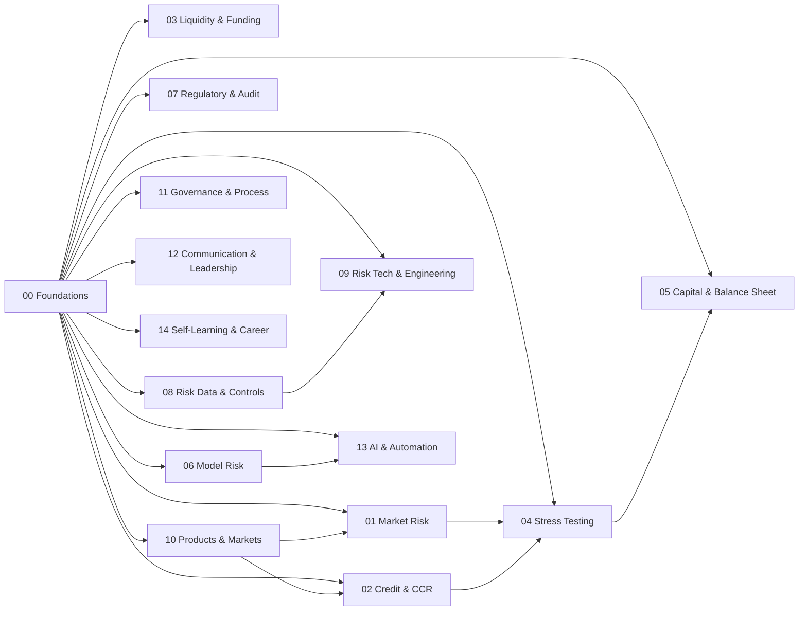

# Dependency Graph
**AS-OF:** 2026-03-05 11:49:38 EST

## Category-level flow

## Skill prerequisite map
| Skill | Depends On |
|---|---|
| [Risk Organization Map](skills/00_foundations/01_risk_organization_map.md) | None |
| [Core Financial Math for Risk](skills/00_foundations/02_core_financial_math_for_risk.md) | [01 Risk Organization Map](skills/00_foundations/01_risk_organization_map.md) |
| [Portfolio Aggregation and Concentration](skills/00_foundations/03_portfolio_aggregation_and_concentration.md) | [02 Core Financial Math For Risk](skills/00_foundations/02_core_financial_math_for_risk.md) |
| [Risk Measurement vs Management](skills/00_foundations/04_risk_measurement_vs_management.md) | [03 Portfolio Aggregation And Concentration](skills/00_foundations/03_portfolio_aggregation_and_concentration.md) |
| [Controls, Issues, and Audit Trail Mindset](skills/00_foundations/05_controls_issues_and_audit_trail_mindset.md) | [04 Risk Measurement Vs Management](skills/00_foundations/04_risk_measurement_vs_management.md) |
| [Risk Limits Taxonomy](skills/00_foundations/06_risk_limits_taxonomy.md) | [05 Controls Issues And Audit Trail Mindset](skills/00_foundations/05_controls_issues_and_audit_trail_mindset.md) |
| [Risk Data Flow and Book of Record](skills/00_foundations/07_risk_data_flow_and_book_of_record.md) | [06 Risk Limits Taxonomy](skills/00_foundations/06_risk_limits_taxonomy.md) |
| [Risk Operating Rhythm and Reporting Calendar](skills/00_foundations/08_risk_operating_rhythm_and_reporting_calendar.md) | [07 Risk Data Flow And Book Of Record](skills/00_foundations/07_risk_data_flow_and_book_of_record.md) |
| [VaR Frameworks Parametric Historical Monte Carlo](skills/01_market_risk/01_var_frameworks_parametric_historical_monte_carlo.md) | [01 Risk Organization Map](skills/00_foundations/01_risk_organization_map.md) [02 Core Financial Math For Risk](skills/00_foundations/02_core_financial_math_for_risk.md) |
| [Expected Shortfall Framework and Reporting](skills/01_market_risk/02_expected_shortfall_framework_and_reporting.md) | [01 Risk Organization Map](skills/00_foundations/01_risk_organization_map.md) [02 Core Financial Math For Risk](skills/00_foundations/02_core_financial_math_for_risk.md) [01 Var Frameworks Parametric Historical Monte Carlo](skills/01_market_risk/01_var_frameworks_parametric_historical_monte_carlo.md) |
| [Market Risk Sensitivities and Bucketed Risk](skills/01_market_risk/03_market_risk_sensitivities_and_bucketed_risk.md) | [01 Risk Organization Map](skills/00_foundations/01_risk_organization_map.md) [02 Core Financial Math For Risk](skills/00_foundations/02_core_financial_math_for_risk.md) [02 Expected Shortfall Framework And Reporting](skills/01_market_risk/02_expected_shortfall_framework_and_reporting.md) |
| [Backtesting and Exception Governance](skills/01_market_risk/04_backtesting_and_exception_governance.md) | [01 Risk Organization Map](skills/00_foundations/01_risk_organization_map.md) [02 Core Financial Math For Risk](skills/00_foundations/02_core_financial_math_for_risk.md) [03 Market Risk Sensitivities And Bucketed Risk](skills/01_market_risk/03_market_risk_sensitivities_and_bucketed_risk.md) |
| [Desk Stress Testing Design](skills/01_market_risk/05_desk_stress_testing_design.md) | [01 Risk Organization Map](skills/00_foundations/01_risk_organization_map.md) [02 Core Financial Math For Risk](skills/00_foundations/02_core_financial_math_for_risk.md) [04 Backtesting And Exception Governance](skills/01_market_risk/04_backtesting_and_exception_governance.md) |
| [Concentration Risk Monitoring and Actioning](skills/01_market_risk/06_concentration_risk_monitoring_and_actioning.md) | [01 Risk Organization Map](skills/00_foundations/01_risk_organization_map.md) [02 Core Financial Math For Risk](skills/00_foundations/02_core_financial_math_for_risk.md) [05 Desk Stress Testing Design](skills/01_market_risk/05_desk_stress_testing_design.md) |
| [PnL Explain Clean PnL and Attribution](skills/01_market_risk/07_pnl_explain_clean_pnl_and_attribution.md) | [01 Risk Organization Map](skills/00_foundations/01_risk_organization_map.md) [02 Core Financial Math For Risk](skills/00_foundations/02_core_financial_math_for_risk.md) [06 Concentration Risk Monitoring And Actioning](skills/01_market_risk/06_concentration_risk_monitoring_and_actioning.md) |
| [XVA Overview for Market Risk Interfaces](skills/01_market_risk/08_xva_overview_for_market_risk_interfaces.md) | [01 Risk Organization Map](skills/00_foundations/01_risk_organization_map.md) [02 Core Financial Math For Risk](skills/00_foundations/02_core_financial_math_for_risk.md) [07 Pnl Explain Clean Pnl And Attribution](skills/01_market_risk/07_pnl_explain_clean_pnl_and_attribution.md) |
| [Exposure Metrics EPE ENE and PFE](skills/02_credit_and_ccr/01_exposure_metrics_epe_ene_and_pfe.md) | [01 Risk Organization Map](skills/00_foundations/01_risk_organization_map.md) [02 Core Financial Math For Risk](skills/00_foundations/02_core_financial_math_for_risk.md) |
| [Netting and CSA Fundamentals](skills/02_credit_and_ccr/02_netting_and_csa_fundamentals.md) | [01 Risk Organization Map](skills/00_foundations/01_risk_organization_map.md) [02 Core Financial Math For Risk](skills/00_foundations/02_core_financial_math_for_risk.md) [01 Exposure Metrics Epe Ene And Pfe](skills/02_credit_and_ccr/01_exposure_metrics_epe_ene_and_pfe.md) |
| [Margining and Collateral Management](skills/02_credit_and_ccr/03_margining_and_collateral_management.md) | [01 Risk Organization Map](skills/00_foundations/01_risk_organization_map.md) [02 Core Financial Math For Risk](skills/00_foundations/02_core_financial_math_for_risk.md) [02 Netting And Csa Fundamentals](skills/02_credit_and_ccr/02_netting_and_csa_fundamentals.md) |
| [Wrong Way Risk Detection and Escalation](skills/02_credit_and_ccr/04_wrong_way_risk_detection_and_escalation.md) | [01 Risk Organization Map](skills/00_foundations/01_risk_organization_map.md) [02 Core Financial Math For Risk](skills/00_foundations/02_core_financial_math_for_risk.md) [03 Margining And Collateral Management](skills/02_credit_and_ccr/03_margining_and_collateral_management.md) |
| [CVA Basics and Hedging Intuition](skills/02_credit_and_ccr/05_cva_basics_and_hedging_intuition.md) | [01 Risk Organization Map](skills/00_foundations/01_risk_organization_map.md) [02 Core Financial Math For Risk](skills/00_foundations/02_core_financial_math_for_risk.md) [04 Wrong Way Risk Detection And Escalation](skills/02_credit_and_ccr/04_wrong_way_risk_detection_and_escalation.md) |
| [FVA Overview and Funding Interactions](skills/02_credit_and_ccr/06_fva_overview_and_funding_interactions.md) | [01 Risk Organization Map](skills/00_foundations/01_risk_organization_map.md) [02 Core Financial Math For Risk](skills/00_foundations/02_core_financial_math_for_risk.md) [05 Cva Basics And Hedging Intuition](skills/02_credit_and_ccr/05_cva_basics_and_hedging_intuition.md) |
| [CCR Limits Framework](skills/02_credit_and_ccr/07_ccr_limits_framework.md) | [01 Risk Organization Map](skills/00_foundations/01_risk_organization_map.md) [02 Core Financial Math For Risk](skills/00_foundations/02_core_financial_math_for_risk.md) [06 Fva Overview And Funding Interactions](skills/02_credit_and_ccr/06_fva_overview_and_funding_interactions.md) |
| [Credit Products Risk Basics CDS Indices Tranches](skills/02_credit_and_ccr/08_credit_products_risk_basics_cds_indices_tranches.md) | [01 Risk Organization Map](skills/00_foundations/01_risk_organization_map.md) [02 Core Financial Math For Risk](skills/00_foundations/02_core_financial_math_for_risk.md) [07 Ccr Limits Framework](skills/02_credit_and_ccr/07_ccr_limits_framework.md) |
| [Funding Curve Construction Basics](skills/03_liquidity_and_funding/01_funding_curve_construction_basics.md) | [01 Risk Organization Map](skills/00_foundations/01_risk_organization_map.md) [02 Core Financial Math For Risk](skills/00_foundations/02_core_financial_math_for_risk.md) |
| [Liquidity Horizons and Holding Period Assumptions](skills/03_liquidity_and_funding/02_liquidity_horizons_and_holding_period_assumptions.md) | [01 Risk Organization Map](skills/00_foundations/01_risk_organization_map.md) [02 Core Financial Math For Risk](skills/00_foundations/02_core_financial_math_for_risk.md) [01 Funding Curve Construction Basics](skills/03_liquidity_and_funding/01_funding_curve_construction_basics.md) |
| [Margin Liquidity Risk Mechanics](skills/03_liquidity_and_funding/03_margin_liquidity_risk_mechanics.md) | [01 Risk Organization Map](skills/00_foundations/01_risk_organization_map.md) [02 Core Financial Math For Risk](skills/00_foundations/02_core_financial_math_for_risk.md) [02 Liquidity Horizons And Holding Period Assumptions](skills/03_liquidity_and_funding/02_liquidity_horizons_and_holding_period_assumptions.md) |
| [Contingent Liquidity Planning](skills/03_liquidity_and_funding/04_contingent_liquidity_planning.md) | [01 Risk Organization Map](skills/00_foundations/01_risk_organization_map.md) [02 Core Financial Math For Risk](skills/00_foundations/02_core_financial_math_for_risk.md) [03 Margin Liquidity Risk Mechanics](skills/03_liquidity_and_funding/03_margin_liquidity_risk_mechanics.md) |
| [LCR Basics and Monitoring](skills/03_liquidity_and_funding/05_lcr_basics_and_monitoring.md) | [01 Risk Organization Map](skills/00_foundations/01_risk_organization_map.md) [02 Core Financial Math For Risk](skills/00_foundations/02_core_financial_math_for_risk.md) [04 Contingent Liquidity Planning](skills/03_liquidity_and_funding/04_contingent_liquidity_planning.md) |
| [NSFR Basics and Monitoring](skills/03_liquidity_and_funding/06_nsfr_basics_and_monitoring.md) | [01 Risk Organization Map](skills/00_foundations/01_risk_organization_map.md) [02 Core Financial Math For Risk](skills/00_foundations/02_core_financial_math_for_risk.md) [05 Lcr Basics And Monitoring](skills/03_liquidity_and_funding/05_lcr_basics_and_monitoring.md) |
| [Market Liquidity Risk Measurement](skills/03_liquidity_and_funding/07_market_liquidity_risk_measurement.md) | [01 Risk Organization Map](skills/00_foundations/01_risk_organization_map.md) [02 Core Financial Math For Risk](skills/00_foundations/02_core_financial_math_for_risk.md) [06 Nsfr Basics And Monitoring](skills/03_liquidity_and_funding/06_nsfr_basics_and_monitoring.md) |
| [Intraday Liquidity and Collateral Mobility](skills/03_liquidity_and_funding/08_intraday_liquidity_and_collateral_mobility.md) | [01 Risk Organization Map](skills/00_foundations/01_risk_organization_map.md) [02 Core Financial Math For Risk](skills/00_foundations/02_core_financial_math_for_risk.md) [07 Market Liquidity Risk Measurement](skills/03_liquidity_and_funding/07_market_liquidity_risk_measurement.md) |
| [Scenario Design Framework Macro to Market](skills/04_stress_testing_and_scenarios/01_scenario_design_framework_macro_to_market.md) | [01 Risk Organization Map](skills/00_foundations/01_risk_organization_map.md) [02 Core Financial Math For Risk](skills/00_foundations/02_core_financial_math_for_risk.md) |
| [Shock Calibration Methods and Governance](skills/04_stress_testing_and_scenarios/02_shock_calibration_methods_and_governance.md) | [01 Risk Organization Map](skills/00_foundations/01_risk_organization_map.md) [02 Core Financial Math For Risk](skills/00_foundations/02_core_financial_math_for_risk.md) [01 Scenario Design Framework Macro To Market](skills/04_stress_testing_and_scenarios/01_scenario_design_framework_macro_to_market.md) |
| [Reverse Stress Testing Playbook](skills/04_stress_testing_and_scenarios/03_reverse_stress_testing_playbook.md) | [01 Risk Organization Map](skills/00_foundations/01_risk_organization_map.md) [02 Core Financial Math For Risk](skills/00_foundations/02_core_financial_math_for_risk.md) [02 Shock Calibration Methods And Governance](skills/04_stress_testing_and_scenarios/02_shock_calibration_methods_and_governance.md) |
| [Scenario PnL Explain and Remediation](skills/04_stress_testing_and_scenarios/04_scenario_pnl_explain_and_remediation.md) | [01 Risk Organization Map](skills/00_foundations/01_risk_organization_map.md) [02 Core Financial Math For Risk](skills/00_foundations/02_core_financial_math_for_risk.md) [03 Reverse Stress Testing Playbook](skills/04_stress_testing_and_scenarios/03_reverse_stress_testing_playbook.md) |
| [Multi Factor Scenario Generation](skills/04_stress_testing_and_scenarios/05_multi_factor_scenario_generation.md) | [01 Risk Organization Map](skills/00_foundations/01_risk_organization_map.md) [02 Core Financial Math For Risk](skills/00_foundations/02_core_financial_math_for_risk.md) [04 Scenario Pnl Explain And Remediation](skills/04_stress_testing_and_scenarios/04_scenario_pnl_explain_and_remediation.md) |
| [Stress Data Lineage and Controls](skills/04_stress_testing_and_scenarios/06_stress_data_lineage_and_controls.md) | [01 Risk Organization Map](skills/00_foundations/01_risk_organization_map.md) [02 Core Financial Math For Risk](skills/00_foundations/02_core_financial_math_for_risk.md) [05 Multi Factor Scenario Generation](skills/04_stress_testing_and_scenarios/05_multi_factor_scenario_generation.md) |
| [Stress Governance and Effective Challenge](skills/04_stress_testing_and_scenarios/07_stress_governance_and_effective_challenge.md) | [01 Risk Organization Map](skills/00_foundations/01_risk_organization_map.md) [02 Core Financial Math For Risk](skills/00_foundations/02_core_financial_math_for_risk.md) [06 Stress Data Lineage And Controls](skills/04_stress_testing_and_scenarios/06_stress_data_lineage_and_controls.md) |
| [Scenario Communication for Committees](skills/04_stress_testing_and_scenarios/08_scenario_communication_for_committees.md) | [01 Risk Organization Map](skills/00_foundations/01_risk_organization_map.md) [02 Core Financial Math For Risk](skills/00_foundations/02_core_financial_math_for_risk.md) [07 Stress Governance And Effective Challenge](skills/04_stress_testing_and_scenarios/07_stress_governance_and_effective_challenge.md) |
| [RWA Drivers for CIB Portfolios](skills/05_capital_and_balance_sheet/01_rwa_drivers_for_cib_portfolios.md) | [01 Risk Organization Map](skills/00_foundations/01_risk_organization_map.md) [02 Core Financial Math For Risk](skills/00_foundations/02_core_financial_math_for_risk.md) |
| [Capital Ratio Bridge Analysis](skills/05_capital_and_balance_sheet/02_capital_ratio_bridge_analysis.md) | [01 Risk Organization Map](skills/00_foundations/01_risk_organization_map.md) [02 Core Financial Math For Risk](skills/00_foundations/02_core_financial_math_for_risk.md) [01 Rwa Drivers For Cib Portfolios](skills/05_capital_and_balance_sheet/01_rwa_drivers_for_cib_portfolios.md) |
| [Economic vs Regulatory Capital Distinctions](skills/05_capital_and_balance_sheet/03_economic_vs_regulatory_capital_distinctions.md) | [01 Risk Organization Map](skills/00_foundations/01_risk_organization_map.md) [02 Core Financial Math For Risk](skills/00_foundations/02_core_financial_math_for_risk.md) [02 Capital Ratio Bridge Analysis](skills/05_capital_and_balance_sheet/02_capital_ratio_bridge_analysis.md) |
| [Capital Allocation and Risk Adjusted Pricing](skills/05_capital_and_balance_sheet/04_capital_allocation_and_risk_adjusted_pricing.md) | [01 Risk Organization Map](skills/00_foundations/01_risk_organization_map.md) [02 Core Financial Math For Risk](skills/00_foundations/02_core_financial_math_for_risk.md) [03 Economic Vs Regulatory Capital Distinctions](skills/05_capital_and_balance_sheet/03_economic_vs_regulatory_capital_distinctions.md) |
| [Balance Sheet Scarcity and Constraints](skills/05_capital_and_balance_sheet/05_balance_sheet_scarcity_and_constraints.md) | [01 Risk Organization Map](skills/00_foundations/01_risk_organization_map.md) [02 Core Financial Math For Risk](skills/00_foundations/02_core_financial_math_for_risk.md) [04 Capital Allocation And Risk Adjusted Pricing](skills/05_capital_and_balance_sheet/04_capital_allocation_and_risk_adjusted_pricing.md) |
| [Leverage Ratio Impacts](skills/05_capital_and_balance_sheet/06_leverage_ratio_impacts.md) | [01 Risk Organization Map](skills/00_foundations/01_risk_organization_map.md) [02 Core Financial Math For Risk](skills/00_foundations/02_core_financial_math_for_risk.md) [05 Balance Sheet Scarcity And Constraints](skills/05_capital_and_balance_sheet/05_balance_sheet_scarcity_and_constraints.md) |
| [RWA Optimization with Control Discipline](skills/05_capital_and_balance_sheet/07_rwa_optimization_with_control_discipline.md) | [01 Risk Organization Map](skills/00_foundations/01_risk_organization_map.md) [02 Core Financial Math For Risk](skills/00_foundations/02_core_financial_math_for_risk.md) [06 Leverage Ratio Impacts](skills/05_capital_and_balance_sheet/06_leverage_ratio_impacts.md) |
| [Stress Capital Linkage](skills/05_capital_and_balance_sheet/08_stress_capital_linkage.md) | [01 Risk Organization Map](skills/00_foundations/01_risk_organization_map.md) [02 Core Financial Math For Risk](skills/00_foundations/02_core_financial_math_for_risk.md) [07 Rwa Optimization With Control Discipline](skills/05_capital_and_balance_sheet/07_rwa_optimization_with_control_discipline.md) |
| [SR 11 7 Model Lifecycle](skills/06_model_risk_and_validation/01_sr_11_7_model_lifecycle.md) | [01 Risk Organization Map](skills/00_foundations/01_risk_organization_map.md) [02 Core Financial Math For Risk](skills/00_foundations/02_core_financial_math_for_risk.md) |
| [Model Inventory and Tiering](skills/06_model_risk_and_validation/02_model_inventory_and_tiering.md) | [01 Risk Organization Map](skills/00_foundations/01_risk_organization_map.md) [02 Core Financial Math For Risk](skills/00_foundations/02_core_financial_math_for_risk.md) [01 Sr 11 7 Model Lifecycle](skills/06_model_risk_and_validation/01_sr_11_7_model_lifecycle.md) |
| [Model Development Documentation MDD](skills/06_model_risk_and_validation/03_model_development_documentation_mdd.md) | [01 Risk Organization Map](skills/00_foundations/01_risk_organization_map.md) [02 Core Financial Math For Risk](skills/00_foundations/02_core_financial_math_for_risk.md) [02 Model Inventory And Tiering](skills/06_model_risk_and_validation/02_model_inventory_and_tiering.md) |
| [Independent Validation Documentation VDD](skills/06_model_risk_and_validation/04_independent_validation_documentation_vdd.md) | [01 Risk Organization Map](skills/00_foundations/01_risk_organization_map.md) [02 Core Financial Math For Risk](skills/00_foundations/02_core_financial_math_for_risk.md) [03 Model Development Documentation Mdd](skills/06_model_risk_and_validation/03_model_development_documentation_mdd.md) |
| [Ongoing Monitoring and Threshold Design](skills/06_model_risk_and_validation/05_ongoing_monitoring_and_threshold_design.md) | [01 Risk Organization Map](skills/00_foundations/01_risk_organization_map.md) [02 Core Financial Math For Risk](skills/00_foundations/02_core_financial_math_for_risk.md) [04 Independent Validation Documentation Vdd](skills/06_model_risk_and_validation/04_independent_validation_documentation_vdd.md) |
| [Sensitivity and Benchmark Testing](skills/06_model_risk_and_validation/06_sensitivity_and_benchmark_testing.md) | [01 Risk Organization Map](skills/00_foundations/01_risk_organization_map.md) [02 Core Financial Math For Risk](skills/00_foundations/02_core_financial_math_for_risk.md) [05 Ongoing Monitoring And Threshold Design](skills/06_model_risk_and_validation/05_ongoing_monitoring_and_threshold_design.md) |
| [Outcomes Analysis and Backtesting](skills/06_model_risk_and_validation/07_outcomes_analysis_and_backtesting.md) | [01 Risk Organization Map](skills/00_foundations/01_risk_organization_map.md) [02 Core Financial Math For Risk](skills/00_foundations/02_core_financial_math_for_risk.md) [06 Sensitivity And Benchmark Testing](skills/06_model_risk_and_validation/06_sensitivity_and_benchmark_testing.md) |
| [Model Change Management and Controls](skills/06_model_risk_and_validation/08_model_change_management_and_controls.md) | [01 Risk Organization Map](skills/00_foundations/01_risk_organization_map.md) [02 Core Financial Math For Risk](skills/00_foundations/02_core_financial_math_for_risk.md) [07 Outcomes Analysis And Backtesting](skills/06_model_risk_and_validation/07_outcomes_analysis_and_backtesting.md) |
| [Audit Ready Documentation](skills/07_regulatory_and_audit/01_audit_ready_documentation.md) | [01 Risk Organization Map](skills/00_foundations/01_risk_organization_map.md) [02 Core Financial Math For Risk](skills/00_foundations/02_core_financial_math_for_risk.md) |
| [Issue Management Root Cause and CAPA](skills/07_regulatory_and_audit/02_issue_management_root_cause_and_capa.md) | [01 Risk Organization Map](skills/00_foundations/01_risk_organization_map.md) [02 Core Financial Math For Risk](skills/00_foundations/02_core_financial_math_for_risk.md) [01 Audit Ready Documentation](skills/07_regulatory_and_audit/01_audit_ready_documentation.md) |
| [Exam Readiness Control Room](skills/07_regulatory_and_audit/03_exam_readiness_control_room.md) | [01 Risk Organization Map](skills/00_foundations/01_risk_organization_map.md) [02 Core Financial Math For Risk](skills/00_foundations/02_core_financial_math_for_risk.md) [02 Issue Management Root Cause And Capa](skills/07_regulatory_and_audit/02_issue_management_root_cause_and_capa.md) |
| [Evidence Management and Traceability](skills/07_regulatory_and_audit/04_evidence_management_and_traceability.md) | [01 Risk Organization Map](skills/00_foundations/01_risk_organization_map.md) [02 Core Financial Math For Risk](skills/00_foundations/02_core_financial_math_for_risk.md) [03 Exam Readiness Control Room](skills/07_regulatory_and_audit/03_exam_readiness_control_room.md) |
| [Policy Standard and Procedure Alignment](skills/07_regulatory_and_audit/05_policy_standard_and_procedure_alignment.md) | [01 Risk Organization Map](skills/00_foundations/01_risk_organization_map.md) [02 Core Financial Math For Risk](skills/00_foundations/02_core_financial_math_for_risk.md) [04 Evidence Management And Traceability](skills/07_regulatory_and_audit/04_evidence_management_and_traceability.md) |
| [Regulatory Change Impact Assessment](skills/07_regulatory_and_audit/06_regulatory_change_impact_assessment.md) | [01 Risk Organization Map](skills/00_foundations/01_risk_organization_map.md) [02 Core Financial Math For Risk](skills/00_foundations/02_core_financial_math_for_risk.md) [05 Policy Standard And Procedure Alignment](skills/07_regulatory_and_audit/05_policy_standard_and_procedure_alignment.md) |
| [First Second and Third Line Coordination](skills/07_regulatory_and_audit/07_first_second_and_third_line_coordination.md) | [01 Risk Organization Map](skills/00_foundations/01_risk_organization_map.md) [02 Core Financial Math For Risk](skills/00_foundations/02_core_financial_math_for_risk.md) [06 Regulatory Change Impact Assessment](skills/07_regulatory_and_audit/06_regulatory_change_impact_assessment.md) |
| [MRIA MRA and Commitment Tracking](skills/07_regulatory_and_audit/08_mria_mra_and_commitment_tracking.md) | [01 Risk Organization Map](skills/00_foundations/01_risk_organization_map.md) [02 Core Financial Math For Risk](skills/00_foundations/02_core_financial_math_for_risk.md) [07 First Second And Third Line Coordination](skills/07_regulatory_and_audit/07_first_second_and_third_line_coordination.md) |
| [Data Quality Dimensions Framework](skills/08_risk_data_and_controls/01_data_quality_dimensions_framework.md) | [01 Risk Organization Map](skills/00_foundations/01_risk_organization_map.md) [02 Core Financial Math For Risk](skills/00_foundations/02_core_financial_math_for_risk.md) |
| [Reconciliation Design and Break Management](skills/08_risk_data_and_controls/02_reconciliation_design_and_break_management.md) | [01 Risk Organization Map](skills/00_foundations/01_risk_organization_map.md) [02 Core Financial Math For Risk](skills/00_foundations/02_core_financial_math_for_risk.md) [01 Data Quality Dimensions Framework](skills/08_risk_data_and_controls/01_data_quality_dimensions_framework.md) |
| [Golden Source and Data Contracts](skills/08_risk_data_and_controls/03_golden_source_and_data_contracts.md) | [01 Risk Organization Map](skills/00_foundations/01_risk_organization_map.md) [02 Core Financial Math For Risk](skills/00_foundations/02_core_financial_math_for_risk.md) [02 Reconciliation Design And Break Management](skills/08_risk_data_and_controls/02_reconciliation_design_and_break_management.md) |
| [Lineage Mapping for Risk Metrics](skills/08_risk_data_and_controls/04_lineage_mapping_for_risk_metrics.md) | [01 Risk Organization Map](skills/00_foundations/01_risk_organization_map.md) [02 Core Financial Math For Risk](skills/00_foundations/02_core_financial_math_for_risk.md) [03 Golden Source And Data Contracts](skills/08_risk_data_and_controls/03_golden_source_and_data_contracts.md) |
| [KPI KRI Design for Risk Processes](skills/08_risk_data_and_controls/05_kpi_kri_design_for_risk_processes.md) | [01 Risk Organization Map](skills/00_foundations/01_risk_organization_map.md) [02 Core Financial Math For Risk](skills/00_foundations/02_core_financial_math_for_risk.md) [04 Lineage Mapping For Risk Metrics](skills/08_risk_data_and_controls/04_lineage_mapping_for_risk_metrics.md) |
| [Access Controls and Segregation of Duties](skills/08_risk_data_and_controls/06_access_controls_and_segregation_of_duties.md) | [01 Risk Organization Map](skills/00_foundations/01_risk_organization_map.md) [02 Core Financial Math For Risk](skills/00_foundations/02_core_financial_math_for_risk.md) [05 Kpi Kri Design For Risk Processes](skills/08_risk_data_and_controls/05_kpi_kri_design_for_risk_processes.md) |
| [Control Testing and Attestation](skills/08_risk_data_and_controls/07_control_testing_and_attestation.md) | [01 Risk Organization Map](skills/00_foundations/01_risk_organization_map.md) [02 Core Financial Math For Risk](skills/00_foundations/02_core_financial_math_for_risk.md) [06 Access Controls And Segregation Of Duties](skills/08_risk_data_and_controls/06_access_controls_and_segregation_of_duties.md) |
| [Metadata Management and Glossary Governance](skills/08_risk_data_and_controls/08_metadata_management_and_glossary_governance.md) | [01 Risk Organization Map](skills/00_foundations/01_risk_organization_map.md) [02 Core Financial Math For Risk](skills/00_foundations/02_core_financial_math_for_risk.md) [07 Control Testing And Attestation](skills/08_risk_data_and_controls/07_control_testing_and_attestation.md) |
| [SQL for Risk Analytics](skills/09_risk_technology_and_engineering/01_sql_for_risk_analytics.md) | [01 Risk Organization Map](skills/00_foundations/01_risk_organization_map.md) [02 Core Financial Math For Risk](skills/00_foundations/02_core_financial_math_for_risk.md) |
| [Python for Risk Analytics](skills/09_risk_technology_and_engineering/02_python_for_risk_analytics.md) | [01 Risk Organization Map](skills/00_foundations/01_risk_organization_map.md) [02 Core Financial Math For Risk](skills/00_foundations/02_core_financial_math_for_risk.md) [01 Sql For Risk Analytics](skills/09_risk_technology_and_engineering/01_sql_for_risk_analytics.md) |
| [Reproducible Notebooks and Research](skills/09_risk_technology_and_engineering/03_reproducible_notebooks_and_research.md) | [01 Risk Organization Map](skills/00_foundations/01_risk_organization_map.md) [02 Core Financial Math For Risk](skills/00_foundations/02_core_financial_math_for_risk.md) [02 Python For Risk Analytics](skills/09_risk_technology_and_engineering/02_python_for_risk_analytics.md) |
| [PowerBI for Risk Reporting](skills/09_risk_technology_and_engineering/04_powerbi_for_risk_reporting.md) | [01 Risk Organization Map](skills/00_foundations/01_risk_organization_map.md) [02 Core Financial Math For Risk](skills/00_foundations/02_core_financial_math_for_risk.md) [03 Reproducible Notebooks And Research](skills/09_risk_technology_and_engineering/03_reproducible_notebooks_and_research.md) |
| [Git Workflows for Risk Teams](skills/09_risk_technology_and_engineering/05_git_workflows_for_risk_teams.md) | [01 Risk Organization Map](skills/00_foundations/01_risk_organization_map.md) [02 Core Financial Math For Risk](skills/00_foundations/02_core_financial_math_for_risk.md) [04 Powerbi For Risk Reporting](skills/09_risk_technology_and_engineering/04_powerbi_for_risk_reporting.md) |
| [Testing and CI for Risk Code](skills/09_risk_technology_and_engineering/06_testing_and_ci_for_risk_code.md) | [01 Risk Organization Map](skills/00_foundations/01_risk_organization_map.md) [02 Core Financial Math For Risk](skills/00_foundations/02_core_financial_math_for_risk.md) [05 Git Workflows For Risk Teams](skills/09_risk_technology_and_engineering/05_git_workflows_for_risk_teams.md) |
| [Data Pipeline Orchestration and Monitoring](skills/09_risk_technology_and_engineering/07_data_pipeline_orchestration_and_monitoring.md) | [01 Risk Organization Map](skills/00_foundations/01_risk_organization_map.md) [02 Core Financial Math For Risk](skills/00_foundations/02_core_financial_math_for_risk.md) [06 Testing And Ci For Risk Code](skills/09_risk_technology_and_engineering/06_testing_and_ci_for_risk_code.md) |
| [Observability and Incident Response for Risk Systems](skills/09_risk_technology_and_engineering/08_observability_and_incident_response_for_risk_systems.md) | [01 Risk Organization Map](skills/00_foundations/01_risk_organization_map.md) [02 Core Financial Math For Risk](skills/00_foundations/02_core_financial_math_for_risk.md) [07 Data Pipeline Orchestration And Monitoring](skills/09_risk_technology_and_engineering/07_data_pipeline_orchestration_and_monitoring.md) |
| [Rates Products Risk Drivers](skills/10_products_and_markets/01_rates_products_risk_drivers.md) | [01 Risk Organization Map](skills/00_foundations/01_risk_organization_map.md) [02 Core Financial Math For Risk](skills/00_foundations/02_core_financial_math_for_risk.md) |
| [FX Products Risk Drivers](skills/10_products_and_markets/02_fx_products_risk_drivers.md) | [01 Risk Organization Map](skills/00_foundations/01_risk_organization_map.md) [02 Core Financial Math For Risk](skills/00_foundations/02_core_financial_math_for_risk.md) [01 Rates Products Risk Drivers](skills/10_products_and_markets/01_rates_products_risk_drivers.md) |
| [Credit Products Risk Drivers](skills/10_products_and_markets/03_credit_products_risk_drivers.md) | [01 Risk Organization Map](skills/00_foundations/01_risk_organization_map.md) [02 Core Financial Math For Risk](skills/00_foundations/02_core_financial_math_for_risk.md) [02 Fx Products Risk Drivers](skills/10_products_and_markets/02_fx_products_risk_drivers.md) |
| [Equity Derivatives Risk Drivers](skills/10_products_and_markets/04_equity_derivatives_risk_drivers.md) | [01 Risk Organization Map](skills/00_foundations/01_risk_organization_map.md) [02 Core Financial Math For Risk](skills/00_foundations/02_core_financial_math_for_risk.md) [03 Credit Products Risk Drivers](skills/10_products_and_markets/03_credit_products_risk_drivers.md) |
| [Commodity Products Risk Drivers](skills/10_products_and_markets/05_commodity_products_risk_drivers.md) | [01 Risk Organization Map](skills/00_foundations/01_risk_organization_map.md) [02 Core Financial Math For Risk](skills/00_foundations/02_core_financial_math_for_risk.md) [04 Equity Derivatives Risk Drivers](skills/10_products_and_markets/04_equity_derivatives_risk_drivers.md) |
| [Structured Products Key Risks](skills/10_products_and_markets/06_structured_products_key_risks.md) | [01 Risk Organization Map](skills/00_foundations/01_risk_organization_map.md) [02 Core Financial Math For Risk](skills/00_foundations/02_core_financial_math_for_risk.md) [05 Commodity Products Risk Drivers](skills/10_products_and_markets/05_commodity_products_risk_drivers.md) |
| [Securitized Products and Tranches](skills/10_products_and_markets/07_securitized_products_and_tranches.md) | [01 Risk Organization Map](skills/00_foundations/01_risk_organization_map.md) [02 Core Financial Math For Risk](skills/00_foundations/02_core_financial_math_for_risk.md) [06 Structured Products Key Risks](skills/10_products_and_markets/06_structured_products_key_risks.md) |
| [Cross Asset Basis and Correlation Risk](skills/10_products_and_markets/08_cross_asset_basis_and_correlation_risk.md) | [01 Risk Organization Map](skills/00_foundations/01_risk_organization_map.md) [02 Core Financial Math For Risk](skills/00_foundations/02_core_financial_math_for_risk.md) [07 Securitized Products And Tranches](skills/10_products_and_markets/07_securitized_products_and_tranches.md) |
| [Limit Framework Design and Governance](skills/11_governance_and_process/01_limit_framework_design_and_governance.md) | [01 Risk Organization Map](skills/00_foundations/01_risk_organization_map.md) [02 Core Financial Math For Risk](skills/00_foundations/02_core_financial_math_for_risk.md) |
| [Limit Breach Escalation Playbook](skills/11_governance_and_process/02_limit_breach_escalation_playbook.md) | [01 Risk Organization Map](skills/00_foundations/01_risk_organization_map.md) [02 Core Financial Math For Risk](skills/00_foundations/02_core_financial_math_for_risk.md) [01 Limit Framework Design And Governance](skills/11_governance_and_process/01_limit_framework_design_and_governance.md) |
| [Committee Pack Authoring for CRO MRC](skills/11_governance_and_process/03_committee_pack_authoring_for_cro_mrc.md) | [01 Risk Organization Map](skills/00_foundations/01_risk_organization_map.md) [02 Core Financial Math For Risk](skills/00_foundations/02_core_financial_math_for_risk.md) [02 Limit Breach Escalation Playbook](skills/11_governance_and_process/02_limit_breach_escalation_playbook.md) |
| [Change Management and Control Impact Assessment](skills/11_governance_and_process/04_change_management_and_control_impact_assessment.md) | [01 Risk Organization Map](skills/00_foundations/01_risk_organization_map.md) [02 Core Financial Math For Risk](skills/00_foundations/02_core_financial_math_for_risk.md) [03 Committee Pack Authoring For Cro Mrc](skills/11_governance_and_process/03_committee_pack_authoring_for_cro_mrc.md) |
| [BAU vs Project Execution Model](skills/11_governance_and_process/05_bau_vs_project_execution_model.md) | [01 Risk Organization Map](skills/00_foundations/01_risk_organization_map.md) [02 Core Financial Math For Risk](skills/00_foundations/02_core_financial_math_for_risk.md) [04 Change Management And Control Impact Assessment](skills/11_governance_and_process/04_change_management_and_control_impact_assessment.md) |
| [Risk Appetite Translation to Limits](skills/11_governance_and_process/06_risk_appetite_translation_to_limits.md) | [01 Risk Organization Map](skills/00_foundations/01_risk_organization_map.md) [02 Core Financial Math For Risk](skills/00_foundations/02_core_financial_math_for_risk.md) [05 Bau Vs Project Execution Model](skills/11_governance_and_process/05_bau_vs_project_execution_model.md) |
| [Decision Log and RAID Management](skills/11_governance_and_process/07_decision_log_and_raid_management.md) | [01 Risk Organization Map](skills/00_foundations/01_risk_organization_map.md) [02 Core Financial Math For Risk](skills/00_foundations/02_core_financial_math_for_risk.md) [06 Risk Appetite Translation To Limits](skills/11_governance_and_process/06_risk_appetite_translation_to_limits.md) |
| [Control Self Assessment Process](skills/11_governance_and_process/08_control_self_assessment_process.md) | [01 Risk Organization Map](skills/00_foundations/01_risk_organization_map.md) [02 Core Financial Math For Risk](skills/00_foundations/02_core_financial_math_for_risk.md) [07 Decision Log And Raid Management](skills/11_governance_and_process/07_decision_log_and_raid_management.md) |
| [Executive Summary Writing for Risk](skills/12_communication_and_leadership/01_executive_summary_writing_for_risk.md) | [01 Risk Organization Map](skills/00_foundations/01_risk_organization_map.md) [02 Core Financial Math For Risk](skills/00_foundations/02_core_financial_math_for_risk.md) |
| [Storytelling with Risk Data](skills/12_communication_and_leadership/02_storytelling_with_risk_data.md) | [01 Risk Organization Map](skills/00_foundations/01_risk_organization_map.md) [02 Core Financial Math For Risk](skills/00_foundations/02_core_financial_math_for_risk.md) [01 Executive Summary Writing For Risk](skills/12_communication_and_leadership/01_executive_summary_writing_for_risk.md) |
| [Stakeholder Mapping and Influence Strategy](skills/12_communication_and_leadership/03_stakeholder_mapping_and_influence_strategy.md) | [01 Risk Organization Map](skills/00_foundations/01_risk_organization_map.md) [02 Core Financial Math For Risk](skills/00_foundations/02_core_financial_math_for_risk.md) [02 Storytelling With Risk Data](skills/12_communication_and_leadership/02_storytelling_with_risk_data.md) |
| [Challenge Meeting Facilitation](skills/12_communication_and_leadership/04_challenge_meeting_facilitation.md) | [01 Risk Organization Map](skills/00_foundations/01_risk_organization_map.md) [02 Core Financial Math For Risk](skills/00_foundations/02_core_financial_math_for_risk.md) [03 Stakeholder Mapping And Influence Strategy](skills/12_communication_and_leadership/03_stakeholder_mapping_and_influence_strategy.md) |
| [Conflict Management in Risk Decisions](skills/12_communication_and_leadership/05_conflict_management_in_risk_decisions.md) | [01 Risk Organization Map](skills/00_foundations/01_risk_organization_map.md) [02 Core Financial Math For Risk](skills/00_foundations/02_core_financial_math_for_risk.md) [04 Challenge Meeting Facilitation](skills/12_communication_and_leadership/04_challenge_meeting_facilitation.md) |
| [Upward Management and Expectation Setting](skills/12_communication_and_leadership/06_upward_management_and_expectation_setting.md) | [01 Risk Organization Map](skills/00_foundations/01_risk_organization_map.md) [02 Core Financial Math For Risk](skills/00_foundations/02_core_financial_math_for_risk.md) [05 Conflict Management In Risk Decisions](skills/12_communication_and_leadership/05_conflict_management_in_risk_decisions.md) |
| [Coaching and Feedback for Analysts](skills/12_communication_and_leadership/07_coaching_and_feedback_for_analysts.md) | [01 Risk Organization Map](skills/00_foundations/01_risk_organization_map.md) [02 Core Financial Math For Risk](skills/00_foundations/02_core_financial_math_for_risk.md) [06 Upward Management And Expectation Setting](skills/12_communication_and_leadership/06_upward_management_and_expectation_setting.md) |
| [Crisis Communication for Market Events](skills/12_communication_and_leadership/08_crisis_communication_for_market_events.md) | [01 Risk Organization Map](skills/00_foundations/01_risk_organization_map.md) [02 Core Financial Math For Risk](skills/00_foundations/02_core_financial_math_for_risk.md) [07 Coaching And Feedback For Analysts](skills/12_communication_and_leadership/07_coaching_and_feedback_for_analysts.md) |
| [Agentic AI Use Cases in Risk](skills/13_ai_and_automation/01_agentic_ai_use_cases_in_risk.md) | [01 Risk Organization Map](skills/00_foundations/01_risk_organization_map.md) [02 Core Financial Math For Risk](skills/00_foundations/02_core_financial_math_for_risk.md) |
| [Prompting Standards for Risk Tasks](skills/13_ai_and_automation/02_prompting_standards_for_risk_tasks.md) | [01 Risk Organization Map](skills/00_foundations/01_risk_organization_map.md) [02 Core Financial Math For Risk](skills/00_foundations/02_core_financial_math_for_risk.md) [01 Agentic Ai Use Cases In Risk](skills/13_ai_and_automation/01_agentic_ai_use_cases_in_risk.md) |
| [Evaluation Harness for LLM Outputs](skills/13_ai_and_automation/03_evaluation_harness_for_llm_outputs.md) | [01 Risk Organization Map](skills/00_foundations/01_risk_organization_map.md) [02 Core Financial Math For Risk](skills/00_foundations/02_core_financial_math_for_risk.md) [02 Prompting Standards For Risk Tasks](skills/13_ai_and_automation/02_prompting_standards_for_risk_tasks.md) |
| [RAG for Risk Knowledge Bases](skills/13_ai_and_automation/04_rag_for_risk_knowledge_bases.md) | [01 Risk Organization Map](skills/00_foundations/01_risk_organization_map.md) [02 Core Financial Math For Risk](skills/00_foundations/02_core_financial_math_for_risk.md) [03 Evaluation Harness For Llm Outputs](skills/13_ai_and_automation/03_evaluation_harness_for_llm_outputs.md) |
| [Automation Safety and Approval Gates](skills/13_ai_and_automation/05_automation_safety_and_approval_gates.md) | [01 Risk Organization Map](skills/00_foundations/01_risk_organization_map.md) [02 Core Financial Math For Risk](skills/00_foundations/02_core_financial_math_for_risk.md) [04 Rag For Risk Knowledge Bases](skills/13_ai_and_automation/04_rag_for_risk_knowledge_bases.md) |
| [AI Logging Replay and Auditability](skills/13_ai_and_automation/06_ai_logging_replay_and_auditability.md) | [01 Risk Organization Map](skills/00_foundations/01_risk_organization_map.md) [02 Core Financial Math For Risk](skills/00_foundations/02_core_financial_math_for_risk.md) [05 Automation Safety And Approval Gates](skills/13_ai_and_automation/05_automation_safety_and_approval_gates.md) |
| [Privacy Security and Compliance for AI](skills/13_ai_and_automation/07_privacy_security_and_compliance_for_ai.md) | [01 Risk Organization Map](skills/00_foundations/01_risk_organization_map.md) [02 Core Financial Math For Risk](skills/00_foundations/02_core_financial_math_for_risk.md) [06 Ai Logging Replay And Auditability](skills/13_ai_and_automation/06_ai_logging_replay_and_auditability.md) |
| [Human in the Loop Operating Model](skills/13_ai_and_automation/08_human_in_the_loop_operating_model.md) | [01 Risk Organization Map](skills/00_foundations/01_risk_organization_map.md) [02 Core Financial Math For Risk](skills/00_foundations/02_core_financial_math_for_risk.md) [07 Privacy Security And Compliance For Ai](skills/13_ai_and_automation/07_privacy_security_and_compliance_for_ai.md) |
| [Personal Risk Second Brain](skills/14_self_learning_and_career/01_personal_risk_second_brain.md) | [01 Risk Organization Map](skills/00_foundations/01_risk_organization_map.md) [02 Core Financial Math For Risk](skills/00_foundations/02_core_financial_math_for_risk.md) |
| [Spaced Repetition System for Risk Concepts](skills/14_self_learning_and_career/02_spaced_repetition_system_for_risk_concepts.md) | [01 Risk Organization Map](skills/00_foundations/01_risk_organization_map.md) [02 Core Financial Math For Risk](skills/00_foundations/02_core_financial_math_for_risk.md) [01 Personal Risk Second Brain](skills/14_self_learning_and_career/01_personal_risk_second_brain.md) |
| [Weekly Deliberate Practice Loop](skills/14_self_learning_and_career/03_weekly_deliberate_practice_loop.md) | [01 Risk Organization Map](skills/00_foundations/01_risk_organization_map.md) [02 Core Financial Math For Risk](skills/00_foundations/02_core_financial_math_for_risk.md) [02 Spaced Repetition System For Risk Concepts](skills/14_self_learning_and_career/02_spaced_repetition_system_for_risk_concepts.md) |
| [Portfolio of Evidence Building](skills/14_self_learning_and_career/04_portfolio_of_evidence_building.md) | [01 Risk Organization Map](skills/00_foundations/01_risk_organization_map.md) [02 Core Financial Math For Risk](skills/00_foundations/02_core_financial_math_for_risk.md) [03 Weekly Deliberate Practice Loop](skills/14_self_learning_and_career/03_weekly_deliberate_practice_loop.md) |
| [Interview and Case Prep Framework](skills/14_self_learning_and_career/05_interview_and_case_prep_framework.md) | [01 Risk Organization Map](skills/00_foundations/01_risk_organization_map.md) [02 Core Financial Math For Risk](skills/00_foundations/02_core_financial_math_for_risk.md) [04 Portfolio Of Evidence Building](skills/14_self_learning_and_career/04_portfolio_of_evidence_building.md) |
| [Mentor Network and Sponsorship Map](skills/14_self_learning_and_career/06_mentor_network_and_sponsorship_map.md) | [01 Risk Organization Map](skills/00_foundations/01_risk_organization_map.md) [02 Core Financial Math For Risk](skills/00_foundations/02_core_financial_math_for_risk.md) [05 Interview And Case Prep Framework](skills/14_self_learning_and_career/05_interview_and_case_prep_framework.md) |
| [Career Ladder and Skill Gap Analysis](skills/14_self_learning_and_career/07_career_ladder_and_skill_gap_analysis.md) | [01 Risk Organization Map](skills/00_foundations/01_risk_organization_map.md) [02 Core Financial Math For Risk](skills/00_foundations/02_core_financial_math_for_risk.md) [06 Mentor Network And Sponsorship Map](skills/14_self_learning_and_career/06_mentor_network_and_sponsorship_map.md) |
| [Learning from Incidents and Postmortems](skills/14_self_learning_and_career/08_learning_from_incidents_and_postmortems.md) | [01 Risk Organization Map](skills/00_foundations/01_risk_organization_map.md) [02 Core Financial Math For Risk](skills/00_foundations/02_core_financial_math_for_risk.md) [07 Career Ladder And Skill Gap Analysis](skills/14_self_learning_and_career/07_career_ladder_and_skill_gap_analysis.md) |

## Consistency rule
All prerequisite links in this file are generated from the same metadata used in each skill file and in [SKILLS_INDEX.md](SKILLS_INDEX.md).
