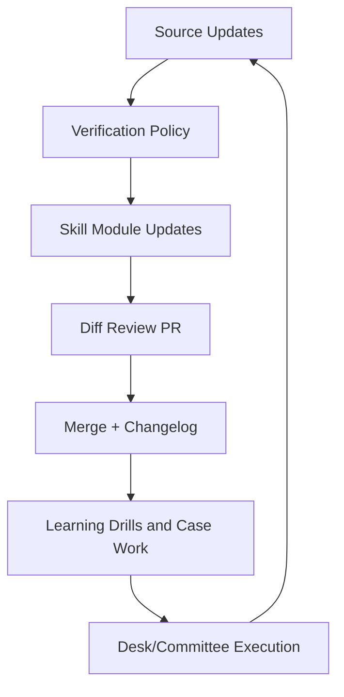

# CIB Risk Skills OS
**AS-OF:** 2026-03-05 11:49:38 EST

Institutional-grade, tool-ready, audit-defensible skills library for Corporate & Investment Banking (CIB) Risk across market, credit/CCR, liquidity, stress, capital, model risk, data, technology, governance, AI, and career execution.

## Repository layout
- [Skills Index](SKILLS_INDEX.md)
- [Dependency Graph](DEPENDENCY_GRAPH.md)
- [Learning System](LEARNING_SYSTEM.md)
- [Update Playbook](UPDATE_PLAYBOOK.md)
- [Verification Policy](VERIFICATION_POLICY.md)
- [Operating Model](OPERATING_MODEL.md)
- [Prompt-to-Skill Mapping](PROMPT_SKILL_MAPPING.md)
- [Delivery Standards](DELIVERY_STANDARDS.md)
- [Role Paths (Analyst to ED)](ROLE_PATHS_ANALYST_TO_ED.md)
- [Execution Scorecard](EXECUTION_SCORECARD.md)
- [Templates](templates/)
- [Changelog](CHANGELOG.md)
- [Authoritative Sources](sources/authoritative_sources.md)
- [RSS and Watchlist](sources/rss_and_watchlist.md)

## Operating model (visual)

## Category coverage
| Category Code | Category | Skill Modules | Overview |
|---|---|---:|---|
| `00_foundations` | Foundations | 8 | [Open](skills/00_foundations/_category_overview.md) |
| `01_market_risk` | Market Risk | 8 | [Open](skills/01_market_risk/_category_overview.md) |
| `02_credit_and_ccr` | Credit and Counterparty Risk (CCR) | 8 | [Open](skills/02_credit_and_ccr/_category_overview.md) |
| `03_liquidity_and_funding` | Liquidity and Funding Risk | 8 | [Open](skills/03_liquidity_and_funding/_category_overview.md) |
| `04_stress_testing_and_scenarios` | Stress Testing and Scenarios | 8 | [Open](skills/04_stress_testing_and_scenarios/_category_overview.md) |
| `05_capital_and_balance_sheet` | Capital and Balance Sheet | 8 | [Open](skills/05_capital_and_balance_sheet/_category_overview.md) |
| `06_model_risk_and_validation` | Model Risk and Validation | 8 | [Open](skills/06_model_risk_and_validation/_category_overview.md) |
| `07_regulatory_and_audit` | Regulatory and Audit | 8 | [Open](skills/07_regulatory_and_audit/_category_overview.md) |
| `08_risk_data_and_controls` | Risk Data and Controls | 8 | [Open](skills/08_risk_data_and_controls/_category_overview.md) |
| `09_risk_technology_and_engineering` | Risk Technology and Engineering | 8 | [Open](skills/09_risk_technology_and_engineering/_category_overview.md) |
| `10_products_and_markets` | Products and Markets | 8 | [Open](skills/10_products_and_markets/_category_overview.md) |
| `11_governance_and_process` | Governance and Process | 8 | [Open](skills/11_governance_and_process/_category_overview.md) |
| `12_communication_and_leadership` | Communication and Leadership | 8 | [Open](skills/12_communication_and_leadership/_category_overview.md) |
| `13_ai_and_automation` | AI and Automation | 8 | [Open](skills/13_ai_and_automation/_category_overview.md) |
| `14_self_learning_and_career` | Self-Learning and Career | 8 | [Open](skills/14_self_learning_and_career/_category_overview.md) |

## Quality controls
- Every skill module follows the mandatory template with playbook, pitfalls, exercises, quality bar, and citations.
- Regulatory/policy definitions must be cited to authoritative references or marked **Unconfirmed** per [Verification Policy](VERIFICATION_POLICY.md).
- Updates run on weekly and monthly cadences via [Update Playbook](UPDATE_PLAYBOOK.md).

## Citation baseline
Core source hierarchy is maintained in [sources/authoritative_sources.md](sources/authoritative_sources.md), prioritizing BIS/BCBS, Federal Reserve/OCC/SEC/CFTC, ESMA/EBA, IOSCO, ISDA, IMF, and major exchange rulebooks.

## Prompt integration
Use the production prompt library in [`../../prompts/`](../../prompts/README.md) and route each prompt through this skill system using [Prompt-to-Skill Mapping](PROMPT_SKILL_MAPPING.md).
